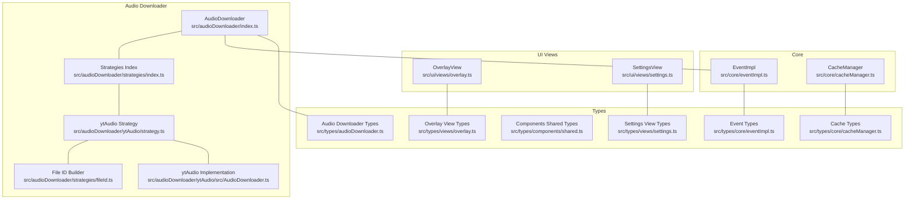
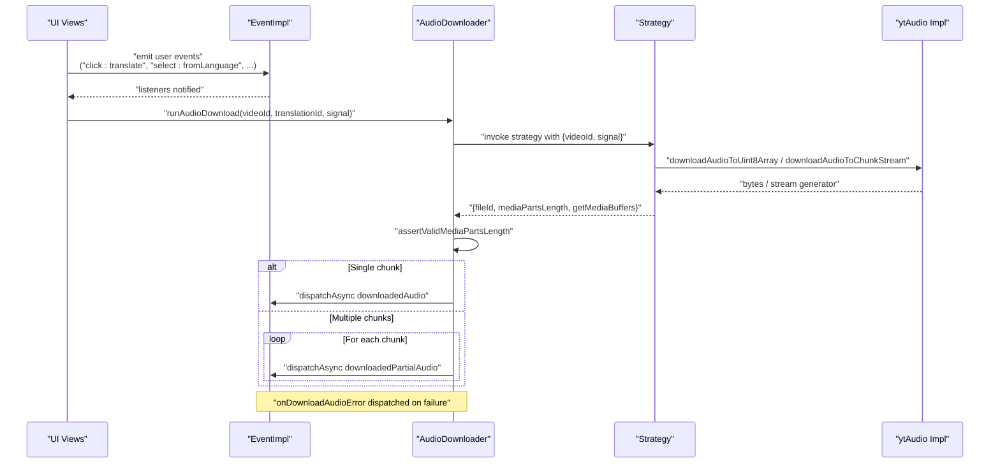
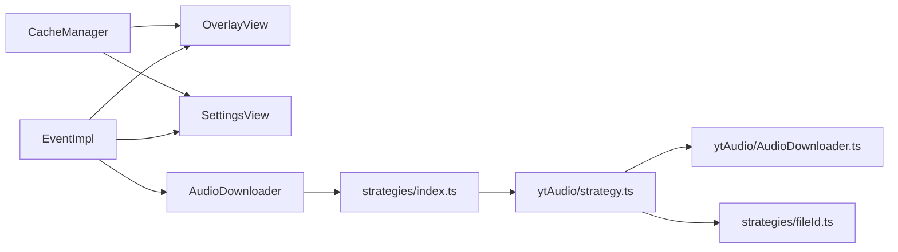

# API Reference

<cite>
**Referenced Files in This Document**
- [eventImpl.ts](file://src/core/eventImpl.ts)
- [cacheManager.ts](file://src/core/cacheManager.ts)
- [eventImpl.ts (types)](file://src/types/core/eventImpl.ts)
- [cacheManager.ts (types)](file://src/types/core/cacheManager.ts)
- [shared.ts (components)](file://src/types/components/shared.ts)
- [overlay.ts (views types)](file://src/types/views/overlay.ts)
- [settings.ts (views types)](file://src/types/views/settings.ts)
- [audioDownloader.ts (types)](file://src/types/audioDownloader.ts)
- [audioDownloader/index.ts](file://src/audioDownloader/index.ts)
- [ytAudio/strategy.ts](file://src/audioDownloader/ytAudio/strategy.ts)
- [ytAudio/AudioDownloader.ts](file://src/audioDownloader/ytAudio/src/AudioDownloader.ts)
- [strategies/index.ts](file://src/audioDownloader/strategies/index.ts)
- [strategies/fileId.ts](file://src/audioDownloader/strategies/fileId.ts)
- [overlay.ts (UI view)](file://src/ui/views/overlay.ts)
- [settings.ts (UI view)](file://src/ui/views/settings.ts)
</cite>

## Table of Contents
1. [Introduction](#introduction)
2. [Project Structure](#project-structure)
3. [Core Components](#core-components)
4. [Architecture Overview](#architecture-overview)
5. [Detailed Component Analysis](#detailed-component-analysis)
6. [Dependency Analysis](#dependency-analysis)
7. [Performance Considerations](#performance-considerations)
8. [Troubleshooting Guide](#troubleshooting-guide)
9. [Conclusion](#conclusion)
10. [Appendices](#appendices)

## Introduction
This document provides a comprehensive API reference for the English Teacher extension’s public interfaces. It covers:
- The event system with event types, handlers, and propagation patterns
- The cache manager API with caching strategies, invalidation, and storage semantics
- Component APIs for shared interfaces, props, and event handling
- View APIs for overlay and settings panels, including state management and user interaction handling
- Audio downloader APIs with strategy interfaces, configuration options, and callback patterns
- TypeScript type definitions, interface specifications, and parameter documentation
- Examples of usage patterns and integration scenarios
- Error handling, validation rules, and exception management
- Versioning, backward compatibility considerations, and migration guidance
- Performance characteristics, memory usage, and optimization recommendations

## Project Structure
The extension organizes its public APIs across core modules, types, UI views, and audio downloading subsystems. The following diagram highlights the primary modules and their relationships.

**Diagram sources**
- [eventImpl.ts:11-67](file://src/core/eventImpl.ts#L11-L67)
- [cacheManager.ts:27-118](file://src/core/cacheManager.ts#L27-L118)
- [eventImpl.ts (types):14-16](file://src/types/core/eventImpl.ts#L14-L16)
- [cacheManager.ts (types):3-20](file://src/types/core/cacheManager.ts#L3-L20)
- [overlay.ts (views types):7-40](file://src/types/views/overlay.ts#L7-L40)
- [settings.ts (views types):7-37](file://src/types/views/settings.ts#L7-L37)
- [audioDownloader.ts (types):14-88](file://src/types/audioDownloader.ts#L14-L88)
- [overlay.ts (UI view):29-84](file://src/ui/views/overlay.ts#L29-L84)
- [settings.ts (UI view):99-108](file://src/ui/views/settings.ts#L99-L108)
- [audioDownloader/index.ts:87-188](file://src/audioDownloader/index.ts#L87-L188)
- [strategies/index.ts:1-9](file://src/audioDownloader/strategies/index.ts#L1-L9)
- [ytAudio/strategy.ts:74-154](file://src/audioDownloader/ytAudio/strategy.ts#L74-L154)
- [ytAudio/AudioDownloader.ts:357-667](file://src/audioDownloader/ytAudio/src/AudioDownloader.ts#L357-L667)
- [strategies/fileId.ts:3-15](file://src/audioDownloader/strategies/fileId.ts#L3-L15)

**Section sources**
- [eventImpl.ts:1-68](file://src/core/eventImpl.ts#L1-L68)
- [cacheManager.ts:1-119](file://src/core/cacheManager.ts#L1-L119)
- [overlay.ts (UI view):1-120](file://src/ui/views/overlay.ts#L1-L120)
- [settings.ts (UI view):1-120](file://src/ui/views/settings.ts#L1-L120)
- [audioDownloader/index.ts:1-189](file://src/audioDownloader/index.ts#L1-L189)

## Core Components
This section documents the foundational APIs used across the extension.

### Event System
The event system is a lightweight, dependency-free emitter with strong typing and safe propagation.

- Class: EventImpl<Args>
  - Purpose: Type-safe event emission with synchronous and asynchronous dispatch modes
  - Key methods:
    - addListener(handler): Registers a listener
    - removeListener(handler): Unregisters a listener
    - dispatch(...args): Synchronously invokes all listeners; exceptions are caught and logged
    - dispatchAsync(...args): Asynchronously invokes listeners; aggregates settled promises and logs rejections
    - clear(): Removes all listeners
  - Properties:
    - size: Number of registered listeners
  - Notes:
    - Idempotent registration: adding the same listener twice is a no-op
    - Isolated exceptions: a failing listener does not prevent others from firing

- Handler Type: EventHandler<Args>
  - Signature: (...args: Args) => void | Promise<void>
  - Strongly typed argument tuples enable precise event typing

Usage patterns:
- Subscribe to events via addListener and unsubscribe via removeListener
- Use dispatch for immediate reactions; use dispatchAsync for concurrent listeners with error aggregation

**Section sources**
- [eventImpl.ts:11-67](file://src/core/eventImpl.ts#L11-L67)
- [eventImpl.ts (types):14-16](file://src/types/core/eventImpl.ts#L14-L16)

### Cache Manager
The cache manager provides in-memory caching with TTL for translations and subtitles.

- Class: CacheManager
  - Purpose: Store and retrieve translation and subtitle entries keyed by a stable video identifier
  - Constants:
    - YANDEX_TTL_MS: 2 hours default TTL
  - Methods:
    - clear(): Drops all cached entries
    - getTranslation(key): Retrieves translation payload or undefined
    - setTranslation(key, translation): Stores translation payload
    - getSubtitles(key): Retrieves subtitles array or undefined
    - setSubtitles(key, subtitles): Stores subtitles array
    - deleteSubtitles(key): Removes subtitles entry and prunes empty records
  - Internal behavior:
    - Expiration checks invalidate expired entries on read
    - Automatic eviction removes entries when both translation and subtitles are undefined
    - Lazy creation of entries on first write

- Types:
  - CacheTranslationSuccess: Translation metadata with identifiers and flags
  - CacheSubtitle: Alias to external subtitle data type
  - CacheVideoById: Entry record with optional fields and internal expiration timestamps

Validation and error handling:
- Reads check expiration and prune stale entries automatically
- Writes set expiration timestamps based on TTL

**Section sources**
- [cacheManager.ts:27-118](file://src/core/cacheManager.ts#L27-L118)
- [cacheManager.ts (types):3-20](file://src/types/core/cacheManager.ts#L3-L20)

## Architecture Overview
The extension composes the event system and cache manager into cohesive UI and audio subsystems. The UI views emit user-driven events, while the audio downloader emits download progress and completion events. Strategies encapsulate platform-specific fetching logic.

**Diagram sources**
- [overlay.ts (UI view):468-520](file://src/ui/views/overlay.ts#L468-L520)
- [audioDownloader/index.ts:28-85](file://src/audioDownloader/index.ts#L28-L85)
- [ytAudio/strategy.ts:74-154](file://src/audioDownloader/ytAudio/strategy.ts#L74-L154)
- [ytAudio/AudioDownloader.ts:513-582](file://src/audioDownloader/ytAudio/src/AudioDownloader.ts#L513-L582)

## Detailed Component Analysis

### Event System API
- EventImpl<Args>
  - Dispatch patterns:
    - Synchronous: dispatch(...) for immediate reactions
    - Asynchronous: dispatchAsync(...) for concurrent listeners with settled promise logging
  - Propagation:
    - Iterates over registered listeners
    - Exceptions are caught and logged; subsequent listeners are unaffected
- EventHandler<Args>
  - Tuple-based arguments ensure precise typing across emitter and listeners

Integration tips:
- Use addEventListener/removeEventListener patterns on higher-level classes (e.g., AudioDownloader) for ergonomic subscription
- Prefer dispatchAsync when listeners may perform I/O or long-running tasks

**Section sources**
- [eventImpl.ts:11-67](file://src/core/eventImpl.ts#L11-L67)
- [eventImpl.ts (types):14-16](file://src/types/core/eventImpl.ts#L14-L16)

### Cache Manager API
- Public methods:
  - clear(): Clear all entries
  - get/set Translation: Manage translation payloads
  - get/set/delete Subtitles: Manage subtitle arrays
- TTL and invalidation:
  - Entries expire after YANDEX_TTL_MS
  - On read, expired entries are cleared and undefined is returned
- Storage semantics:
  - In-memory Map keyed by stable video identifiers
  - Automatic pruning when both fields are undefined

Best practices:
- Invalidate cache on runtime setting changes that affect cached URLs or failure states
- Use getSubtitles with a composite cache key derived from video and language parameters

**Section sources**
- [cacheManager.ts:27-118](file://src/core/cacheManager.ts#L27-L118)
- [cacheManager.ts (types):3-20](file://src/types/core/cacheManager.ts#L3-L20)

### Component APIs
- Shared component type:
  - LitHtml: Union of string, HTMLElement, or TemplateResult for flexible rendering targets

- Overlay view props and events:
  - Props: mount, globalPortal, data, videoHandler, intervalIdleChecker
  - Events: "click:settings", "click:pip", "click:downloadTranslation", "click:downloadSubtitles", "click:translate", "input:videoVolume", "input:translationVolume", "select:fromLanguage", "select:toLanguage", "select:subtitles", "click:learnMode"

- Settings view props and events:
  - Props: globalPortal, data, videoHandler
  - Events: numerous toggles, sliders, selects, and actions (e.g., "change:autoTranslate", "input:subtitlesFontSize", "select:buttonPosition")

- Event handling patterns:
  - Views expose addEventListener/removeEventListener for each event category
  - Internal event emitters are instances of EventImpl<T>

**Section sources**
- [shared.ts (components):1-4](file://src/types/components/shared.ts#L1-L4)
- [overlay.ts (views types):20-40](file://src/types/views/overlay.ts#L20-L40)
- [settings.ts (views types):7-37](file://src/types/views/settings.ts#L7-L37)
- [overlay.ts (UI view):54-84](file://src/ui/views/overlay.ts#L54-L84)
- [settings.ts (UI view):30-42](file://src/ui/views/settings.ts#L30-L42)

### View APIs: Overlay Panel
- Initialization and lifecycle:
  - initUI(buttonPosition): Creates and mounts UI components
  - initUIEvents(): Binds DOM events and wires internal event emitters
  - updateMount(nextMount): Rebinds mount points when player container changes
- State management:
  - Tracks default volume persistence with debounced storage writes
  - Manages visibility and layout based on button position and container geometry
- User interaction handling:
  - Emits events for translate, PiP, download, language selection, and volume changes
  - Integrates with video handler for language preferences and subtitle loading

Usage example patterns:
- Subscribe to "select:fromLanguage" and "select:toLanguage" to update translation settings
- Listen to "input:translationVolume" to synchronize UI and persisted defaults

**Section sources**
- [overlay.ts (UI view):29-196](file://src/ui/views/overlay.ts#L29-L196)
- [overlay.ts (UI view):252-402](file://src/ui/views/overlay.ts#L252-L402)
- [overlay.ts (UI view):404-800](file://src/ui/views/overlay.ts#L404-L800)

### View APIs: Settings Panel
- Initialization and lifecycle:
  - initUI(): Renders accordion sections and controls
  - Internal event emitters for all settings-related events
- State management:
  - Debounced persistence for frequently updated settings (e.g., subtitle font size)
  - Controlled toggles and selects bound to storage keys
- User interaction handling:
  - Emits events for toggles, sliders, selects, and actions (e.g., "click:bugReport", "update:account")
  - Integrates with localization provider and environment detection

Usage example patterns:
- Subscribe to "change:useLivelyVoice" to enable/disable premium features
- Listen to "select:buttonPosition" to adjust overlay placement

**Section sources**
- [settings.ts (UI view):99-184](file://src/ui/views/settings.ts#L99-L184)
- [settings.ts (UI view):311-357](file://src/ui/views/settings.ts#L311-L357)
- [settings.ts (UI view):300-309](file://src/ui/views/settings.ts#L300-L309)

### Audio Downloader APIs
- Class: AudioDownloader
  - Events:
    - onDownloadedAudio: Emitted with single-chunk downloads
    - onDownloadedPartialAudio: Emitted per chunk for multi-part downloads
    - onDownloadAudioError: Emitted on failure with videoId
  - Methods:
    - runAudioDownload(videoId, translationId, signal): Orchestrates strategy execution and emits events
    - addEventListener(type, listener): Subscribe to specific events
    - removeEventListener(type, listener): Unsubscribe from events
  - Strategy selection:
    - strategy property selects the active strategy (default: YT_AUDIO_STRATEGY)

- Strategy Interfaces and Options:
  - Available strategies: ytAudio
  - Strategy function signature: getAudioFromAPIOptions with optional dependencies (chunkSize, fetchTimeoutMs, createDownloader)
  - Returns: { fileId, mediaPartsLength, getMediaBuffers } where getMediaBuffers yields Uint8Array chunks

- Types:
  - ChunkRange: start, end, mustExist
  - VideoIdPayload: videoId
  - DownloadAudioDataSource: enum-like union of data sources
  - SerializedRequestInitData: serializable subset of RequestInit
  - DownloadAudioDataIframeResponsePayload: payload for iframe responses
  - FetchMediaWithMetaOptions/FetchMediaWithMetaResult: chunked fetch options/results
  - GetAudioFromAPIOptions: { videoId, signal }
  - AudioDownloadRequestOptions: { audioDownloader, translationId, videoId, signal }
  - DownloadedAudioData/DownloadedPartialAudioData: emitted payloads

- Validation and error handling:
  - Assertions for media parts length and non-empty audio chunks
  - Throws descriptive errors on invalid inputs or missing data
  - Logs and emits onDownloadAudioError on failure

- Example usage patterns:
  - Subscribe to "downloadedPartialAudio" for streaming UI updates
  - Subscribe to "downloadedAudio" for single-blob handling
  - Use AbortSignal to cancel downloads

**Section sources**
- [audioDownloader/index.ts:87-188](file://src/audioDownloader/index.ts#L87-L188)
- [audioDownloader.ts (types):14-88](file://src/types/audioDownloader.ts#L14-L88)
- [ytAudio/strategy.ts:74-154](file://src/audioDownloader/ytAudio/strategy.ts#L74-L154)
- [ytAudio/AudioDownloader.ts:513-582](file://src/audioDownloader/ytAudio/src/AudioDownloader.ts#L513-L582)
- [strategies/index.ts:1-9](file://src/audioDownloader/strategies/index.ts#L1-L9)
- [strategies/fileId.ts:3-15](file://src/audioDownloader/strategies/fileId.ts#L3-L15)

## Dependency Analysis
The following diagram shows key dependencies among core APIs and UI components.

**Diagram sources**
- [eventImpl.ts:11-67](file://src/core/eventImpl.ts#L11-L67)
- [overlay.ts (UI view):29-84](file://src/ui/views/overlay.ts#L29-L84)
- [settings.ts (UI view):99-108](file://src/ui/views/settings.ts#L99-L108)
- [audioDownloader/index.ts:87-188](file://src/audioDownloader/index.ts#L87-L188)
- [strategies/index.ts:1-9](file://src/audioDownloader/strategies/index.ts#L1-L9)
- [ytAudio/strategy.ts:74-154](file://src/audioDownloader/ytAudio/strategy.ts#L74-L154)
- [ytAudio/AudioDownloader.ts:513-582](file://src/audioDownloader/ytAudio/src/AudioDownloader.ts#L513-L582)
- [strategies/fileId.ts:3-15](file://src/audioDownloader/strategies/fileId.ts#L3-L15)
- [cacheManager.ts:27-118](file://src/core/cacheManager.ts#L27-L118)

**Section sources**
- [overlay.ts (UI view):1-120](file://src/ui/views/overlay.ts#L1-L120)
- [settings.ts (UI view):1-120](file://src/ui/views/settings.ts#L1-L120)
- [audioDownloader/index.ts:1-189](file://src/audioDownloader/index.ts#L1-L189)

## Performance Considerations
- Event dispatch:
  - Synchronous dispatch is O(n) over registered listeners; keep listeners efficient
  - Asynchronous dispatch batches promises and logs rejections; suitable for I/O-bound listeners
- Cache manager:
  - O(1) average access via Map; TTL checks occur on read
  - Automatic eviction keeps memory bounded when entries are empty
- Audio downloader:
  - Streaming mode reduces peak memory by emitting partial chunks
  - Chunk size affects throughput and latency; tune via strategy dependencies
  - Range-based fetching improves reliability for audio-only streams
- UI views:
  - Debounced persistence minimizes storage writes during rapid changes
  - Mount updates avoid redundant DOM operations by moving existing nodes

[No sources needed since this section provides general guidance]

## Troubleshooting Guide
- Event handling:
  - If a listener throws, other listeners still fire; inspect console for logged exceptions
  - Use dispatchAsync to detect failures across multiple listeners
- Cache manager:
  - If cached data appears stale, call clear() on settings changes that affect URLs or proxies
  - On read, expired entries are invalidated automatically
- Audio downloader:
  - Empty audio or zero-length chunks cause assertions; verify network and strategy availability
  - On failure, onDownloadAudioError is emitted with the videoId; inspect logs for details
- UI views:
  - If events are not emitted, ensure initUIEvents() was called after initUI()
  - For mount updates, call updateMount() to rebind listeners and move nodes

**Section sources**
- [eventImpl.ts:28-62](file://src/core/eventImpl.ts#L28-L62)
- [cacheManager.ts:60-78](file://src/core/cacheManager.ts#L60-L78)
- [audioDownloader/index.ts:118-125](file://src/audioDownloader/index.ts#L118-L125)
- [overlay.ts (UI view):404-402](file://src/ui/views/overlay.ts#L404-L402)

## Conclusion
The English Teacher extension exposes a cohesive set of public APIs:
- A robust, strongly-typed event system for decoupled communication
- A compact cache manager with TTL and automatic invalidation
- Rich UI view APIs for overlay and settings with ergonomic event subscriptions
- A modular audio downloader with strategy-based fetching and streaming capabilities

These APIs are designed for maintainability, testability, and performance, with clear separation of concerns and explicit error handling.

[No sources needed since this section summarizes without analyzing specific files]

## Appendices

### API Versioning and Backward Compatibility
- EventImpl and related types are minimal and unlikely to change; prefer tuple-based args to preserve type safety across versions
- Cache manager types define stable shapes for translation and subtitles; additions should be additive to preserve backward compatibility
- Audio downloader types and strategy interfaces are versioned by strategy exports; introduce new strategies rather than modifying existing ones
- UI view event maps should evolve by adding new keys rather than renaming or removing existing ones

Migration guidance:
- When extending event maps, add new keys and keep old ones supported
- When evolving cache payloads, mark new fields as optional and handle undefined gracefully
- When adding strategies, export new strategy keys alongside existing ones

[No sources needed since this section provides general guidance]