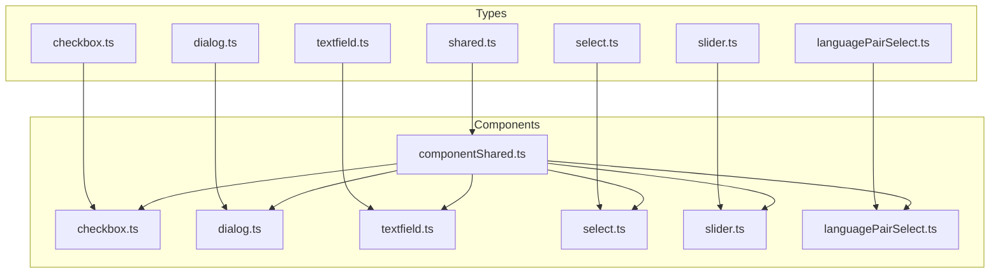
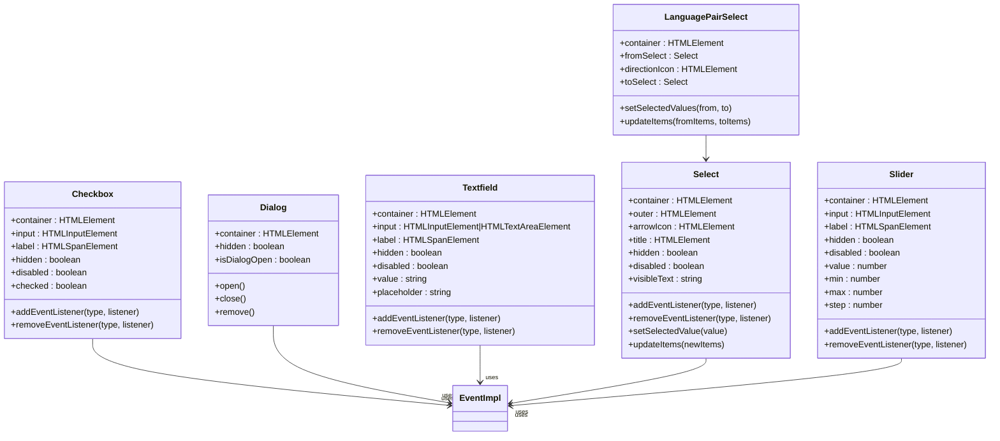
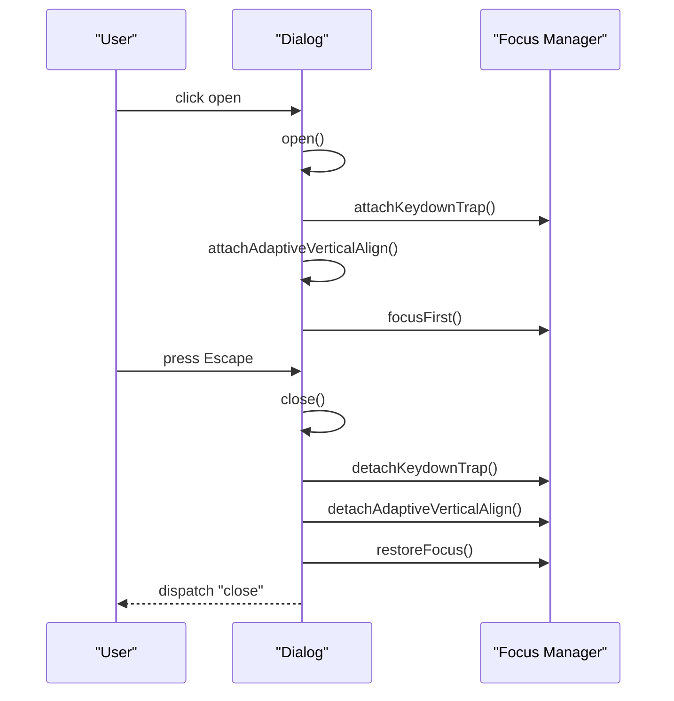
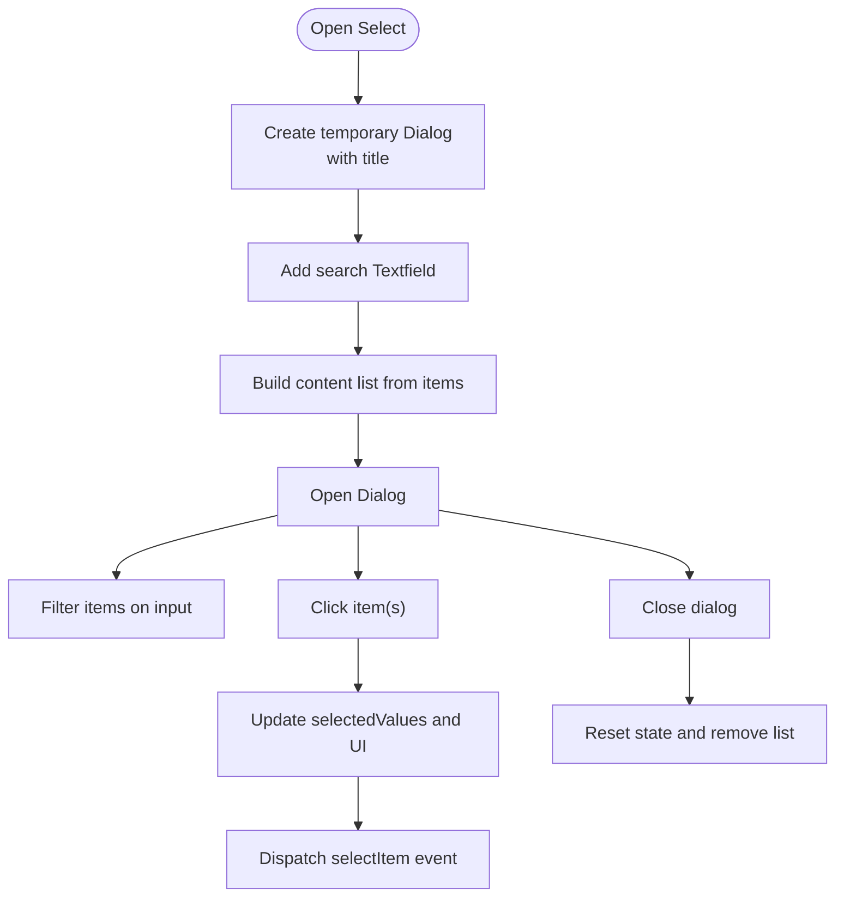
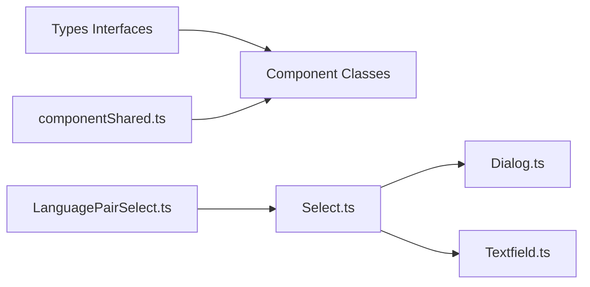

# Component APIs

<cite>
**Referenced Files in This Document**
- [shared.ts](file://src/types/components/shared.ts)
- [checkbox.ts](file://src/types/components/checkbox.ts)
- [dialog.ts](file://src/types/components/dialog.ts)
- [textfield.ts](file://src/types/components/textfield.ts)
- [select.ts](file://src/types/components/select.ts)
- [slider.ts](file://src/types/components/slider.ts)
- [languagePairSelect.ts](file://src/types/components/languagePairSelect.ts)
- [componentShared.ts](file://src/ui/components/componentShared.ts)
- [checkbox.ts](file://src/ui/components/checkbox.ts)
- [dialog.ts](file://src/ui/components/dialog.ts)
- [textfield.ts](file://src/ui/components/textfield.ts)
- [select.ts](file://src/ui/components/select.ts)
- [slider.ts](file://src/ui/components/slider.ts)
- [languagePairSelect.ts](file://src/ui/components/languagePairSelect.ts)
- [details.ts](file://src/ui/components/details.ts)
- [label.ts](file://src/ui/components/label.ts)
- [sliderLabel.ts](file://src/ui/components/sliderLabel.ts)
- [tooltip.ts](file://src/ui/components/tooltip.ts)
- [accountButton.ts](file://src/ui/components/accountButton.ts)
- [hotkeyButton.ts](file://src/ui/components/hotkeyButton.ts)
- [votButton.ts](file://src/ui/components/votButton.ts)
- [votMenu.ts](file://src/ui/components/votMenu.ts)
</cite>

## Table of Contents
1. [Introduction](#introduction)
2. [Project Structure](#project-structure)
3. [Core Components](#core-components)
4. [Architecture Overview](#architecture-overview)
5. [Detailed Component Analysis](#detailed-component-analysis)
6. [Dependency Analysis](#dependency-analysis)
7. [Performance Considerations](#performance-considerations)
8. [Troubleshooting Guide](#troubleshooting-guide)
9. [Conclusion](#conclusion)
10. [Appendices](#appendices)

## Introduction
This document provides comprehensive API documentation for the English Teacher extension’s UI component interfaces. It covers shared component interfaces, prop definitions, event handling patterns, and state management contracts. It also documents the checkbox, dialog, textfield, select, slider, and language pair select components, including TypeScript interface specifications, property definitions, method signatures, event callback types, usage examples, lifecycle methods, validation rules, accessibility attributes, styling customization options, composition patterns, reusability guidelines, and performance optimization techniques.

## Project Structure
The UI components are implemented as classes with consistent patterns:
- Props are defined in TypeScript interfaces under src/types/components/.
- Component implementations live under src/ui/components/.
- Shared utilities for event handling and DOM state live under src/ui/components/componentShared.ts.
- Styles for components are located under src/styles/components/.

**Diagram sources**
- [shared.ts:1-4](file://src/types/components/shared.ts#L1-L4)
- [checkbox.ts:1-8](file://src/types/components/checkbox.ts#L1-L8)
- [dialog.ts:1-8](file://src/types/components/dialog.ts#L1-L8)
- [textfield.ts:1-7](file://src/types/components/textfield.ts#L1-L7)
- [select.ts:1-32](file://src/types/components/select.ts#L1-L32)
- [slider.ts:1-10](file://src/types/components/slider.ts#L1-L10)
- [languagePairSelect.ts:1-17](file://src/types/components/languagePairSelect.ts#L1-L17)
- [componentShared.ts:1-39](file://src/ui/components/componentShared.ts#L1-L39)
- [checkbox.ts:1-114](file://src/ui/components/checkbox.ts#L1-L114)
- [dialog.ts:1-382](file://src/ui/components/dialog.ts#L1-L382)
- [textfield.ts:1-134](file://src/ui/components/textfield.ts#L1-L134)
- [select.ts:1-403](file://src/ui/components/select.ts#L1-L403)
- [slider.ts:1-171](file://src/ui/components/slider.ts#L1-L171)
- [languagePairSelect.ts:1-111](file://src/ui/components/languagePairSelect.ts#L1-L111)

**Section sources**
- [shared.ts:1-4](file://src/types/components/shared.ts#L1-L4)
- [checkbox.ts:1-8](file://src/types/components/checkbox.ts#L1-L8)
- [dialog.ts:1-8](file://src/types/components/dialog.ts#L1-L8)
- [textfield.ts:1-7](file://src/types/components/textfield.ts#L1-L7)
- [select.ts:1-32](file://src/types/components/select.ts#L1-L32)
- [slider.ts:1-10](file://src/types/components/slider.ts#L1-L10)
- [languagePairSelect.ts:1-17](file://src/types/components/languagePairSelect.ts#L1-L17)
- [componentShared.ts:1-39](file://src/ui/components/componentShared.ts#L1-L39)

## Core Components
This section summarizes the shared interfaces and common patterns used across components.

- Shared types
  - LitHtml: Union of string, HTMLElement, or lit-html TemplateResult for rendering label content.
- Event handling utilities
  - addComponentEventListener and removeComponentEventListener: Attach/detach listeners to internal EventImpl instances.
  - setHiddenState/getHiddenState: Manage hidden state and inert attributes for accessibility.

Common capabilities across components:
- Event-driven APIs with addEventListener/removeEventListener.
- Hidden state management via hidden getter/setter.
- Disabled state management via disabled getter/setter.
- Lifecycle: Construct with props, create DOM elements, attach listeners, expose public API.

**Section sources**
- [shared.ts:1-4](file://src/types/components/shared.ts#L1-L4)
- [componentShared.ts:1-39](file://src/ui/components/componentShared.ts#L1-L39)

## Architecture Overview
The components follow a consistent architecture:
- Props interfaces define constructor parameters and configuration.
- Component classes encapsulate DOM creation, event wiring, and state updates.
- Internal EventImpl instances emit typed events to consumers.
- Accessibility is enforced via ARIA roles, labels, inert attributes, and focus management.

**Diagram sources**
- [checkbox.ts:14-114](file://src/ui/components/checkbox.ts#L14-L114)
- [dialog.ts:12-382](file://src/ui/components/dialog.ts#L12-L382)
- [textfield.ts:11-134](file://src/ui/components/textfield.ts#L11-L134)
- [select.ts:22-403](file://src/ui/components/select.ts#L22-L403)
- [slider.ts:9-171](file://src/ui/components/slider.ts#L9-L171)
- [languagePairSelect.ts:10-111](file://src/ui/components/languagePairSelect.ts#L10-L111)

## Detailed Component Analysis

### Checkbox
- Purpose: Renders a labeled checkbox with optional sub-checkbox styling.
- Props interface: CheckboxProps
  - labelHtml: LitHtml
  - checked?: boolean
  - isSubCheckbox?: boolean
- Events
  - change: boolean (new checked state)
- Public API
  - addEventListener("change", (checked: boolean) => void)
  - removeEventListener("change", (checked: boolean) => void)
  - hidden: boolean
  - disabled: boolean
  - checked: boolean (setter triggers change event when value changes)
- Accessibility and styling
  - Adds a sub-checkbox class when isSubCheckbox is true.
  - Uses UI.createEl for consistent DOM creation.
- Usage example pattern
  - Instantiate with props.
  - Bind to change event to synchronize state.
  - Toggle hidden/disabled as needed.

**Section sources**
- [checkbox.ts:1-8](file://src/types/components/checkbox.ts#L1-L8)
- [checkbox.ts:14-114](file://src/ui/components/checkbox.ts#L14-L114)

### Dialog
- Purpose: Modal dialog with ARIA-compliant behavior, focus trap, and adaptive vertical alignment.
- Props interface: DialogProps
  - titleHtml: HTMLElement | string
  - isTemp?: boolean
- Events
  - close: ()
- Public API
  - open(): this
  - close(): this
  - remove(): this
  - addEventListener("close", () => void)
  - removeEventListener("close", () => void)
  - hidden: boolean (also toggles inert and aria-hidden)
  - isDialogOpen: boolean
- Accessibility
  - Role dialog, aria-modal, aria-labelledby.
  - Focus trap with Tab navigation and Escape handling.
  - Preserves and restores previously focused element.
- Lifecycle
  - Creates DOM on construction.
  - open attaches keydown trap and adaptive alignment observers.
  - close optionally removes the container depending on isTemp.
- Performance
  - Uses requestAnimationFrame for layout updates.
  - Observes visualViewport and resize for adaptive alignment.

**Diagram sources**
- [dialog.ts:157-189](file://src/ui/components/dialog.ts#L157-L189)
- [dialog.ts:321-366](file://src/ui/components/dialog.ts#L321-L366)

**Section sources**
- [dialog.ts:1-8](file://src/types/components/dialog.ts#L1-L8)
- [dialog.ts:12-382](file://src/ui/components/dialog.ts#L12-L382)

### Textfield
- Purpose: Single-line or multi-line input with label and placeholder support.
- Props interface: TextfieldProps
  - labelHtml: HTMLElement | string
  - placeholder?: string
  - value?: string
  - multiline?: boolean
- Events
  - input: string (current value)
  - change: string (finalized value)
- Public API
  - addEventListener("input"|"change", (value: string) => void)
  - removeEventListener("input"|"change", (value: string) => void)
  - hidden: boolean
  - disabled: boolean
  - value: string (setter triggers change when value changes)
  - placeholder: string
- Accessibility and styling
  - Adds placeholder classes when labelHtml is empty.
  - Uses textarea when multiline is true.
- Usage example pattern
  - Bind to input/change to track edits and finalize on commit.

**Section sources**
- [textfield.ts:1-7](file://src/types/components/textfield.ts#L1-L7)
- [textfield.ts:11-134](file://src/ui/components/textfield.ts#L11-L134)

### Select
- Purpose: Single or multi-select control backed by a modal dialog with search and selection.
- Props interface: SelectProps<T, M>
  - selectTitle: string
  - dialogTitle: string
  - items: SelectItem<T>[]
  - labelElement?: HTMLElement | string
  - dialogParent?: HTMLElement
  - multiSelect?: M
- Items interface: SelectItem<T>
  - label: string
  - value: T
  - selected?: boolean
  - disabled?: boolean
- Events
  - selectItem: emits T or T[] depending on multiSelect
  - beforeOpen: emits Dialog instance for customization
- Public API
  - addEventListener("selectItem" | "beforeOpen", ...)
  - removeEventListener(...)
  - hidden: boolean
  - disabled: boolean
  - setSelectedValue(value: T | T[]): this
  - updateItems(newItems: SelectItem<U>[]): Select<U>
  - visibleText: string
- Composition
  - Internally creates a Dialog and a Textfield for filtering.
  - Manages selectedValues as a Set and synchronizes UI state.
- Accessibility
  - Outer element is made button-like with aria-haspopup and aria-expanded.
- Usage example pattern
  - Provide items with initial selected flags.
  - Listen to selectItem to react to changes.
  - Use updateItems to refresh options dynamically.

**Diagram sources**
- [select.ts:200-255](file://src/ui/components/select.ts#L200-L255)
- [select.ts:113-145](file://src/ui/components/select.ts#L113-L145)
- [select.ts:241-246](file://src/ui/components/select.ts#L241-L246)

**Section sources**
- [select.ts:1-32](file://src/types/components/select.ts#L1-L32)
- [select.ts:22-403](file://src/ui/components/select.ts#L22-L403)

### Slider
- Purpose: Range slider with label and progress visualization.
- Props interface: SliderProps
  - labelHtml: LitHtml
  - value?: number
  - min?: number
  - max?: number
  - step?: number
- Events
  - input: (value: number, fromSetter: boolean)
- Public API
  - addEventListener("input", (value: number, fromSetter: boolean) => void)
  - removeEventListener(...)
  - hidden: boolean
  - disabled: boolean
  - value: number (setter clamps to range and triggers input)
  - min: number (setter clamps current value)
  - max: number (setter clamps current value)
  - step: number
- Styling
  - Progress percentage computed via CSS variable --vot-progress.
- Usage example pattern
  - Bind to input to react to user interaction and programmatic changes.

**Section sources**
- [slider.ts:1-10](file://src/types/components/slider.ts#L1-L10)
- [slider.ts:9-171](file://src/ui/components/slider.ts#L9-L171)

### Language Pair Select
- Purpose: Composed control pairing two Select components for “from” and “to” languages.
- Props interface: LanguagePairSelectProps<F, T>
  - from: LanguageSelectItem<F>
  - to: LanguageSelectItem<T>
  - dialogParent?: HTMLElement
- LanguageSelectItem<T>
  - selectTitle?: string
  - dialogTitle?: string
  - items: SelectItem<T>[]
- Public API
  - setSelectedValues(from: F, to: T): this
  - updateItems(fromItems: SelectItem<U>[], toItems: SelectItem<I>[]): LanguagePairSelect<U, I>
- Composition
  - Wraps two Select instances and renders an arrow icon between them.
- Usage example pattern
  - Initialize with language items generated via Select.genLanguageItems.
  - Update items or selected values as needed.

**Section sources**
- [languagePairSelect.ts:1-17](file://src/types/components/languagePairSelect.ts#L1-L17)
- [languagePairSelect.ts:10-111](file://src/ui/components/languagePairSelect.ts#L10-L111)
- [select.ts:77-90](file://src/ui/components/select.ts#L77-L90)

### Additional Components (for completeness)
- Details: Expandable header with click event and hidden state.
- Label: Static label with optional icon.
- SliderLabel: Label displaying a numeric value with symbol and EOL.
- Tooltip: Advanced tooltip with positioning, triggers, and accessibility.
- AccountButton: User account control with login/logout actions.
- HotkeyButton: Editable hotkey with recording mode.
- VOTButton: Segmented button with status and position.
- VOTMenu: Non-modal popover menu with header/body/footer.

These components share the same event and state management patterns documented above and are useful for building cohesive UIs.

**Section sources**
- [details.ts:14-78](file://src/ui/components/details.ts#L14-L78)
- [label.ts:7-61](file://src/ui/components/label.ts#L7-L61)
- [sliderLabel.ts:5-80](file://src/ui/components/sliderLabel.ts#L5-L80)
- [tooltip.ts:12-602](file://src/ui/components/tooltip.ts#L12-L602)
- [accountButton.ts:14-174](file://src/ui/components/accountButton.ts#L14-L174)
- [hotkeyButton.ts:12-255](file://src/ui/components/hotkeyButton.ts#L12-L255)
- [votButton.ts:18-225](file://src/ui/components/votButton.ts#L18-L225)
- [votMenu.ts:6-123](file://src/ui/components/votMenu.ts#L6-L123)

## Dependency Analysis
- Type-to-implementation mapping
  - checkbox.ts props map to Checkbox class.
  - dialog.ts props map to Dialog class.
  - textfield.ts props map to Textfield class.
  - select.ts props map to Select class.
  - slider.ts props map to Slider class.
  - languagePairSelect.ts props map to LanguagePairSelect class.
- Internal dependencies
  - All components depend on componentShared.ts for event/listener helpers and hidden state.
  - Select composes Dialog and Textfield internally.
  - LanguagePairSelect composes two Select instances.
- External dependencies
  - lit-html render for label content.
  - localizationProvider for localized strings.
  - UI helper for DOM creation and ARIA utilities.

**Diagram sources**
- [select.ts:19-20](file://src/ui/components/select.ts#L19-L20)
- [languagePairSelect.ts](file://src/ui/components/languagePairSelect.ts#L8)
- [componentShared.ts:1-39](file://src/ui/components/componentShared.ts#L1-L39)

**Section sources**
- [select.ts:19-20](file://src/ui/components/select.ts#L19-L20)
- [languagePairSelect.ts](file://src/ui/components/languagePairSelect.ts#L8)
- [componentShared.ts:1-39](file://src/ui/components/componentShared.ts#L1-L39)

## Performance Considerations
- Debounce or throttle heavy UI updates (e.g., search filtering in Select).
- Avoid unnecessary DOM writes; batch updates when modifying multiple properties.
- Use hidden/inert attributes to prevent focus and interaction on offscreen components.
- Leverage requestAnimationFrame for layout-sensitive updates (as seen in Dialog).
- Minimize reflows by setting CSS variables before layout reads.
- Dispose of observers and timers when removing components (Dialog and Tooltip demonstrate cleanup).

[No sources needed since this section provides general guidance]

## Troubleshooting Guide
- Dialog does not close or focus is lost
  - Ensure close/remove is called and focus restoration occurs.
  - Verify aria-hidden and inert attributes are toggled with hidden.
- Select does not reflect new items
  - Call updateItems and rebuild the content list; ensure dataset indices match.
- Slider value not updating
  - Use the setter; it clamps to min/max and triggers input with fromSetter=true.
- Tooltip not positioned correctly
  - Confirm layoutRoot and parentElement are correct; check autoLayout and offsets.
- Accessibility issues
  - Verify ARIA roles and labels are set (Dialog, Tooltip, VOTButton).
  - Ensure inert is applied when hidden.

**Section sources**
- [dialog.ts:368-380](file://src/ui/components/dialog.ts#L368-L380)
- [select.ts:343-357](file://src/ui/components/select.ts#L343-L357)
- [slider.ts:108-114](file://src/ui/components/slider.ts#L108-L114)
- [tooltip.ts:363-376](file://src/ui/components/tooltip.ts#L363-L376)
- [votButton.ts:89-121](file://src/ui/components/votButton.ts#L89-L121)

## Conclusion
The English Teacher extension’s UI components provide a consistent, accessible, and reusable foundation for building settings and interactive panels. By adhering to the documented interfaces, event patterns, and accessibility practices, developers can compose robust UIs with minimal boilerplate. The provided examples and diagrams illustrate practical usage and integration patterns.

[No sources needed since this section summarizes without analyzing specific files]

## Appendices

### Usage Examples (descriptive)
- Checkbox
  - Instantiate with labelHtml and checked flag.
  - Subscribe to change to persist user preference.
  - Toggle hidden/disabled based on context.
- Dialog
  - Create with titleHtml and isTemp.
  - Open on user action; listen to close to clean up resources.
- Textfield
  - Provide labelHtml and placeholder.
  - Subscribe to input for live updates; subscribe to change for commit.
- Select
  - Build items with label/value pairs and selected flags.
  - Listen to selectItem to apply changes; use updateItems to refresh.
- Slider
  - Initialize with labelHtml and numeric bounds.
  - Subscribe to input to react to user interaction and programmatic changes.
- LanguagePairSelect
  - Compose from/to Selects with localized items.
  - Use setSelectedValues to initialize defaults; updateItems to refresh.

[No sources needed since this section provides general guidance]