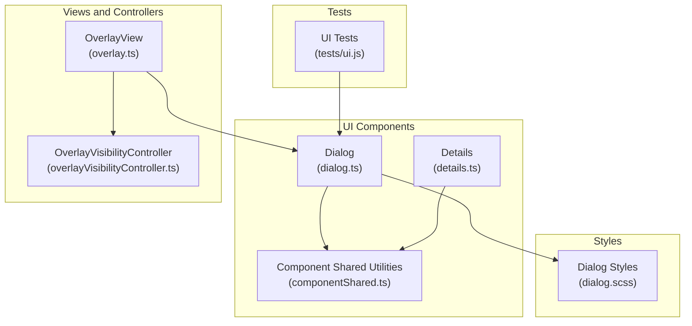
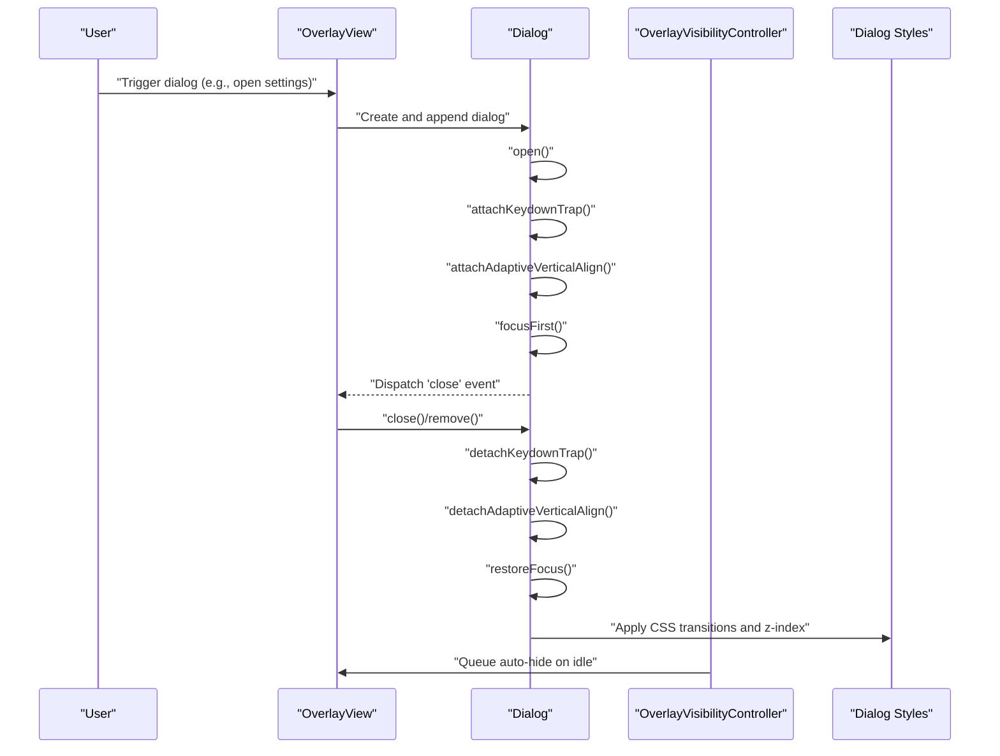
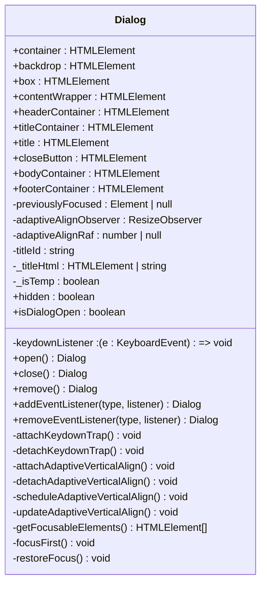
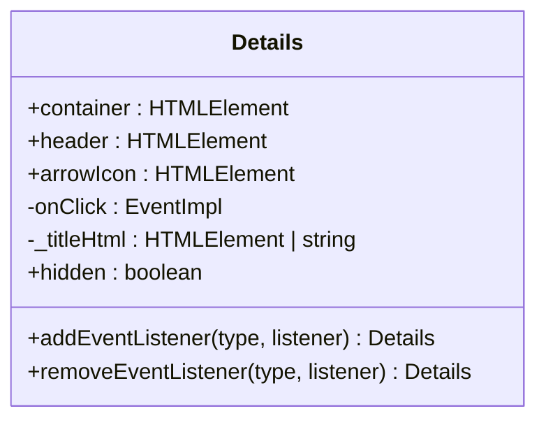
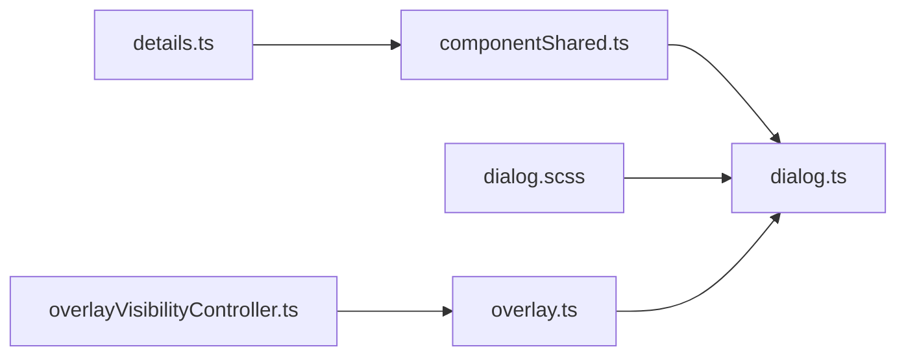

# Dialog Components

<cite>
**Referenced Files in This Document**
- [dialog.ts](file://src/ui/components/dialog.ts)
- [dialog.ts](file://src/types/components/dialog.ts)
- [dialog.scss](file://src/styles/components/dialog.scss)
- [overlay.ts](file://src/ui/views/overlay.ts)
- [overlay.ts](file://src/ui/overlayVisibilityController.ts)
- [details.ts](file://src/ui/components/details.ts)
- [details.ts](file://src/types/components/details.ts)
- [componentShared.ts](file://src/ui/components/componentShared.ts)
- [ui.js](file://tests/ui.js)
</cite>

## Table of Contents
1. [Introduction](#introduction)
2. [Project Structure](#project-structure)
3. [Core Components](#core-components)
4. [Architecture Overview](#architecture-overview)
5. [Detailed Component Analysis](#detailed-component-analysis)
6. [Dependency Analysis](#dependency-analysis)
7. [Performance Considerations](#performance-considerations)
8. [Troubleshooting Guide](#troubleshooting-guide)
9. [Conclusion](#conclusion)
10. [Appendices](#appendices)

## Introduction
This document provides comprehensive API documentation for dialog and modal components in the English Teacher extension. It covers dialog interfaces, overlay management, focus trapping, keyboard navigation, accessibility compliance, collapsible content patterns, TypeScript specifications, usage examples, animations, z-index management, backdrop handling, and responsive design considerations.

## Project Structure
The dialog component is implemented as a self-contained UI class with supporting SCSS styles and integrates with the overlay system and visibility controller. Collapsible content is supported via a dedicated Details component.

**Diagram sources**
- [dialog.ts:1-382](file://src/ui/components/dialog.ts#L1-L382)
- [dialog.scss:1-184](file://src/styles/components/dialog.scss#L1-L184)
- [overlay.ts:1-1081](file://src/ui/views/overlay.ts#L1-L1081)
- [overlay.ts:1-199](file://src/ui/overlayVisibilityController.ts#L1-L199)
- [details.ts:1-78](file://src/ui/components/details.ts#L1-L78)
- [componentShared.ts:1-39](file://src/ui/components/componentShared.ts#L1-L39)
- [ui.js:1-83](file://tests/ui.js#L1-L83)

**Section sources**
- [dialog.ts:1-382](file://src/ui/components/dialog.ts#L1-L382)
- [dialog.scss:1-184](file://src/styles/components/dialog.scss#L1-L184)
- [overlay.ts:1-1081](file://src/ui/views/overlay.ts#L1-L1081)
- [overlay.ts:1-199](file://src/ui/overlayVisibilityController.ts#L1-L199)
- [details.ts:1-78](file://src/ui/components/details.ts#L1-L78)
- [componentShared.ts:1-39](file://src/ui/components/componentShared.ts#L1-L39)
- [ui.js:1-83](file://tests/ui.js#L1-L83)

## Core Components
- Dialog: ARIA-compliant modal dialog with focus trapping, adaptive vertical alignment, backdrop click handling, and inert/hidden state management.
- Details: Collapsible content section with accessible header and animated chevron indicator.
- OverlayView: Hosts dialogs and manages interactions with surrounding UI, including backdrop click-through behavior and keyboard navigation.
- OverlayVisibilityController: Manages overlay auto-hide behavior and focus-related visibility transitions.
- Component Shared Utilities: Provides standardized event registration and hidden-state helpers used across components.

**Section sources**
- [dialog.ts:12-382](file://src/ui/components/dialog.ts#L12-L382)
- [details.ts:14-78](file://src/ui/components/details.ts#L14-L78)
- [overlay.ts:29-800](file://src/ui/views/overlay.ts#L29-L800)
- [overlay.ts:18-199](file://src/ui/overlayVisibilityController.ts#L18-L199)
- [componentShared.ts:1-39](file://src/ui/components/componentShared.ts#L1-L39)

## Architecture Overview
The dialog participates in a layered UI architecture:
- Dialog encapsulates DOM creation, focus trapping, and adaptive layout.
- OverlayView orchestrates dialog presentation and integrates with other UI elements.
- OverlayVisibilityController coordinates overlay auto-hide and focus transitions.
- Styles define animations, z-index, and responsive behavior.

**Diagram sources**
- [overlay.ts:159-238](file://src/ui/views/overlay.ts#L159-L238)
- [overlay.ts:584-625](file://src/ui/views/overlay.ts#L584-L625)
- [dialog.ts:157-189](file://src/ui/components/dialog.ts#L157-L189)
- [dialog.ts:321-366](file://src/ui/components/dialog.ts#L321-L366)
- [dialog.ts:191-290](file://src/ui/components/dialog.ts#L191-L290)
- [overlay.ts:59-116](file://src/ui/overlayVisibilityController.ts#L59-L116)
- [dialog.scss:41-52](file://src/styles/components/dialog.scss#L41-L52)

## Detailed Component Analysis

### Dialog Component
The Dialog class implements a robust, accessible modal with the following capabilities:
- ARIA role and labeling for screen readers.
- Backdrop click-to-close and escape-to-close behavior.
- Focus trapping with Tab/Shift+Tab navigation within the dialog.
- Adaptive vertical alignment for long content using ResizeObserver and visual viewport changes.
- Hidden/inert state management for accessibility and performance.
- Event-driven lifecycle with close event dispatch.

**Diagram sources**
- [dialog.ts:12-382](file://src/ui/components/dialog.ts#L12-L382)

#### Accessibility and Keyboard Navigation
- ARIA attributes: role="dialog", aria-modal="true", aria-labelledby for title.
- Tab trapping: restricts focus to focusable elements within the dialog; supports Shift+Tab wrapping.
- Escape handling: closes the dialog and restores focus.
- Inert and hidden states: disables interaction and hides elements when hidden.

**Section sources**
- [dialog.ts:77-111](file://src/ui/components/dialog.ts#L77-L111)
- [dialog.ts:321-366](file://src/ui/components/dialog.ts#L321-L366)
- [dialog.ts:368-380](file://src/ui/components/dialog.ts#L368-L380)

#### Overlay Management and Backdrop Handling
- Backdrop click closes the dialog and stops propagation to prevent unintended interactions.
- Container hidden state toggles aria-hidden and inert attributes for assistive technologies.
- Temporary dialogs are removed from the DOM upon closing.

**Section sources**
- [dialog.ts:106-111](file://src/ui/components/dialog.ts#L106-L111)
- [dialog.ts:368-376](file://src/ui/components/dialog.ts#L368-L376)
- [dialog.ts:179-189](file://src/ui/components/dialog.ts#L179-L189)

#### Adaptive Vertical Alignment and Responsive Behavior
- Uses ResizeObserver and visual viewport listeners to adjust layout for long content.
- Switches between centered and top-aligned modes with CSS variable-driven max heights.
- Mobile-friendly footer layout stacks actions and allows text wrapping.

**Section sources**
- [dialog.ts:191-290](file://src/ui/components/dialog.ts#L191-L290)
- [dialog.scss:54-59](file://src/styles/components/dialog.scss#L54-L59)
- [dialog.scss:162-183](file://src/styles/components/dialog.scss#L162-L183)

#### Animation Patterns and Z-Index Management
- CSS transitions for opacity and transform provide smooth entrance/exit.
- Backdrop fades in/out with opacity transition.
- Container z-index is set to a high value to ensure proper stacking order.

**Section sources**
- [dialog.scss:41-52](file://src/styles/components/dialog.scss#L41-L52)
- [dialog.scss:85-92](file://src/styles/components/dialog.scss#L85-L92)
- [dialog.scss](file://src/styles/components/dialog.scss#L64)

#### TypeScript Interface Specifications
- Props: DialogProps includes titleHtml and optional isTemp flag.
- Methods: open(), close(), remove().
- Events: "close" dispatched on dialog close/remove.
- State: hidden getter/setter and isDialogOpen computed property.

**Section sources**
- [dialog.ts:1-8](file://src/types/components/dialog.ts#L1-L8)
- [dialog.ts:145-155](file://src/ui/components/dialog.ts#L145-L155)
- [dialog.ts:368-380](file://src/ui/components/dialog.ts#L368-L380)

#### Usage Examples
- Creating a dialog with title content and appending body/footers.
- Integrating with OverlayView to manage backdrop clicks and keyboard navigation.
- Using temporary dialogs for ephemeral overlays.

**Section sources**
- [ui.js:19-57](file://tests/ui.js#L19-L57)
- [overlay.ts:584-625](file://src/ui/views/overlay.ts#L584-L625)

### Details Component (Collapsible Content)
The Details component provides a collapsible section with accessible header and animated chevron indicator. It emits a click event for consumers to toggle visibility.

**Diagram sources**
- [details.ts:14-78](file://src/ui/components/details.ts#L14-L78)

**Section sources**
- [details.ts:26-76](file://src/ui/components/details.ts#L26-L76)
- [details.ts:1-4](file://src/types/components/details.ts#L1-L4)

### OverlayView Integration
OverlayView manages the dialog lifecycle and ensures proper interaction with surrounding UI:
- Closes menus when clicking outside the dialog or menu boundaries.
- Preserves focus and keyboard navigation patterns.
- Coordinates with OverlayVisibilityController for auto-hide behavior.

**Section sources**
- [overlay.ts:584-625](file://src/ui/views/overlay.ts#L584-L625)
- [overlay.ts:627-659](file://src/ui/views/overlay.ts#L627-L659)
- [overlay.ts:59-116](file://src/ui/overlayVisibilityController.ts#L59-L116)

## Dependency Analysis
The dialog component relies on shared utilities for event handling and hidden-state management, and integrates with styles for animations and responsive behavior. OverlayView and OverlayVisibilityController coordinate dialog presentation and visibility.

**Diagram sources**
- [componentShared.ts:1-39](file://src/ui/components/componentShared.ts#L1-L39)
- [dialog.ts:1-10](file://src/ui/components/dialog.ts#L1-L10)
- [dialog.scss:1-184](file://src/styles/components/dialog.scss#L1-L184)
- [overlay.ts:1-1081](file://src/ui/views/overlay.ts#L1-L1081)
- [overlay.ts:1-199](file://src/ui/overlayVisibilityController.ts#L1-L199)
- [details.ts:1-12](file://src/ui/components/details.ts#L1-L12)

**Section sources**
- [dialog.ts:1-10](file://src/ui/components/dialog.ts#L1-L10)
- [componentShared.ts:1-39](file://src/ui/components/componentShared.ts#L1-L39)
- [overlay.ts:1-1081](file://src/ui/views/overlay.ts#L1-L1081)
- [overlay.ts:1-199](file://src/ui/overlayVisibilityController.ts#L1-L199)
- [details.ts:1-12](file://src/ui/components/details.ts#L1-L12)

## Performance Considerations
- Adaptive vertical alignment uses requestAnimationFrame and ResizeObserver to minimize layout thrash.
- CSS transitions leverage transform and opacity for GPU-accelerated animations.
- Hidden state toggles inert and aria-hidden to reduce DOM interaction overhead for off-screen elements.
- Temporary dialogs remove themselves from the DOM to prevent memory leaks.

[No sources needed since this section provides general guidance]

## Troubleshooting Guide
Common issues and resolutions:
- Dialog not closing on Escape: Verify keydown trap is attached during open() and detached during close/remove.
- Focus not trapped: Ensure getFocusableElements selects only visible, focusable elements and focusFirst targets a valid element.
- Backdrop click not working: Confirm event.stopPropagation is used on the dialog box and backdrop click handler triggers close().
- Long content not aligned properly: Check visual viewport listeners and adaptive alignment thresholds.

**Section sources**
- [dialog.ts:321-366](file://src/ui/components/dialog.ts#L321-L366)
- [dialog.ts:300-319](file://src/ui/components/dialog.ts#L300-L319)
- [dialog.ts:127-129](file://src/ui/components/dialog.ts#L127-L129)
- [dialog.ts:191-290](file://src/ui/components/dialog.ts#L191-L290)

## Conclusion
The dialog component provides a robust, accessible, and performant modal solution with adaptive layout, strict focus management, and seamless integration with the overlay system. The Details component complements the dialog with collapsible content patterns. Together, these components form a cohesive UI foundation for the English Teacher extension.

[No sources needed since this section summarizes without analyzing specific files]

## Appendices

### API Reference: Dialog
- Props
  - titleHtml: HTMLElement | string
  - isTemp?: boolean
- Methods
  - open(): opens the dialog, attaches traps, and focuses first element
  - close(): closes the dialog, detaches traps, restores focus, and dispatches close event
  - remove(): removes the dialog from DOM and dispatches close event
- Events
  - "close": emitted on close/remove
- State
  - hidden: controls visibility and inert/aria-hidden attributes
  - isDialogOpen: computed property indicating open state

**Section sources**
- [dialog.ts:1-8](file://src/types/components/dialog.ts#L1-L8)
- [dialog.ts:145-155](file://src/ui/components/dialog.ts#L145-L155)
- [dialog.ts:368-380](file://src/ui/components/dialog.ts#L368-L380)

### API Reference: Details
- Props
  - titleHtml: HTMLElement | string
- Methods
  - addEventListener("click", listener)
  - removeEventListener("click", listener)
  - hidden: controls visibility
- Events
  - "click": emitted when the header is clicked

**Section sources**
- [details.ts:1-4](file://src/types/components/details.ts#L1-L4)
- [details.ts:58-76](file://src/ui/components/details.ts#L58-L76)

### Usage Example Paths
- Creating and composing a dialog in tests: [tests/ui.js:19-57](file://tests/ui.js#L19-L57)
- OverlayView managing dialog and backdrop interactions: [overlay.ts:584-625](file://src/ui/views/overlay.ts#L584-L625)

**Section sources**
- [ui.js:19-57](file://tests/ui.js#L19-L57)
- [overlay.ts:584-625](file://src/ui/views/overlay.ts#L584-L625)