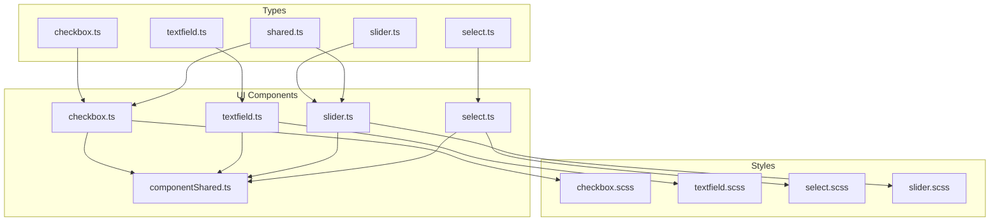
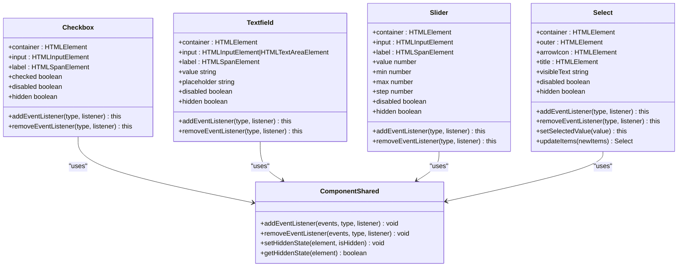
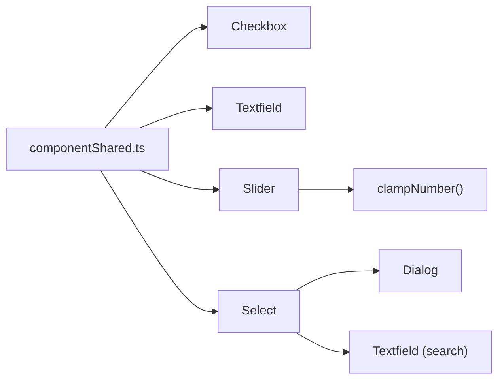

# Form Controls

<cite>
**Referenced Files in This Document**
- [checkbox.ts](file://src/types/components/checkbox.ts)
- [textfield.ts](file://src/types/components/textfield.ts)
- [select.ts](file://src/types/components/select.ts)
- [slider.ts](file://src/types/components/slider.ts)
- [shared.ts](file://src/types/components/shared.ts)
- [checkbox.ts](file://src/ui/components/checkbox.ts)
- [textfield.ts](file://src/ui/components/textfield.ts)
- [select.ts](file://src/ui/components/select.ts)
- [slider.ts](file://src/ui/components/slider.ts)
- [componentShared.ts](file://src/ui/components/componentShared.ts)
- [checkbox.scss](file://src/styles/components/checkbox.scss)
- [textfield.scss](file://src/styles/components/textfield.scss)
- [select.scss](file://src/styles/components/select.scss)
- [slider.scss](file://src/styles/components/slider.scss)
</cite>

## Table of Contents
1. [Introduction](#introduction)
2. [Project Structure](#project-structure)
3. [Core Components](#core-components)
4. [Architecture Overview](#architecture-overview)
5. [Detailed Component Analysis](#detailed-component-analysis)
6. [Dependency Analysis](#dependency-analysis)
7. [Performance Considerations](#performance-considerations)
8. [Troubleshooting Guide](#troubleshooting-guide)
9. [Conclusion](#conclusion)
10. [Appendices](#appendices)

## Introduction
This document provides comprehensive API documentation for the form control components in the English Teacher extension: Checkbox, Textfield, Select, and Slider. It covers TypeScript interfaces, properties, validation patterns, event handling, state management, accessibility attributes, keyboard navigation, styling customization, responsive behavior, and performance optimization techniques. The goal is to help developers integrate and customize these components effectively within forms and settings panels.

## Project Structure
The form controls are implemented as UI components with associated TypeScript interfaces and SCSS styles. Each component exposes a constructor, getters/setters for state, event registration APIs, and a hidden/disabled contract. Styles define theme-aware, accessible, and responsive behavior.

**Diagram sources**
- [checkbox.ts:1-8](file://src/types/components/checkbox.ts#L1-L8)
- [textfield.ts:1-7](file://src/types/components/textfield.ts#L1-L7)
- [slider.ts:1-10](file://src/types/components/slider.ts#L1-L10)
- [select.ts:1-32](file://src/types/components/select.ts#L1-L32)
- [shared.ts:1-4](file://src/types/components/shared.ts#L1-L4)
- [checkbox.ts:1-114](file://src/ui/components/checkbox.ts#L1-L114)
- [textfield.ts:1-134](file://src/ui/components/textfield.ts#L1-L134)
- [slider.ts:1-171](file://src/ui/components/slider.ts#L1-L171)
- [select.ts:1-403](file://src/ui/components/select.ts#L1-L403)
- [componentShared.ts:1-39](file://src/ui/components/componentShared.ts#L1-L39)
- [checkbox.scss:1-190](file://src/styles/components/checkbox.scss#L1-L190)
- [textfield.scss:1-224](file://src/styles/components/textfield.scss#L1-L224)
- [select.scss:1-103](file://src/styles/components/select.scss#L1-L103)
- [slider.scss:1-184](file://src/styles/components/slider.scss#L1-L184)

**Section sources**
- [checkbox.ts:1-8](file://src/types/components/checkbox.ts#L1-L8)
- [textfield.ts:1-7](file://src/types/components/textfield.ts#L1-L7)
- [slider.ts:1-10](file://src/types/components/slider.ts#L1-L10)
- [select.ts:1-32](file://src/types/components/select.ts#L1-L32)
- [shared.ts:1-4](file://src/types/components/shared.ts#L1-L4)
- [checkbox.ts:1-114](file://src/ui/components/checkbox.ts#L1-L114)
- [textfield.ts:1-134](file://src/ui/components/textfield.ts#L1-L134)
- [slider.ts:1-171](file://src/ui/components/slider.ts#L1-L171)
- [select.ts:1-403](file://src/ui/components/select.ts#L1-L403)
- [componentShared.ts:1-39](file://src/ui/components/componentShared.ts#L1-L39)
- [checkbox.scss:1-190](file://src/styles/components/checkbox.scss#L1-L190)
- [textfield.scss:1-224](file://src/styles/components/textfield.scss#L1-L224)
- [select.scss:1-103](file://src/styles/components/select.scss#L1-L103)
- [slider.scss:1-184](file://src/styles/components/slider.scss#L1-L184)

## Core Components
This section defines the TypeScript interfaces and essential behaviors for each component.

- CheckboxProps
  - labelHtml: string | HTMLElement | TemplateResult
  - checked?: boolean
  - isSubCheckbox?: boolean

- TextfieldProps
  - labelHtml: string | HTMLElement
  - placeholder?: string
  - value?: string
  - multiline?: boolean

- SelectItem<T>
  - label: string
  - value: T
  - selected?: boolean
  - disabled?: boolean

- SelectProps<T, M>
  - selectTitle: string
  - dialogTitle: string
  - items: SelectItem<T>[]
  - labelElement?: string | HTMLElement
  - dialogParent?: HTMLElement
  - multiSelect?: M

- SliderProps
  - labelHtml: string | HTMLElement | TemplateResult
  - value?: number
  - min?: number
  - max?: number
  - step?: number

Validation and accessibility highlights:
- Checkbox supports checked state and sub-checkbox indentation.
- Textfield supports single-line and multi-line modes, placeholder visibility, and label rendering.
- Select supports single and multi-select modes, dialog-based selection with search, and ARIA attributes for button-like behavior.
- Slider supports min/max/step clamping and CSS variable-based progress visualization.

**Section sources**
- [checkbox.ts:1-8](file://src/types/components/checkbox.ts#L1-L8)
- [textfield.ts:1-7](file://src/types/components/textfield.ts#L1-L7)
- [select.ts:1-32](file://src/types/components/select.ts#L1-L32)
- [slider.ts:1-10](file://src/types/components/slider.ts#L1-L10)

## Architecture Overview
Each component follows a consistent pattern:
- Constructor initializes state and DOM elements.
- Private event emitters dispatch typed events.
- Public getters/setters expose state and trigger updates.
- Event registration APIs attach listeners for component-specific events.
- Hidden and disabled states are standardized via shared utilities.

**Diagram sources**
- [checkbox.ts:1-114](file://src/ui/components/checkbox.ts#L1-L114)
- [textfield.ts:1-134](file://src/ui/components/textfield.ts#L1-L134)
- [slider.ts:1-171](file://src/ui/components/slider.ts#L1-L171)
- [select.ts:1-403](file://src/ui/components/select.ts#L1-L403)
- [componentShared.ts:1-39](file://src/ui/components/componentShared.ts#L1-L39)

**Section sources**
- [checkbox.ts:1-114](file://src/ui/components/checkbox.ts#L1-L114)
- [textfield.ts:1-134](file://src/ui/components/textfield.ts#L1-L134)
- [slider.ts:1-171](file://src/ui/components/slider.ts#L1-L171)
- [select.ts:1-403](file://src/ui/components/select.ts#L1-L403)
- [componentShared.ts:1-39](file://src/ui/components/componentShared.ts#L1-L39)

## Detailed Component Analysis

### Checkbox
- Purpose: Render a labeled checkbox with optional sub-checkbox indentation.
- Properties
  - labelHtml: string | HTMLElement | TemplateResult
  - checked?: boolean (default false)
  - isSubCheckbox?: boolean (default false)
- Events
  - change: boolean (dispatches when checked state changes)
- State Management
  - checked: getter/setter triggers change event when value differs
  - disabled: mirrors underlying input disabled state
  - hidden: toggles container hidden attribute via shared utility
- Accessibility
  - Uses a native input type="checkbox" inside a label wrapper.
  - Sub-checkbox adds a dedicated class for indentation.
- Styling
  - Custom styles define hover, focus-visible, checked, indeterminate, and disabled states.
  - Focus ring is controlled via a global keyboard navigation class.

Usage example (conceptual):
- Instantiate with labelHtml and optional checked flag.
- Add a change listener to react to user toggles.
- Bind disabled or hidden to reflect external conditions.

**Section sources**
- [checkbox.ts:1-8](file://src/types/components/checkbox.ts#L1-L8)
- [checkbox.ts:1-114](file://src/ui/components/checkbox.ts#L1-L114)
- [checkbox.scss:1-190](file://src/styles/components/checkbox.scss#L1-L190)

### Textfield
- Purpose: Single-line or multi-line text input with floating label and placeholder behavior.
- Properties
  - labelHtml: string | HTMLElement
  - placeholder?: string
  - value?: string
  - multiline?: boolean
- Events
  - input: string (emits on keystroke)
  - change: string (emits on blur after value change)
- State Management
  - value: getter/setter triggers change when changed
  - placeholder: setter updates input placeholder
  - disabled: mirrors underlying input disabled state
  - hidden: toggles container hidden attribute via shared utility
- Accessibility
  - Floating label and placeholder visibility managed via classes.
  - Placeholder-only mode uses backwards-compatible class names.
- Styling
  - Custom styles define focus, hover, disabled, and placeholder-shown states.
  - Corner accents animate during focus transitions.

Usage example (conceptual):
- Instantiate with labelHtml and optional placeholder/value.
- Listen to input/change to validate and persist user input.
- Toggle disabled or hidden to reflect form state.

**Section sources**
- [textfield.ts:1-7](file://src/types/components/textfield.ts#L1-L7)
- [textfield.ts:1-134](file://src/ui/components/textfield.ts#L1-L134)
- [textfield.scss:1-224](file://src/styles/components/textfield.scss#L1-L224)

### Select
- Purpose: Single or multi-select control backed by a modal dialog with search.
- Properties
  - selectTitle: string (fallback shown when nothing is selected)
  - dialogTitle: string (dialog header text)
  - items: SelectItem<T>[]
  - labelElement?: string | HTMLElement
  - dialogParent?: HTMLElement
  - multiSelect?: boolean
- Events
  - beforeOpen: Dialog (emits with a temporary dialog instance)
  - selectItem: T | T[] (emits selected value(s); array for multiSelect)
- Methods
  - setSelectedValue(value: T | T[]): chainable to programmatically select
  - updateItems(newItems: SelectItem<U>[]): chainable to refresh list
  - updateTitle(): refreshes visible text
  - visibleText: computed string for display
  - disabled: getter/setter toggles disabled state via ARIA attributes
  - hidden: toggles container hidden attribute via shared utility
- Behavior
  - Clicking the control opens a dialog containing a search field and a scrollable list.
  - Search filters items by lowercase label match.
  - Selection updates selectedValues and UI state.
- Accessibility
  - Outer element is made button-like with role and ARIA attributes.
  - aria-haspopup and aria-expanded reflect dialog state.
- Styling
  - Control and dialog list items styled with hover, selection, and inert states.
  - Arrow icon rendered via a template.

Usage example (conceptual):
- Build items with label/value pairs and optional selected/disabled flags.
- Open dialog via click; filter items using the search field.
- Subscribe to selectItem to receive the chosen value(s) and update form state.

**Section sources**
- [select.ts:1-32](file://src/types/components/select.ts#L1-L32)
- [select.ts:1-403](file://src/ui/components/select.ts#L1-L403)
- [select.scss:1-103](file://src/styles/components/select.scss#L1-L103)

### Slider
- Purpose: Range input with visual progress and label rendering.
- Properties
  - labelHtml: string | HTMLElement | TemplateResult
  - value?: number (default 50)
  - min?: number (default 0)
  - max?: number (default 100)
  - step?: number (default 1)
- Events
  - input: [number, boolean] (value, fromSetter)
- State Management
  - value: getter/setter clamps to min/max and updates progress CSS variable
  - min/max/step: setters update input attributes and clamp current value
  - disabled: mirrors underlying input disabled state
  - hidden: toggles container hidden attribute via shared utility
- Accessibility
  - Focus-visible indicator scoped to the component.
  - Disabled state reduces opacity and adjusts track/thumb visuals.
- Styling
  - Progress bar implemented via CSS variable and ::before pseudo-element.
  - Custom track and thumb styles for WebKit and Firefox compatibility.

Usage example (conceptual):
- Initialize with labelHtml and numeric bounds.
- Listen to input to react to user interaction or programmatic changes.
- Adjust min/max/step to fit the domain of your setting.

**Section sources**
- [slider.ts:1-10](file://src/types/components/slider.ts#L1-L10)
- [slider.ts:1-171](file://src/ui/components/slider.ts#L1-L171)
- [slider.scss:1-184](file://src/styles/components/slider.scss#L1-L184)

## Dependency Analysis
- Shared event registration and hidden state utilities reduce duplication across components.
- Select depends on Dialog and Textfield for its dialog content.
- Slider uses a clamp helper to maintain numeric validity.
- Styles are decoupled from logic and rely on class names and CSS variables.

**Diagram sources**
- [componentShared.ts:1-39](file://src/ui/components/componentShared.ts#L1-L39)
- [checkbox.ts:1-114](file://src/ui/components/checkbox.ts#L1-L114)
- [textfield.ts:1-134](file://src/ui/components/textfield.ts#L1-L134)
- [slider.ts:1-171](file://src/ui/components/slider.ts#L1-L171)
- [select.ts:1-403](file://src/ui/components/select.ts#L1-L403)

**Section sources**
- [componentShared.ts:1-39](file://src/ui/components/componentShared.ts#L1-L39)
- [select.ts:1-403](file://src/ui/components/select.ts#L1-L403)
- [slider.ts:1-171](file://src/ui/components/slider.ts#L1-L171)

## Performance Considerations
- Debounce or throttle input/change handlers when integrating with expensive operations (e.g., network requests).
- Avoid frequent re-renders by batching state updates (e.g., updateItems followed by setSelectedValue).
- Use hidden state to defer heavy initialization until needed.
- Clamp numeric values early to prevent invalid DOM states and redundant updates.
- Prefer CSS variables for animations (e.g., Slider progress) to leverage GPU-accelerated transitions.

[No sources needed since this section provides general guidance]

## Troubleshooting Guide
Common issues and resolutions:
- Checkbox change event not firing
  - Ensure the change listener is attached after construction and that the input is not disabled.
  - Verify the checked setter is called with a different boolean value.
- Textfield input/change not updating
  - Confirm the value setter is invoked; it only emits when the value changes.
  - Check that placeholder classes are not conflicting with floating label behavior.
- Select dialog does not open
  - Confirm the outer element is not disabled and the component is not loading or already open.
  - Ensure dialogParent is appended to the DOM and accessible.
- Slider value appears incorrect
  - Clamp helpers enforce finite numbers and min/max bounds; verify min < max and step is valid.
  - Check CSS variable updates for progress visualization.

**Section sources**
- [checkbox.ts:52-55](file://src/ui/components/checkbox.ts#L52-L55)
- [textfield.ts:101-108](file://src/ui/components/textfield.ts#L101-L108)
- [select.ts:200-255](file://src/ui/components/select.ts#L200-L255)
- [slider.ts:108-114](file://src/ui/components/slider.ts#L108-L114)

## Conclusion
The form control components provide a cohesive, accessible, and customizable foundation for building forms and settings panels. By adhering to the documented interfaces, event patterns, and state management contracts, developers can integrate robust validation, keyboard navigation, and responsive styling while maintaining consistent behavior across the extension.

[No sources needed since this section summarizes without analyzing specific files]

## Appendices

### API Reference Tables

- CheckboxProps
  - labelHtml: string | HTMLElement | TemplateResult
  - checked?: boolean
  - isSubCheckbox?: boolean

- TextfieldProps
  - labelHtml: string | HTMLElement
  - placeholder?: string
  - value?: string
  - multiline?: boolean

- SelectItem<T>
  - label: string
  - value: T
  - selected?: boolean
  - disabled?: boolean

- SelectProps<T, M>
  - selectTitle: string
  - dialogTitle: string
  - items: SelectItem<T>[]
  - labelElement?: string | HTMLElement
  - dialogParent?: HTMLElement
  - multiSelect?: M

- SliderProps
  - labelHtml: string | HTMLElement | TemplateResult
  - value?: number
  - min?: number
  - max?: number
  - step?: number

- Checkbox
  - Events: change(boolean)
  - State: checked, disabled, hidden
  - Methods: addEventListener, removeEventListener

- Textfield
  - Events: input(string), change(string)
  - State: value, placeholder, disabled, hidden
  - Methods: addEventListener, removeEventListener

- Select
  - Events: beforeOpen(Dialog), selectItem(T | T[])
  - State: visibleText, disabled, hidden
  - Methods: setSelectedValue, updateItems, updateTitle

- Slider
  - Events: input(number, boolean)
  - State: value, min, max, step, disabled, hidden
  - Methods: addEventListener, removeEventListener

**Section sources**
- [checkbox.ts:1-8](file://src/types/components/checkbox.ts#L1-L8)
- [textfield.ts:1-7](file://src/types/components/textfield.ts#L1-L7)
- [select.ts:1-32](file://src/types/components/select.ts#L1-L32)
- [slider.ts:1-10](file://src/types/components/slider.ts#L1-L10)
- [checkbox.ts:1-114](file://src/ui/components/checkbox.ts#L1-L114)
- [textfield.ts:1-134](file://src/ui/components/textfield.ts#L1-L134)
- [select.ts:1-403](file://src/ui/components/select.ts#L1-L403)
- [slider.ts:1-171](file://src/ui/components/slider.ts#L1-L171)

### Accessibility and Keyboard Navigation
- Checkbox: Native input with focus-visible ring when keyboard navigation is detected.
- Textfield: Floating label and placeholder visibility; placeholder-only fallback classes included.
- Select: Button-like outer element with aria-haspopup and aria-expanded; dialog manages focus and Escape.
- Slider: Focus-visible indicator on thumbs; disabled state reduces visual emphasis.

**Section sources**
- [checkbox.scss:178-189](file://src/styles/components/checkbox.scss#L178-L189)
- [textfield.scss:54-86](file://src/styles/components/textfield.scss#L54-L86)
- [select.ts:190-194](file://src/ui/components/select.ts#L190-L194)
- [slider.scss:169-181](file://src/styles/components/slider.scss#L169-L181)

### Styling Customization Options
- Theme variables: Use CSS variables for theme colors and typography to adapt to host environments.
- Component-specific variables: Slider exposes a progress variable; others define helper colors and transitions.
- Responsive behavior: Components use flexible layouts and percentage widths where appropriate.

**Section sources**
- [checkbox.scss:1-190](file://src/styles/components/checkbox.scss#L1-L190)
- [textfield.scss:1-224](file://src/styles/components/textfield.scss#L1-L224)
- [select.scss:1-103](file://src/styles/components/select.scss#L1-L103)
- [slider.scss:1-184](file://src/styles/components/slider.scss#L1-L184)