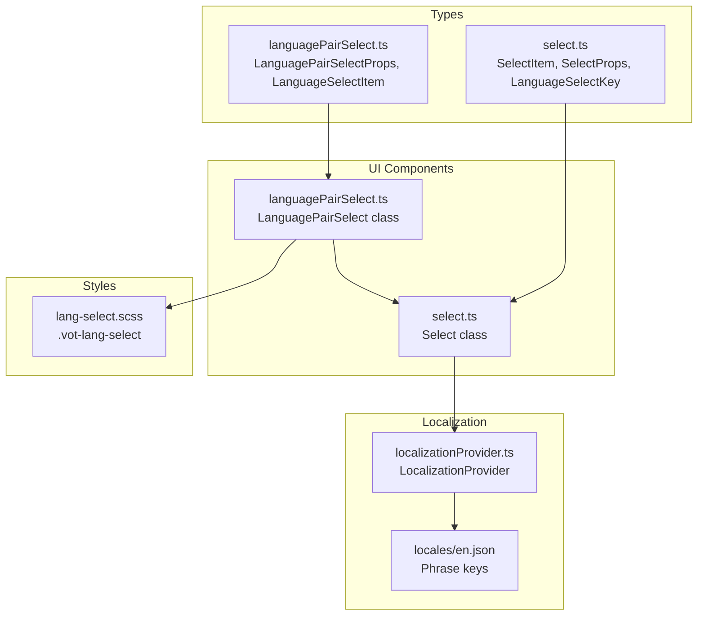
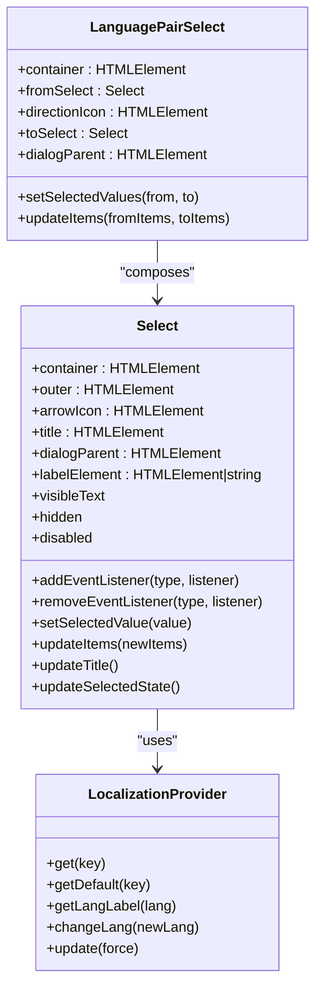
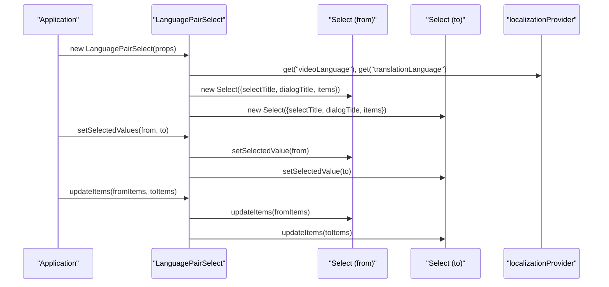
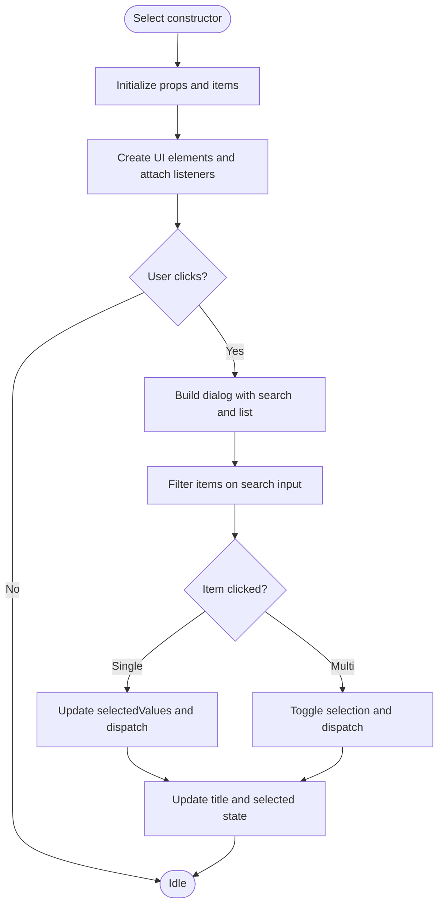
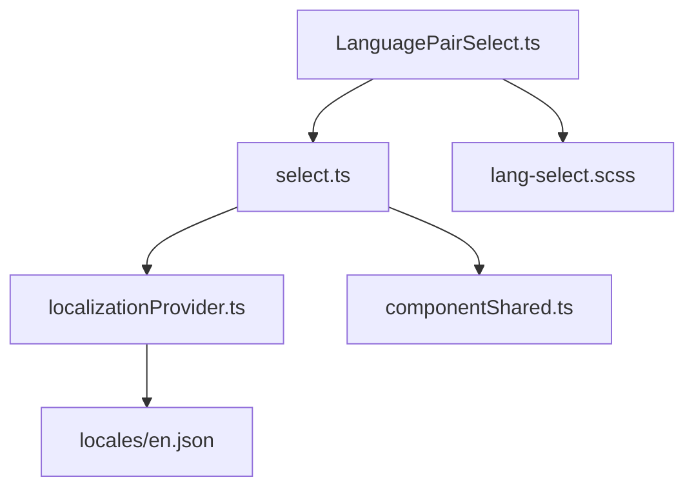

# Language Selection Components

<cite>
**Referenced Files in This Document**
- [languagePairSelect.ts](file://src/types/components/languagePairSelect.ts)
- [select.ts](file://src/types/components/select.ts)
- [languagePairSelect.ts](file://src/ui/components/languagePairSelect.ts)
- [select.ts](file://src/ui/components/select.ts)
- [localizationProvider.ts](file://src/localization/localizationProvider.ts)
- [en.json](file://src/localization/locales/en.json)
- [lang-select.scss](file://src/styles/components/lang-select.scss)
- [componentShared.ts](file://src/ui/components/componentShared.ts)
</cite>

## Table of Contents
1. [Introduction](#introduction)
2. [Project Structure](#project-structure)
3. [Core Components](#core-components)
4. [Architecture Overview](#architecture-overview)
5. [Detailed Component Analysis](#detailed-component-analysis)
6. [Dependency Analysis](#dependency-analysis)
7. [Performance Considerations](#performance-considerations)
8. [Troubleshooting Guide](#troubleshooting-guide)
9. [Conclusion](#conclusion)

## Introduction
This document provides comprehensive API documentation for the language selection components in the English Teacher extension. It focuses on the language pair select component, detailing the TypeScript interfaces, data models, localization integration, bidirectional selection patterns, validation rules, and accessibility features. The documentation includes usage examples, configuration guidelines, and best practices for integrating language selection into UI workflows.

## Project Structure
The language selection system is composed of:
- Type definitions for language options and selection props
- UI components for single and paired language selection
- Localization provider for dynamic phrase retrieval
- Styles for visual presentation
- Shared utilities for event handling and DOM state

**Diagram sources**
- [languagePairSelect.ts:1-17](file://src/types/components/languagePairSelect.ts#L1-L17)
- [select.ts:1-32](file://src/types/components/select.ts#L1-L32)
- [languagePairSelect.ts:1-111](file://src/ui/components/languagePairSelect.ts#L1-L111)
- [select.ts:1-403](file://src/ui/components/select.ts#L1-L403)
- [localizationProvider.ts:1-273](file://src/localization/localizationProvider.ts#L1-L273)
- [en.json:1-200](file://src/localization/locales/en.json#L1-L200)
- [lang-select.scss:1-22](file://src/styles/components/lang-select.scss#L1-L22)

**Section sources**
- [languagePairSelect.ts:1-17](file://src/types/components/languagePairSelect.ts#L1-L17)
- [select.ts:1-32](file://src/types/components/select.ts#L1-L32)
- [languagePairSelect.ts:1-111](file://src/ui/components/languagePairSelect.ts#L1-L111)
- [select.ts:1-403](file://src/ui/components/select.ts#L1-L403)
- [localizationProvider.ts:1-273](file://src/localization/localizationProvider.ts#L1-L273)
- [en.json:1-200](file://src/localization/locales/en.json#L1-L200)
- [lang-select.scss:1-22](file://src/styles/components/lang-select.scss#L1-L22)

## Core Components
This section defines the primary TypeScript interfaces and their roles in the language selection system.

- LanguageSelectItem: Describes a grouped set of selectable languages with optional localized titles and a collection of SelectItem entries.
- LanguagePairSelectProps: Defines the configuration for a bidirectional language selector, including from/to language groups and dialog parent context.
- SelectItem: Represents a single selectable option with label, value, and optional selection/disabled state.
- SelectProps: Defines the configuration for a single-select component, including titles, items, label element, dialog parent, and multi-select flag.
- LanguageSelectKey: A strict union of supported language keys used for localization lookups.

These types ensure type-safe language option configuration, selection handling, and localization integration.

**Section sources**
- [languagePairSelect.ts:1-17](file://src/types/components/languagePairSelect.ts#L1-L17)
- [select.ts:1-32](file://src/types/components/select.ts#L1-L32)

## Architecture Overview
The language pair selection component composes two Select instances (from and to) and renders them with a directional icon. The Select component manages its own dialog, search, and selection state, while the LanguagePairSelect orchestrates initialization, updates, and value setting.

**Diagram sources**
- [languagePairSelect.ts:10-111](file://src/ui/components/languagePairSelect.ts#L10-L111)
- [select.ts:22-403](file://src/ui/components/select.ts#L22-L403)
- [localizationProvider.ts:39-273](file://src/localization/localizationProvider.ts#L39-L273)

## Detailed Component Analysis

### LanguagePairSelect Component
The LanguagePairSelect component encapsulates a bidirectional language selector. It initializes two Select components, applies localized titles, and exposes methods to set selected values and update items dynamically.

Key capabilities:
- Construction with from/to language groups and optional dialog parent
- Localized titles via localizationProvider
- setSelectedValues: sets the selected value for both from and to selects
- updateItems: refreshes items for both selects and returns a properly typed instance

Usage pattern:
- Instantiate with LanguagePairSelectProps
- Call setSelectedValues after populating items
- Use updateItems to refresh options dynamically

**Diagram sources**
- [languagePairSelect.ts:31-111](file://src/ui/components/languagePairSelect.ts#L31-L111)
- [select.ts:54-75](file://src/ui/components/select.ts#L54-L75)
- [localizationProvider.ts:244-246](file://src/localization/localizationProvider.ts#L244-L246)

**Section sources**
- [languagePairSelect.ts:10-111](file://src/ui/components/languagePairSelect.ts#L10-L111)

### Select Component
The Select component provides a reusable dropdown with dialog-based selection, search filtering, and multi-select support. It integrates with the localization system for titles and labels.

Key capabilities:
- Static helper genLanguageItems: generates SelectItem entries from language keys with localized labels
- Event system: selectItem and beforeOpen events
- Search filtering within the dialog
- Dynamic title updates based on selected values
- Accessibility attributes for dialog behavior

Validation and selection rules:
- Single-select mode: exactly one value is selected
- Multi-select mode: one or more values can be selected
- Disabled state prevents interaction
- Hidden state controls visibility

**Diagram sources**
- [select.ts:54-255](file://src/ui/components/select.ts#L54-L255)

**Section sources**
- [select.ts:22-403](file://src/ui/components/select.ts#L22-L403)

### Localization Integration
The localization system supplies phrase keys for UI labels and language names. The Select component uses genLanguageItems to map language keys to localized labels, while LanguagePairSelect retrieves default titles for from/to selections.

Supported phrase keys:
- videoLanguage, translationLanguage for default titles
- langs.<lang_code> for language labels
- searchField for dialog search placeholder

Language code validation:
- LanguageSelectKey restricts values to known language keys
- genLanguageItems ensures labels are localized or uppercase fallbacks

Region-specific formatting:
- Language keys support region variants (e.g., zh-Hans, zh-Hant)
- Labels reflect regional variants when present in locales

**Section sources**
- [localizationProvider.ts:244-257](file://src/localization/localizationProvider.ts#L244-L257)
- [select.ts:77-90](file://src/ui/components/select.ts#L77-L90)
- [en.json:46-174](file://src/localization/locales/en.json#L46-L174)

### Accessibility Considerations
The Select component implements several accessibility features:
- Dialog behavior: aria-haspopup and aria-expanded attributes
- Keyboard-friendly dialog management
- Search field filtering without forced focus
- Disabled and hidden state management

The LanguagePairSelect component inherits these features through its Select children.

**Section sources**
- [select.ts:190-255](file://src/ui/components/select.ts#L190-L255)
- [componentShared.ts:27-38](file://src/ui/components/componentShared.ts#L27-L38)

## Dependency Analysis
The language selection components depend on shared UI utilities and the localization provider. The following diagram illustrates key dependencies:

**Diagram sources**
- [languagePairSelect.ts:1-111](file://src/ui/components/languagePairSelect.ts#L1-L111)
- [select.ts:1-403](file://src/ui/components/select.ts#L1-L403)
- [localizationProvider.ts:1-273](file://src/localization/localizationProvider.ts#L1-L273)
- [componentShared.ts:1-39](file://src/ui/components/componentShared.ts#L1-L39)
- [lang-select.scss:1-22](file://src/styles/components/lang-select.scss#L1-L22)
- [en.json:1-200](file://src/localization/locales/en.json#L1-L200)

**Section sources**
- [languagePairSelect.ts:1-111](file://src/ui/components/languagePairSelect.ts#L1-L111)
- [select.ts:1-403](file://src/ui/components/select.ts#L1-L403)
- [localizationProvider.ts:1-273](file://src/localization/localizationProvider.ts#L1-L273)
- [componentShared.ts:1-39](file://src/ui/components/componentShared.ts#L1-L39)
- [lang-select.scss:1-22](file://src/styles/components/lang-select.scss#L1-L22)
- [en.json:1-200](file://src/localization/locales/en.json#L1-L200)

## Performance Considerations
- Dialog rendering: The Select component defers building the dialog until opened, reducing initial overhead.
- Item updates: updateItems replaces the dialog content list efficiently without reconstructing the entire component.
- Localization caching: The localization provider caches locale phrases and uses timestamps/hash checks to minimize network requests.
- Search filtering: Filtering operates on dataset attributes and DOM children, keeping the operation lightweight.

[No sources needed since this section provides general guidance]

## Troubleshooting Guide
Common issues and resolutions:
- Missing localization keys: The provider logs warnings for missing keys and falls back to default keys. Verify phrase keys in locales.
- Empty or invalid locale JSON: The provider parses locale JSON and warns on invalid payloads; ensure locale files are valid.
- Dialog not opening: Check disabled state and ensure dialogParent is attached to the DOM.
- Selection not updating: Confirm setSelectedValue receives a valid value present in items and that multiSelect mode matches intended behavior.

**Section sources**
- [localizationProvider.ts:211-238](file://src/localization/localizationProvider.ts#L211-L238)
- [select.ts:387-401](file://src/ui/components/select.ts#L387-L401)

## Conclusion
The language selection components provide a robust, type-safe, and accessible solution for bidirectional language configuration. By leveraging the localization provider and shared UI utilities, developers can configure language options, handle selection events, and integrate seamlessly with the extension’s internationalization system. The documented APIs and patterns ensure maintainability and extensibility for future enhancements.