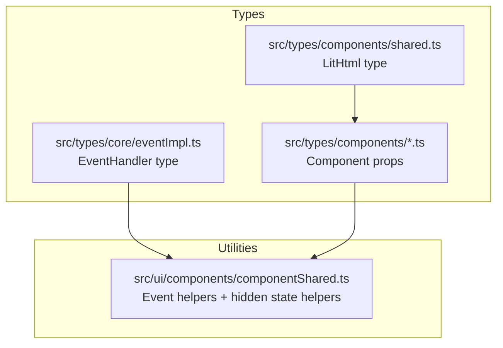
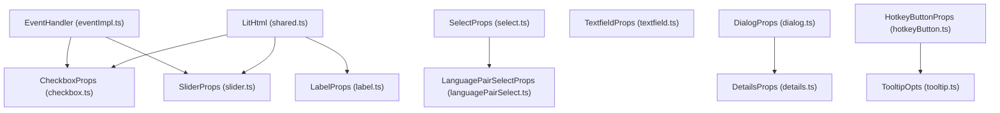
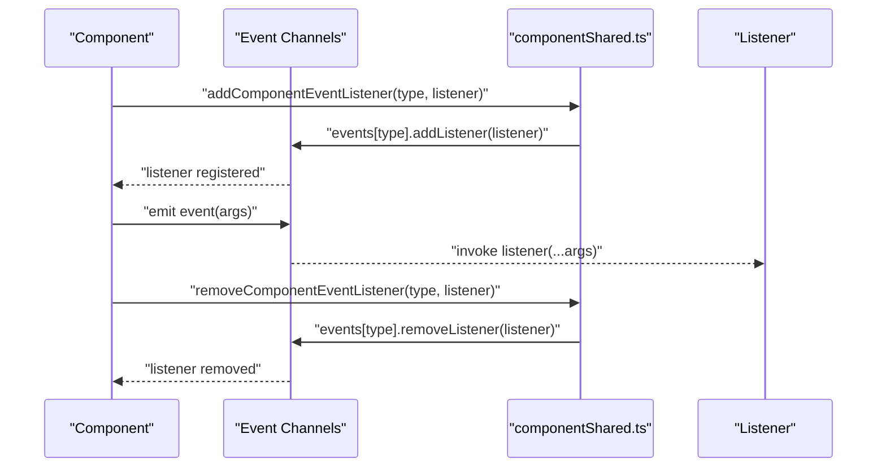
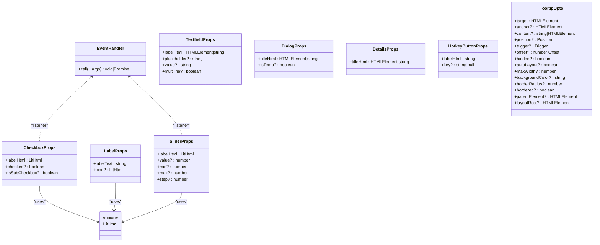
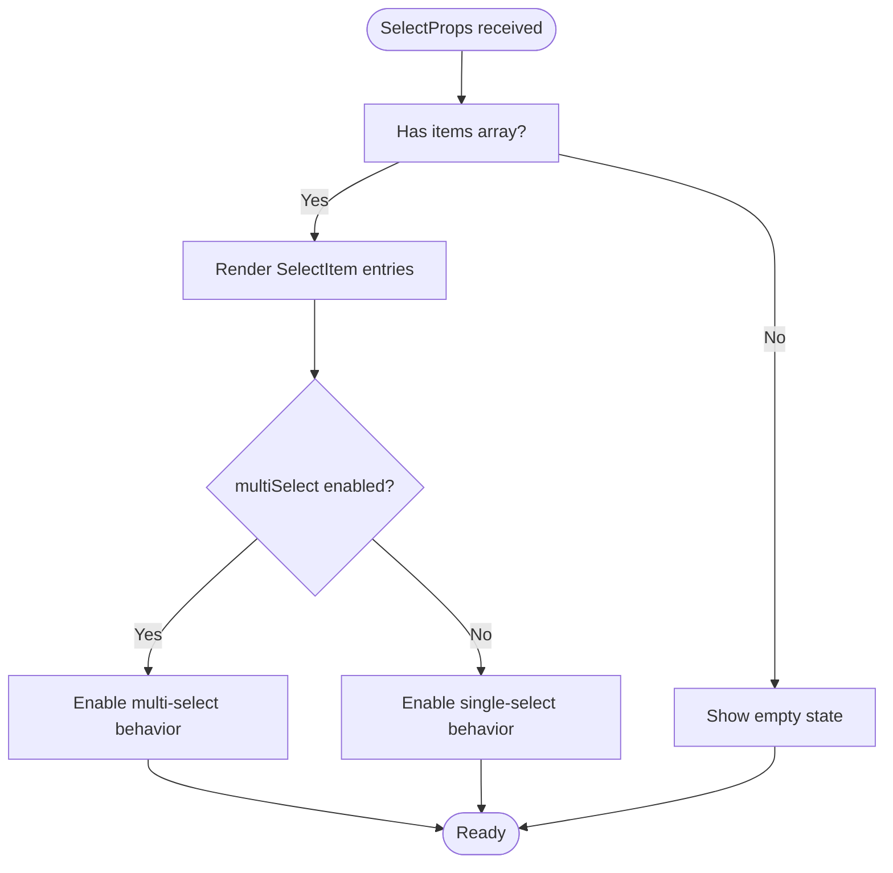
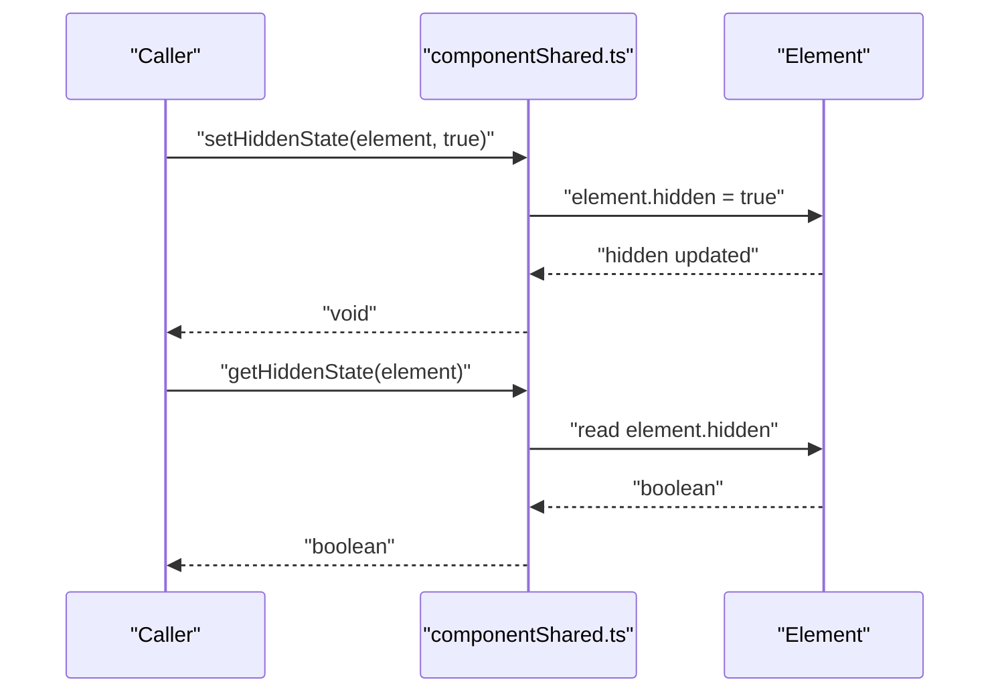
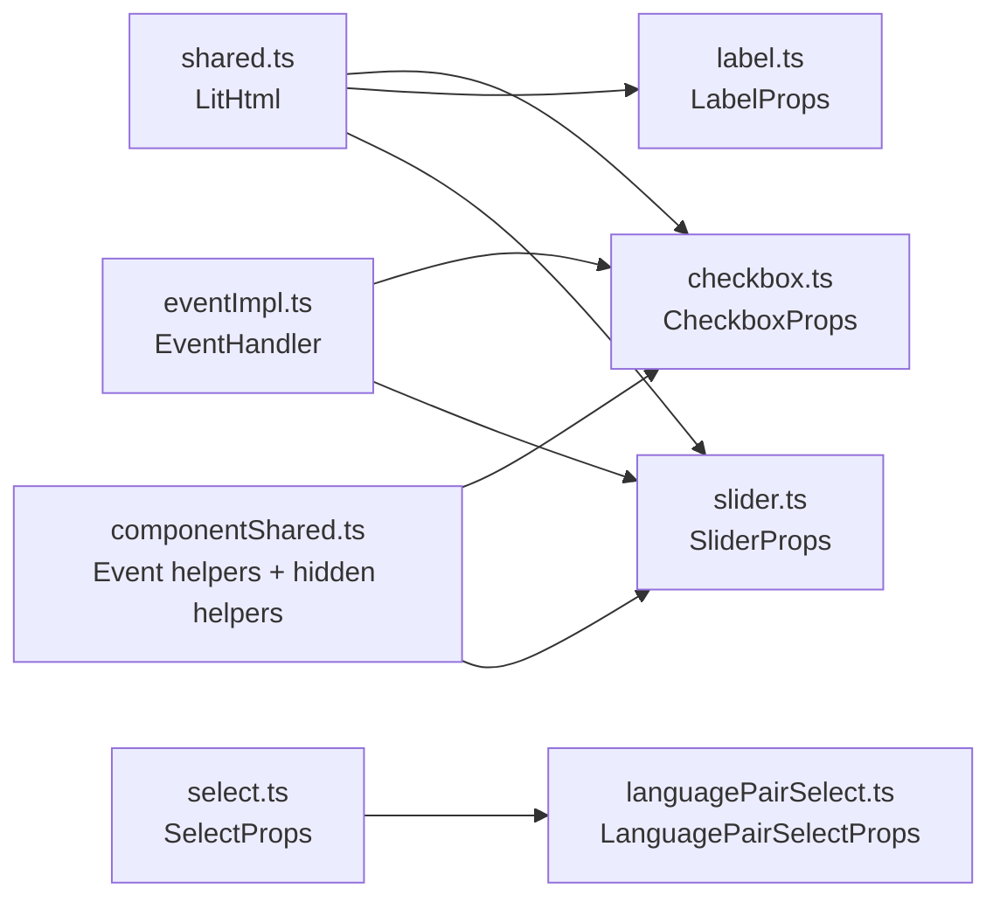

# Shared Interfaces

<cite>
**Referenced Files in This Document**
- [shared.ts](file://src/types/components/shared.ts)
- [componentShared.ts](file://src/ui/components/componentShared.ts)
- [eventImpl.ts](file://src/types/core/eventImpl.ts)
- [accountButton.ts](file://src/types/components/accountButton.ts)
- [dialog.ts](file://src/types/components/dialog.ts)
- [details.ts](file://src/types/components/details.ts)
- [hotkeyButton.ts](file://src/types/components/hotkeyButton.ts)
- [label.ts](file://src/types/components/label.ts)
- [select.ts](file://src/types/components/select.ts)
- [languagePairSelect.ts](file://src/types/components/languagePairSelect.ts)
- [slider.ts](file://src/types/components/slider.ts)
- [sliderLabel.ts](file://src/types/components/sliderLabel.ts)
- [textfield.ts](file://src/types/components/textfield.ts)
- [tooltip.ts](file://src/types/components/tooltip.ts)
</cite>

## Table of Contents
1. [Introduction](#introduction)
2. [Project Structure](#project-structure)
3. [Core Components](#core-components)
4. [Architecture Overview](#architecture-overview)
5. [Detailed Component Analysis](#detailed-component-analysis)
6. [Dependency Analysis](#dependency-analysis)
7. [Performance Considerations](#performance-considerations)
8. [Troubleshooting Guide](#troubleshooting-guide)
9. [Conclusion](#conclusion)

## Introduction
This document describes the shared component interfaces used across the English Teacher extension. It focuses on:
- The LitHtml type for flexible content rendering
- Common prop patterns across UI components
- Reusable component contracts for interoperability
- Event typing and listener utilities
- Template result integration with lit-html and string interpolation
- Best practices for extending shared interfaces while maintaining backward compatibility

## Project Structure
The shared interfaces are organized under two primary areas:
- Type definitions for component props and contracts
- Utilities for component event handling and DOM state helpers

**Diagram sources**
- [shared.ts:1-4](file://src/types/components/shared.ts#L1-L4)
- [componentShared.ts:1-39](file://src/ui/components/componentShared.ts#L1-L39)
- [eventImpl.ts:1-17](file://src/types/core/eventImpl.ts#L1-L17)

**Section sources**
- [shared.ts:1-4](file://src/types/components/shared.ts#L1-L4)
- [componentShared.ts:1-39](file://src/ui/components/componentShared.ts#L1-L39)
- [eventImpl.ts:1-17](file://src/types/core/eventImpl.ts#L1-L17)

## Core Components
This section documents the foundational shared types and utilities that enable consistent component behavior across the extension.

- LitHtml
  - Purpose: Union type enabling flexible content insertion in components that accept either a string literal, an HTMLElement, or a lit-html TemplateResult.
  - Usage pattern: Props that render labels, icons, or inline content commonly use this type to support multiple content forms.
  - Example references:
    - [CheckboxProps.labelHtml:4-4](file://src/types/components/checkbox.ts#L4-L4)
    - [LabelProps.icon:5-5](file://src/types/components/label.ts#L5-L5)
    - [SliderProps.labelHtml:4-4](file://src/types/components/slider.ts#L4-L4)

- EventHandler
  - Purpose: Strongly typed event listener signature that accepts a variadic list of arguments. Encourages tuple-style argument lists to keep emitters and listeners aligned.
  - Example references:
    - [EventHandler definition:14-16](file://src/types/core/eventImpl.ts#L14-L16)

- Event helpers
  - addComponentEventListener
    - Purpose: Adds a typed listener to a named event channel keyed by a string literal type.
    - Example references:
      - [addComponentEventListener:5-14](file://src/ui/components/componentShared.ts#L5-L14)
  - removeComponentEventListener
    - Purpose: Removes a typed listener from a named event channel.
    - Example references:
      - [removeComponentEventListener:16-25](file://src/ui/components/componentShared.ts#L16-L25)
  - Hidden state helpers
    - Purpose: Unified helpers to set and retrieve the hidden state of an element with a boolean property.
    - Example references:
      - [setHiddenState:27-34](file://src/ui/components/componentShared.ts#L27-L34)
      - [getHiddenState:36-38](file://src/ui/components/componentShared.ts#L36-L38)

- Common prop patterns
  - Optional flags for toggling UI behavior (e.g., logged-in state, multi-select, hidden).
  - Content props accepting strings or HTML nodes for labels, titles, and tooltips.
  - Generic item collections for selection controls with optional selection and disabled states.

**Section sources**
- [shared.ts:1-4](file://src/types/components/shared.ts#L1-L4)
- [eventImpl.ts:1-17](file://src/types/core/eventImpl.ts#L1-L17)
- [componentShared.ts:1-39](file://src/ui/components/componentShared.ts#L1-L39)
- [checkbox.ts:1-8](file://src/types/components/checkbox.ts#L1-L8)
- [label.ts:1-7](file://src/types/components/label.ts#L1-L7)
- [slider.ts:1-10](file://src/types/components/slider.ts#L1-L10)
- [textfield.ts:1-7](file://src/types/components/textfield.ts#L1-L7)

## Architecture Overview
The shared interface architecture connects type-safe event handling with flexible content rendering and standardized prop contracts.

**Diagram sources**
- [eventImpl.ts:1-17](file://src/types/core/eventImpl.ts#L1-L17)
- [shared.ts:1-4](file://src/types/components/shared.ts#L1-L4)
- [select.ts:1-32](file://src/types/components/select.ts#L1-L32)
- [languagePairSelect.ts:1-17](file://src/types/components/languagePairSelect.ts#L1-L17)
- [checkbox.ts:1-8](file://src/types/components/checkbox.ts#L1-L8)
- [label.ts:1-7](file://src/types/components/label.ts#L1-L7)
- [slider.ts:1-10](file://src/types/components/slider.ts#L1-L10)
- [textfield.ts:1-7](file://src/types/components/textfield.ts#L1-L7)
- [dialog.ts:1-8](file://src/types/components/dialog.ts#L1-L8)
- [details.ts:1-4](file://src/types/components/details.ts#L1-L4)
- [hotkeyButton.ts:1-5](file://src/types/components/hotkeyButton.ts#L1-L5)
- [tooltip.ts:1-44](file://src/types/components/tooltip.ts#L1-L44)

## Detailed Component Analysis
This section documents the shared prop contracts and their typical usage patterns across components.

### LitHtml and TemplateResult Integration
- Purpose: Allow components to accept strings, DOM nodes, or lit-html TemplateResults for labels, icons, and inline content.
- Benefits:
  - Enables seamless integration with lit-html templates while preserving flexibility for plain strings.
  - Supports composition of complex inline elements without losing type safety.
- Example references:
  - [LitHtml type:3-3](file://src/types/components/shared.ts#L3-L3)
  - [CheckboxProps.labelHtml:4-4](file://src/types/components/checkbox.ts#L4-L4)
  - [LabelProps.icon:5-5](file://src/types/components/label.ts#L5-L5)
  - [SliderProps.labelHtml:4-4](file://src/types/components/slider.ts#L4-L4)

**Section sources**
- [shared.ts:1-4](file://src/types/components/shared.ts#L1-L4)
- [checkbox.ts:1-8](file://src/types/components/checkbox.ts#L1-L8)
- [label.ts:1-7](file://src/types/components/label.ts#L1-L7)
- [slider.ts:1-10](file://src/types/components/slider.ts#L1-L10)

### Event Types and Listener Utilities
- EventHandler
  - Defines a listener signature that can handle synchronous or asynchronous callbacks with typed arguments.
  - Encourages tuple-style argument lists to keep emitter and listener signatures aligned.
  - Example references:
    - [EventHandler:14-16](file://src/types/core/eventImpl.ts#L14-L16)
- addComponentEventListener
  - Adds a typed listener to a record of event channels keyed by a string literal type.
  - Example references:
    - [addComponentEventListener:5-14](file://src/ui/components/componentShared.ts#L5-L14)
- removeComponentEventListener
  - Removes a typed listener from a record of event channels keyed by a string literal type.
  - Example references:
    - [removeComponentEventListener:16-25](file://src/ui/components/componentShared.ts#L16-L25)

**Diagram sources**
- [componentShared.ts:5-25](file://src/ui/components/componentShared.ts#L5-L25)
- [eventImpl.ts:14-16](file://src/types/core/eventImpl.ts#L14-L16)

**Section sources**
- [eventImpl.ts:1-17](file://src/types/core/eventImpl.ts#L1-L17)
- [componentShared.ts:1-39](file://src/ui/components/componentShared.ts#L1-L39)

### Common Prop Contracts
- AccountButtonProps
  - Optional flags for logged-in state and optional username/avatar identifiers.
  - Example references:
    - [AccountButtonProps:1-6](file://src/types/components/accountButton.ts#L1-L6)
- DialogProps
  - Title content supporting strings or HTML nodes.
  - Optional flag to treat the container as temporary.
  - Example references:
    - [DialogProps:1-8](file://src/types/components/dialog.ts#L1-L8)
- DetailsProps
  - Title content supporting strings or HTML nodes.
  - Example references:
    - [DetailsProps:1-4](file://src/types/components/details.ts#L1-L4)
- HotkeyButtonProps
  - Label content as a string and optional key binding.
  - Example references:
    - [HotkeyButtonProps:1-5](file://src/types/components/hotkeyButton.ts#L1-L5)
- TextfieldProps
  - Label content supporting strings or HTML nodes.
  - Optional placeholder, initial value, and multiline toggle.
  - Example references:
    - [TextfieldProps:1-7](file://src/types/components/textfield.ts#L1-L7)
- TooltipOpts
  - Target and optional anchor element for positioning.
  - Content as string or HTML node.
  - Position and trigger enumerations with constant-typed unions.
  - Optional offsets, visibility, auto-layout, styling options, and parents.
  - Example references:
    - [TooltipOpts:17-43](file://src/types/components/tooltip.ts#L17-L43)

**Diagram sources**
- [eventImpl.ts:14-16](file://src/types/core/eventImpl.ts#L14-L16)
- [shared.ts:3-3](file://src/types/components/shared.ts#L3-L3)
- [checkbox.ts:3-7](file://src/types/components/checkbox.ts#L3-L7)
- [label.ts:3-6](file://src/types/components/label.ts#L3-L6)
- [slider.ts:3-9](file://src/types/components/slider.ts#L3-L9)
- [textfield.ts:1-7](file://src/types/components/textfield.ts#L1-L7)
- [dialog.ts:1-8](file://src/types/components/dialog.ts#L1-L8)
- [details.ts:1-4](file://src/types/components/details.ts#L1-L4)
- [hotkeyButton.ts:1-5](file://src/types/components/hotkeyButton.ts#L1-L5)
- [tooltip.ts:17-43](file://src/types/components/tooltip.ts#L17-L43)

**Section sources**
- [accountButton.ts:1-6](file://src/types/components/accountButton.ts#L1-L6)
- [dialog.ts:1-8](file://src/types/components/dialog.ts#L1-L8)
- [details.ts:1-4](file://src/types/components/details.ts#L1-L4)
- [hotkeyButton.ts:1-5](file://src/types/components/hotkeyButton.ts#L1-L5)
- [label.ts:1-7](file://src/types/components/label.ts#L1-L7)
- [select.ts:1-32](file://src/types/components/select.ts#L1-L32)
- [languagePairSelect.ts:1-17](file://src/types/components/languagePairSelect.ts#L1-L17)
- [slider.ts:1-10](file://src/types/components/slider.ts#L1-L10)
- [sliderLabel.ts:1-7](file://src/types/components/sliderLabel.ts#L1-L7)
- [textfield.ts:1-7](file://src/types/components/textfield.ts#L1-L7)
- [tooltip.ts:1-44](file://src/types/components/tooltip.ts#L1-L44)

### Selection and Multi-Select Patterns
- SelectItem
  - Represents an option with label, value, and optional selection/disabled flags.
  - Example references:
    - [SelectItem:3-8](file://src/types/components/select.ts#L3-L8)
- SelectProps
  - Accepts a list of items and optional label content.
  - Supports multiSelect flag for multi-selection behavior.
  - Example references:
    - [SelectProps:10-20](file://src/types/components/select.ts#L10-L20)
- LanguagePairSelectProps
  - Composes two LanguageSelectItem instances for “from” and “to” language selections.
  - Example references:
    - [LanguagePairSelectProps:9-16](file://src/types/components/languagePairSelect.ts#L9-L16)

**Diagram sources**
- [select.ts:10-20](file://src/types/components/select.ts#L10-L20)

**Section sources**
- [select.ts:1-32](file://src/types/components/select.ts#L1-L32)
- [languagePairSelect.ts:1-17](file://src/types/components/languagePairSelect.ts#L1-L17)

### Hidden State Management
- Helpers
  - setHiddenState: sets the hidden boolean property on an element.
  - getHiddenState: retrieves the current hidden boolean property.
- Example references:
  - [setHiddenState:27-34](file://src/ui/components/componentShared.ts#L27-L34)
  - [getHiddenState:36-38](file://src/ui/components/componentShared.ts#L36-L38)

**Diagram sources**
- [componentShared.ts:27-38](file://src/ui/components/componentShared.ts#L27-L38)

**Section sources**
- [componentShared.ts:27-38](file://src/ui/components/componentShared.ts#L27-L38)

## Dependency Analysis
The shared interfaces form a cohesive contract across components:
- LitHtml enables content polymorphism across label/icon props.
- EventHandler ensures strong typing for event listeners.
- Event helpers provide a uniform way to register and unregister listeners.
- Prop contracts define consistent shapes for selection, dialogs, tooltips, and input controls.

**Diagram sources**
- [shared.ts:1-4](file://src/types/components/shared.ts#L1-L4)
- [checkbox.ts:1-8](file://src/types/components/checkbox.ts#L1-L8)
- [label.ts:1-7](file://src/types/components/label.ts#L1-L7)
- [slider.ts:1-10](file://src/types/components/slider.ts#L1-L10)
- [eventImpl.ts:1-17](file://src/types/core/eventImpl.ts#L1-L17)
- [componentShared.ts:1-39](file://src/ui/components/componentShared.ts#L1-L39)
- [select.ts:1-32](file://src/types/components/select.ts#L1-L32)
- [languagePairSelect.ts:1-17](file://src/types/components/languagePairSelect.ts#L1-L17)

**Section sources**
- [shared.ts:1-4](file://src/types/components/shared.ts#L1-L4)
- [eventImpl.ts:1-17](file://src/types/core/eventImpl.ts#L1-L17)
- [componentShared.ts:1-39](file://src/ui/components/componentShared.ts#L1-L39)
- [select.ts:1-32](file://src/types/components/select.ts#L1-L32)
- [languagePairSelect.ts:1-17](file://src/types/components/languagePairSelect.ts#L1-L17)

## Performance Considerations
- Prefer string literals for simple labels to minimize DOM overhead.
- Use HTMLElement or TemplateResult only when dynamic content or complex markup is required.
- Keep event listener registration minimal and scoped to component lifecycles to avoid memory leaks.
- Avoid frequent re-renders by batching updates and using hidden state helpers judiciously.

## Troubleshooting Guide
- Event listener mismatch
  - Symptom: Listener not invoked or incorrect argument order.
  - Resolution: Ensure EventHandler signature matches the emitted tuple shape.
  - Reference: [EventHandler:14-16](file://src/types/core/eventImpl.ts#L14-L16)
- Listener not removed
  - Symptom: Memory leak or unexpected duplicate invocations.
  - Resolution: Use removeComponentEventListener with the exact same listener reference.
  - Reference: [removeComponentEventListener:16-25](file://src/ui/components/componentShared.ts#L16-L25)
- Hidden state not updating
  - Symptom: Element remains visible/invisible despite toggling.
  - Resolution: Verify the element exposes a boolean hidden property and pass the correct reference.
  - Reference: [setHiddenState:27-34](file://src/ui/components/componentShared.ts#L27-L34), [getHiddenState:36-38](file://src/ui/components/componentShared.ts#L36-L38)

**Section sources**
- [eventImpl.ts:1-17](file://src/types/core/eventImpl.ts#L1-L17)
- [componentShared.ts:1-39](file://src/ui/components/componentShared.ts#L1-L39)

## Conclusion
The shared component interfaces establish a consistent foundation for rendering, event handling, and state management across the English Teacher extension. By adopting LitHtml for flexible content, standardized prop contracts, and typed event handlers, components remain interoperable, maintainable, and easy to extend. Following the best practices outlined here ensures backward compatibility and predictable behavior as new features are introduced.