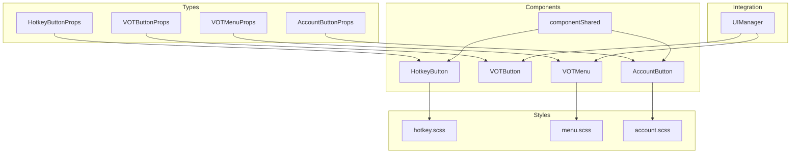
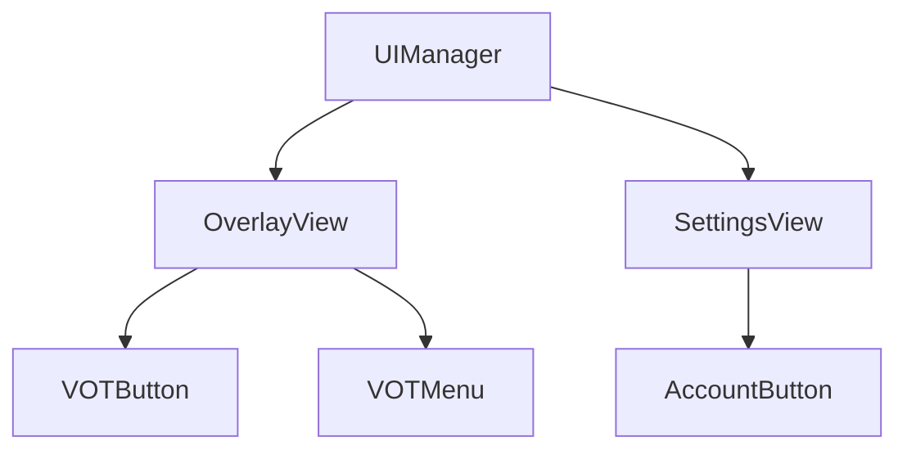
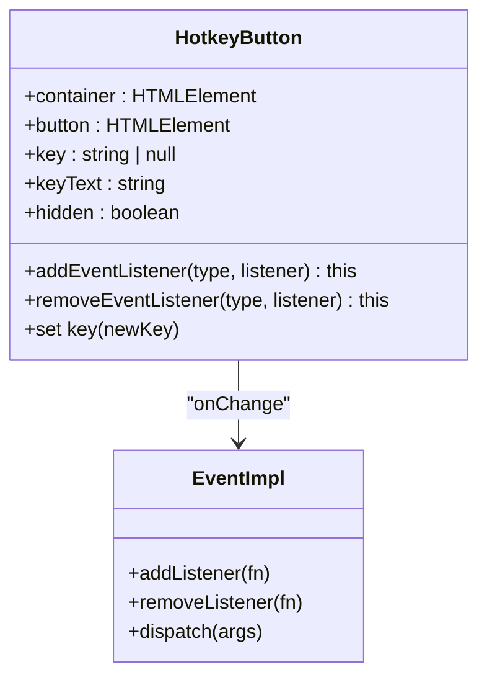
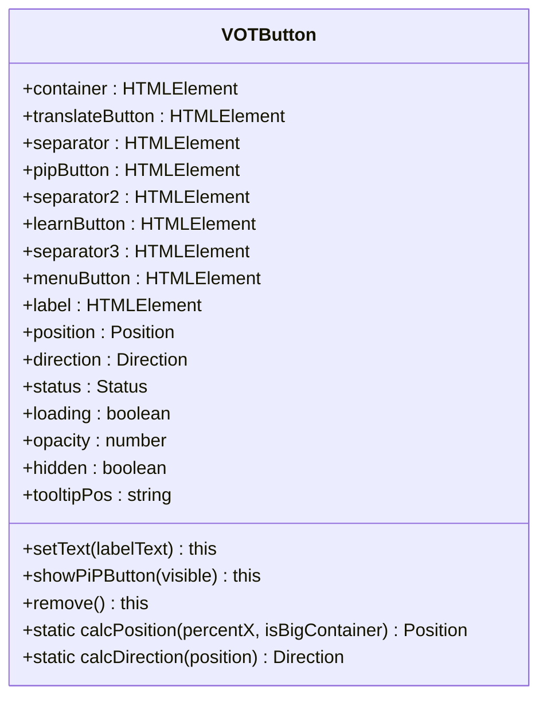
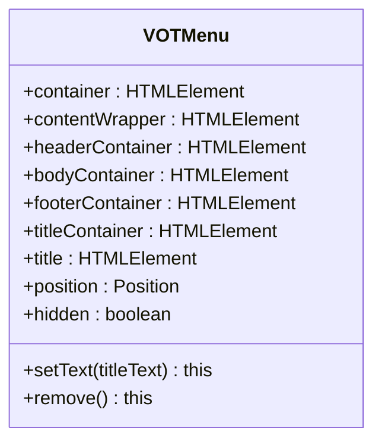
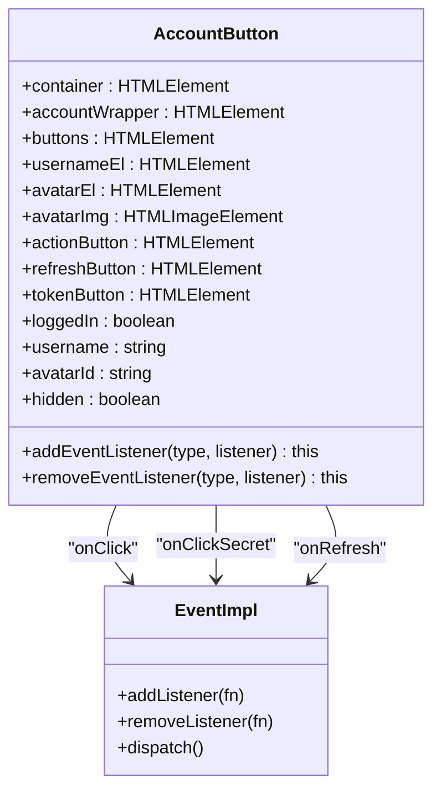
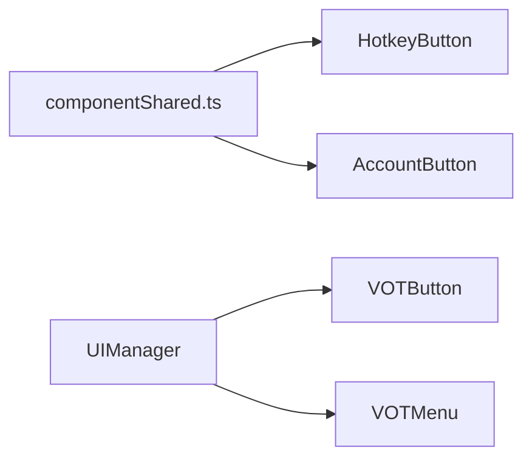

# Specialized Controls

<cite>
**Referenced Files in This Document**
- [hotkeyButton.ts](file://src/types/components/hotkeyButton.ts)
- [votButton.ts](file://src/types/components/votButton.ts)
- [votMenu.ts](file://src/types/components/votMenu.ts)
- [accountButton.ts](file://src/types/components/accountButton.ts)
- [hotkeyButton.ts](file://src/ui/components/hotkeyButton.ts)
- [votButton.ts](file://src/ui/components/votButton.ts)
- [votMenu.ts](file://src/ui/components/votMenu.ts)
- [accountButton.ts](file://src/ui/components/accountButton.ts)
- [componentShared.ts](file://src/ui/components/componentShared.ts)
- [manager.ts](file://src/ui/manager.ts)
- [hotkey.scss](file://src/styles/components/buttons/hotkey.scss)
- [menu.scss](file://src/styles/components/menu.scss)
- [account.scss](file://src/styles/components/account.scss)
</cite>

## Table of Contents
1. [Introduction](#introduction)
2. [Project Structure](#project-structure)
3. [Core Components](#core-components)
4. [Architecture Overview](#architecture-overview)
5. [Detailed Component Analysis](#detailed-component-analysis)
6. [Dependency Analysis](#dependency-analysis)
7. [Performance Considerations](#performance-considerations)
8. [Troubleshooting Guide](#troubleshooting-guide)
9. [Conclusion](#conclusion)

## Introduction
This document provides comprehensive API documentation for specialized control components in the English Teacher extension: Hotkey Button, VOT Button, VOT Menu, and Account Button. It covers TypeScript interface specifications, component APIs, keyboard interaction patterns, state management, accessibility features, and integration with the extension’s UI manager. Usage examples demonstrate hotkey registration, button state transitions, menu item handling, and account integration patterns.

## Project Structure
The specialized controls are implemented as UI components with associated TypeScript interfaces and styles:
- Types define props and enums for component configuration.
- Components encapsulate DOM creation, event handling, and state management.
- Styles define appearance and responsive behavior.
- The UI manager integrates controls into the overlay and settings views.

**Diagram sources**
- [hotkeyButton.ts:1-5](file://src/types/components/hotkeyButton.ts#L1-L5)
- [votButton.ts:1-15](file://src/types/components/votButton.ts#L1-L15)
- [votMenu.ts:1-7](file://src/types/components/votMenu.ts#L1-L7)
- [accountButton.ts:1-6](file://src/types/components/accountButton.ts#L1-L6)
- [hotkeyButton.ts:1-255](file://src/ui/components/hotkeyButton.ts#L1-L255)
- [votButton.ts:1-225](file://src/ui/components/votButton.ts#L1-L225)
- [votMenu.ts:1-123](file://src/ui/components/votMenu.ts#L1-L123)
- [accountButton.ts:1-174](file://src/ui/components/accountButton.ts#L1-L174)
- [componentShared.ts:1-39](file://src/ui/components/componentShared.ts#L1-L39)
- [hotkey.scss:1-53](file://src/styles/components/buttons/hotkey.scss#L1-L53)
- [menu.scss:1-138](file://src/styles/components/menu.scss#L1-L138)
- [account.scss:1-29](file://src/styles/components/account.scss#L1-L29)
- [manager.ts:56-138](file://src/ui/manager.ts#L56-L138)

**Section sources**
- [hotkeyButton.ts:1-5](file://src/types/components/hotkeyButton.ts#L1-L5)
- [votButton.ts:1-15](file://src/types/components/votButton.ts#L1-L15)
- [votMenu.ts:1-7](file://src/types/components/votMenu.ts#L1-L7)
- [accountButton.ts:1-6](file://src/types/components/accountButton.ts#L1-L6)
- [hotkeyButton.ts:1-255](file://src/ui/components/hotkeyButton.ts#L1-L255)
- [votButton.ts:1-225](file://src/ui/components/votButton.ts#L1-L225)
- [votMenu.ts:1-123](file://src/ui/components/votMenu.ts#L1-L123)
- [accountButton.ts:1-174](file://src/ui/components/accountButton.ts#L1-L174)
- [componentShared.ts:1-39](file://src/ui/components/componentShared.ts#L1-L39)
- [hotkey.scss:1-53](file://src/styles/components/buttons/hotkey.scss#L1-L53)
- [menu.scss:1-138](file://src/styles/components/menu.scss#L1-L138)
- [account.scss:1-29](file://src/styles/components/account.scss#L1-L29)
- [manager.ts:56-138](file://src/ui/manager.ts#L56-L138)

## Core Components
This section defines the public TypeScript interfaces for each component’s props and enumerations.

- HotkeyButtonProps
  - labelHtml: string
  - key?: string | null
- VOTButtonProps
  - position?: "default" | "top" | "left" | "right"
  - direction?: "default" | "row" | "column"
  - status?: "none" | "error" | "success" | "loading"
  - labelHtml?: string
- VOTMenuProps
  - position?: "default" | "top" | "left" | "right"
  - titleHtml?: string
- AccountButtonProps
  - loggedIn?: boolean
  - username?: string
  - avatarId?: string

These interfaces specify the contract for constructing and configuring each control.

**Section sources**
- [hotkeyButton.ts:1-5](file://src/types/components/hotkeyButton.ts#L1-L5)
- [votButton.ts:1-15](file://src/types/components/votButton.ts#L1-L15)
- [votMenu.ts:1-7](file://src/types/components/votMenu.ts#L1-L7)
- [accountButton.ts:1-6](file://src/types/components/accountButton.ts#L1-L6)

## Architecture Overview
The specialized controls are integrated into the extension’s overlay and settings views via the UIManager. The VOTButton and VOTMenu are part of the overlay, while the AccountButton appears in settings and overlays. Styles are scoped to component classes for maintainability and isolation.

**Diagram sources**
- [manager.ts:56-138](file://src/ui/manager.ts#L56-L138)
- [votButton.ts:1-225](file://src/ui/components/votButton.ts#L1-L225)
- [votMenu.ts:1-123](file://src/ui/components/votMenu.ts#L1-L123)
- [accountButton.ts:1-174](file://src/ui/components/accountButton.ts#L1-L174)

**Section sources**
- [manager.ts:56-138](file://src/ui/manager.ts#L56-L138)
- [votButton.ts:1-225](file://src/ui/components/votButton.ts#L1-L225)
- [votMenu.ts:1-123](file://src/ui/components/votMenu.ts#L1-L123)
- [accountButton.ts:1-174](file://src/ui/components/accountButton.ts#L1-L174)

## Detailed Component Analysis

### Hotkey Button
The Hotkey Button allows users to record and display keyboard combinations. It manages recording state, key capture, and emits a change event when the key binding is updated.

- Props
  - labelHtml: string — Label content for the control.
  - key?: string | null — Current key combination or null.
- Events
  - change: (key: string | null) => void — Fired when the key binding changes.
- Methods and Properties
  - key: string | null — Getter/setter for the current key binding.
  - keyText: string — Human-readable representation of the key binding.
  - hidden: boolean — Toggle visibility via shared hidden state.
  - addEventListener(type: "change", listener): this
  - removeEventListener(type: "change", listener): this
- Keyboard Interaction
  - Click to enter recording mode.
  - Press keys to build a combination; released keys finalize the combo.
  - Escape cancels recording without changing the value.
- Accessibility
  - Uses a custom button-like element with keyboard support.
- State Management
  - Internal recording flag and sets for pressed/combo keys.
  - Emits change event on assignment.

**Diagram sources**
- [hotkeyButton.ts:12-179](file://src/ui/components/hotkeyButton.ts#L12-L179)

**Section sources**
- [hotkeyButton.ts:1-255](file://src/ui/components/hotkeyButton.ts#L1-L255)
- [hotkeyButton.ts:1-5](file://src/types/components/hotkeyButton.ts#L1-L5)
- [componentShared.ts:1-39](file://src/ui/components/componentShared.ts#L1-L39)
- [hotkey.scss:1-53](file://src/styles/components/buttons/hotkey.scss#L1-L53)

Usage example (paths only):
- Register a change listener and update the key binding programmatically.
  - [hotkeyButton.ts:129-145](file://src/ui/components/hotkeyButton.ts#L129-L145)
  - [hotkeyButton.ts:170-178](file://src/ui/components/hotkeyButton.ts#L170-L178)

### VOT Button
The VOT Button is a segmented control containing Translate, Picture-in-Picture, Language Learning, and Menu actions. It supports dynamic positioning, direction, status, and opacity.

- Props
  - position?: "default" | "top" | "left" | "right"
  - direction?: "default" | "row" | "column"
  - status?: "none" | "error" | "success" | "loading"
  - labelHtml?: string
- Methods and Properties
  - position: Position — Getter/setter for dataset position.
  - direction: Direction — Getter/setter for dataset direction.
  - status: Status — Getter/setter for dataset status.
  - loading: boolean — Setter for dataset loading state.
  - opacity: number — Controls visibility via CSS class.
  - hidden: boolean — Toggle visibility via shared hidden state.
  - setText(labelText: string): this — Updates the label text and ARIA label.
  - showPiPButton(visible: boolean): this — Toggle PiP segment visibility.
  - remove(): this — Remove the container from DOM.
  - tooltipPos: string — Tooltip placement derived from position.
  - Static helpers:
    - calcPosition(percentX: number, isBigContainer: boolean): Position
    - calcDirection(position: Position): Direction
- Accessibility
  - Segments are role="button" with tabIndex and ARIA labels.
  - Menu segment includes ARIA dialog attributes.

**Diagram sources**
- [votButton.ts:18-225](file://src/ui/components/votButton.ts#L18-L225)

**Section sources**
- [votButton.ts:1-225](file://src/ui/components/votButton.ts#L1-L225)
- [votButton.ts:1-15](file://src/types/components/votButton.ts#L1-L15)
- [componentShared.ts:1-39](file://src/ui/components/componentShared.ts#L1-L39)

Usage example (paths only):
- Update button status and tooltip text after translation actions.
  - [manager.ts:847-857](file://src/ui/manager.ts#L847-L857)

### VOT Menu
The VOT Menu is a non-modal dialog/popover used for quick settings. It supports dynamic positioning and ARIA attributes for accessibility.

- Props
  - position?: "default" | "top" | "left" | "right"
  - titleHtml?: string
- Methods and Properties
  - position: Position — Getter/setter for dataset position.
  - hidden: boolean — Toggle visibility and inert state.
  - setText(titleText: string): this — Update title text.
  - remove(): this — Remove the container from DOM.
- Accessibility
  - role="dialog", aria-modal=false, aria-hidden=true, inert when hidden.
  - Stable ids for aria-labelledby.

**Diagram sources**
- [votMenu.ts:6-123](file://src/ui/components/votMenu.ts#L6-L123)

**Section sources**
- [votMenu.ts:1-123](file://src/ui/components/votMenu.ts#L1-L123)
- [votMenu.ts:1-7](file://src/types/components/votMenu.ts#L1-L7)
- [componentShared.ts:1-39](file://src/ui/components/componentShared.ts#L1-L39)
- [menu.scss:1-138](file://src/styles/components/menu.scss#L1-L138)

Usage example (paths only):
- Open settings dialog and manage menu visibility during language changes.
  - [manager.ts:184-190](file://src/ui/manager.ts#L184-L190)
  - [manager.ts:673-733](file://src/ui/manager.ts#L673-L733)

### Account Button
The Account Button displays user profile and actions, supporting login/logout, token-based login, and refresh operations.

- Props
  - loggedIn?: boolean
  - username?: string
  - avatarId?: string
- Events
  - click: () => void
  - "click:secret": () => void
  - refresh: () => void
- Methods and Properties
  - loggedIn: boolean — Toggle logged-in wrapper and button text.
  - username: string — Update displayed username.
  - avatarId: string — Update avatar image source.
  - hidden: boolean — Toggle visibility via shared hidden state.
  - addEventListener(type, listener): this
  - removeEventListener(type, listener): this
- Accessibility
  - Avatar image alt text for screen readers.

**Diagram sources**
- [accountButton.ts:14-174](file://src/ui/components/accountButton.ts#L14-L174)

**Section sources**
- [accountButton.ts:1-174](file://src/ui/components/accountButton.ts#L1-L174)
- [accountButton.ts:1-6](file://src/types/components/accountButton.ts#L1-L6)
- [componentShared.ts:1-39](file://src/ui/components/componentShared.ts#L1-L39)
- [account.scss:1-29](file://src/styles/components/account.scss#L1-L29)

Usage example (paths only):
- Bind click handlers to open settings or refresh token.
  - [accountButton.ts:113-129](file://src/ui/components/accountButton.ts#L113-L129)
  - [manager.ts:247-253](file://src/ui/manager.ts#L247-L253)

## Dependency Analysis
The components share a common event registration utility and integrate with the UIManager for orchestration.

**Diagram sources**
- [componentShared.ts:1-39](file://src/ui/components/componentShared.ts#L1-L39)
- [hotkeyButton.ts:1-255](file://src/ui/components/hotkeyButton.ts#L1-L255)
- [accountButton.ts:1-174](file://src/ui/components/accountButton.ts#L1-L174)
- [votButton.ts:1-225](file://src/ui/components/votButton.ts#L1-L225)
- [votMenu.ts:1-123](file://src/ui/components/votMenu.ts#L1-L123)
- [manager.ts:56-138](file://src/ui/manager.ts#L56-L138)

**Section sources**
- [componentShared.ts:1-39](file://src/ui/components/componentShared.ts#L1-L39)
- [manager.ts:56-138](file://src/ui/manager.ts#L56-L138)

## Performance Considerations
- Event listeners are attached and detached carefully to avoid leaks. Recording mode in Hotkey Button removes global listeners upon completion.
- Hidden state is managed via a shared utility to prevent inline style overrides that could break visibility.
- VOT Button uses CSS classes for opacity and visibility to minimize forced reflows.
- Menu and Account components rely on inert and aria-hidden to disable interactions when hidden.

[No sources needed since this section provides general guidance]

## Troubleshooting Guide
- Hotkey recording does not persist
  - Ensure the change event listener is registered and the key property is assigned.
  - Verify that Escape cancels recording and that keyup clears pressed keys.
  - References:
    - [hotkeyButton.ts:41-92](file://src/ui/components/hotkeyButton.ts#L41-L92)
    - [hotkeyButton.ts:129-178](file://src/ui/components/hotkeyButton.ts#L129-L178)
- VOT Button status not updating
  - Confirm setting the status property and calling setText for tooltip content.
  - References:
    - [votButton.ts:173-179](file://src/ui/components/votButton.ts#L173-L179)
    - [votButton.ts:150-155](file://src/ui/components/votButton.ts#L150-L155)
    - [manager.ts:847-857](file://src/ui/manager.ts#L847-L857)
- VOT Menu not opening
  - Check hidden setter toggles inert and aria-hidden, and ensure position is applied via dataset.
  - References:
    - [votMenu.ts:104-113](file://src/ui/components/votMenu.ts#L104-L113)
    - [votMenu.ts:119-121](file://src/ui/components/votMenu.ts#L119-L121)
- Account Button actions not firing
  - Ensure addEventListener is called for the desired event type and that the button is not hidden.
  - References:
    - [accountButton.ts:113-129](file://src/ui/components/accountButton.ts#L113-L129)
    - [accountButton.ts:166-172](file://src/ui/components/accountButton.ts#L166-L172)

**Section sources**
- [hotkeyButton.ts:41-92](file://src/ui/components/hotkeyButton.ts#L41-L92)
- [hotkeyButton.ts:129-178](file://src/ui/components/hotkeyButton.ts#L129-L178)
- [votButton.ts:150-179](file://src/ui/components/votButton.ts#L150-L179)
- [votButton.ts:173-179](file://src/ui/components/votButton.ts#L173-L179)
- [manager.ts:847-857](file://src/ui/manager.ts#L847-L857)
- [votMenu.ts:104-121](file://src/ui/components/votMenu.ts#L104-L121)
- [accountButton.ts:113-172](file://src/ui/components/accountButton.ts#L113-L172)

## Conclusion
The specialized control components provide robust, accessible, and modular UI elements for the English Teacher extension. Their TypeScript interfaces define clear contracts, while their implementations encapsulate keyboard interactions, state management, and accessibility best practices. Integration with the UIManager ensures consistent behavior across overlay and settings contexts, with dedicated styles for responsive and theme-aligned presentation.