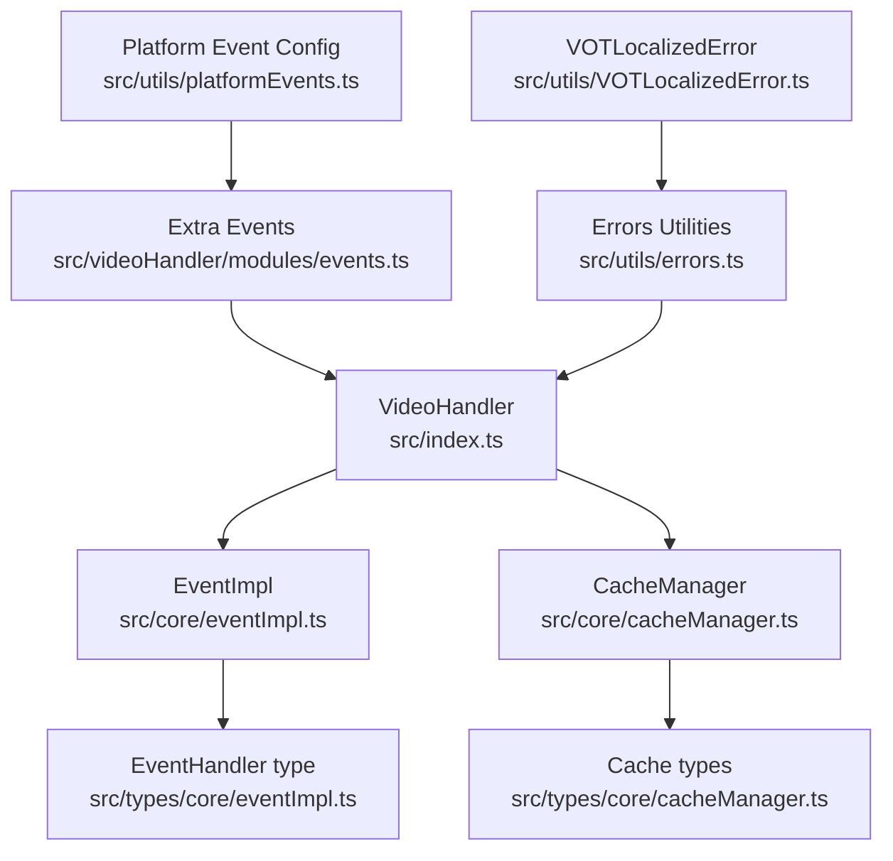
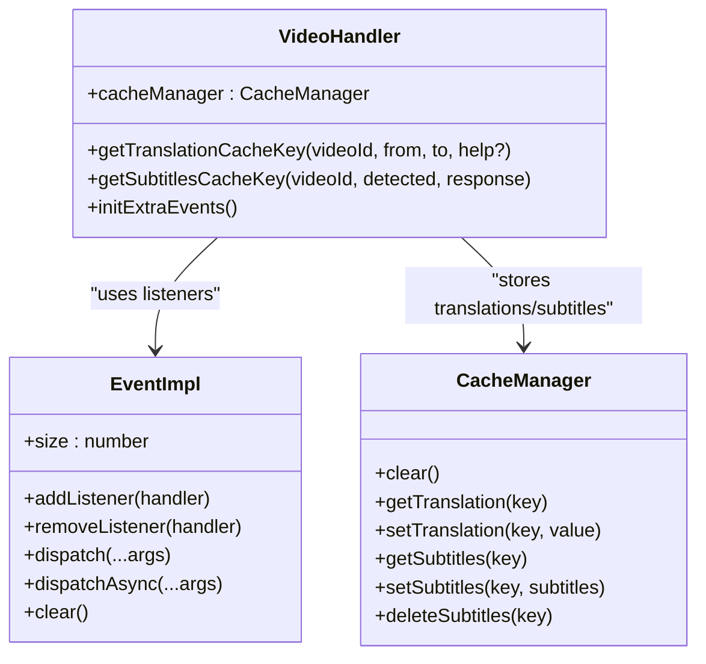
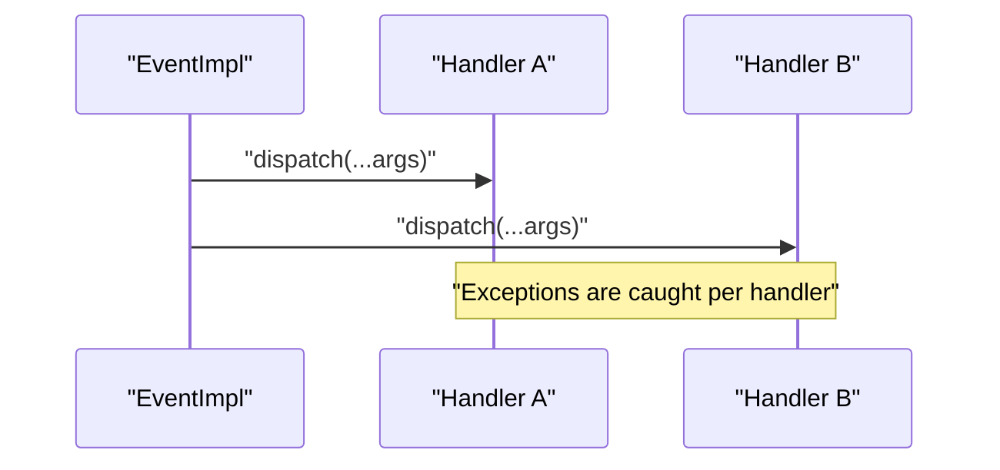
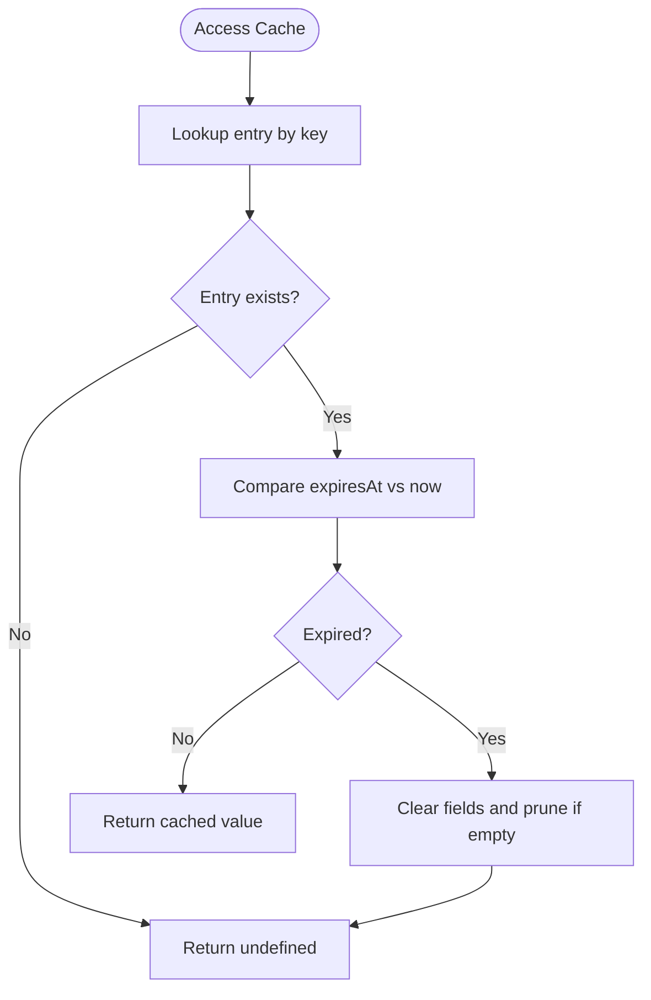
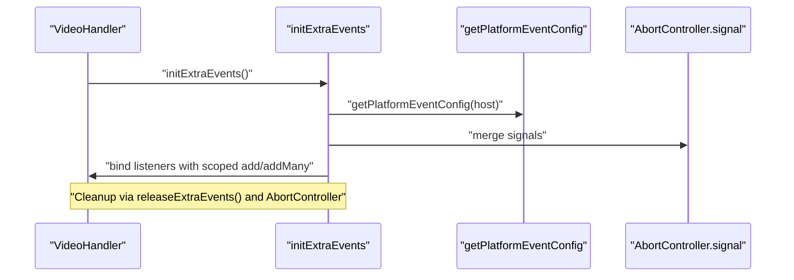
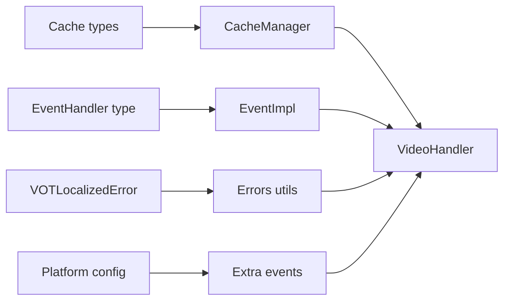

# Core APIs

<cite>
**Referenced Files in This Document**
- [eventImpl.ts](file://src/core/eventImpl.ts)
- [eventImpl.ts (types)](file://src/types/core/eventImpl.ts)
- [cacheManager.ts](file://src/core/cacheManager.ts)
- [cacheManager.ts (types)](file://src/types/core/cacheManager.ts)
- [events.ts](file://src/videoHandler/modules/events.ts)
- [platformEvents.ts](file://src/utils/platformEvents.ts)
- [errors.ts](file://src/utils/errors.ts)
- [VOTLocalizedError.ts](file://src/utils/VOTLocalizedError.ts)
- [index.ts](file://src/index.ts)
- [global.d.ts](file://src/global.d.ts)
</cite>

## Table of Contents
1. [Introduction](#introduction)
2. [Project Structure](#project-structure)
3. [Core Components](#core-components)
4. [Architecture Overview](#architecture-overview)
5. [Detailed Component Analysis](#detailed-component-analysis)
6. [Dependency Analysis](#dependency-analysis)
7. [Performance Considerations](#performance-considerations)
8. [Troubleshooting Guide](#troubleshooting-guide)
9. [Conclusion](#conclusion)

## Introduction
This document provides comprehensive API documentation for the English Teacher extension’s core system interfaces with a focus on:
- Strongly-typed event handler system: EventHandler type definitions, event emission patterns, and listener registration mechanisms
- Cache manager API: caching strategies, invalidation policies, storage mechanisms, and performance optimization techniques
- TypeScript type definitions, interface specifications, and parameter documentation
- Practical usage patterns for event subscription, cache operations, and error handling
- Event lifecycle management, cache invalidation triggers, and memory management considerations
- Performance characteristics, concurrent access patterns, and thread-safety guarantees

## Project Structure
The core APIs are implemented in focused modules under src/core and src/types/core, with usage integrated into the main VideoHandler orchestration class and event binding utilities.

**Diagram sources**
- [eventImpl.ts:1-68](file://src/core/eventImpl.ts#L1-L68)
- [eventImpl.ts (types):1-17](file://src/types/core/eventImpl.ts#L1-L17)
- [cacheManager.ts:1-119](file://src/core/cacheManager.ts#L1-L119)
- [cacheManager.ts (types):1-21](file://src/types/core/cacheManager.ts#L1-L21)
- [events.ts:1-567](file://src/videoHandler/modules/events.ts#L1-L567)
- [platformEvents.ts:1-31](file://src/utils/platformEvents.ts#L1-L31)
- [errors.ts:1-110](file://src/utils/errors.ts#L1-L110)
- [VOTLocalizedError.ts:1-21](file://src/utils/VOTLocalizedError.ts#L1-L21)
- [index.ts:1-800](file://src/index.ts#L1-L800)

**Section sources**
- [index.ts:1-800](file://src/index.ts#L1-L800)
- [eventImpl.ts:1-68](file://src/core/eventImpl.ts#L1-L68)
- [cacheManager.ts:1-119](file://src/core/cacheManager.ts#L1-L119)
- [events.ts:1-567](file://src/videoHandler/modules/events.ts#L1-L567)

## Core Components
- Event system: A lightweight, strongly-typed event emitter with synchronous and asynchronous dispatch modes, idempotent listener registration, and isolated error handling per listener.
- Cache manager: An in-memory cache with TTL for translations and subtitles, keyed by stable identifiers derived from video metadata and request parameters.

**Section sources**
- [eventImpl.ts:1-68](file://src/core/eventImpl.ts#L1-L68)
- [eventImpl.ts (types):1-17](file://src/types/core/eventImpl.ts#L1-L17)
- [cacheManager.ts:1-119](file://src/core/cacheManager.ts#L1-L119)
- [cacheManager.ts (types):1-21](file://src/types/core/cacheManager.ts#L1-L21)

## Architecture Overview
The VideoHandler composes managers and orchestrators and exposes stable cache keys for both translations and subtitles. It integrates event listeners for UI interactions, lifecycle events, and platform-specific behaviors. The cache manager stores translation and subtitle payloads with TTL and automatic eviction.

**Diagram sources**
- [eventImpl.ts:1-68](file://src/core/eventImpl.ts#L1-L68)
- [cacheManager.ts:1-119](file://src/core/cacheManager.ts#L1-L119)
- [index.ts:290-335](file://src/index.ts#L290-L335)

## Detailed Component Analysis

### Event Handler System
- EventHandler type: A generic function type that accepts a variadic tuple of arguments and returns either void or a Promise<void>.
- EventImpl class:
  - Maintains a Set of handlers for uniqueness and idempotency
  - Provides addListener, removeListener, dispatch, dispatchAsync, and clear
  - Dispatch isolates exceptions per handler; async dispatch aggregates settled promises and logs rejections

Usage patterns:
- Subscribe to events via addListener with a strongly-typed handler
- Emit synchronously with dispatch or asynchronously with dispatchAsync
- Unsubscribe with removeListener or clear the registry

Error handling:
- Exceptions thrown by individual handlers are caught and logged; other handlers continue receiving events
- Async dispatch waits for all promises and logs rejected ones

Thread-safety and concurrency:
- Single-threaded JavaScript model applies; operations are atomic per microtask/async boundary
- No explicit locking; Set ensures idempotent registration

**Section sources**
- [eventImpl.ts:1-68](file://src/core/eventImpl.ts#L1-L68)
- [eventImpl.ts (types):1-17](file://src/types/core/eventImpl.ts#L1-L17)

#### Event Emission Flow

**Diagram sources**
- [eventImpl.ts:28-36](file://src/core/eventImpl.ts#L28-L36)

### Cache Manager API
- TTL: Translations use a fixed TTL constant for expiration
- Fields: Separate fields for translation and subtitles with corresponding expiration timestamps
- Storage: In-memory Map keyed by stable identifiers
- Operations:
  - getTranslation, setTranslation
  - getSubtitles, setSubtitles, deleteSubtitles
  - clear
- Invalidation:
  - Automatic eviction when TTL expires
  - Explicit deletion of values and pruning of empty entries
  - Clearing the entire cache

Cache key derivation:
- Translation cache key: built from videoId, resolved request language, response language, lively voice flag, and optional help hash
- Subtitles cache key: built from videoId, detected language, response language, and lively voice flag

Memory management:
- Entries are removed when both translation and subtitles are undefined
- Manual clear or implicit eviction keeps memory bounded by active keys

**Section sources**
- [cacheManager.ts:1-119](file://src/core/cacheManager.ts#L1-L119)
- [cacheManager.ts (types):1-21](file://src/types/core/cacheManager.ts#L1-L21)
- [index.ts:290-335](file://src/index.ts#L290-L335)

#### Cache Invalidation and Lifecycle

**Diagram sources**
- [cacheManager.ts:60-78](file://src/core/cacheManager.ts#L60-L78)
- [cacheManager.ts:105-109](file://src/core/cacheManager.ts#L105-L109)

### Event Lifecycle Management in VideoHandler
- Extra events binding: The VideoHandler initializes scoped listeners with an AbortSignal to tie lifecycles to the handler instance
- Platform overrides: Per-host event configuration controls touch and drag behavior
- Lifecycle events: Listeners for canplay, emptied, volumechange, and host-specific page updates
- Hotkeys and overlays: Keyboard shortcuts and overlay visibility are bound with scoped listeners and cleaned up on release

Concurrency and cancellation:
- AbortController signals ensure event listeners are removed when the handler lifecycle ends
- Scoped listeners merge AbortSignal with provided options to honor early termination

**Section sources**
- [events.ts:511-527](file://src/videoHandler/modules/events.ts#L511-L527)
- [events.ts:559-567](file://src/videoHandler/modules/events.ts#L559-L567)
- [platformEvents.ts:1-31](file://src/utils/platformEvents.ts#L1-L31)
- [index.ts:798-800](file://src/index.ts#L798-L800)

#### Extra Events Binding Flow

**Diagram sources**
- [events.ts:511-527](file://src/videoHandler/modules/events.ts#L511-L527)
- [platformEvents.ts:20-30](file://src/utils/platformEvents.ts#L20-L30)

## Dependency Analysis
- EventImpl depends on EventHandler type definitions
- CacheManager depends on cache-related types and uses a Map for storage
- VideoHandler composes CacheManager and binds extra events through event modules
- Error utilities provide consistent error handling and localized error types

**Diagram sources**
- [eventImpl.ts (types):1-17](file://src/types/core/eventImpl.ts#L1-L17)
- [eventImpl.ts:1-68](file://src/core/eventImpl.ts#L1-L68)
- [cacheManager.ts (types):1-21](file://src/types/core/cacheManager.ts#L1-L21)
- [cacheManager.ts:1-119](file://src/core/cacheManager.ts#L1-L119)
- [errors.ts:1-110](file://src/utils/errors.ts#L1-L110)
- [VOTLocalizedError.ts:1-21](file://src/utils/VOTLocalizedError.ts#L1-L21)
- [platformEvents.ts:1-31](file://src/utils/platformEvents.ts#L1-L31)
- [events.ts:1-567](file://src/videoHandler/modules/events.ts#L1-L567)
- [index.ts:1-800](file://src/index.ts#L1-L800)

**Section sources**
- [index.ts:1-800](file://src/index.ts#L1-L800)
- [events.ts:1-567](file://src/videoHandler/modules/events.ts#L1-L567)
- [errors.ts:1-110](file://src/utils/errors.ts#L1-L110)
- [VOTLocalizedError.ts:1-21](file://src/utils/VOTLocalizedError.ts#L1-L21)

## Performance Considerations
- Event dispatch:
  - Synchronous dispatch iterates listeners and catches exceptions per handler, minimizing cascade failures
  - Asynchronous dispatch collects promises and awaits allSettled, preventing unhandled rejections while logging failures
- Cache:
  - O(1) average-time operations for get/set/delete via Map
  - TTL-based lazy eviction prevents unbounded growth; empty entries are pruned immediately after deletion
  - Stable cache keys reduce recomputation and improve hit rates
- Memory:
  - Automatic eviction and manual clear provide predictable memory footprint
- Concurrency:
  - Single-threaded nature eliminates race conditions; AbortController ensures timely cleanup

[No sources needed since this section provides general guidance]

## Troubleshooting Guide
Common scenarios and strategies:
- Event handler errors:
  - Isolated exceptions are logged; verify handler signatures and argument tuples
- Async event handling:
  - Use dispatchAsync when handlers return promises; inspect rejected items in logs
- Cache misses/expiry:
  - Confirm TTL alignment and ensure keys are constructed consistently
  - Use clear to invalidate stale entries when settings change
- Platform-specific event behavior:
  - Review platform overrides for touch/drag configurations
- Error messages:
  - Use error utilities to extract readable messages and detect AbortError
  - Localized errors surface resolved messages while preserving unlocalized keys

**Section sources**
- [eventImpl.ts:28-62](file://src/core/eventImpl.ts#L28-L62)
- [cacheManager.ts:60-103](file://src/core/cacheManager.ts#L60-L103)
- [platformEvents.ts:1-31](file://src/utils/platformEvents.ts#L1-L31)
- [errors.ts:24-109](file://src/utils/errors.ts#L24-L109)
- [VOTLocalizedError.ts:1-21](file://src/utils/VOTLocalizedError.ts#L1-L21)

## Conclusion
The core APIs provide a robust, strongly-typed foundation for event handling and caching:
- EventImpl offers concise, safe, and scalable event emission with clear error boundaries
- CacheManager delivers efficient, TTL-aware caching for translations and subtitles with straightforward invalidation semantics
- VideoHandler integrates these APIs with lifecycle-aware event binding and platform-specific behavior
- Together, they support reliable performance, maintainable code, and predictable memory usage

[No sources needed since this section summarizes without analyzing specific files]