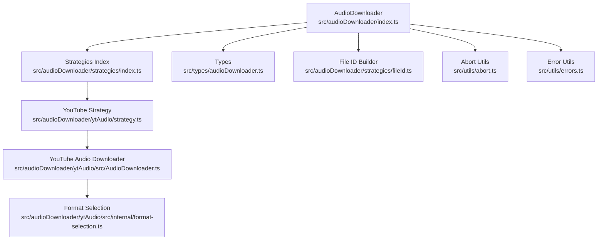
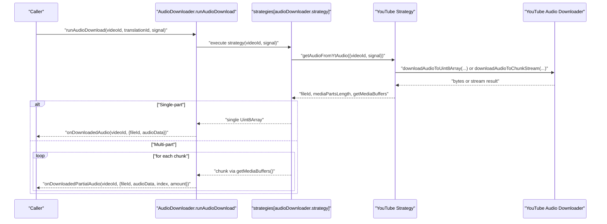
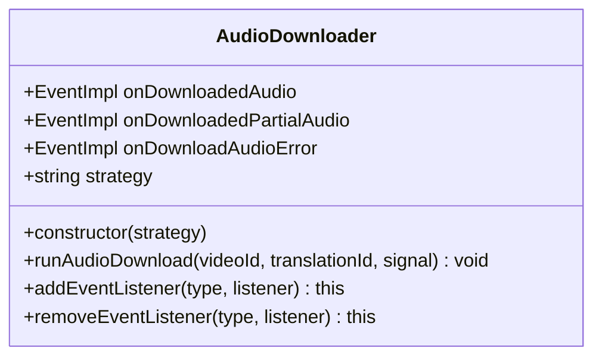
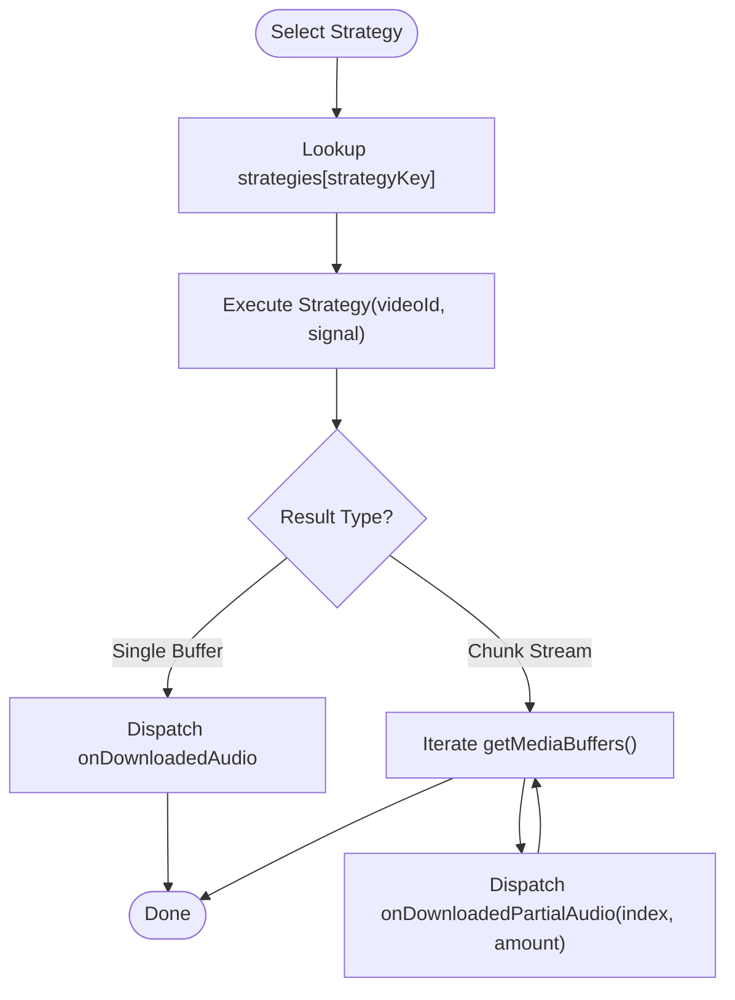
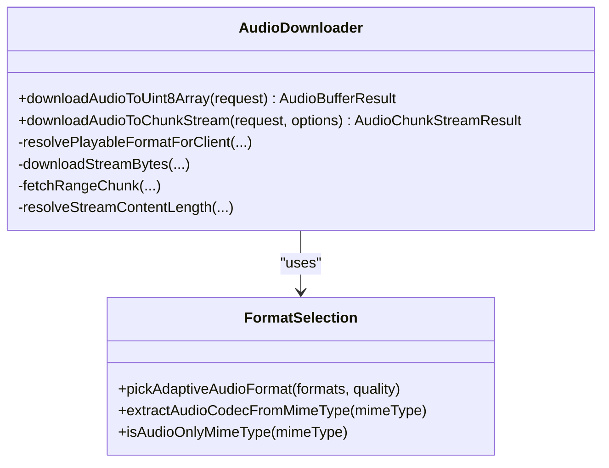
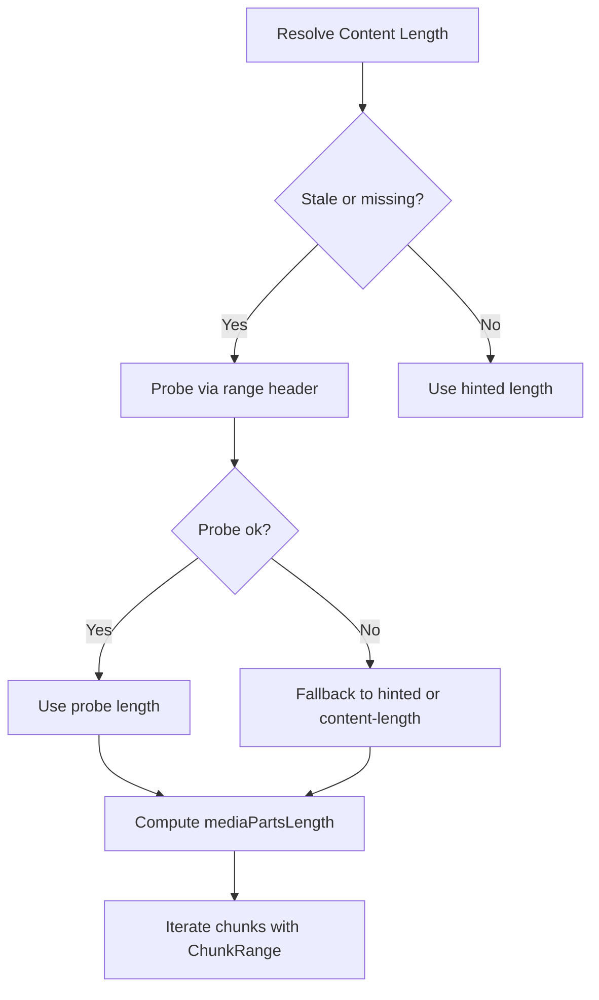
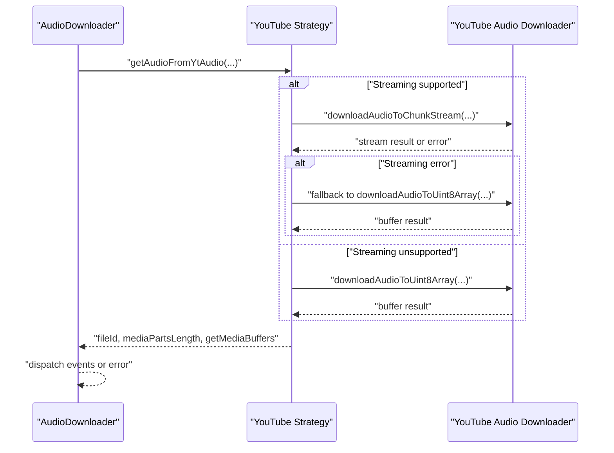
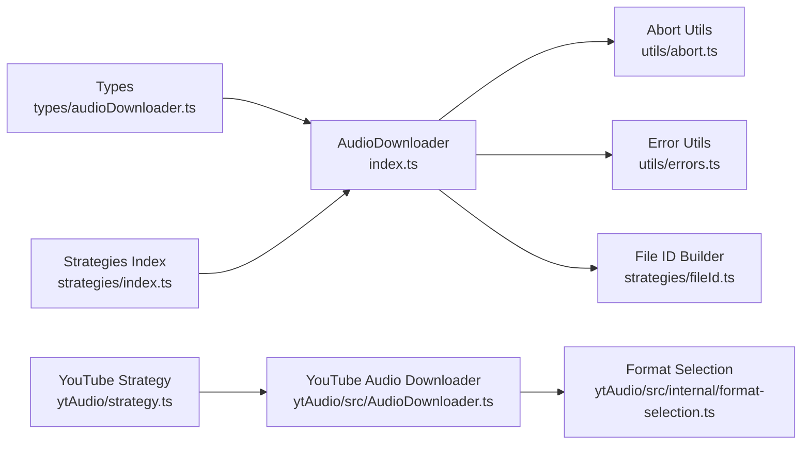

# Audio Downloader APIs

<cite>
**Referenced Files in This Document**
- [index.ts](file://src/audioDownloader/index.ts)
- [types/audioDownloader.ts](file://src/types/audioDownloader.ts)
- [ytAudio/strategy.ts](file://src/audioDownloader/ytAudio/strategy.ts)
- [ytAudio/src/AudioDownloader.ts](file://src/audioDownloader/ytAudio/src/AudioDownloader.ts)
- [ytAudio/src/internal/format-selection.ts](file://src/audioDownloader/ytAudio/src/internal/format-selection.ts)
- [strategies/index.ts](file://src/audioDownloader/strategies/index.ts)
- [strategies/fileId.ts](file://src/audioDownloader/strategies/fileId.ts)
- [README.md](file://src/audioDownloader/README.md)
- [ytAudio/README.md](file://src/audioDownloader/ytAudio/README.md)
- [utils/abort.ts](file://src/utils/abort.ts)
- [utils/errors.ts](file://src/utils/errors.ts)
</cite>

## Table of Contents
1. [Introduction](#introduction)
2. [Project Structure](#project-structure)
3. [Core Components](#core-components)
4. [Architecture Overview](#architecture-overview)
5. [Detailed Component Analysis](#detailed-component-analysis)
6. [Dependency Analysis](#dependency-analysis)
7. [Performance Considerations](#performance-considerations)
8. [Troubleshooting Guide](#troubleshooting-guide)
9. [Conclusion](#conclusion)
10. [Appendices](#appendices)

## Introduction
This document provides comprehensive API documentation for the audio downloader utility. It covers request/response types, chunk range handling, partial audio data structures, the audio download strategy pattern, YouTube-specific audio formats, error handling, abort signal usage, and retry mechanisms. Practical examples demonstrate configuring audio downloads, handling different data sources, and processing downloaded audio data. Performance considerations for large audio files and streaming scenarios are included.

## Project Structure
The audio downloader is organized into:
- Core orchestration and event dispatching
- Strategy pattern for selecting and executing download implementations
- YouTube-specific audio downloader with format selection and streaming
- Type definitions for requests, responses, and partial data
- Utilities for abort signals and error normalization

**Diagram sources**
- [index.ts:1-189](file://src/audioDownloader/index.ts#L1-L189)
- [strategies/index.ts:1-10](file://src/audioDownloader/strategies/index.ts#L1-L10)
- [ytAudio/strategy.ts:1-155](file://src/audioDownloader/ytAudio/strategy.ts#L1-L155)
- [ytAudio/src/AudioDownloader.ts:1-955](file://src/audioDownloader/ytAudio/src/AudioDownloader.ts#L1-L955)
- [ytAudio/src/internal/format-selection.ts:1-305](file://src/audioDownloader/ytAudio/src/internal/format-selection.ts#L1-L305)
- [types/audioDownloader.ts:1-89](file://src/types/audioDownloader.ts#L1-L89)
- [strategies/fileId.ts:1-16](file://src/audioDownloader/strategies/fileId.ts#L1-L16)
- [utils/abort.ts:1-94](file://src/utils/abort.ts#L1-L94)
- [utils/errors.ts:1-110](file://src/utils/errors.ts#L1-L110)

**Section sources**
- [README.md:1-13](file://src/audioDownloader/README.md#L1-L13)
- [ytAudio/README.md:1-29](file://src/audioDownloader/ytAudio/README.md#L1-L29)

## Core Components
This section documents the primary types and classes used by the audio downloader.

- DownloadAudioDataIframeResponsePayload
  - Purpose: Encapsulates iframe response payload for audio downloads, including request metadata and optional adaptive format.
  - Key fields:
    - requestInfo: Identifier for the request.
    - requestInit: Original request initialization data (serialized if needed).
    - adaptiveFormat: Optional YouTube adaptive format metadata.
    - itag: YouTube format identifier.
    - source: Data source type ("player-response", "performance", "fetch-hook", "xhr-hook").

- FetchMediaWithMetaOptions
  - Purpose: Options for fetching media with metadata, including URL, chunk range, request init, abort signal, and optional URL change flag.
  - Fields:
    - mediaUrl: Target URL to fetch.
    - chunkRange: Range to fetch within the media.
    - requestInit: Fetch request configuration.
    - signal: Abort signal for cancellation.
    - isUrlChanged: Indicates if the URL was altered during processing.

- DownloadedAudioData
  - Purpose: Finalized audio data payload delivered when the entire audio is available.
  - Fields:
    - videoId: Associated video identifier.
    - fileId: Unique file identifier generated for the download session.
    - audioData: Complete audio bytes as Uint8Array.

- DownloadedPartialAudioData
  - Purpose: Partial audio chunk payload delivered during streaming or chunked downloads.
  - Fields:
    - videoId: Associated video identifier.
    - fileId: Unique file identifier generated for the download session.
    - audioData: Single chunk bytes as Uint8Array.
    - version: Protocol version for partial data (currently 1).
    - index: Zero-based index of the current chunk.
    - amount: Total number of chunks expected.

- ChunkRange
  - Purpose: Defines a byte range for partial fetching.
  - Fields:
    - start: Starting byte offset.
    - end: Ending byte offset.
    - mustExist: Flag indicating whether the range must be present.

- AudioDownloadRequestOptions
  - Purpose: Options passed to the common download handler.
  - Fields:
    - audioDownloader: Instance of the AudioDownloader orchestrator.
    - translationId: Translation context identifier.
    - videoId: YouTube video identifier.
    - signal: Abort signal for cancellation.

**Section sources**
- [types/audioDownloader.ts:34-89](file://src/types/audioDownloader.ts#L34-L89)

## Architecture Overview
The audio downloader follows a strategy pattern:
- The orchestrator (AudioDownloader) exposes events for full and partial audio delivery.
- Strategies encapsulate the logic for obtaining audio data (e.g., YouTube).
- The YouTube strategy selects an appropriate audio format, optionally streams in chunks, and returns a generator of buffers.
- The orchestrator validates and dispatches events for full or partial audio.

**Diagram sources**
- [index.ts:28-85](file://src/audioDownloader/index.ts#L28-L85)
- [ytAudio/strategy.ts:74-155](file://src/audioDownloader/ytAudio/strategy.ts#L74-L155)
- [ytAudio/src/AudioDownloader.ts:513-667](file://src/audioDownloader/ytAudio/src/AudioDownloader.ts#L513-L667)

## Detailed Component Analysis

### AudioDownloader Class
Responsibilities:
- Exposes events for full and partial audio delivery.
- Executes the configured strategy to obtain audio data.
- Validates media parts count and chunk sizes.
- Dispatches errors via onDownloadAudioError.

Key methods and behaviors:
- runAudioDownload(videoId, translationId, signal): Orchestrates the download and dispatches events.
- addEventListener/removeEventListener: Subscribe/unsubscribe to download events.
- Internal validation: Ensures mediaPartsLength >= 1 and rejects empty chunks.

**Diagram sources**
- [index.ts:87-189](file://src/audioDownloader/index.ts#L87-L189)

**Section sources**
- [index.ts:87-189](file://src/audioDownloader/index.ts#L87-L189)

### Strategy Pattern and Factory Methods
- AvailableAudioDownloadType: Union of strategy keys.
- strategies: Map of strategy name to implementation.
- YT_AUDIO_STRATEGY: Default strategy key for YouTube.

Usage:
- The orchestrator selects strategies[audioDownloader.strategy] and invokes it with {videoId, signal}.
- The YouTube strategy returns:
  - fileId: Unique identifier for the download session.
  - mediaPartsLength: Number of chunks.
  - getMediaBuffers: Async generator yielding Uint8Array chunks.

**Diagram sources**
- [strategies/index.ts:1-10](file://src/audioDownloader/strategies/index.ts#L1-L10)
- [ytAudio/strategy.ts:74-155](file://src/audioDownloader/ytAudio/strategy.ts#L74-L155)
- [index.ts:28-85](file://src/audioDownloader/index.ts#L28-L85)

**Section sources**
- [strategies/index.ts:1-10](file://src/audioDownloader/strategies/index.ts#L1-L10)
- [ytAudio/strategy.ts:74-155](file://src/audioDownloader/ytAudio/strategy.ts#L74-L155)

### YouTube-Specific Audio Formats and Streaming
The YouTube audio downloader:
- Resolves a playable audio-only format from the InnerTube player response.
- Prefers direct adaptive audio streams (e.g., mp4a or opus) and avoids progressive fallback.
- Supports two modes:
  - downloadAudioToUint8Array: Downloads the entire stream into a single buffer.
  - downloadAudioToChunkStream: Streams chunks with configurable chunkSize and yields an AsyncGenerator.

Format selection logic:
- Filters audio-only formats.
- Prioritizes preferred mimes (mp4a, opus) depending on quality preference.
- Picks the best or most efficient format by bitrate.

**Diagram sources**
- [ytAudio/src/AudioDownloader.ts:513-667](file://src/audioDownloader/ytAudio/src/AudioDownloader.ts#L513-L667)
- [ytAudio/src/internal/format-selection.ts:161-202](file://src/audioDownloader/ytAudio/src/internal/format-selection.ts#L161-L202)

**Section sources**
- [ytAudio/src/AudioDownloader.ts:513-667](file://src/audioDownloader/ytAudio/src/AudioDownloader.ts#L513-L667)
- [ytAudio/src/internal/format-selection.ts:161-202](file://src/audioDownloader/ytAudio/src/internal/format-selection.ts#L161-L202)

### Chunk Range Handling and Partial Audio Data
Chunk range handling:
- ChunkRange defines start, end, and mustExist.
- Range requests are constructed with proper headers and parameters.
- Content length probing supports multiple fallbacks (query range, header range, content-length, x-goog-stored-content-length).

Partial audio data structures:
- DownloadedPartialAudioData includes index and amount to indicate progress and total chunks.
- The orchestrator ensures index equals mediaPartsLength after iteration.

**Diagram sources**
- [ytAudio/src/AudioDownloader.ts:720-803](file://src/audioDownloader/ytAudio/src/AudioDownloader.ts#L720-L803)
- [types/audioDownloader.ts:4-8](file://src/types/audioDownloader.ts#L4-L8)

**Section sources**
- [ytAudio/src/AudioDownloader.ts:364-411](file://src/audioDownloader/ytAudio/src/AudioDownloader.ts#L364-L411)
- [ytAudio/src/AudioDownloader.ts:413-455](file://src/audioDownloader/ytAudio/src/AudioDownloader.ts#L413-L455)
- [ytAudio/src/AudioDownloader.ts:720-803](file://src/audioDownloader/ytAudio/src/AudioDownloader.ts#L720-L803)
- [types/audioDownloader.ts:43-61](file://src/types/audioDownloader.ts#L43-L61)

### Error Handling Patterns, Abort Signals, and Retry Mechanisms
Error handling:
- The orchestrator wraps strategy execution in try/catch and dispatches onDownloadAudioError on failure.
- The YouTube strategy attempts streaming mode first; if it fails, it falls back to buffered mode.
- Range and header fallbacks are used when downloading by ranges.

Abort signals:
- AbortSignal is propagated through fetch calls and strategy invocations.
- Utilities normalize abort conditions to a canonical AbortError for consistent handling.

Retry mechanisms:
- No explicit retry loops are implemented in the code. Failures trigger error events and logging.

**Diagram sources**
- [index.ts:103-125](file://src/audioDownloader/index.ts#L103-L125)
- [ytAudio/strategy.ts:74-155](file://src/audioDownloader/ytAudio/strategy.ts#L74-L155)
- [ytAudio/src/AudioDownloader.ts:513-667](file://src/audioDownloader/ytAudio/src/AudioDownloader.ts#L513-L667)

**Section sources**
- [index.ts:103-125](file://src/audioDownloader/index.ts#L103-L125)
- [ytAudio/strategy.ts:114-120](file://src/audioDownloader/ytAudio/strategy.ts#L114-L120)
- [utils/abort.ts:12-31](file://src/utils/abort.ts#L12-L31)
- [utils/errors.ts:84-110](file://src/utils/errors.ts#L84-L110)

### Practical Examples
Below are example configurations and flows. Replace placeholders with your actual identifiers and signals.

- Configure a YouTube audio download with streaming:
  - Strategy: ytAudio
  - Quality: "best" or "bestefficiency"
  - Chunk size: derived from config or overridden via strategy dependencies
  - Abort signal: pass a controlled AbortSignal to cancel early

- Handle different data sources:
  - If using iframe response payloads, populate DownloadAudioDataIframeResponsePayload with requestInit and optional adaptiveFormat.
  - The strategy expects videoId or videoUrl; ensure one is provided.

- Process downloaded audio data:
  - Full audio: Listen to onDownloadedAudio for DownloadedAudioData.
  - Partial audio: Listen to onDownloadedPartialAudio for DownloadedPartialAudioData; verify index and amount align with mediaPartsLength.

- Example flow:
  - Create an AudioDownloader with strategy "ytAudio".
  - Call runAudioDownload(videoId, translationId, signal).
  - Subscribe to events to receive either a single buffer or a stream of chunks.

**Section sources**
- [ytAudio/README.md:13-29](file://src/audioDownloader/ytAudio/README.md#L13-L29)
- [ytAudio/strategy.ts:74-155](file://src/audioDownloader/ytAudio/strategy.ts#L74-L155)
- [index.ts:87-189](file://src/audioDownloader/index.ts#L87-L189)

## Dependency Analysis
High-level dependencies:
- AudioDownloader depends on strategies for execution and on types for event payloads.
- YouTube strategy depends on the YouTube Audio Downloader and format selection utilities.
- Utilities provide abort and error normalization.

**Diagram sources**
- [index.ts:1-189](file://src/audioDownloader/index.ts#L1-L189)
- [strategies/index.ts:1-10](file://src/audioDownloader/strategies/index.ts#L1-L10)
- [ytAudio/strategy.ts:1-155](file://src/audioDownloader/ytAudio/strategy.ts#L1-L155)
- [ytAudio/src/AudioDownloader.ts:1-955](file://src/audioDownloader/ytAudio/src/AudioDownloader.ts#L1-L955)
- [ytAudio/src/internal/format-selection.ts:1-305](file://src/audioDownloader/ytAudio/src/internal/format-selection.ts#L1-L305)
- [types/audioDownloader.ts:1-89](file://src/types/audioDownloader.ts#L1-L89)
- [strategies/fileId.ts:1-16](file://src/audioDownloader/strategies/fileId.ts#L1-L16)
- [utils/abort.ts:1-94](file://src/utils/abort.ts#L1-L94)
- [utils/errors.ts:1-110](file://src/utils/errors.ts#L1-L110)

**Section sources**
- [index.ts:1-189](file://src/audioDownloader/index.ts#L1-L189)
- [ytAudio/strategy.ts:1-155](file://src/audioDownloader/ytAudio/strategy.ts#L1-L155)

## Performance Considerations
- Streaming vs. buffering:
  - Prefer streaming with downloadAudioToChunkStream for large files to reduce memory overhead.
  - The YouTube strategy attempts streaming first and falls back to buffered mode if needed.
- Chunk sizing:
  - Chunk size influences memory usage and throughput. Ensure chunkSize is positive and reasonable.
- Range requests:
  - Range-first mode improves reliability for audio-only streams; the downloader tries range-based fetching when appropriate.
- Content length probing:
  - Multiple fallbacks prevent stalls when server-provided lengths are stale.
- Abort handling:
  - Use AbortSignal to cancel long-running downloads promptly and release resources.

[No sources needed since this section provides general guidance]

## Troubleshooting Guide
Common issues and resolutions:
- Empty audio or zero-length chunks:
  - The orchestrator throws if chunks are missing or empty; verify the strategy returned valid data.
- Unexpected chunk counts:
  - The orchestrator validates that the number of dispatched chunks matches mediaPartsLength.
- Aborted downloads:
  - Normalize aborts to a canonical AbortError; ensure callers handle AbortError consistently.
- Player response failures:
  - The YouTube downloader retries with different clients and throws detailed errors if no playable format is found.
- Range fetch failures:
  - The downloader attempts both query and header range modes; failures are reported with status codes for diagnosis.

**Section sources**
- [index.ts:15-26](file://src/audioDownloader/index.ts#L15-L26)
- [index.ts:80-84](file://src/audioDownloader/index.ts#L80-L84)
- [utils/abort.ts:12-31](file://src/utils/abort.ts#L12-L31)
- [utils/errors.ts:84-110](file://src/utils/errors.ts#L84-L110)
- [ytAudio/src/AudioDownloader.ts:573-582](file://src/audioDownloader/ytAudio/src/AudioDownloader.ts#L573-L582)
- [ytAudio/src/AudioDownloader.ts:664-667](file://src/audioDownloader/ytAudio/src/AudioDownloader.ts#L664-L667)

## Conclusion
The audio downloader provides a robust, extensible framework for downloading audio from YouTube. Its strategy pattern enables easy integration of additional providers, while streaming support and chunked delivery optimize performance for large files. Clear event-driven APIs and strong error handling facilitate reliable integrations across diverse environments.

[No sources needed since this section summarizes without analyzing specific files]

## Appendices

### API Reference Summary

- Types
  - ChunkRange: start, end, mustExist
  - DownloadAudioDataIframeResponsePayload: requestInfo, requestInit, adaptiveFormat, itag, source
  - FetchMediaWithMetaOptions: mediaUrl, chunkRange, requestInit, signal, isUrlChanged
  - FetchMediaWithMetaResult: media, url, isAcceptableLast
  - FetchMediaWithMetaByChunkRangesResult: media, url, isAcceptableLast
  - GetAudioFromAPIOptions: videoId, signal
  - AudioDownloadRequestOptions: audioDownloader, translationId, videoId, signal
  - DownloadedAudioData: videoId, fileId, audioData
  - DownloadedPartialAudioData: videoId, fileId, audioData, version, index, amount

- Events
  - onDownloadedAudio: emitted with DownloadedAudioData
  - onDownloadedPartialAudio: emitted with DownloadedPartialAudioData
  - onDownloadAudioError: emitted with videoId on failure

- Strategy
  - AvailableAudioDownloadType: union of strategy keys
  - strategies: map of strategy name to implementation
  - YT_AUDIO_STRATEGY: default strategy key

- Utilities
  - AbortSignal handling and normalization
  - Canonical AbortError creation and detection

**Section sources**
- [types/audioDownloader.ts:4-89](file://src/types/audioDownloader.ts#L4-L89)
- [index.ts:87-189](file://src/audioDownloader/index.ts#L87-L189)
- [strategies/index.ts:1-10](file://src/audioDownloader/strategies/index.ts#L1-L10)
- [utils/abort.ts:12-31](file://src/utils/abort.ts#L12-L31)
- [utils/errors.ts:84-110](file://src/utils/errors.ts#L84-L110)