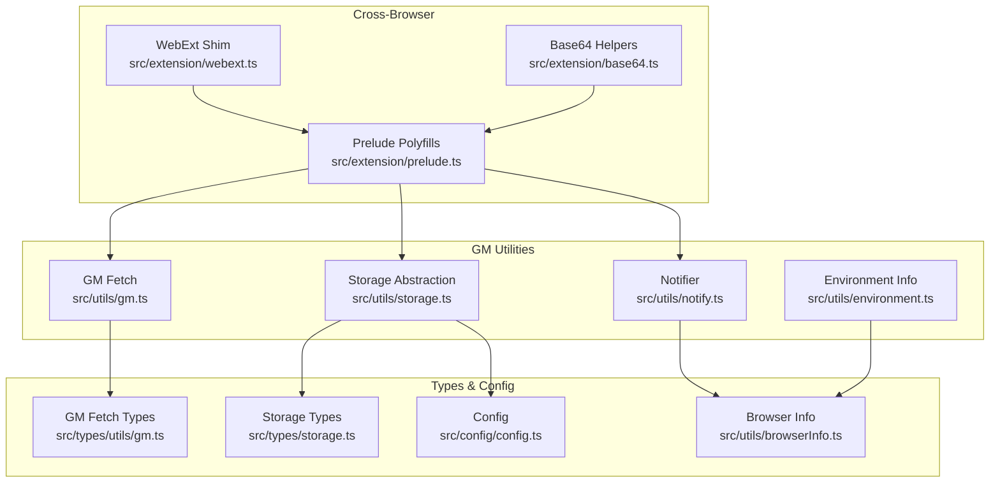
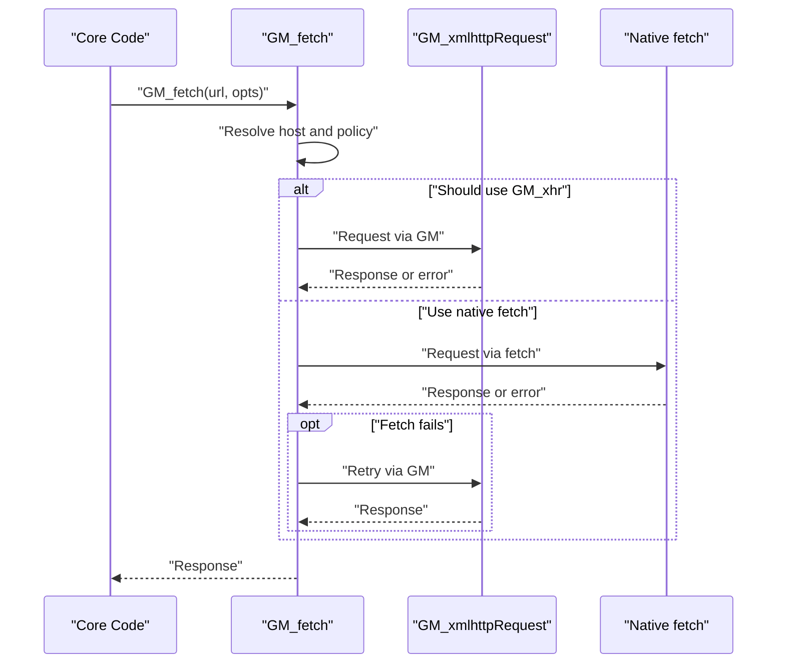
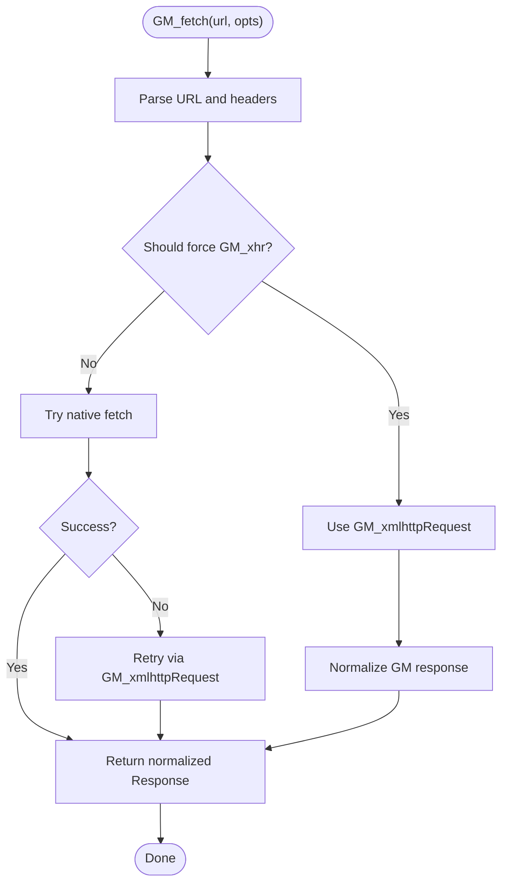
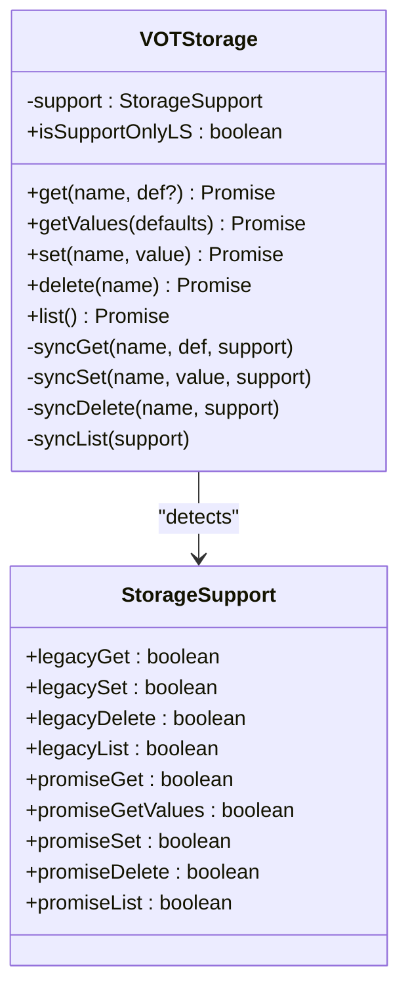
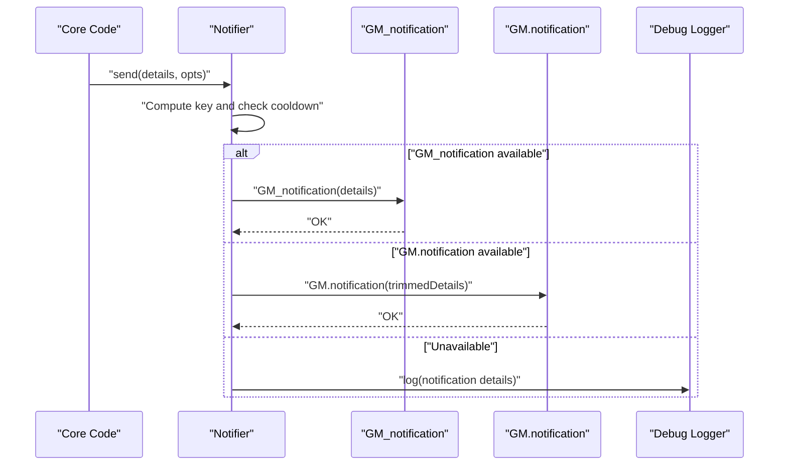
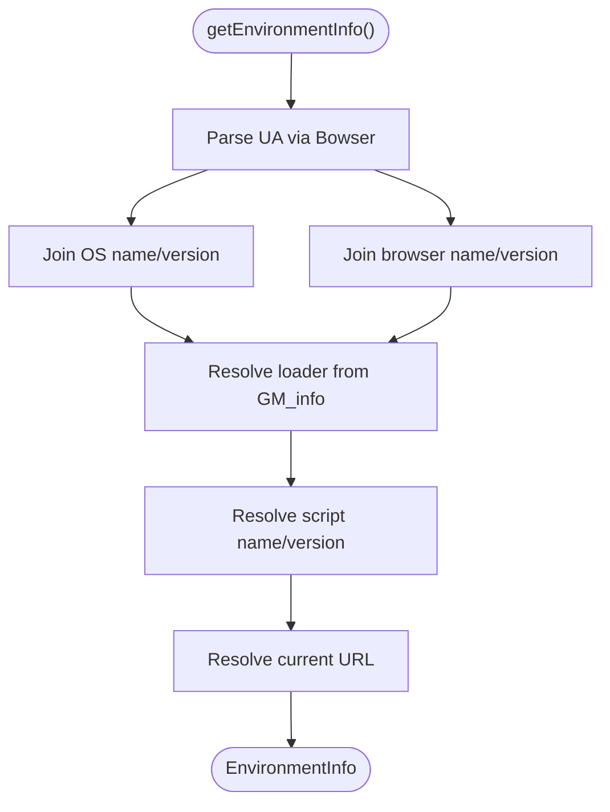
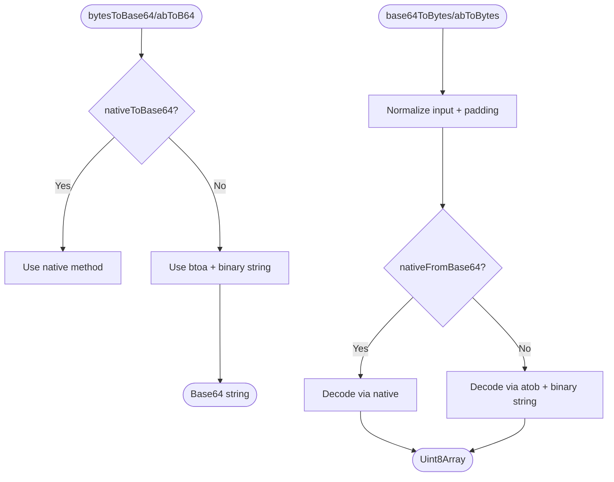
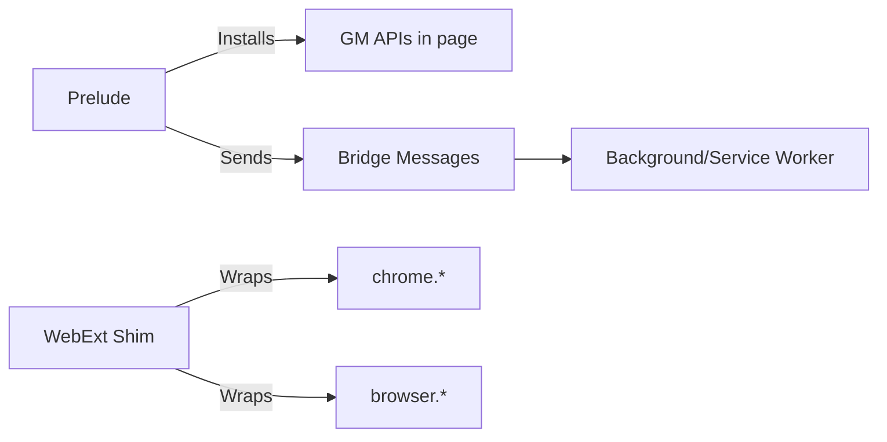
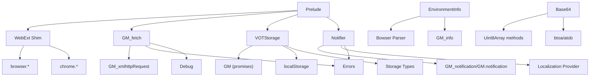

# GM Utilities API

<cite>
**Referenced Files in This Document**
- [gm.ts](file://src/utils/gm.ts)
- [storage.ts](file://src/utils/storage.ts)
- [notify.ts](file://src/utils/notify.ts)
- [environment.ts](file://src/utils/environment.ts)
- [base64.ts](file://src/extension/base64.ts)
- [webext.ts](file://src/extension/webext.ts)
- [prelude.ts](file://src/extension/prelude.ts)
- [gm.ts (types)](file://src/types/utils/gm.ts)
- [storage.ts (types)](file://src/types/storage.ts)
- [config.ts](file://src/config/config.ts)
- [browserInfo.ts](file://src/utils/browserInfo.ts)
- [errors.ts](file://src/utils/errors.ts)
- [debug.ts](file://src/utils/debug.ts)
</cite>

## Table of Contents
1. [Introduction](#introduction)
2. [Project Structure](#project-structure)
3. [Core Components](#core-components)
4. [Architecture Overview](#architecture-overview)
5. [Detailed Component Analysis](#detailed-component-analysis)
6. [Dependency Analysis](#dependency-analysis)
7. [Performance Considerations](#performance-considerations)
8. [Troubleshooting Guide](#troubleshooting-guide)
9. [Conclusion](#conclusion)

## Introduction
This document describes the Greasemonkey/Tampermonkey utility layer and cross-browser compatibility helpers used by the project. It focuses on:
- GM storage APIs with type-safe operations and graceful fallbacks
- GM notification system with deduplication and environment-aware delivery
- Script metadata access and environment detection
- Base64 encoding/decoding helpers for serialization
- Cross-browser compatibility shims for WebExtension APIs
- Feature detection patterns and fallback mechanisms
- Examples of GM script initialization, storage operations, and notification handling
- Error handling and performance considerations

## Project Structure
The GM utilities are organized into focused modules:
- GM fetch and XMLHttpRequest polyfills
- Storage abstraction with GM and localStorage fallbacks
- Notification helper with userscript API detection
- Environment info extraction from GM metadata and browser parser
- Base64 helpers for typed arrays and buffers
- WebExtension compatibility layer for Chromium/Firefox
- Extension prelude that installs GM polyfills in page context

**Diagram sources**
- [gm.ts:1-248](file://src/utils/gm.ts#L1-L248)
- [storage.ts:1-380](file://src/utils/storage.ts#L1-L380)
- [notify.ts:1-249](file://src/utils/notify.ts#L1-L249)
- [environment.ts:1-45](file://src/utils/environment.ts#L1-L45)
- [base64.ts:1-128](file://src/extension/base64.ts#L1-L128)
- [webext.ts:1-187](file://src/extension/webext.ts#L1-L187)
- [prelude.ts:1-641](file://src/extension/prelude.ts#L1-L641)
- [gm.ts (types):1-6](file://src/types/utils/gm.ts#L1-L6)
- [storage.ts (types):1-135](file://src/types/storage.ts#L1-L135)
- [config.ts:1-63](file://src/config/config.ts#L1-L63)
- [browserInfo.ts:1-6](file://src/utils/browserInfo.ts#L1-L6)

**Section sources**
- [gm.ts:1-248](file://src/utils/gm.ts#L1-L248)
- [storage.ts:1-380](file://src/utils/storage.ts#L1-L380)
- [notify.ts:1-249](file://src/utils/notify.ts#L1-L249)
- [environment.ts:1-45](file://src/utils/environment.ts#L1-L45)
- [base64.ts:1-128](file://src/extension/base64.ts#L1-L128)
- [webext.ts:1-187](file://src/extension/webext.ts#L1-L187)
- [prelude.ts:1-641](file://src/extension/prelude.ts#L1-L641)
- [gm.ts (types):1-6](file://src/types/utils/gm.ts#L1-L6)
- [storage.ts (types):1-135](file://src/types/storage.ts#L1-L135)
- [config.ts:1-63](file://src/config/config.ts#L1-L63)
- [browserInfo.ts:1-6](file://src/utils/browserInfo.ts#L1-L6)

## Core Components
- GM_fetch: A robust HTTP client that prefers native fetch with automatic fallback to GM_xmlhttpRequest when CORS or host policies block requests. Supports timeouts, abort signals, and response normalization.
- VOTStorage: A unified storage facade that detects GM promises vs legacy GM functions and falls back to localStorage when unavailable. Provides get, getValues, set, delete, and list operations with type-safe defaults.
- Notifier: A notification helper that attempts userscript-native APIs (GM_notification and GM.notification) and gracefully logs when unavailable. Includes deduplication and rate limiting.
- EnvironmentInfo: Extracts OS, browser, loader, script version/name, and current URL from GM metadata and browser parser.
- Base64 helpers: TypedArray and ArrayBuffer conversion utilities with native and legacy fallbacks, supporting base64 and base64url alphabets.
- WebExt shim: Cross-browser wrapper around browser/chrome namespaces, normalizing callback-based and Promise-based APIs.
- Prelude polyfills: Installs GM_xmlhttpRequest, GM notification, and GM4 promise APIs in page context for extension builds.

**Section sources**
- [gm.ts:211-247](file://src/utils/gm.ts#L211-L247)
- [storage.ts:204-380](file://src/utils/storage.ts#L204-L380)
- [notify.ts:163-249](file://src/utils/notify.ts#L163-L249)
- [environment.ts:19-44](file://src/utils/environment.ts#L19-L44)
- [base64.ts:110-127](file://src/extension/base64.ts#L110-L127)
- [webext.ts:56-187](file://src/extension/webext.ts#L56-L187)
- [prelude.ts:288-478](file://src/extension/prelude.ts#L288-L478)

## Architecture Overview
The GM utilities layer sits between the core application and the userscript/runtime environment. It provides:
- Feature detection for GM availability and API variants
- Fallback strategies to localStorage and native fetch
- Cross-browser compatibility for WebExtension APIs
- Serialization helpers for binary data

**Diagram sources**
- [gm.ts:211-247](file://src/utils/gm.ts#L211-L247)

**Section sources**
- [gm.ts:211-247](file://src/utils/gm.ts#L211-L247)

## Detailed Component Analysis

### GM Fetch API
- Purpose: Provide a unified HTTP interface compatible with GM_xmlhttpRequest and native fetch.
- Key behaviors:
  - Host-based routing: Certain hosts are routed to GM_xmlhttpRequest to bypass CORS.
  - Timeout and abort: Integrates with AbortSignal and a timeout signal.
  - Response normalization: Converts GM responses to a fetch-like Response object.
  - Fallback: On native fetch failure, retries via GM_xmlhttpRequest.
- Type safety: Uses a minimal HttpMethod union and a FetchOpts type extending RequestInit with optional timeout and forceGmXhr flag.

**Diagram sources**
- [gm.ts:211-247](file://src/utils/gm.ts#L211-L247)
- [gm.ts (types):1-6](file://src/types/utils/gm.ts#L1-L6)

**Section sources**
- [gm.ts:211-247](file://src/utils/gm.ts#L211-L247)
- [gm.ts (types):1-6](file://src/types/utils/gm.ts#L1-L6)

### GM Storage API
- Purpose: Unified storage with GM promises and legacy GM functions, plus localStorage fallback.
- Operations:
  - get(name, def?): Returns a single value with a default if missing.
  - getValues(defaults): Bulk read with default values per key.
  - set(name, value): Writes a value.
  - delete(name): Removes a key.
  - list(): Lists keys (GM listValues or a curated set).
- Type safety:
  - Values are constrained to JSON-like primitives and arrays/objects.
  - StorageKey is derived from a curated list to prevent invalid keys.
  - Compatibility conversion ensures migration of old keys/values.
- Fallback logic:
  - Detects GM support (legacy vs promises) and localStorage availability.
  - Falls back to localStorage when GM APIs are absent.

**Diagram sources**
- [storage.ts:204-380](file://src/utils/storage.ts#L204-L380)
- [storage.ts (types):18-62](file://src/types/storage.ts#L18-L62)

**Section sources**
- [storage.ts:204-380](file://src/utils/storage.ts#L204-L380)
- [storage.ts (types):18-62](file://src/types/storage.ts#L18-L62)
- [config.ts:54-62](file://src/config/config.ts#L54-L62)

### Notification System
- Purpose: Deliver user-visible notifications across userscript managers and browsers.
- Features:
  - Attempts GM_notification (legacy) and GM.notification (GM4).
  - Deduplication and rate limiting keyed by a computed key or tag/title+text.
  - Localization-aware messages with fallbacks.
  - Graceful degradation to debug logging when APIs are unavailable.
- Methods:
  - Notifier.send(details, opts): Sends a notification with optional cooldown.
  - Notifier.translationCompleted(host): Convenience for completion notifications.
  - Notifier.translationFailed({videoId?, message?}): Handles failures with localization.

**Diagram sources**
- [notify.ts:163-249](file://src/utils/notify.ts#L163-L249)

**Section sources**
- [notify.ts:163-249](file://src/utils/notify.ts#L163-L249)

### Environment Detection and Metadata Access
- Purpose: Expose environment information for diagnostics and user-facing messages.
- Data:
  - OS and browser (name and version) from browser parser
  - Loader (scriptHandler + version) and script metadata (name/version)
  - Current page URL
- Usage: Combine with localization and notifications to tailor messages.

**Diagram sources**
- [environment.ts:19-44](file://src/utils/environment.ts#L19-L44)
- [browserInfo.ts:1-6](file://src/utils/browserInfo.ts#L1-L6)

**Section sources**
- [environment.ts:19-44](file://src/utils/environment.ts#L19-L44)
- [browserInfo.ts:1-6](file://src/utils/browserInfo.ts#L1-L6)

### Base64 Encoding/Decoding Helpers
- Purpose: Serialize and deserialize binary data safely across environments.
- Capabilities:
  - bytesToBase64 and arrayBufferToBase64
  - base64ToBytes and base64ToArrayBuffer
  - Support for base64 and base64url alphabets
  - Native methods when available; legacy fallback otherwise
- Notes:
  - Handles padding normalization and alphabet detection.
  - Preserves typed array views when possible.

**Diagram sources**
- [base64.ts:110-127](file://src/extension/base64.ts#L110-L127)

**Section sources**
- [base64.ts:1-128](file://src/extension/base64.ts#L1-L128)

### Cross-Browser Compatibility Shims
- WebExt Shim:
  - Normalizes browser vs chrome namespaces.
  - Bridges callback-based APIs (Chromium) to Promise-based (Firefox) via a helper.
  - Provides storageGet/storageSet/storageRemove and notifications/windows/tabs helpers.
- Prelude Polyfills:
  - Installs GM_xmlhttpRequest, GM.notification, GM4 promises, and GM_info in page context.
  - Bridges page-world GM calls to extension background/service worker via postMessage.

**Diagram sources**
- [webext.ts:56-187](file://src/extension/webext.ts#L56-L187)
- [prelude.ts:288-478](file://src/extension/prelude.ts#L288-L478)

**Section sources**
- [webext.ts:1-187](file://src/extension/webext.ts#L1-L187)
- [prelude.ts:288-478](file://src/extension/prelude.ts#L288-L478)

## Dependency Analysis
- GM_fetch depends on:
  - GM_xmlhttpRequest availability and host policy
  - AbortSignal and timeout signal creation
  - Header parsing and response normalization
- VOTStorage depends on:
  - GM availability detection (legacy vs promises)
  - localStorage fallback
  - Storage key definitions and compatibility rules
- Notifier depends on:
  - GM_notification and GM.notification presence
  - Localization provider and error handling
- EnvironmentInfo depends on:
  - GM_info metadata and Bowser parser
- Base64 helpers depend on:
  - Native Uint8Array methods when present
  - Global btoa/atob when needed
- WebExt shim depends on:
  - browser/chrome namespaces presence
- Prelude polyfills depend on:
  - PostMessage bridge and background handlers

**Diagram sources**
- [gm.ts:1-248](file://src/utils/gm.ts#L1-L248)
- [storage.ts:1-380](file://src/utils/storage.ts#L1-L380)
- [notify.ts:1-249](file://src/utils/notify.ts#L1-L249)
- [environment.ts:1-45](file://src/utils/environment.ts#L1-L45)
- [base64.ts:1-128](file://src/extension/base64.ts#L1-L128)
- [webext.ts:1-187](file://src/extension/webext.ts#L1-L187)
- [prelude.ts:1-641](file://src/extension/prelude.ts#L1-L641)
- [errors.ts:1-110](file://src/utils/errors.ts#L1-L110)
- [debug.ts:1-38](file://src/utils/debug.ts#L1-L38)
- [browserInfo.ts:1-6](file://src/utils/browserInfo.ts#L1-L6)
- [storage.ts (types):1-135](file://src/types/storage.ts#L1-L135)

**Section sources**
- [gm.ts:1-248](file://src/utils/gm.ts#L1-L248)
- [storage.ts:1-380](file://src/utils/storage.ts#L1-L380)
- [notify.ts:1-249](file://src/utils/notify.ts#L1-L249)
- [environment.ts:1-45](file://src/utils/environment.ts#L1-L45)
- [base64.ts:1-128](file://src/extension/base64.ts#L1-L128)
- [webext.ts:1-187](file://src/extension/webext.ts#L1-L187)
- [prelude.ts:1-641](file://src/extension/prelude.ts#L1-L641)
- [errors.ts:1-110](file://src/utils/errors.ts#L1-L110)
- [debug.ts:1-38](file://src/utils/debug.ts#L1-L38)
- [browserInfo.ts:1-6](file://src/utils/browserInfo.ts#L1-L6)
- [storage.ts (types):1-135](file://src/types/storage.ts#L1-L135)

## Performance Considerations
- GM_fetch:
  - Prefer native fetch for general requests; only route to GM_xmlhttpRequest when necessary to avoid extra hops.
  - Use AbortSignal to cancel long-running requests promptly.
  - Minimize response body conversions; leverage responseType appropriately.
- VOTStorage:
  - Batch reads with getValues to reduce round-trips.
  - Avoid frequent writes; coalesce updates when possible.
  - Use localStorage fallback judiciously; it blocks the main thread.
- Notifier:
  - Apply deduplication and cooldown to prevent spam.
  - Avoid sending notifications in tight loops.
- Base64:
  - Reuse typed arrays when possible; avoid unnecessary copies.
  - Use native methods when available to reduce overhead.
- WebExt shim:
  - Cache API references to avoid repeated property lookups.
  - Use Promise-based APIs when available to reduce callback overhead.

[No sources needed since this section provides general guidance]

## Troubleshooting Guide
- GM_fetch fails with CORS:
  - The function automatically retries via GM_xmlhttpRequest; verify host policy and network conditions.
  - Inspect debug logs for routing decisions.
- Storage operations fail:
  - Check GM availability and localStorage support; the facade will fall back accordingly.
  - Validate StorageKey usage against the curated list.
- Notifications not visible:
  - Verify GM_notification or GM.notification availability; fallback logs will appear in debug output.
  - Ensure localization provider is initialized and messages are resolvable.
- Environment info missing:
  - Confirm GM_info is populated; the helper returns “unknown” for missing fields.
- Base64 conversion errors:
  - Validate input format and alphabet; the helpers normalize padding and whitespace.
- WebExtension API errors:
  - Use lastErrorMessage to inspect runtime.lastError on Chromium; wrap calls with the shim’s helper.

**Section sources**
- [gm.ts:211-247](file://src/utils/gm.ts#L211-L247)
- [storage.ts:204-380](file://src/utils/storage.ts#L204-L380)
- [notify.ts:163-249](file://src/utils/notify.ts#L163-L249)
- [environment.ts:19-44](file://src/utils/environment.ts#L19-L44)
- [base64.ts:32-95](file://src/extension/base64.ts#L32-L95)
- [webext.ts:61-101](file://src/extension/webext.ts#L61-L101)
- [errors.ts:84-110](file://src/utils/errors.ts#L84-L110)
- [debug.ts:1-38](file://src/utils/debug.ts#L1-L38)

## Conclusion
The GM utilities provide a robust, cross-environment layer for userscript and extension contexts. They offer:
- A resilient HTTP client with GM and native fetch integration
- A type-safe storage facade with compatibility migrations
- A notification system with localization and deduplication
- Environment detection and metadata access
- Serialization helpers and cross-browser WebExtension compatibility
- Extensive fallbacks and error handling for unsupported environments

These components enable consistent behavior across Tampermonkey, Greasemonkey, Violentmonkey, and extension builds while maintaining performance and reliability.