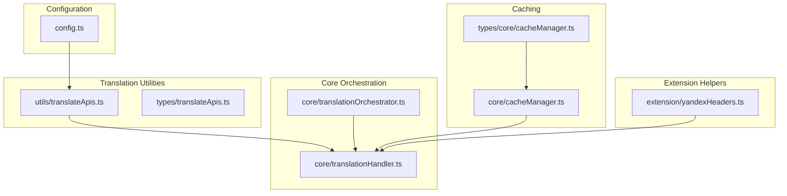
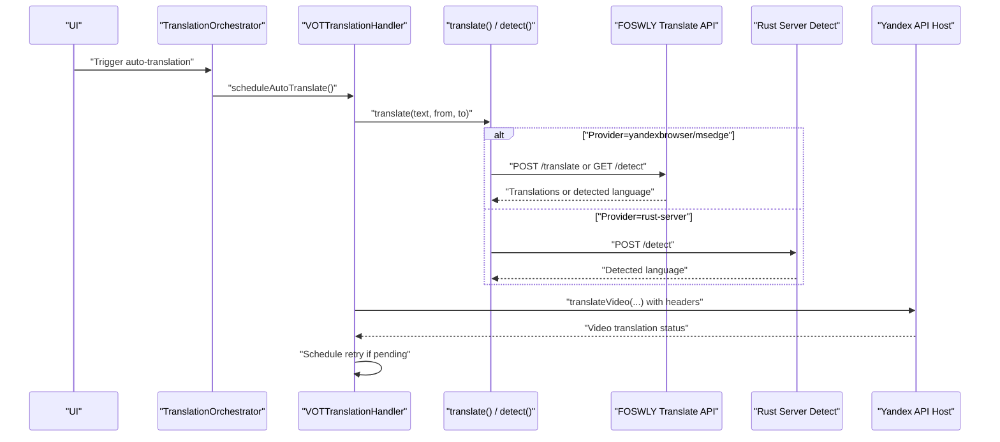
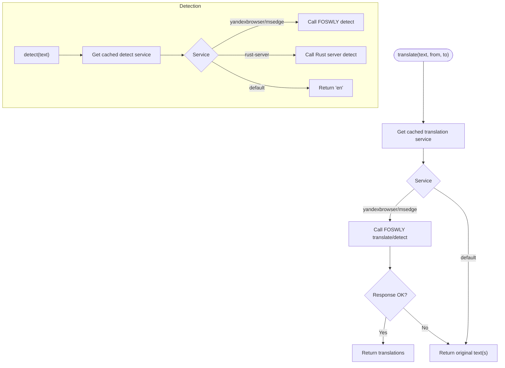
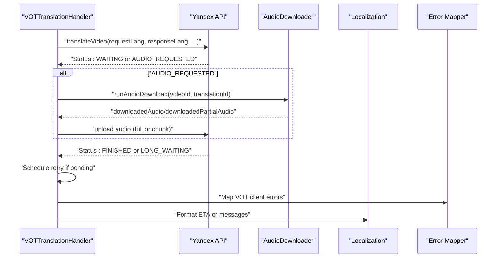
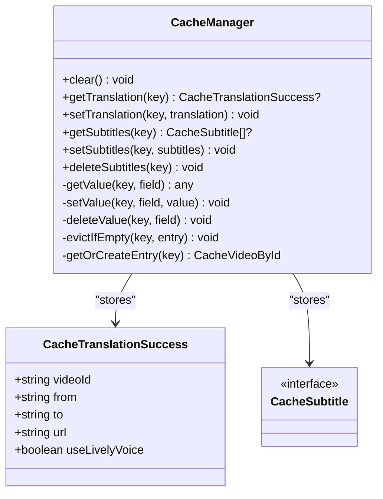
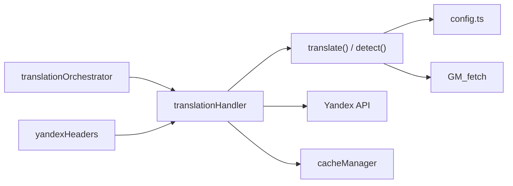

# Translation Service APIs

<cite>
**Referenced Files in This Document**
- [src/utils/translateApis.ts](file://src/utils/translateApis.ts)
- [src/types/translateApis.ts](file://src/types/translateApis.ts)
- [src/config/config.ts](file://src/config/config.ts)
- [src/core/translationHandler.ts](file://src/core/translationHandler.ts)
- [src/core/translationOrchestrator.ts](file://src/core/translationOrchestrator.ts)
- [src/core/cacheManager.ts](file://src/core/cacheManager.ts)
- [src/types/core/cacheManager.ts](file://src/types/core/cacheManager.ts)
- [src/extension/yandexHeaders.ts](file://src/extension/yandexHeaders.ts)
- [src/utils/errors.ts](file://src/utils/errors.ts)
- [src/utils/abort.ts](file://src/utils/abort.ts)
- [src/utils/timeFormatting.ts](file://src/utils/timeFormatting.ts)
- [src/videoHandler/modules/translationShared.ts](file://src/videoHandler/modules/translationShared.ts)
- [src/localization/localizationProvider.ts](file://src/localization/localizationProvider.ts)
- [src/utils/VOTLocalizedError.ts](file://src/utils/VOTLocalizedError.ts)
</cite>

## Table of Contents
1. [Introduction](#introduction)
2. [Project Structure](#project-structure)
3. [Core Components](#core-components)
4. [Architecture Overview](#architecture-overview)
5. [Detailed Component Analysis](#detailed-component-analysis)
6. [Dependency Analysis](#dependency-analysis)
7. [Performance Considerations](#performance-considerations)
8. [Troubleshooting Guide](#troubleshooting-guide)
9. [Conclusion](#conclusion)
10. [Appendices](#appendices)

## Introduction
This document describes the translation service integration interfaces implemented in the project. It covers:
- Translation request/response types and service adapter patterns
- API endpoint configurations for translation and detection
- Yandex Browser translation integration, including authentication considerations and request/response handling
- Error handling strategies for network failures, quota limits, and service unavailability
- Translation caching mechanisms, retry logic, and fallback service handling
- Examples of configuring translation providers, handling different response formats, and implementing custom translation adapters
- Rate limiting, quota management, and performance optimization techniques
- Internationalization considerations and locale-specific translation handling

## Project Structure
The translation subsystem is composed of:
- Configuration and constants for endpoints and defaults
- Utility modules for translation and detection
- Core orchestration and error-handling for video translation
- Caching for translations and subtitles
- Header filtering helpers for Yandex API compatibility

**Diagram sources**
- [src/config/config.ts:1-63](file://src/config/config.ts#L1-L63)
- [src/utils/translateApis.ts:1-207](file://src/utils/translateApis.ts#L1-L207)
- [src/types/translateApis.ts:1-5](file://src/types/translateApis.ts#L1-L5)
- [src/core/translationHandler.ts:1-564](file://src/core/translationHandler.ts#L1-L564)
- [src/core/translationOrchestrator.ts:1-85](file://src/core/translationOrchestrator.ts#L1-L85)
- [src/core/cacheManager.ts:1-119](file://src/core/cacheManager.ts#L1-L119)
- [src/types/core/cacheManager.ts:1-21](file://src/types/core/cacheManager.ts#L1-L21)
- [src/extension/yandexHeaders.ts:1-56](file://src/extension/yandexHeaders.ts#L1-L56)

**Section sources**
- [src/config/config.ts:1-63](file://src/config/config.ts#L1-L63)
- [src/utils/translateApis.ts:1-207](file://src/utils/translateApis.ts#L1-L207)
- [src/types/translateApis.ts:1-5](file://src/types/translateApis.ts#L1-L5)
- [src/core/translationHandler.ts:1-564](file://src/core/translationHandler.ts#L1-L564)
- [src/core/translationOrchestrator.ts:1-85](file://src/core/translationOrchestrator.ts#L1-L85)
- [src/core/cacheManager.ts:1-119](file://src/core/cacheManager.ts#L1-L119)
- [src/types/core/cacheManager.ts:1-21](file://src/types/core/cacheManager.ts#L1-L21)
- [src/extension/yandexHeaders.ts:1-56](file://src/extension/yandexHeaders.ts#L1-L56)

## Core Components
- Translation utilities: Provides translation and detection functions, supports FOSWLY-backed providers (e.g., Yandex Browser, Microsoft Edge) and Rust-based language detection.
- Configuration: Defines default translation and detection services, backend endpoints, and timeouts.
- Translation orchestrator: Manages auto-translation state transitions and deferral logic (e.g., mobile YouTube mute).
- Translation handler: Orchestrates video translation requests, handles audio upload flows, manages retries, and maps server-side errors to localized UI errors.
- Caching: Implements TTL-based in-memory cache for translations and subtitles.
- Yandex headers: Normalizes and filters headers for Yandex API compatibility.

Key responsibilities:
- translate(text, from?, to?): Dispatches to configured translation service; supports single and batch translation.
- detect(text): Dispatches to configured detection service; supports Yandex Browser/Edge via FOSWLY and Rust server.
- translateVideoImpl(...): Coordinates video translation lifecycle, including audio upload and retry scheduling.
- CacheManager: Stores translation/subtitle entries with expiration.

**Section sources**
- [src/utils/translateApis.ts:167-197](file://src/utils/translateApis.ts#L167-L197)
- [src/config/config.ts:49-52](file://src/config/config.ts#L49-L52)
- [src/core/translationOrchestrator.ts:21-85](file://src/core/translationOrchestrator.ts#L21-L85)
- [src/core/translationHandler.ts:311-495](file://src/core/translationHandler.ts#L311-L495)
- [src/core/cacheManager.ts:27-118](file://src/core/cacheManager.ts#L27-L118)

## Architecture Overview
The translation pipeline integrates browser-based translation services (via FOSWLY) and the Yandex Browser translation API. The system supports:
- Provider selection via stored preferences with short-lived in-memory caching
- Request formatting for translation and detection endpoints
- Response parsing and error mapping
- Retry scheduling and fallback handling
- Caching of successful translations and subtitles
- Header normalization for Yandex API compatibility

**Diagram sources**
- [src/core/translationOrchestrator.ts:42-83](file://src/core/translationOrchestrator.ts#L42-L83)
- [src/core/translationHandler.ts:311-495](file://src/core/translationHandler.ts#L311-L495)
- [src/utils/translateApis.ts:167-197](file://src/utils/translateApis.ts#L167-L197)
- [src/config/config.ts:22-25](file://src/config/config.ts#L22-L25)
- [src/extension/yandexHeaders.ts:1-56](file://src/extension/yandexHeaders.ts#L1-L56)

## Detailed Component Analysis

### Translation Utilities
Responsibilities:
- Resolve current translation/detection service from persistent storage with a short TTL cache
- Call FOSWLY Translate API for translation and detection
- Call Rust server for language detection
- Normalize and filter headers for Yandex API compatibility

Key behaviors:
- Settings caching avoids frequent storage reads during retries
- FOSWLY API wraps responses and errors; translates error payloads into exceptions
- Translation supports single and batch modes; detection returns a language code

**Diagram sources**
- [src/utils/translateApis.ts:22-53](file://src/utils/translateApis.ts#L22-L53)
- [src/utils/translateApis.ts:66-144](file://src/utils/translateApis.ts#L66-L144)
- [src/utils/translateApis.ts:146-165](file://src/utils/translateApis.ts#L146-L165)
- [src/utils/translateApis.ts:167-197](file://src/utils/translateApis.ts#L167-L197)

**Section sources**
- [src/utils/translateApis.ts:12-53](file://src/utils/translateApis.ts#L12-L53)
- [src/utils/translateApis.ts:66-144](file://src/utils/translateApis.ts#L66-L144)
- [src/utils/translateApis.ts:146-165](file://src/utils/translateApis.ts#L146-L165)
- [src/utils/translateApis.ts:167-197](file://src/utils/translateApis.ts#L167-L197)

### Configuration and Defaults
Endpoints and defaults:
- Default translation service: yandexbrowser
- Default detection service: rust-server
- FOSWLY Translate API base URL
- Rust server detect URL
- Worker and proxy hosts for Yandex integration

These values drive provider selection and endpoint resolution in translation utilities.

**Section sources**
- [src/config/config.ts:49-52](file://src/config/config.ts#L49-L52)
- [src/config/config.ts:22-25](file://src/config/config.ts#L22-L25)
- [src/config/config.ts:24-25](file://src/config/config.ts#L24-L25)

### Translation Handler (Video Translation)
Responsibilities:
- Translate videos via Yandex API with optional lively voice
- Upload audio chunks or full audio when requested
- Schedule retries with exponential backoff-like intervals
- Map server-side errors to localized UI errors
- Integrate with localization and notifier systems

Key flows:
- translateVideoImpl coordinates request, handles AUDIO_REQUESTED state, and triggers audio download/upload
- Retry scheduling uses an internal timer and respects AbortSignal
- Error mapping detects known server error patterns and converts them to localized errors

**Diagram sources**
- [src/core/translationHandler.ts:311-495](file://src/core/translationHandler.ts#L311-L495)
- [src/core/translationHandler.ts:126-194](file://src/core/translationHandler.ts#L126-L194)
- [src/utils/timeFormatting.ts:1-200](file://src/utils/timeFormatting.ts#L1-L200)
- [src/localization/localizationProvider.ts:1-200](file://src/localization/localizationProvider.ts#L1-L200)
- [src/utils/VOTLocalizedError.ts:1-200](file://src/utils/VOTLocalizedError.ts#L1-L200)

**Section sources**
- [src/core/translationHandler.ts:311-495](file://src/core/translationHandler.ts#L311-L495)
- [src/core/translationHandler.ts:261-309](file://src/core/translationHandler.ts#L261-L309)
- [src/core/translationHandler.ts:68-98](file://src/core/translationHandler.ts#L68-L98)

### Translation Orchestrator
Responsibilities:
- Manage auto-translation state transitions
- Defer execution on mobile YouTube when muted
- Trigger scheduled auto-translation and handle errors

States:
- idle, pending (auto), deferred (muted), error

**Section sources**
- [src/core/translationOrchestrator.ts:3-85](file://src/core/translationOrchestrator.ts#L3-L85)

### Caching Manager
Responsibilities:
- Store translation and subtitle entries with TTL
- Evict expired entries and empty records
- Clear cache on runtime setting changes

TTL:
- YANDEX_TTL_MS = 2 hours

Data model:
- CacheTranslationSuccess includes videoId, from, to, url, useLivelyVoice
- CacheSubtitle mirrors subtitle entries
- Expiration timestamps per field

**Diagram sources**
- [src/core/cacheManager.ts:27-118](file://src/core/cacheManager.ts#L27-L118)
- [src/types/core/cacheManager.ts:3-20](file://src/types/core/cacheManager.ts#L3-L20)

**Section sources**
- [src/core/cacheManager.ts:7-118](file://src/core/cacheManager.ts#L7-L118)
- [src/types/core/cacheManager.ts:3-20](file://src/types/core/cacheManager.ts#L3-L20)

### Yandex Headers Filtering
Responsibilities:
- Normalize header names
- Strip sensitive or disallowed headers for Yandex API
- Filter headers for declarative network rules

Rules:
- Origin and Referer are stripped
- Certain sec-ch-ua-* headers are suppressed unless explicitly allowed
- Unknown sec-ch-ua-* variants are filtered out

**Section sources**
- [src/extension/yandexHeaders.ts:25-55](file://src/extension/yandexHeaders.ts#L25-L55)

## Dependency Analysis
- translate() depends on cached service selection and dispatches to FOSWLY or Rust server
- detect() depends on cached service selection and dispatches to FOSWLY or Rust server
- translationHandler depends on translate() for initial text translation and on Yandex API for video translation
- cacheManager depends on TTL constants and stores typed entries
- translationOrchestrator depends on platform conditions (mobile YouTube mute) and schedules translation

**Diagram sources**
- [src/utils/translateApis.ts:1-11](file://src/utils/translateApis.ts#L1-L11)
- [src/config/config.ts:1-63](file://src/config/config.ts#L1-L63)
- [src/core/translationHandler.ts:1-22](file://src/core/translationHandler.ts#L1-L22)
- [src/core/cacheManager.ts:1-11](file://src/core/cacheManager.ts#L1-L11)
- [src/core/translationOrchestrator.ts:1-19](file://src/core/translationOrchestrator.ts#L1-L19)
- [src/extension/yandexHeaders.ts:1-56](file://src/extension/yandexHeaders.ts#L1-L56)

**Section sources**
- [src/utils/translateApis.ts:1-11](file://src/utils/translateApis.ts#L1-L11)
- [src/config/config.ts:1-63](file://src/config/config.ts#L1-L63)
- [src/core/translationHandler.ts:1-22](file://src/core/translationHandler.ts#L1-L22)
- [src/core/cacheManager.ts:1-11](file://src/core/cacheManager.ts#L1-L11)
- [src/core/translationOrchestrator.ts:1-19](file://src/core/translationOrchestrator.ts#L1-L19)
- [src/extension/yandexHeaders.ts:1-56](file://src/extension/yandexHeaders.ts#L1-L56)

## Performance Considerations
- Settings caching: Short TTL reduces storage reads during retries.
- Timeout configuration: Requests use a 3-second timeout to bound latency.
- Retry scheduling: Backoff-like intervals reduce load and improve resilience.
- Caching: TTL-based cache minimizes redundant network calls for translations and subtitles.
- Header filtering: Removes unnecessary headers to reduce request overhead.

Recommendations:
- Monitor long-running waits and adjust retry intervals based on remaining time.
- Consider batching translation requests when feasible.
- Tune timeouts and retry intervals according to network conditions.

**Section sources**
- [src/utils/translateApis.ts:15-38](file://src/utils/translateApis.ts#L15-L38)
- [src/utils/translateApis.ts:78-81](file://src/utils/translateApis.ts#L78-L81)
- [src/core/translationHandler.ts:481-494](file://src/core/translationHandler.ts#L481-L494)
- [src/core/cacheManager.ts:7-8](file://src/core/cacheManager.ts#L7-L8)

## Troubleshooting Guide
Common scenarios and strategies:
- Network failures: Requests wrap errors and return undefined; callers should retry or fall back.
- Service unavailability: translateVideoImpl detects “lively voice unavailable” and retries without lively voice.
- Quota limits: No explicit quota handling is present; consider adding provider-specific checks and backoff.
- Localized errors: Server errors are mapped to VOTLocalizedError for user-friendly messages.
- Aborted operations: Uses AbortSignal to cancel ongoing work; ensure callers propagate abort signals.

Operational tips:
- Inspect server error messages and map them to localized UI errors.
- Use notifier integration to surface failures to users.
- Respect abort signals to prevent wasted work.

**Section sources**
- [src/utils/translateApis.ts:88-97](file://src/utils/translateApis.ts#L88-L97)
- [src/core/translationHandler.ts:256-259](file://src/core/translationHandler.ts#L256-L259)
- [src/core/translationHandler.ts:445-477](file://src/core/translationHandler.ts#L445-L477)
- [src/utils/errors.ts:1-200](file://src/utils/errors.ts#L1-L200)
- [src/utils/abort.ts:1-200](file://src/utils/abort.ts#L1-L200)
- [src/videoHandler/modules/translationShared.ts:1-200](file://src/videoHandler/modules/translationShared.ts#L1-L200)
- [src/utils/VOTLocalizedError.ts:1-200](file://src/utils/VOTLocalizedError.ts#L1-L200)

## Conclusion
The translation subsystem provides a robust, extensible foundation for integrating browser-based translation services and Yandex Browser translation. It emphasizes reliability through caching, retry scheduling, and error mapping, while offering flexibility in provider selection and response handling. Future enhancements could include explicit quota management, richer fallback strategies, and configurable rate limiting.

## Appendices

### API Endpoint Configurations
- FOSWLY Translate API base URL: used for translation and detection requests
- Rust server detect URL: used for language detection
- Default services: yandexbrowser for translation, rust-server for detection

**Section sources**
- [src/config/config.ts:22-25](file://src/config/config.ts#L22-L25)
- [src/config/config.ts:49-52](file://src/config/config.ts#L49-L52)

### Type Definitions
- TranslateService and DetectService types derive from supported providers
- CacheTranslationSuccess and CacheSubtitle define cached data structures

**Section sources**
- [src/types/translateApis.ts:3-4](file://src/types/translateApis.ts#L3-L4)
- [src/types/core/cacheManager.ts:3-20](file://src/types/core/cacheManager.ts#L3-L20)

### Yandex Translation Integration Notes
- Authentication: The system relies on Yandex API hostnames and header filtering; ensure proper origin/referer handling and UA header suppression as needed.
- Request formatting: translateVideoImpl composes requests with request/response languages and optional extra options.
- Response parsing: Status codes and messages guide retry scheduling and user messaging.

**Section sources**
- [src/extension/yandexHeaders.ts:21-55](file://src/extension/yandexHeaders.ts#L21-L55)
- [src/core/translationHandler.ts:353-363](file://src/core/translationHandler.ts#L353-L363)