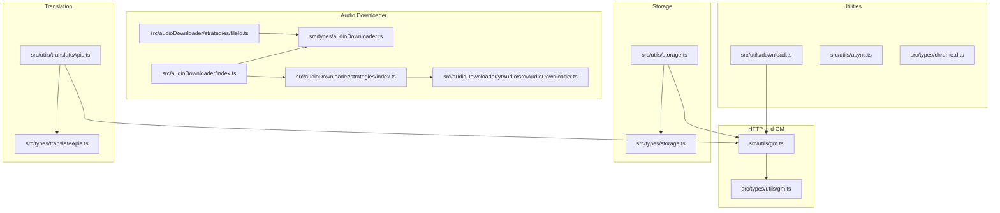
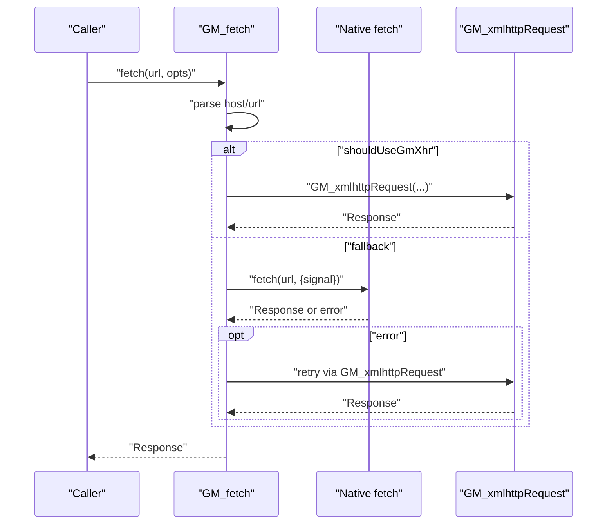
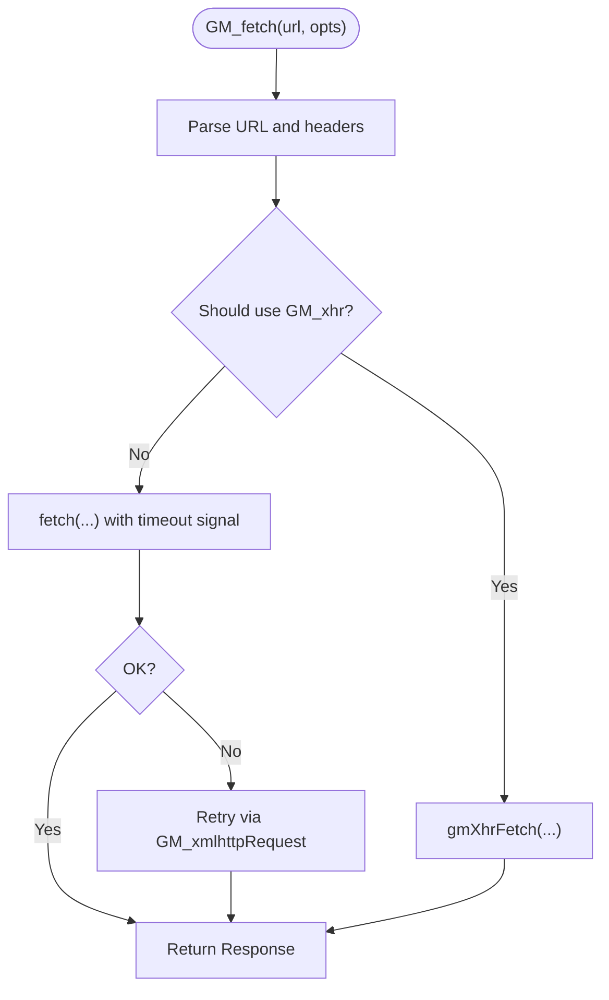
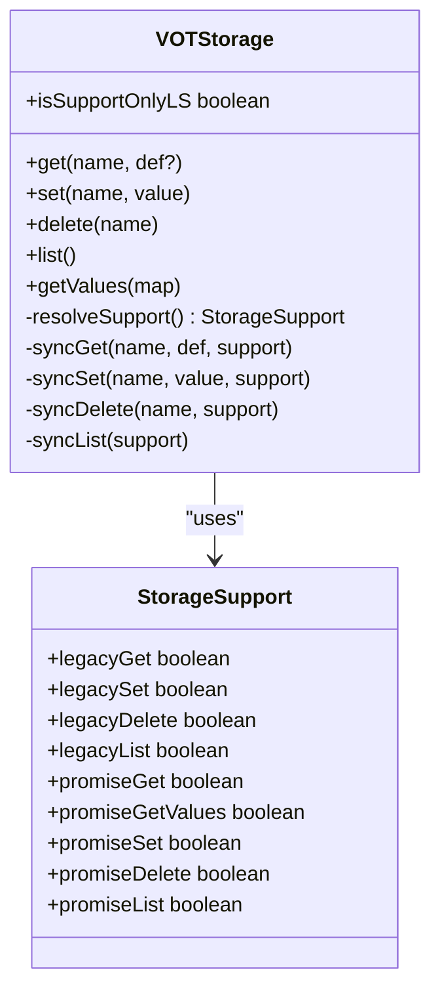
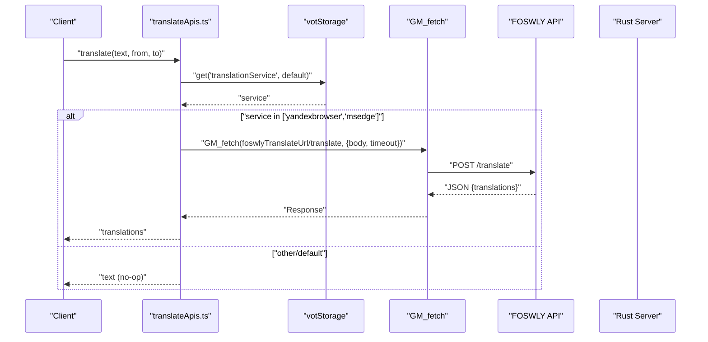
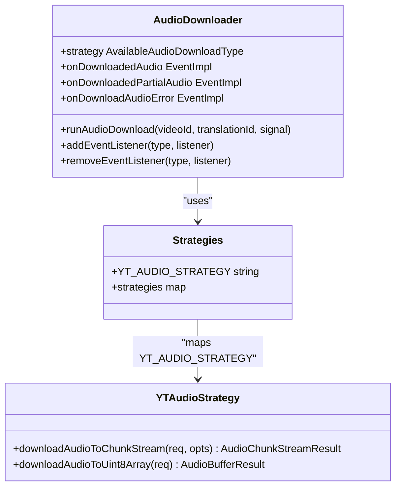
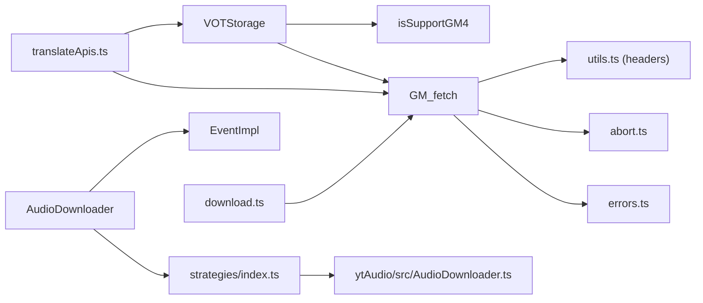

# Utility APIs

<cite>
**Referenced Files in This Document**
- [src/utils/gm.ts](file://src/utils/gm.ts)
- [src/types/utils/gm.ts](file://src/types/utils/gm.ts)
- [src/utils/storage.ts](file://src/utils/storage.ts)
- [src/types/storage.ts](file://src/types/storage.ts)
- [src/utils/translateApis.ts](file://src/utils/translateApis.ts)
- [src/types/translateApis.ts](file://src/types/translateApis.ts)
- [src/audioDownloader/index.ts](file://src/audioDownloader/index.ts)
- [src/types/audioDownloader.ts](file://src/types/audioDownloader.ts)
- [src/audioDownloader/strategies/index.ts](file://src/audioDownloader/strategies/index.ts)
- [src/audioDownloader/strategies/fileId.ts](file://src/audioDownloader/strategies/fileId.ts)
- [src/audioDownloader/ytAudio/src/AudioDownloader.ts](file://src/audioDownloader/ytAudio/src/AudioDownloader.ts)
- [src/utils/download.ts](file://src/utils/download.ts)
- [src/utils/async.ts](file://src/utils/async.ts)
- [src/types/chrome.d.ts](file://src/types/chrome.d.ts)
</cite>

## Table of Contents
1. [Introduction](#introduction)
2. [Project Structure](#project-structure)
3. [Core Components](#core-components)
4. [Architecture Overview](#architecture-overview)
5. [Detailed Component Analysis](#detailed-component-analysis)
6. [Dependency Analysis](#dependency-analysis)
7. [Performance Considerations](#performance-considerations)
8. [Troubleshooting Guide](#troubleshooting-guide)
9. [Conclusion](#conclusion)

## Introduction
This document describes the utility and helper APIs used by the English Teacher extension, focusing on:
- Cross-browser HTTP fetching with Greasemonkey/Tampermonkey compatibility
- Storage abstraction supporting both GM promises and localStorage
- Translation service adapters and integration patterns
- Audio downloader strategy interfaces, configuration, callbacks, and error handling
- TypeScript type definitions, parameter documentation, and composition patterns

It aims to be accessible to both developers and advanced users who want to understand how these utilities work, how to integrate them, and how to troubleshoot common issues.

## Project Structure
The relevant utilities are organized by domain:
- HTTP and GM compatibility: src/utils/gm.ts and src/types/utils/gm.ts
- Storage: src/utils/storage.ts and src/types/storage.ts
- Translation: src/utils/translateApis.ts and src/types/translateApis.ts
- Audio downloading: src/audioDownloader/* and related types
- Supporting utilities: src/utils/download.ts, src/utils/async.ts, src/types/chrome.d.ts

**Diagram sources**
- [src/utils/gm.ts](file://src/utils/gm.ts)
- [src/types/utils/gm.ts](file://src/types/utils/gm.ts)
- [src/utils/storage.ts](file://src/utils/storage.ts)
- [src/types/storage.ts](file://src/types/storage.ts)
- [src/utils/translateApis.ts](file://src/utils/translateApis.ts)
- [src/types/translateApis.ts](file://src/types/translateApis.ts)
- [src/audioDownloader/index.ts](file://src/audioDownloader/index.ts)
- [src/types/audioDownloader.ts](file://src/types/audioDownloader.ts)
- [src/audioDownloader/strategies/index.ts](file://src/audioDownloader/strategies/index.ts)
- [src/audioDownloader/strategies/fileId.ts](file://src/audioDownloader/strategies/fileId.ts)
- [src/audioDownloader/ytAudio/src/AudioDownloader.ts](file://src/audioDownloader/ytAudio/src/AudioDownloader.ts)
- [src/utils/download.ts](file://src/utils/download.ts)
- [src/utils/async.ts](file://src/utils/async.ts)
- [src/types/chrome.d.ts](file://src/types/chrome.d.ts)

**Section sources**
- [src/utils/gm.ts](file://src/utils/gm.ts)
- [src/types/utils/gm.ts](file://src/types/utils/gm.ts)
- [src/utils/storage.ts](file://src/utils/storage.ts)
- [src/types/storage.ts](file://src/types/storage.ts)
- [src/utils/translateApis.ts](file://src/utils/translateApis.ts)
- [src/types/translateApis.ts](file://src/types/translateApis.ts)
- [src/audioDownloader/index.ts](file://src/audioDownloader/index.ts)
- [src/types/audioDownloader.ts](file://src/types/audioDownloader.ts)
- [src/audioDownloader/strategies/index.ts](file://src/audioDownloader/strategies/index.ts)
- [src/audioDownloader/strategies/fileId.ts](file://src/audioDownloader/strategies/fileId.ts)
- [src/audioDownloader/ytAudio/src/AudioDownloader.ts](file://src/audioDownloader/ytAudio/src/AudioDownloader.ts)
- [src/utils/download.ts](file://src/utils/download.ts)
- [src/utils/async.ts](file://src/utils/async.ts)
- [src/types/chrome.d.ts](file://src/types/chrome.d.ts)

## Core Components
- GM_fetch: Cross-browser HTTP client with GM_xmlhttpRequest fallback and timeout handling
- VOTStorage: Unified storage API supporting GM promises and localStorage
- Translation adapters: FOSWLY and rust-server wrappers around GM_fetch
- AudioDownloader: Strategy-driven audio acquisition with event callbacks and partial downloads
- Supporting utilities: download helpers, async helpers, and minimal Chrome typings

**Section sources**
- [src/utils/gm.ts](file://src/utils/gm.ts)
- [src/utils/storage.ts](file://src/utils/storage.ts)
- [src/utils/translateApis.ts](file://src/utils/translateApis.ts)
- [src/audioDownloader/index.ts](file://src/audioDownloader/index.ts)
- [src/utils/download.ts](file://src/utils/download.ts)
- [src/utils/async.ts](file://src/utils/async.ts)
- [src/types/chrome.d.ts](file://src/types/chrome.d.ts)

## Architecture Overview
The utilities form a layered architecture:
- HTTP layer: GM_fetch abstracts network calls and handles CORS and timeouts
- Storage layer: VOTStorage abstracts persistence across environments
- Translation layer: Adapters encapsulate service-specific logic and integrate with storage
- Audio layer: Strategy pattern selects the best approach to obtain audio, emitting events for partial and full results
- Utilities: Helpers provide progress tracking, async control, and lightweight browser API typing

**Diagram sources**
- [src/utils/gm.ts](file://src/utils/gm.ts)

**Section sources**
- [src/utils/gm.ts](file://src/utils/gm.ts)

## Detailed Component Analysis

### GM (Greasemonkey/Tampermonkey) HTTP Utility
- Purpose: Provide a unified fetch-like API that respects CORS and timeouts, with automatic fallback to GM_xmlhttpRequest when needed.
- Key behaviors:
  - Host-based routing: Certain hosts are routed to GM_xmlhttpRequest by policy
  - Timeout handling: Integrates AbortSignal and a timeout mechanism
  - Retry on failure: On native fetch errors, retries via GM_xmlhttpRequest
  - Header normalization: Converts headers to GM-compatible format
  - Error mapping: Normalizes GM_xmlhttpRequest error messages
- Interfaces and types:
  - FetchOpts: Extends RequestInit with timeout and forceGmXhr options
  - GM_fetch(url, opts?): Returns a Response promise

**Diagram sources**
- [src/utils/gm.ts](file://src/utils/gm.ts)
- [src/types/utils/gm.ts](file://src/types/utils/gm.ts)

**Section sources**
- [src/utils/gm.ts](file://src/utils/gm.ts)
- [src/types/utils/gm.ts](file://src/types/utils/gm.ts)

### Storage Utility
- Purpose: Provide a single storage interface that works across environments (GM promises, legacy GM, localStorage).
- Key behaviors:
  - Feature detection: Determines available GM APIs and falls back to localStorage
  - Compatibility migration: Converts legacy keys/values according to conversion rules
  - Batch operations: Supports getValues and list operations
  - Type safety: Enforces typed keys via StorageKey and StorageData
- Interfaces and types:
  - VOTStorage: get, set, delete, list, getValues
  - Storage keys and types: Strongly typed via storageKeys and StorageData
  - Compatibility rules: ConvertData and CompatRule define migration logic

**Diagram sources**
- [src/utils/storage.ts](file://src/utils/storage.ts)
- [src/types/storage.ts](file://src/types/storage.ts)

**Section sources**
- [src/utils/storage.ts](file://src/utils/storage.ts)
- [src/types/storage.ts](file://src/types/storage.ts)

### Translation API Adapters
- Purpose: Provide translation and language detection via configurable services, integrating with storage and GM_fetch.
- Supported services:
  - FOSWLY: yandexbrowser, msedge
  - rust-server: detect endpoint
- Key behaviors:
  - Caching: In-memory cache for service preferences to reduce storage reads
  - Request building: Uses GM_fetch with timeouts and JSON bodies
  - Error handling: Maps service errors to user-friendly failures and returns safe defaults
- Interfaces and types:
  - TranslateService and DetectService enums
  - translate(text, from?, to?) and detect(text)
  - Service-specific request builders and error types

**Diagram sources**
- [src/utils/translateApis.ts](file://src/utils/translateApis.ts)
- [src/utils/storage.ts](file://src/utils/storage.ts)
- [src/types/translateApis.ts](file://src/types/translateApis.ts)

**Section sources**
- [src/utils/translateApis.ts](file://src/utils/translateApis.ts)
- [src/types/translateApis.ts](file://src/types/translateApis.ts)
- [src/utils/storage.ts](file://src/utils/storage.ts)

### Audio Downloader APIs
- Purpose: Provide a strategy-driven audio acquisition pipeline with event-driven callbacks and partial-download support.
- Strategies:
  - ytAudio: YouTube audio extraction using InnerTube-like client attempts and adaptive formats
- Key behaviors:
  - Strategy selection: Dispatches to selected strategy with videoId and AbortSignal
  - Partial downloads: Emits downloadedPartialAudio events for chunked audio
  - Full download: Emits downloadedAudio for single-buffer audio
  - Error propagation: Emits downloadAudioError on failure
  - File ID generation: Creates stable identifiers for cached or deduplicated assets
- Interfaces and types:
  - AudioDownloader class with runAudioDownload and event listeners
  - Strategy contract: returns { getMediaBuffers(), mediaPartsLength, fileId }
  - Request/response types: DownloadAudioDataIframeResponsePayload, FetchMediaWithMeta*, DownloadedAudioData, DownloadedPartialAudioData

**Diagram sources**
- [src/audioDownloader/index.ts](file://src/audioDownloader/index.ts)
- [src/audioDownloader/strategies/index.ts](file://src/audioDownloader/strategies/index.ts)
- [src/audioDownloader/ytAudio/src/AudioDownloader.ts](file://src/audioDownloader/ytAudio/src/AudioDownloader.ts)
- [src/types/audioDownloader.ts](file://src/types/audioDownloader.ts)

**Section sources**
- [src/audioDownloader/index.ts](file://src/audioDownloader/index.ts)
- [src/audioDownloader/strategies/index.ts](file://src/audioDownloader/strategies/index.ts)
- [src/audioDownloader/ytAudio/src/AudioDownloader.ts](file://src/audioDownloader/ytAudio/src/AudioDownloader.ts)
- [src/types/audioDownloader.ts](file://src/types/audioDownloader.ts)

### Supporting Utilities
- downloadTranslation/buildTranslationBlob: Reads a Response progressively, optionally tracks progress, and attaches ID3 metadata to produce an MP3 Blob
- async helpers: timeout and waitForCondition for robust async control
- minimal Chrome typings: Declares chrome as any for WebExtension contexts

**Section sources**
- [src/utils/download.ts](file://src/utils/download.ts)
- [src/utils/async.ts](file://src/utils/async.ts)
- [src/types/chrome.d.ts](file://src/types/chrome.d.ts)

## Dependency Analysis
- GM_fetch depends on:
  - GM_xmlhttpRequest availability and compatibility
  - AbortSignal integration for timeouts and cancellation
  - Header normalization and response parsing
- VOTStorage depends on:
  - GM API availability (promises vs legacy)
  - localStorage fallback
  - Compatibility conversion rules
- Translation adapters depend on:
  - Storage for service preferences
  - GM_fetch for HTTP requests
- AudioDownloader depends on:
  - Strategy registry and ytAudio implementation
  - Event system for callbacks
  - File ID generation for caching

**Diagram sources**
- [src/utils/gm.ts](file://src/utils/gm.ts)
- [src/utils/storage.ts](file://src/utils/storage.ts)
- [src/utils/translateApis.ts](file://src/utils/translateApis.ts)
- [src/audioDownloader/index.ts](file://src/audioDownloader/index.ts)
- [src/audioDownloader/strategies/index.ts](file://src/audioDownloader/strategies/index.ts)
- [src/audioDownloader/ytAudio/src/AudioDownloader.ts](file://src/audioDownloader/ytAudio/src/AudioDownloader.ts)
- [src/utils/download.ts](file://src/utils/download.ts)

**Section sources**
- [src/utils/gm.ts](file://src/utils/gm.ts)
- [src/utils/storage.ts](file://src/utils/storage.ts)
- [src/utils/translateApis.ts](file://src/utils/translateApis.ts)
- [src/audioDownloader/index.ts](file://src/audioDownloader/index.ts)
- [src/audioDownloader/strategies/index.ts](file://src/audioDownloader/strategies/index.ts)
- [src/audioDownloader/ytAudio/src/AudioDownloader.ts](file://src/audioDownloader/ytAudio/src/AudioDownloader.ts)
- [src/utils/download.ts](file://src/utils/download.ts)

## Performance Considerations
- Network
  - Prefer GM_xmlhttpRequest for hosts frequently blocked by CORS to avoid wasted native fetch attempts
  - Use AbortSignal to cancel long-running requests promptly
  - Respect timeout options to prevent hanging operations
- Storage
  - Cache service preferences in memory to minimize storage reads
  - Batch reads/writes when possible to reduce overhead
- Translation
  - Limit payload sizes per service; FOSWLY has documented limits
  - Use translateMultiple for arrays when supported by the service
- Audio
  - Choose chunkSize based on network stability and memory constraints
  - Use partial downloads to enable streaming and progress reporting
  - Validate media parts count and chunk sizes to avoid silent corruption

[No sources needed since this section provides general guidance]

## Troubleshooting Guide
- GM_fetch failures
  - Verify GM_xmlhttpRequest availability and handler type
  - Check host-based routing decisions and forceGmXhr option
  - Inspect error messages mapped from GM_xmlhttpRequest responses
- Storage issues
  - Confirm GM promises vs localStorage support
  - Review compatibility migrations for old keys
  - Validate typed keys against storageKeys
- Translation errors
  - Ensure service preferences are set and cached
  - Check service-specific error responses and timeouts
  - Fall back to default behavior when services are unavailable
- Audio download problems
  - Validate videoId extraction and client attempt order
  - Monitor chunk size and content-length probing
  - Listen for downloadAudioError events and inspect logs

**Section sources**
- [src/utils/gm.ts](file://src/utils/gm.ts)
- [src/utils/storage.ts](file://src/utils/storage.ts)
- [src/utils/translateApis.ts](file://src/utils/translateApis.ts)
- [src/audioDownloader/index.ts](file://src/audioDownloader/index.ts)

## Conclusion
These utilities provide a robust, cross-environment foundation for HTTP, storage, translation, and audio acquisition. By leveraging GM compatibility, typed storage, adapter-based translation, and strategy-driven audio downloads, the extension maintains reliability and performance across browsers and environments. Use the provided types and patterns to integrate new features while preserving compatibility and responsiveness.