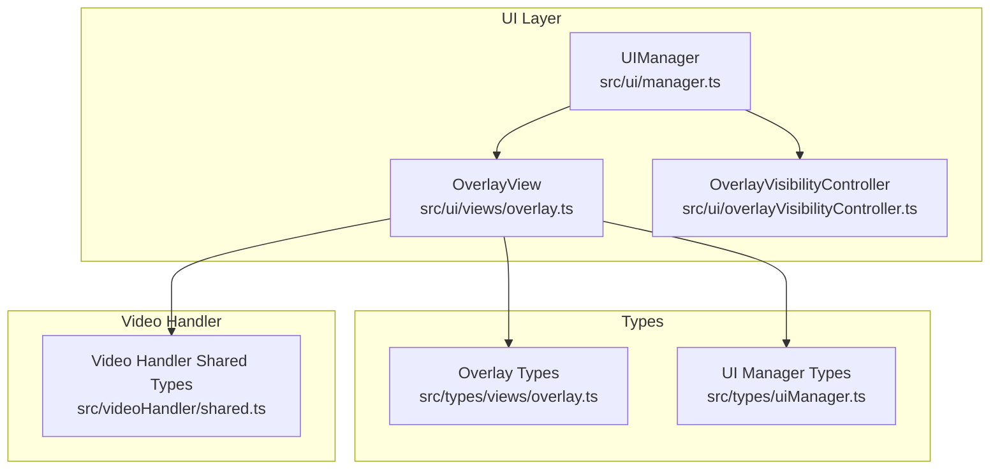
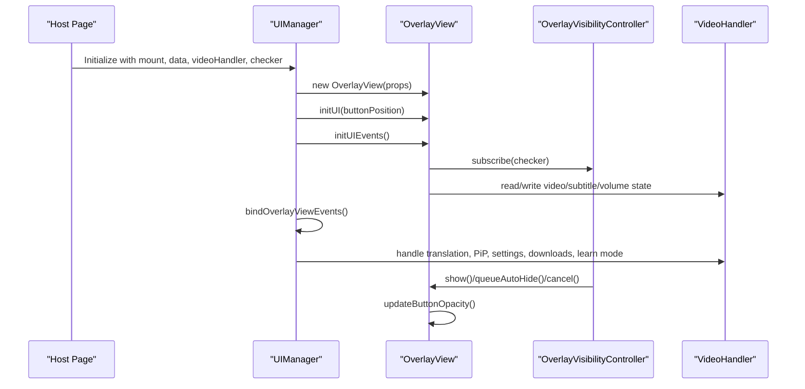
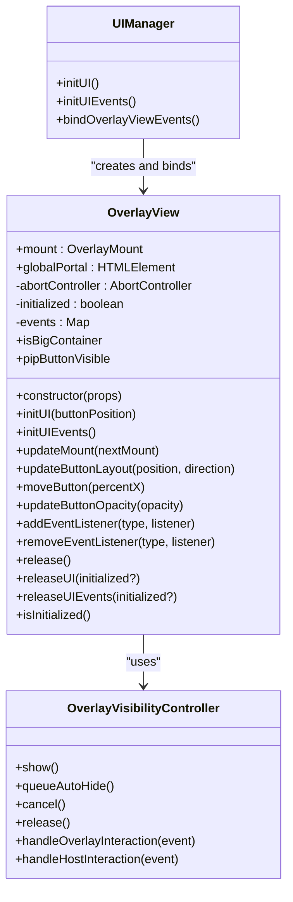
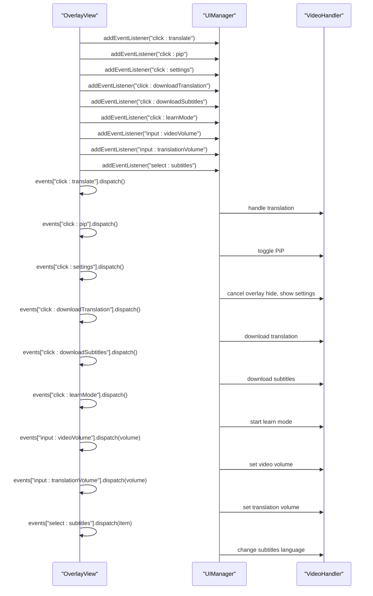
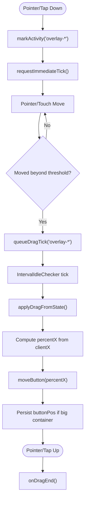
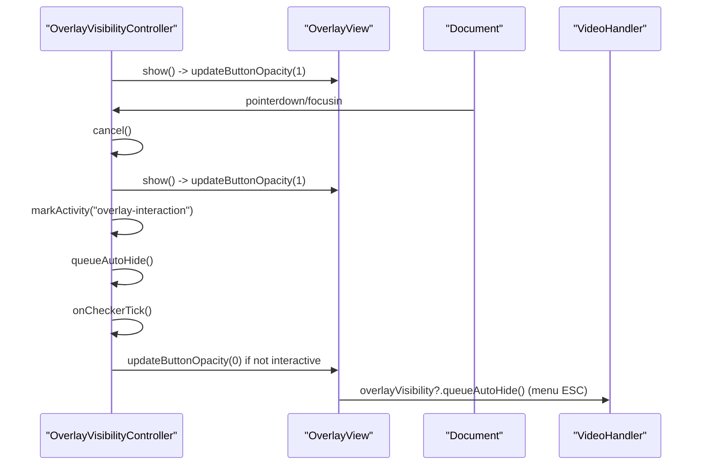
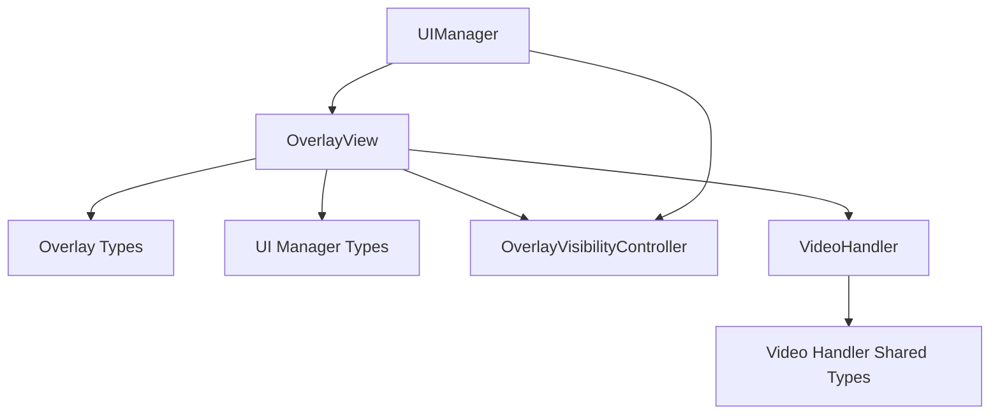

# Overlay View API

<cite>
**Referenced Files in This Document**
- [overlay.ts](file://src/ui/views/overlay.ts)
- [overlay.ts](file://src/types/views/overlay.ts)
- [overlayVisibilityController.ts](file://src/ui/overlayVisibilityController.ts)
- [manager.ts](file://src/ui/manager.ts)
- [uiManager.ts](file://src/types/uiManager.ts)
- [shared.ts](file://src/videoHandler/shared.ts)
</cite>

## Table of Contents
1. [Introduction](#introduction)
2. [Project Structure](#project-structure)
3. [Core Components](#core-components)
4. [Architecture Overview](#architecture-overview)
5. [Detailed Component Analysis](#detailed-component-analysis)
6. [Dependency Analysis](#dependency-analysis)
7. [Performance Considerations](#performance-considerations)
8. [Troubleshooting Guide](#troubleshooting-guide)
9. [Conclusion](#conclusion)

## Introduction
This document provides comprehensive API documentation for the Overlay View component. It covers the OverlayViewProps interface, mount configuration, global portal setup, data binding, video handler integration, and idle checker functionality. It also documents all overlay event types, input events for volume control, and selection events for language and subtitle preferences. The guide includes TypeScript interface specifications, state management patterns, user interaction flows, and practical integration examples. Finally, it addresses overlay positioning, visibility control, and performance optimization techniques for a smooth user experience.

## Project Structure
The Overlay View resides in the UI layer and integrates with the video handler and visibility controller. The key files involved are:
- Overlay View implementation and public API
- Overlay View TypeScript interfaces
- Overlay Visibility Controller for auto-hide behavior
- UI Manager orchestrating initialization and event binding
- Mount configuration types
- Video handler shared types

**Diagram sources**
- [overlay.ts:1-120](file://src/ui/views/overlay.ts#L1-120)
- [overlayVisibilityController.ts:1-60](file://src/ui/overlayVisibilityController.ts#L1-60)
- [manager.ts:119-157](file://src/ui/manager.ts#L119-157)
- [overlay.ts:1-41](file://src/types/views/overlay.ts#L1-41)
- [uiManager.ts:11-23](file://src/types/uiManager.ts#L11-23)
- [shared.ts:1-30](file://src/videoHandler/shared.ts#L1-30)

**Section sources**
- [overlay.ts:1-120](file://src/ui/views/overlay.ts#L1-120)
- [overlay.ts:1-41](file://src/types/views/overlay.ts#L1-41)
- [overlayVisibilityController.ts:1-60](file://src/ui/overlayVisibilityController.ts#L1-60)
- [manager.ts:119-157](file://src/ui/manager.ts#L119-157)
- [uiManager.ts:11-23](file://src/types/uiManager.ts#L11-23)
- [shared.ts:1-30](file://src/videoHandler/shared.ts#L1-30)

## Core Components
This section defines the Overlay View API surface, including props, events, and state management.

- OverlayViewProps
  - mount: OverlayMount
  - globalPortal: HTMLElement
  - data?: Partial<StorageData>
  - videoHandler?: VideoHandler
  - intervalIdleChecker: IntervalIdleChecker

- Overlay View Public API
  - Constructor: Initializes OverlayView with props
  - initUI(buttonPosition?): Creates overlay UI nodes and portals
  - initUIEvents(): Binds DOM and component events
  - updateMount(nextMount): Rebinds UI when player container changes
  - updateButtonLayout(position, direction): Updates button/menu layout
  - moveButton(percentX): Draggable button positioning
  - updateButtonOpacity(opacity): Controls overlay visibility opacity
  - addEventListener(type, listener): Registers event listeners
  - removeEventListener(type, listener): Removes event listeners
  - release/releaseUI/releaseUIEvents: Lifecycle cleanup
  - isInitialized(): Type guard for initialized state
  - isBigContainer: Computed flag for layout adaptation
  - pipButtonVisible: Computed flag for PiP button visibility

- Overlay View Event Types
  - click:settings
  - click:pip
  - click:downloadTranslation
  - click:downloadSubtitles
  - click:translate
  - input:videoVolume
  - input:translationVolume
  - select:fromLanguage
  - select:toLanguage
  - select:subtitles
  - click:learnMode

- Overlay View Event Payloads
  - click:*: no arguments
  - input:videoVolume: [volume: number]
  - input:translationVolume: [volume: number]
  - select:fromLanguage: [item: LanguageSelectKey]
  - select:toLanguage: [item: LanguageSelectKey]
  - select:subtitles: [item: string]

- Overlay Mount Configuration
  - root: Player container element
  - portalContainer: Portal root for overlay nodes
  - tooltipLayoutRoot?: Optional layout root for tooltips

- Global Portal Setup
  - OverlayView creates a dedicated portal for overlay nodes and tooltips
  - UIManager creates a global portal appended to document.documentElement

- Data Binding
  - OverlayView accepts Partial<StorageData> to configure UI behavior (e.g., default volumes, language selections, PiP visibility)
  - Volume persistence is debounced and flushed to storage

- Video Handler Integration
  - OverlayView optionally receives a VideoHandler instance
  - Integrates with video volume, translation volume, subtitles, and PiP toggling
  - Uses video handler to persist language selections and load subtitles

- Idle Checker Functionality
  - OverlayView subscribes to IntervalIdleChecker ticks for drag and layout updates
  - OverlayVisibilityController manages auto-hide scheduling and visibility transitions

**Section sources**
- [overlay.ts:20-41](file://src/types/views/overlay.ts#L20-L41)
- [overlay.ts:104-116](file://src/ui/views/overlay.ts#L104-L116)
- [overlay.ts:252-402](file://src/ui/views/overlay.ts#L252-L402)
- [overlay.ts:404-799](file://src/ui/views/overlay.ts#L404-L799)
- [overlay.ts:134-171](file://src/ui/views/overlay.ts#L134-L171)
- [overlay.ts:802-816](file://src/ui/views/overlay.ts#L802-L816)
- [overlay.ts:818-834](file://src/ui/views/overlay.ts#L818-L834)
- [overlay.ts:986-996](file://src/ui/views/overlay.ts#L986-L996)
- [overlay.ts:212-226](file://src/ui/views/overlay.ts#L212-L226)
- [overlay.ts:1041-1052](file://src/ui/views/overlay.ts#L1041-L1052)
- [overlay.ts:1019-1039](file://src/ui/views/overlay.ts#L1019-L1039)
- [overlay.ts:1054-1071](file://src/ui/views/overlay.ts#L1054-L1071)
- [overlay.ts:1073-1075](file://src/ui/views/overlay.ts#L1073-L1075)
- [overlay.ts:7-18](file://src/types/views/overlay.ts#L7-L18)
- [overlay.ts:28-40](file://src/types/views/overlay.ts#L28-L40)
- [uiManager.ts:11-15](file://src/types/uiManager.ts#L11-L15)
- [overlayVisibilityController.ts:5-11](file://src/ui/overlayVisibilityController.ts#L5-L11)
- [overlay.ts:412-414](file://src/ui/views/overlay.ts#L412-L414)

## Architecture Overview
The Overlay View integrates with the UI Manager, Video Handler, and Overlay Visibility Controller to provide a cohesive user experience. The UI Manager initializes OverlayView and binds overlay events to video handler actions. The Overlay Visibility Controller manages auto-hide behavior based on idle detection.

**Diagram sources**
- [manager.ts:119-157](file://src/ui/manager.ts#L119-157)
- [overlay.ts:104-116](file://src/ui/views/overlay.ts#L104-L116)
- [overlay.ts:252-402](file://src/ui/views/overlay.ts#L252-L402)
- [overlay.ts:404-799](file://src/ui/views/overlay.ts#L404-L799)
- [overlayVisibilityController.ts:24-29](file://src/ui/overlayVisibilityController.ts#L24-L29)
- [overlayVisibilityController.ts:34-41](file://src/ui/overlayVisibilityController.ts#L34-L41)
- [overlayVisibilityController.ts:59-70](file://src/ui/overlayVisibilityController.ts#L59-L70)

**Section sources**
- [manager.ts:119-157](file://src/ui/manager.ts#L119-157)
- [overlay.ts:104-116](file://src/ui/views/overlay.ts#L104-L116)
- [overlay.ts:252-402](file://src/ui/views/overlay.ts#L252-L402)
- [overlay.ts:404-799](file://src/ui/views/overlay.ts#L404-L799)
- [overlayVisibilityController.ts:24-70](file://src/ui/overlayVisibilityController.ts#L24-L70)

## Detailed Component Analysis

### OverlayView Class
OverlayView encapsulates the overlay UI, event handling, and integration with the video handler and idle checker.

**Diagram sources**
- [overlay.ts:29-116](file://src/ui/views/overlay.ts#L29-L116)
- [overlayVisibilityController.ts:18-54](file://src/ui/overlayVisibilityController.ts#L18-L54)
- [manager.ts:119-157](file://src/ui/manager.ts#L119-157)

**Section sources**
- [overlay.ts:29-116](file://src/ui/views/overlay.ts#L29-L116)
- [overlay.ts:134-171](file://src/ui/views/overlay.ts#L134-L171)
- [overlay.ts:252-402](file://src/ui/views/overlay.ts#L252-L402)
- [overlay.ts:404-799](file://src/ui/views/overlay.ts#L404-L799)
- [overlay.ts:802-834](file://src/ui/views/overlay.ts#L802-L834)
- [overlay.ts:818-834](file://src/ui/views/overlay.ts#L818-L834)
- [overlay.ts:986-996](file://src/ui/views/overlay.ts#L986-L996)
- [overlay.ts:1041-1052](file://src/ui/views/overlay.ts#L1041-L1052)
- [overlay.ts:1019-1039](file://src/ui/views/overlay.ts#L1019-L1039)
- [overlay.ts:1054-1075](file://src/ui/views/overlay.ts#L1054-L1075)
- [overlayVisibilityController.ts:18-54](file://src/ui/overlayVisibilityController.ts#L18-L54)
- [manager.ts:119-157](file://src/ui/manager.ts#L119-157)

### Event Handling Flow
OverlayView dispatches typed events that the UI Manager listens to and forwards to the video handler.

**Diagram sources**
- [overlay.ts:54-84](file://src/ui/views/overlay.ts#L54-L84)
- [overlay.ts:468-520](file://src/ui/views/overlay.ts#L468-L520)
- [overlay.ts:487-503](file://src/ui/views/overlay.ts#L487-L503)
- [overlay.ts:504-520](file://src/ui/views/overlay.ts#L504-L520)
- [overlay.ts:662-681](file://src/ui/views/overlay.ts#L662-L681)
- [overlay.ts:666-672](file://src/ui/views/overlay.ts#L666-L672)
- [overlay.ts:674-681](file://src/ui/views/overlay.ts#L674-L681)
- [overlay.ts:768-795](file://src/ui/views/overlay.ts#L768-L795)
- [overlay.ts:779-795](file://src/ui/views/overlay.ts#L779-L795)
- [overlay.ts:764-766](file://src/ui/views/overlay.ts#L764-L766)
- [manager.ts:165-237](file://src/ui/manager.ts#L165-237)
- [manager.ts:200-227](file://src/ui/manager.ts#L200-227)
- [manager.ts:228-237](file://src/ui/manager.ts#L228-237)

**Section sources**
- [overlay.ts:54-84](file://src/ui/views/overlay.ts#L54-L84)
- [overlay.ts:468-520](file://src/ui/views/overlay.ts#L468-L520)
- [overlay.ts:662-681](file://src/ui/views/overlay.ts#L662-L681)
- [overlay.ts:768-795](file://src/ui/views/overlay.ts#L768-L795)
- [overlay.ts:764-766](file://src/ui/views/overlay.ts#L764-L766)
- [manager.ts:165-237](file://src/ui/manager.ts#L165-237)
- [manager.ts:200-227](file://src/ui/manager.ts#L200-227)
- [manager.ts:228-237](file://src/ui/manager.ts#L228-237)

### Drag and Positioning Logic
OverlayView supports draggable button placement with pointer and touch events, integrating with the idle checker for smooth updates.

**Diagram sources**
- [overlay.ts:836-862](file://src/ui/views/overlay.ts#L836-L862)
- [overlay.ts:864-886](file://src/ui/views/overlay.ts#L864-L886)
- [overlay.ts:888-906](file://src/ui/views/overlay.ts#L888-L906)
- [overlay.ts:908-923](file://src/ui/views/overlay.ts#L908-L923)
- [overlay.ts:936-942](file://src/ui/views/overlay.ts#L936-L942)
- [overlay.ts:944-958](file://src/ui/views/overlay.ts#L944-L958)
- [overlay.ts:960-962](file://src/ui/views/overlay.ts#L960-L962)
- [overlay.ts:964-984](file://src/ui/views/overlay.ts#L964-L984)
- [overlay.ts:850-851](file://src/ui/views/overlay.ts#L850-L851)
- [overlay.ts:861-862](file://src/ui/views/overlay.ts#L861-L862)

**Section sources**
- [overlay.ts:836-984](file://src/ui/views/overlay.ts#L836-L984)
- [overlay.ts:960-962](file://src/ui/views/overlay.ts#L960-L962)

### Visibility Control and Auto-Hide
The Overlay Visibility Controller manages overlay opacity and auto-hide behavior based on user interaction and idle detection.

**Diagram sources**
- [overlayVisibilityController.ts:34-41](file://src/ui/overlayVisibilityController.ts#L34-L41)
- [overlayVisibilityController.ts:75-93](file://src/ui/overlayVisibilityController.ts#L75-L93)
- [overlayVisibilityController.ts:59-70](file://src/ui/overlayVisibilityController.ts#L59-L70)
- [overlayVisibilityController.ts:152-176](file://src/ui/overlayVisibilityController.ts#L152-L176)
- [overlay.ts:655-656](file://src/ui/views/overlay.ts#L655-L656)

**Section sources**
- [overlayVisibilityController.ts:34-93](file://src/ui/overlayVisibilityController.ts#L34-L93)
- [overlayVisibilityController.ts:59-70](file://src/ui/overlayVisibilityController.ts#L59-L70)
- [overlayVisibilityController.ts:152-176](file://src/ui/overlayVisibilityController.ts#L152-L176)
- [overlay.ts:655-656](file://src/ui/views/overlay.ts#L655-L656)

## Dependency Analysis
OverlayView depends on several subsystems for mounting, rendering, eventing, and integration.

**Diagram sources**
- [overlay.ts:1-28](file://src/ui/views/overlay.ts#L1-L28)
- [overlay.ts:1-41](file://src/types/views/overlay.ts#L1-L41)
- [uiManager.ts:1-23](file://src/types/uiManager.ts#L1-L23)
- [overlayVisibilityController.ts:1-11](file://src/ui/overlayVisibilityController.ts#L1-L11)
- [manager.ts:1-34](file://src/ui/manager.ts#L1-L34)
- [shared.ts:1-30](file://src/videoHandler/shared.ts#L1-L30)

**Section sources**
- [overlay.ts:1-28](file://src/ui/views/overlay.ts#L1-L28)
- [overlay.ts:1-41](file://src/types/views/overlay.ts#L1-L41)
- [uiManager.ts:1-23](file://src/types/uiManager.ts#L1-L23)
- [overlayVisibilityController.ts:1-11](file://src/ui/overlayVisibilityController.ts#L1-L11)
- [manager.ts:1-34](file://src/ui/manager.ts#L1-L34)
- [shared.ts:1-30](file://src/videoHandler/shared.ts#L1-L30)

## Performance Considerations
- Debounced Volume Persistence: Default translation volume updates are debounced to reduce storage writes and avoid UI jank.
- Conditional Opacity Updates: Overlay opacity is only updated when the difference exceeds a small threshold to minimize style recalculations.
- Efficient Drag Handling: Pointer/touch events are registered with appropriate options (passive/non-passive) to avoid blocking the main thread. Drag computations clamp positions to container bounds to prevent invalid states.
- Idle-Based Updates: Drag and layout changes are batched on idle ticks to align with animation frames and reduce layout thrashing.
- Conditional Visibility: Overlay remains hidden when the menu is open to avoid unnecessary reflows and repaints.

[No sources needed since this section provides general guidance]

## Troubleshooting Guide
- OverlayView not initialized: Methods like initUIEvents() and release*() require OverlayView to be initialized; ensure initUI() was called before initUIEvents().
- Mount changes: Use updateMount() to rebind UI nodes and tooltips when the player container changes.
- Event listeners not firing: Verify addEventListener() is called after initUIEvents() and that the overlay is initialized.
- PiP button missing: pipButtonVisible depends on availability and configuration; ensure isPiPAvailable() and data.showPiPButton are set appropriately.
- Auto-hide not working: Ensure OverlayVisibilityController is instantiated and checker subscription is active; confirm queueAutoHide() is invoked on interactions.

**Section sources**
- [overlay.ts:253-255](file://src/ui/views/overlay.ts#L253-L255)
- [overlay.ts:405-407](file://src/ui/views/overlay.ts#L405-L407)
- [overlay.ts:134-171](file://src/ui/views/overlay.ts#L134-L171)
- [overlay.ts:1073-1075](file://src/ui/views/overlay.ts#L1073-L1075)
- [overlayVisibilityController.ts:24-29](file://src/ui/overlayVisibilityController.ts#L24-L29)
- [overlayVisibilityController.ts:59-70](file://src/ui/overlayVisibilityController.ts#L59-L70)

## Conclusion
The Overlay View API provides a robust, extensible foundation for video overlay interactions. It cleanly separates concerns between UI rendering, event handling, and integration with the video handler and visibility controller. By leveraging typed events, debounced updates, and idle-driven rendering, it achieves a responsive and accessible user experience. The provided integration patterns enable straightforward adoption within larger systems while maintaining performance and maintainability.