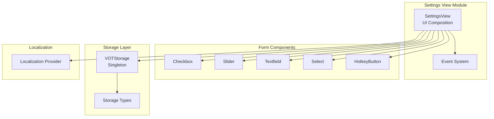
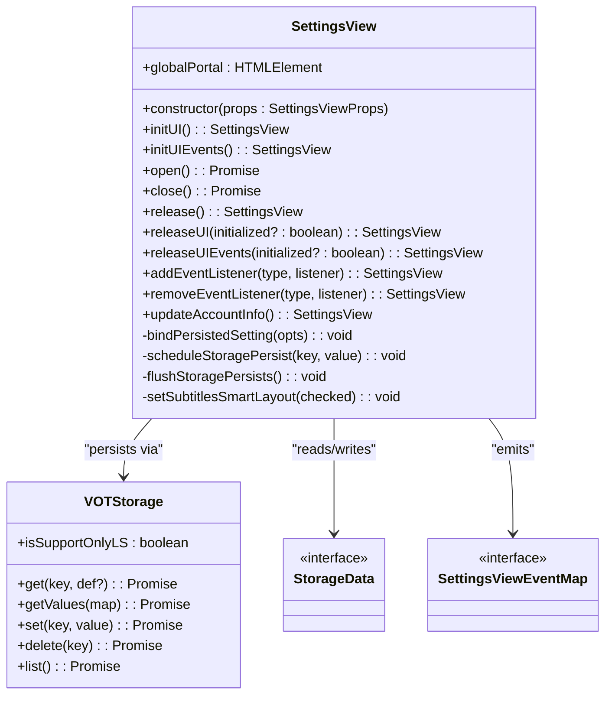
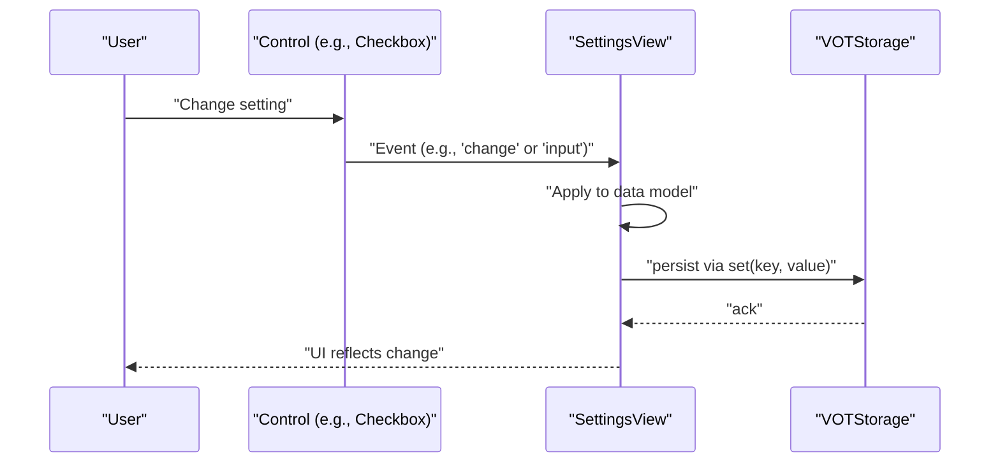
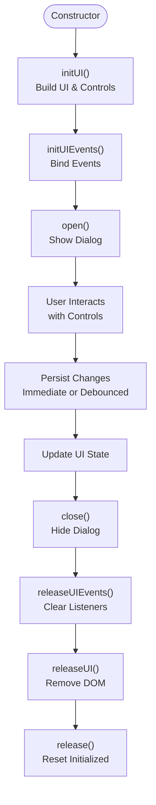
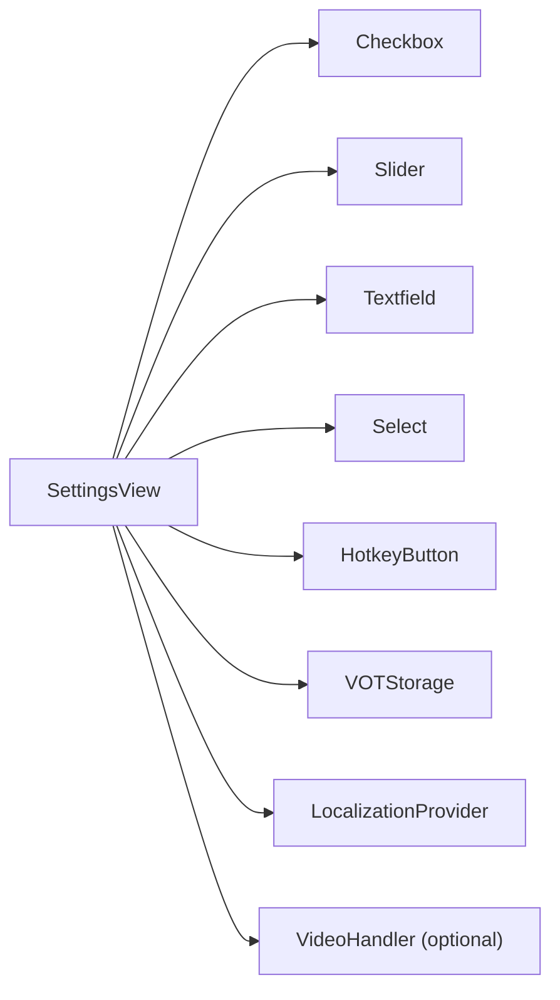

# Settings View API

<cite>
**Referenced Files in This Document**
- [settings.ts](file://src/ui/views/settings.ts)
- [settings.ts](file://src/types/views/settings.ts)
- [storage.ts](file://src/types/storage.ts)
- [storage.ts](file://src/utils/storage.ts)
- [select.ts](file://src/types/components/select.ts)
- [slider.ts](file://src/types/components/slider.ts)
- [checkbox.ts](file://src/types/components/checkbox.ts)
- [textfield.ts](file://src/types/components/textfield.ts)
- [hotkeyButton.ts](file://src/types/components/hotkeyButton.ts)
- [languagePairSelect.ts](file://src/types/components/languagePairSelect.ts)
- [languagePairSelect.ts](file://src/ui/components/languagePairSelect.ts)
</cite>

## Table of Contents
1. [Introduction](#introduction)
2. [Project Structure](#project-structure)
3. [Core Components](#core-components)
4. [Architecture Overview](#architecture-overview)
5. [Detailed Component Analysis](#detailed-component-analysis)
6. [Dependency Analysis](#dependency-analysis)
7. [Performance Considerations](#performance-considerations)
8. [Troubleshooting Guide](#troubleshooting-guide)
9. [Conclusion](#conclusion)

## Introduction
This document provides comprehensive API documentation for the Settings View component. It covers the SettingsViewProps interface, settings-specific state management, form validation patterns, persistence mechanisms, lifecycle, modal behavior, and integration with the storage system. It also documents the settings form components, validation approaches, and user experience considerations for configuration management.

## Project Structure
The Settings View is implemented as a cohesive UI module that composes smaller UI components and integrates with the storage layer and localization provider. The relevant files include:
- Settings view implementation and UI composition
- Type definitions for props, events, and storage data
- Storage abstraction with compatibility conversion
- Component type definitions for form controls

**Diagram sources**
- [settings.ts:99-1367](file://src/ui/views/settings.ts#L99-L1367)
- [settings.ts:7-37](file://src/types/views/settings.ts#L7-L37)
- [storage.ts:74-129](file://src/types/storage.ts#L74-L129)
- [storage.ts:204-380](file://src/utils/storage.ts#L204-L380)

**Section sources**
- [settings.ts:99-1367](file://src/ui/views/settings.ts#L99-L1367)
- [settings.ts:7-37](file://src/types/views/settings.ts#L7-L37)
- [storage.ts:74-129](file://src/types/storage.ts#L74-L129)
- [storage.ts:204-380](file://src/utils/storage.ts#L204-L380)

## Core Components
This section documents the primary interfaces and classes used by the Settings View.

- SettingsViewProps
  - Purpose: Provides initialization parameters for the Settings View.
  - Fields:
    - globalPortal: HTMLElement — Root element to attach the settings dialog.
    - data?: Partial<StorageData> — Optional initial settings snapshot.
    - videoHandler?: VideoHandler — Optional video context for audio-related features.
  - Related file: [settings.ts:7-11](file://src/types/views/settings.ts#L7-L11)

- SettingsViewEventMap
  - Purpose: Defines typed events emitted by the Settings View during user interactions.
  - Examples include click handlers for bug report and reset actions, change/input/select handlers for various settings, and account update notifications.
  - Related file: [settings.ts:13-37](file://src/types/views/settings.ts#L13-L37)

- StorageData
  - Purpose: Defines the complete schema of persisted settings.
  - Covers language pair configuration, subtitle preferences, audio settings, and user preferences.
  - Related file: [storage.ts:74-129](file://src/types/storage.ts#L74-L129)

- VOTStorage
  - Purpose: Abstraction over browser storage with compatibility conversion and fallback to localStorage.
  - Features: Promise-based and legacy GM API support, batch get/set, migration helpers.
  - Related file: [storage.ts:204-380](file://src/utils/storage.ts#L204-L380)

**Section sources**
- [settings.ts:7-11](file://src/types/views/settings.ts#L7-L11)
- [settings.ts:13-37](file://src/types/views/settings.ts#L13-L37)
- [storage.ts:74-129](file://src/types/storage.ts#L74-L129)
- [storage.ts:204-380](file://src/utils/storage.ts#L204-L380)

## Architecture Overview
The Settings View composes multiple UI components and binds them to the storage layer. It emits typed events for external subscribers and manages persistence with debounced writes for numeric sliders.

**Diagram sources**
- [settings.ts:99-1367](file://src/ui/views/settings.ts#L99-L1367)
- [storage.ts:204-380](file://src/utils/storage.ts#L204-L380)
- [storage.ts:74-129](file://src/types/storage.ts#L74-L129)
- [settings.ts:13-37](file://src/types/views/settings.ts#L13-L37)

## Detailed Component Analysis

### SettingsViewProps and Initialization
- Purpose: Configure the Settings View with portal, optional initial data, and optional video handler.
- Typical usage:
  - Initialize with globalPortal and optional data snapshot.
  - Call initUI() to construct the dialog and accordion sections.
  - Call initUIEvents() to wire up component interactions and persistence.
- Related file: [settings.ts:7-11](file://src/types/views/settings.ts#L7-L11)

**Section sources**
- [settings.ts:7-11](file://src/types/views/settings.ts#L7-L11)

### Settings Form Components and Validation Patterns
The Settings View composes the following form components:
- Checkbox: [checkbox.ts:3-7](file://src/types/components/checkbox.ts#L3-L7)
- Slider: [slider.ts:3-9](file://src/types/components/slider.ts#L3-L9)
- Textfield: [textfield.ts:1-6](file://src/types/components/textfield.ts#L1-L6)
- Select: [select.ts:10-20](file://src/types/components/select.ts#L10-L20)
- HotkeyButton: [hotkeyButton.ts:1-4](file://src/types/components/hotkeyButton.ts#L1-L4)
- LanguagePairSelect: [languagePairSelect.ts:9-16](file://src/types/components/languagePairSelect.ts#L9-L16), [languagePairSelect.ts:10-110](file://src/ui/components/languagePairSelect.ts#L10-L110)

Validation patterns:
- Numeric sliders enforce min/max/step constraints via component props.
- Text inputs validate presence against defaults (e.g., proxy host falls back to configured default).
- Multi-select toggles enable/disable dependent selections (e.g., enabling a “don’t translate” list).
- Conditional UI states (e.g., disabling options when unsupported by the environment).

**Section sources**
- [checkbox.ts:3-7](file://src/types/components/checkbox.ts#L3-L7)
- [slider.ts:3-9](file://src/types/components/slider.ts#L3-L9)
- [textfield.ts:1-6](file://src/types/components/textfield.ts#L1-L6)
- [select.ts:10-20](file://src/types/components/select.ts#L10-L20)
- [hotkeyButton.ts:1-4](file://src/types/components/hotkeyButton.ts#L1-L4)
- [languagePairSelect.ts:9-16](file://src/types/components/languagePairSelect.ts#L9-L16)
- [languagePairSelect.ts:10-110](file://src/ui/components/languagePairSelect.ts#L10-L110)

### Settings State Management and Persistence
- Storage schema: [storage.ts:74-129](file://src/types/storage.ts#L74-L129)
- Persistence model:
  - Immediate persistence for most changes via bindPersistedSetting.
  - Debounced persistence for frequent numeric updates (subtitlesMaxLength, subtitlesFontSize, subtitlesOpacity, autoHideButtonDelay).
  - Compatibility conversion for legacy keys during reads/writes.
- Example persistence operations:
  - Persisting a boolean toggle: [settings.ts:904-915](file://src/ui/views/settings.ts#L904-L915)
  - Persisting a numeric slider: [settings.ts:979-988](file://src/ui/views/settings.ts#L979-L988)
  - Debouncing numeric changes: [settings.ts:243-275](file://src/ui/views/settings.ts#L243-L275)
- Storage abstraction: [storage.ts:204-380](file://src/utils/storage.ts#L204-L380)

**Diagram sources**
- [settings.ts:904-915](file://src/ui/views/settings.ts#L904-L915)
- [settings.ts:243-275](file://src/ui/views/settings.ts#L243-L275)
- [storage.ts:320-330](file://src/utils/storage.ts#L320-L330)

**Section sources**
- [storage.ts:74-129](file://src/types/storage.ts#L74-L129)
- [settings.ts:904-915](file://src/ui/views/settings.ts#L904-L915)
- [settings.ts:979-988](file://src/ui/views/settings.ts#L979-L988)
- [settings.ts:243-275](file://src/ui/views/settings.ts#L243-L275)
- [storage.ts:204-380](file://src/utils/storage.ts#L204-L380)

### Settings View Lifecycle and Modal Behavior
- Lifecycle:
  - Constructor: Store props and initialize state.
  - initUI(): Build dialog and accordion sections; instantiate controls.
  - initUIEvents(): Bind control events to persistence and UI updates.
  - open()/close(): Control visibility of the modal dialog.
  - release()/releaseUI()/releaseUIEvents(): Clean up DOM and event listeners.
- Modal behavior:
  - Uses a Dialog component as the root container.
  - Sections are collapsible Details components with accessibility attributes.
- Related file: [settings.ts:311-860](file://src/ui/views/settings.ts#L311-L860)

**Diagram sources**
- [settings.ts:311-860](file://src/ui/views/settings.ts#L311-L860)
- [settings.ts:1356-1367](file://src/ui/views/settings.ts#L1356-L1367)

**Section sources**
- [settings.ts:311-860](file://src/ui/views/settings.ts#L311-L860)
- [settings.ts:1356-1367](file://src/ui/views/settings.ts#L1356-L1367)

### Settings Synchronization Mechanisms
- Event-driven updates:
  - Emits typed events for external consumers (e.g., change:subtitlesSmartLayout, select:buttonPosition).
  - Subscribers can react to changes without direct coupling to the UI.
- Account synchronization:
  - AccountButton integration updates account info and emits update:account.
  - Supports token-based login and refresh flows.
- Localization synchronization:
  - Menu language selection triggers localizationProvider.changeLang and updates UI accordingly.
- Related file: [settings.ts:1289-1286](file://src/ui/views/settings.ts#L1289-L1286)

**Section sources**
- [settings.ts:1289-1286](file://src/ui/views/settings.ts#L1289-L1286)

### Settings Initialization, Preference Modification, and Validation Handling
- Initialization:
  - Construct SettingsView with globalPortal and optional data.
  - Call initUI() to render sections and controls.
  - Call initUIEvents() to wire persistence and UI reactions.
- Preference modification:
  - Use bindPersistedSetting for one-way apply-and-persist patterns.
  - Use direct event listeners for complex logic (e.g., debounced numeric sliders).
- Validation handling:
  - Numeric sliders enforce bounds via component props.
  - Defaults are applied when values are missing (e.g., proxy host).
  - Conditional UI states reflect environment capabilities (e.g., WebAudio support).
- Related file: [settings.ts:904-915](file://src/ui/views/settings.ts#L904-L915)

**Section sources**
- [settings.ts:904-915](file://src/ui/views/settings.ts#L904-L915)

### Code Examples (by path)
- Settings initialization and UI construction:
  - [settings.ts:311-860](file://src/ui/views/settings.ts#L311-L860)
- Preference modification with immediate persistence:
  - [settings.ts:904-915](file://src/ui/views/settings.ts#L904-L915)
- Debounced numeric persistence:
  - [settings.ts:243-275](file://src/ui/views/settings.ts#L243-L275)
  - [settings.ts:1112-1134](file://src/ui/views/settings.ts#L1112-L1134)
- Validation handling for proxy host:
  - [settings.ts:1155-1163](file://src/ui/views/settings.ts#L1155-L1163)
- Localization synchronization:
  - [settings.ts:1275-1280](file://src/ui/views/settings.ts#L1275-L1280)
- Account synchronization:
  - [settings.ts:865-903](file://src/ui/views/settings.ts#L865-L903)

**Section sources**
- [settings.ts:311-860](file://src/ui/views/settings.ts#L311-L860)
- [settings.ts:904-915](file://src/ui/views/settings.ts#L904-L915)
- [settings.ts:243-275](file://src/ui/views/settings.ts#L243-L275)
- [settings.ts:1112-1134](file://src/ui/views/settings.ts#L1112-L1134)
- [settings.ts:1155-1163](file://src/ui/views/settings.ts#L1155-L1163)
- [settings.ts:1275-1280](file://src/ui/views/settings.ts#L1275-L1280)
- [settings.ts:865-903](file://src/ui/views/settings.ts#L865-L903)

## Dependency Analysis
The Settings View depends on:
- UI components for form controls
- Storage layer for persistence and compatibility
- Localization provider for dynamic UI text
- Optional video handler for environment-aware features

**Diagram sources**
- [settings.ts:99-1367](file://src/ui/views/settings.ts#L99-L1367)
- [storage.ts:204-380](file://src/utils/storage.ts#L204-L380)

**Section sources**
- [settings.ts:99-1367](file://src/ui/views/settings.ts#L99-L1367)
- [storage.ts:204-380](file://src/utils/storage.ts#L204-L380)

## Performance Considerations
- Debounced persistence: Numeric sliders use a short delay to reduce storage writes during rapid changes.
- Conditional UI updates: Disabling controls prevents unnecessary re-renders and event handling.
- Environment checks: Feature detection avoids expensive operations when unsupported.

[No sources needed since this section provides general guidance]

## Troubleshooting Guide
Common issues and resolutions:
- Settings not persisting:
  - Verify storage support and fallback behavior via VOTStorage.isSupportOnlyLS.
  - Confirm that bindPersistedSetting is wired for the control.
- Numeric slider values not saved:
  - Ensure scheduleStoragePersist is invoked and flushStoragePersists is called on release.
- Proxy or localization changes not taking effect:
  - Confirm proxy host fallback and localizationProvider.changeLang are used.
- Account operations failing:
  - Check for localStorage-only environments and disable unsupported actions.

**Section sources**
- [storage.ts:235-248](file://src/utils/storage.ts#L235-L248)
- [settings.ts:243-275](file://src/ui/views/settings.ts#L243-L275)
- [settings.ts:1155-1163](file://src/ui/views/settings.ts#L1155-L1163)
- [settings.ts:1275-1280](file://src/ui/views/settings.ts#L1275-L1280)
- [settings.ts:865-903](file://src/ui/views/settings.ts#L865-L903)

## Conclusion
The Settings View provides a robust, modular configuration interface with strong typing, event-driven updates, and resilient persistence. Its design supports environment-aware features, localization, and maintainable state management through a clear separation of concerns between UI, events, and storage.