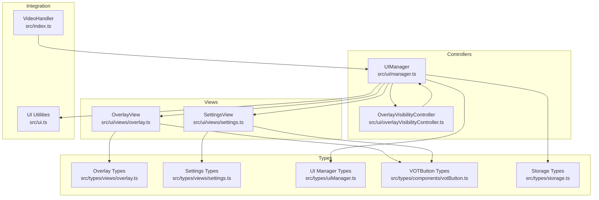
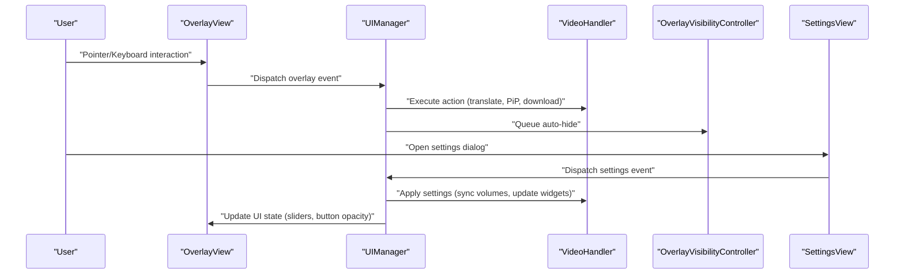
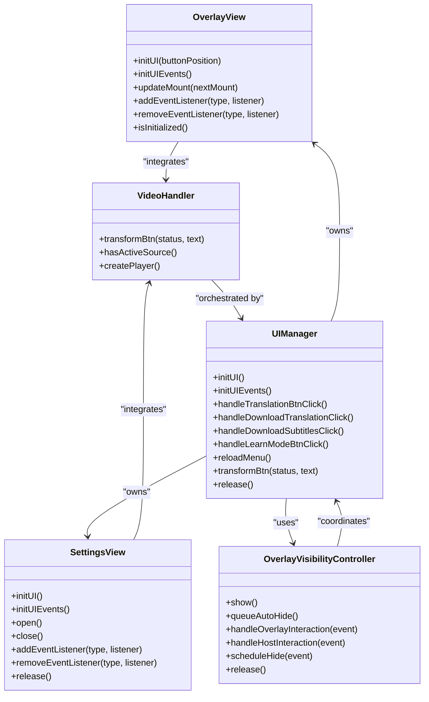

# View APIs

<cite>
**Referenced Files in This Document**
- [overlay.ts](file://src/types/views/overlay.ts)
- [settings.ts](file://src/types/views/settings.ts)
- [overlay.ts](file://src/ui/views/overlay.ts)
- [settings.ts](file://src/ui/views/settings.ts)
- [overlayVisibilityController.ts](file://src/ui/overlayVisibilityController.ts)
- [manager.ts](file://src/ui/manager.ts)
- [uiManager.ts](file://src/types/uiManager.ts)
- [votButton.ts](file://src/types/components/votButton.ts)
- [storage.ts](file://src/types/storage.ts)
- [ui.ts](file://src/ui.ts)
- [index.ts](file://src/index.ts)
</cite>

## Table of Contents
1. [Introduction](#introduction)
2. [Project Structure](#project-structure)
3. [Core Components](#core-components)
4. [Architecture Overview](#architecture-overview)
5. [Detailed Component Analysis](#detailed-component-analysis)
6. [Dependency Analysis](#dependency-analysis)
7. [Performance Considerations](#performance-considerations)
8. [Troubleshooting Guide](#troubleshooting-guide)
9. [Conclusion](#conclusion)

## Introduction
This document provides comprehensive API documentation for the English Teacher extension’s view management interfaces. It covers overlay view APIs for visibility control, positioning, state management, and user interaction handling, as well as settings view APIs for configuration management, preference persistence, form validation, and settings synchronization. It includes TypeScript interface specifications for view controllers, state management contracts, and event handling patterns, along with code examples demonstrating instantiation, state manipulation, user interaction handling, and integration with the core system. Additional topics include view lifecycle management, data binding patterns, performance optimization techniques, view composition, navigation patterns, and accessibility considerations for both overlay and settings views.

## Project Structure
The view management system is organized around two primary view controllers:
- OverlayView: Manages the floating overlay UI (button, menu, sliders, and selection controls) and integrates with the video player and subtitles widget.
- SettingsView: Manages the settings dialog with multiple configurable categories and persistence to storage.

These views are orchestrated by UIManager, which handles initialization, event binding, and coordination with VideoHandler and OverlayVisibilityController. The system exposes typed interfaces for props, events, and state to ensure type-safe integration.

**Diagram sources**
- [overlay.ts](file://src/ui/views/overlay.ts)
- [settings.ts](file://src/ui/views/settings.ts)
- [overlayVisibilityController.ts](file://src/ui/overlayVisibilityController.ts)
- [manager.ts](file://src/ui/manager.ts)
- [overlay.ts](file://src/types/views/overlay.ts)
- [settings.ts](file://src/types/views/settings.ts)
- [uiManager.ts](file://src/types/uiManager.ts)
- [votButton.ts](file://src/types/components/votButton.ts)
- [storage.ts](file://src/types/storage.ts)
- [ui.ts](file://src/ui.ts)
- [index.ts](file://src/index.ts)

**Section sources**
- [overlay.ts](file://src/ui/views/overlay.ts)
- [settings.ts](file://src/ui/views/settings.ts)
- [overlayVisibilityController.ts](file://src/ui/overlayVisibilityController.ts)
- [manager.ts](file://src/ui/manager.ts)
- [overlay.ts](file://src/types/views/overlay.ts)
- [settings.ts](file://src/types/views/settings.ts)
- [uiManager.ts](file://src/types/uiManager.ts)
- [votButton.ts](file://src/types/components/votButton.ts)
- [storage.ts](file://src/types/storage.ts)
- [ui.ts](file://src/ui.ts)
- [index.ts](file://src/index.ts)

## Core Components
This section outlines the primary view controllers and supporting types that define the view APIs.

- OverlayView
  - Purpose: Renders and manages the overlay UI (button, menu, sliders, language selectors, and download controls).
  - Key capabilities:
    - Mount management and re-parenting across player containers.
    - Event emission for user interactions (clicks, inputs, selections).
    - Accessibility-compliant keyboard and pointer handling.
    - Volume sliders and default volume persistence.
    - Integration with video handler for translation and subtitles.
  - Interfaces:
    - Props: OverlayViewProps
    - Events: OverlayViewEventMap
    - Methods: initUI, initUIEvents, updateMount, addEventListener/removeEventListener, isInitialized

- SettingsView
  - Purpose: Renders and manages the settings dialog with categorized controls and persistence.
  - Key capabilities:
    - Accordion sections for settings categories.
    - Form controls bound to persisted storage with debounced writes.
    - Event emission for configuration changes and actions.
    - Account integration and bug report/reset actions.
  - Interfaces:
    - Props: SettingsViewProps
    - Events: SettingsViewEventMap
    - Methods: initUI, initUIEvents, addEventListener/removeEventListener, open/close/release

- UIManager
  - Purpose: Orchestrates overlay and settings views, binds events, and coordinates with VideoHandler and OverlayVisibilityController.
  - Key capabilities:
    - Initialization and lifecycle management of views.
    - Event binding between overlay and settings views and VideoHandler.
    - State synchronization and UI updates.
    - Utility methods for translation, download, and settings synchronization.

- OverlayVisibilityController
  - Purpose: Centralizes overlay visibility behavior: showing, hiding, and auto-hide scheduling.
  - Key capabilities:
    - Show/hide overlay immediately.
    - Queue auto-hide after configured delay.
    - Handle overlay and host interactions to manage visibility.
    - Cancel scheduled hide and release resources.

- Supporting Types
  - OverlayMount: Defines mount points for overlay UI.
  - ButtonLayout: Encapsulates position and direction for overlay button layout.
  - StorageData: Typed preferences persisted to storage.
  - VOTButton types: Positions, directions, and status definitions.

**Section sources**
- [overlay.ts](file://src/ui/views/overlay.ts)
- [settings.ts](file://src/ui/views/settings.ts)
- [overlayVisibilityController.ts](file://src/ui/overlayVisibilityController.ts)
- [manager.ts](file://src/ui/manager.ts)
- [overlay.ts](file://src/types/views/overlay.ts)
- [settings.ts](file://src/types/views/settings.ts)
- [uiManager.ts](file://src/types/uiManager.ts)
- [votButton.ts](file://src/types/components/votButton.ts)
- [storage.ts](file://src/types/storage.ts)

## Architecture Overview
The overlay and settings views are integrated into a cohesive UI system managed by UIManager. OverlayVisibilityController centralizes overlay visibility behavior and interacts with UIManager and VideoHandler. The system uses typed interfaces to ensure safe integration and maintainability.

**Diagram sources**
- [overlay.ts](file://src/ui/views/overlay.ts)
- [settings.ts](file://src/ui/views/settings.ts)
- [overlayVisibilityController.ts](file://src/ui/overlayVisibilityController.ts)
- [manager.ts](file://src/ui/manager.ts)
- [index.ts](file://src/index.ts)

**Section sources**
- [overlay.ts](file://src/ui/views/overlay.ts)
- [settings.ts](file://src/ui/views/settings.ts)
- [overlayVisibilityController.ts](file://src/ui/overlayVisibilityController.ts)
- [manager.ts](file://src/ui/manager.ts)
- [index.ts](file://src/index.ts)

## Detailed Component Analysis

### OverlayView API
OverlayView manages the overlay UI and user interactions. It exposes typed props, events, and lifecycle methods.

- Props
  - mount: OverlayMount
  - globalPortal: HTMLElement
  - data?: Partial<StorageData>
  - videoHandler?: VideoHandler
  - intervalIdleChecker: IntervalIdleChecker

- Events (OverlayViewEventMap)
  - click:settings
  - click:pip
  - click:downloadTranslation
  - click:downloadSubtitles
  - click:translate
  - input:videoVolume
  - input:translationVolume
  - select:fromLanguage
  - select:toLanguage
  - select:subtitles
  - click:learnMode

- Lifecycle and Methods
  - initUI(buttonPosition?): Initializes overlay UI with specified button position.
  - initUIEvents(): Binds event handlers for overlay interactions.
  - updateMount(nextMount): Updates mount points and re-parents nodes.
  - addEventListener(type, listener): Adds an event listener for overlay events.
  - removeEventListener(type, listener): Removes an event listener.
  - isInitialized(): Type guard indicating initialization state.

- Accessibility and Interaction
  - Keyboard activation for custom elements.
  - Tooltip management and layout roots.
  - Drag-and-drop support for overlay button movement.
  - Focus and pointer interaction handling to control auto-hide.

- Example usage
  - Instantiate OverlayView with OverlayViewProps and call initUI and initUIEvents.
  - Subscribe to events using addEventListener and react to user interactions.
  - Update mount points using updateMount when the player container changes.

**Section sources**
- [overlay.ts](file://src/types/views/overlay.ts)
- [overlay.ts](file://src/ui/views/overlay.ts)
- [overlayVisibilityController.ts](file://src/ui/overlayVisibilityController.ts)
- [uiManager.ts](file://src/types/uiManager.ts)
- [storage.ts](file://src/types/storage.ts)

### SettingsView API
SettingsView renders the settings dialog and manages configuration changes with persistence.

- Props
  - globalPortal: HTMLElement
  - data?: Partial<StorageData>
  - videoHandler?: VideoHandler

- Events (SettingsViewEventMap)
  - click:bugReport
  - click:resetSettings
  - update:account
  - change:autoTranslate
  - change:autoSubtitles
  - change:showVideoVolume
  - change:audioBooster
  - change:syncVolume
  - change:useLivelyVoice
  - change:subtitlesHighlightWords
  - change:subtitlesSmartLayout
  - change:proxyWorkerHost
  - change:useNewAudioPlayer
  - change:onlyBypassMediaCSP
  - change:showPiPButton
  - input:subtitlesMaxLength
  - input:subtitlesFontSize
  - input:subtitlesBackgroundOpacity
  - input:autoHideButtonDelay
  - select:proxyTranslationStatus
  - select:translationTextService
  - select:buttonPosition
  - select:menuLanguage

- Lifecycle and Methods
  - initUI(): Initializes settings dialog and accordion sections.
  - initUIEvents(): Binds event handlers for form controls and actions.
  - addEventListener(type, listener): Adds an event listener for settings events.
  - removeEventListener(type, listener): Removes an event listener.
  - open()/close(): Opens or closes the settings dialog.
  - release()/releaseUI()/releaseUIEvents(): Releases UI resources and events.
  - updateAccountInfo(): Updates account-related UI and emits account updates.

- Data Binding and Persistence
  - Debounced persistence for frequently updated settings (e.g., subtitle font size, opacity).
  - Direct storage writes for immediate changes (e.g., autoTranslate, syncVolume).
  - Controlled components bound to StorageData with validation and logging.

- Example usage
  - Instantiate SettingsView with SettingsViewProps and call initUI and initUIEvents.
  - Subscribe to events using addEventListener and apply changes to VideoHandler and UI.
  - Open the dialog using open() and close it using close().

**Section sources**
- [settings.ts](file://src/types/views/settings.ts)
- [settings.ts](file://src/ui/views/settings.ts)
- [storage.ts](file://src/types/storage.ts)

### UIManager API
UIManager orchestrates overlay and settings views, binds events, and coordinates with VideoHandler and OverlayVisibilityController.

- Constructor
  - UIManagerProps: mount, data?, videoHandler?, intervalIdleChecker

- Lifecycle and Methods
  - initUI(): Creates global portal, initializes OverlayView and SettingsView.
  - updateMount(mount): Updates overlay mount points.
  - initUIEvents(): Binds overlay and settings view events.
  - handleTranslationBtnClick(): Executes translation action.
  - handleDownloadTranslationClick(): Downloads translation audio.
  - handleDownloadSubtitlesClick(): Downloads subtitles.
  - handleLearnModeBtnClick(): Starts language learning mode.
  - reloadMenu(): Rebuilds UI while preserving state.
  - release()/releaseUI()/releaseUIEvents(): Releases UI resources.
  - transformBtn(status, text): Updates overlay button state and tooltip.

- Event Binding Patterns
  - OverlayView events mapped to VideoHandler actions (translate, PiP, download, subtitles).
  - SettingsView events mapped to UI updates, storage persistence, and VideoHandler configuration.

- Example usage
  - Create UIManager with mount and data, call initUI and initUIEvents.
  - Bind overlay and settings events to VideoHandler actions.
  - Use transformBtn to reflect translation status in the overlay.

**Section sources**
- [manager.ts](file://src/ui/manager.ts)
- [overlay.ts](file://src/ui/views/overlay.ts)
- [settings.ts](file://src/ui/views/settings.ts)
- [overlayVisibilityController.ts](file://src/ui/overlayVisibilityController.ts)
- [index.ts](file://src/index.ts)

### OverlayVisibilityController API
OverlayVisibilityController centralizes overlay visibility behavior.

- Constructor
  - OverlayVisibilityDependencies: checker, getOverlayView, getAutoHideDelay, isInteractiveNode, nowMs?

- Methods
  - show(): Immediately shows overlay.
  - cancel(): Cancels scheduled auto-hide.
  - release(): Cancels and unsubscribes checker.
  - queueAutoHide(): Schedules overlay auto-hide after delay.
  - handleOverlayInteraction(event): Handles overlay interactions.
  - handleHostInteraction(event): Handles host interactions.
  - scheduleHide(event): Schedules hide if focus leaves overlay tree.
  - onCheckerTick(): Performs visibility checks on interval ticks.

- Example usage
  - Instantiate with dependencies and subscribe to checker.
  - Call queueAutoHide after user interactions.
  - Use handleOverlayInteraction and handleHostInteraction to manage visibility.

**Section sources**
- [overlayVisibilityController.ts](file://src/ui/overlayVisibilityController.ts)

### Supporting Types and Utilities
- OverlayMount: Defines root, portalContainer, and optional tooltipLayoutRoot.
- ButtonLayout: Encodes position and direction for overlay button layout.
- StorageData: Typed preferences persisted to storage.
- VOTButton types: Positions, directions, and status definitions.
- UI utilities: Helper functions for creating elements, portals, and accessible buttons.

**Section sources**
- [uiManager.ts](file://src/types/uiManager.ts)
- [votButton.ts](file://src/types/components/votButton.ts)
- [storage.ts](file://src/types/storage.ts)
- [ui.ts](file://src/ui.ts)

## Dependency Analysis
The view management system exhibits clear separation of concerns with well-defined dependencies.

**Diagram sources**
- [overlay.ts](file://src/ui/views/overlay.ts)
- [settings.ts](file://src/ui/views/settings.ts)
- [overlayVisibilityController.ts](file://src/ui/overlayVisibilityController.ts)
- [manager.ts](file://src/ui/manager.ts)
- [index.ts](file://src/index.ts)

**Section sources**
- [overlay.ts](file://src/ui/views/overlay.ts)
- [settings.ts](file://src/ui/views/settings.ts)
- [overlayVisibilityController.ts](file://src/ui/overlayVisibilityController.ts)
- [manager.ts](file://src/ui/manager.ts)
- [index.ts](file://src/index.ts)

## Performance Considerations
- Debounced persistence: SettingsView uses a debounced persistence mechanism for frequently updated settings (e.g., subtitle font size, opacity) to reduce storage writes and improve responsiveness.
- Immediate persistence: Certain settings (e.g., autoTranslate, syncVolume) are persisted immediately to ensure consistency.
- Volume updates: OverlayView schedules default volume persistence to minimize storage writes while maintaining responsiveness.
- Event subscription: OverlayVisibilityController subscribes to an interval checker to efficiently manage overlay auto-hide without continuous polling.
- UI reuse: UIManager preserves overlay state across menu reloads to avoid unnecessary re-initialization.

[No sources needed since this section provides general guidance]

## Troubleshooting Guide
- Overlay not visible
  - Ensure OverlayView is initialized and mounted to the correct root and portal container.
  - Verify OverlayVisibilityController is subscribed and show() is called when needed.
- Settings dialog not opening
  - Confirm SettingsView is initialized and open() is invoked.
  - Check that event listeners are bound via initUIEvents().
- Volume sliders not updating
  - Verify that input events are dispatched and handled by UIManager.
  - Ensure syncVolume settings are applied consistently across video and translation volumes.
- Translation button stuck in loading state
  - Use transformBtn to update overlay button status and text.
  - Ensure actionsAbortController is properly managed to prevent stale operations.

**Section sources**
- [overlay.ts](file://src/ui/views/overlay.ts)
- [settings.ts](file://src/ui/views/settings.ts)
- [overlayVisibilityController.ts](file://src/ui/overlayVisibilityController.ts)
- [manager.ts](file://src/ui/manager.ts)

## Conclusion
The English Teacher extension’s view management system provides robust, type-safe APIs for overlay and settings views. OverlayView and SettingsView are designed for modularity and maintainability, with clear event contracts and lifecycle methods. UIManager orchestrates these views and integrates them with VideoHandler and OverlayVisibilityController, ensuring a responsive and accessible user experience. The system’s typed interfaces, debounced persistence, and centralized visibility control contribute to a scalable and performant architecture.

[No sources needed since this section summarizes without analyzing specific files]