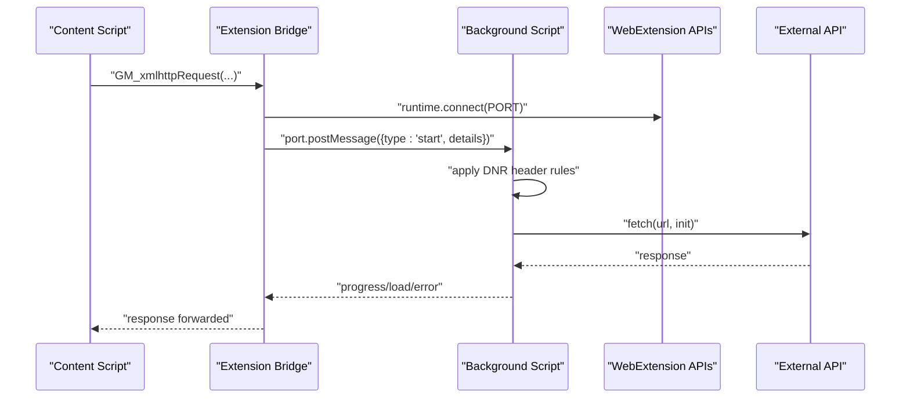
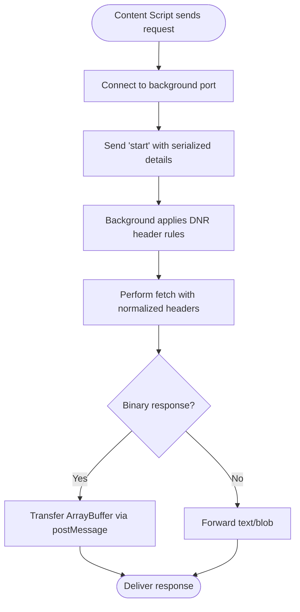
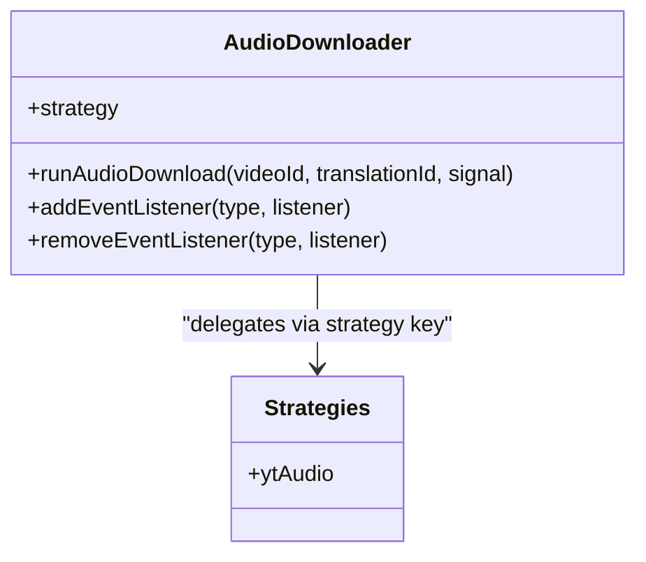
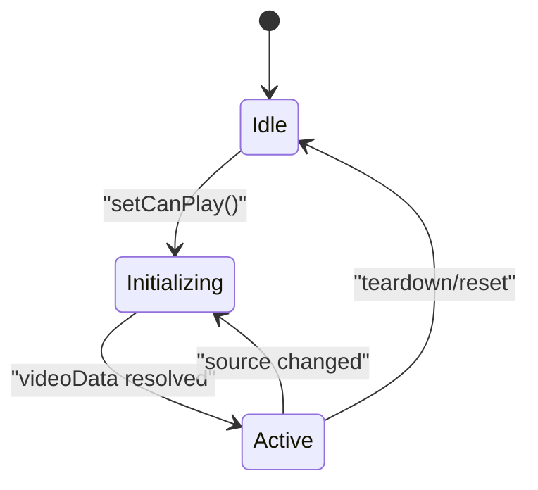
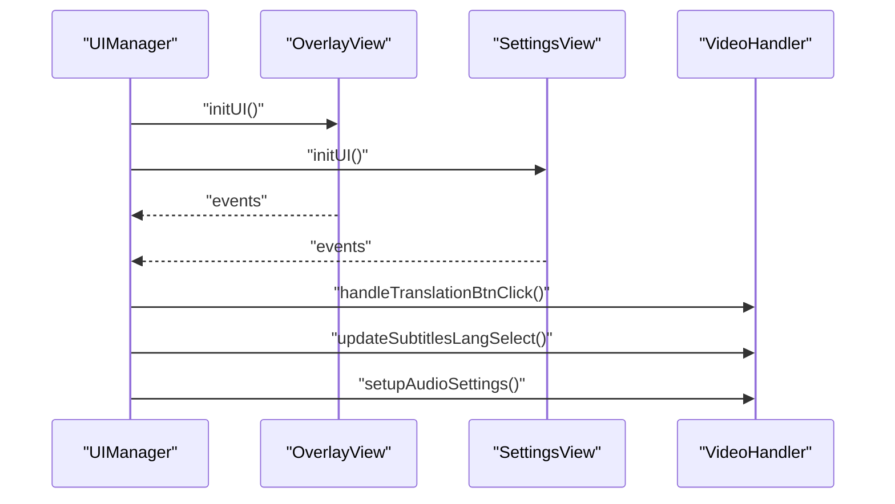
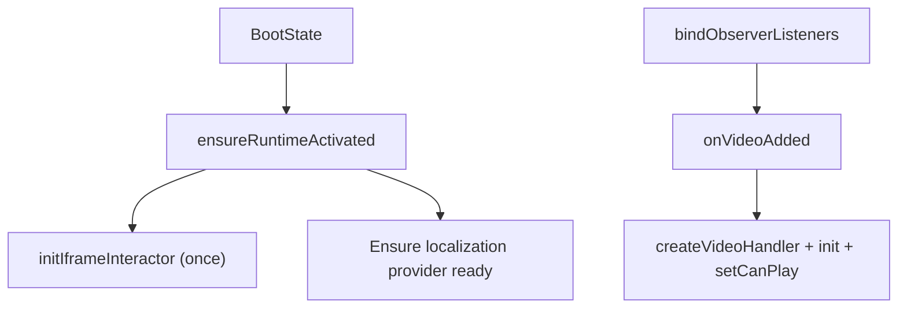
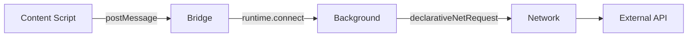
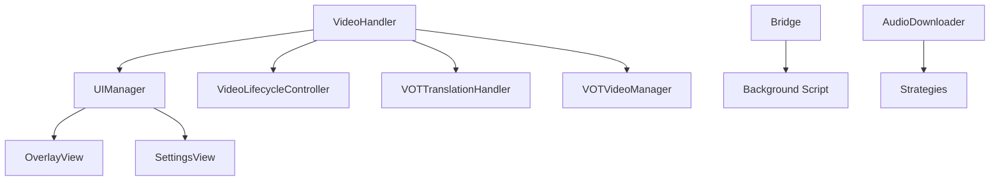
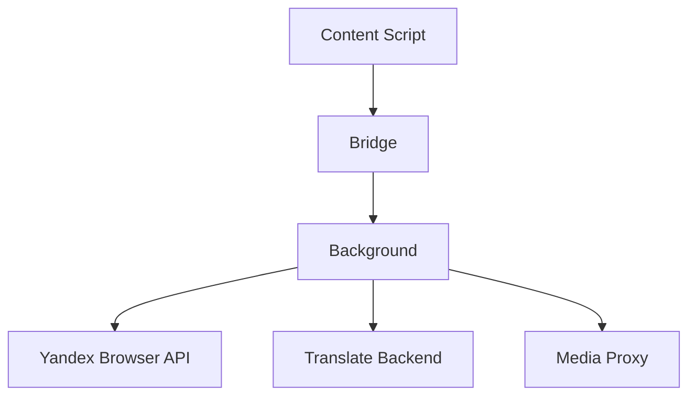

# Architecture & Design

<cite>
**Referenced Files in This Document**
- [src/index.ts](file://src/index.ts)
- [src/bootstrap/bootState.ts](file://src/bootstrap/bootState.ts)
- [src/bootstrap/runtimeActivation.ts](file://src/bootstrap/runtimeActivation.ts)
- [src/bootstrap/iframeInteractor.ts](file://src/bootstrap/iframeInteractor.ts)
- [src/bootstrap/videoObserverBinding.ts](file://src/bootstrap/videoObserverBinding.ts)
- [src/core/bootstrapPolicy.ts](file://src/core/bootstrapPolicy.ts)
- [src/core/videoLifecycleController.ts](file://src/core/videoLifecycleController.ts)
- [src/core/containerResolution.ts](file://src/core/containerResolution.ts)
- [src/ui/manager.ts](file://src/ui/manager.ts)
- [src/types/uiManager.ts](file://src/types/uiManager.ts)
- [src/extension/bridge.ts](file://src/extension/bridge.ts)
- [src/extension/background.ts](file://src/extension/background.ts)
- [src/audioDownloader/index.ts](file://src/audioDownloader/index.ts)
- [src/audioDownloader/strategies/index.ts](file://src/audioDownloader/strategies/index.ts)
- [src/config/config.ts](file://src/config/config.ts)
</cite>

## Table of Contents
1. [Introduction](#introduction)
2. [Project Structure](#project-structure)
3. [Core Components](#core-components)
4. [Architecture Overview](#architecture-overview)
5. [Detailed Component Analysis](#detailed-component-analysis)
6. [Dependency Analysis](#dependency-analysis)
7. [Performance Considerations](#performance-considerations)
8. [Troubleshooting Guide](#troubleshooting-guide)
9. [Conclusion](#conclusion)
10. [Appendices](#appendices)

## Introduction
This document describes the English Teacher extension’s system design and architecture. It focuses on the modular monolith structure, cross-browser compatibility via the extension bridge pattern, strategy pattern for audio downloads, video lifecycle controller state management, UI management and event coordination, dependency injection and service location patterns, and bootstrap and initialization sequences including iframe interactor patterns. It also covers architectural decisions for content script isolation, background coordination, and cross-origin communication, along with scalability, performance, and extensibility considerations.

## Project Structure
The codebase follows a modular monolith approach with feature-based organization:
- Core orchestration and lifecycle: video lifecycle controller, container resolution, bootstrap policy, runtime activation, and observer binding.
- UI subsystem: UIManager, overlay and settings views, and component coordination.
- Extension boundary: bridge for content-to-background communication and background service worker for cross-origin requests and header normalization.
- Audio pipeline: strategy-based audio downloader with event-driven completion.
- Configuration and constants: centralized config for hosts, URLs, and defaults.

```mermaid
graph TB
subgraph "Content Script (Isolated)"
A["VideoHandler<br/>UIManager"]
B["Extension Bridge"]
end
subgraph "Background (Service Worker)"
C["Background Script"]
end
subgraph "External Services"
D["Yandex Browser API"]
E["Translate Backend"]
F["Media Proxy"]
end
A --> B
B <- --> C
C --> D
C --> E
C --> F
```

**Diagram sources**
- [src/index.ts:114-520](file://src/index.ts#L114-L520)
- [src/extension/bridge.ts:647-698](file://src/extension/bridge.ts#L647-L698)
- [src/extension/background.ts:487-533](file://src/extension/background.ts#L487-L533)

**Section sources**
- [src/index.ts:114-520](file://src/index.ts#L114-L520)
- [src/config/config.ts:1-63](file://src/config/config.ts#L1-63)

## Core Components
- VideoHandler: central orchestrator composing managers, UI, lifecycle, and video/audio subsystems. It encapsulates translation orchestration, video manager, UI manager, lifecycle controller, and audio player.
- UIManager: UI lifecycle, event binding, overlays, settings, and component coordination.
- VideoLifecycleController: manages video state transitions, container resolution, and overlay lifecycle.
- Extension Bridge: isolates privileged extension APIs from the main page context and proxies GM_* operations and GM_xmlhttpRequest through the background.
- Background Script: performs cross-origin requests, applies declarativeNetRequest header rules, and relays responses to the bridge.
- AudioDownloader: strategy-based audio retrieval with event-driven partial/success/error notifications.
- Bootstrap and Runtime Activation: runtime activation, iframe interactor, and observer binding for video discovery and initialization.

**Section sources**
- [src/index.ts:114-520](file://src/index.ts#L114-L520)
- [src/ui/manager.ts:56-138](file://src/ui/manager.ts#L56-L138)
- [src/core/videoLifecycleController.ts:54-354](file://src/core/videoLifecycleController.ts#L54-L354)
- [src/extension/bridge.ts:647-698](file://src/extension/bridge.ts#L647-L698)
- [src/extension/background.ts:487-533](file://src/extension/background.ts#L487-L533)
- [src/audioDownloader/index.ts:87-189](file://src/audioDownloader/index.ts#L87-L189)
- [src/bootstrap/runtimeActivation.ts:20-58](file://src/bootstrap/runtimeActivation.ts#L20-L58)
- [src/bootstrap/iframeInteractor.ts:8-51](file://src/bootstrap/iframeInteractor.ts#L8-L51)
- [src/bootstrap/videoObserverBinding.ts:30-178](file://src/bootstrap/videoObserverBinding.ts#L30-L178)

## Architecture Overview
The system is a modular monolith with a clear separation of concerns:
- Content script runs in an isolated world and owns the page-facing UI and orchestration.
- The extension bridge mediates privileged operations (storage, GM_xmlhttpRequest) to the background.
- The background service worker handles cross-origin requests, header normalization, and session rules via declarativeNetRequest.
- The video lifecycle controller coordinates state transitions and UI updates.
- Strategies encapsulate pluggable behaviors (e.g., audio download).



**Diagram sources**
- [src/extension/bridge.ts:335-561](file://src/extension/bridge.ts#L335-L561)
- [src/extension/background.ts:535-800](file://src/extension/background.ts#L535-L800)

**Section sources**
- [src/extension/bridge.ts:335-561](file://src/extension/bridge.ts#L335-L561)
- [src/extension/background.ts:535-800](file://src/extension/background.ts#L535-L800)

## Detailed Component Analysis

### Extension Bridge Pattern (Content Script Isolation)
The bridge pattern separates the main page context from privileged extension APIs:
- The bridge listens for messages from the main page and performs privileged operations (storage, GM_*).
- GM_xmlhttpRequest is proxied via a named port connection to the background.
- Binary responses are handled by transferring ArrayBuffers and falling back to base64 encoding.
- UA-CH headers are collected in the content context and injected via declarativeNetRequest in the background.



**Diagram sources**
- [src/extension/bridge.ts:335-561](file://src/extension/bridge.ts#L335-L561)
- [src/extension/background.ts:639-756](file://src/extension/background.ts#L639-L756)

**Section sources**
- [src/extension/bridge.ts:28-699](file://src/extension/bridge.ts#L28-L699)
- [src/extension/background.ts:193-354](file://src/extension/background.ts#L193-L354)

### Strategy Pattern for Audio Download Strategies
The audio downloader uses a strategy pattern to select the appropriate download mechanism:
- Strategies map strategy keys to functions that produce media buffers and metadata.
- The downloader emits events for partial and complete audio segments and errors.
- The strategy selection is centralized and swappable.



**Diagram sources**
- [src/audioDownloader/index.ts:87-189](file://src/audioDownloader/index.ts#L87-L189)
- [src/audioDownloader/strategies/index.ts:5-7](file://src/audioDownloader/strategies/index.ts#L5-L7)

**Section sources**
- [src/audioDownloader/index.ts:28-125](file://src/audioDownloader/index.ts#L28-L125)
- [src/audioDownloader/strategies/index.ts:1-10](file://src/audioDownloader/strategies/index.ts#L1-L10)

### Video Lifecycle Controller Architecture
The lifecycle controller manages state transitions and UI updates:
- Session-based invalidation ensures stale async work is canceled when the video or source changes.
- Container resolution accounts for shadow DOM and selectors.
- Overlay lifecycle resets and hides when video data is unavailable.
- Auto-subtitles and auto-translation are coordinated with the translation orchestrator.



**Diagram sources**
- [src/core/videoLifecycleController.ts:189-254](file://src/core/videoLifecycleController.ts#L189-L254)
- [src/core/videoLifecycleController.ts:271-352](file://src/core/videoLifecycleController.ts#L271-L352)

**Section sources**
- [src/core/videoLifecycleController.ts:54-354](file://src/core/videoLifecycleController.ts#L54-L354)
- [src/core/containerResolution.ts:3-21](file://src/core/containerResolution.ts#L3-L21)

### UI Management System and Event Propagation
UIManager coordinates overlay and settings views, binds events, and propagates user actions:
- OverlayView and SettingsView are created and mounted into a global portal.
- Events from overlay and settings propagate to VideoHandler and translation orchestration.
- Subtitle and translation settings are synchronized with the subtitles widget and audio player.



**Diagram sources**
- [src/ui/manager.ts:109-138](file://src/ui/manager.ts#L109-L138)
- [src/ui/manager.ts:159-449](file://src/ui/manager.ts#L159-L449)
- [src/types/uiManager.ts:11-23](file://src/types/uiManager.ts#L11-L23)

**Section sources**
- [src/ui/manager.ts:56-800](file://src/ui/manager.ts#L56-L800)
- [src/types/uiManager.ts:1-23](file://src/types/uiManager.ts#L1-L23)

### Bootstrap and Initialization Sequence
The bootstrap sequence coordinates runtime activation, iframe interactor, and video observer binding:
- Boot state guards against duplicate initialization.
- Runtime activation initializes localization and iframe interactor once.
- Video observer binding discovers videos, activates runtime, and constructs VideoHandler instances.



**Diagram sources**
- [src/bootstrap/bootState.ts:26-41](file://src/bootstrap/bootState.ts#L26-L41)
- [src/bootstrap/runtimeActivation.ts:20-58](file://src/bootstrap/runtimeActivation.ts#L20-L58)
- [src/bootstrap/iframeInteractor.ts:8-51](file://src/bootstrap/iframeInteractor.ts#L8-L51)
- [src/bootstrap/videoObserverBinding.ts:30-178](file://src/bootstrap/videoObserverBinding.ts#L30-L178)

**Section sources**
- [src/bootstrap/bootState.ts:1-42](file://src/bootstrap/bootState.ts#L1-L42)
- [src/bootstrap/runtimeActivation.ts:1-59](file://src/bootstrap/runtimeActivation.ts#L1-L59)
- [src/bootstrap/iframeInteractor.ts:1-52](file://src/bootstrap/iframeInteractor.ts#L1-L52)
- [src/bootstrap/videoObserverBinding.ts:1-179](file://src/bootstrap/videoObserverBinding.ts#L1-L179)
- [src/core/bootstrapPolicy.ts:1-31](file://src/core/bootstrapPolicy.ts#L1-L31)

### Cross-Origin Communication and Browser Extension Decisions
- Content script isolation: privileged APIs are accessed only via the bridge.
- Background coordination: service worker performs fetches and header normalization using declarativeNetRequest.
- Policy-driven bootstrap: iframe bootstrap is skipped or lazy depending on iframe context.



**Diagram sources**
- [src/extension/bridge.ts:647-698](file://src/extension/bridge.ts#L647-L698)
- [src/extension/background.ts:487-533](file://src/extension/background.ts#L487-L533)

**Section sources**
- [src/extension/bridge.ts:647-698](file://src/extension/bridge.ts#L647-L698)
- [src/extension/background.ts:487-533](file://src/extension/background.ts#L487-L533)
- [src/core/bootstrapPolicy.ts:9-30](file://src/core/bootstrapPolicy.ts#L9-L30)

## Dependency Analysis
Key dependencies and relationships:
- VideoHandler depends on UIManager, VideoLifecycleController, VOTTranslationHandler, VOTVideoManager, and CacheManager.
- UIManager depends on OverlayView, SettingsView, and LangLearn components.
- Extension Bridge depends on WebExtension runtime and storage APIs.
- Background Script depends on declarativeNetRequest and fetch.
- AudioDownloader depends on strategies and event infrastructure.



**Diagram sources**
- [src/index.ts:388-520](file://src/index.ts#L388-L520)
- [src/ui/manager.ts:119-135](file://src/ui/manager.ts#L119-L135)
- [src/extension/bridge.ts:647-698](file://src/extension/bridge.ts#L647-L698)
- [src/extension/background.ts:487-533](file://src/extension/background.ts#L487-L533)
- [src/audioDownloader/index.ts:87-189](file://src/audioDownloader/index.ts#L87-L189)

**Section sources**
- [src/index.ts:388-520](file://src/index.ts#L388-L520)
- [src/ui/manager.ts:119-135](file://src/ui/manager.ts#L119-L135)
- [src/extension/bridge.ts:647-698](file://src/extension/bridge.ts#L647-L698)
- [src/extension/background.ts:487-533](file://src/extension/background.ts#L487-L533)
- [src/audioDownloader/index.ts:87-189](file://src/audioDownloader/index.ts#L87-L189)

## Performance Considerations
- Deduplication and session invalidation: lifecycle controller prevents redundant work and cancels stale async operations.
- Lazy UI creation: UIManager initializes overlays and settings only when needed.
- Binary response handling: background transfers ArrayBuffers efficiently; falls back to base64 only when necessary.
- Debouncing and throttling: interval idle checker and overlay auto-hide minimize unnecessary updates.
- Strategy-based audio: streaming partial audio reduces latency and memory footprint.

[No sources needed since this section provides general guidance]

## Troubleshooting Guide
- Bridge initialization: if WebExtension APIs are missing, the bridge logs a warning and does not initialize.
- Port disconnections: background cleans up and posts terminal events; bridge settles ports and reports errors.
- Runtime activation: repeated activations are guarded; iframe interactor is bound only once.
- Video lifecycle: stale sessions are canceled; overlay is hidden when video data cannot be resolved.

**Section sources**
- [src/extension/bridge.ts:638-699](file://src/extension/bridge.ts#L638-L699)
- [src/extension/background.ts:523-533](file://src/extension/background.ts#L523-L533)
- [src/bootstrap/runtimeActivation.ts:20-58](file://src/bootstrap/runtimeActivation.ts#L20-L58)
- [src/core/videoLifecycleController.ts:70-94](file://src/core/videoLifecycleController.ts#L70-L94)

## Conclusion
The English Teacher extension employs a modular monolith architecture with clear boundaries between content script, bridge, and background service worker. The extension bridge pattern ensures content script isolation while enabling privileged operations. Strategy and orchestrator patterns provide extensibility for audio downloads and translation workflows. The video lifecycle controller and UIManager coordinate state and UI updates effectively. The bootstrap and initialization sequence, combined with cross-origin communication via declarativeNetRequest, deliver robust cross-browser compatibility and performance.

[No sources needed since this section summarizes without analyzing specific files]

## Appendices

### System Context Diagrams
- Content script to background and external services:


**Diagram sources**
- [src/extension/bridge.ts:335-561](file://src/extension/bridge.ts#L335-L561)
- [src/extension/background.ts:535-800](file://src/extension/background.ts#L535-L800)
- [src/config/config.ts:3-22](file://src/config/config.ts#L3-L22)

### Scalability and Extensibility Notes
- Strategies: new audio download strategies can be added with minimal changes to the strategy registry.
- Lifecycle sessions: session-based invalidation scales well with concurrent videos.
- UI components: UIManager props enable easy composition and testing of UI modules.
- Background DNR rules: session-scoped rules adapt to dynamic header requirements without global overhead.

[No sources needed since this section provides general guidance]