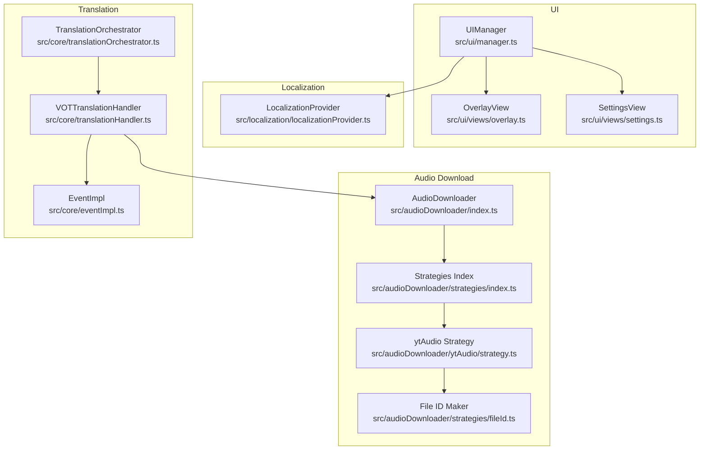
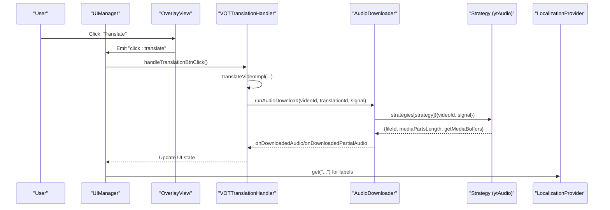
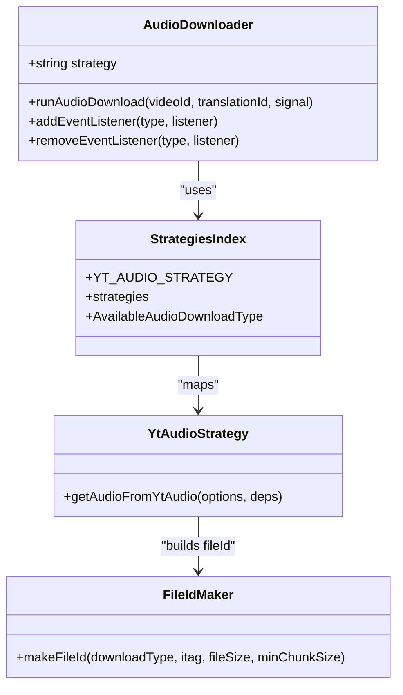
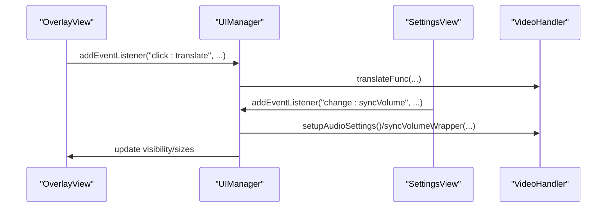
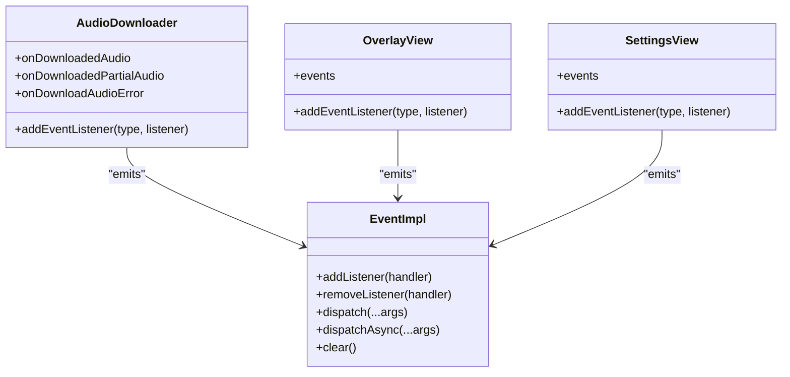
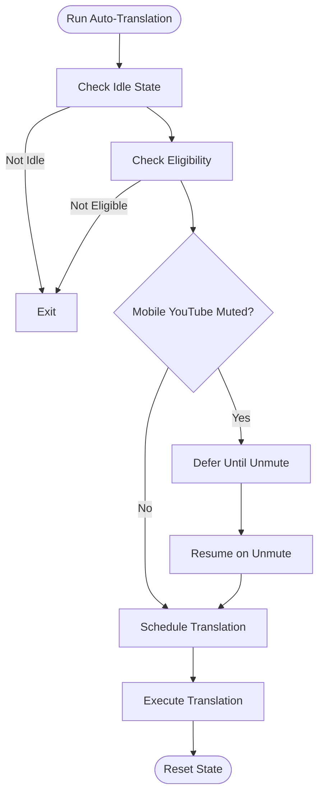
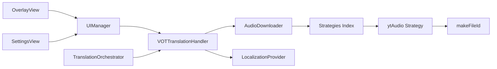

# Component Design Patterns

<cite>
**Referenced Files in This Document**
- [audioDownloader/index.ts](file://src/audioDownloader/index.ts)
- [audioDownloader/strategies/index.ts](file://src/audioDownloader/strategies/index.ts)
- [audioDownloader/strategies/fileId.ts](file://src/audioDownloader/strategies/fileId.ts)
- [audioDownloader/ytAudio/strategy.ts](file://src/audioDownloader/ytAudio/strategy.ts)
- [core/eventImpl.ts](file://src/core/eventImpl.ts)
- [types/core/eventImpl.ts](file://src/types/core/eventImpl.ts)
- [types/audioDownloader.ts](file://src/types/audioDownloader.ts)
- [ui/manager.ts](file://src/ui/manager.ts)
- [ui/views/overlay.ts](file://src/ui/views/overlay.ts)
- [ui/views/settings.ts](file://src/ui/views/settings.ts)
- [localization/localizationProvider.ts](file://src/localization/localizationProvider.ts)
- [core/translationHandler.ts](file://src/core/translationHandler.ts)
- [core/translationOrchestrator.ts](file://src/core/translationOrchestrator.ts)
- [utils/translateApis.ts](file://src/utils/translateApis.ts)
</cite>

## Table of Contents
1. [Introduction](#introduction)
2. [Project Structure](#project-structure)
3. [Core Components](#core-components)
4. [Architecture Overview](#architecture-overview)
5. [Detailed Component Analysis](#detailed-component-analysis)
6. [Dependency Analysis](#dependency-analysis)
7. [Performance Considerations](#performance-considerations)
8. [Troubleshooting Guide](#troubleshooting-guide)
9. [Conclusion](#conclusion)

## Introduction
This document explains the component design patterns used throughout the English Teacher architecture. It focuses on Strategy, Mediator, Observer, Factory, Singleton, Chain of Responsibility, and Template Method patterns. For each pattern, we describe how it is implemented in the codebase, why it is used, and how it improves maintainability and extensibility.

## Project Structure
The English Teacher codebase organizes features by domain:
- Audio download pipeline under src/audioDownloader
- UI under src/ui and src/ui/views
- Localization under src/localization
- Translation orchestration under src/core
- Utilities under src/utils

**Diagram sources**
- [audioDownloader/index.ts:87-189](file://src/audioDownloader/index.ts#L87-L189)
- [audioDownloader/strategies/index.ts:1-10](file://src/audioDownloader/strategies/index.ts#L1-L10)
- [audioDownloader/ytAudio/strategy.ts:74-155](file://src/audioDownloader/ytAudio/strategy.ts#L74-L155)
- [audioDownloader/strategies/fileId.ts:1-16](file://src/audioDownloader/strategies/fileId.ts#L1-L16)
- [ui/manager.ts:56-138](file://src/ui/manager.ts#L56-L138)
- [ui/views/overlay.ts:29-116](file://src/ui/views/overlay.ts#L29-L116)
- [ui/views/settings.ts:99-181](file://src/ui/views/settings.ts#L99-L181)
- [localization/localizationProvider.ts:39-273](file://src/localization/localizationProvider.ts#L39-L273)
- [core/translationHandler.ts:105-125](file://src/core/translationHandler.ts#L105-L125)
- [core/translationOrchestrator.ts:21-85](file://src/core/translationOrchestrator.ts#L21-L85)
- [core/eventImpl.ts:11-68](file://src/core/eventImpl.ts#L11-L68)

**Section sources**
- [audioDownloader/index.ts:87-189](file://src/audioDownloader/index.ts#L87-L189)
- [audioDownloader/strategies/index.ts:1-10](file://src/audioDownloader/strategies/index.ts#L1-L10)
- [audioDownloader/ytAudio/strategy.ts:74-155](file://src/audioDownloader/ytAudio/strategy.ts#L74-L155)
- [audioDownloader/strategies/fileId.ts:1-16](file://src/audioDownloader/strategies/fileId.ts#L1-L16)
- [ui/manager.ts:56-138](file://src/ui/manager.ts#L56-L138)
- [ui/views/overlay.ts:29-116](file://src/ui/views/overlay.ts#L29-L116)
- [ui/views/settings.ts:99-181](file://src/ui/views/settings.ts#L99-L181)
- [localization/localizationProvider.ts:39-273](file://src/localization/localizationProvider.ts#L39-L273)
- [core/translationHandler.ts:105-125](file://src/core/translationHandler.ts#L105-L125)
- [core/translationOrchestrator.ts:21-85](file://src/core/translationOrchestrator.ts#L21-L85)
- [core/eventImpl.ts:11-68](file://src/core/eventImpl.ts#L11-L68)

## Core Components
- AudioDownloader: Orchestrates audio downloads and emits events for full and partial audio chunks.
- Strategies: Pluggable strategies for audio acquisition (ytAudio and others).
- UIManager: Mediator coordinating UI components and business logic.
- EventImpl: Observer pattern implementation for decoupled event emission.
- LocalizationProvider: Singleton provider for localization resources.
- VOTTranslationHandler: Coordinates translation and audio download lifecycles.
- TranslationOrchestrator: Manages auto-translation scheduling and state transitions.
- Translation APIs: Pluggable translation/detection services.

**Section sources**
- [audioDownloader/index.ts:87-189](file://src/audioDownloader/index.ts#L87-L189)
- [audioDownloader/strategies/index.ts:1-10](file://src/audioDownloader/strategies/index.ts#L1-L10)
- [ui/manager.ts:56-138](file://src/ui/manager.ts#L56-L138)
- [core/eventImpl.ts:11-68](file://src/core/eventImpl.ts#L11-L68)
- [localization/localizationProvider.ts:260-273](file://src/localization/localizationProvider.ts#L260-L273)
- [core/translationHandler.ts:105-125](file://src/core/translationHandler.ts#L105-L125)
- [core/translationOrchestrator.ts:21-85](file://src/core/translationOrchestrator.ts#L21-L85)
- [utils/translateApis.ts:167-207](file://src/utils/translateApis.ts#L167-L207)

## Architecture Overview
The system separates concerns across domains:
- UI layer (UIManager, OverlayView, SettingsView) handles presentation and user interactions.
- Business logic (VOTTranslationHandler, TranslationOrchestrator) manages translation workflows.
- Infrastructure (AudioDownloader, Strategies, LocalizationProvider) supports core capabilities.
- Observability (EventImpl) enables event-driven updates.

**Diagram sources**
- [ui/views/overlay.ts:468-483](file://src/ui/views/overlay.ts#L468-L483)
- [ui/manager.ts:735-800](file://src/ui/manager.ts#L735-L800)
- [core/translationHandler.ts:424-444](file://src/core/translationHandler.ts#L424-L444)
- [audioDownloader/index.ts:34-85](file://src/audioDownloader/index.ts#L34-L85)
- [audioDownloader/ytAudio/strategy.ts:74-155](file://src/audioDownloader/ytAudio/strategy.ts#L74-L155)
- [localization/localizationProvider.ts:244-246](file://src/localization/localizationProvider.ts#L244-L246)

## Detailed Component Analysis

### Strategy Pattern: Audio Download Strategies
The Strategy pattern encapsulates algorithms for acquiring audio. The AudioDownloader delegates to a strategy selected at runtime. The ytAudio strategy supports streaming and buffered modes, with a fallback mechanism.

- Strategy selection and registration:
  - Strategies registry maps strategy names to functions.
  - AvailableAudioDownloadType is derived from the registry keys.
- ytAudio strategy:
  - Accepts dependencies for chunk size, fetch timeout, and downloader factory.
  - Attempts streaming mode; falls back to buffered mode if streaming fails.
  - Produces a fileId using makeFileId to encode metadata for caching and chunking.
- Benefits:
  - Easy addition of new strategies (e.g., fileId).
  - Clear separation of concerns between selection and implementation.

**Diagram sources**
- [audioDownloader/index.ts:87-189](file://src/audioDownloader/index.ts#L87-L189)
- [audioDownloader/strategies/index.ts:1-10](file://src/audioDownloader/strategies/index.ts#L1-L10)
- [audioDownloader/ytAudio/strategy.ts:74-155](file://src/audioDownloader/ytAudio/strategy.ts#L74-L155)
- [audioDownloader/strategies/fileId.ts:1-16](file://src/audioDownloader/strategies/fileId.ts#L1-L16)

**Section sources**
- [audioDownloader/strategies/index.ts:1-10](file://src/audioDownloader/strategies/index.ts#L1-L10)
- [audioDownloader/ytAudio/strategy.ts:74-155](file://src/audioDownloader/ytAudio/strategy.ts#L74-L155)
- [audioDownloader/strategies/fileId.ts:1-16](file://src/audioDownloader/strategies/fileId.ts#L1-L16)
- [audioDownloader/index.ts:34-85](file://src/audioDownloader/index.ts#L34-L85)

### Mediator Pattern: UIManager Coordination
UIManager acts as a mediator between UI components (OverlayView, SettingsView) and business logic (VideoHandler). It binds events from UI components to actions in VideoHandler and orchestrates state changes.

- Responsibilities:
  - Initialize UI portals and views.
  - Bind OverlayView and SettingsView events to handlers.
  - Coordinate translation, download, and learn-mode flows.
  - Persist and restore UI state across reloads.
- Benefits:
  - Decouples UI components from business logic.
  - Centralizes cross-cutting concerns like persistence and error handling.

**Diagram sources**
- [ui/manager.ts:159-238](file://src/ui/manager.ts#L159-L238)
- [ui/manager.ts:240-449](file://src/ui/manager.ts#L240-L449)
- [ui/views/overlay.ts:212-226](file://src/ui/views/overlay.ts#L212-L226)
- [ui/views/settings.ts:106-108](file://src/ui/views/settings.ts#L106-L108)

**Section sources**
- [ui/manager.ts:56-138](file://src/ui/manager.ts#L56-L138)
- [ui/manager.ts:159-238](file://src/ui/manager.ts#L159-L238)
- [ui/manager.ts:240-449](file://src/ui/manager.ts#L240-L449)
- [ui/views/overlay.ts:212-226](file://src/ui/views/overlay.ts#L212-L226)
- [ui/views/settings.ts:106-108](file://src/ui/views/settings.ts#L106-L108)

### Observer Pattern: Event-Driven UI Updates
EventImpl provides a lightweight observer implementation. Components emit typed events that subscribers can handle asynchronously. AudioDownloader emits events for full and partial audio chunks; OverlayView and SettingsView emit UI events; VOTTranslationHandler subscribes to audio events to upload chunks.

- EventImpl features:
  - Strongly typed handlers.
  - Synchronous and asynchronous dispatch.
  - Isolated listener exceptions.
- Usage:
  - AudioDownloader exposes addEventListener/removeEventListener for "downloadedAudio", "downloadedPartialAudio", "downloadAudioError".
  - OverlayView and SettingsView construct per-event EventImpl instances and dispatch them on interactions.

**Diagram sources**
- [core/eventImpl.ts:11-68](file://src/core/eventImpl.ts#L11-L68)
- [types/core/eventImpl.ts:14-17](file://src/types/core/eventImpl.ts#L14-L17)
- [audioDownloader/index.ts:87-189](file://src/audioDownloader/index.ts#L87-L189)
- [ui/views/overlay.ts:54-84](file://src/ui/views/overlay.ts#L54-L84)
- [ui/views/settings.ts:30-42](file://src/ui/views/settings.ts#L30-L42)

**Section sources**
- [core/eventImpl.ts:11-68](file://src/core/eventImpl.ts#L11-L68)
- [types/core/eventImpl.ts:14-17](file://src/types/core/eventImpl.ts#L14-L17)
- [audioDownloader/index.ts:87-189](file://src/audioDownloader/index.ts#L87-L189)
- [ui/views/overlay.ts:54-84](file://src/ui/views/overlay.ts#L54-L84)
- [ui/views/settings.ts:30-42](file://src/ui/views/settings.ts#L30-L42)

### Factory Pattern: Dynamic Component Creation
UIManager constructs UI components dynamically during initialization. It creates portals, overlay, settings, and language-learning panels. This enables flexible composition and reuse of UI elements.

- Examples:
  - UIManager.initUI() creates a global portal and initializes OverlayView and SettingsView.
  - UIManager handles language learning panel creation and controller wiring.
- Benefits:
  - Encapsulates construction logic.
  - Simplifies testing and swapping implementations.

**Section sources**
- [ui/manager.ts:109-138](file://src/ui/manager.ts#L109-L138)
- [ui/manager.ts:604-624](file://src/ui/manager.ts#L604-L624)

### Singleton Pattern: Global Configuration and Localization
LocalizationProvider is a singleton that loads and caches localized phrases, manages language overrides, and exposes a ready promise for lazy initialization. This ensures a single source of truth for localization across the app.

- Key behaviors:
  - Lazy initialization via ensureLocalizationProviderReady().
  - Storage-backed caching with TTL and hash-based updates.
  - Provides get/getDefault for phrase retrieval.
- Benefits:
  - Consistent localization across UI and business logic.
  - Efficient caching and offline resilience.

**Section sources**
- [localization/localizationProvider.ts:39-273](file://src/localization/localizationProvider.ts#L39-L273)
- [localization/localizationProvider.ts:260-273](file://src/localization/localizationProvider.ts#L260-L273)

### Chain of Responsibility: Translation Request Processing
TranslationOrchestrator coordinates auto-translation scheduling and state transitions. It defers execution when conditions are not met (e.g., muted mobile YouTube) and resumes when prerequisites are satisfied. This pattern allows layered checks and conditional execution.

- Flow:
  - Evaluate eligibility (first play, auto-translate enabled, video ID present).
  - Defer on mute with a watcher to resume later.
  - Schedule and execute translation on success.
- Benefits:
  - Clean separation of concerns for scheduling logic.
  - Extensible with additional preconditions.

**Diagram sources**
- [core/translationOrchestrator.ts:42-83](file://src/core/translationOrchestrator.ts#L42-L83)

**Section sources**
- [core/translationOrchestrator.ts:21-85](file://src/core/translationOrchestrator.ts#L21-L85)

### Template Method Pattern: Audio Download Strategy Standardization
The AudioDownloader.runAudioDownload defines the template for the download process:
- Validates media parts length.
- Handles single-chunk vs multi-chunk scenarios.
- Emits events for full and partial audio.
- Centralizes error handling and logging.
Concrete strategies (e.g., ytAudio) implement the specific steps (streaming/buffered) while adhering to the same contract.

Benefits:
- Standardizes the download lifecycle.
- Allows customization of acquisition logic without changing the orchestration.

**Section sources**
- [audioDownloader/index.ts:28-85](file://src/audioDownloader/index.ts#L28-L85)
- [audioDownloader/index.ts:103-126](file://src/audioDownloader/index.ts#L103-L126)
- [audioDownloader/ytAudio/strategy.ts:74-155](file://src/audioDownloader/ytAudio/strategy.ts#L74-L155)

### Observer Pattern in Translation Lifecycle
VOTTranslationHandler subscribes to AudioDownloader events to upload audio chunks and finalize the translation process. It manages success/failure states and coordinates retries.

- Subscriptions:
  - onDownloadedAudio: Upload full audio.
  - onDownloadedPartialAudio: Upload chunks and finalize on last chunk.
  - onDownloadAudioError: Trigger fallback or failure handling.
- Benefits:
  - Loose coupling between audio acquisition and translation orchestration.
  - Clear separation of concerns for upload logic.

**Section sources**
- [core/translationHandler.ts:120-234](file://src/core/translationHandler.ts#L120-L234)
- [core/translationHandler.ts:497-562](file://src/core/translationHandler.ts#L497-L562)

### Factory Pattern in Translation APIs
The translation/detection API module exposes a factory-like interface for selecting services at runtime. It caches settings to minimize storage reads and routes requests to appropriate providers.

- Features:
  - Cached service selection for translate/detect.
  - Provider-specific request builders (FOSWLY, Rust server).
- Benefits:
  - Pluggable providers without changing callers.
  - Reduced latency via in-memory caching.

**Section sources**
- [utils/translateApis.ts:22-53](file://src/utils/translateApis.ts#L22-L53)
- [utils/translateApis.ts:167-207](file://src/utils/translateApis.ts#L167-L207)

## Dependency Analysis
The following diagram highlights key dependencies among major components:

**Diagram sources**
- [ui/views/overlay.ts:212-226](file://src/ui/views/overlay.ts#L212-L226)
- [ui/manager.ts:159-238](file://src/ui/manager.ts#L159-L238)
- [core/translationHandler.ts:105-125](file://src/core/translationHandler.ts#L105-L125)
- [audioDownloader/index.ts:87-189](file://src/audioDownloader/index.ts#L87-L189)
- [audioDownloader/strategies/index.ts:1-10](file://src/audioDownloader/strategies/index.ts#L1-L10)
- [audioDownloader/ytAudio/strategy.ts:74-155](file://src/audioDownloader/ytAudio/strategy.ts#L74-L155)
- [audioDownloader/strategies/fileId.ts:1-16](file://src/audioDownloader/strategies/fileId.ts#L1-L16)
- [localization/localizationProvider.ts:260-273](file://src/localization/localizationProvider.ts#L260-L273)
- [core/translationOrchestrator.ts:21-85](file://src/core/translationOrchestrator.ts#L21-L85)

**Section sources**
- [ui/manager.ts:56-138](file://src/ui/manager.ts#L56-L138)
- [core/translationHandler.ts:105-125](file://src/core/translationHandler.ts#L105-L125)
- [audioDownloader/index.ts:87-189](file://src/audioDownloader/index.ts#L87-L189)
- [audioDownloader/strategies/index.ts:1-10](file://src/audioDownloader/strategies/index.ts#L1-L10)
- [audioDownloader/ytAudio/strategy.ts:74-155](file://src/audioDownloader/ytAudio/strategy.ts#L74-L155)
- [audioDownloader/strategies/fileId.ts:1-16](file://src/audioDownloader/strategies/fileId.ts#L1-L16)
- [localization/localizationProvider.ts:260-273](file://src/localization/localizationProvider.ts#L260-L273)
- [core/translationOrchestrator.ts:21-85](file://src/core/translationOrchestrator.ts#L21-L85)

## Performance Considerations
- Streaming vs Buffered Downloads: The ytAudio strategy attempts streaming first and falls back to buffering. This reduces memory pressure and improves responsiveness for large audio assets.
- Event Dispatch: EventImpl supports asynchronous dispatch to avoid blocking UI threads. Use dispatchAsync for long-running listeners.
- Caching: LocalizationProvider caches phrases and updates via hash checks to minimize network usage.
- Retry and Backoff: VOTTranslationHandler schedules retries with delays and handles abort signals efficiently.

[No sources needed since this section provides general guidance]

## Troubleshooting Guide
- Audio Download Failures:
  - Verify strategy selection and availability.
  - Check error emissions and fallback logic in VOTTranslationHandler.
- UI State Drift:
  - Ensure UIManager persists and restores overlay state across reloads.
  - Confirm event bindings are established after initialization.
- Localization Issues:
  - Confirm ensureLocalizationProviderReady() is awaited before rendering localized UI.
  - Check cache TTL and hash updates for stale phrases.

**Section sources**
- [core/translationHandler.ts:196-234](file://src/core/translationHandler.ts#L196-L234)
- [ui/manager.ts:673-733](file://src/ui/manager.ts#L673-L733)
- [localization/localizationProvider.ts:136-185](file://src/localization/localizationProvider.ts#L136-L185)

## Conclusion
The English Teacher architecture leverages well-known design patterns to achieve modularity, testability, and extensibility:
- Strategy for pluggable audio acquisition.
- Mediator for UI coordination.
- Observer for event-driven updates.
- Factory for dynamic component creation.
- Singleton for centralized localization.
- Chain of Responsibility for conditional translation scheduling.
- Template Method for standardized download workflows.
These patterns collectively improve maintainability and enable incremental enhancements across audio, UI, and translation domains.