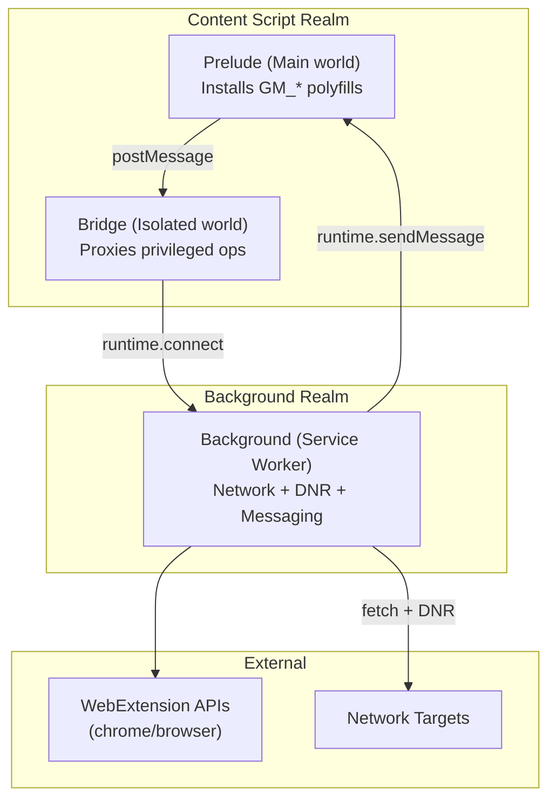
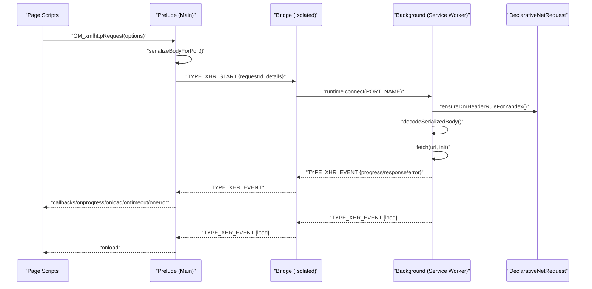
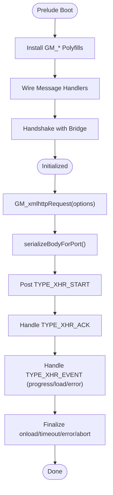
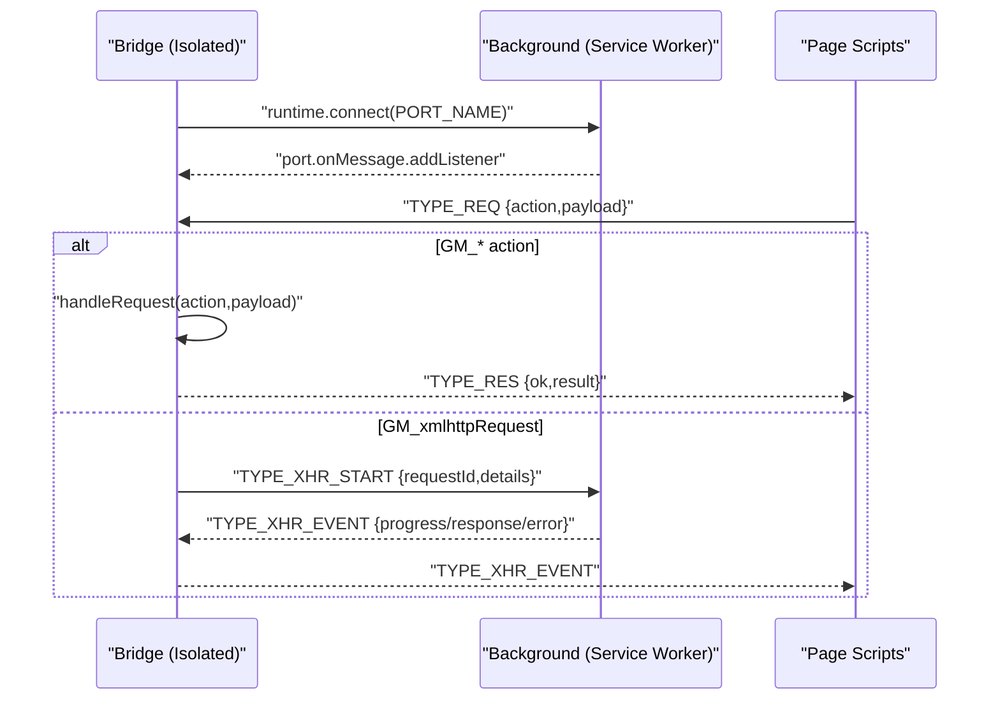
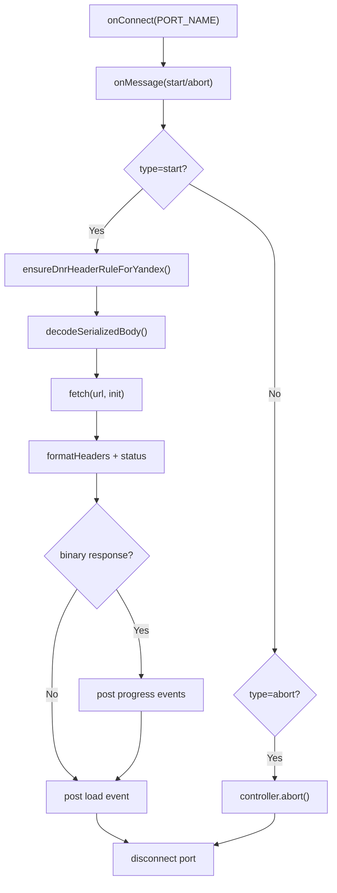
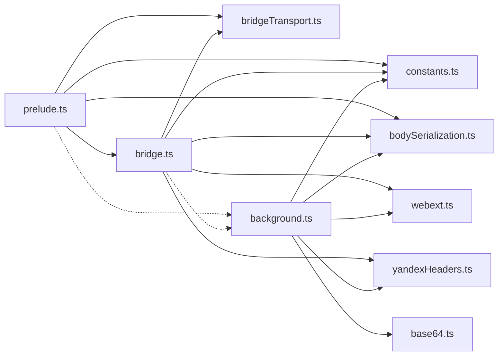

# Extension Framework

<cite>
**Referenced Files in This Document**
- [bridge.ts](file://src/extension/bridge.ts)
- [bridgeTransport.ts](file://src/extension/bridgeTransport.ts)
- [background.ts](file://src/extension/background.ts)
- [webext.ts](file://src/extension/webext.ts)
- [prelude.ts](file://src/extension/prelude.ts)
- [constants.ts](file://src/extension/constants.ts)
- [bodySerialization.ts](file://src/extension/bodySerialization.ts)
- [yandexHeaders.ts](file://src/extension/yandexHeaders.ts)
- [base64.ts](file://src/extension/base64.ts)
- [bootState.ts](file://src/bootstrap/bootState.ts)
- [runtimeActivation.ts](file://src/bootstrap/runtimeActivation.ts)
- [index.ts](file://src/index.ts)
</cite>

## Table of Contents
1. [Introduction](#introduction)
2. [Project Structure](#project-structure)
3. [Core Components](#core-components)
4. [Architecture Overview](#architecture-overview)
5. [Detailed Component Analysis](#detailed-component-analysis)
6. [Dependency Analysis](#dependency-analysis)
7. [Performance Considerations](#performance-considerations)
8. [Security Considerations](#security-considerations)
9. [Troubleshooting Guide](#troubleshooting-guide)
10. [Conclusion](#conclusion)
11. [Appendices](#appendices)

## Introduction
This document describes the browser extension framework that powers cross-browser compatibility for Chrome and Firefox. It focuses on the extension bridge system enabling GM_* polyfills and GM_xmlhttpRequest, the background script architecture for service worker-based operations, the web extension abstraction layer, the prelude system for initialization and environment detection, and the transport mechanisms for message passing and data serialization. It also covers security considerations, performance optimization strategies, and debugging approaches for extension development.

## Project Structure
The extension framework is organized around three main realms:
- Preload/Main world script (prelude) that installs GM_* polyfills and communicates with the bridge.
- Isolated world script (bridge) that proxies privileged operations to the background service worker.
- Background service worker (background) that performs network requests, manages declarativeNetRequest rules, and relays events back to the bridge.

**Diagram sources**
- [prelude.ts:288-478](file://src/extension/prelude.ts#L288-L478)
- [bridge.ts:647-698](file://src/extension/bridge.ts#L647-L698)
- [background.ts:487-533](file://src/extension/background.ts#L487-L533)

**Section sources**
- [prelude.ts:46-53](file://src/extension/prelude.ts#L46-L53)
- [bridge.ts:28-40](file://src/extension/bridge.ts#L28-L40)
- [background.ts:1-11](file://src/extension/background.ts#L1-L11)

## Core Components
- WebExtension Abstraction Layer: Normalizes Chrome (callback-based) and Firefox (Promise-based) APIs for unified usage across the codebase.
- Prelude: Installs GM_* polyfills in the MAIN world, wires message handlers, and manages GM_xmlhttpRequest promises and timeouts.
- Bridge: Runs in an isolated world, validates messages, serializes bodies, and coordinates XHR requests via a named port to the background.
- Background: Receives XHR requests, applies DNR header rules, executes fetch(), streams binary responses, and posts events back to the bridge.
- Transport Utilities: Message marking, transferable extraction, and base64 encoding/decoding for binary payloads.
- Serialization Utilities: Robust serialization/deserialization of request bodies across worlds and types.
- Yandex Header Helpers: Normalize and filter headers for specific endpoints requiring strict UA-CH compliance.

**Section sources**
- [webext.ts:1-187](file://src/extension/webext.ts#L1-L187)
- [prelude.ts:288-478](file://src/extension/prelude.ts#L288-L478)
- [bridge.ts:335-561](file://src/extension/bridge.ts#L335-L561)
- [background.ts:535-756](file://src/extension/background.ts#L535-L756)
- [bridgeTransport.ts:1-46](file://src/extension/bridgeTransport.ts#L1-L46)
- [bodySerialization.ts:1-570](file://src/extension/bodySerialization.ts#L1-L570)
- [yandexHeaders.ts:1-56](file://src/extension/yandexHeaders.ts#L1-L56)

## Architecture Overview
The framework implements a layered architecture:
- Content script polyfills (prelude) expose a userscript-like API surface to page scripts.
- The bridge mediates between page scripts and the background service worker using a dedicated port name.
- The background service worker performs privileged operations (networking, notifications, DNR) and streams events back to the bridge.
- The transport layer ensures safe message passing and binary payload handling.

**Diagram sources**
- [prelude.ts:309-379](file://src/extension/prelude.ts#L309-L379)
- [bridge.ts:335-561](file://src/extension/bridge.ts#L335-L561)
- [background.ts:535-756](file://src/extension/background.ts#L535-L756)
- [yandexHeaders.ts:193-262](file://src/extension/yandexHeaders.ts#L193-L262)

## Detailed Component Analysis

### WebExtension Abstraction Layer
Purpose:
- Provide a unified interface to WebExtension APIs regardless of browser (Chrome vs Firefox).
- Normalize callback-based vs Promise-based semantics behind a single async interface.

Key behaviors:
- Detects browser namespace and routes calls accordingly.
- Wraps runtime.lastError handling for Chromium.
- Exposes convenience functions for storage, notifications, tabs/windows updates.

Implementation highlights:
- Namespace detection and fallback to chrome when browser is unavailable.
- Async wrapper that converts callback-style APIs to Promise-based calls.
- Safe calls to optional APIs (e.g., notifications) with graceful degradation.

**Section sources**
- [webext.ts:56-101](file://src/extension/webext.ts#L56-L101)
- [webext.ts:103-135](file://src/extension/webext.ts#L103-L135)
- [webext.ts:137-186](file://src/extension/webext.ts#L137-L186)

### Prelude System (Initialization and Polyfills)
Purpose:
- Install GM_* polyfills in the MAIN world.
- Wire message handlers for bridge responses and XHR events.
- Manage GM_xmlhttpRequest promises, timeouts, and callback forwarding.

Key behaviors:
- Installs GM_notification, GM_addStyle, GM_xmlhttpRequest, and GM (promise-based) APIs.
- Serializes request bodies before crossing into the isolated bridge.
- Tracks XHR callbacks and timeouts; emits fallback watchdog events.
- Performs a handshake to enrich GM_info with manifest metadata.

Implementation highlights:
- Message filtering via a shared marker and type guards.
- Promise-based request/response plumbing with timeouts.
- Robust XHR event routing and settlement handling.

**Diagram sources**
- [prelude.ts:619-640](file://src/extension/prelude.ts#L619-L640)
- [prelude.ts:309-379](file://src/extension/prelude.ts#L309-L379)
- [prelude.ts:480-611](file://src/extension/prelude.ts#L480-L611)

**Section sources**
- [prelude.ts:288-478](file://src/extension/prelude.ts#L288-L478)
- [prelude.ts:480-611](file://src/extension/prelude.ts#L480-L611)
- [prelude.ts:619-640](file://src/extension/prelude.ts#L619-L640)

### Bridge System (Isolated World)
Purpose:
- Validate and route messages from the MAIN world to the background service worker.
- Proxy privileged operations (GM storage, notifications) and GM_xmlhttpRequest.
- Serialize bodies and manage binary response handling.

Key behaviors:
- Validates messages using a shared marker and type guards.
- Handles GM_* requests (getValue/setValue/deleteValue/listValues/getValues).
- Proxies GM_notification to background for privileged display.
- Manages GM_xmlhttpRequest lifecycle: start, progress, load, error, abort.
- Applies UA-CH header normalization for specific endpoints and merges headers.

Implementation highlights:
- Port-based communication with a dedicated name.
- Binary response handling via base64 decoding and ArrayBuffer reconstruction.
- Robust error handling and port lifecycle management.

**Diagram sources**
- [bridge.ts:365-390](file://src/extension/bridge.ts#L365-L390)
- [bridge.ts:580-625](file://src/extension/bridge.ts#L580-L625)
- [bridge.ts:671-682](file://src/extension/bridge.ts#L671-L682)

**Section sources**
- [bridge.ts:647-698](file://src/extension/bridge.ts#L647-L698)
- [bridge.ts:335-561](file://src/extension/bridge.ts#L335-L561)
- [bridge.ts:580-625](file://src/extension/bridge.ts#L580-L625)

### Background Script (Service Worker)
Purpose:
- Execute privileged operations on behalf of the bridge.
- Apply DNR header rules for endpoints sensitive to forbidden headers.
- Stream binary responses efficiently and post events back to the bridge.

Key behaviors:
- Listens for connections on a named port and manages request lifecycle.
- Applies DNR rules for Yandex, YouTubei, and Googlevideo endpoints.
- Decodes serialized bodies and preserves Protobuf payloads.
- Streams binary responses and posts progress/load/error events.
- Handles timeouts and aborts gracefully.

Implementation highlights:
- Session rule updates serialized and queued to prevent races.
- Binary response handling with base64 fallback and Blob reconstruction.
- Strict header filtering for forbidden headers and UA-CH normalization.

**Diagram sources**
- [background.ts:487-533](file://src/extension/background.ts#L487-L533)
- [background.ts:535-756](file://src/extension/background.ts#L535-L756)
- [background.ts:193-262](file://src/extension/background.ts#L193-L262)

**Section sources**
- [background.ts:487-533](file://src/extension/background.ts#L487-L533)
- [background.ts:535-756](file://src/extension/background.ts#L535-L756)
- [background.ts:193-262](file://src/extension/background.ts#L193-L262)

### Transport and Serialization Utilities
Purpose:
- Ensure safe message passing and binary payload handling across worlds.
- Provide robust serialization/deserialization for request bodies.

Key behaviors:
- Mark messages with a shared marker to distinguish bridge traffic.
- Extract transferables for efficient ArrayBuffer movement.
- Serialize bodies to base64 envelopes and reconstruct on the other side.
- Handle cross-compartment and cross-world type coercion.

Implementation highlights:
- Transferable extraction for progress and response payloads.
- Envelope-based serialization preserving MIME and kind.
- Coercion strategies for Blob/ArrayBuffer/TypedArray/plain objects.

**Section sources**
- [bridgeTransport.ts:27-45](file://src/extension/bridgeTransport.ts#L27-L45)
- [bodySerialization.ts:16-570](file://src/extension/bodySerialization.ts#L16-L570)
- [base64.ts:110-127](file://src/extension/base64.ts#L110-L127)

### Yandex Header Normalization
Purpose:
- Ensure requests to specific endpoints appear as legitimate Chromium tabs.
- Strip forbidden headers and inject minimal required UA-CH headers.

Key behaviors:
- Detect Yandex API hostnames and normalize UA-CH headers.
- Filter headers forbidden for fetch/XHR and apply DNR rules.
- Maintain a cache of UA-CH headers with TTL.

**Section sources**
- [yandexHeaders.ts:1-56](file://src/extension/yandexHeaders.ts#L1-L56)
- [bridge.ts:489-503](file://src/extension/bridge.ts#L489-L503)
- [background.ts:193-262](file://src/extension/background.ts#L193-L262)

### Extension Initialization and Environment Detection
Purpose:
- Coordinate runtime activation and bootstrap state across the app.
- Initialize localization, authentication, and iframe interactor.

Key behaviors:
- Track bootstrap state with status transitions and a shared promise.
- Activate runtime once, initializing auth or localization depending on origin.
- Bind iframe interactor once to coordinate cross-frame communication.

**Section sources**
- [bootState.ts:26-41](file://src/bootstrap/bootState.ts#L26-L41)
- [runtimeActivation.ts:20-58](file://src/bootstrap/runtimeActivation.ts#L20-L58)
- [index.ts:1-120](file://src/index.ts#L1-L120)

## Dependency Analysis
The framework exhibits low coupling between realms and high cohesion within each component. Dependencies flow from page scripts through the prelude and bridge into the background service worker.

**Diagram sources**
- [prelude.ts:1-20](file://src/extension/prelude.ts#L1-L20)
- [bridge.ts:1-25](file://src/extension/bridge.ts#L1-L25)
- [background.ts:1-34](file://src/extension/background.ts#L1-L34)
- [constants.ts:1-30](file://src/extension/constants.ts#L1-L30)
- [bridgeTransport.ts:1-5](file://src/extension/bridgeTransport.ts#L1-L5)
- [bodySerialization.ts:1-10](file://src/extension/bodySerialization.ts#L1-L10)
- [base64.ts:1-10](file://src/extension/base64.ts#L1-L10)
- [webext.ts:1-10](file://src/extension/webext.ts#L1-L10)
- [yandexHeaders.ts:1-10](file://src/extension/yandexHeaders.ts#L1-L10)

**Section sources**
- [prelude.ts:1-20](file://src/extension/prelude.ts#L1-L20)
- [bridge.ts:1-25](file://src/extension/bridge.ts#L1-L25)
- [background.ts:1-34](file://src/extension/background.ts#L1-L34)

## Performance Considerations
- Binary streaming: Large binary responses are streamed via progress events to avoid memory spikes. Responses exceeding a threshold are handled as streams to minimize memory usage.
- Transferable objects: Transferables are extracted and used to move ArrayBuffers efficiently across message boundaries.
- Body serialization: Bodies are serialized to base64 envelopes to preserve types and MIME, reducing cross-world coercion overhead.
- DNR rule batching: Session rule updates are queued to prevent race conditions and redundant updates.
- Timeout safeguards: Both prelude and background enforce timeouts to avoid hanging requests and ports.

[No sources needed since this section provides general guidance]

## Security Considerations
- Forbidden headers: Requests containing forbidden headers (e.g., Sec-*, User-Agent) are filtered and re-applied via DNR rules rather than fetch/XHR to satisfy endpoint requirements.
- UA-CH normalization: UA-CH headers are normalized and minimized to match a known-good request capture for specific endpoints.
- Cross-world isolation: The bridge runs in an isolated world to prevent direct access to privileged APIs from page scripts.
- Notification sanitization: Non-serializable fields (e.g., callbacks) are stripped before posting notifications to the bridge.
- Error containment: Errors are caught and reported back to the page only for request types that support responses, preventing information leakage.

**Section sources**
- [background.ts:141-151](file://src/extension/background.ts#L141-L151)
- [background.ts:193-262](file://src/extension/background.ts#L193-L262)
- [bridge.ts:489-503](file://src/extension/bridge.ts#L489-L503)
- [prelude.ts:70-80](file://src/extension/prelude.ts#L70-L80)

## Troubleshooting Guide
Common issues and remedies:
- Bridge not responding: Verify the bridge is initialized and listening for messages. Check handshake and request timeouts.
- GM_xmlhttpRequest hangs: Inspect XHR acknowledgment and fallback watchdog logs. Confirm request ID uniqueness and timeout configuration.
- Binary response anomalies: Ensure base64 envelopes and transferables are handled correctly. Validate MIME types for Blob reconstruction.
- DNR rule conflicts: Review session rule signatures and priorities. Ensure only one rule is applied per target endpoint.
- UA-CH mismatch: Confirm UA-CH headers are cached and merged appropriately for Yandex endpoints.

**Section sources**
- [prelude.ts:91-110](file://src/extension/prelude.ts#L91-L110)
- [prelude.ts:167-211](file://src/extension/prelude.ts#L167-L211)
- [bridge.ts:335-561](file://src/extension/bridge.ts#L335-L561)
- [background.ts:168-191](file://src/extension/background.ts#L168-L191)
- [background.ts:193-262](file://src/extension/background.ts#L193-L262)

## Conclusion
The extension framework provides a robust, cross-browser compatible foundation for GM_* polyfills and GM_xmlhttpRequest. By isolating privileged operations in the background service worker and normalizing browser differences through a thin abstraction layer, it achieves a unified API surface while maintaining security and performance. The transport and serialization utilities ensure reliable cross-world communication, and the DNR-based header management addresses endpoint-specific requirements.

[No sources needed since this section summarizes without analyzing specific files]

## Appendices

### API Surface and Message Types
- Request/Response: TYPE_REQ/TYPE_RES
- XHR: TYPE_XHR_START, TYPE_XHR_ABORT, TYPE_XHR_ACK, TYPE_XHR_EVENT
- Notifications: TYPE_NOTIFY
- Port name: "vot_gm_xhr"

**Section sources**
- [constants.ts:15-101](file://src/extension/constants.ts#L15-L101)

### Implementation Examples
- GM_xmlhttpRequest promise-based usage: See promise wrapper and abortable pattern in the prelude.
- GM storage polyfill usage: See GM.getValue/GM.setValue in the prelude and bridge request handling.
- Notification polyfill usage: See GM.notification and sanitized details handling.

**Section sources**
- [prelude.ts:394-466](file://src/extension/prelude.ts#L394-L466)
- [bridge.ts:580-625](file://src/extension/bridge.ts#L580-L625)
- [prelude.ts:288-308](file://src/extension/prelude.ts#L288-L308)