# Integration Architecture

<cite>
**Referenced Files in This Document**
- [config.ts](file://src/config/config.ts)
- [cacheManager.ts](file://src/core/cacheManager.ts)
- [types/core/cacheManager.ts](file://src/types/core/cacheManager.ts)
- [translateApis.ts](file://src/utils/translateApis.ts)
- [yandexHeaders.ts](file://src/extension/yandexHeaders.ts)
- [translationOrchestrator.ts](file://src/core/translationOrchestrator.ts)
- [translationHandler.ts](file://src/core/translationHandler.ts)
- [modules/translation.ts](file://src/videoHandler/modules/translation.ts)
- [modules/proxyShared.ts](file://src/videoHandler/modules/proxyShared.ts)
- [audioDownloader/index.ts](file://src/audioDownloader/index.ts)
- [utils/storage.ts](file://src/utils/storage.ts)
- [types/storage.ts](file://src/types/storage.ts)
- [utils/gm.ts](file://src/utils/gm.ts)
- [core/hostPolicies.ts](file://src/core/hostPolicies.ts)
</cite>

## Table of Contents
1. [Introduction](#introduction)
2. [Project Structure](#project-structure)
3. [Core Components](#core-components)
4. [Architecture Overview](#architecture-overview)
5. [Detailed Component Analysis](#detailed-component-analysis)
6. [Dependency Analysis](#dependency-analysis)
7. [Performance Considerations](#performance-considerations)
8. [Troubleshooting Guide](#troubleshooting-guide)
9. [Conclusion](#conclusion)
10. [Appendices](#appendices)

## Introduction
This document explains the integration architecture connecting English Teacher with external services and APIs. It covers:
- Translation service integration (VOT client, Yandex API, and FOSWLY/MS Edge/Yandex Browser translation backends)
- Audio processing service coordination (YouTube audio downloads and uploads)
- Configuration management (environment-specific endpoints, feature flags)
- Caching strategy for translation results and subtitles
- Error handling and retry mechanisms
- Proxy and worker architecture for audio delivery
- Platform adaptation for different video hosts
- Scalability, rate limiting, and fallback strategies

## Project Structure
The integration spans several modules:
- Configuration and environment endpoints
- Translation orchestration and handler
- Audio downloader and uploader
- Proxy and worker routing for Yandex audio/subtitles
- Storage and settings management
- Cross-cutting utilities for HTTP, headers, and policies

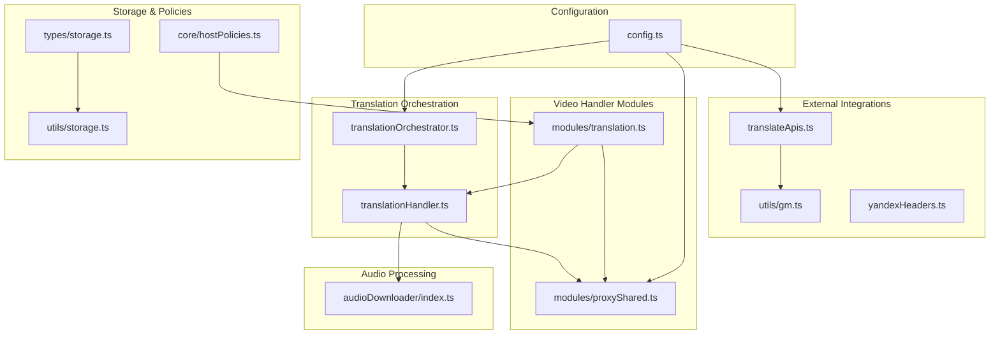

**Diagram sources**
- [config.ts:1-63](file://src/config/config.ts#L1-L63)
- [translationOrchestrator.ts:1-85](file://src/core/translationOrchestrator.ts#L1-L85)
- [translationHandler.ts:1-564](file://src/core/translationHandler.ts#L1-L564)
- [modules/translation.ts:1-800](file://src/videoHandler/modules/translation.ts#L1-L800)
- [modules/proxyShared.ts:1-90](file://src/videoHandler/modules/proxyShared.ts#L1-L90)
- [audioDownloader/index.ts:1-189](file://src/audioDownloader/index.ts#L1-L189)
- [translateApis.ts:1-207](file://src/utils/translateApis.ts#L1-L207)
- [utils/gm.ts:1-248](file://src/utils/gm.ts#L1-L248)
- [yandexHeaders.ts:1-56](file://src/extension/yandexHeaders.ts#L1-L56)
- [utils/storage.ts:1-380](file://src/utils/storage.ts#L1-L380)
- [types/storage.ts:1-135](file://src/types/storage.ts#L1-L135)
- [core/hostPolicies.ts:1-34](file://src/core/hostPolicies.ts#L1-L34)

**Section sources**
- [config.ts:1-63](file://src/config/config.ts#L1-L63)
- [translationOrchestrator.ts:1-85](file://src/core/translationOrchestrator.ts#L1-L85)
- [translationHandler.ts:1-564](file://src/core/translationHandler.ts#L1-L564)
- [modules/translation.ts:1-800](file://src/videoHandler/modules/translation.ts#L1-L800)
- [modules/proxyShared.ts:1-90](file://src/videoHandler/modules/proxyShared.ts#L1-L90)
- [audioDownloader/index.ts:1-189](file://src/audioDownloader/index.ts#L1-L189)
- [translateApis.ts:1-207](file://src/utils/translateApis.ts#L1-L207)
- [utils/gm.ts:1-248](file://src/utils/gm.ts#L1-L248)
- [yandexHeaders.ts:1-56](file://src/extension/yandexHeaders.ts#L1-L56)
- [utils/storage.ts:1-380](file://src/utils/storage.ts#L1-L380)
- [types/storage.ts:1-135](file://src/types/storage.ts#L1-L135)
- [core/hostPolicies.ts:1-34](file://src/core/hostPolicies.ts#L1-L34)

## Core Components
- Configuration module defines endpoints for VOT backend, translation backends, proxy/worker hosts, and defaults.
- Translation orchestration coordinates auto-translation eligibility and deferral (e.g., muted mobile YouTube).
- Translation handler manages VOT client requests, audio upload flows, and retry/backoff logic.
- Video handler modules apply translation, manage proxy routing, validate audio URLs, and refresh translations.
- Audio downloader streams and uploads audio to VOT for synthesized voice generation.
- Translation APIs abstract FOSWLY and Rust-based detection services with caching and error handling.
- Storage and policies persist settings, adapt to platform differences, and route network traffic appropriately.

**Section sources**
- [config.ts:1-63](file://src/config/config.ts#L1-L63)
- [translationOrchestrator.ts:1-85](file://src/core/translationOrchestrator.ts#L1-L85)
- [translationHandler.ts:1-564](file://src/core/translationHandler.ts#L1-L564)
- [modules/translation.ts:1-800](file://src/videoHandler/modules/translation.ts#L1-L800)
- [audioDownloader/index.ts:1-189](file://src/audioDownloader/index.ts#L1-L189)
- [translateApis.ts:1-207](file://src/utils/translateApis.ts#L1-L207)
- [utils/storage.ts:1-380](file://src/utils/storage.ts#L1-L380)
- [core/hostPolicies.ts:1-34](file://src/core/hostPolicies.ts#L1-L34)

## Architecture Overview
The system integrates three primary external services:
- VOT client for orchestrating translation requests and receiving audio URLs
- Translation backends (FOSWLY with Yandex Browser/MS Edge providers, plus Rust-based detection)
- Yandex audio delivery with optional proxy/worker routing

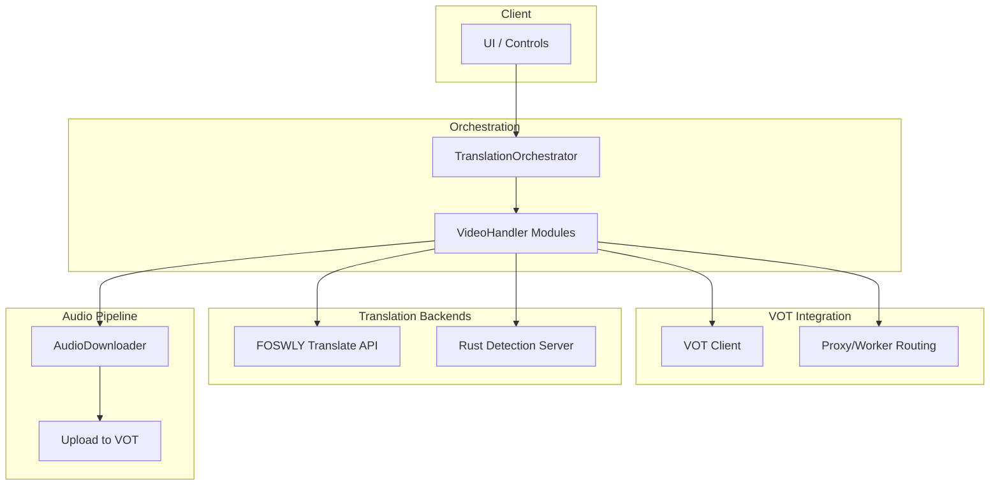

**Diagram sources**
- [translationOrchestrator.ts:1-85](file://src/core/translationOrchestrator.ts#L1-L85)
- [modules/translation.ts:1-800](file://src/videoHandler/modules/translation.ts#L1-L800)
- [modules/proxyShared.ts:1-90](file://src/videoHandler/modules/proxyShared.ts#L1-L90)
- [audioDownloader/index.ts:1-189](file://src/audioDownloader/index.ts#L1-L189)
- [translateApis.ts:1-207](file://src/utils/translateApis.ts#L1-L207)

## Detailed Component Analysis

### Translation Orchestration
Responsibilities:
- Determine eligibility for auto-translation (first play, enabled flag, video ID present)
- Defer execution on mobile YouTube when muted, re-triggering on unmute
- Run scheduled translation and propagate errors to UI

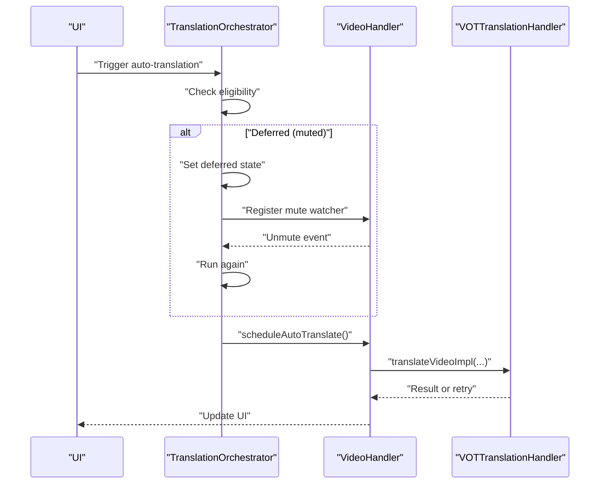

**Diagram sources**
- [translationOrchestrator.ts:42-83](file://src/core/translationOrchestrator.ts#L42-L83)
- [translationHandler.ts:311-495](file://src/core/translationHandler.ts#L311-L495)

**Section sources**
- [translationOrchestrator.ts:1-85](file://src/core/translationOrchestrator.ts#L1-L85)
- [translationHandler.ts:1-564](file://src/core/translationHandler.ts#L1-L564)

### VOT Client Integration and Retry Logic
Responsibilities:
- Request translation with optional lively voice
- Handle “lively voice unavailable” server responses by falling back
- Upload audio (full or partial) to VOT
- Poll and retry translation status with exponential-style delays
- Map known VOT client errors to localized UI messages

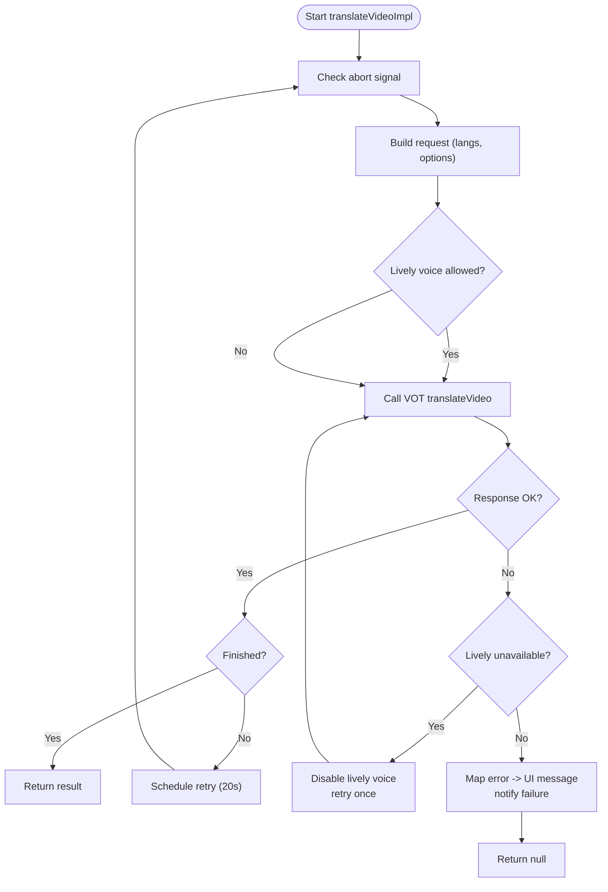

**Diagram sources**
- [translationHandler.ts:311-495](file://src/core/translationHandler.ts#L311-L495)

**Section sources**
- [translationHandler.ts:1-564](file://src/core/translationHandler.ts#L1-L564)

### Audio Processing Service Coordination
Responsibilities:
- Detect when audio upload is required (e.g., YouTube)
- Stream audio via chosen strategy, emit partial/full chunks
- Upload chunks to VOT with metadata (fileId, parts count, version)
- Fallback to fail-audio-js endpoint for YouTube when appropriate

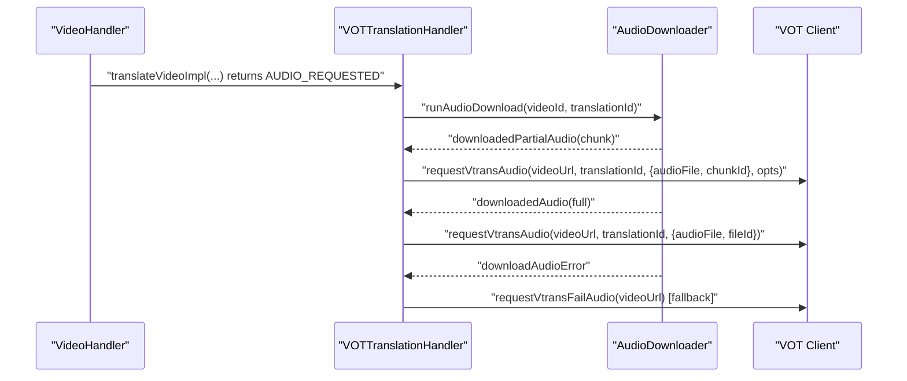

**Diagram sources**
- [translationHandler.ts:126-234](file://src/core/translationHandler.ts#L126-L234)
- [audioDownloader/index.ts:28-85](file://src/audioDownloader/index.ts#L28-L85)

**Section sources**
- [translationHandler.ts:1-564](file://src/core/translationHandler.ts#L1-L564)
- [audioDownloader/index.ts:1-189](file://src/audioDownloader/index.ts#L1-L189)

### Translation Backend Integration (FOSWLY and Detection)
Responsibilities:
- Choose translation/detection provider based on settings
- Cache provider selection for short periods to avoid frequent storage reads
- Wrap FOSWLY API with error normalization and timeouts
- Detect language via FOSWLY or Rust server

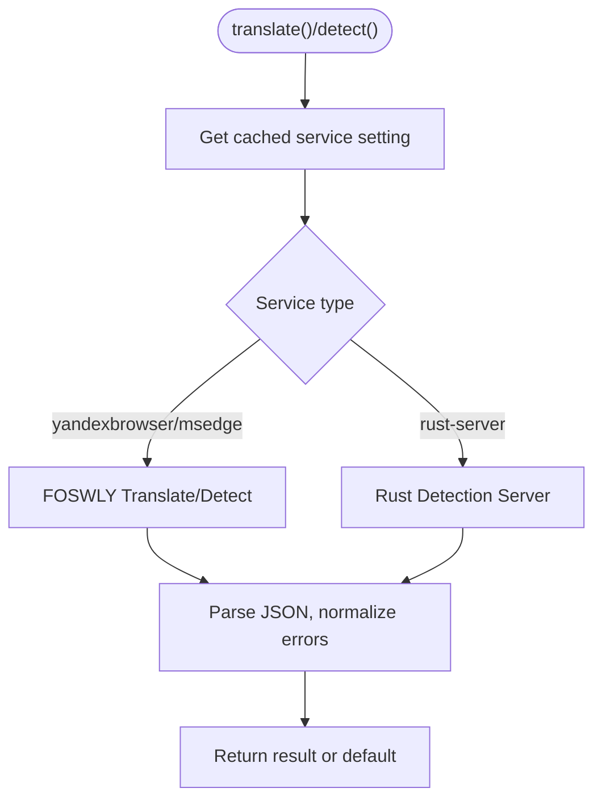

**Diagram sources**
- [translateApis.ts:167-197](file://src/utils/translateApis.ts#L167-L197)
- [translateApis.ts:66-144](file://src/utils/translateApis.ts#L66-L144)
- [translateApis.ts:146-165](file://src/utils/translateApis.ts#L146-L165)

**Section sources**
- [translateApis.ts:1-207](file://src/utils/translateApis.ts#L1-L207)

### Proxy and Worker Architecture
Responsibilities:
- Route Yandex audio/subtitle URLs through a configurable proxy/worker host
- Detect whether a URL is a proxified Yandex asset
- Normalize headers for Yandex API compatibility

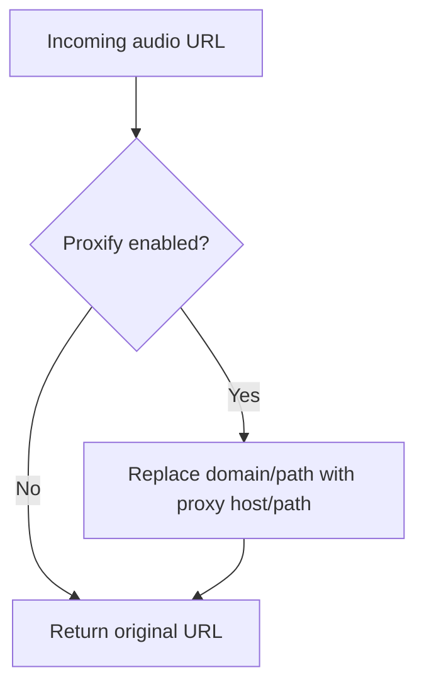

**Diagram sources**
- [modules/proxyShared.ts:24-39](file://src/videoHandler/modules/proxyShared.ts#L24-L39)
- [modules/proxyShared.ts:62-74](file://src/videoHandler/modules/proxyShared.ts#L62-L74)
- [yandexHeaders.ts:29-55](file://src/extension/yandexHeaders.ts#L29-L55)

**Section sources**
- [modules/proxyShared.ts:1-90](file://src/videoHandler/modules/proxyShared.ts#L1-L90)
- [yandexHeaders.ts:1-56](file://src/extension/yandexHeaders.ts#L1-L56)

### Configuration Management
Responsibilities:
- Centralize endpoints and defaults (VOT backend, translation backends, proxies, workers)
- Expose feature flags and environment-specific settings
- Provide compatibility versioning for storage migrations

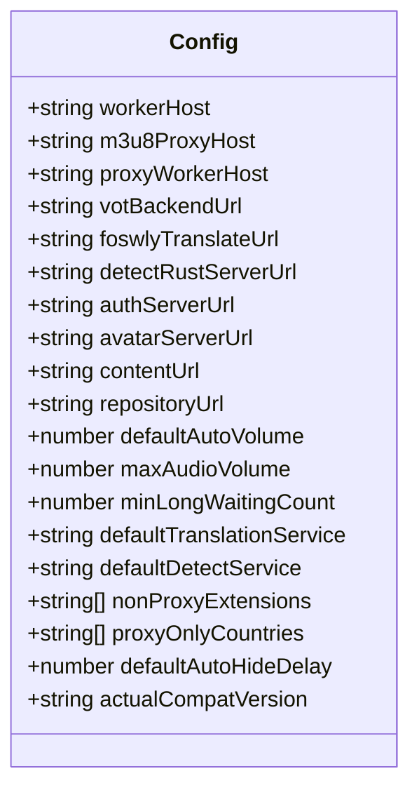

**Diagram sources**
- [config.ts:1-63](file://src/config/config.ts#L1-L63)

**Section sources**
- [config.ts:1-63](file://src/config/config.ts#L1-L63)
- [utils/storage.ts:139-190](file://src/utils/storage.ts#L139-L190)

### Caching Strategy
Responsibilities:
- In-memory cache with TTL for translation results and subtitles
- Clear cache on proxy/host changes to prevent stale URLs
- Refresh translations before expiration to maintain playback continuity

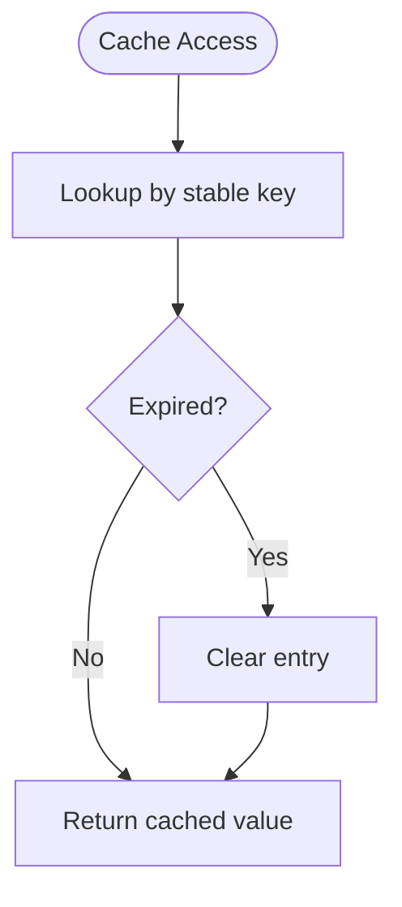

**Diagram sources**
- [cacheManager.ts:27-118](file://src/core/cacheManager.ts#L27-L118)
- [types/core/cacheManager.ts:1-21](file://src/types/core/cacheManager.ts#L1-L21)
- [modules/translation.ts:653-665](file://src/videoHandler/modules/translation.ts#L653-L665)

**Section sources**
- [cacheManager.ts:1-119](file://src/core/cacheManager.ts#L1-L119)
- [types/core/cacheManager.ts:1-21](file://src/types/core/cacheManager.ts#L1-L21)
- [modules/translation.ts:653-665](file://src/videoHandler/modules/translation.ts#L653-L665)

### Error Handling and Retry Mechanisms
Responsibilities:
- Abort-aware scheduling with micro-race protection
- Retry polling with fixed intervals
- Map VOT client errors to localized UI messages
- Graceful degradation and notifications on failure

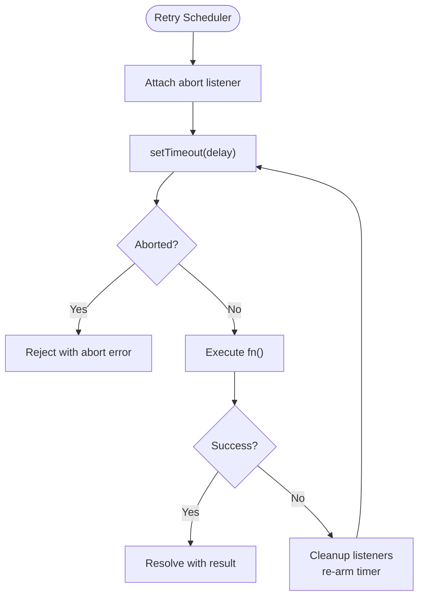

**Diagram sources**
- [translationHandler.ts:261-309](file://src/core/translationHandler.ts#L261-L309)

**Section sources**
- [translationHandler.ts:1-564](file://src/core/translationHandler.ts#L1-L564)

### Platform Adaptation and Host Policies
Responsibilities:
- Enable/disable external volume controls per host
- Restrict translation download to supported hosts
- Detect mobile vs desktop YouTube for behavior differences

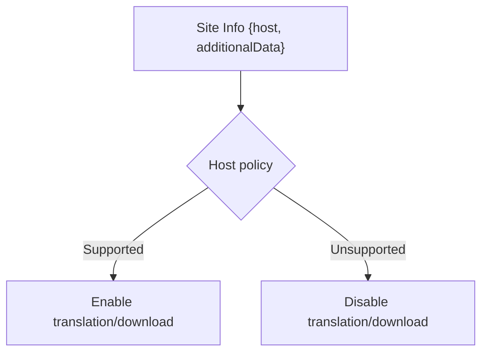

**Diagram sources**
- [core/hostPolicies.ts:1-34](file://src/core/hostPolicies.ts#L1-L34)
- [modules/translation.ts:117-122](file://src/videoHandler/modules/translation.ts#L117-L122)

**Section sources**
- [core/hostPolicies.ts:1-34](file://src/core/hostPolicies.ts#L1-L34)
- [modules/translation.ts:117-122](file://src/videoHandler/modules/translation.ts#L117-L122)

## Dependency Analysis
Key dependencies and coupling:
- Configuration module is consumed by translation, proxy, and storage modules
- Translation handler depends on audio downloader and VOT client
- Video handler modules depend on translation handler and proxy utilities
- Network layer abstracts GM_xmlhttpRequest and native fetch with fallback

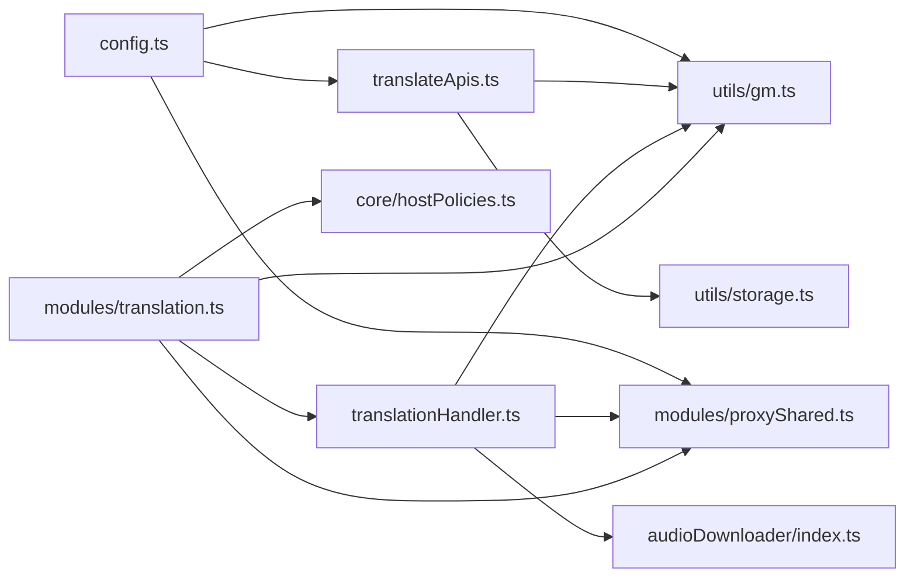

**Diagram sources**
- [config.ts:1-63](file://src/config/config.ts#L1-L63)
- [translateApis.ts:1-207](file://src/utils/translateApis.ts#L1-L207)
- [modules/proxyShared.ts:1-90](file://src/videoHandler/modules/proxyShared.ts#L1-L90)
- [utils/gm.ts:1-248](file://src/utils/gm.ts#L1-L248)
- [translationHandler.ts:1-564](file://src/core/translationHandler.ts#L1-L564)
- [audioDownloader/index.ts:1-189](file://src/audioDownloader/index.ts#L1-L189)
- [modules/translation.ts:1-800](file://src/videoHandler/modules/translation.ts#L1-L800)
- [utils/storage.ts:1-380](file://src/utils/storage.ts#L1-L380)
- [core/hostPolicies.ts:1-34](file://src/core/hostPolicies.ts#L1-L34)

**Section sources**
- [config.ts:1-63](file://src/config/config.ts#L1-L63)
- [translateApis.ts:1-207](file://src/utils/translateApis.ts#L1-L207)
- [modules/proxyShared.ts:1-90](file://src/videoHandler/modules/proxyShared.ts#L1-L90)
- [utils/gm.ts:1-248](file://src/utils/gm.ts#L1-L248)
- [translationHandler.ts:1-564](file://src/core/translationHandler.ts#L1-L564)
- [audioDownloader/index.ts:1-189](file://src/audioDownloader/index.ts#L1-L189)
- [modules/translation.ts:1-800](file://src/videoHandler/modules/translation.ts#L1-L800)
- [utils/storage.ts:1-380](file://src/utils/storage.ts#L1-L380)
- [core/hostPolicies.ts:1-34](file://src/core/hostPolicies.ts#L1-L34)

## Performance Considerations
- In-memory cache with TTL reduces redundant translation and subtitle requests
- Short-lived settings cache avoids repeated storage reads during retries
- Proactive translation refresh before TTL expiration minimizes playback interruptions
- Abort-aware scheduling prevents wasted work on stale actions
- Header filtering for Yandex API reduces unnecessary telemetry and improves compatibility

[No sources needed since this section provides general guidance]

## Troubleshooting Guide
Common issues and remedies:
- Translation stuck or delayed: Inspect retry scheduling and “lively voice unavailable” fallback
- Audio download failures: Verify YouTube audio availability and consider fail-audio-js fallback
- CORS or proxy errors: Use GM_xmlhttpRequest fallback and validate proxy host configuration
- Stale cache after proxy changes: Clear cache and reinitialize translation
- Localization of VOT client errors: Errors are mapped to localized UI messages for user feedback

**Section sources**
- [translationHandler.ts:261-309](file://src/core/translationHandler.ts#L261-L309)
- [translationHandler.ts:196-234](file://src/core/translationHandler.ts#L196-L234)
- [utils/gm.ts:211-247](file://src/utils/gm.ts#L211-L247)
- [modules/translation.ts:774-793](file://src/videoHandler/modules/translation.ts#L774-L793)
- [translationHandler.ts:68-98](file://src/core/translationHandler.ts#L68-L98)

## Conclusion
The integration architecture combines a robust translation orchestration layer, resilient retry mechanisms, and efficient caching to deliver reliable translation and audio experiences. It adapts to platform-specific constraints, routes Yandex assets through configurable proxies, and abstracts external service interactions behind a unified API. Configuration, storage, and policy modules ensure environment-specific behavior and smooth upgrades.

[No sources needed since this section summarizes without analyzing specific files]

## Appendices

### Configuration Options Reference
- Endpoint and feature flags:
  - VOT backend, translation backends, proxy/worker hosts, detection server
  - Default volumes, auto-hide delay, and compatibility version
- Storage keys:
  - Feature flags (auto-translate, auto-subtitles, proxy settings, services)
  - UI preferences (volume, subtitles, hotkeys)
  - Account and localization settings

**Section sources**
- [config.ts:1-63](file://src/config/config.ts#L1-L63)
- [types/storage.ts:18-62](file://src/types/storage.ts#L18-L62)
- [utils/storage.ts:139-190](file://src/utils/storage.ts#L139-L190)

### API Request/Response Handling Examples
- Translation request flow:
  - Build request with languages and options
  - Handle “lively voice unavailable” and retry without lively voice
  - Poll status and upload audio when required
- Audio upload flow:
  - Stream partial/full audio and upload to VOT
  - Fallback to fail-audio-js for YouTube when applicable
- Proxy routing:
  - Detect proxified Yandex URLs and route through configured worker host

**Section sources**
- [translationHandler.ts:311-495](file://src/core/translationHandler.ts#L311-L495)
- [audioDownloader/index.ts:28-85](file://src/audioDownloader/index.ts#L28-L85)
- [modules/proxyShared.ts:24-39](file://src/videoHandler/modules/proxyShared.ts#L24-L39)

### Integration Testing Approaches
- Unit test translation/detection service selection and caching
- Mock VOT client responses and simulate “lively voice unavailable”
- Validate proxy URL transformations and header filtering
- Test abort scenarios and retry scheduling under cancellation
- Verify storage migration logic and compatibility updates

[No sources needed since this section provides general guidance]