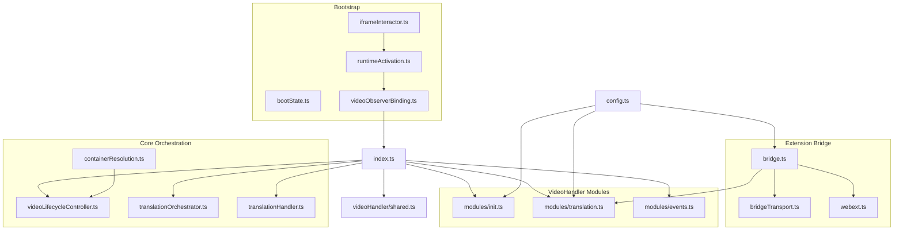
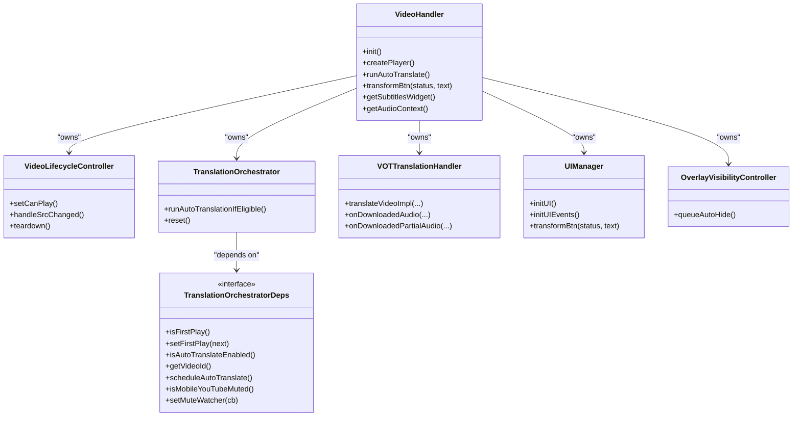
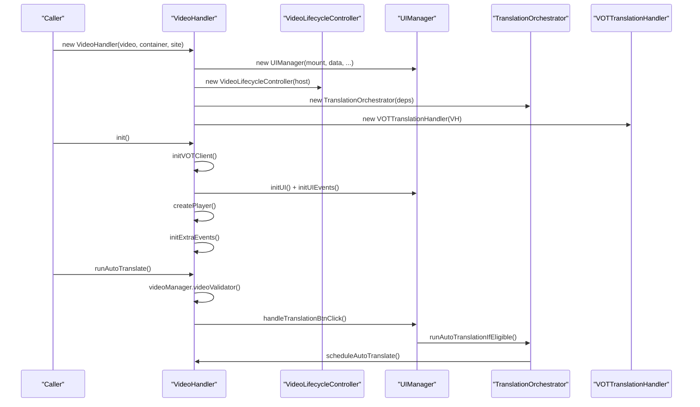
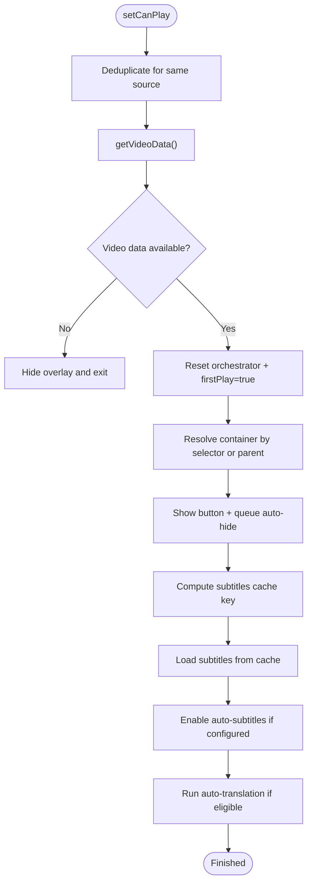
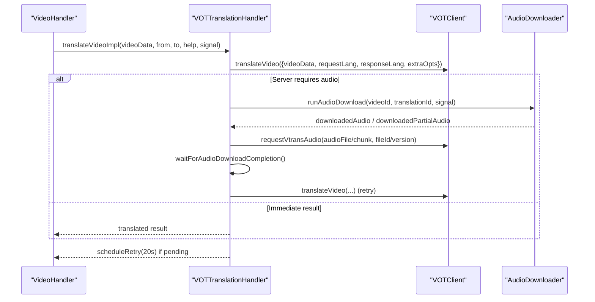
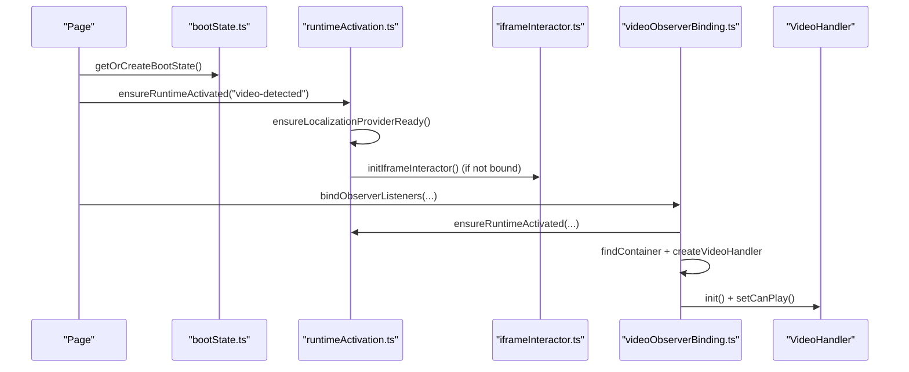
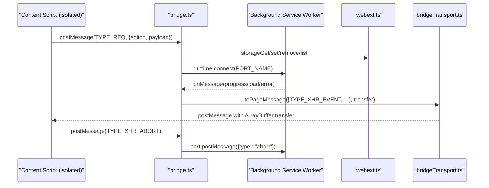
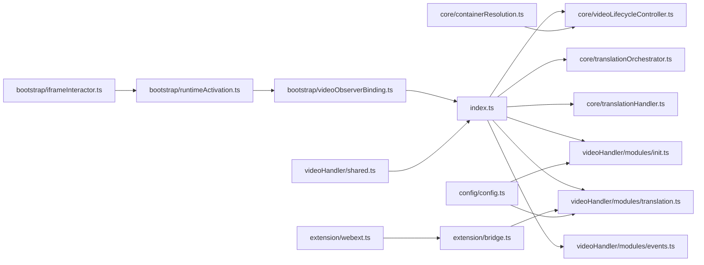

# System Architecture

<cite>
**Referenced Files in This Document**
- [src/index.ts](file://src/index.ts)
- [src/videoHandler/shared.ts](file://src/videoHandler/shared.ts)
- [src/bootstrap/bootState.ts](file://src/bootstrap/bootState.ts)
- [src/bootstrap/runtimeActivation.ts](file://src/bootstrap/runtimeActivation.ts)
- [src/bootstrap/iframeInteractor.ts](file://src/bootstrap/iframeInteractor.ts)
- [src/bootstrap/videoObserverBinding.ts](file://src/bootstrap/videoObserverBinding.ts)
- [src/core/containerResolution.ts](file://src/core/containerResolution.ts)
- [src/core/videoLifecycleController.ts](file://src/core/videoLifecycleController.ts)
- [src/core/translationOrchestrator.ts](file://src/core/translationOrchestrator.ts)
- [src/core/translationHandler.ts](file://src/core/translationHandler.ts)
- [src/extension/bridge.ts](file://src/extension/bridge.ts)
- [src/extension/bridgeTransport.ts](file://src/extension/bridgeTransport.ts)
- [src/extension/webext.ts](file://src/extension/webext.ts)
- [src/config/config.ts](file://src/config/config.ts)
- [src/videoHandler/modules/init.ts](file://src/videoHandler/modules/init.ts)
- [src/videoHandler/modules/translation.ts](file://src/videoHandler/modules/translation.ts)
- [src/videoHandler/modules/events.ts](file://src/videoHandler/modules/events.ts)
</cite>

## Table of Contents
1. [Introduction](#introduction)
2. [Project Structure](#project-structure)
3. [Core Components](#core-components)
4. [Architecture Overview](#architecture-overview)
5. [Detailed Component Analysis](#detailed-component-analysis)
6. [Dependency Analysis](#dependency-analysis)
7. [Performance Considerations](#performance-considerations)
8. [Troubleshooting Guide](#troubleshooting-guide)
9. [Conclusion](#conclusion)

## Introduction
This document describes the English Teacher system architecture as a modular monolith centered on the VideoHandler. It explains how the system orchestrates video lifecycle, UI, audio processing, and translation services, and how it ensures cross-browser compatibility through an extension bridge. The document covers bootstrap and initialization sequences, runtime activation, iframe interactor patterns, container resolution, dependency injection via constructor composition, and extension bridge patterns for cross-origin communication.

## Project Structure
The codebase is organized around a central orchestrator (VideoHandler) and a set of cohesive modules grouped by responsibility:
- Core orchestration and lifecycle: VideoLifecycleController, TranslationOrchestrator, TranslationHandler
- Bootstrap and initialization: Boot state, runtime activation, iframe interactor, video observer binding
- Extension bridge: Cross-world communication, storage, and privileged API access
- Configuration: Centralized service endpoints and defaults
- VideoHandler modules: Feature-specific submodules for initialization, translation, and UI events

**Diagram sources**
- [src/index.ts:114-520](file://src/index.ts#L114-L520)
- [src/bootstrap/bootState.ts:1-42](file://src/bootstrap/bootState.ts#L1-L42)
- [src/bootstrap/runtimeActivation.ts:1-59](file://src/bootstrap/runtimeActivation.ts#L1-L59)
- [src/bootstrap/iframeInteractor.ts:1-52](file://src/bootstrap/iframeInteractor.ts#L1-L52)
- [src/bootstrap/videoObserverBinding.ts:1-179](file://src/bootstrap/videoObserverBinding.ts#L1-L179)
- [src/core/containerResolution.ts:1-22](file://src/core/containerResolution.ts#L1-L22)
- [src/core/videoLifecycleController.ts:1-354](file://src/core/videoLifecycleController.ts#L1-L354)
- [src/core/translationOrchestrator.ts:1-85](file://src/core/translationOrchestrator.ts#L1-L85)
- [src/core/translationHandler.ts:1-564](file://src/core/translationHandler.ts#L1-L564)
- [src/extension/bridge.ts:1-699](file://src/extension/bridge.ts#L1-L699)
- [src/extension/bridgeTransport.ts:1-46](file://src/extension/bridgeTransport.ts#L1-L46)
- [src/extension/webext.ts:1-187](file://src/extension/webext.ts#L1-L187)
- [src/config/config.ts:1-63](file://src/config/config.ts#L1-L63)
- [src/videoHandler/modules/init.ts:1-166](file://src/videoHandler/modules/init.ts#L1-L166)
- [src/videoHandler/modules/translation.ts:75-88](file://src/videoHandler/modules/translation.ts#L75-L88)
- [src/videoHandler/modules/events.ts:58-64](file://src/videoHandler/modules/events.ts#L58-L64)
- [src/videoHandler/shared.ts:1-30](file://src/videoHandler/shared.ts#L1-L30)

**Section sources**
- [src/index.ts:114-520](file://src/index.ts#L114-L520)
- [src/bootstrap/bootState.ts:1-42](file://src/bootstrap/bootState.ts#L1-L42)
- [src/bootstrap/runtimeActivation.ts:1-59](file://src/bootstrap/runtimeActivation.ts#L1-L59)
- [src/bootstrap/iframeInteractor.ts:1-52](file://src/bootstrap/iframeInteractor.ts#L1-L52)
- [src/bootstrap/videoObserverBinding.ts:1-179](file://src/bootstrap/videoObserverBinding.ts#L1-L179)
- [src/core/containerResolution.ts:1-22](file://src/core/containerResolution.ts#L1-L22)
- [src/core/videoLifecycleController.ts:1-354](file://src/core/videoLifecycleController.ts#L1-L354)
- [src/core/translationOrchestrator.ts:1-85](file://src/core/translationOrchestrator.ts#L1-L85)
- [src/core/translationHandler.ts:1-564](file://src/core/translationHandler.ts#L1-L564)
- [src/extension/bridge.ts:1-699](file://src/extension/bridge.ts#L1-L699)
- [src/extension/bridgeTransport.ts:1-46](file://src/extension/bridgeTransport.ts#L1-L46)
- [src/extension/webext.ts:1-187](file://src/extension/webext.ts#L1-L187)
- [src/config/config.ts:1-63](file://src/config/config.ts#L1-L63)
- [src/videoHandler/modules/init.ts:1-166](file://src/videoHandler/modules/init.ts#L1-L166)
- [src/videoHandler/modules/translation.ts:75-88](file://src/videoHandler/modules/translation.ts#L75-L88)
- [src/videoHandler/modules/events.ts:58-64](file://src/videoHandler/modules/events.ts#L58-L64)
- [src/videoHandler/shared.ts:1-30](file://src/videoHandler/shared.ts#L1-L30)

## Core Components
- VideoHandler: Central orchestrator that composes managers and exposes a unified public API. It manages UI, lifecycle, translation, and video state, and delegates specialized tasks to dedicated managers.
- VideoLifecycleController: Coordinates video lifecycle transitions, container resolution, and UI overlays. It handles stale sessions, deduplicates setCanPlay triggers, and integrates auto-subtitles and auto-translation.
- TranslationOrchestrator: Manages auto-translation eligibility and state transitions, including deferral for muted mobile YouTube scenarios.
- VOTTranslationHandler: Implements translation workflow, including audio download, chunked uploads, and retry/backoff logic. It maps server errors to localized UI errors and coordinates with the VOT client.
- Extension Bridge: Provides isolated-world access to privileged WebExtension APIs (storage, runtime, notifications) and proxies GM_* operations and XHR through the background service worker.
- Bootstrap and Runtime Activation: Ensures localization readiness, iframe interactor initialization, and runtime activation for special origins.
- Container Resolution: Resolves the proper DOM container for UI overlays across shadow DOM boundaries.

**Section sources**
- [src/index.ts:114-520](file://src/index.ts#L114-L520)
- [src/core/videoLifecycleController.ts:54-354](file://src/core/videoLifecycleController.ts#L54-L354)
- [src/core/translationOrchestrator.ts:21-85](file://src/core/translationOrchestrator.ts#L21-L85)
- [src/core/translationHandler.ts:105-564](file://src/core/translationHandler.ts#L105-L564)
- [src/extension/bridge.ts:1-699](file://src/extension/bridge.ts#L1-L699)
- [src/bootstrap/runtimeActivation.ts:1-59](file://src/bootstrap/runtimeActivation.ts#L1-L59)
- [src/core/containerResolution.ts:1-22](file://src/core/containerResolution.ts#L1-L22)

## Architecture Overview
The system follows a modular monolith pattern with clear separation of concerns:
- VideoHandler acts as the central orchestrator, delegating to managers for UI, lifecycle, translation, and video operations.
- Bootstrap and initialization ensure runtime readiness and environment-specific adaptations (iframe interactor, localization).
- The extension bridge isolates privileged operations and mediates cross-origin communication between content script and background service worker.
- Configuration centralizes endpoints and defaults for translation, proxy, and UI behavior.

**Diagram sources**
- [src/index.ts:114-520](file://src/index.ts#L114-L520)
- [src/core/videoLifecycleController.ts:54-354](file://src/core/videoLifecycleController.ts#L54-L354)
- [src/core/translationOrchestrator.ts:21-85](file://src/core/translationOrchestrator.ts#L21-L85)
- [src/core/translationHandler.ts:105-564](file://src/core/translationHandler.ts#L105-L564)

## Detailed Component Analysis

### VideoHandler: Central Orchestrator
VideoHandler composes managers and exposes a unified API for UI, lifecycle, translation, and video operations. It initializes UI, mounts overlay portals, sets up event listeners, and coordinates translation and audio playback.

**Diagram sources**
- [src/index.ts:365-520](file://src/index.ts#L365-L520)
- [src/core/videoLifecycleController.ts:189-254](file://src/core/videoLifecycleController.ts#L189-L254)
- [src/core/translationOrchestrator.ts:42-83](file://src/core/translationOrchestrator.ts#L42-L83)

**Section sources**
- [src/index.ts:114-520](file://src/index.ts#L114-L520)

### Video Lifecycle Management
VideoLifecycleController manages lifecycle transitions, container resolution, and UI overlays. It deduplicates setCanPlay triggers, handles stale sessions, and integrates auto-subtitles and auto-translation.

**Diagram sources**
- [src/core/videoLifecycleController.ts:153-352](file://src/core/videoLifecycleController.ts#L153-L352)
- [src/core/containerResolution.ts:3-21](file://src/core/containerResolution.ts#L3-L21)

**Section sources**
- [src/core/videoLifecycleController.ts:54-354](file://src/core/videoLifecycleController.ts#L54-L354)
- [src/core/containerResolution.ts:1-22](file://src/core/containerResolution.ts#L1-L22)

### Translation Workflow and Audio Processing
VOTTranslationHandler implements the translation pipeline, including retry/backoff, audio download/upload, and error mapping. It coordinates with the VOT client and audio downloader.

**Diagram sources**
- [src/core/translationHandler.ts:311-495](file://src/core/translationHandler.ts#L311-L495)
- [src/core/translationHandler.ts:126-234](file://src/core/translationHandler.ts#L126-L234)

**Section sources**
- [src/core/translationHandler.ts:105-564](file://src/core/translationHandler.ts#L105-L564)

### Bootstrap and Initialization Sequence
The bootstrap sequence activates runtime, initializes iframe interactor, binds observers, and creates VideoHandler instances.

**Diagram sources**
- [src/bootstrap/bootState.ts:26-41](file://src/bootstrap/bootState.ts#L26-L41)
- [src/bootstrap/runtimeActivation.ts:20-58](file://src/bootstrap/runtimeActivation.ts#L20-L58)
- [src/bootstrap/iframeInteractor.ts:8-51](file://src/bootstrap/iframeInteractor.ts#L8-L51)
- [src/bootstrap/videoObserverBinding.ts:30-179](file://src/bootstrap/videoObserverBinding.ts#L30-L179)
- [src/index.ts:748-750](file://src/index.ts#L748-L750)

**Section sources**
- [src/bootstrap/bootState.ts:1-42](file://src/bootstrap/bootState.ts#L1-L42)
- [src/bootstrap/runtimeActivation.ts:1-59](file://src/bootstrap/runtimeActivation.ts#L1-L59)
- [src/bootstrap/iframeInteractor.ts:1-52](file://src/bootstrap/iframeInteractor.ts#L1-L52)
- [src/bootstrap/videoObserverBinding.ts:1-179](file://src/bootstrap/videoObserverBinding.ts#L1-L179)
- [src/index.ts:748-750](file://src/index.ts#L748-L750)

### Extension Bridge Pattern and Cross-Browser Compatibility
The extension bridge isolates privileged WebExtension APIs and mediates cross-origin communication between content script and background service worker. It provides GM_*-style APIs and proxies XHR with binary support and transferables.

**Diagram sources**
- [src/extension/bridge.ts:647-699](file://src/extension/bridge.ts#L647-L699)
- [src/extension/webext.ts:56-187](file://src/extension/webext.ts#L56-L187)
- [src/extension/bridgeTransport.ts:27-46](file://src/extension/bridgeTransport.ts#L27-L46)

**Section sources**
- [src/extension/bridge.ts:1-699](file://src/extension/bridge.ts#L1-L699)
- [src/extension/webext.ts:1-187](file://src/extension/webext.ts#L1-L187)
- [src/extension/bridgeTransport.ts:1-46](file://src/extension/bridgeTransport.ts#L1-L46)

### Dependency Injection and Service Location
VideoHandler uses constructor-based composition to instantiate managers and pass contextual dependencies. This pattern provides explicit service location and clear dependency boundaries.

- Managers are constructed with a host-like object or direct dependencies.
- TranslationOrchestrator depends on a small interface for eligibility checks and scheduling.
- VideoLifecycleController depends on a host interface for UI and lifecycle operations.

**Section sources**
- [src/index.ts:386-520](file://src/index.ts#L386-L520)
- [src/core/translationOrchestrator.ts:9-19](file://src/core/translationOrchestrator.ts#L9-L19)
- [src/core/videoLifecycleController.ts:21-52](file://src/core/videoLifecycleController.ts#L21-L52)

### Video Handler Modules and Public API
VideoHandler aggregates module exports to maintain a concise public API while keeping feature areas cohesive.

- Initialization: [src/videoHandler/modules/init.ts:47-166](file://src/videoHandler/modules/init.ts#L47-L166)
- Translation controls: [src/videoHandler/modules/translation.ts:75-88](file://src/videoHandler/modules/translation.ts#L75-L88)
- Events and UI: [src/videoHandler/modules/events.ts:58-64](file://src/videoHandler/modules/events.ts#L58-L64)

**Section sources**
- [src/index.ts:64-88](file://src/index.ts#L64-L88)
- [src/videoHandler/modules/init.ts:1-166](file://src/videoHandler/modules/init.ts#L1-L166)
- [src/videoHandler/modules/translation.ts:75-88](file://src/videoHandler/modules/translation.ts#L75-L88)
- [src/videoHandler/modules/events.ts:58-64](file://src/videoHandler/modules/events.ts#L58-L64)

## Dependency Analysis
The system exhibits low coupling and high cohesion:
- VideoHandler depends on managers via constructor injection, enabling testability and modularity.
- Bootstrap and lifecycle modules depend minimally on each other, reducing ripple effects.
- Extension bridge encapsulates cross-origin concerns behind a transport abstraction.

**Diagram sources**
- [src/index.ts:114-520](file://src/index.ts#L114-L520)
- [src/bootstrap/videoObserverBinding.ts:30-179](file://src/bootstrap/videoObserverBinding.ts#L30-L179)
- [src/bootstrap/runtimeActivation.ts:20-58](file://src/bootstrap/runtimeActivation.ts#L20-L58)
- [src/bootstrap/iframeInteractor.ts:8-51](file://src/bootstrap/iframeInteractor.ts#L8-L51)
- [src/core/containerResolution.ts:3-21](file://src/core/containerResolution.ts#L3-L21)
- [src/core/videoLifecycleController.ts:54-354](file://src/core/videoLifecycleController.ts#L54-L354)
- [src/core/translationOrchestrator.ts:21-85](file://src/core/translationOrchestrator.ts#L21-L85)
- [src/core/translationHandler.ts:105-564](file://src/core/translationHandler.ts#L105-L564)
- [src/extension/bridge.ts:647-699](file://src/extension/bridge.ts#L647-L699)
- [src/extension/webext.ts:56-187](file://src/extension/webext.ts#L56-L187)
- [src/config/config.ts:1-63](file://src/config/config.ts#L1-L63)
- [src/videoHandler/modules/init.ts:47-166](file://src/videoHandler/modules/init.ts#L47-L166)
- [src/videoHandler/modules/translation.ts:75-88](file://src/videoHandler/modules/translation.ts#L75-L88)
- [src/videoHandler/modules/events.ts:58-64](file://src/videoHandler/modules/events.ts#L58-L64)
- [src/videoHandler/shared.ts:1-30](file://src/videoHandler/shared.ts#L1-L30)

**Section sources**
- [src/index.ts:114-520](file://src/index.ts#L114-L520)
- [src/bootstrap/videoObserverBinding.ts:1-179](file://src/bootstrap/videoObserverBinding.ts#L1-L179)
- [src/bootstrap/runtimeActivation.ts:1-59](file://src/bootstrap/runtimeActivation.ts#L1-L59)
- [src/bootstrap/iframeInteractor.ts:1-52](file://src/bootstrap/iframeInteractor.ts#L1-L52)
- [src/core/containerResolution.ts:1-22](file://src/core/containerResolution.ts#L1-L22)
- [src/core/videoLifecycleController.ts:1-354](file://src/core/videoLifecycleController.ts#L1-L354)
- [src/core/translationOrchestrator.ts:1-85](file://src/core/translationOrchestrator.ts#L1-L85)
- [src/core/translationHandler.ts:1-564](file://src/core/translationHandler.ts#L1-L564)
- [src/extension/bridge.ts:1-699](file://src/extension/bridge.ts#L1-L699)
- [src/extension/webext.ts:1-187](file://src/extension/webext.ts#L1-L187)
- [src/config/config.ts:1-63](file://src/config/config.ts#L1-L63)
- [src/videoHandler/modules/init.ts:1-166](file://src/videoHandler/modules/init.ts#L1-L166)
- [src/videoHandler/modules/translation.ts:1-88](file://src/videoHandler/modules/translation.ts#L1-L88)
- [src/videoHandler/modules/events.ts:1-64](file://src/videoHandler/modules/events.ts#L1-L64)
- [src/videoHandler/shared.ts:1-30](file://src/videoHandler/shared.ts#L1-L30)

## Performance Considerations
- Deduplication: VideoLifecycleController deduplicates setCanPlay for the same source to avoid redundant work.
- Stale session handling: Session IDs and action abort controllers prevent stale async work from interfering with new operations.
- Binary transfers: The bridge uses transferable ArrayBuffers to minimize copies during XHR progress and completion.
- Retry/backoff: TranslationHandler implements exponential-style retries with cancellation support.
- Audio context fallback: Audio initialization gracefully falls back when AudioContext is unavailable.

[No sources needed since this section provides general guidance]

## Troubleshooting Guide
- Translation errors: VOTTranslationHandler maps server errors to localized UI errors and notifies users conditionally.
- Aborted operations: AbortControllers and signals are used consistently to cancel in-flight operations safely.
- Cross-origin issues: The extension bridge normalizes UA client hints and strips sensitive headers for Yandex endpoints.
- Iframe communication: The iframe interactor validates origin and filters messages before responding.

**Section sources**
- [src/core/translationHandler.ts:68-98](file://src/core/translationHandler.ts#L68-L98)
- [src/extension/bridge.ts:487-503](file://src/extension/bridge.ts#L487-L503)
- [src/bootstrap/iframeInteractor.ts:29-50](file://src/bootstrap/iframeInteractor.ts#L29-L50)

## Conclusion
The English Teacher system employs a modular monolith architecture with VideoHandler as the central orchestrator. Clear separation of concerns, constructor-based dependency injection, and robust lifecycle management enable reliable video translation and playback. The extension bridge pattern ensures cross-browser compatibility and secure privileged operations, while bootstrap and initialization routines adapt the runtime to diverse environments and iframe contexts.