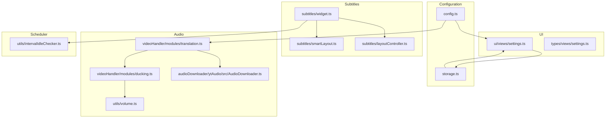
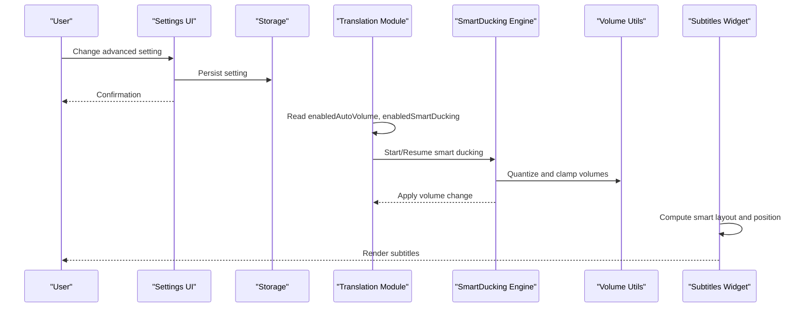
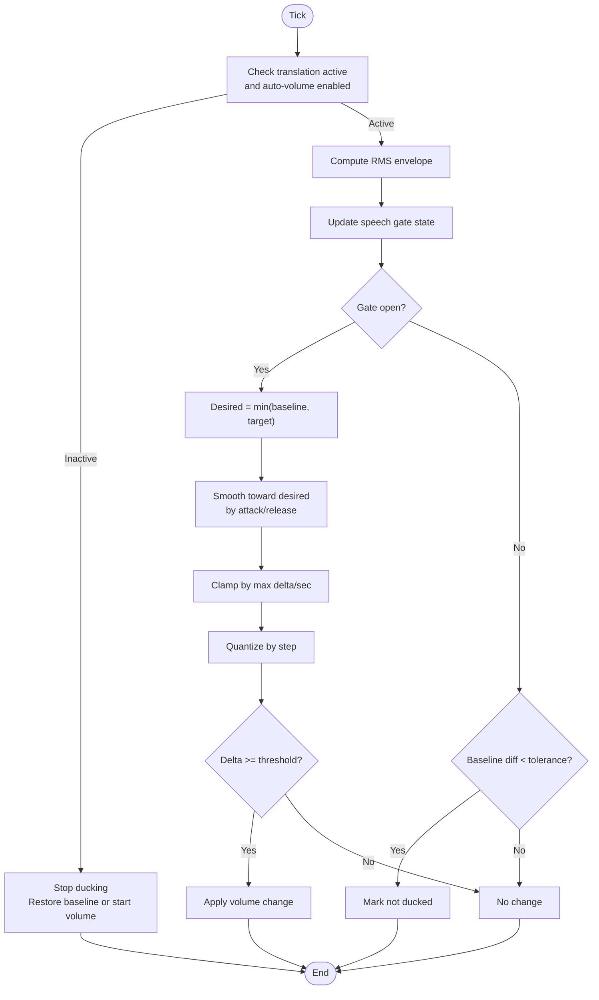
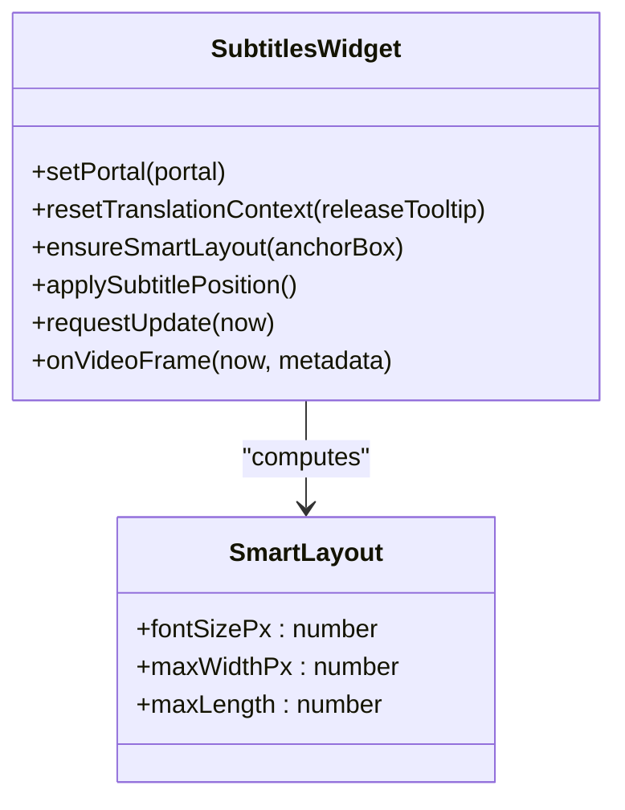
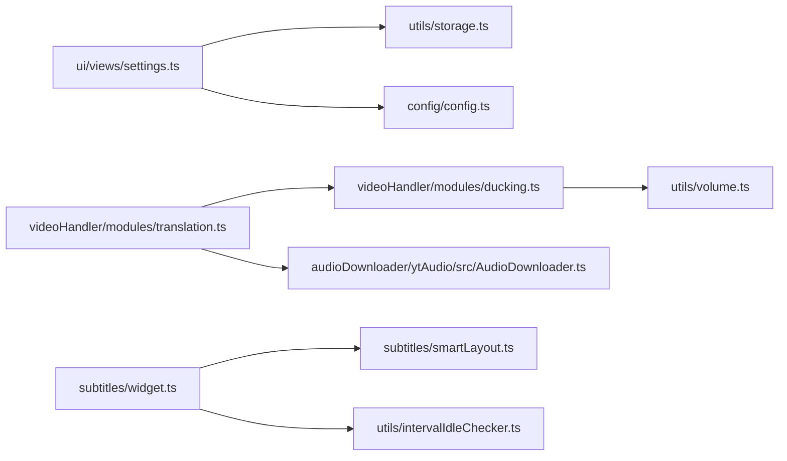

# Advanced Settings & Performance Tuning

<cite>
**Referenced Files in This Document**
- [config.ts](file://src/config/config.ts)
- [ducking.ts](file://src/videoHandler/modules/ducking.ts)
- [volume.ts](file://src/utils/volume.ts)
- [settings.ts (UI)](file://src/ui/views/settings.ts)
- [settings.ts (Types)](file://src/types/views/settings.ts)
- [storage.ts](file://src/utils/storage.ts)
- [widget.ts](file://src/subtitles/widget.ts)
- [smartLayout.ts](file://src/subtitles/smartLayout.ts)
- [layoutController.ts](file://src/subtitles/layoutController.ts)
- [intervalIdleChecker.ts](file://src/utils/intervalIdleChecker.ts)
- [translation.ts](file://src/videoHandler/modules/translation.ts)
- [AudioDownloader.ts](file://src/audioDownloader/ytAudio/src/AudioDownloader.ts)
</cite>

## Table of Contents
1. [Introduction](#introduction)
2. [Project Structure](#project-structure)
3. [Core Components](#core-components)
4. [Architecture Overview](#architecture-overview)
5. [Detailed Component Analysis](#detailed-component-analysis)
6. [Dependency Analysis](#dependency-analysis)
7. [Performance Considerations](#performance-considerations)
8. [Troubleshooting Guide](#troubleshooting-guide)
9. [Conclusion](#conclusion)
10. [Appendices](#appendices)

## Introduction
This document provides advanced configuration options and performance tuning guidance for translation quality, audio processing, and subtitle rendering. It explains how to optimize memory usage, CPU allocation, and battery life, and covers advanced audio configuration (volume ducking thresholds, buffer sizes, and format preferences). It also documents subtitle rendering customization (font sizing, positioning, animation effects, and timing adjustments), along with practical examples for different devices, network conditions, and use cases. Finally, it outlines advanced troubleshooting techniques for performance issues and resource management.

## Project Structure
The advanced settings and performance tuning surface is implemented across several subsystems:
- Configuration and defaults: centralized in configuration files
- Audio ducking and volume control: implemented in dedicated modules
- Subtitle rendering and layout: implemented in widgets and layout helpers
- UI settings panel: exposes tunables and persists them to storage
- Resource scheduling and idle throttling: implemented via an interval/idle checker
- Audio downloading pipeline: configurable format selection and buffering

**Diagram sources**
- [config.ts:1-63](file://src/config/config.ts#L1-L63)
- [ducking.ts:1-300](file://src/videoHandler/modules/ducking.ts#L1-L300)
- [volume.ts:1-97](file://src/utils/volume.ts#L1-L97)
- [settings.ts (UI):1-800](file://src/ui/views/settings.ts#L1-L800)
- [settings.ts (Types):1-38](file://src/types/views/settings.ts#L1-L38)
- [storage.ts:1-380](file://src/utils/storage.ts#L1-L380)
- [widget.ts:1-800](file://src/subtitles/widget.ts#L1-L800)
- [smartLayout.ts:1-138](file://src/subtitles/smartLayout.ts#L1-L138)
- [layoutController.ts:1-37](file://src/subtitles/layoutController.ts#L1-L37)
- [intervalIdleChecker.ts:1-304](file://src/utils/intervalIdleChecker.ts#L1-L304)
- [translation.ts:1-800](file://src/videoHandler/modules/translation.ts#L1-L800)
- [AudioDownloader.ts:1-955](file://src/audioDownloader/ytAudio/src/AudioDownloader.ts#L1-L955)

**Section sources**
- [config.ts:1-63](file://src/config/config.ts#L1-L63)
- [settings.ts (UI):1-800](file://src/ui/views/settings.ts#L1-L800)
- [storage.ts:1-380](file://src/utils/storage.ts#L1-L380)

## Core Components
- Configuration defaults and backend endpoints
- Smart audio ducking engine and volume utilities
- Subtitle widget with smart layout and positioning
- Settings UI and storage persistence
- Idle-aware scheduler for background tasks
- Translation and audio pipeline with format selection

**Section sources**
- [config.ts:1-63](file://src/config/config.ts#L1-L63)
- [ducking.ts:1-300](file://src/videoHandler/modules/ducking.ts#L1-L300)
- [volume.ts:1-97](file://src/utils/volume.ts#L1-L97)
- [widget.ts:1-800](file://src/subtitles/widget.ts#L1-L800)
- [settings.ts (UI):1-800](file://src/ui/views/settings.ts#L1-L800)
- [intervalIdleChecker.ts:1-304](file://src/utils/intervalIdleChecker.ts#L1-L304)
- [translation.ts:1-800](file://src/videoHandler/modules/translation.ts#L1-L800)
- [AudioDownloader.ts:1-955](file://src/audioDownloader/ytAudio/src/AudioDownloader.ts#L1-L955)

## Architecture Overview
The advanced settings are exposed through a settings UI that reads and writes to persistent storage. Audio ducking is integrated into the translation module and uses an analyser to dynamically adjust video volume. Subtitles are rendered by a widget that computes smart layout and applies responsive positioning. Background tasks are scheduled using an idle-aware checker to minimize CPU and battery usage.

**Diagram sources**
- [settings.ts (UI):1-800](file://src/ui/views/settings.ts#L1-L800)
- [storage.ts:1-380](file://src/utils/storage.ts#L1-L380)
- [translation.ts:1-800](file://src/videoHandler/modules/translation.ts#L1-L800)
- [ducking.ts:1-300](file://src/videoHandler/modules/ducking.ts#L1-L300)
- [volume.ts:1-97](file://src/utils/volume.ts#L1-L97)
- [widget.ts:1-800](file://src/subtitles/widget.ts#L1-L800)

## Detailed Component Analysis

### Audio Ducking and Volume Control
Smart ducking lowers the host video volume when translated audio is playing, using RMS energy detection and exponential smoothing. It supports configurable thresholds, attack/release times, and quantization steps.

Key parameters:
- Thresholds: onset and offset RMS thresholds
- Envelope dynamics: attack and release time constants
- Hold time: minimum duration to keep gate open after sound stops
- Smoothing: per-direction attack/release for volume transitions
- Quantization: discrete volume steps for smoother changes
- External baseline delta and tolerance for restoring volume

**Diagram sources**
- [ducking.ts:111-275](file://src/videoHandler/modules/ducking.ts#L111-L275)
- [volume.ts:66-96](file://src/utils/volume.ts#L66-L96)

**Section sources**
- [ducking.ts:1-300](file://src/videoHandler/modules/ducking.ts#L1-L300)
- [volume.ts:1-97](file://src/utils/volume.ts#L1-L97)
- [translation.ts:503-565](file://src/videoHandler/modules/translation.ts#L503-L565)

### Subtitle Rendering and Smart Layout
The subtitle widget computes responsive typography and layout based on the anchor box (video viewport rectangle). It supports:
- Smart font sizing with aspect-ratio-aware scaling
- Maximum line width and character-per-line budgets
- Dynamic maximum line length for segmentation
- Positioning with drag-and-drop, clamping, and safe-area insets
- Highlighting and opacity controls
- Idle-driven updates and throttling

**Diagram sources**
- [widget.ts:110-800](file://src/subtitles/widget.ts#L110-L800)
- [smartLayout.ts:105-137](file://src/subtitles/smartLayout.ts#L105-L137)

**Section sources**
- [widget.ts:1-800](file://src/subtitles/widget.ts#L1-L800)
- [smartLayout.ts:1-138](file://src/subtitles/smartLayout.ts#L1-L138)
- [layoutController.ts:1-37](file://src/subtitles/layoutController.ts#L1-L37)

### Settings UI and Persistence
The settings UI exposes advanced toggles and sliders for:
- Auto-translate and auto-subtitles
- Audio boost and sync volume
- Smart ducking and auto volume level
- Subtitle smart layout, font size, opacity, and max length
- Proxy worker host and translation proxy status
- Button position and auto-hide delay
- Download format and hotkeys

Settings are persisted to storage with compatibility conversion and debounced writes.

**Section sources**
- [settings.ts (UI):1-800](file://src/ui/views/settings.ts#L1-L800)
- [settings.ts (Types):1-38](file://src/types/views/settings.ts#L1-L38)
- [storage.ts:1-380](file://src/utils/storage.ts#L1-L380)
- [config.ts:1-63](file://src/config/config.ts#L1-L63)

### Idle-Aware Scheduler
The interval/idle checker reduces background work when the document is hidden or idle, minimizing CPU and battery usage. It supports:
- Configurable check intervals and idle thresholds
- Immediate tick requests
- Visibility-change handling

**Section sources**
- [intervalIdleChecker.ts:1-304](file://src/utils/intervalIdleChecker.ts#L1-L304)
- [widget.ts:464-483](file://src/subtitles/widget.ts#L464-L483)

### Audio Download Pipeline
The audio downloader selects optimal formats and supports:
- Client preference order and fallback
- Range-based downloads for robustness
- Chunked streaming for memory efficiency
- MIME type and codec extraction

**Section sources**
- [AudioDownloader.ts:1-955](file://src/audioDownloader/ytAudio/src/AudioDownloader.ts#L1-L955)

## Dependency Analysis
The advanced settings touchpoints span multiple modules with clear separation of concerns:
- UI depends on storage and configuration
- Translation module depends on ducking and volume utilities
- Subtitles widget depends on layout and idle scheduler
- Audio downloader is independent but integrates with translation

**Diagram sources**
- [settings.ts (UI):1-800](file://src/ui/views/settings.ts#L1-L800)
- [storage.ts:1-380](file://src/utils/storage.ts#L1-L380)
- [config.ts:1-63](file://src/config/config.ts#L1-L63)
- [translation.ts:1-800](file://src/videoHandler/modules/translation.ts#L1-L800)
- [ducking.ts:1-300](file://src/videoHandler/modules/ducking.ts#L1-L300)
- [volume.ts:1-97](file://src/utils/volume.ts#L1-L97)
- [widget.ts:1-800](file://src/subtitles/widget.ts#L1-L800)
- [smartLayout.ts:1-138](file://src/subtitles/smartLayout.ts#L1-L138)
- [intervalIdleChecker.ts:1-304](file://src/utils/intervalIdleChecker.ts#L1-L304)
- [AudioDownloader.ts:1-955](file://src/audioDownloader/ytAudio/src/AudioDownloader.ts#L1-L955)

**Section sources**
- [settings.ts (UI):1-800](file://src/ui/views/settings.ts#L1-L800)
- [translation.ts:1-800](file://src/videoHandler/modules/translation.ts#L1-L800)
- [widget.ts:1-800](file://src/subtitles/widget.ts#L1-L800)

## Performance Considerations
- CPU and battery:
  - Use idle-aware scheduling to throttle background tasks when the tab is hidden or inactive.
  - Reduce subtitle update frequency by increasing the minimum update interval when highlighting is disabled.
  - Disable smart ducking or reduce RMS analysis overhead on low-power devices.
- Memory:
  - Prefer chunked audio downloads to avoid loading entire tracks into memory.
  - Use smaller subtitle max length and font size to reduce DOM and canvas operations.
- Network:
  - Enable proxy worker host and translation proxy status when region restrictions require it.
  - Choose efficient clients for audio downloads and prefer range-first probing for reliability.
- Translation quality:
  - Increase auto volume for clearer voice-over; balance against clipping by monitoring RMS.
  - Use smart ducking to maintain dialogue intelligibility without constant low volume.

[No sources needed since this section provides general guidance]

## Troubleshooting Guide
Common performance issues and remedies:
- High CPU usage:
  - Lower subtitle font size and disable smart layout for very large displays.
  - Increase the auto-hide button delay and disable “highlight words”.
  - Disable “use new audio player” or “audio booster” if WebAudio is unsupported.
- Battery drain:
  - Enable idle throttling by keeping the default interval profile.
  - Reduce subtitle max length and opacity to minimize rendering work.
- Audio glitches or distortion:
  - Reduce “auto volume” to prevent clipping.
  - Disable smart ducking and use classic constant ducking.
  - Switch to a different audio client for downloads if range requests fail.
- Subtitles misaligned or overlapping:
  - Re-enable smart layout and adjust max length.
  - Recenter subtitles using drag handles; ensure safe area insets are considered.

**Section sources**
- [settings.ts (UI):1-800](file://src/ui/views/settings.ts#L1-L800)
- [intervalIdleChecker.ts:1-304](file://src/utils/intervalIdleChecker.ts#L1-L304)
- [widget.ts:1-800](file://src/subtitles/widget.ts#L1-L800)
- [translation.ts:1-800](file://src/videoHandler/modules/translation.ts#L1-L800)
- [AudioDownloader.ts:1-955](file://src/audioDownloader/ytAudio/src/AudioDownloader.ts#L1-L955)

## Conclusion
Advanced settings enable precise control over translation quality, audio behavior, and subtitle rendering. By combining smart ducking, responsive subtitle layout, and idle-aware scheduling, users can tailor performance to their devices and network conditions. Persistent storage ensures settings survive updates, while the UI provides intuitive access to powerful tunables.

[No sources needed since this section summarizes without analyzing specific files]

## Appendices

### Practical Examples

- Low-end mobile device:
  - Disable smart ducking and audio booster
  - Reduce subtitle font size and opacity
  - Increase auto-hide delay and disable “highlight words”
  - Use proxy worker host if needed

- High-resolution display:
  - Enable smart layout and increase max length
  - Keep smart ducking enabled for dialogue clarity
  - Use chunked audio downloads for large files

- Unstable network:
  - Enable translation proxy status and set proxy worker host
  - Prefer range-first probing for audio downloads
  - Reduce auto volume to avoid clipping under buffering

- Accessibility needs:
  - Increase subtitle font size and opacity
  - Enable smart layout and adjust max length
  - Keep “highlight words” enabled for readability

[No sources needed since this section provides general guidance]