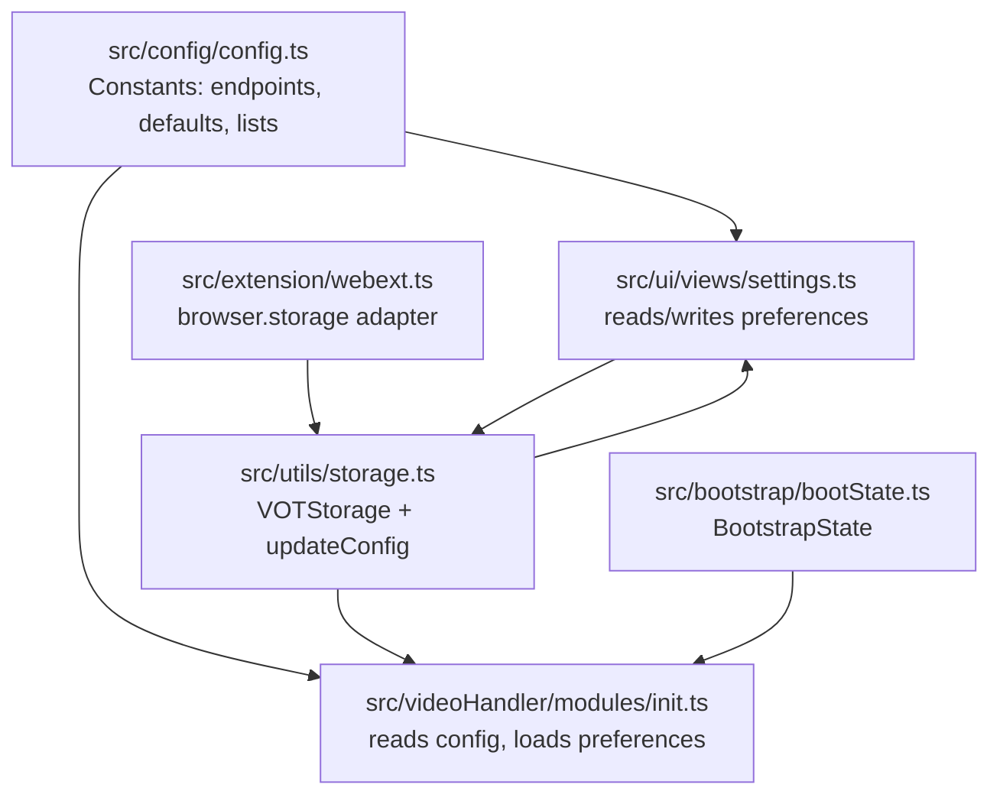
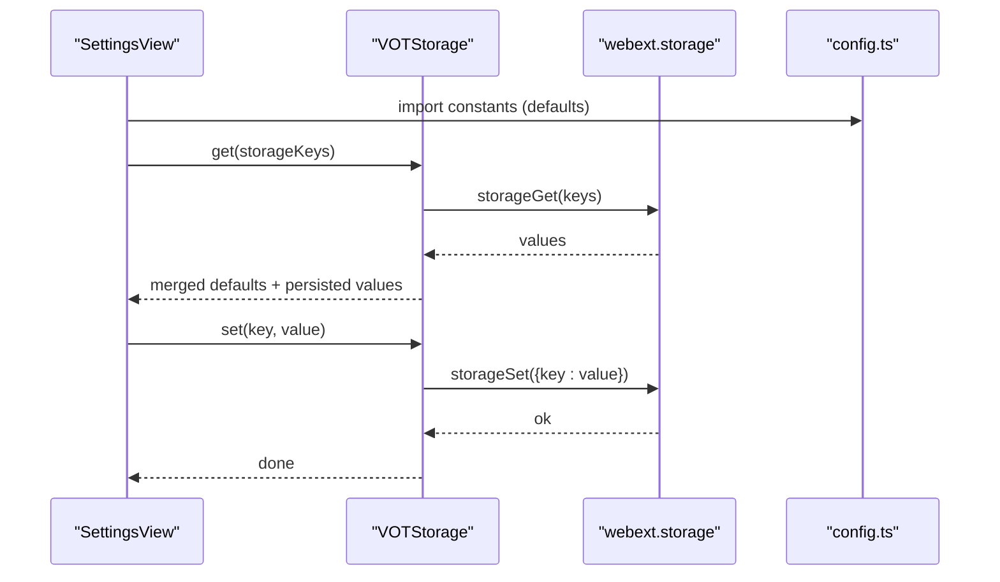
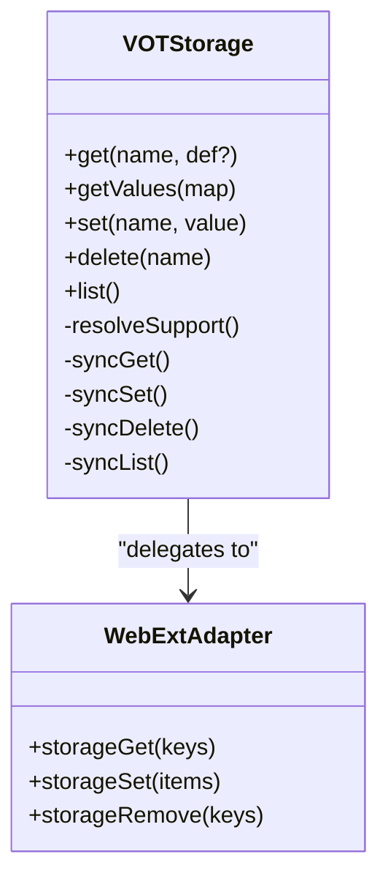
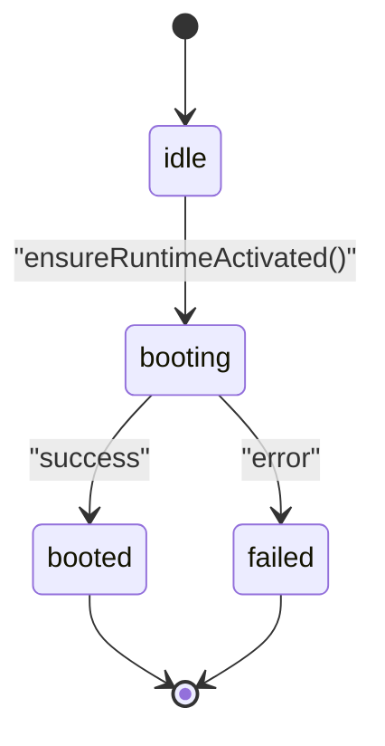
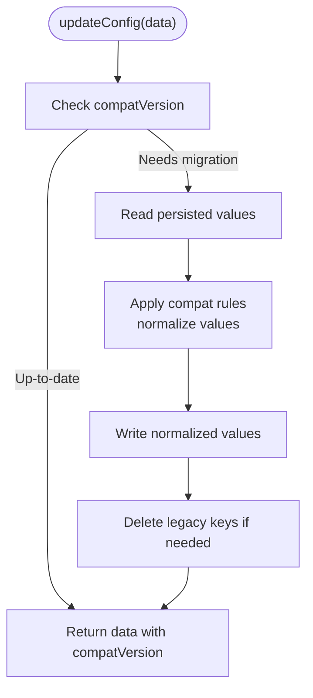
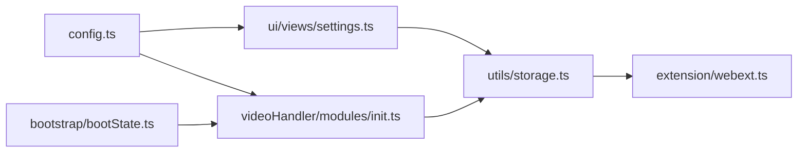

# Basic Configuration

<cite>
**Referenced Files in This Document**
- [config.ts](file://src/config/config.ts)
- [storage.ts](file://src/utils/storage.ts)
- [storage.ts](file://src/extension/webext.ts)
- [bootState.ts](file://src/bootstrap/bootState.ts)
- [init.ts](file://src/videoHandler/modules/init.ts)
- [settings.ts](file://src/ui/views/settings.ts)
- [storage.ts](file://src/types/storage.ts)
- [errors.ts](file://src/utils/errors.ts)
</cite>

## Table of Contents
1. [Introduction](#introduction)
2. [Project Structure](#project-structure)
3. [Core Components](#core-components)
4. [Architecture Overview](#architecture-overview)
5. [Detailed Component Analysis](#detailed-component-analysis)
6. [Dependency Analysis](#dependency-analysis)
7. [Performance Considerations](#performance-considerations)
8. [Troubleshooting Guide](#troubleshooting-guide)
9. [Conclusion](#conclusion)

## Introduction
This document explains the basic configuration system used by the English Teacher extension. It covers exported configuration constants for service endpoints and UI behavior, default values for auto volume and services, persistence of user preferences, boot state initialization, and practical usage patterns. It also documents type safety, validation, and error handling for invalid settings, along with troubleshooting guidance.

## Project Structure
The configuration system is centered around a small set of constants and a robust storage layer:
- Constants define service endpoints and defaults.
- Storage utilities persist and load user preferences across browser sessions.
- Boot state tracks initialization progress.
- UI components read and write preferences via the storage layer.

**Diagram sources**
- [config.ts:1-63](file://src/config/config.ts#L1-L63)
- [storage.ts:1-380](file://src/utils/storage.ts#L1-L380)
- [webext.ts:84-135](file://src/extension/webext.ts#L84-L135)
- [bootState.ts:1-42](file://src/bootstrap/bootState.ts#L1-L42)
- [init.ts:1-50](file://src/videoHandler/modules/init.ts#L1-L50)
- [settings.ts:1-200](file://src/ui/views/settings.ts#L1-L200)

**Section sources**
- [config.ts:1-63](file://src/config/config.ts#L1-L63)
- [storage.ts:1-380](file://src/utils/storage.ts#L1-L380)
- [webext.ts:84-135](file://src/extension/webext.ts#L84-L135)
- [bootState.ts:1-42](file://src/bootstrap/bootState.ts#L1-L42)
- [init.ts:1-50](file://src/videoHandler/modules/init.ts#L1-L50)
- [settings.ts:1-200](file://src/ui/views/settings.ts#L1-L200)

## Core Components
- Service endpoint constants: workerHost, m3u8ProxyHost, proxyWorkerHost, votBackendUrl, foswlyTranslateUrl, detectRustServerUrl, authServerUrl, avatarServerUrl, contentUrl, repositoryUrl.
- Default behavior constants: defaultAutoVolume, maxAudioVolume, minLongWaitingCount, defaultTranslationService, defaultDetectService, nonProxyExtensions, proxyOnlyCountries, defaultAutoHideDelay, actualCompatVersion.
- Storage layer: VOTStorage with dual backend support (userscript GM APIs and localStorage), plus compatibility migration via updateConfig.
- Boot state: BootstrapState with typed status and lifecycle tracking.

Practical defaults and meanings:
- defaultAutoVolume: typical starting volume for translated audio.
- maxAudioVolume: upper bound for audio scaling.
- minLongWaitingCount: threshold for treating repeated responses as delayed.
- defaultTranslationService: preferred text translation provider.
- defaultDetectService: preferred language detection provider.
- defaultAutoHideDelay: UI button auto-hide delay.
- proxyOnlyCountries and nonProxyExtensions: network policy lists.

**Section sources**
- [config.ts:3-62](file://src/config/config.ts#L3-L62)
- [storage.ts:1-380](file://src/utils/storage.ts#L1-L380)
- [bootState.ts:1-42](file://src/bootstrap/bootState.ts#L1-L42)

## Architecture Overview
The configuration system integrates constants, storage, and UI:

**Diagram sources**
- [settings.ts:1-200](file://src/ui/views/settings.ts#L1-L200)
- [storage.ts:271-330](file://src/utils/storage.ts#L271-L330)
- [webext.ts:103-124](file://src/extension/webext.ts#L103-L124)
- [config.ts:3-62](file://src/config/config.ts#L3-L62)

## Detailed Component Analysis

### Configuration Constants
- Endpoint constants:
  - workerHost: Yandex browser worker host.
  - m3u8ProxyHost: media proxy for HLS streams.
  - proxyWorkerHost: proxy balancer/worker host.
  - votBackendUrl: primary backend for translations.
  - foswlyTranslateUrl: alternate translation backend.
  - detectRustServerUrl: Rust-based language detection server.
  - authServerUrl: authentication server.
  - avatarServerUrl: avatar image service.
  - contentUrl/repositoryUrl: content and repository links.
- Behavior defaults:
  - defaultAutoVolume, maxAudioVolume, minLongWaitingCount, defaultTranslationService, defaultDetectService, nonProxyExtensions, proxyOnlyCountries, defaultAutoHideDelay, actualCompatVersion.

Usage examples:
- Importing defaults in UI and handlers:
  - [settings.ts:48-56](file://src/ui/views/settings.ts#L48-L56)
  - [init.ts:1-17](file://src/videoHandler/modules/init.ts#L1-L17)

Validation and type safety:
- Defaults are typed via union literals for services and numeric ranges for volumes and delays.

**Section sources**
- [config.ts:3-62](file://src/config/config.ts#L3-L62)
- [settings.ts:48-56](file://src/ui/views/settings.ts#L48-L56)
- [init.ts:1-17](file://src/videoHandler/modules/init.ts#L1-L17)

### Storage Mechanism and Persistence
- VOTStorage supports two backends:
  - Userscript GM APIs (GM.getValue/GM.setValue) when available.
  - Fallback to browser localStorage.
- updateConfig merges incoming data with persisted values, normalizes legacy keys, and writes normalized values. It ensures compatVersion is set to actualCompatVersion.
- Storage keys are enumerated and typed via storageKeys and StorageData, enforcing compile-time checks against allowed keys.

**Diagram sources**
- [storage.ts:204-380](file://src/utils/storage.ts#L204-L380)
- [webext.ts:84-135](file://src/extension/webext.ts#L84-L135)

**Section sources**
- [storage.ts:1-380](file://src/utils/storage.ts#L1-L380)
- [storage.ts:18-135](file://src/types/storage.ts#L18-L135)
- [webext.ts:84-135](file://src/extension/webext.ts#L84-L135)

### Boot State Configuration and Initialization
- BootstrapState tracks status ("idle" | "booting" | "booted" | "failed"), a promise, and an error field.
- getOrCreateBootState creates or retrieves a named boot state in global scope, ensuring idempotent initialization.
- During runtime activation, the system initializes localization and iframe interactor once per session.

**Diagram sources**
- [bootState.ts:1-42](file://src/bootstrap/bootState.ts#L1-L42)
- [runtimeActivation.ts:20-58](file://src/bootstrap/runtimeActivation.ts#L20-L58)

**Section sources**
- [bootState.ts:1-42](file://src/bootstrap/bootState.ts#L1-L42)
- [runtimeActivation.ts:20-58](file://src/bootstrap/runtimeActivation.ts#L20-L58)

### Practical Examples: Accessing and Overriding Configuration
- In UI settings:
  - Read defaults and persisted values to populate controls.
  - Persist changes with debounced storage writes.
  - Example references:
    - [settings.ts:1-200](file://src/ui/views/settings.ts#L1-L200)
    - [settings.ts:690-720](file://src/ui/views/settings.ts#L690-L720)
- In video handler initialization:
  - Import defaults and use them to configure behavior.
  - Example references:
    - [init.ts:1-50](file://src/videoHandler/modules/init.ts#L1-L50)

Overriding defaults:
- Users can change translation/detection services and proxy settings in the UI.
- Persisted values take precedence over defaults until explicitly changed.

**Section sources**
- [settings.ts:1-200](file://src/ui/views/settings.ts#L1-L200)
- [settings.ts:690-720](file://src/ui/views/settings.ts#L690-L720)
- [init.ts:1-50](file://src/videoHandler/modules/init.ts#L1-L50)

### Type Safety, Validation, and Error Handling
- Type safety:
  - storageKeys and StorageData enforce allowed keys and types.
  - updateConfig returns a generic T constrained by StorageData, ensuring returned data matches the expected shape.
- Validation and normalization:
  - Legacy keys are migrated via compat rules; values are normalized (e.g., autoVolume percentage conversion).
  - Values are compared for equality to avoid unnecessary writes.
- Error handling:
  - Event emitters isolate listener exceptions to prevent cascading failures.
  - Error helpers provide robust message extraction from diverse error shapes.

**Diagram sources**
- [storage.ts:139-190](file://src/utils/storage.ts#L139-L190)

**Section sources**
- [storage.ts:139-190](file://src/utils/storage.ts#L139-L190)
- [storage.ts:18-135](file://src/types/storage.ts#L18-L135)
- [errors.ts:1-110](file://src/utils/errors.ts#L1-L110)

## Dependency Analysis
- UI depends on config defaults and storage for rendering and persistence.
- Video handler depends on config defaults and storage for initialization and behavior.
- Storage depends on webext adapter for browser storage and falls back to localStorage.
- Boot state is independent but coordinated with runtime activation.

**Diagram sources**
- [config.ts:1-63](file://src/config/config.ts#L1-L63)
- [settings.ts:1-200](file://src/ui/views/settings.ts#L1-L200)
- [init.ts:1-50](file://src/videoHandler/modules/init.ts#L1-L50)
- [storage.ts:1-380](file://src/utils/storage.ts#L1-L380)
- [webext.ts:84-135](file://src/extension/webext.ts#L84-L135)
- [bootState.ts:1-42](file://src/bootstrap/bootState.ts#L1-L42)

**Section sources**
- [config.ts:1-63](file://src/config/config.ts#L1-L63)
- [settings.ts:1-200](file://src/ui/views/settings.ts#L1-L200)
- [init.ts:1-50](file://src/videoHandler/modules/init.ts#L1-L50)
- [storage.ts:1-380](file://src/utils/storage.ts#L1-L380)
- [webext.ts:84-135](file://src/extension/webext.ts#L84-L135)
- [bootState.ts:1-42](file://src/bootstrap/bootState.ts#L1-L42)

## Performance Considerations
- Debounced persistence in UI reduces write frequency for sliders and inputs.
- Batched reads/writes via getValues minimize round-trips to storage.
- Compatibility migration runs once per updateConfig invocation and avoids redundant writes by comparing values.

## Troubleshooting Guide
Common issues and resolutions:
- Preferences not persisting:
  - Verify browser storage availability; the system falls back to localStorage if GM APIs are missing.
  - Confirm keys are part of storageKeys and types match StorageData.
  - References:
    - [storage.ts:271-330](file://src/utils/storage.ts#L271-L330)
    - [storage.ts:18-135](file://src/types/storage.ts#L18-L135)
- Migration errors after updates:
  - updateConfig automatically migrates legacy keys; check that compatVersion is set to actualCompatVersion.
  - References:
    - [storage.ts:139-190](file://src/utils/storage.ts#L139-L190)
- UI not reflecting defaults:
  - Ensure defaults are imported and merged with persisted values in the UI.
  - References:
    - [settings.ts:1-200](file://src/ui/views/settings.ts#L1-L200)
- Proxy or service connectivity problems:
  - Validate endpoints (workerHost, m3u8ProxyHost, proxyWorkerHost, votBackendUrl) and adjust via UI if needed.
  - References:
    - [config.ts:3-62](file://src/config/config.ts#L3-L62)
    - [settings.ts:630-661](file://src/ui/views/settings.ts#L630-L661)

**Section sources**
- [storage.ts:139-190](file://src/utils/storage.ts#L139-L190)
- [storage.ts:271-330](file://src/utils/storage.ts#L271-L330)
- [storage.ts:18-135](file://src/types/storage.ts#L18-L135)
- [config.ts:3-62](file://src/config/config.ts#L3-L62)
- [settings.ts:630-661](file://src/ui/views/settings.ts#L630-L661)

## Conclusion
The configuration system provides a clean separation between constants, typed storage, and UI persistence. Defaults are explicit and enforced by types, while the storage layer handles compatibility, normalization, and robust fallbacks. Initialization is tracked via boot state, and UI components integrate seamlessly with both defaults and persisted preferences.