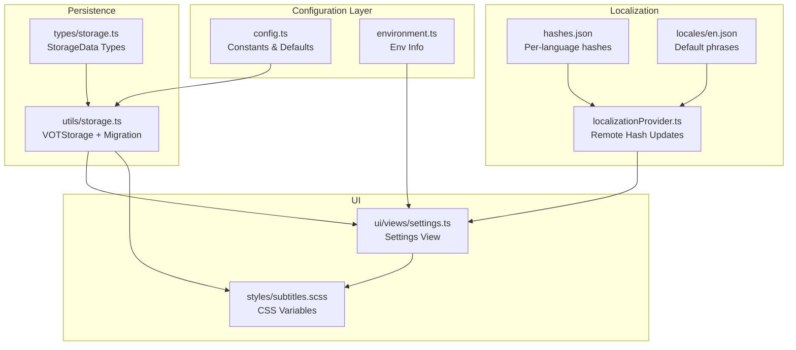
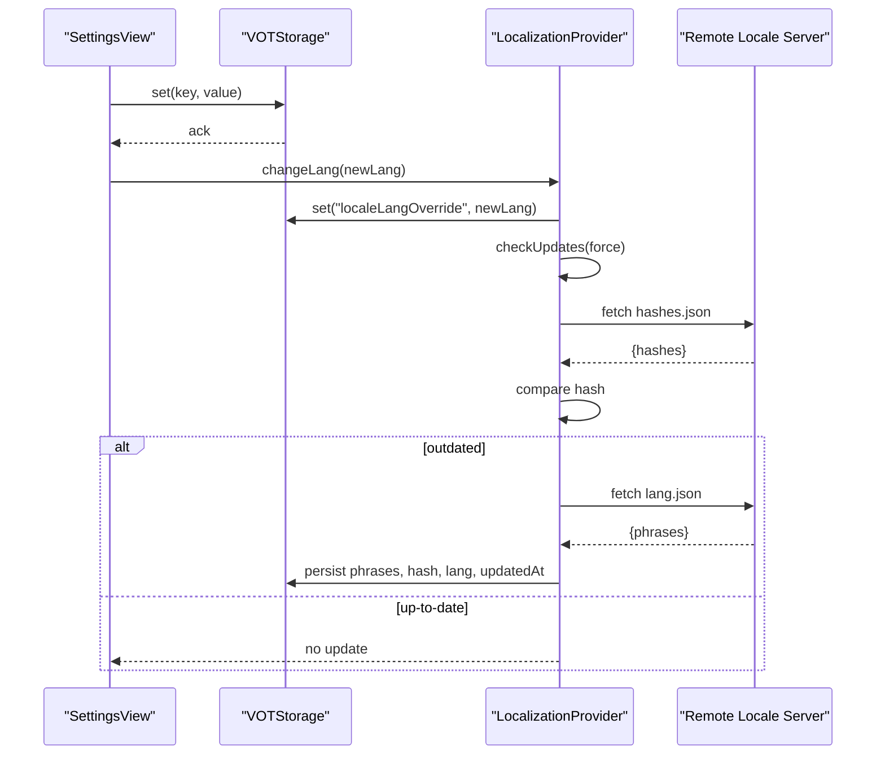
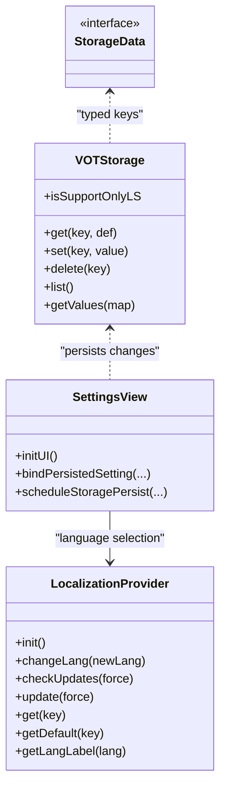
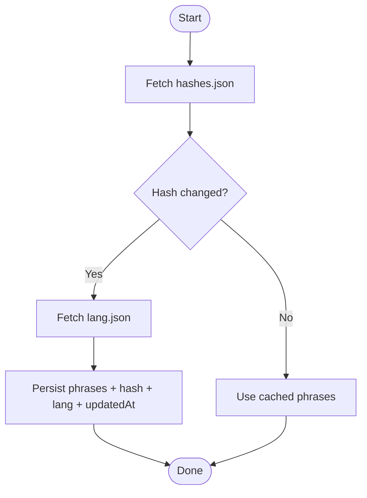
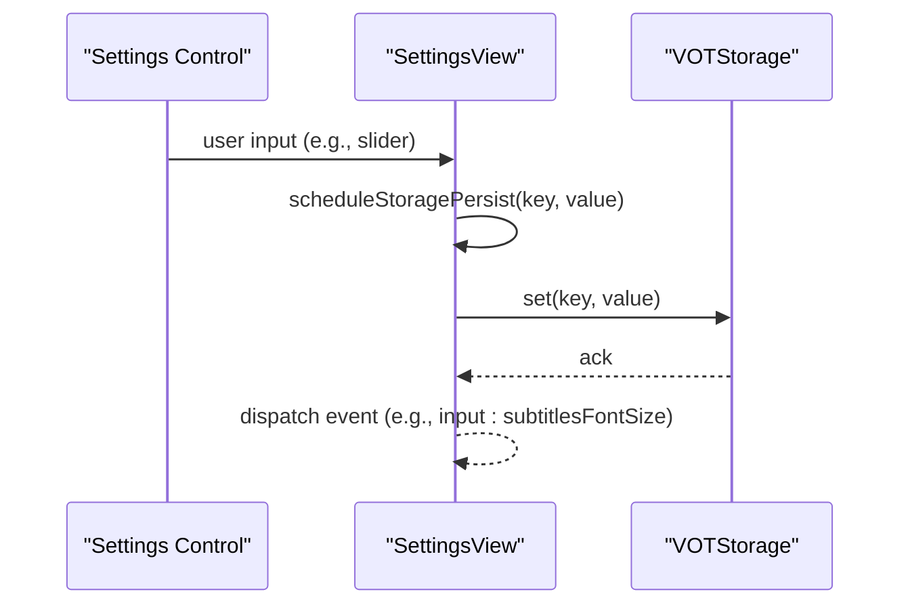
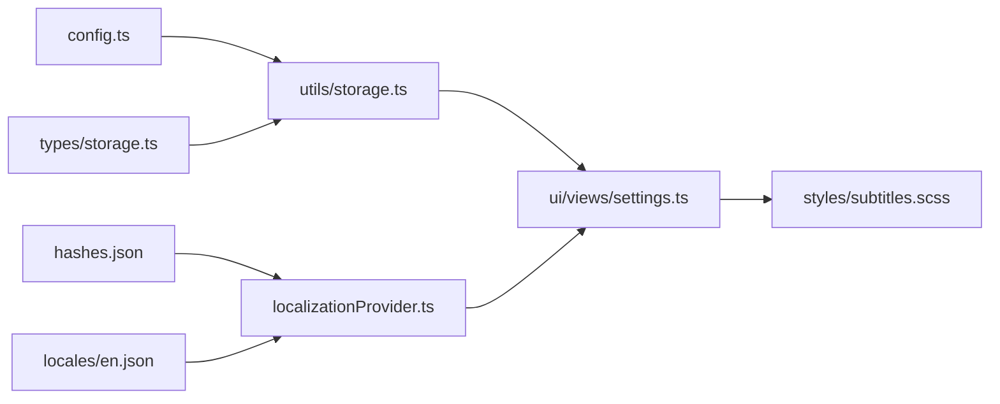

# Configuration & Customization

<cite>
**Referenced Files in This Document**
- [config.ts](file://src/config/config.ts)
- [localizationProvider.ts](file://src/localization/localizationProvider.ts)
- [storage.ts](file://src/utils/storage.ts)
- [storage.ts (types)](file://src/types/storage.ts)
- [subtitles.scss](file://src/styles/subtitles.scss)
- [settings.ts](file://src/ui/views/settings.ts)
- [settings.ts (types)](file://src/types/views/settings.ts)
- [en.json](file://src/localization/locales/en.json)
- [hashes.json](file://src/localization/hashes.json)
- [localization.ts](file://src/utils/localization.ts)
- [environment.ts](file://src/utils/environment.ts)
- [l10n.config.json](file://l10n.config.json)
- [package.json](file://package.json)
</cite>

## Table of Contents
1. [Introduction](#introduction)
2. [Project Structure](#project-structure)
3. [Core Components](#core-components)
4. [Architecture Overview](#architecture-overview)
5. [Detailed Component Analysis](#detailed-component-analysis)
6. [Dependency Analysis](#dependency-analysis)
7. [Performance Considerations](#performance-considerations)
8. [Troubleshooting Guide](#troubleshooting-guide)
9. [Conclusion](#conclusion)
10. [Appendices](#appendices)

## Introduction
This document explains the configuration and customization system of the English Teacher extension. It covers:
- Storage mechanisms and default values
- User preference management
- Localization configuration with language pack loading, hash-based invalidation, and dynamic language switching
- Styling customization via CSS custom properties and theme variables
- Advanced configuration options for translation services, audio processing, and subtitle rendering
- Build-time configuration and environment-specific settings
- Practical customization scenarios, validation, error handling, fallbacks, and performance implications

## Project Structure
The configuration system spans several subsystems:
- Centralized configuration constants
- Persistent user preferences with compatibility migration
- Localization provider with remote hash-based updates
- UI settings view binding user preferences to persistent storage
- Stylesheet-driven customization via CSS variables
- Build-time localization configuration and environment reporting

**Diagram sources**
- [config.ts:1-63](file://src/config/config.ts#L1-L63)
- [environment.ts:19-44](file://src/utils/environment.ts#L19-L44)
- [storage.ts:74-190](file://src/utils/storage.ts#L74-L190)
- [storage.ts (types):18-129](file://src/types/storage.ts#L18-L129)
- [localizationProvider.ts:39-273](file://src/localization/localizationProvider.ts#L39-L273)
- [hashes.json:1-65](file://src/localization/hashes.json#L1-L65)
- [en.json:1-247](file://src/localization/locales/en.json#L1-L247)
- [settings.ts:99-800](file://src/ui/views/settings.ts#L99-L800)
- [subtitles.scss:1-215](file://src/styles/subtitles.scss#L1-L215)

**Section sources**
- [config.ts:1-63](file://src/config/config.ts#L1-L63)
- [storage.ts (types):18-129](file://src/types/storage.ts#L18-L129)
- [localizationProvider.ts:39-273](file://src/localization/localizationProvider.ts#L39-L273)
- [settings.ts:99-800](file://src/ui/views/settings.ts#L99-L800)
- [subtitles.scss:1-215](file://src/styles/subtitles.scss#L1-L215)

## Core Components
- Configuration constants define default hosts, service endpoints, default volumes, and compatibility version.
- Storage types enumerate all user preferences and locale keys.
- VOTStorage provides a unified persistence layer with compatibility migration and dual backend support (GM promises and localStorage).
- LocalizationProvider manages language packs, hash-based updates, and fallbacks.
- SettingsView binds UI controls to storage keys and dispatches events for live updates.
- Stylesheets expose CSS custom properties for theme-aware customization.

**Section sources**
- [config.ts:1-63](file://src/config/config.ts#L1-L63)
- [storage.ts (types):18-129](file://src/types/storage.ts#L18-L129)
- [storage.ts:204-380](file://src/utils/storage.ts#L204-L380)
- [localizationProvider.ts:39-273](file://src/localization/localizationProvider.ts#L39-L273)
- [settings.ts:99-800](file://src/ui/views/settings.ts#L99-L800)
- [subtitles.scss:1-215](file://src/styles/subtitles.scss#L1-L215)

## Architecture Overview
The configuration pipeline integrates UI, persistence, localization, and styling:

**Diagram sources**
- [settings.ts:99-800](file://src/ui/views/settings.ts#L99-L800)
- [storage.ts:204-380](file://src/utils/storage.ts#L204-L380)
- [localizationProvider.ts:96-185](file://src/localization/localizationProvider.ts#L96-L185)

## Detailed Component Analysis

### Configuration Constants
- Hosts and endpoints for translation, media proxy, and worker services
- Default volumes and UI behavior defaults
- Compatibility version for storage migrations
- Country-specific proxy-only extensions list

Practical usage:
- Adjust translation service endpoints via environment or build-time overrides
- Tune default auto-hide delay and audio volume limits for user experience

**Section sources**
- [config.ts:1-63](file://src/config/config.ts#L1-L63)

### Storage and Migration
- Storage keys enumerate all user preferences and locale metadata
- VOTStorage supports both GM promises and localStorage transparently
- Compatibility migration converts legacy keys/values to new schema and sets a compatibility version
- Equality checks prevent redundant writes

Key behaviors:
- Dual backend detection and fallback
- Batched reads/writes for performance
- Safe conversion of numeric/boolean/string values during migration

**Section sources**
- [storage.ts (types):18-129](file://src/types/storage.ts#L18-L129)
- [storage.ts:204-380](file://src/utils/storage.ts#L204-L380)
- [storage.ts:74-190](file://src/utils/storage.ts#L74-L190)

### Localization Provider
- Loads locale phrases from a remote repository with branch selection
- Uses per-language hashes to detect updates without downloading unchanged files
- Caches locally with TTL and persists metadata (hash, language, updated-at)
- Provides fallback to default phrases and warns on missing keys
- Supports dynamic language switching and “auto” detection

Update flow:
- Fetch hashes.json and compare with stored hash
- If changed, fetch lang.json and persist new phrases and metadata
- On transient network errors, preserves last-known good state

**Section sources**
- [localizationProvider.ts:39-273](file://src/localization/localizationProvider.ts#L39-L273)
- [hashes.json:1-65](file://src/localization/hashes.json#L1-L65)
- [en.json:1-247](file://src/localization/locales/en.json#L1-L247)
- [localization.ts:4-36](file://src/utils/localization.ts#L4-L36)

### UI Settings and Preference Binding
- SettingsView initializes sections and binds controls to storage keys
- Uses debounced persistence for sliders and numeric inputs
- Emits typed events for consumers to react to changes
- Integrates with localization provider for labels and language selection

Common customization scenarios:
- Change subtitle appearance: adjust font size, opacity, and smart layout
- Adjust translation quality: choose translation and detection services
- Optimize performance: toggle adaptive volume, audio booster, and proxy mode

**Section sources**
- [settings.ts:99-800](file://src/ui/views/settings.ts#L99-L800)
- [settings.ts (types):13-37](file://src/types/views/settings.ts#L13-L37)

### Styling Customization
- Subtitles use CSS custom properties for theme-awareness and runtime overrides
- Variables include font family, size, color, background, opacity, hover effects, and fullscreen scaling
- Widget layout uses safe-area insets and anchor-positioning fallbacks
- Theme variables integrate with surface RGB and opacity for consistent visuals

Practical customization:
- Override --vot-subtitles-font-size and --vot-subtitles-opacity for readability
- Adjust --vot-subtitles-background for contrast on various video content
- Use --vot-subtitles-scale-compensation and --vot-subtitles-fullscreen-scale for responsive sizing

**Section sources**
- [subtitles.scss:1-215](file://src/styles/subtitles.scss#L1-L215)

### Build-Time Configuration and Environment
- Localization generation configured via l10n.config.json
- Scripts for building extension variants and development modes
- Environment reporter aggregates OS, browser, loader, and script metadata

Build-time notes:
- Localization types generated from JSON phrases
- Environment info useful for diagnostics and feature gating

**Section sources**
- [l10n.config.json:1-9](file://l10n.config.json#L1-L9)
- [package.json:31-47](file://package.json#L31-L47)
- [environment.ts:19-44](file://src/utils/environment.ts#L19-L44)

## Architecture Overview

**Diagram sources**
- [storage.ts:204-380](file://src/utils/storage.ts#L204-L380)
- [storage.ts (types):74-129](file://src/types/storage.ts#L74-L129)
- [localizationProvider.ts:39-273](file://src/localization/localizationProvider.ts#L39-L273)
- [settings.ts:99-800](file://src/ui/views/settings.ts#L99-L800)

## Detailed Component Analysis

### Localization Update Flow

**Diagram sources**
- [localizationProvider.ts:109-185](file://src/localization/localizationProvider.ts#L109-L185)
- [hashes.json:1-65](file://src/localization/hashes.json#L1-L65)

### Settings Persistence and Events

**Diagram sources**
- [settings.ts:243-309](file://src/ui/views/settings.ts#L243-L309)
- [storage.ts:204-380](file://src/utils/storage.ts#L204-L380)

### Practical Customization Scenarios

- Change subtitle appearance
  - Adjust font size and opacity via settings sliders; these values are persisted and reflected in CSS variables.
  - Enable smart layout to adapt subtitle typography to player size automatically.
  - Reference: [settings.ts:535-586](file://src/ui/views/settings.ts#L535-L586), [subtitles.scss:47-67](file://src/styles/subtitles.scss#L47-L67)

- Adjust translation quality
  - Choose translation and detection services from dropdowns; values are persisted and applied at runtime.
  - Toggle proxy mode for translation requests depending on region restrictions.
  - Reference: [settings.ts:682-720](file://src/ui/views/settings.ts#L682-L720), [config.ts:49-55](file://src/config/config.ts#L49-L55)

- Optimize performance settings
  - Enable adaptive volume to reduce perceived noise when translation audio is not playing.
  - Use audio booster judiciously; availability depends on Web Audio support.
  - Toggle PiP button and auto-hide delay to minimize UI overhead.
  - Reference: [settings.ts:429-453](file://src/ui/views/settings.ts#L429-L453), [settings.ts:725-742](file://src/ui/views/settings.ts#L725-L742)

- Customize language and localization
  - Switch menu language dynamically; the provider fetches updated phrases if hashes differ.
  - Reset localization state if needed to recover from corrupted cache.
  - Reference: [localizationProvider.ts:96-107](file://src/localization/localizationProvider.ts#L96-L107), [localizationProvider.ts:86-89](file://src/localization/localizationProvider.ts#L86-L89)

**Section sources**
- [settings.ts:535-586](file://src/ui/views/settings.ts#L535-L586)
- [settings.ts:682-720](file://src/ui/views/settings.ts#L682-L720)
- [settings.ts:429-453](file://src/ui/views/settings.ts#L429-L453)
- [settings.ts:725-742](file://src/ui/views/settings.ts#L725-L742)
- [localizationProvider.ts:96-107](file://src/localization/localizationProvider.ts#L96-L107)
- [localizationProvider.ts:86-89](file://src/localization/localizationProvider.ts#L86-L89)

## Dependency Analysis

**Diagram sources**
- [config.ts:1-63](file://src/config/config.ts#L1-L63)
- [storage.ts (types):18-129](file://src/types/storage.ts#L18-L129)
- [storage.ts:204-380](file://src/utils/storage.ts#L204-L380)
- [settings.ts:99-800](file://src/ui/views/settings.ts#L99-L800)
- [localizationProvider.ts:39-273](file://src/localization/localizationProvider.ts#L39-L273)
- [hashes.json:1-65](file://src/localization/hashes.json#L1-L65)
- [en.json:1-247](file://src/localization/locales/en.json#L1-L247)
- [subtitles.scss:1-215](file://src/styles/subtitles.scss#L1-L215)

**Section sources**
- [config.ts:1-63](file://src/config/config.ts#L1-L63)
- [storage.ts (types):18-129](file://src/types/storage.ts#L18-L129)
- [storage.ts:204-380](file://src/utils/storage.ts#L204-L380)
- [settings.ts:99-800](file://src/ui/views/settings.ts#L99-L800)
- [localizationProvider.ts:39-273](file://src/localization/localizationProvider.ts#L39-L273)
- [subtitles.scss:1-215](file://src/styles/subtitles.scss#L1-L215)

## Performance Considerations
- Storage
  - Batched reads/writes and equality checks reduce redundant persistence.
  - Compatibility migration runs once per session and writes only when necessary.
- Localization
  - Hash-based updates prevent unnecessary downloads; cache TTL avoids frequent network calls.
  - On transient failures, the provider preserves last-known good state and retries on next check.
- UI
  - Debounced persistence for sliders minimizes storage churn.
  - CSS custom properties enable efficient runtime theme switching without DOM thrash.
- Environment
  - Environment info aggregation is lightweight and suitable for diagnostics.

[No sources needed since this section provides general guidance]

## Troubleshooting Guide
- Localization not updating
  - Verify network connectivity and remote hashes endpoint accessibility.
  - Clear locale cache via reset method and retry update.
  - Check console warnings for missing keys and invalid payloads.
  - References: [localizationProvider.ts:109-185](file://src/localization/localizationProvider.ts#L109-L185), [localizationProvider.ts:86-89](file://src/localization/localizationProvider.ts#L86-L89)

- Settings not persisting
  - Confirm storage backend support; fallback to localStorage is automatic.
  - Ensure keys are part of the typed storage schema.
  - References: [storage.ts:204-380](file://src/utils/storage.ts#L204-L380), [storage.ts (types):18-129](file://src/types/storage.ts#L18-L129)

- Audio features unavailable
  - Some features require Web Audio support; tooltips indicate unavailability.
  - Disable conflicting options (e.g., only bypass CSP) when audio context is not supported.
  - References: [settings.ts:444-453](file://src/ui/views/settings.ts#L444-L453), [settings.ts:668-681](file://src/ui/views/settings.ts#L668-L681)

- Proxy mode issues
  - Region-specific countries may require proxying; verify proxy status and worker host settings.
  - References: [config.ts:54-55](file://src/config/config.ts#L54-L55), [settings.ts:609-640](file://src/ui/views/settings.ts#L609-L640)

**Section sources**
- [localizationProvider.ts:109-185](file://src/localization/localizationProvider.ts#L109-L185)
- [localizationProvider.ts:86-89](file://src/localization/localizationProvider.ts#L86-L89)
- [storage.ts:204-380](file://src/utils/storage.ts#L204-L380)
- [storage.ts (types):18-129](file://src/types/storage.ts#L18-L129)
- [settings.ts:444-453](file://src/ui/views/settings.ts#L444-L453)
- [settings.ts:609-640](file://src/ui/views/settings.ts#L609-L640)

## Conclusion
The English Teacher extension provides a robust configuration system:
- Centralized constants and typed storage keys
- Seamless persistence with compatibility migration
- Efficient localization updates via hash comparison
- Rich UI settings bound to storage with debounced persistence
- Extensive styling customization through CSS custom properties

These mechanisms collectively enable flexible customization while maintaining reliability, performance, and user control.

[No sources needed since this section summarizes without analyzing specific files]

## Appendices

### Configuration Options Index
- Translation services: translation service, detection service
- Audio processing: auto volume, smart ducking, sync volume, audio booster, new audio player
- Subtitles: smart layout, max length, font size, opacity, download format, highlight words
- Proxy and networking: proxy worker host, m3u8 proxy host, translate proxy status
- UI behavior: auto hide button delay, button position, PiP button, hotkeys
- Localization: menu language, locale overrides, locale cache metadata

**Section sources**
- [storage.ts (types):74-129](file://src/types/storage.ts#L74-L129)
- [settings.ts:682-720](file://src/ui/views/settings.ts#L682-L720)
- [settings.ts:535-586](file://src/ui/views/settings.ts#L535-L586)
- [settings.ts:609-640](file://src/ui/views/settings.ts#L609-L640)
- [settings.ts:725-742](file://src/ui/views/settings.ts#L725-L742)