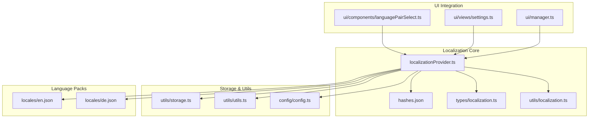
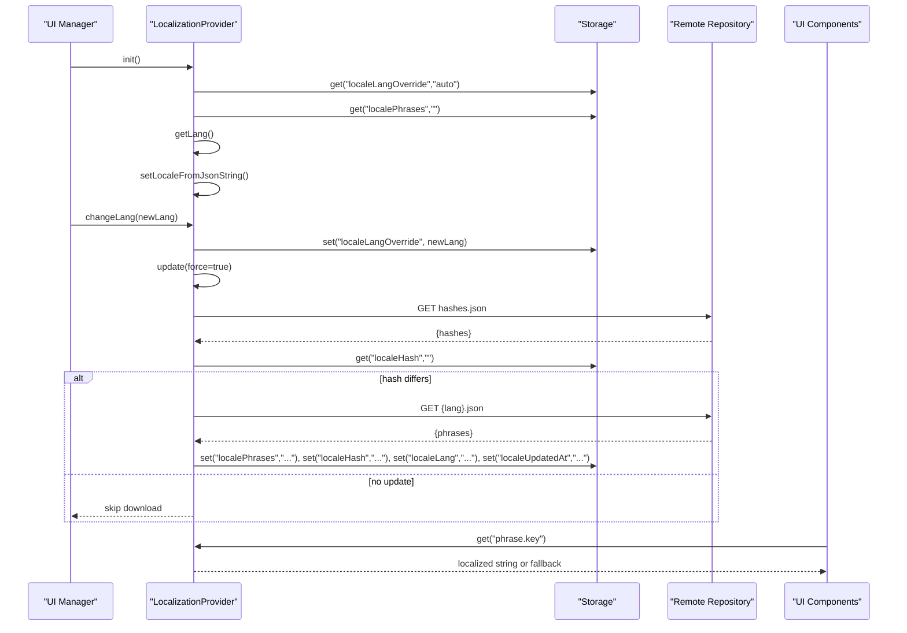
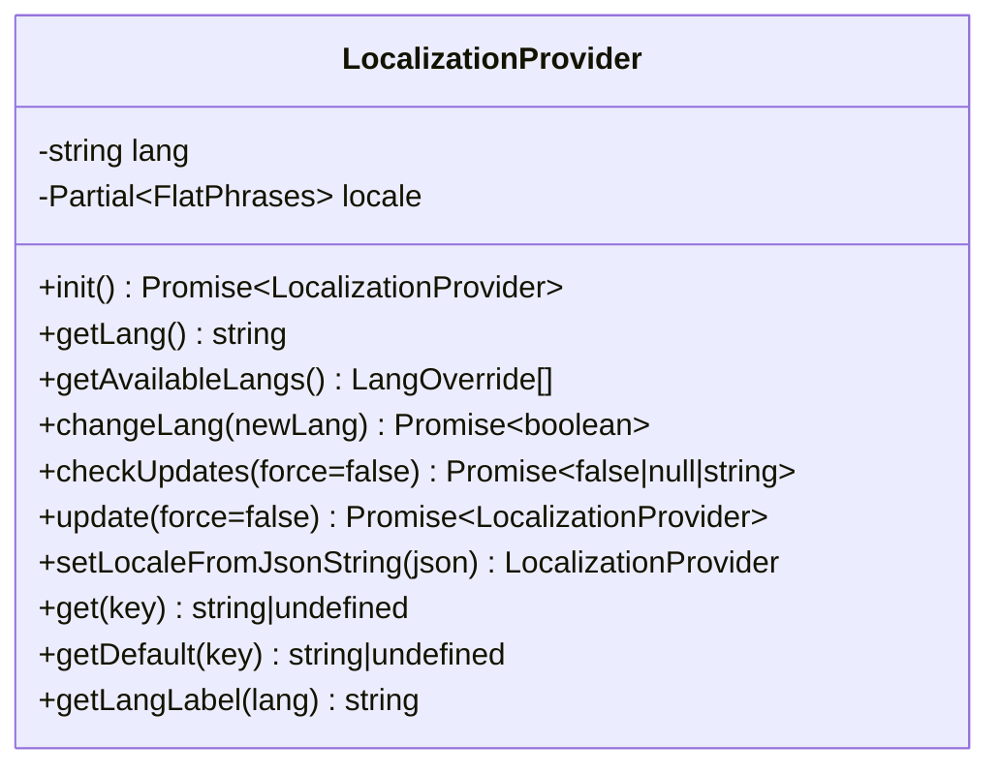
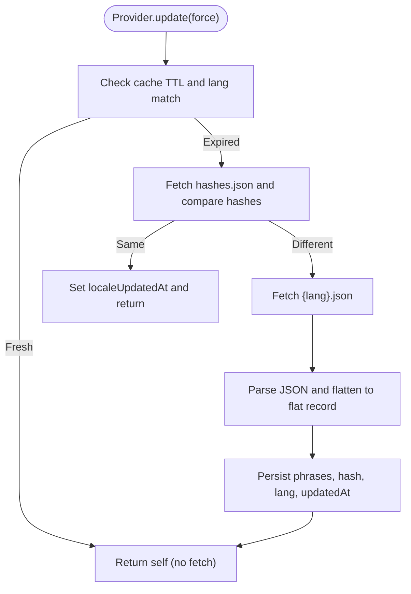
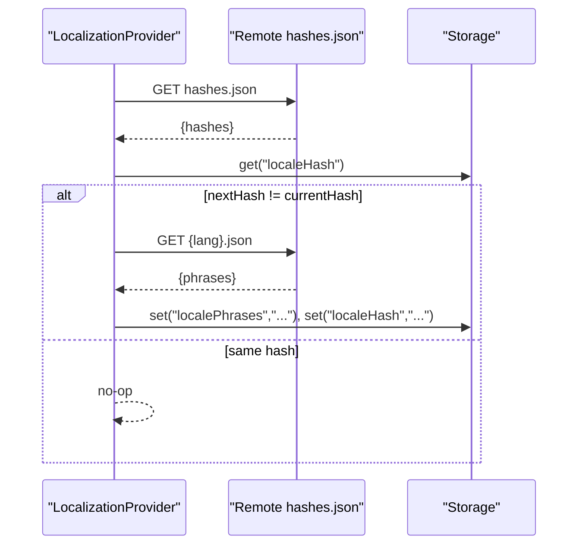
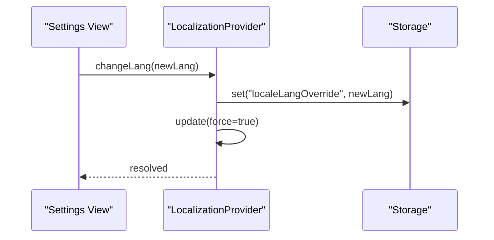
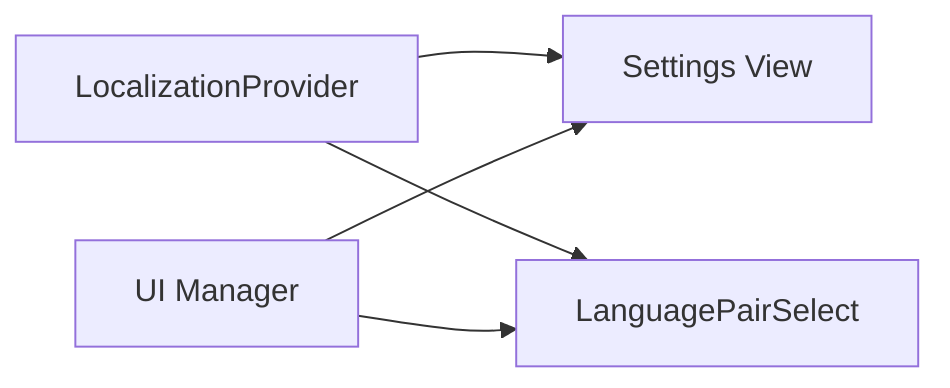
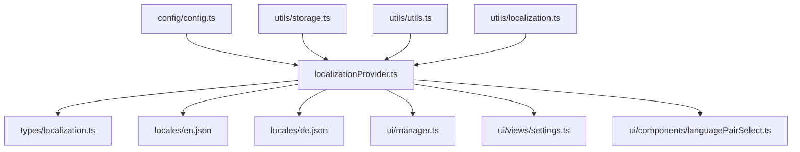

# Localization Configuration

<cite>
**Referenced Files in This Document**
- [localizationProvider.ts](file://src/localization/localizationProvider.ts)
- [hashes.json](file://src/localization/hashes.json)
- [localization.ts](file://src/types/localization.ts)
- [localization.ts](file://src/utils/localization.ts)
- [config.ts](file://src/config/config.ts)
- [storage.ts](file://src/utils/storage.ts)
- [utils.ts](file://src/utils/utils.ts)
- [languagePairSelect.ts](file://src/ui/components/languagePairSelect.ts)
- [settings.ts](file://src/ui/views/settings.ts)
- [manager.ts](file://src/ui/manager.ts)
- [en.json](file://src/localization/locales/en.json)
- [de.json](file://src/localization/locales/de.json)
- [l10n.config.json](file://l10n.config.json)
- [localization.test.ts](file://tests/localization.test.ts)
</cite>

## Table of Contents
1. [Introduction](#introduction)
2. [Project Structure](#project-structure)
3. [Core Components](#core-components)
4. [Architecture Overview](#architecture-overview)
5. [Detailed Component Analysis](#detailed-component-analysis)
6. [Dependency Analysis](#dependency-analysis)
7. [Performance Considerations](#performance-considerations)
8. [Troubleshooting Guide](#troubleshooting-guide)
9. [Conclusion](#conclusion)
10. [Appendices](#appendices)

## Introduction
This document explains the localization configuration system used by the application. It covers the localization provider architecture, language pack loading and caching, the hash-based invalidation mechanism for automatic updates, supported languages, dynamic language switching, locale-aware formatting, and the integration with the broader UI system. It also provides practical guidance for adding new languages, customizing translations, handling locale-specific content, performance considerations, and troubleshooting.

## Project Structure
The localization system is organized around a central provider that loads language packs from a remote repository, caches them locally, and exposes a simple API for retrieving localized strings. Supporting files include:
- A provider that manages language selection, caching, and updates
- A JSON manifest of language hashes for automatic updates
- Type definitions for locales, phrases, and flat phrase records
- Utility modules for storage, timestamps, and language detection
- UI components and views that consume localized strings
- Example language packs for English and German

**Diagram sources**
- [localizationProvider.ts:1-273](file://src/localization/localizationProvider.ts#L1-L273)
- [hashes.json:1-65](file://src/localization/hashes.json#L1-L65)
- [localization.ts:1-556](file://src/types/localization.ts#L1-L556)
- [localization.ts:1-36](file://src/utils/localization.ts#L1-L36)
- [storage.ts:1-380](file://src/utils/storage.ts#L1-L380)
- [utils.ts:1-350](file://src/utils/utils.ts#L1-L350)
- [config.ts:1-63](file://src/config/config.ts#L1-L63)
- [manager.ts:1-987](file://src/ui/manager.ts#L1-L987)
- [settings.ts:1-1367](file://src/ui/views/settings.ts#L1-L1367)
- [languagePairSelect.ts:1-111](file://src/ui/components/languagePairSelect.ts#L1-L111)
- [en.json:1-247](file://src/localization/locales/en.json#L1-L247)
- [de.json:1-246](file://src/localization/locales/de.json#L1-L246)

**Section sources**
- [localizationProvider.ts:1-273](file://src/localization/localizationProvider.ts#L1-L273)
- [hashes.json:1-65](file://src/localization/hashes.json#L1-L65)
- [localization.ts:1-556](file://src/types/localization.ts#L1-L556)
- [localization.ts:1-36](file://src/utils/localization.ts#L1-L36)
- [storage.ts:1-380](file://src/utils/storage.ts#L1-L380)
- [utils.ts:1-350](file://src/utils/utils.ts#L1-L350)
- [config.ts:1-63](file://src/config/config.ts#L1-L63)
- [manager.ts:1-987](file://src/ui/manager.ts#L1-L987)
- [settings.ts:1-1367](file://src/ui/views/settings.ts#L1-L1367)
- [languagePairSelect.ts:1-111](file://src/ui/components/languagePairSelect.ts#L1-L111)
- [en.json:1-247](file://src/localization/locales/en.json#L1-L247)
- [de.json:1-246](file://src/localization/locales/de.json#L1-L246)

## Core Components
- LocalizationProvider: Central class managing language selection, loading, caching, and updating of language packs. It exposes methods to initialize, change language, check for updates, and retrieve localized strings.
- Language packs: JSON files per locale containing key-value phrase mappings. The provider flattens nested structures into a flat record for fast lookup.
- Hash manifest: A JSON file mapping locale codes to checksums used for automatic updates.
- Types: Strongly typed locale and phrase definitions, including a flat phrase record type for efficient lookups.
- Storage: Persistent storage of locale-related keys including the current phrases, language code, hash, update timestamp, and language override.
- UI integration: Components and views that render localized strings and react to language changes.

Key responsibilities:
- Dynamic language switching via UI controls
- Automatic updates using hash-based invalidation
- Caching with TTL to reduce network usage
- Graceful fallback to default locale when keys are missing
- Locale-aware rendering in UI components

**Section sources**
- [localizationProvider.ts:39-273](file://src/localization/localizationProvider.ts#L39-L273)
- [hashes.json:1-65](file://src/localization/hashes.json#L1-L65)
- [localization.ts:66-556](file://src/types/localization.ts#L66-L556)
- [storage.ts:7-135](file://src/utils/storage.ts#L7-L135)

## Architecture Overview
The localization system follows a client-side caching and update pattern:
- On initialization, the provider reads persisted state and determines the effective language (auto-detected or overridden).
- It loads the current language pack from the configured repository URL and stores it as a JSON string.
- Periodically or on demand, it checks the remote hash manifest to detect updates.
- When a newer hash is detected, it downloads the updated language pack and persists it.
- UI components retrieve localized strings through the provider’s getter methods, falling back to default locale phrases when keys are missing.

**Diagram sources**
- [localizationProvider.ts:63-185](file://src/localization/localizationProvider.ts#L63-L185)
- [storage.ts:271-364](file://src/utils/storage.ts#L271-L364)
- [manager.ts:673-733](file://src/ui/manager.ts#L673-L733)
- [settings.ts:426-428](file://src/ui/views/settings.ts#L426-L428)

## Detailed Component Analysis

### LocalizationProvider
Responsibilities:
- Initialize provider state from storage
- Determine effective language (auto vs overridden)
- Load and parse language packs
- Manage cache TTL and update checks
- Provide getters for localized strings with fallback
- Expose methods to change language and force updates

Implementation highlights:
- Uses a stable timestamp-based cache-busting query parameter to bypass CDN caches when forced.
- Stores language pack as a JSON string to maintain a single storage format across environments.
- Maintains a set of warned missing keys to avoid repeated warnings.
- Provides a lazy-ready promise for non-top-level-await environments.

**Diagram sources**
- [localizationProvider.ts:39-273](file://src/localization/localizationProvider.ts#L39-L273)

**Section sources**
- [localizationProvider.ts:58-185](file://src/localization/localizationProvider.ts#L58-L185)
- [localizationProvider.ts:187-258](file://src/localization/localizationProvider.ts#L187-L258)

### Language Pack Loading and Caching
- Language packs are loaded from a configurable base URL and branch.
- The provider flattens nested phrase objects into a flat record for O(1) lookups.
- Cache TTL prevents frequent network requests; updates are validated via hash comparison.
- On transient network failures during updates, the provider preserves the last successful update time to avoid unnecessary retries.

**Diagram sources**
- [localizationProvider.ts:136-185](file://src/localization/localizationProvider.ts#L136-L185)
- [utils.ts:309-334](file://src/utils/utils.ts#L309-L334)

**Section sources**
- [localizationProvider.ts:91-185](file://src/localization/localizationProvider.ts#L91-L185)
- [utils.ts:298-334](file://src/utils/utils.ts#L298-L334)

### Hash-Based Invalidation System
- A remote manifest maps each locale to a hash string.
- The provider compares the remote hash with the locally stored hash.
- If hashes differ, the provider downloads the updated language pack and persists it.
- The process is resilient to transient network errors and preserves update timestamps.

**Diagram sources**
- [localizationProvider.ts:109-185](file://src/localization/localizationProvider.ts#L109-L185)
- [hashes.json:1-65](file://src/localization/hashes.json#L1-L65)

**Section sources**
- [localizationProvider.ts:109-185](file://src/localization/localizationProvider.ts#L109-L185)
- [hashes.json:1-65](file://src/localization/hashes.json#L1-L65)

### Supported Languages and Dynamic Language Switching
- Available locales are derived from a build-time configuration and always include an “auto” option.
- The provider exposes a method to retrieve available languages for UI selection.
- Language switching updates persistent overrides and triggers a forced update to fetch the new language pack.

**Diagram sources**
- [settings.ts:769-780](file://src/ui/views/settings.ts#L769-L780)
- [localizationProvider.ts:96-107](file://src/localization/localizationProvider.ts#L96-L107)

**Section sources**
- [localizationProvider.ts:25-84](file://src/localization/localizationProvider.ts#L25-L84)
- [settings.ts:769-780](file://src/ui/views/settings.ts#L769-L780)

### Locale-Aware Formatting and UI Integration
- UI components retrieve localized strings for labels, placeholders, and tooltips.
- Some UI logic depends on the current locale (e.g., hiding certain controls for specific locales).
- The UI manager supports reloading the menu after language changes to preserve overlay state and re-bind interactions.

**Diagram sources**
- [settings.ts:311-800](file://src/ui/views/settings.ts#L311-L800)
- [languagePairSelect.ts:31-63](file://src/ui/components/languagePairSelect.ts#L31-L63)
- [manager.ts:673-733](file://src/ui/manager.ts#L673-L733)

**Section sources**
- [settings.ts:311-800](file://src/ui/views/settings.ts#L311-L800)
- [languagePairSelect.ts:31-63](file://src/ui/components/languagePairSelect.ts#L31-L63)
- [manager.ts:673-733](file://src/ui/manager.ts#L673-L733)

### Practical Examples

- Adding a new language
  - Add a new locale file under the locales directory with the appropriate language code.
  - Update the build configuration to include the new locale in the available locales list.
  - Provide a hash for the new locale in the hashes manifest.
  - Verify the UI language selector reflects the new language.

- Customizing existing translations
  - Modify the corresponding key in the target locale file.
  - Ensure the key exists in the default locale to prevent missing key warnings.
  - Confirm the UI renders the updated text after a cache refresh or language switch.

- Handling locale-specific content
  - Use the provider’s getters to retrieve localized strings in UI components.
  - For locale-dependent UI behavior, gate features based on the current locale.

**Section sources**
- [l10n.config.json:1-9](file://l10n.config.json#L1-L9)
- [hashes.json:1-65](file://src/localization/hashes.json#L1-L65)
- [en.json:1-247](file://src/localization/locales/en.json#L1-L247)
- [de.json:1-246](file://src/localization/locales/de.json#L1-L246)

## Dependency Analysis
The localization system integrates with several subsystems:
- Configuration: Base URLs and repository branch are configured centrally.
- Storage: Persistent keys for locale state and metadata.
- Utilities: Timestamp generation, stable stringification, and language detection helpers.
- UI: Components depend on the provider for localized strings and react to language changes.

**Diagram sources**
- [config.ts:29-31](file://src/config/config.ts#L29-L31)
- [storage.ts:204-380](file://src/utils/storage.ts#L204-L380)
- [utils.ts:298-334](file://src/utils/utils.ts#L298-L334)
- [localization.ts:1-36](file://src/utils/localization.ts#L1-L36)
- [localizationProvider.ts:1-273](file://src/localization/localizationProvider.ts#L1-L273)
- [localization.ts:1-556](file://src/types/localization.ts#L1-L556)
- [en.json:1-247](file://src/localization/locales/en.json#L1-L247)
- [de.json:1-246](file://src/localization/locales/de.json#L1-L246)
- [manager.ts:1-987](file://src/ui/manager.ts#L1-L987)
- [settings.ts:1-1367](file://src/ui/views/settings.ts#L1-L1367)
- [languagePairSelect.ts:1-111](file://src/ui/components/languagePairSelect.ts#L1-L111)

**Section sources**
- [config.ts:29-31](file://src/config/config.ts#L29-L31)
- [storage.ts:204-380](file://src/utils/storage.ts#L204-L380)
- [utils.ts:298-334](file://src/utils/utils.ts#L298-L334)
- [localization.ts:1-36](file://src/utils/localization.ts#L1-L36)
- [localizationProvider.ts:1-273](file://src/localization/localizationProvider.ts#L1-L273)

## Performance Considerations
- Cache TTL: Language packs are cached for a fixed period to minimize network requests. Adjust TTL based on update frequency needs.
- Hash-based updates: Only downloads updated packs when hashes differ, reducing bandwidth.
- Flat phrase records: Flattening nested structures enables O(1) lookups and reduces parsing overhead.
- Lazy initialization: The provider supports lazy readiness to avoid blocking startup in script environments.
- Network resilience: Transient failures during updates do not overwrite timestamps, allowing immediate retries.

Recommendations:
- Monitor network usage and adjust cache TTL for frequently changing locales.
- Use the hash manifest to enforce timely updates without manual intervention.
- Avoid excessively large language packs; consider splitting or optimizing nested structures.

[No sources needed since this section provides general guidance]

## Troubleshooting Guide
Common issues and resolutions:
- Missing translations
  - The provider logs warnings for missing keys and falls back to the default locale. Ensure keys exist in the default locale and are present in the target locale pack.
  - Verify the language pack was successfully downloaded and persisted.

- Language switching problems
  - Confirm the language override is persisted and the provider is re-initialized after changes.
  - Trigger a forced update to refresh the language pack.

- Update failures
  - Transient network errors are handled gracefully; the provider preserves the last update timestamp to avoid repeated failures.
  - Manually trigger an update or clear locale state to reset the provider.

- Locale-specific UI behavior
  - Some UI controls are hidden or adjusted based on the current locale. Verify locale detection and ensure the correct language pack is loaded.

**Section sources**
- [localizationProvider.ts:220-238](file://src/localization/localizationProvider.ts#L220-L238)
- [localizationProvider.ts:152-156](file://src/localization/localizationProvider.ts#L152-L156)
- [manager.ts:673-733](file://src/ui/manager.ts#L673-L733)

## Conclusion
The localization configuration system provides a robust, automated mechanism for managing language packs with minimal maintenance. Its hash-based invalidation, caching strategy, and strong typing ensure reliable, performant, and extensible internationalization. Integration with the UI is straightforward, enabling dynamic language switching and locale-aware rendering across components.

[No sources needed since this section summarizes without analyzing specific files]

## Appendices

### Supported Locales Reference
The system supports a broad set of locales, including major world languages and regional variants. The exact list is defined by the types and manifests.

**Section sources**
- [localization.ts:2-64](file://src/types/localization.ts#L2-L64)
- [hashes.json:1-65](file://src/localization/hashes.json#L1-L65)

### Example Language Packs
- English (default): Comprehensive phrase set suitable for fallback and baseline.
- German: Representative example of a localized pack with similar structure.

**Section sources**
- [en.json:1-247](file://src/localization/locales/en.json#L1-L247)
- [de.json:1-246](file://src/localization/locales/de.json#L1-L246)

### Tests Demonstrating Localization Behavior
- Tests illustrate how localized strings are retrieved and formatted, including pluralization and placeholder substitution.

**Section sources**
- [localization.test.ts:1-79](file://tests/localization.test.ts#L1-L79)