# Styling & Theme Customization

<cite>
**Referenced Files in This Document**
- [main.scss](file://src/styles/main.scss)
- [_mixins.scss](file://src/styles/_mixins.scss)
- [buttons/_mixins.scss](file://src/styles/components/buttons/_mixins.scss)
- [buttons/contained.scss](file://src/styles/components/buttons/contained.scss)
- [buttons/outlined.scss](file://src/styles/components/buttons/outlined.scss)
- [buttons/text.scss](file://src/styles/components/buttons/text.scss)
- [buttons/icon.scss](file://src/styles/components/buttons/icon.scss)
- [buttons/hotkey.scss](file://src/styles/components/buttons/hotkey.scss)
- [textfield.scss](file://src/styles/components/textfield.scss)
- [checkbox.scss](file://src/styles/components/checkbox.scss)
- [select.scss](file://src/styles/components/select.scss)
- [slider.scss](file://src/styles/components/slider.scss)
- [dialog.scss](file://src/styles/components/dialog.scss)
- [menu.scss](file://src/styles/components/menu.scss)
- [subtitles.scss](file://src/styles/subtitles.scss)
- [langLearn.scss](file://src/styles/langLearn.scss)
</cite>

## Table of Contents
1. [Introduction](#introduction)
2. [Project Structure](#project-structure)
3. [Core Components](#core-components)
4. [Architecture Overview](#architecture-overview)
5. [Detailed Component Analysis](#detailed-component-analysis)
6. [Dependency Analysis](#dependency-analysis)
7. [Performance Considerations](#performance-considerations)
8. [Troubleshooting Guide](#troubleshooting-guide)
9. [Conclusion](#conclusion)
10. [Appendices](#appendices)

## Introduction
This document explains how the project’s styling and theme system works, focusing on the SCSS architecture, CSS custom properties, component-specific patterns, and accessibility. It provides practical guidance for customizing colors, fonts, spacing, and layout, along with strategies for maintaining custom styles during updates and resolving conflicts.

## Project Structure
The styling system is organized around a central stylesheet that defines design tokens and global baseline styles, and a modular component library. Tokens are exposed as CSS custom properties on the root element and consumed throughout components. Utility mixins encapsulate cross-cutting concerns like typography and overlay scrollbars. Component styles are grouped by feature and use shared mixins and tokens to maintain consistency.

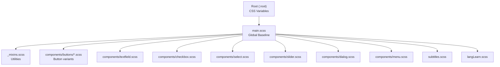

**Diagram sources**
- [main.scss:27-74](file://src/styles/main.scss#L27-L74)
- [main.scss:1-25](file://src/styles/main.scss#L1-L25)
- [langLearn.scss:1-18](file://src/styles/langLearn.scss#L1-L18)

**Section sources**
- [main.scss:1-180](file://src/styles/main.scss#L1-L180)

## Core Components
- Design tokens: Centralized via CSS custom properties on :root for colors, spacing, radii, shadows, transitions, and focus rings.
- Global baseline: Ensures consistent box-sizing, typography, focus handling, and overlay stacking.
- Component mixins: Shared helpers for typography, overlay scrollbars, and hidden attribute handling.
- Component styles: Modular SCSS modules per UI control, consuming tokens and mixins.

Key customization entry points:
- Override CSS variables on :root to change theme-wide values.
- Target component classes to adjust sizes, colors, and layout.
- Use mixins to replicate consistent patterns across custom components.

**Section sources**
- [main.scss:27-74](file://src/styles/main.scss#L27-L74)
- [_mixins.scss:1-44](file://src/styles/_mixins.scss#L1-L44)

## Architecture Overview
The system separates concerns:
- Tokens define the palette and rhythm.
- Global baseline ensures consistent rendering and accessibility behavior.
- Components encapsulate variant styles and interaction states.
- Utilities provide reusable patterns for common tasks.

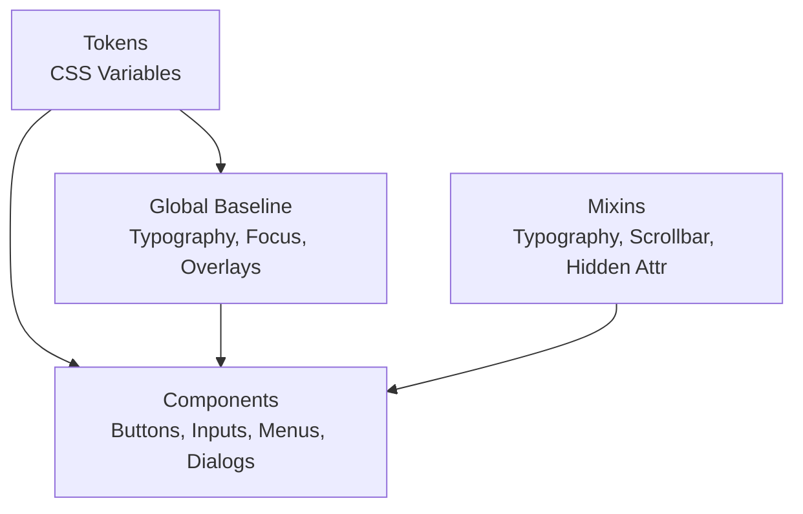

**Diagram sources**
- [main.scss:27-180](file://src/styles/main.scss#L27-L180)
- [_mixins.scss:7-44](file://src/styles/_mixins.scss#L7-L44)
- [buttons/_mixins.scss:3-80](file://src/styles/components/buttons/_mixins.scss#L3-L80)

## Detailed Component Analysis

### Button System
The button system uses a shared mixin to define base layout and typography, then augments it with layered hover/active effects and variant styles. Each variant consumes the same base and mixins, ensuring consistent motion and interaction.

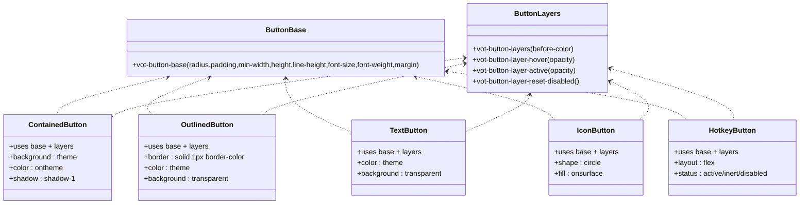

**Diagram sources**
- [buttons/_mixins.scss:3-80](file://src/styles/components/buttons/_mixins.scss#L3-L80)
- [buttons/contained.scss:3-44](file://src/styles/components/buttons/contained.scss#L3-L44)
- [buttons/outlined.scss:3-30](file://src/styles/components/buttons/outlined.scss#L3-L30)
- [buttons/text.scss:3-30](file://src/styles/components/buttons/text.scss#L3-L30)
- [buttons/icon.scss:3-36](file://src/styles/components/buttons/icon.scss#L3-L36)
- [buttons/hotkey.scss:17-53](file://src/styles/components/buttons/hotkey.scss#L17-L53)

Practical customization tips:
- Change primary color scheme by overriding theme variables on :root.
- Adjust button sizes by setting token variables for radius, spacing, and height.
- Modify hover/active effects by tuning transition durations and easing tokens.

**Section sources**
- [buttons/_mixins.scss:3-80](file://src/styles/components/buttons/_mixins.scss#L3-L80)
- [buttons/contained.scss:3-44](file://src/styles/components/buttons/contained.scss#L3-L44)
- [buttons/outlined.scss:3-30](file://src/styles/components/buttons/outlined.scss#L3-L30)
- [buttons/text.scss:3-30](file://src/styles/components/buttons/text.scss#L3-L30)
- [buttons/icon.scss:3-36](file://src/styles/components/buttons/icon.scss#L3-L36)
- [buttons/hotkey.scss:17-53](file://src/styles/components/buttons/hotkey.scss#L17-L53)

### Text Field
Text field styling emphasizes clean borders, placeholder behavior, and focused state highlighting. It includes Safari-specific adjustments and uses helper variables for consistent theming.

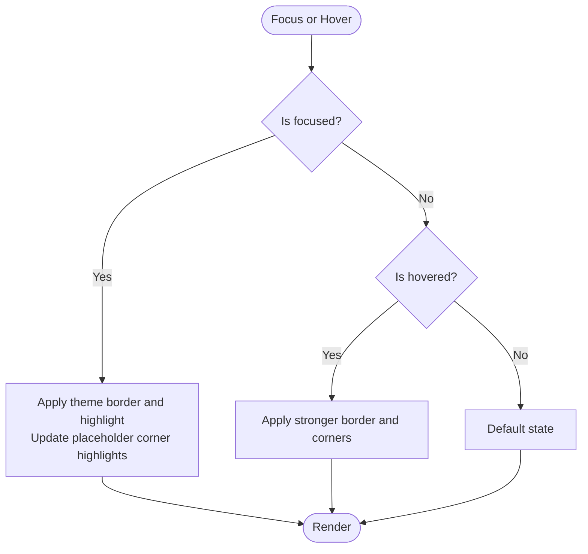

**Diagram sources**
- [textfield.scss:156-174](file://src/styles/components/textfield.scss#L156-L174)
- [textfield.scss:139-154](file://src/styles/components/textfield.scss#L139-L154)

Customization guidance:
- Adjust focus color by overriding the theme variable used by the component.
- Fine-tune placeholder and corner visuals by tweaking helper variables.
- For Safari-specific transitions, rely on the included media query targeting.

**Section sources**
- [textfield.scss:1-224](file://src/styles/components/textfield.scss#L1-L224)

### Checkbox
Checkbox styling focuses on precise geometry, ripple-like hover effect, and accessible focus indicators. Disabled and indeterminate states are explicitly handled.

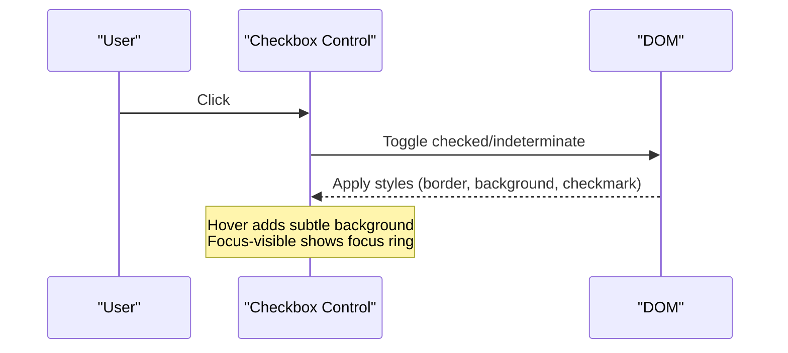

**Diagram sources**
- [checkbox.scss:105-128](file://src/styles/components/checkbox.scss#L105-L128)
- [checkbox.scss:179-189](file://src/styles/components/checkbox.scss#L179-L189)

Customization guidance:
- Change the theme color by overriding the theme variables.
- Adjust label offset and sizing via the dedicated token.
- Preserve focus visibility by keeping the global keyboard navigation rules intact.

**Section sources**
- [checkbox.scss:1-190](file://src/styles/components/checkbox.scss#L1-L190)

### Select
Select combines a label area with a dropdown list. It manages disabled states, selection highlighting, and hover states for items.

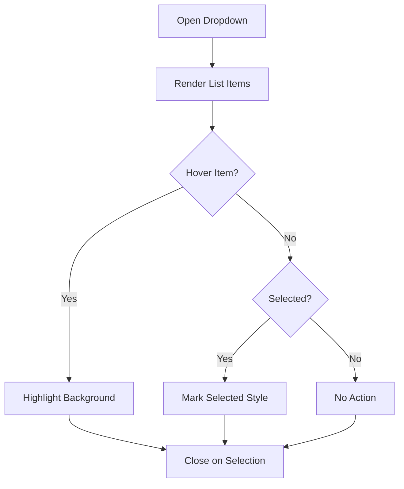

**Diagram sources**
- [select.scss:71-102](file://src/styles/components/select.scss#L71-L102)

Customization guidance:
- Control width and paddings via existing tokens and container constraints.
- Override selected item colors by adjusting theme variables.
- Keep arrow icon fill aligned with the component’s text color.

**Section sources**
- [select.scss:1-103](file://src/styles/components/select.scss#L1-L103)

### Slider
Slider provides a custom-styled range input with progress fill and distinct focus behavior for keyboard users.

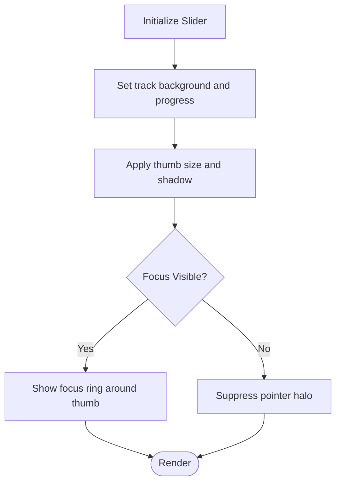

**Diagram sources**
- [slider.scss:72-81](file://src/styles/components/slider.scss#L72-L81)
- [slider.scss:169-181](file://src/styles/components/slider.scss#L169-L181)

Customization guidance:
- Tune progress and track colors via theme variables.
- Adjust thumb scaling and focus ring via component-specific tokens.
- Respect pointer vs keyboard focus behavior to maintain accessibility.

**Section sources**
- [slider.scss:1-184](file://src/styles/components/slider.scss#L1-L184)

### Dialog and Menu
Dialog and menu share a common overlay pattern: surface color, border, radius, shadow, and scrollbars. They also implement hidden-state animations and responsive footers.

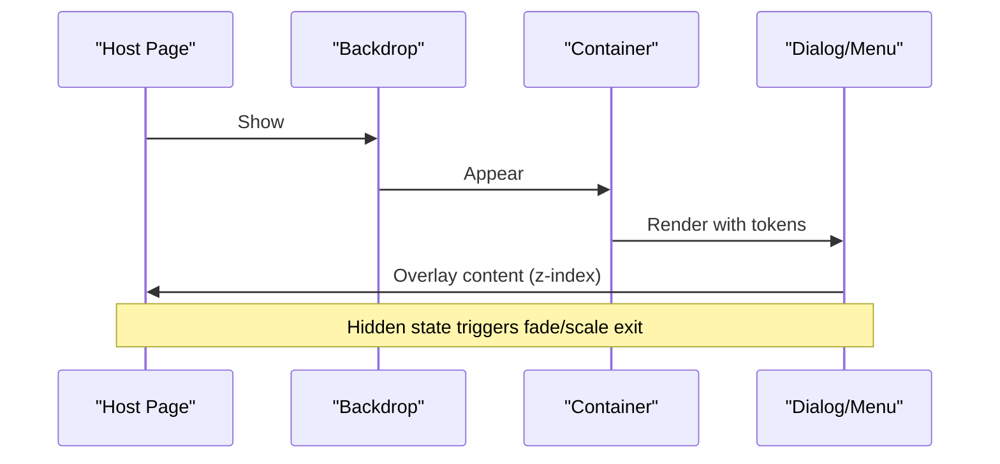

**Diagram sources**
- [dialog.scss:77-92](file://src/styles/components/dialog.scss#L77-L92)
- [menu.scss:41-47](file://src/styles/components/menu.scss#L41-L47)

Customization guidance:
- Adjust max widths, heights, and margins via CSS variables.
- Override surface and on-surface colors to match brand palettes.
- Use the shared overlay scrollbar mixin for consistent scrollbars.

**Section sources**
- [dialog.scss:1-184](file://src/styles/components/dialog.scss#L1-L184)
- [menu.scss:1-138](file://src/styles/components/menu.scss#L1-L138)

### Subtitles
Subtitles define typography and layout tokens, background, and hover/selection states. They also include fullscreen scaling and safe-area adjustments.

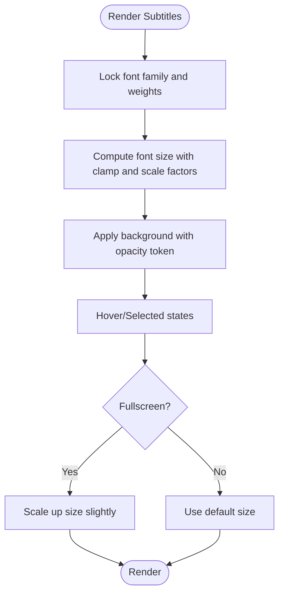

**Diagram sources**
- [subtitles.scss:47-57](file://src/styles/components/subtitles.scss#L47-L57)
- [subtitles.scss:12-16](file://src/styles/components/subtitles.scss#L12-L16)
- [subtitles.scss:199-209](file://src/styles/components/subtitles.scss#L199-L209)

Customization guidance:
- Adjust background opacity and colors via subtitle-specific tokens.
- Control font size ranges and scaling via clamp and scale compensation variables.
- Override text shadows and line-height for readability.

**Section sources**
- [subtitles.scss:1-215](file://src/styles/components/subtitles.scss#L1-L215)

### Language Learning Panel
The language learning panel demonstrates advanced theming with backdrop blur, borders, and a cohesive color scheme.

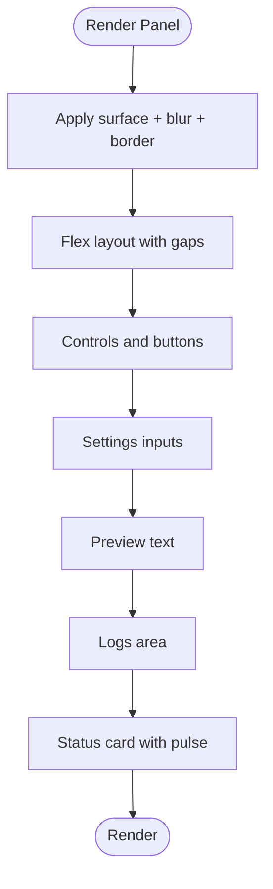

**Diagram sources**
- [langLearn.scss:1-18](file://src/styles/langLearn.scss#L1-L18)
- [langLearn.scss:193-228](file://src/styles/langLearn.scss#L193-L228)

Customization guidance:
- Change the panel background and border by overriding surface and primary tokens.
- Adjust spacing and typography tokens to fit your design system.
- Extend the logs and preview areas by adding new classes and leveraging existing tokens.

**Section sources**
- [langLearn.scss:1-357](file://src/styles/langLearn.scss#L1-L357)

## Dependency Analysis
The styling system exhibits low coupling and high cohesion:
- Components depend on shared mixins and tokens.
- Global baseline depends on tokens and sets accessibility behaviors.
- Utilities are reused across components.

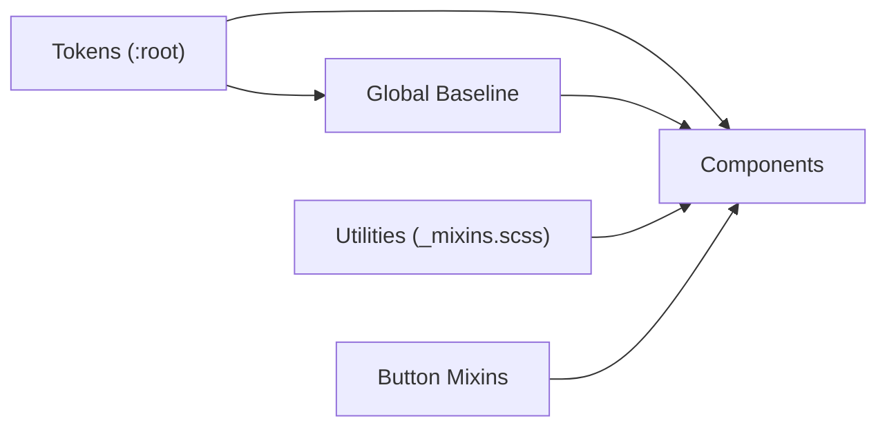

**Diagram sources**
- [main.scss:27-180](file://src/styles/main.scss#L27-L180)
- [_mixins.scss:1-44](file://src/styles/_mixins.scss#L1-L44)
- [buttons/_mixins.scss:1-2](file://src/styles/components/buttons/_mixins.scss#L1-L2)

**Section sources**
- [main.scss:27-180](file://src/styles/main.scss#L27-L180)
- [_mixins.scss:1-44](file://src/styles/_mixins.scss#L1-L44)
- [buttons/_mixins.scss:1-2](file://src/styles/components/buttons/_mixins.scss#L1-L2)

## Performance Considerations
- CSS variables minimize repaints by centralizing color and spacing changes.
- Minimizing heavy shadows and blurs reduces GPU load; use tokens to tune intensity.
- Favor contain and isolation on overlays to limit layout and paint recalculation.
- Avoid excessive use of expensive selectors; prefer class-based targeting.

[No sources needed since this section provides general guidance]

## Troubleshooting Guide
Common issues and resolutions:
- Host page overrides: The global baseline uses high specificity and !important to resist host CSS. If styles still leak, increase specificity or scope styles to the injected UI namespace.
- Focus visibility: Ensure the global keyboard navigation class is toggled so focus rings appear for keyboard users.
- Reduced motion: The global baseline respects prefers-reduced-motion; verify animations remain usable under this constraint.
- Safari transitions: The text field includes a Safari-specific media query for smoother transitions; confirm it remains effective after customizations.
- Disabled states: Verify disabled buttons and inputs still reflect appropriate opacity and colors via the reset mixins.

**Section sources**
- [main.scss:158-169](file://src/styles/main.scss#L158-L169)
- [textfield.scss:209-223](file://src/styles/components/textfield.scss#L209-L223)
- [checkbox.scss:179-189](file://src/styles/components/checkbox.scss#L179-L189)

## Conclusion
The styling system is built around a robust set of CSS variables and shared mixins, enabling consistent theming and easy customization. By overriding tokens and leveraging component classes, teams can adapt colors, typography, spacing, and layout to meet brand requirements while preserving accessibility and performance.

[No sources needed since this section summarizes without analyzing specific files]

## Appendices

### Practical Customization Scenarios
- Change color scheme:
  - Override theme variables on :root to update primary, on-primary, surface, and on-surface tokens.
  - Confirm component variants consume the theme variables consistently.
- Adjust typography:
  - Modify the font family token and related weights to align with brand guidelines.
  - For subtitles, adjust font size clamp and scale compensation tokens.
- Modify component sizes:
  - Tune radius, spacing, and height tokens to scale buttons and form controls.
- Create a dark theme:
  - Switch surface and on-surface tokens to darker values; ensure contrast meets accessibility thresholds.
- Responsive adjustments:
  - Use media queries to alter widths, paddings, and font sizes for smaller screens.

Maintaining custom styles during updates:
- Keep custom overrides in a separate stylesheet that loads after the main bundle.
- Scope overrides to the injected UI namespace to avoid conflicts.
- Pin token names and class names to minimize churn when upgrading.

Browser compatibility:
- The code targets modern browsers and includes fallbacks for focus-visible and reduced motion.
- For older browsers, test focus rings and transitions; consider polyfills if needed.

Accessibility:
- Preserve focus-visible behavior and ensure sufficient contrast.
- Avoid removing focus indicators for keyboard navigation.
- Test with assistive technologies and screen readers.

**Section sources**
- [main.scss:27-180](file://src/styles/main.scss#L27-L180)
- [subtitles.scss:47-57](file://src/styles/components/subtitles.scss#L47-L57)
- [textfield.scss:156-174](file://src/styles/components/textfield.scss#L156-L174)
- [checkbox.scss:179-189](file://src/styles/components/checkbox.scss#L179-L189)
- [slider.scss:169-181](file://src/styles/components/slider.scss#L169-L181)