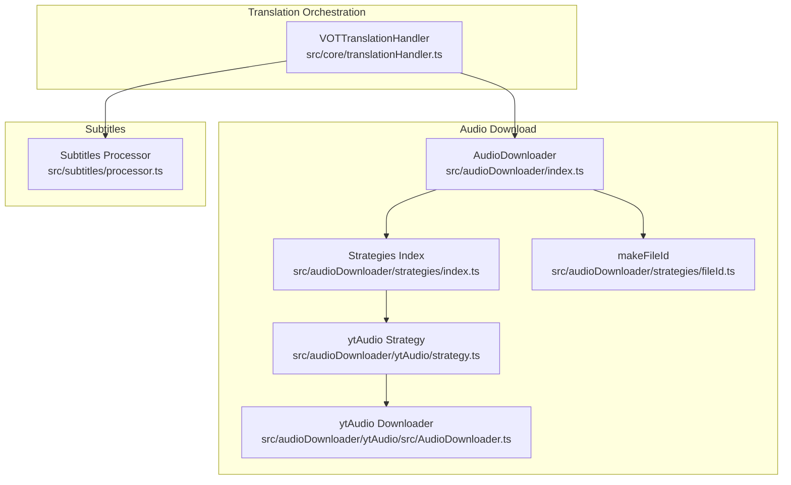
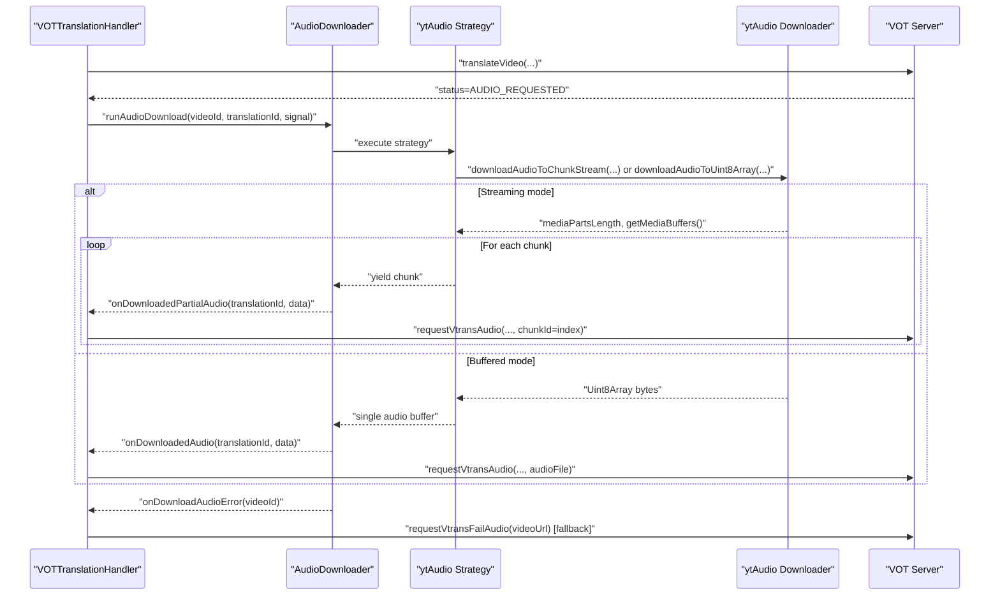
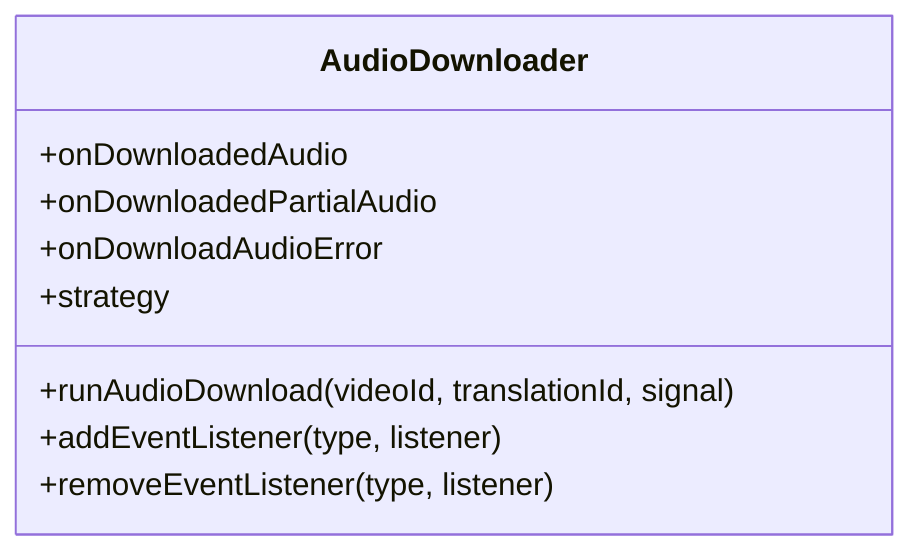
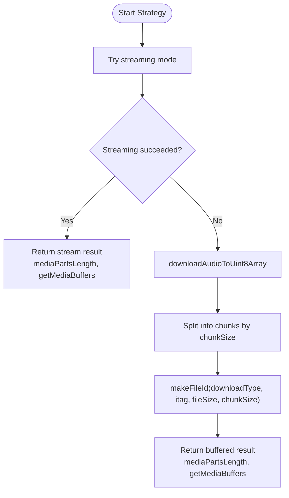
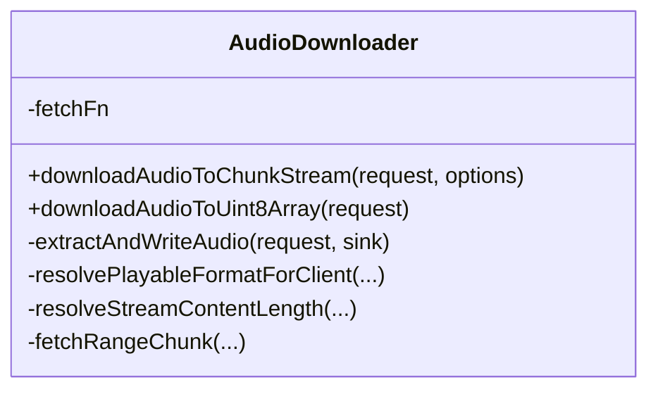
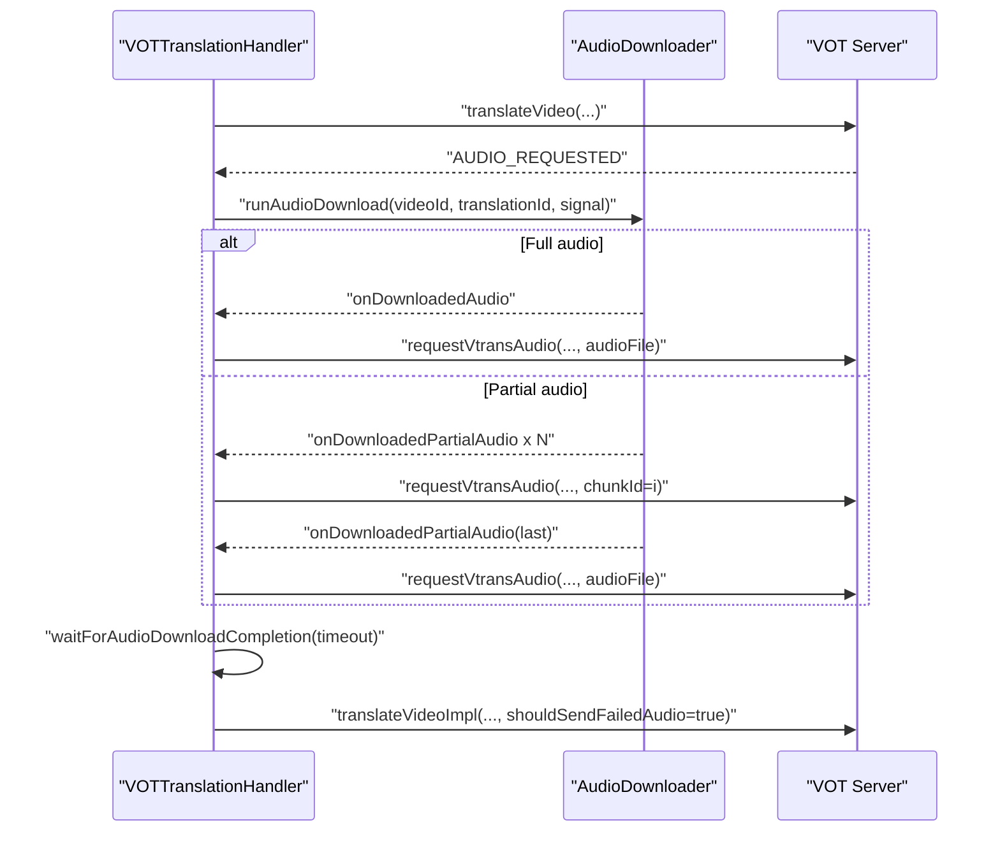
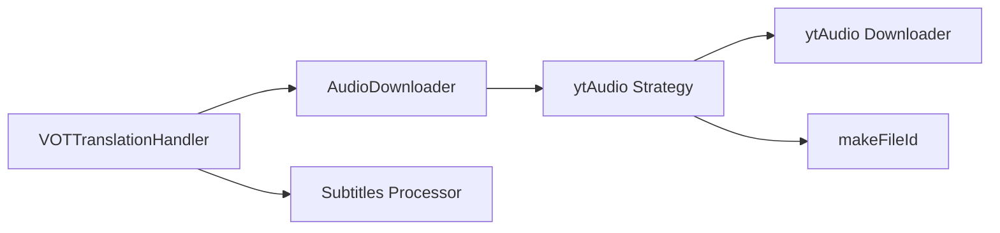

# Audio Download Integration

<cite>
**Referenced Files in This Document**
- [src/audioDownloader/index.ts](file://src/audioDownloader/index.ts)
- [src/audioDownloader/README.md](file://src/audioDownloader/README.md)
- [src/audioDownloader/strategies/index.ts](file://src/audioDownloader/strategies/index.ts)
- [src/audioDownloader/strategies/fileId.ts](file://src/audioDownloader/strategies/fileId.ts)
- [src/audioDownloader/ytAudio/strategy.ts](file://src/audioDownloader/ytAudio/strategy.ts)
- [src/audioDownloader/ytAudio/index.ts](file://src/audioDownloader/ytAudio/index.ts)
- [src/audioDownloader/ytAudio/src/AudioDownloader.ts](file://src/audioDownloader/ytAudio/src/AudioDownloader.ts)
- [src/audioDownloader/ytAudio/src/internal/format-selection.ts](file://src/audioDownloader/ytAudio/src/internal/format-selection.ts)
- [src/types/audioDownloader.ts](file://src/types/audioDownloader.ts)
- [src/core/translationHandler.ts](file://src/core/translationHandler.ts)
- [src/subtitles/processor.ts](file://src/subtitles/processor.ts)
</cite>

## Table of Contents
1. [Introduction](#introduction)
2. [Project Structure](#project-structure)
3. [Core Components](#core-components)
4. [Architecture Overview](#architecture-overview)
5. [Detailed Component Analysis](#detailed-component-analysis)
6. [Dependency Analysis](#dependency-analysis)
7. [Performance Considerations](#performance-considerations)
8. [Troubleshooting Guide](#troubleshooting-guide)
9. [Conclusion](#conclusion)

## Introduction
This document explains the audio download integration with the synchronization system. It covers how the system selects a download strategy, coordinates chunked downloads, handles fallbacks, integrates download completion with playback initiation, manages queues and priorities, cleans up resources, coordinates with translation requests, aligns subtitles timing, and manages playback buffers. It also includes examples of progress tracking, error handling, retry logic, performance optimizations for large audio files, and network reliability considerations.

## Project Structure
The audio download subsystem is organized around a strategy-based AudioDownloader and a translation orchestrator that coordinates downloads with translation requests and playback.

**Diagram sources**
- [src/audioDownloader/index.ts:87-188](file://src/audioDownloader/index.ts#L87-L188)
- [src/audioDownloader/strategies/index.ts:1-10](file://src/audioDownloader/strategies/index.ts#L1-L10)
- [src/audioDownloader/ytAudio/strategy.ts:74-155](file://src/audioDownloader/ytAudio/strategy.ts#L74-L155)
- [src/audioDownloader/ytAudio/src/AudioDownloader.ts:357-667](file://src/audioDownloader/ytAudio/src/AudioDownloader.ts#L357-L667)
- [src/audioDownloader/strategies/fileId.ts:3-15](file://src/audioDownloader/strategies/fileId.ts#L3-L15)
- [src/core/translationHandler.ts:105-564](file://src/core/translationHandler.ts#L105-L564)
- [src/subtitles/processor.ts:632-800](file://src/subtitles/processor.ts#L632-L800)

**Section sources**
- [src/audioDownloader/index.ts:1-189](file://src/audioDownloader/index.ts#L1-L189)
- [src/audioDownloader/README.md:1-13](file://src/audioDownloader/README.md#L1-L13)
- [src/audioDownloader/strategies/index.ts:1-10](file://src/audioDownloader/strategies/index.ts#L1-L10)
- [src/audioDownloader/ytAudio/strategy.ts:74-155](file://src/audioDownloader/ytAudio/strategy.ts#L74-L155)
- [src/audioDownloader/ytAudio/src/AudioDownloader.ts:357-667](file://src/audioDownloader/ytAudio/src/AudioDownloader.ts#L357-L667)
- [src/core/translationHandler.ts:105-564](file://src/core/translationHandler.ts#L105-L564)
- [src/subtitles/processor.ts:632-800](file://src/subtitles/processor.ts#L632-L800)

## Core Components
- AudioDownloader: Central class that runs downloads, emits partial/full audio events, and dispatches errors. It delegates strategy selection and execution to strategies and the ytAudio downloader.
- Strategies: A registry mapping strategy names to strategy functions. Currently includes ytAudio.
- ytAudio Strategy: Implements the ytAudio strategy, selecting formats, streaming or buffering, and splitting into chunks when needed.
- ytAudio Downloader: Performs YouTube audio extraction, resolves playable formats, supports range-based streaming, and falls back to full-buffered downloads.
- Translation Handler: Coordinates translation requests, triggers audio downloads when the server requests audio, waits for completion, and initiates playback after upload.
- Subtitles Processor: Provides subtitle processing and timing alignment utilities used alongside audio playback.

Key responsibilities:
- Strategy selection and execution
- Chunked download coordination and partial upload
- Fallback mechanisms (streaming vs buffered, ytAudio vs fail-audio-js)
- Integration with translation orchestration and playback
- Progress tracking via partial audio events
- Error propagation and UI-friendly error mapping

**Section sources**
- [src/audioDownloader/index.ts:87-188](file://src/audioDownloader/index.ts#L87-L188)
- [src/audioDownloader/strategies/index.ts:1-10](file://src/audioDownloader/strategies/index.ts#L1-L10)
- [src/audioDownloader/ytAudio/strategy.ts:74-155](file://src/audioDownloader/ytAudio/strategy.ts#L74-L155)
- [src/audioDownloader/ytAudio/src/AudioDownloader.ts:357-667](file://src/audioDownloader/ytAudio/src/AudioDownloader.ts#L357-L667)
- [src/core/translationHandler.ts:105-564](file://src/core/translationHandler.ts#L105-L564)
- [src/subtitles/processor.ts:632-800](file://src/subtitles/processor.ts#L632-L800)

## Architecture Overview
The system integrates audio download with translation and playback through a clear event-driven flow. The translation handler listens for server signals, starts the audio downloader, and coordinates uploads of full or partial audio. The downloader emits events for partial chunks and final audio, which the translation handler consumes to upload to the backend and finalize the translation.

**Diagram sources**
- [src/core/translationHandler.ts:416-444](file://src/core/translationHandler.ts#L416-L444)
- [src/audioDownloader/index.ts:103-125](file://src/audioDownloader/index.ts#L103-L125)
- [src/audioDownloader/ytAudio/strategy.ts:74-155](file://src/audioDownloader/ytAudio/strategy.ts#L74-L155)
- [src/audioDownloader/ytAudio/src/AudioDownloader.ts:513-608](file://src/audioDownloader/ytAudio/src/AudioDownloader.ts#L513-L608)

## Detailed Component Analysis

### AudioDownloader
Responsibilities:
- Run downloads with a given strategy
- Emit events for full audio and partial chunks
- Dispatch errors to listeners
- Manage event listeners registration/removal

Behavior highlights:
- Single-chunk fast-path: If mediaPartsLength is less than 2, emits a single full audio event.
- Multi-chunk path: Iterates an async generator of chunks and emits partial audio events with index and amount metadata.
- Error handling: Catches exceptions and dispatches an error event.

**Diagram sources**
- [src/audioDownloader/index.ts:87-188](file://src/audioDownloader/index.ts#L87-L188)

**Section sources**
- [src/audioDownloader/index.ts:87-188](file://src/audioDownloader/index.ts#L87-L188)

### Strategy Selection and Execution
- Strategy registry: Maps strategy names to functions.
- ytAudio strategy: Chooses a streaming mode when supported, otherwise falls back to buffered mode. It computes a file identifier based on download type, itag, file size, and chunk size.

**Diagram sources**
- [src/audioDownloader/ytAudio/strategy.ts:74-155](file://src/audioDownloader/ytAudio/strategy.ts#L74-L155)
- [src/audioDownloader/strategies/fileId.ts:3-15](file://src/audioDownloader/strategies/fileId.ts#L3-L15)

**Section sources**
- [src/audioDownloader/strategies/index.ts:1-10](file://src/audioDownloader/strategies/index.ts#L1-L10)
- [src/audioDownloader/ytAudio/strategy.ts:74-155](file://src/audioDownloader/ytAudio/strategy.ts#L74-L155)
- [src/audioDownloader/strategies/fileId.ts:3-15](file://src/audioDownloader/strategies/fileId.ts#L3-L15)

### ytAudio Downloader
Responsibilities:
- Resolve playable audio formats from YouTube player responses
- Support range-based streaming for chunked downloads
- Fallback to full-buffered downloads when streaming fails or is unsuitable
- Build client attempt order and handle probing for content length

Key behaviors:
- Client fallback order ensures robustness across YouTube clients.
- Range-based chunking with fallback to header-based range requests.
- Content-length probing with multiple fallbacks (query, header, hints).
- Audio-only format enforcement for chunked mode.

**Diagram sources**
- [src/audioDownloader/ytAudio/src/AudioDownloader.ts:357-667](file://src/audioDownloader/ytAudio/src/AudioDownloader.ts#L357-L667)

**Section sources**
- [src/audioDownloader/ytAudio/src/AudioDownloader.ts:357-667](file://src/audioDownloader/ytAudio/src/AudioDownloader.ts#L357-L667)

### Translation Handler Integration
Responsibilities:
- Trigger audio downloads when the server responds with AUDIO_REQUESTED
- Wait for download completion with a bounded timeout
- Upload full audio or partial chunks to the server
- Coordinate fallback to fail-audio-js for YouTube when appropriate
- Map server errors to user-friendly errors

Flow highlights:
- On AUDIO_REQUESTED, sets downloading flag, starts AudioDownloader, and waits for completion.
- On downloadedAudio: uploads full audio and finishes.
- On downloadedPartialAudio: uploads chunk with index and amount metadata; finishes when last chunk arrives.
- On downloadAudioError: applies fallback logic (fail-audio-js for YouTube) and finishes accordingly.

**Diagram sources**
- [src/core/translationHandler.ts:416-444](file://src/core/translationHandler.ts#L416-L444)
- [src/core/translationHandler.ts:126-194](file://src/core/translationHandler.ts#L126-L194)
- [src/core/translationHandler.ts:196-234](file://src/core/translationHandler.ts#L196-L234)

**Section sources**
- [src/core/translationHandler.ts:105-564](file://src/core/translationHandler.ts#L105-L564)

### Subtitles Timing Alignment and Playback Buffer Coordination
While the audio download system focuses on fetching and uploading audio, the subtitles processor provides utilities for timing alignment and tokenization. These are used to coordinate playback timing with audio segments.

Highlights:
- Tokenization and allocation of timings by text length
- Source token preservation for ASR/auto-generated subtitles
- Normalization and merging of near-duplicate lines

These capabilities support accurate subtitle rendering synchronized with audio playback.

**Section sources**
- [src/subtitles/processor.ts:632-800](file://src/subtitles/processor.ts#L632-L800)

## Dependency Analysis
The audio download integration exhibits low coupling and high cohesion:
- AudioDownloader depends on strategies and the ytAudio downloader.
- ytAudio strategy depends on the ytAudio downloader and file-id generation.
- Translation handler depends on AudioDownloader and the VOT client.
- Subtitles processor is independent but complementary for timing alignment.

**Diagram sources**
- [src/core/translationHandler.ts:105-564](file://src/core/translationHandler.ts#L105-L564)
- [src/audioDownloader/index.ts:87-188](file://src/audioDownloader/index.ts#L87-L188)
- [src/audioDownloader/ytAudio/strategy.ts:74-155](file://src/audioDownloader/ytAudio/strategy.ts#L74-L155)
- [src/audioDownloader/ytAudio/src/AudioDownloader.ts:357-667](file://src/audioDownloader/ytAudio/src/AudioDownloader.ts#L357-L667)
- [src/subtitles/processor.ts:632-800](file://src/subtitles/processor.ts#L632-L800)

**Section sources**
- [src/core/translationHandler.ts:105-564](file://src/core/translationHandler.ts#L105-L564)
- [src/audioDownloader/index.ts:87-188](file://src/audioDownloader/index.ts#L87-L188)
- [src/audioDownloader/ytAudio/strategy.ts:74-155](file://src/audioDownloader/ytAudio/strategy.ts#L74-L155)
- [src/audioDownloader/ytAudio/src/AudioDownloader.ts:357-667](file://src/audioDownloader/ytAudio/src/AudioDownloader.ts#L357-L667)
- [src/subtitles/processor.ts:632-800](file://src/subtitles/processor.ts#L632-L800)

## Performance Considerations
- Streaming vs buffered modes:
  - Streaming mode reduces memory overhead and enables early playback by yielding chunks progressively.
  - Buffered mode is used when streaming is unsupported or fails; it splits the full buffer into chunks.
- Chunk sizing:
  - Chunk size is configurable and validated; smaller chunks improve responsiveness but increase overhead.
- Range-based downloads:
  - Range requests reduce bandwidth waste and improve resilience; fallback to header-based range requests is automatic.
- Content-length probing:
  - Multiple probing strategies prevent stalls and ensure accurate chunk counts.
- Retry and timeout:
  - Translation handler schedules retries with delays and uses bounded timeouts for download completion.
- Network reliability:
  - Abort signals propagate through the chain to cancel in-flight requests promptly.

[No sources needed since this section provides general guidance]

## Troubleshooting Guide
Common scenarios and handling:
- Empty audio or zero-length chunks:
  - Validation throws explicit errors; check strategy execution and ytAudio downloader results.
- Streaming failures:
  - Strategy falls back to buffered mode automatically; verify chunk size and format selection.
- Download errors:
  - AudioDownloader dispatches error events; Translation Handler maps to user-friendly errors and may trigger fail-audio-js fallback for YouTube.
- Partial upload mismatches:
  - Ensure chunkId and amount metadata are consistent; finish only when the last chunk is uploaded.
- Timeout waiting for completion:
  - Translation Handler uses bounded timeouts; adjust expectations and consider retry scheduling.

Examples of where to inspect:
- Strategy execution and fallbacks
- Error dispatch and UI mapping
- Partial upload sequencing and completion checks

**Section sources**
- [src/audioDownloader/index.ts:15-26](file://src/audioDownloader/index.ts#L15-L26)
- [src/audioDownloader/ytAudio/strategy.ts:114-120](file://src/audioDownloader/ytAudio/strategy.ts#L114-L120)
- [src/core/translationHandler.ts:196-234](file://src/core/translationHandler.ts#L196-L234)
- [src/core/translationHandler.ts:497-542](file://src/core/translationHandler.ts#L497-L542)

## Conclusion
The audio download integration provides a robust, event-driven pipeline that coordinates strategy selection, chunked downloads, and fallbacks. It integrates tightly with translation orchestration to upload audio progressively or fully, and with subtitles processing to maintain timing alignment. The system emphasizes reliability through streaming-first strategies, range-based downloads, and comprehensive error handling, while offering performance benefits for large audio assets.