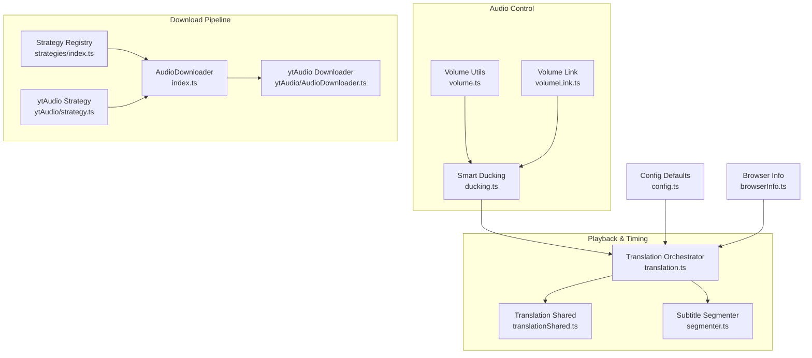
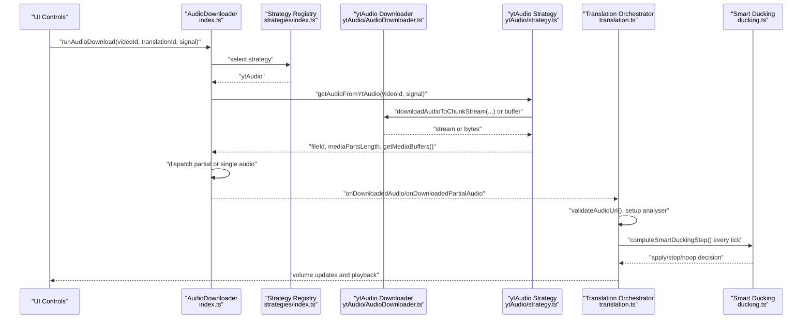
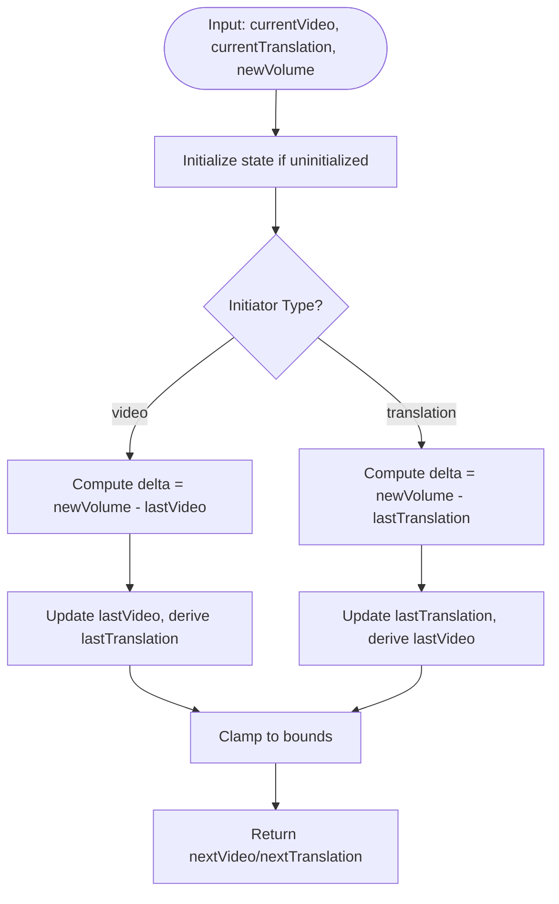
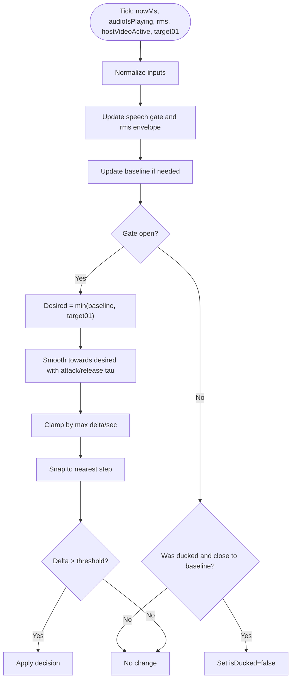
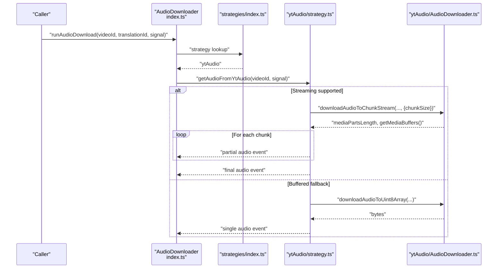
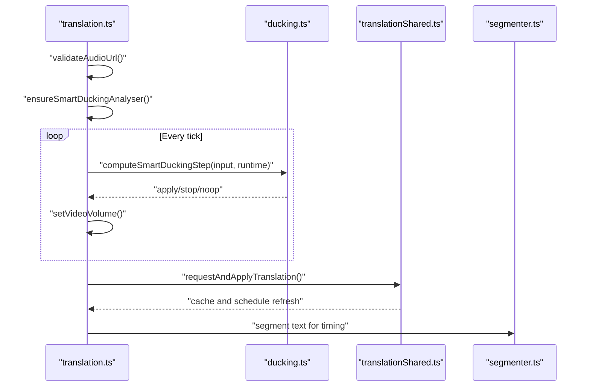
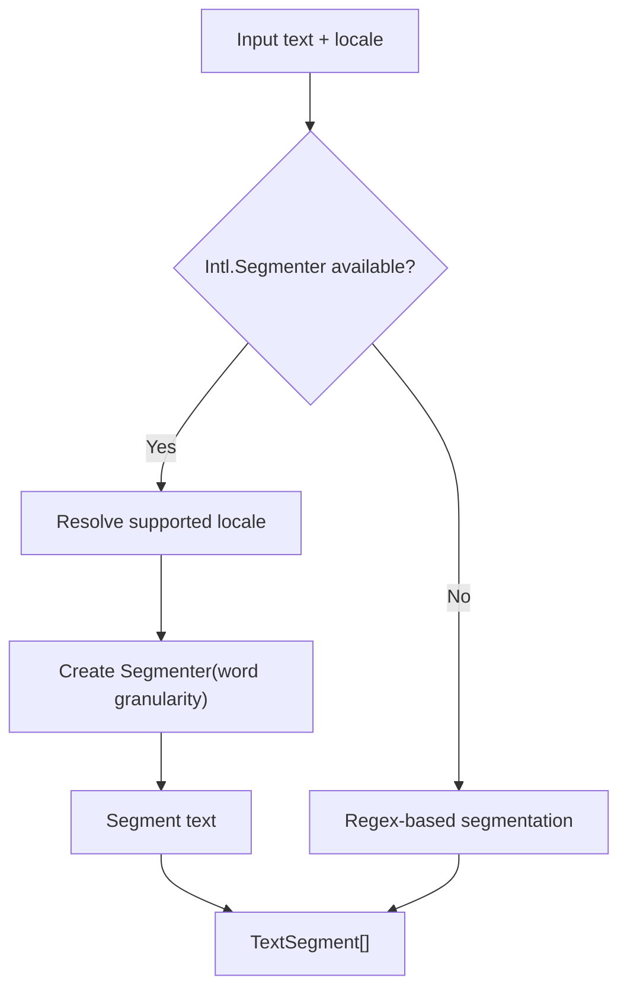
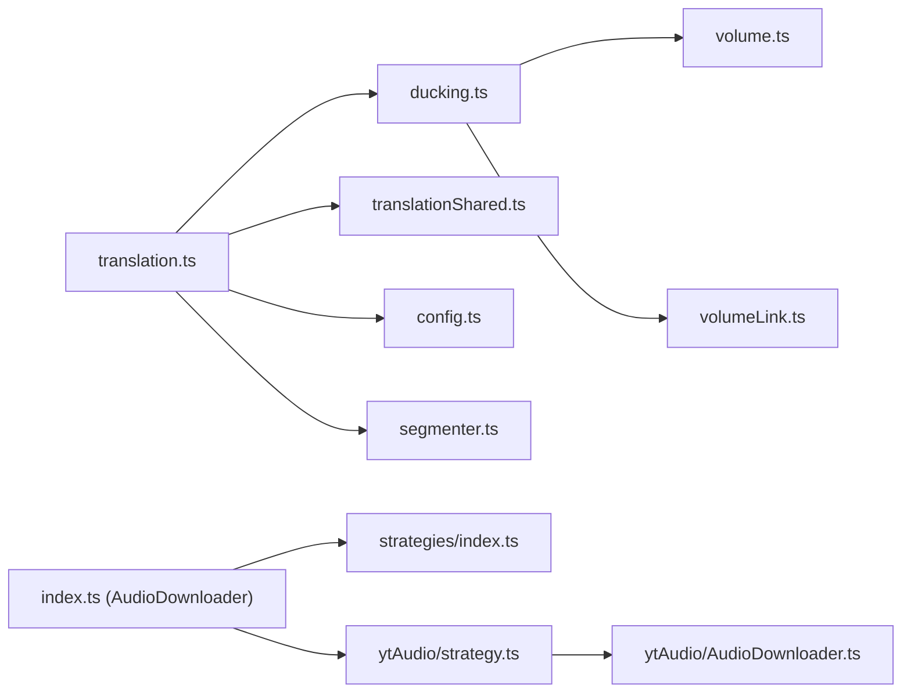

# Audio Synchronization

<cite>
**Referenced Files in This Document**
- [volume.ts](file://src/utils/volume.ts)
- [volumeLink.ts](file://src/utils/volumeLink.ts)
- [ducking.ts](file://src/videoHandler/modules/ducking.ts)
- [translation.ts](file://src/videoHandler/modules/translation.ts)
- [index.ts (AudioDownloader)](file://src/audioDownloader/index.ts)
- [ytAudio/AudioDownloader.ts](file://src/audioDownloader/ytAudio/src/AudioDownloader.ts)
- [ytAudio/strategy.ts](file://src/audioDownloader/ytAudio/strategy.ts)
- [strategies/index.ts](file://src/audioDownloader/strategies/index.ts)
- [audioDownloader.ts (types)](file://src/types/audioDownloader.ts)
- [translationShared.ts](file://src/videoHandler/modules/translationShared.ts)
- [config.ts](file://src/config/config.ts)
- [segmenter.ts](file://src/subtitles/segmenter.ts)
- [browserInfo.ts](file://src/utils/browserInfo.ts)
</cite>

## Table of Contents
1. [Introduction](#introduction)
2. [Project Structure](#project-structure)
3. [Core Components](#core-components)
4. [Architecture Overview](#architecture-overview)
5. [Detailed Component Analysis](#detailed-component-analysis)
6. [Dependency Analysis](#dependency-analysis)
7. [Performance Considerations](#performance-considerations)
8. [Troubleshooting Guide](#troubleshooting-guide)
9. [Conclusion](#conclusion)
10. [Appendices](#appendices)

## Introduction
This document explains the audio synchronization system, focusing on:
- Volume ducking algorithm for automatic audio level adjustment during translation playback
- Smart volume linking for coordinated multi-source audio and balanced sliders
- Audio download management: strategy selection, chunked downloads, and fallback mechanisms
- Translation audio integration with subtitle timing, phrase boundaries, and playback coordination
- The audio processing pipeline from download completion to playback initiation
- Practical configuration, performance tuning, and troubleshooting tips
- Cross-browser compatibility and audio format support

## Project Structure
The audio synchronization system spans several modules:
- Volume utilities and smart linking for UI and runtime volume control
- Smart ducking engine for real-time audio level adjustments
- Audio downloader orchestrating strategy selection and chunked retrieval
- Translation orchestration integrating audio with subtitles and playback
- Subtitle segmentation for phrase-aware timing
- Browser compatibility helpers

**Diagram sources**
- [volume.ts:1-97](file://src/utils/volume.ts#L1-L97)
- [volumeLink.ts:1-96](file://src/utils/volumeLink.ts#L1-L96)
- [ducking.ts:1-300](file://src/videoHandler/modules/ducking.ts#L1-L300)
- [index.ts (AudioDownloader):1-189](file://src/audioDownloader/index.ts#L1-L189)
- [ytAudio/AudioDownloader.ts:1-800](file://src/audioDownloader/ytAudio/src/AudioDownloader.ts#L1-L800)
- [strategies/index.ts:1-10](file://src/audioDownloader/strategies/index.ts#L1-L10)
- [ytAudio/strategy.ts:1-155](file://src/audioDownloader/ytAudio/strategy.ts#L1-L155)
- [translation.ts:1-800](file://src/videoHandler/modules/translation.ts#L1-L800)
- [translationShared.ts:1-193](file://src/videoHandler/modules/translationShared.ts#L1-L193)
- [segmenter.ts:1-89](file://src/subtitles/segmenter.ts#L1-L89)
- [config.ts:1-63](file://src/config/config.ts#L1-L63)
- [browserInfo.ts:1-6](file://src/utils/browserInfo.ts#L1-L6)

**Section sources**
- [volume.ts:1-97](file://src/utils/volume.ts#L1-L97)
- [volumeLink.ts:1-96](file://src/utils/volumeLink.ts#L1-L96)
- [ducking.ts:1-300](file://src/videoHandler/modules/ducking.ts#L1-L300)
- [index.ts (AudioDownloader):1-189](file://src/audioDownloader/index.ts#L1-L189)
- [ytAudio/AudioDownloader.ts:1-800](file://src/audioDownloader/ytAudio/src/AudioDownloader.ts#L1-L800)
- [strategies/index.ts:1-10](file://src/audioDownloader/strategies/index.ts#L1-L10)
- [ytAudio/strategy.ts:1-155](file://src/audioDownloader/ytAudio/strategy.ts#L1-L155)
- [translation.ts:1-800](file://src/videoHandler/modules/translation.ts#L1-L800)
- [translationShared.ts:1-193](file://src/videoHandler/modules/translationShared.ts#L1-L193)
- [segmenter.ts:1-89](file://src/subtitles/segmenter.ts#L1-L89)
- [config.ts:1-63](file://src/config/config.ts#L1-L63)
- [browserInfo.ts:1-6](file://src/utils/browserInfo.ts#L1-L6)

## Core Components
- Volume utilities: clamping, quantization, and step-wise snapping for smooth UI transitions
- Volume linking: delta-preserving linkage between video and translation sliders
- Smart ducking: RMS-based gating, envelope tracking, and smooth volume transitions
- Audio downloader: strategy selection, chunked streaming, and robust fallbacks
- Translation orchestration: analyser setup, periodic ducking ticks, and playback coordination
- Subtitle segmentation: locale-aware word-level segmentation for timing alignment

**Section sources**
- [volume.ts:1-97](file://src/utils/volume.ts#L1-L97)
- [volumeLink.ts:1-96](file://src/utils/volumeLink.ts#L1-L96)
- [ducking.ts:1-300](file://src/videoHandler/modules/ducking.ts#L1-L300)
- [index.ts (AudioDownloader):1-189](file://src/audioDownloader/index.ts#L1-L189)
- [ytAudio/AudioDownloader.ts:1-800](file://src/audioDownloader/ytAudio/src/AudioDownloader.ts#L1-L800)
- [translation.ts:1-800](file://src/videoHandler/modules/translation.ts#L1-L800)
- [segmenter.ts:1-89](file://src/subtitles/segmenter.ts#L1-L89)

## Architecture Overview
The system integrates three primary flows:
- Audio download pipeline: strategy selection → chunked retrieval → event dispatch
- Playback and ducking: analyser-based RMS → smart ducking decision → volume application
- Subtitle timing: segmented phrases → playback coordination with audio cues

**Diagram sources**
- [index.ts (AudioDownloader):103-125](file://src/audioDownloader/index.ts#L103-L125)
- [strategies/index.ts:5-7](file://src/audioDownloader/strategies/index.ts#L5-L7)
- [ytAudio/strategy.ts:74-155](file://src/audioDownloader/ytAudio/strategy.ts#L74-L155)
- [ytAudio/AudioDownloader.ts:513-582](file://src/audioDownloader/ytAudio/src/AudioDownloader.ts#L513-L582)
- [translation.ts:503-565](file://src/videoHandler/modules/translation.ts#L503-L565)
- [ducking.ts:111-275](file://src/videoHandler/modules/ducking.ts#L111-L275)

## Detailed Component Analysis

### Volume Utilities and Smart Linking
- Volume utilities provide clamping, percent conversion, and step-wise snapping to ensure smooth, UI-friendly volume transitions.
- Smart linking preserves relative offsets between video and translation sliders, applying deltas consistently while respecting bounds.

**Diagram sources**
- [volumeLink.ts:56-95](file://src/utils/volumeLink.ts#L56-L95)

**Section sources**
- [volume.ts:36-96](file://src/utils/volume.ts#L36-L96)
- [volumeLink.ts:26-95](file://src/utils/volumeLink.ts#L26-L95)

### Smart Volume Ducking Algorithm
The smart ducking engine computes per-tick decisions based on:
- RMS envelope derived from analyser FFT bins
- Speech gate thresholds and hold timers
- Baseline detection and tolerance for restoring volume
- Smooth exponential transitions with max delta per second
- Step-wise snapping to avoid jitter

**Diagram sources**
- [ducking.ts:111-275](file://src/videoHandler/modules/ducking.ts#L111-L275)

**Section sources**
- [ducking.ts:73-90](file://src/videoHandler/modules/ducking.ts#L73-L90)
- [ducking.ts:111-275](file://src/videoHandler/modules/ducking.ts#L111-L275)

### Audio Download Management
The downloader selects a strategy, retrieves audio either as a single buffer or a chunked stream, and emits events for partial and final audio data. It supports fallbacks:
- Streaming mode with chunked ranges
- Buffered mode as a fallback
- Robust probing and error handling

**Diagram sources**
- [index.ts (AudioDownloader):103-125](file://src/audioDownloader/index.ts#L103-L125)
- [strategies/index.ts:5-7](file://src/audioDownloader/strategies/index.ts#L5-L7)
- [ytAudio/strategy.ts:74-155](file://src/audioDownloader/ytAudio/strategy.ts#L74-L155)
- [ytAudio/AudioDownloader.ts:513-582](file://src/audioDownloader/ytAudio/src/AudioDownloader.ts#L513-L582)

**Section sources**
- [index.ts (AudioDownloader):28-85](file://src/audioDownloader/index.ts#L28-L85)
- [ytAudio/strategy.ts:74-155](file://src/audioDownloader/ytAudio/strategy.ts#L74-L155)
- [ytAudio/AudioDownloader.ts:513-667](file://src/audioDownloader/ytAudio/src/AudioDownloader.ts#L513-L667)

### Translation Audio Integration and Playback Coordination
The translation orchestrator:
- Probes and validates audio URLs
- Sets up analyser nodes and connects them to the audio graph
- Runs periodic ducking ticks to adjust video volume
- Coordinates refresh scheduling and cache updates

**Diagram sources**
- [translation.ts:503-565](file://src/videoHandler/modules/translation.ts#L503-L565)
- [translation.ts:623-651](file://src/videoHandler/modules/translation.ts#L623-L651)
- [translation.ts:667-716](file://src/videoHandler/modules/translation.ts#L667-L716)
- [translationShared.ts:104-146](file://src/videoHandler/modules/translationShared.ts#L104-L146)
- [segmenter.ts:68-89](file://src/subtitles/segmenter.ts#L68-L89)

**Section sources**
- [translation.ts:117-122](file://src/videoHandler/modules/translation.ts#L117-L122)
- [translation.ts:186-235](file://src/videoHandler/modules/translation.ts#L186-L235)
- [translation.ts:453-501](file://src/videoHandler/modules/translation.ts#L453-L501)
- [translation.ts:503-565](file://src/videoHandler/modules/translation.ts#L503-L565)
- [translationShared.ts:33-61](file://src/videoHandler/modules/translationShared.ts#L33-L61)

### Subtitle Timing and Phrase Boundaries
Subtitle segmentation leverages native Intl.Segmenter for locale-aware word segmentation, with a fallback regex-based approach. This enables precise phrase boundary detection aligned with audio playback.

**Diagram sources**
- [segmenter.ts:37-48](file://src/subtitles/segmenter.ts#L37-L48)
- [segmenter.ts:68-89](file://src/subtitles/segmenter.ts#L68-L89)

**Section sources**
- [segmenter.ts:10-35](file://src/subtitles/segmenter.ts#L10-L35)
- [segmenter.ts:68-89](file://src/subtitles/segmenter.ts#L68-L89)

## Dependency Analysis
Key dependencies and interactions:
- Translation orchestrator depends on smart ducking and analyser utilities
- Audio downloader depends on strategy registry and ytAudio implementation
- Volume utilities underpin both ducking and linking
- Config provides defaults for auto volume and limits

**Diagram sources**
- [translation.ts:14-32](file://src/videoHandler/modules/translation.ts#L14-L32)
- [index.ts (AudioDownloader):13-13](file://src/audioDownloader/index.ts#L13-L13)
- [strategies/index.ts:5-7](file://src/audioDownloader/strategies/index.ts#L5-L7)
- [ytAudio/strategy.ts:1-12](file://src/audioDownloader/ytAudio/strategy.ts#L1-L12)
- [ytAudio/AudioDownloader.ts:1-10](file://src/audioDownloader/ytAudio/src/AudioDownloader.ts#L1-L10)
- [volume.ts:1-10](file://src/utils/volume.ts#L1-L10)
- [volumeLink.ts:1-10](file://src/utils/volumeLink.ts#L1-L10)
- [config.ts:36-41](file://src/config/config.ts#L36-L41)
- [segmenter.ts:1-10](file://src/subtitles/segmenter.ts#L1-L10)

**Section sources**
- [translation.ts:14-32](file://src/videoHandler/modules/translation.ts#L14-L32)
- [index.ts (AudioDownloader):13-13](file://src/audioDownloader/index.ts#L13-L13)
- [strategies/index.ts:5-7](file://src/audioDownloader/strategies/index.ts#L5-L7)
- [ytAudio/strategy.ts:1-12](file://src/audioDownloader/ytAudio/strategy.ts#L1-L12)
- [ytAudio/AudioDownloader.ts:1-10](file://src/audioDownloader/ytAudio/src/AudioDownloader.ts#L1-L10)
- [volume.ts:1-10](file://src/utils/volume.ts#L1-L10)
- [volumeLink.ts:1-10](file://src/utils/volumeLink.ts#L1-L10)
- [config.ts:36-41](file://src/config/config.ts#L36-L41)
- [segmenter.ts:1-10](file://src/subtitles/segmenter.ts#L1-L10)

## Performance Considerations
- Ducking tick interval and smoothing parameters balance responsiveness and smoothness
- Chunk size selection affects latency and memory footprint during streaming
- Probe retries and timeouts prevent stalls on unreliable URLs
- Analyser FFT size impacts accuracy vs. CPU cost
- Volume snapping reduces UI jitter and prevents excessive re-renders

[No sources needed since this section provides general guidance]

## Troubleshooting Guide
Common issues and remedies:
- AudioContext initialization failures: The system gracefully falls back to legacy paths when AudioContext cannot be created
- Proxy settings changes: Clear caches and stop translation to reset playback state
- Stale or invalid audio URLs: Probe and switch to direct URLs when proxies fail
- Translation refresh scheduling: TTL-based refresh avoids unnecessary reloads
- Volume linkage drift: Use delta-preserving linking to maintain relative slider positions

**Section sources**
- [translation.ts:124-159](file://src/videoHandler/modules/translation.ts#L124-L159)
- [translation.ts:774-793](file://src/videoHandler/modules/translation.ts#L774-L793)
- [translation.ts:623-651](file://src/videoHandler/modules/translation.ts#L623-L651)
- [translation.ts:653-665](file://src/videoHandler/modules/translation.ts#L653-L665)

## Conclusion
The audio synchronization system combines precise volume control, intelligent ducking, robust download strategies, and subtitle-aware timing to deliver seamless translation playback. Smart linking ensures consistent user experience across multiple audio sources, while the download pipeline adapts to network conditions and server capabilities. With careful configuration and monitoring, the system maintains stability and performance across diverse browsers and environments.

[No sources needed since this section summarizes without analyzing specific files]

## Appendices

### Practical Configuration Examples
- Default auto volume percentage for translation: see [config.ts:36](file://src/config/config.ts#L36)
- Max audio volume percentage: see [config.ts:41](file://src/config/config.ts#L41)
- Ducking tick interval and smoothing parameters: see [translation.ts:66](file://src/videoHandler/modules/translation.ts#L66) and [ducking.ts:73-90](file://src/videoHandler/modules/ducking.ts#L73-L90)
- Chunk size selection for streaming: see [ytAudio/strategy.ts:78](file://src/audioDownloader/ytAudio/strategy.ts#L78) and [ytAudio/AudioDownloader.ts:517-520](file://src/audioDownloader/ytAudio/src/AudioDownloader.ts#L517-L520)

### Cross-Browser Compatibility and Formats
- AudioContext support detection and fallback: see [index.ts (core):641-673](file://src/index.ts#L641-L673)
- Browser detection via Bowser: see [browserInfo.ts:1-6](file://src/utils/browserInfo.ts#L1-L6)
- Preferred adaptive audio formats (mp4a/opus) and MIME selection: see [ytAudio/AudioDownloader.ts:327-338](file://src/audioDownloader/ytAudio/src/AudioDownloader.ts#L327-L338) and [ytAudio/AudioDownloader.ts:161-202](file://src/audioDownloader/ytAudio/src/AudioDownloader.ts#L161-L202)

**Section sources**
- [config.ts:36-41](file://src/config/config.ts#L36-L41)
- [translation.ts:66](file://src/videoHandler/modules/translation.ts#L66)
- [ducking.ts:73-90](file://src/videoHandler/modules/ducking.ts#L73-L90)
- [ytAudio/strategy.ts:78](file://src/audioDownloader/ytAudio/strategy.ts#L78)
- [ytAudio/AudioDownloader.ts:517-520](file://src/audioDownloader/ytAudio/src/AudioDownloader.ts#L517-L520)
- [ytAudio/AudioDownloader.ts:327-338](file://src/audioDownloader/ytAudio/src/AudioDownloader.ts#L327-L338)
- [ytAudio/AudioDownloader.ts:161-202](file://src/audioDownloader/ytAudio/src/AudioDownloader.ts#L161-L202)
- [index.ts (core):641-673](file://src/index.ts#L641-L673)
- [browserInfo.ts:1-6](file://src/utils/browserInfo.ts#L1-L6)