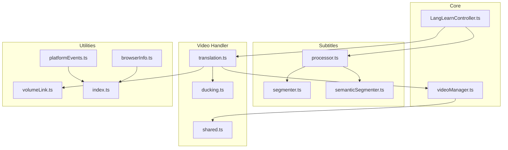
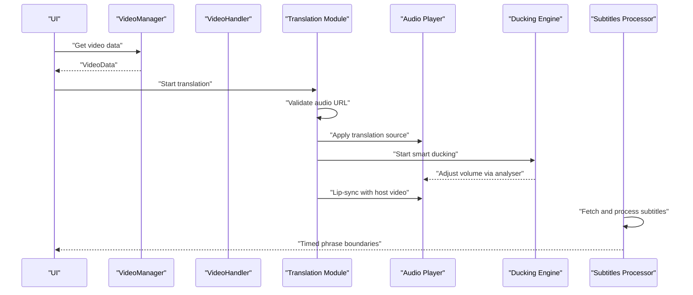
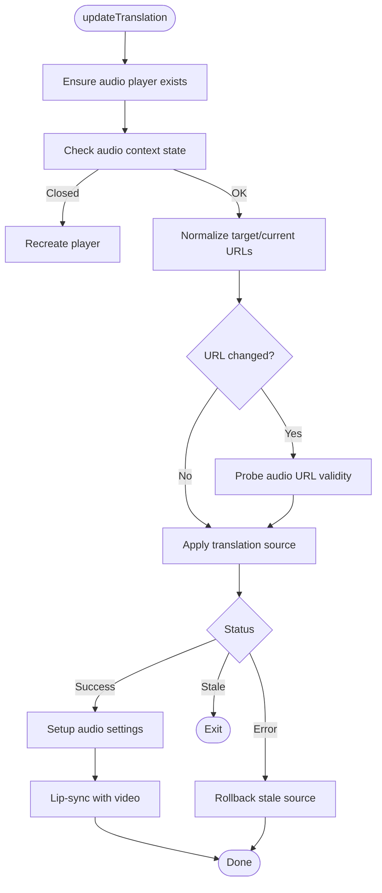
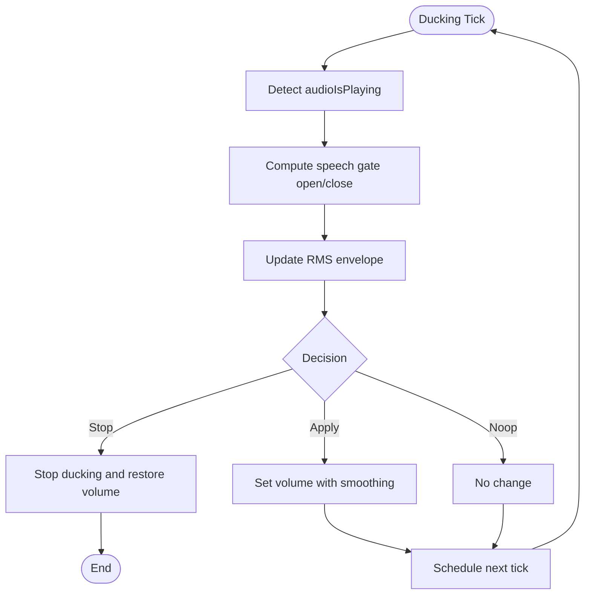
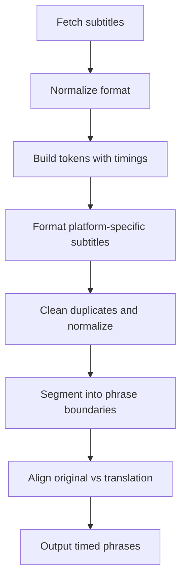
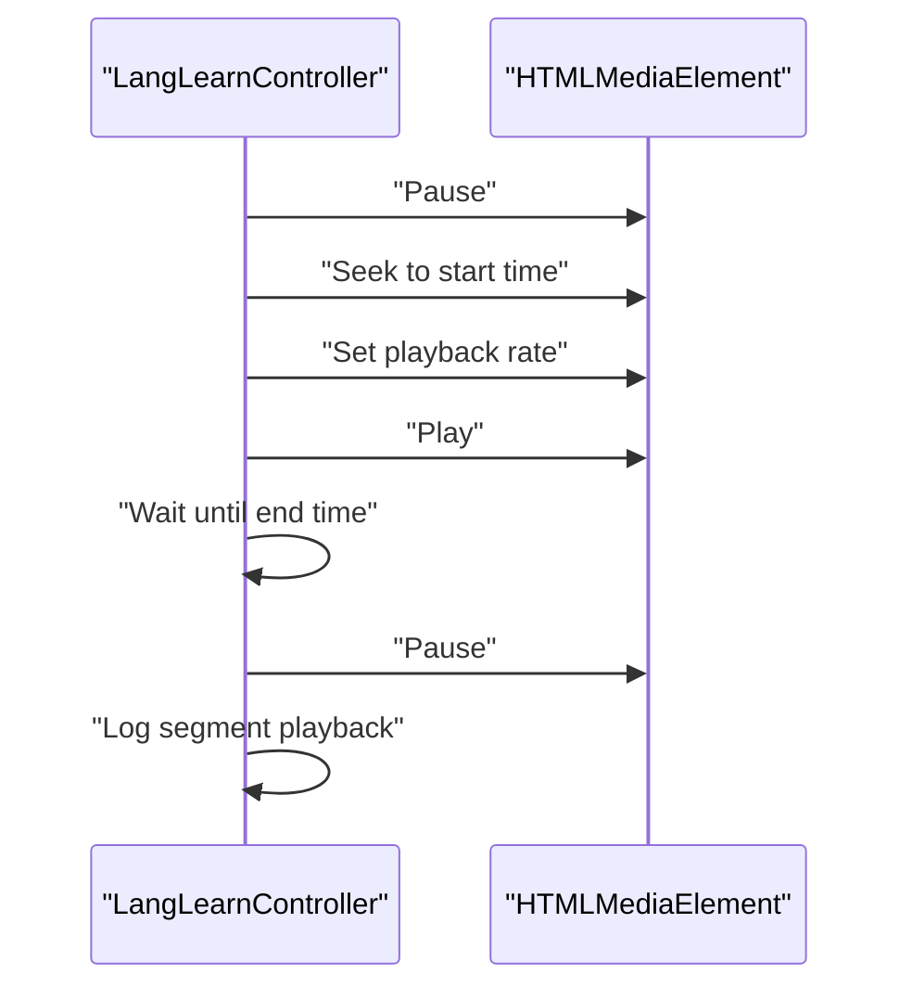
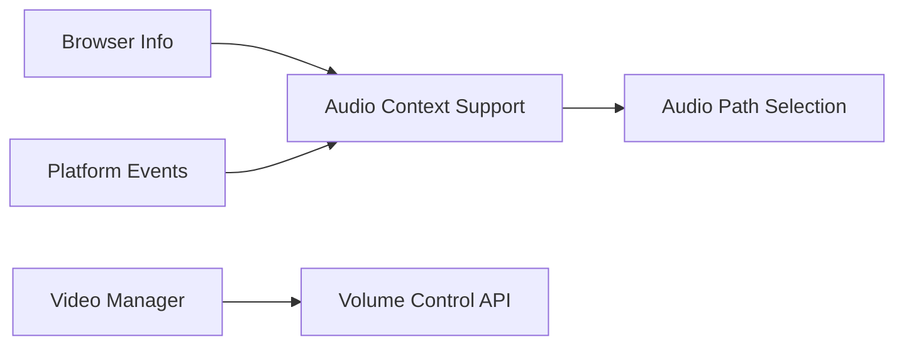
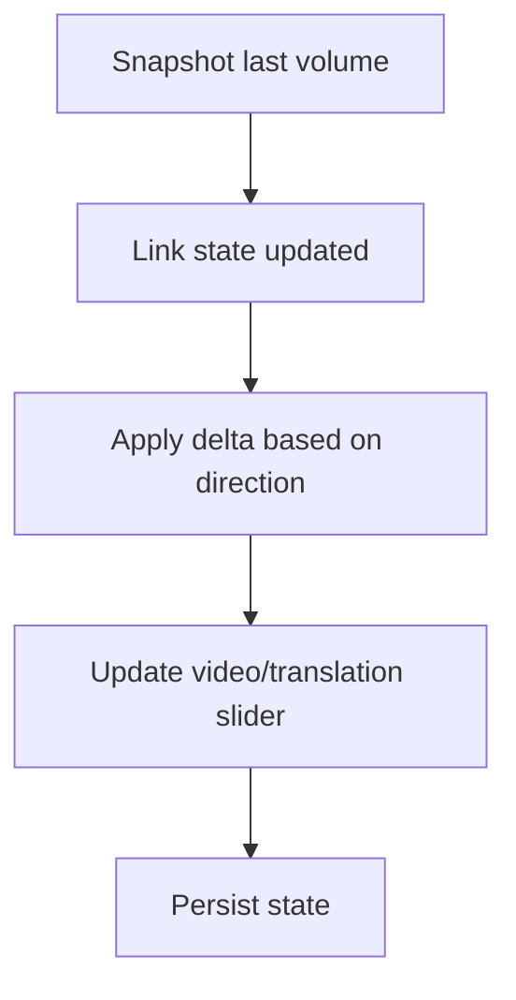
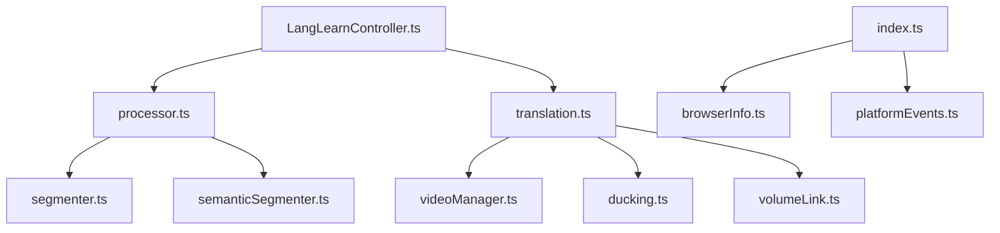

# Playback Coordination

<cite>
**Referenced Files in This Document**
- [translation.ts](file://src/videoHandler/modules/translation.ts)
- [ducking.ts](file://src/videoHandler/modules/ducking.ts)
- [shared.ts](file://src/videoHandler/shared.ts)
- [videoManager.ts](file://src/core/videoManager.ts)
- [processor.ts](file://src/subtitles/processor.ts)
- [segmenter.ts](file://src/subtitles/segmenter.ts)
- [semanticSegmenter.ts](file://src/langLearn/phraseSegmenter/semanticSegmenter.ts)
- [LangLearnController.ts](file://src/langLearn/LangLearnController.ts)
- [index.ts](file://src/index.ts)
- [browserInfo.ts](file://src/utils/browserInfo.ts)
- [platformEvents.ts](file://src/utils/platformEvents.ts)
- [volumeLink.ts](file://src/utils/volumeLink.ts)
</cite>

## Table of Contents
1. [Introduction](#introduction)
2. [Project Structure](#project-structure)
3. [Core Components](#core-components)
4. [Architecture Overview](#architecture-overview)
5. [Detailed Component Analysis](#detailed-component-analysis)
6. [Dependency Analysis](#dependency-analysis)
7. [Performance Considerations](#performance-considerations)
8. [Troubleshooting Guide](#troubleshooting-guide)
9. [Conclusion](#conclusion)

## Introduction
This document explains the playback coordination system that synchronizes audio translation with video content and subtitles. It covers timing alignment mechanisms, phrase boundary detection, subtitle synchronization logic, integration with subtitle processing, audio timing, and video playback controls. It also documents coordination of multiple audio streams, translation timing, user interaction events, error recovery, synchronization restoration, cross-browser compatibility, and performance optimizations for smooth playback.

## Project Structure
The playback coordination spans several modules:
- Video handler modules orchestrate translation audio updates, audio context management, and smart auto-volume ducking.
- Subtitle processors and segmenters convert and align timed text with translation audio.
- Language learning controller coordinates precise media segment playback for synchronized learning experiences.
- Core video manager handles video metadata, language detection, and volume control across platforms.
- Utilities support browser detection, platform-specific event handling, and volume linking.

**Diagram sources**
- [translation.ts](file://src/videoHandler/modules/translation.ts)
- [ducking.ts](file://src/videoHandler/modules/ducking.ts)
- [shared.ts](file://src/videoHandler/shared.ts)
- [videoManager.ts](file://src/core/videoManager.ts)
- [processor.ts](file://src/subtitles/processor.ts)
- [segmenter.ts](file://src/subtitles/segmenter.ts)
- [semanticSegmenter.ts](file://src/langLearn/phraseSegmenter/semanticSegmenter.ts)
- [LangLearnController.ts](file://src/langLearn/LangLearnController.ts)
- [index.ts](file://src/index.ts)
- [browserInfo.ts](file://src/utils/browserInfo.ts)
- [platformEvents.ts](file://src/utils/platformEvents.ts)
- [volumeLink.ts](file://src/utils/volumeLink.ts)

**Section sources**
- [translation.ts](file://src/videoHandler/modules/translation.ts)
- [ducking.ts](file://src/videoHandler/modules/ducking.ts)
- [shared.ts](file://src/videoHandler/shared.ts)
- [videoManager.ts](file://src/core/videoManager.ts)
- [processor.ts](file://src/subtitles/processor.ts)
- [segmenter.ts](file://src/subtitles/segmenter.ts)
- [semanticSegmenter.ts](file://src/langLearn/phraseSegmenter/semanticSegmenter.ts)
- [LangLearnController.ts](file://src/langLearn/LangLearnController.ts)
- [index.ts](file://src/index.ts)
- [browserInfo.ts](file://src/utils/browserInfo.ts)
- [platformEvents.ts](file://src/utils/platformEvents.ts)
- [volumeLink.ts](file://src/utils/volumeLink.ts)

## Core Components
- Translation module: Manages translation audio updates, validates URLs, applies sources, resumes suspended audio contexts, and integrates lip-sync with the host video.
- Ducking module: Implements smart auto-volume ducking with RMS-based speech gating, envelope tracking, and smooth volume transitions.
- Video manager: Provides video metadata, language detection, and platform-aware volume control.
- Subtitle processor and segmenter: Normalizes and segments subtitles into timed tokens and phrase boundaries.
- Semantic segmenter: Produces robust phrase boundaries and alignments between original and translated lines.
- Language learning controller: Coordinates precise media segment playback with timing logs and drift measurements.
- Index and utilities: Determine audio context support, platform event overrides, and volume linkage behavior.

**Section sources**
- [translation.ts](file://src/videoHandler/modules/translation.ts)
- [ducking.ts](file://src/videoHandler/modules/ducking.ts)
- [videoManager.ts](file://src/core/videoManager.ts)
- [processor.ts](file://src/subtitles/processor.ts)
- [segmenter.ts](file://src/subtitles/segmenter.ts)
- [semanticSegmenter.ts](file://src/langLearn/phraseSegmenter/semanticSegmenter.ts)
- [LangLearnController.ts](file://src/langLearn/LangLearnController.ts)
- [index.ts](file://src/index.ts)
- [browserInfo.ts](file://src/utils/browserInfo.ts)
- [platformEvents.ts](file://src/utils/platformEvents.ts)
- [volumeLink.ts](file://src/utils/volumeLink.ts)

## Architecture Overview
The system orchestrates synchronized playback across three layers:
- Subtitles and timing: Subtitles are fetched, normalized, segmented into timed tokens, and aligned into phrase boundaries.
- Translation audio: Translation audio is validated, applied to the audio player, and synchronized with the host video.
- Volume control: Smart ducking adjusts video volume based on translation audio RMS, preserving baseline and applying smooth transitions.

**Diagram sources**
- [translation.ts](file://src/videoHandler/modules/translation.ts)
- [ducking.ts](file://src/videoHandler/modules/ducking.ts)
- [videoManager.ts](file://src/core/videoManager.ts)
- [processor.ts](file://src/subtitles/processor.ts)

## Detailed Component Analysis

### Translation and Audio Timing
The translation module manages:
- URL validation and normalization
- Applying translation audio sources
- Handling stale actions and rolling back partial sources
- Resuming suspended audio contexts
- Lip-syncing translation audio with the host video

**Diagram sources**
- [translation.ts](file://src/videoHandler/modules/translation.ts)

**Section sources**
- [translation.ts](file://src/videoHandler/modules/translation.ts)

### Smart Auto-Volume Ducking
Smart ducking computes volume decisions based on:
- RMS envelope derived from analyser FFT data
- Speech gating thresholds and hold timers
- Baseline volume and smooth transitions
- External volume baseline deltas and tolerance

**Diagram sources**
- [ducking.ts](file://src/videoHandler/modules/ducking.ts)

**Section sources**
- [ducking.ts](file://src/videoHandler/modules/ducking.ts)

### Subtitle Processing and Phrase Boundary Detection
Subtitle processing:
- Fetches and normalizes subtitles from various sources
- Builds tokens with start/end times and word-like flags
- Formats platform-specific subtitles (e.g., YouTube ASR)
- Merges duplicates and cleans JSON subtitles

Phrase boundary detection:
- Splits text by punctuation and word counts
- Enforces semantic completeness and merges micro-phrases
- Aligns original and translated phrases with confidence thresholds

**Diagram sources**
- [processor.ts](file://src/subtitles/processor.ts)
- [segmenter.ts](file://src/subtitles/segmenter.ts)
- [semanticSegmenter.ts](file://src/langLearn/phraseSegmenter/semanticSegmenter.ts)

**Section sources**
- [processor.ts](file://src/subtitles/processor.ts)
- [segmenter.ts](file://src/subtitles/segmenter.ts)
- [semanticSegmenter.ts](file://src/langLearn/phraseSegmenter/semanticSegmenter.ts)

### Language Learning Playback Coordination
The language learning controller coordinates precise media segment playback:
- Seeks to start time, sets playback rate, and waits for end time
- Measures drift and logs segment playback metrics
- Pauses media after each segment to prevent overlap

**Diagram sources**
- [LangLearnController.ts](file://src/langLearn/LangLearnController.ts)

**Section sources**
- [LangLearnController.ts](file://src/langLearn/LangLearnController.ts)

### Cross-Browser Compatibility and Platform Considerations
- Browser detection: Uses parser to derive browser info for compatibility checks.
- Platform event overrides: Disables container drag or touch move handlers per host.
- Audio context support: Determines whether to prefer legacy audio player or modern Web Audio API.
- External volume control: Adapts to host-specific volume APIs (e.g., YouTube) and falls back to HTMLMediaElement volume.

**Diagram sources**
- [browserInfo.ts](file://src/utils/browserInfo.ts)
- [platformEvents.ts](file://src/utils/platformEvents.ts)
- [index.ts](file://src/index.ts)
- [videoManager.ts](file://src/core/videoManager.ts)

**Section sources**
- [browserInfo.ts](file://src/utils/browserInfo.ts)
- [platformEvents.ts](file://src/utils/platformEvents.ts)
- [index.ts](file://src/index.ts)
- [videoManager.ts](file://src/core/videoManager.ts)

### Volume Linking and User Interaction
Volume linking maintains synchronized sliders for video and translation volumes:
- Snapshots capture last known volume levels
- Delta application computes next values for linked controls
- Direction-aware updates ensure coherent user interaction

**Diagram sources**
- [volumeLink.ts](file://src/utils/volumeLink.ts)

**Section sources**
- [volumeLink.ts](file://src/utils/volumeLink.ts)

## Dependency Analysis
Key dependencies and interactions:
- Translation module depends on video manager for video data and volume control, and on ducking for smart auto-volume behavior.
- Subtitle processing depends on segmenter and semantic segmenter for phrase boundaries.
- Language learning controller depends on subtitles and translation modules for synchronized playback.
- Index and utilities provide environment-specific audio context support and platform event handling.

**Diagram sources**
- [translation.ts](file://src/videoHandler/modules/translation.ts)
- [videoManager.ts](file://src/core/videoManager.ts)
- [ducking.ts](file://src/videoHandler/modules/ducking.ts)
- [volumeLink.ts](file://src/utils/volumeLink.ts)
- [processor.ts](file://src/subtitles/processor.ts)
- [segmenter.ts](file://src/subtitles/segmenter.ts)
- [semanticSegmenter.ts](file://src/langLearn/phraseSegmenter/semanticSegmenter.ts)
- [LangLearnController.ts](file://src/langLearn/LangLearnController.ts)
- [index.ts](file://src/index.ts)
- [browserInfo.ts](file://src/utils/browserInfo.ts)
- [platformEvents.ts](file://src/utils/platformEvents.ts)

**Section sources**
- [translation.ts](file://src/videoHandler/modules/translation.ts)
- [videoManager.ts](file://src/core/videoManager.ts)
- [ducking.ts](file://src/videoHandler/modules/ducking.ts)
- [volumeLink.ts](file://src/utils/volumeLink.ts)
- [processor.ts](file://src/subtitles/processor.ts)
- [segmenter.ts](file://src/subtitles/segmenter.ts)
- [semanticSegmenter.ts](file://src/langLearn/phraseSegmenter/semanticSegmenter.ts)
- [LangLearnController.ts](file://src/langLearn/LangLearnController.ts)
- [index.ts](file://src/index.ts)
- [browserInfo.ts](file://src/utils/browserInfo.ts)
- [platformEvents.ts](file://src/utils/platformEvents.ts)

## Performance Considerations
- Minimize analyser allocations: Reuse Float32Array/Uint8Array buffers for FFT data.
- Limit ducking tick frequency: Use conservative tickMs to balance responsiveness and CPU usage.
- Avoid redundant URL probing: Cache validated URLs and reuse normalized forms.
- Smooth volume transitions: Cap max delta per tick to prevent audible clicks and maintain fluidity.
- Efficient subtitle segmentation: Use word-based splitting and weighted allocation to reduce overhead.
- Early exits: Bail out on stale actions and invalid audio contexts to avoid wasted work.

[No sources needed since this section provides general guidance]

## Troubleshooting Guide
Common issues and recovery strategies:
- Stale translation actions: Detect stale contexts and roll back partially applied sources to avoid inconsistent playback.
- Suspended audio context: Attempt to resume with timeout protection; fall back gracefully if resume fails.
- Invalid audio URLs: Probe URLs via HEAD or range requests; prefer direct URLs when proxied variants fail.
- Smart ducking failures: Stop ducking, restore baseline volume, and release analyser nodes to recover cleanly.
- Lip-sync desynchronization: Re-synchronize audio currentTime and playbackRate with the host video on play/pause/seeked events.
- External volume drift: Use host-specific volume APIs when available; otherwise snap to nearest allowed volume steps.

**Section sources**
- [translation.ts](file://src/videoHandler/modules/translation.ts)
- [ducking.ts](file://src/videoHandler/modules/ducking.ts)
- [videoManager.ts](file://src/core/videoManager.ts)

## Conclusion
The playback coordination system integrates subtitle processing, translation audio management, smart auto-volume ducking, and precise media segment playback to deliver synchronized audio translation with video content. Robust error handling, cross-browser compatibility, and performance optimizations ensure smooth operation across diverse environments and platforms.