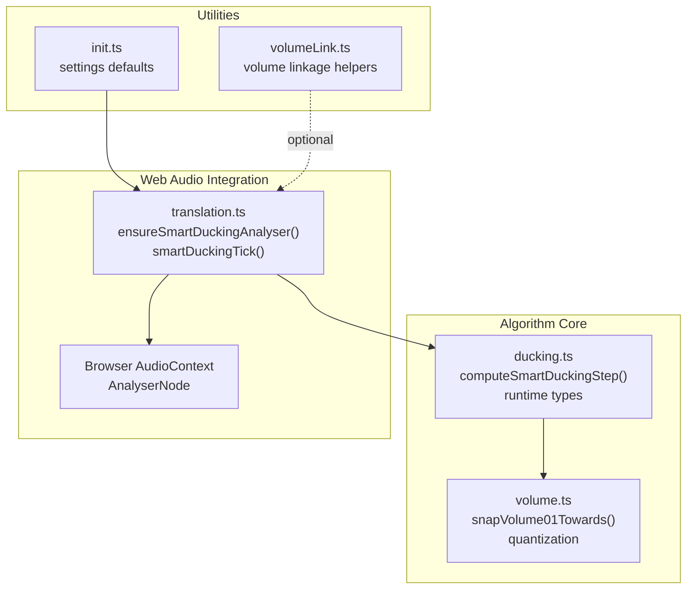
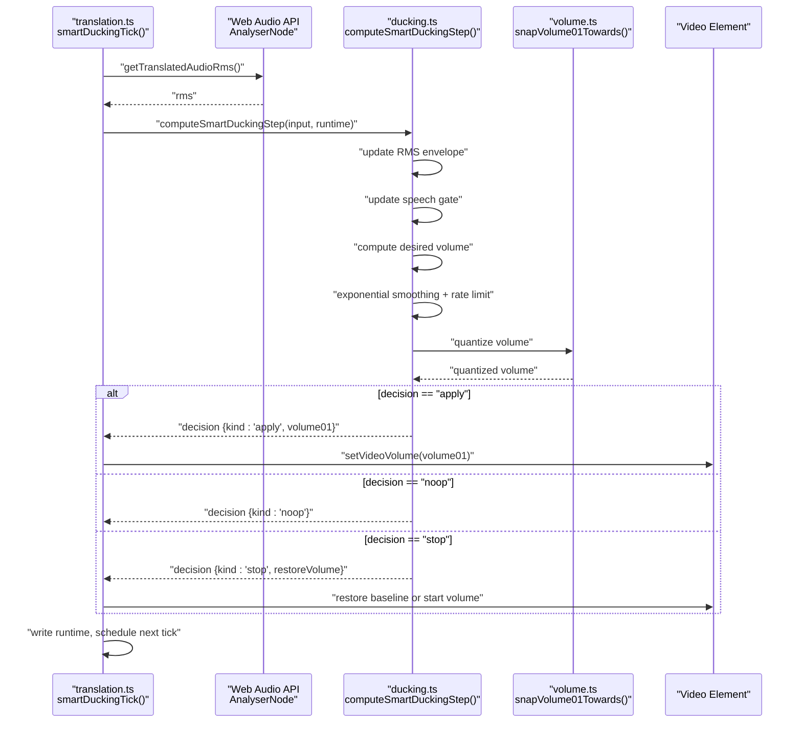
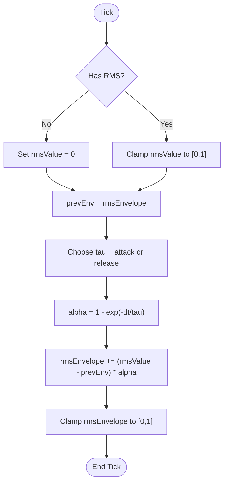
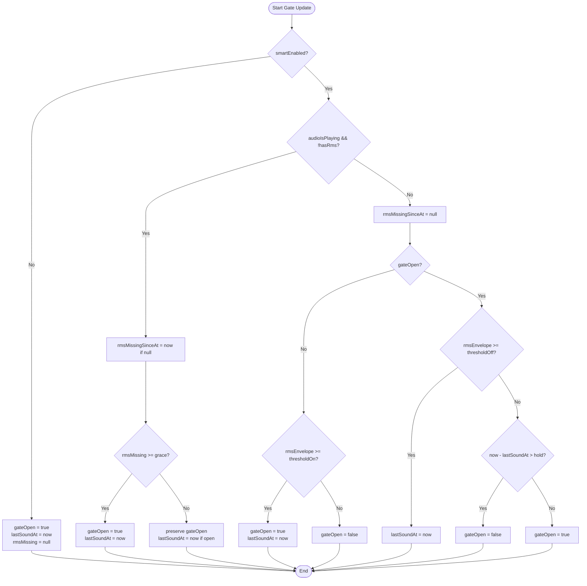
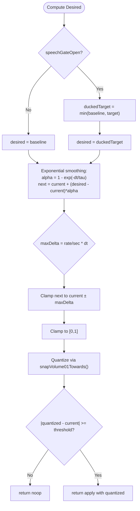
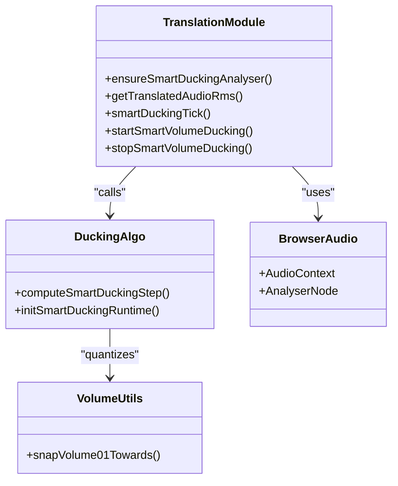
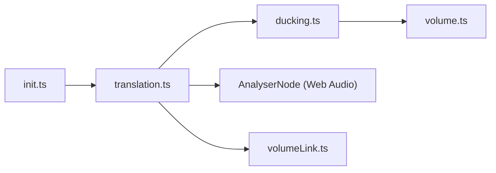

# Volume Ducking Algorithm

<cite>
**Referenced Files in This Document**
- [ducking.ts](file://src/videoHandler/modules/ducking.ts)
- [volume.ts](file://src/utils/volume.ts)
- [volumeLink.ts](file://src/utils/volumeLink.ts)
- [translation.ts](file://src/videoHandler/modules/translation.ts)
- [init.ts](file://src/videoHandler/modules/init.ts)
- [smart-ducking.test.ts](file://tests/smart-ducking.test.ts)
- [shared.ts](file://src/videoHandler/shared.ts)
</cite>

## Table of Contents
1. [Introduction](#introduction)
2. [Project Structure](#project-structure)
3. [Core Components](#core-components)
4. [Architecture Overview](#architecture-overview)
5. [Detailed Component Analysis](#detailed-component-analysis)
6. [Dependency Analysis](#dependency-analysis)
7. [Performance Considerations](#performance-considerations)
8. [Troubleshooting Guide](#troubleshooting-guide)
9. [Conclusion](#conclusion)
10. [Appendices](#appendices)

## Introduction
This document explains the smart volume ducking algorithm used to automatically lower video volume when translated audio is playing. It covers the RMS envelope tracking system, speech gate mechanism, and adaptive volume control logic. It also documents the mathematical models for attack/release curves, exponential smoothing, and volume quantization, along with configuration parameters and integration with the Web Audio API and browser audio contexts. Practical examples illustrate behavior under different scenarios, and troubleshooting guidance addresses common issues.

## Project Structure
The smart ducking implementation spans several modules:
- Algorithm core: smart ducking computation and runtime state
- Volume utilities: quantization and snapping helpers
- Translation module: Web Audio API integration, analyser setup, and periodic tick scheduling
- Initialization: user settings and defaults
- Tests: behavioral validation of the algorithm

**Diagram sources**
- [ducking.ts:111-275](file://src/videoHandler/modules/ducking.ts#L111-L275)
- [volume.ts:76-96](file://src/utils/volume.ts#L76-L96)
- [translation.ts:275-565](file://src/videoHandler/modules/translation.ts#L275-L565)
- [init.ts:47-95](file://src/videoHandler/modules/init.ts#L47-L95)

**Section sources**
- [ducking.ts:1-300](file://src/videoHandler/modules/ducking.ts#L1-L300)
- [volume.ts:1-97](file://src/utils/volume.ts#L1-L97)
- [translation.ts:1-1181](file://src/videoHandler/modules/translation.ts#L1-L1181)
- [init.ts:1-166](file://src/videoHandler/modules/init.ts#L1-L166)

## Core Components
- SmartDuckingConfig: defines all tunable parameters for the algorithm
- SmartDuckingRuntime: holds persistent state across ticks
- SmartDuckingInput: per-tick inputs consumed by the algorithm
- Decision types: stop, apply, noop outcomes
- Default configuration: sensible presets for typical environments

Key responsibilities:
- Track RMS envelope with attack/release time constants
- Gate speech activity with hysteresis thresholds and hold time
- Compute desired volume as min(baseline, ducking target)
- Smooth transitions with exponential smoothing and rate limiting
- Quantize volume steps and debounce application

**Section sources**
- [ducking.ts:7-90](file://src/videoHandler/modules/ducking.ts#L7-L90)
- [ducking.ts:26-71](file://src/videoHandler/modules/ducking.ts#L26-L71)
- [ducking.ts:111-275](file://src/videoHandler/modules/ducking.ts#L111-L275)

## Architecture Overview
The system runs a periodic tick loop that reads audio from the translated track, computes RMS energy, updates the speech gate, determines desired volume, smooths the transition, quantizes, and applies changes to the video element’s volume.

**Diagram sources**
- [translation.ts:503-565](file://src/videoHandler/modules/translation.ts#L503-L565)
- [ducking.ts:111-275](file://src/videoHandler/modules/ducking.ts#L111-L275)
- [volume.ts:76-96](file://src/utils/volume.ts#L76-L96)

## Detailed Component Analysis

### RMS Envelope Tracking
- Exponential smoothing: the envelope follows RMS with separate time constants for attack and release
- Alpha computed from tau_ms using the standard formula derived from discrete-time exponential decay
- Clamping ensures envelope stays in [0, 1]

**Diagram sources**
- [ducking.ts:133-143](file://src/videoHandler/modules/ducking.ts#L133-L143)

**Section sources**
- [ducking.ts:133-143](file://src/videoHandler/modules/ducking.ts#L133-L143)

### Speech Gate Mechanism
- Thresholds: ON and OFF hysteresis thresholds on the RMS envelope
- Hold: minimum time after last sound to keep the gate open
- Grace period: tolerate short RMS gaps before closing the gate
- Smart vs. non-smart modes: when disabled, gate remains open and lastSoundAt is updated

**Diagram sources**
- [ducking.ts:145-185](file://src/videoHandler/modules/ducking.ts#L145-L185)

**Section sources**
- [ducking.ts:145-185](file://src/videoHandler/modules/ducking.ts#L145-L185)

### Adaptive Volume Control Logic
- Baseline: remember current video volume when entering ducking or when not ducked
- Target: min(baseline, duckingTarget01)
- Desired volume: equals baseline when gate closed, equals target when open
- Smoothing: exponential smoothing with separate attack and release time constants
- Rate limiting: per-second deltas constrain volume changes
- Quantization: snap to nearest step in the chosen direction, bounded by desired
- Debounce: only apply if change exceeds a small threshold

**Diagram sources**
- [ducking.ts:217-275](file://src/videoHandler/modules/ducking.ts#L217-L275)
- [volume.ts:76-96](file://src/utils/volume.ts#L76-L96)

**Section sources**
- [ducking.ts:217-275](file://src/videoHandler/modules/ducking.ts#L217-L275)
- [volume.ts:76-96](file://src/utils/volume.ts#L76-L96)

### Mathematical Models and Formulas
- Exponential smoothing: 
  - α = 1 − exp(−Δt/τ)
  - y(t+Δt) = y(t) + (x − y(t))·α
- Attack/Release curves:
  - τ_attack and τ_release define rise/fall speed
- Rate limiting:
  - ΔV_max = rate_per_sec · Δt
  - Clamp next volume within current ± ΔV_max
- Volume quantization:
  - Snap to nearest multiple of step (0.01) towards desired

**Section sources**
- [ducking.ts:136-143](file://src/videoHandler/modules/ducking.ts#L136-L143)
- [ducking.ts:229-245](file://src/videoHandler/modules/ducking.ts#L229-L245)
- [volume.ts:45-96](file://src/utils/volume.ts#L45-L96)

### Configuration Parameters
- Timing and gating
  - tickMs: tick interval for the loop
  - thresholdOnRms, thresholdOffRms: ON/OFF hysteresis thresholds for speech gate
  - rmsAttackTauMs, rmsReleaseTauMs: envelope attack/release time constants
  - holdMs: minimum silence duration to close gate
  - rmsMissingGraceMs: grace period to keep gate open during RMS gaps
- Volume smoothing and limits
  - attackTauMs, releaseTauMs: smoothing time constants
  - maxDownPerSec, maxUpPerSec: per-second rate limits
- Baseline and tolerance
  - externalBaselineDelta01: threshold to detect external baseline changes
  - unduckTolerance01: tolerance band to unduck
- Quantization and debouncing
  - volumeStep01: quantization step (0.01)
  - applyDeltaThreshold01: minimum change to apply

Defaults and types are defined in the configuration object and enforced by normalization.

**Section sources**
- [ducking.ts:7-24](file://src/videoHandler/modules/ducking.ts#L7-L24)
- [ducking.ts:73-90](file://src/videoHandler/modules/ducking.ts#L73-L90)

### Integration with Web Audio API and Browser Audio Contexts
- Analyser creation and connection:
  - Creates an AnalyserNode and connects it to the media element source
  - Uses Float32 time-domain data when available to avoid 8-bit quantization
- Tick scheduling:
  - Periodic timeout drives the ducking loop at tickMs intervals
- Runtime persistence:
  - Stores state on the handler object for continuity across ticks
- Audio context handling:
  - Resumes suspended contexts when needed
- Dynamic target:
  - Ducking target is derived from user-configured autoVolume and clamped to [0,1]

**Diagram sources**
- [translation.ts:275-565](file://src/videoHandler/modules/translation.ts#L275-L565)
- [ducking.ts:111-275](file://src/videoHandler/modules/ducking.ts#L111-L275)
- [volume.ts:76-96](file://src/utils/volume.ts#L76-L96)

**Section sources**
- [translation.ts:186-333](file://src/videoHandler/modules/translation.ts#L186-L333)
- [translation.ts:400-451](file://src/videoHandler/modules/translation.ts#L400-L451)
- [translation.ts:503-565](file://src/videoHandler/modules/translation.ts#L503-L565)

### Practical Examples of Algorithm Behavior
- Speech detection:
  - When RMS exceeds thresholdOn, gate opens and ducking begins
  - While speech continues, RMS envelope tracks with attack tau
  - After speech stops, gate remains open for holdMs, then closes
- Translation playback:
  - RMS measured from translated audio; desired volume becomes min(baseline, target)
  - Smooth transition with attack/release tau and rate limits
- Manual volume changes:
  - If user changes volume while ducked, externalBaselineDelta triggers baseline update
  - Quantization prevents micro-changes and reduces UI jitter

Behavioral tests demonstrate:
- Hysteresis preserving gate open between ON/OFF thresholds
- Hold keeping gate open during short inter-word gaps
- Grace period preventing immediate closure on RMS gaps
- Duck target never exceeding baseline
- Convergence to exact quantized step with smoothing and quantization

**Section sources**
- [smart-ducking.test.ts:60-260](file://tests/smart-ducking.test.ts#L60-L260)

## Dependency Analysis
- translation.ts depends on ducking.ts for decision computation and on volume.ts for quantization
- translation.ts manages Web Audio API lifecycle and schedules periodic ticks
- volume.ts provides volume quantization primitives
- volumeLink.ts offers optional linkage between video and translation volumes
- init.ts supplies user settings and defaults

**Diagram sources**
- [translation.ts:14-32](file://src/videoHandler/modules/translation.ts#L14-L32)
- [ducking.ts:1-3](file://src/videoHandler/modules/ducking.ts#L1-L3)
- [volume.ts:1-3](file://src/utils/volume.ts#L1-L3)
- [init.ts:47-95](file://src/videoHandler/modules/init.ts#L47-L95)

**Section sources**
- [translation.ts:14-32](file://src/videoHandler/modules/translation.ts#L14-L32)
- [ducking.ts:1-3](file://src/videoHandler/modules/ducking.ts#L1-L3)
- [volume.ts:1-3](file://src/utils/volume.ts#L1-L3)
- [init.ts:47-95](file://src/videoHandler/modules/init.ts#L47-L95)

## Performance Considerations
- Tick interval: tune tickMs to balance responsiveness and CPU usage
- Analyser overhead: FFT size and data copying occur each tick; keep tick rate reasonable
- Rate limiting: maxDownPerSec and maxUpPerSec prevent abrupt changes and reduce perceived latency
- Quantization: step size of 0.01 reduces UI jitter and minimizes redundant writes
- Smoothing: smaller tau improves responsiveness; larger tau reduces noise but adds lag

## Troubleshooting Guide
Common issues and remedies:
- Delayed ducking responses
  - Reduce rmsAttackTauMs or attackTauMs for faster onset
  - Verify thresholdOnRms is appropriate for the audio source
- Volume spikes or overshoot
  - Increase releaseTauMs or maxUpPerSec to smooth ascent
  - Ensure desired volume does not exceed baseline
- Audio glitches or crackling
  - Ensure AudioContext is resumed before analyser use
  - Confirm analyser connections are valid and media element source is stable
- Frequent unducking
  - Increase holdMs or unduckTolerance01 to stabilize gate
- No ducking when expected
  - Check smartEnabled flag and that audioIsPlaying is true
  - Verify RMS data is being captured; check analyser node and media element source

**Section sources**
- [translation.ts:124-159](file://src/videoHandler/modules/translation.ts#L124-L159)
- [translation.ts:192-235](file://src/videoHandler/modules/translation.ts#L192-L235)
- [ducking.ts:176-183](file://src/videoHandler/modules/ducking.ts#L176-L183)

## Conclusion
The smart volume ducking algorithm combines RMS envelope tracking, a hysteresis-based speech gate, and adaptive smoothing to deliver responsive and perceptually pleasing volume control. Its modular design integrates cleanly with Web Audio API, supports quantization and rate limiting, and is configurable for diverse audio environments. Proper tuning of thresholds, time constants, and rate limits yields robust behavior across varied content and user interactions.

## Appendices

### Configuration Reference
- Timing and gating
  - tickMs: loop interval
  - thresholdOnRms, thresholdOffRms: speech gate thresholds
  - rmsAttackTauMs, rmsReleaseTauMs: envelope time constants
  - holdMs: gate hold duration
  - rmsMissingGraceMs: gap grace period
- Volume smoothing and limits
  - attackTauMs, releaseTauMs: smoothing time constants
  - maxDownPerSec, maxUpPerSec: per-second rate limits
- Baseline and tolerance
  - externalBaselineDelta01: external baseline change threshold
  - unduckTolerance01: unduck tolerance band
- Quantization and debouncing
  - volumeStep01: quantization step
  - applyDeltaThreshold01: minimum change to apply

**Section sources**
- [ducking.ts:7-24](file://src/videoHandler/modules/ducking.ts#L7-L24)
- [ducking.ts:73-90](file://src/videoHandler/modules/ducking.ts#L73-L90)