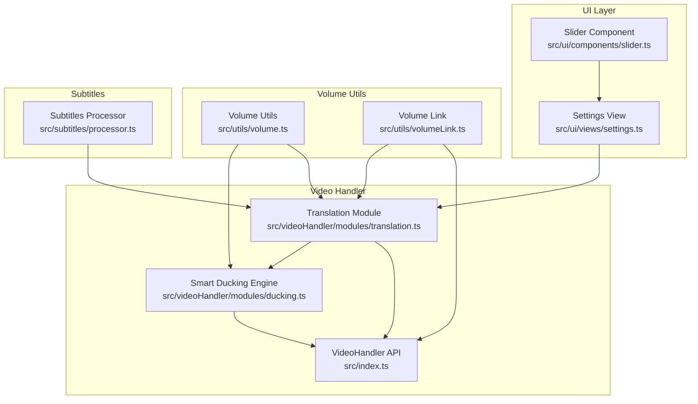
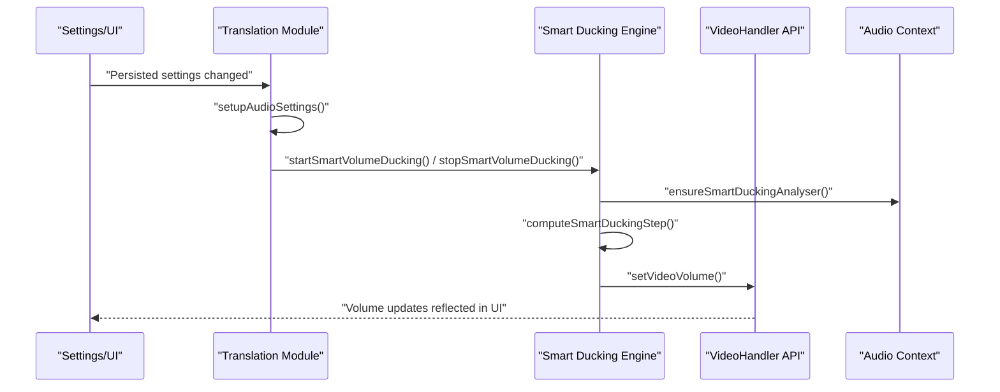
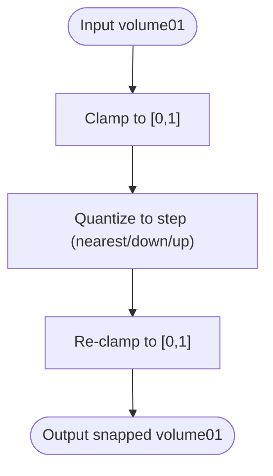
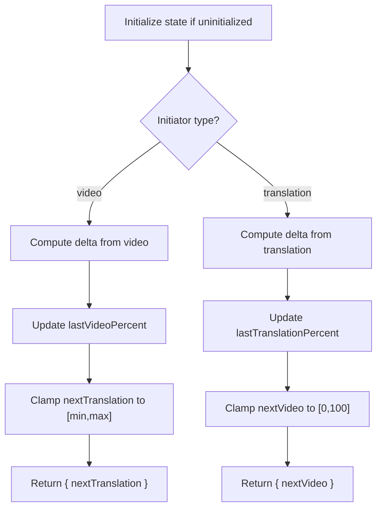
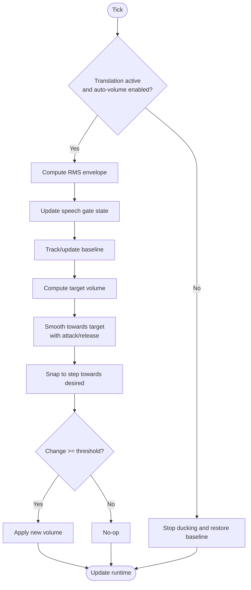
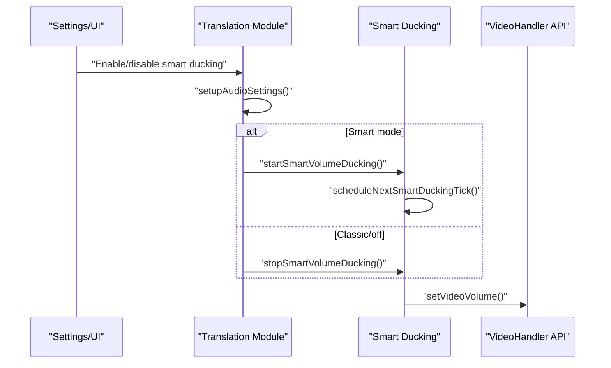
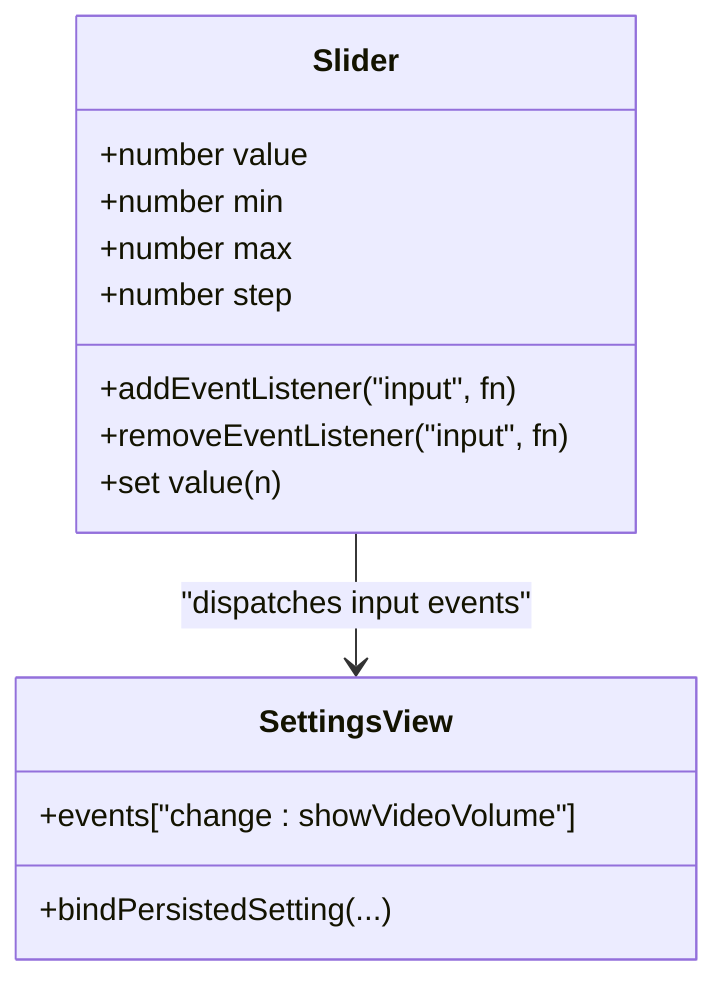
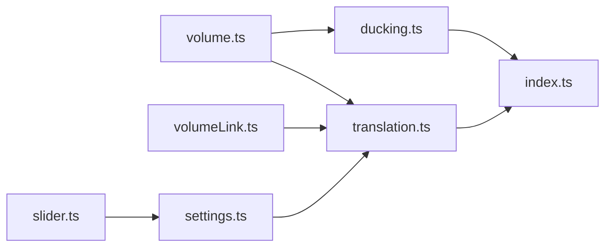

# Volume Management System

<cite>
**Referenced Files in This Document**
- [volume.ts](file://src/utils/volume.ts)
- [volumeLink.ts](file://src/utils/volumeLink.ts)
- [ducking.ts](file://src/videoHandler/modules/ducking.ts)
- [translation.ts](file://src/videoHandler/modules/translation.ts)
- [settings.ts](file://src/ui/views/settings.ts)
- [slider.ts](file://src/ui/components/slider.ts)
- [index.ts](file://src/index.ts)
- [processor.ts](file://src/subtitles/processor.ts)
</cite>

## Table of Contents
1. [Introduction](#introduction)
2. [Project Structure](#project-structure)
3. [Core Components](#core-components)
4. [Architecture Overview](#architecture-overview)
5. [Detailed Component Analysis](#detailed-component-analysis)
6. [Dependency Analysis](#dependency-analysis)
7. [Performance Considerations](#performance-considerations)
8. [Troubleshooting Guide](#troubleshooting-guide)
9. [Conclusion](#conclusion)

## Introduction
This document describes the volume management system responsible for:
- Volume normalization and step-based quantization
- Multi-source audio coordination and synchronization
- Smart auto-volume ducking with RMS-based gating
- Volume linking to maintain consistent balance across video and translation tracks
- Integration with translation audio playback and subtitle timing
- User volume preferences and UI controls
- Restoration logic and conflict resolution between automatic and manual adjustments
- Performance characteristics and optimization techniques for smooth transitions

## Project Structure
The volume management system spans several modules:
- Utilities for volume normalization and quantization
- Volume linking for synchronized sliders
- Smart ducking engine for automatic volume adjustment
- Translation module orchestrating audio playback and ducking
- UI components for user controls and persistence
- Integration with subtitle timing and language learning features

**Diagram sources**
- [slider.ts](file://src/ui/components/slider.ts)
- [settings.ts](file://src/ui/views/settings.ts)
- [volume.ts](file://src/utils/volume.ts)
- [volumeLink.ts](file://src/utils/volumeLink.ts)
- [translation.ts](file://src/videoHandler/modules/translation.ts)
- [ducking.ts](file://src/videoHandler/modules/ducking.ts)
- [index.ts](file://src/index.ts)
- [processor.ts](file://src/subtitles/processor.ts)

**Section sources**
- [volume.ts](file://src/utils/volume.ts)
- [volumeLink.ts](file://src/utils/volumeLink.ts)
- [ducking.ts](file://src/videoHandler/modules/ducking.ts)
- [translation.ts](file://src/videoHandler/modules/translation.ts)
- [settings.ts](file://src/ui/views/settings.ts)
- [slider.ts](file://src/ui/components/slider.ts)
- [index.ts](file://src/index.ts)
- [processor.ts](file://src/subtitles/processor.ts)

## Core Components
- Volume normalization and quantization utilities:
  - Clamp and round to percentage ranges
  - Step-based quantization for smooth transitions
  - Direction-aware snapping towards desired targets
- Volume linking:
  - Snapshot synchronization for video and translation sliders
  - Delta propagation preserving relative offsets
- Smart auto-volume ducking:
  - RMS envelope detection and speech gating
  - Attack/release smoothing with per-frame limits
  - Baseline tracking and restoration logic
- Translation orchestration:
  - Audio analyser setup and RMS computation
  - Tick scheduling and ducking decisions
  - Integration with proxy and caching systems
- UI controls and persistence:
  - Slider component emitting normalized values
  - Settings binding for auto-volume, smart ducking, and sync modes
- Subtitles integration:
  - Timing alignment with translation playback
  - Language learning scenarios coordinating audio and text

**Section sources**
- [volume.ts](file://src/utils/volume.ts)
- [volumeLink.ts](file://src/utils/volumeLink.ts)
- [ducking.ts](file://src/videoHandler/modules/ducking.ts)
- [translation.ts](file://src/videoHandler/modules/translation.ts)
- [settings.ts](file://src/ui/views/settings.ts)
- [slider.ts](file://src/ui/components/slider.ts)
- [index.ts](file://src/index.ts)
- [processor.ts](file://src/subtitles/processor.ts)

## Architecture Overview
The system integrates UI controls, volume utilities, linking, and smart ducking into a cohesive pipeline. The translation module drives automatic volume adjustments based on real-time audio analysis, while the UI persists user preferences and exposes controls.

**Diagram sources**
- [settings.ts](file://src/ui/views/settings.ts)
- [translation.ts](file://src/videoHandler/modules/translation.ts)
- [ducking.ts](file://src/videoHandler/modules/ducking.ts)
- [index.ts](file://src/index.ts)

## Detailed Component Analysis

### Volume Normalization and Step-Based Quantization
- Purpose:
  - Normalize floating-point volume to 0..1 range
  - Convert between percentage and 0..1 representations
  - Quantize to fixed steps (e.g., 0.01) with nearest/down/up snapping
  - Snap towards a desired target while respecting step sizes
- Key behaviors:
  - Clamping ensures inputs stay within valid bounds
  - Quantization prevents micro-adjustments and stabilizes UI
  - Direction-aware snapping reduces overshoot when approaching targets
- Typical usage:
  - Preparing user input from UI sliders
  - Applying smooth transitions in automatic ducking

**Diagram sources**
- [volume.ts](file://src/utils/volume.ts)

**Section sources**
- [volume.ts](file://src/utils/volume.ts)

### Volume Linking Mechanism
- Purpose:
  - Keep video and translation sliders in sync
  - Propagate changes consistently while respecting bounds
- Behavior:
  - Snapshot last known percentages for both tracks
  - On delta change, compute difference and apply to linked track
  - Clamp linked track to configured min/max
- Conflict handling:
  - Initializes snapshots on first change
  - Preserves relative offsets until clamping occurs

**Diagram sources**
- [volumeLink.ts](file://src/utils/volumeLink.ts)

**Section sources**
- [volumeLink.ts](file://src/utils/volumeLink.ts)

### Smart Auto-Volume Ducking
- Purpose:
  - Automatically lower video volume when translation audio plays
  - Use RMS-based speech gating to avoid abrupt changes
- Core logic:
  - RMS envelope computed via Web Audio Analyser
  - Speech gate opens/closes based on thresholds and hold timing
  - Baseline volume tracked; external changes update baseline
  - Attack/release smoothing with per-second limits
  - Step-based quantization to ensure smooth transitions
- Decision outcomes:
  - Apply: set new volume and update runtime
  - Noop: continue with current state
  - Stop: halt ducking and optionally restore baseline

**Diagram sources**
- [ducking.ts](file://src/videoHandler/modules/ducking.ts)
- [volume.ts](file://src/utils/volume.ts)

**Section sources**
- [ducking.ts](file://src/videoHandler/modules/ducking.ts)
- [volume.ts](file://src/utils/volume.ts)

### Translation Module Orchestration
- Responsibilities:
  - Manage audio analyser lifecycle and connections
  - Probe and validate translation audio URLs
  - Schedule and execute translation refresh cycles
  - Coordinate smart ducking ticks and runtime state
  - Persist and restore volume on demand
- Integration points:
  - Reads/writes runtime state to handler fields
  - Uses VideoHandler API to set/get video volume
  - Listens to UI settings changes to adjust behavior

**Diagram sources**
- [translation.ts](file://src/videoHandler/modules/translation.ts)
- [ducking.ts](file://src/videoHandler/modules/ducking.ts)
- [index.ts](file://src/index.ts)

**Section sources**
- [translation.ts](file://src/videoHandler/modules/translation.ts)
- [ducking.ts](file://src/videoHandler/modules/ducking.ts)
- [index.ts](file://src/index.ts)

### UI Controls and Event Handling
- Slider component:
  - Emits normalized values on input
  - Maintains min/max/step and updates progress visuals
  - Dispatches events with origin flag for internal suppression
- Settings binding:
  - Persists auto-volume, smart ducking, and sync toggles
  - Adjusts dependent controls (e.g., disables conflicting options)
  - Triggers audio setting updates after persistence

**Diagram sources**
- [slider.ts](file://src/ui/components/slider.ts)
- [settings.ts](file://src/ui/views/settings.ts)

**Section sources**
- [slider.ts](file://src/ui/components/slider.ts)
- [settings.ts](file://src/ui/views/settings.ts)

### Integration with Translation Audio Playback and Subtitles
- Translation playback:
  - Validates and proxies audio URLs
  - Manages analyser connections for RMS computation
  - Schedules periodic refresh for long-form content
- Subtitle timing:
  - Processes and aligns subtitle tokens with audio timing
  - Coordinates language learning playback with translation media
- Coordinated behavior:
  - Ducking respects host video activity and translation gating
  - UI reflects current auto-volume target and sync state

**Section sources**
- [translation.ts](file://src/videoHandler/modules/translation.ts)
- [processor.ts](file://src/subtitles/processor.ts)

## Dependency Analysis
- Internal dependencies:
  - Ducking depends on volume utilities for quantization and step sizes
  - Translation module depends on ducking runtime and VideoHandler API
  - Settings and Slider components depend on persisted settings and event dispatch
- External integrations:
  - Web Audio API for analyser and RMS computation
  - HTMLMediaElement for playback and volume control
  - UI framework for rendering and event handling

**Diagram sources**
- [volume.ts](file://src/utils/volume.ts)
- [volumeLink.ts](file://src/utils/volumeLink.ts)
- [ducking.ts](file://src/videoHandler/modules/ducking.ts)
- [translation.ts](file://src/videoHandler/modules/translation.ts)
- [index.ts](file://src/index.ts)
- [slider.ts](file://src/ui/components/slider.ts)
- [settings.ts](file://src/ui/views/settings.ts)

**Section sources**
- [volume.ts](file://src/utils/volume.ts)
- [volumeLink.ts](file://src/utils/volumeLink.ts)
- [ducking.ts](file://src/videoHandler/modules/ducking.ts)
- [translation.ts](file://src/videoHandler/modules/translation.ts)
- [index.ts](file://src/index.ts)
- [slider.ts](file://src/ui/components/slider.ts)
- [settings.ts](file://src/ui/views/settings.ts)

## Performance Considerations
- RMS computation:
  - Use Float32 time-domain data when available to reduce quantization artifacts
  - Limit analyser updates to necessary intervals (tickMs)
- Smoothing and limits:
  - Enforce per-second attack/release caps to prevent abrupt changes
  - Apply step-based quantization to minimize frequent small updates
- Memory and lifecycle:
  - Disconnect analyser and media sources when not needed
  - Clear stale audio sources to avoid resource leaks
- UI responsiveness:
  - Debounce or throttle slider input events
  - Suppress external observer reactions to programmatic volume changes to avoid loops

[No sources needed since this section provides general guidance]

## Troubleshooting Guide
- Volume does not change when adjusting sliders:
  - Verify sync mode is disabled; when sync is on, manual changes are suppressed
  - Check that auto-volume is enabled and smart ducking is not overriding
- Ducking does not activate:
  - Ensure translation audio is playing and analyser is connected
  - Confirm smart ducking is enabled and thresholds are met
- Volume jumps or stutters:
  - Reduce step size or increase tickMs for smoother transitions
  - Verify that external volume changes are not overriding baseline frequently
- Subtitles timing misalignment:
  - Re-check translation refresh scheduling and URL validation
  - Confirm analyser data availability and RMS computation stability

**Section sources**
- [translation.ts](file://src/videoHandler/modules/translation.ts)
- [ducking.ts](file://src/videoHandler/modules/ducking.ts)
- [settings.ts](file://src/ui/views/settings.ts)

## Conclusion
The volume management system combines precise normalization, step-based quantization, and intelligent linking to deliver a robust, user-friendly audio experience. Smart ducking ensures natural balance between video and translation audio, while UI controls and persistence enable customization. The architecture supports smooth transitions, conflict-free operation, and seamless integration with translation and subtitle workflows.