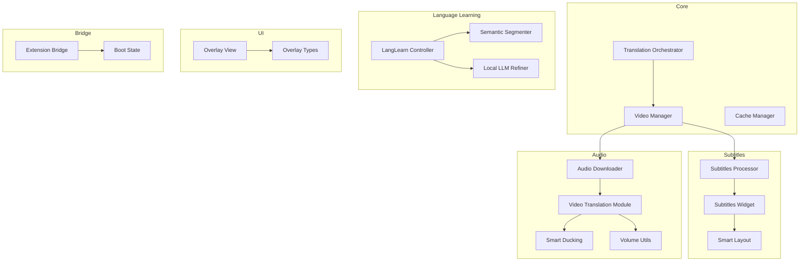
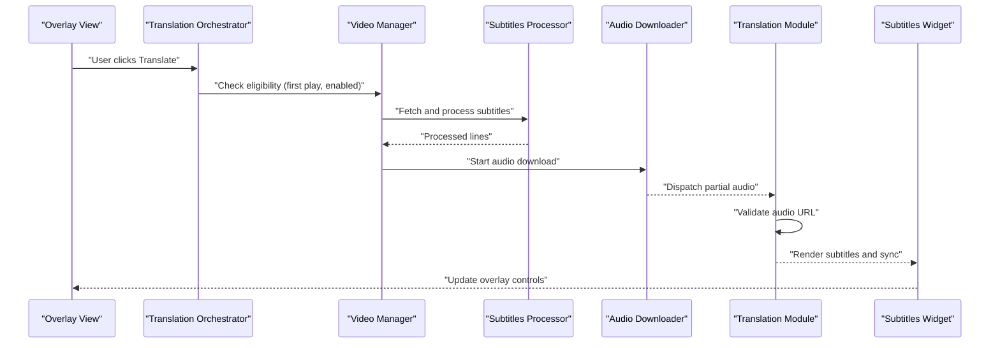
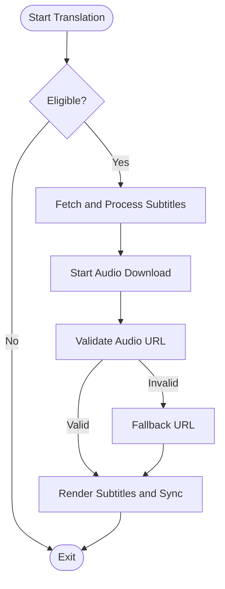
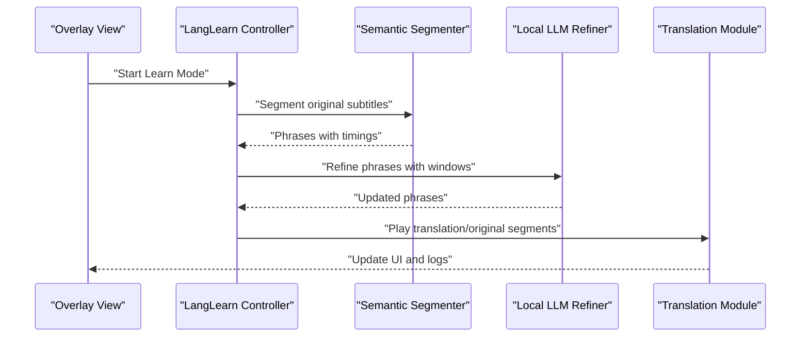
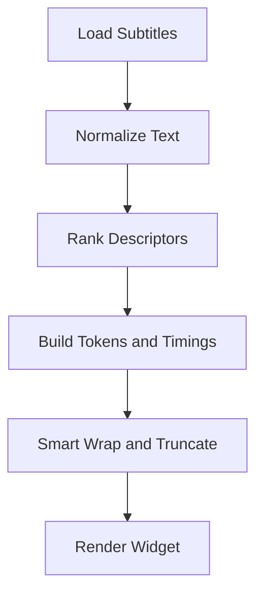
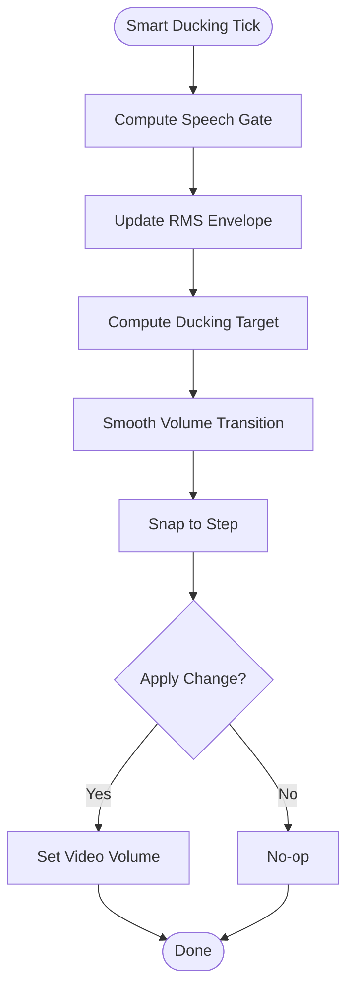
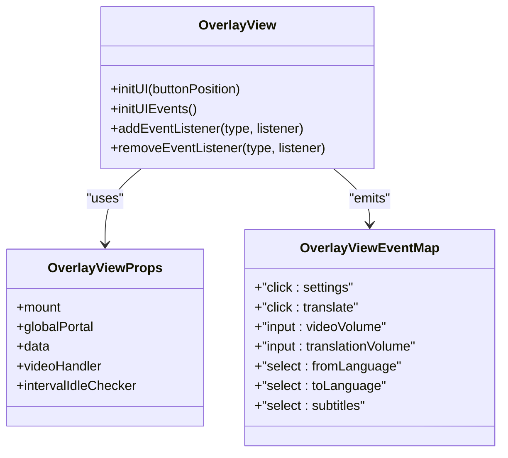
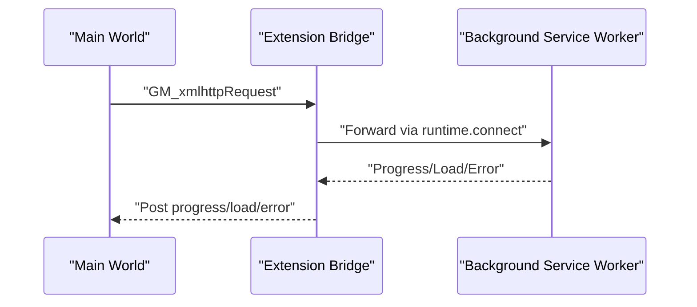
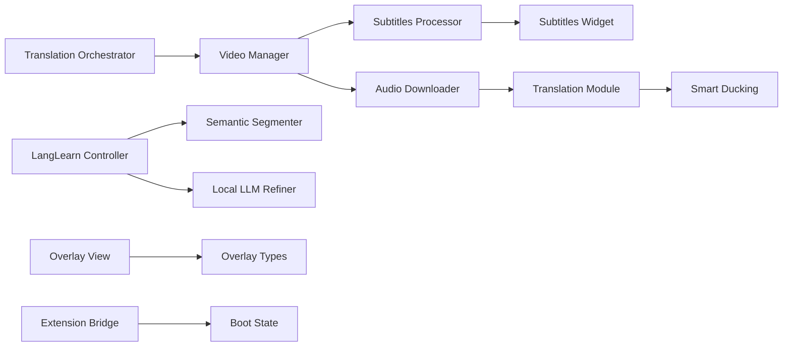

# Core Features

<cite>
**Referenced Files in This Document**
- [src/core/translationOrchestrator.ts](file://src/core/translationOrchestrator.ts)
- [src/langLearn/phraseSegmenter/semanticSegmenter.ts](file://src/langLearn/phraseSegmenter/semanticSegmenter.ts)
- [src/langLearn/phraseSegmenter/localLLMRefiner.ts](file://src/langLearn/phraseSegmenter/localLLMRefiner.ts)
- [src/langLearn/LangLearnController.ts](file://src/langLearn/LangLearnController.ts)
- [src/subtitles/processor.ts](file://src/subtitles/processor.ts)
- [src/subtitles/smartLayout.ts](file://src/subtitles/smartLayout.ts)
- [src/subtitles/widget.ts](file://src/subtitles/widget.ts)
- [src/audioDownloader/index.ts](file://src/audioDownloader/index.ts)
- [src/videoHandler/modules/translation.ts](file://src/videoHandler/modules/translation.ts)
- [src/videoHandler/modules/ducking.ts](file://src/videoHandler/modules/ducking.ts)
- [src/utils/volume.ts](file://src/utils/volume.ts)
- [src/ui/views/overlay.ts](file://src/ui/views/overlay.ts)
- [src/extension/bridge.ts](file://src/extension/bridge.ts)
- [src/bootstrap/bootState.ts](file://src/bootstrap/bootState.ts)
- [src/types/views/overlay.ts](file://src/types/views/overlay.ts)
</cite>

## Table of Contents
1. [Introduction](#introduction)
2. [Project Structure](#project-structure)
3. [Core Components](#core-components)
4. [Architecture Overview](#architecture-overview)
5. [Detailed Component Analysis](#detailed-component-analysis)
6. [Dependency Analysis](#dependency-analysis)
7. [Performance Considerations](#performance-considerations)
8. [Troubleshooting Guide](#troubleshooting-guide)
9. [Conclusion](#conclusion)

## Introduction
This document explains the core features of the English Teacher extension with a focus on:
- Real-time video translation engine (multi-service support, audio download management, translation validation)
- Advanced language learning features (semantic phrase segmentation, local LLM refinement, synchronized playback)
- Subtitle processing system (smart layout, timing alignment, format conversion)
- Audio synchronization (adaptive volume control, smart ducking, volume linking)
- User interface components (overlay controls, settings panel, customizable styling)
- Cross-platform compatibility and extension bridge architecture
- Practical examples, performance considerations, and troubleshooting guidance

## Project Structure
The extension is organized around modular subsystems:
- Core orchestration and lifecycle management
- Subtitle processing and rendering
- Audio translation pipeline and validation
- Language learning workflow and playback
- UI overlays and settings
- Extension bridge for cross-world communication

**Diagram sources**
- [src/core/translationOrchestrator.ts:1-85](file://src/core/translationOrchestrator.ts#L1-L85)
- [src/subtitles/processor.ts:632-800](file://src/subtitles/processor.ts#L632-L800)
- [src/subtitles/widget.ts:110-800](file://src/subtitles/widget.ts#L110-L800)
- [src/subtitles/smartLayout.ts:105-138](file://src/subtitles/smartLayout.ts#L105-L138)
- [src/audioDownloader/index.ts:87-189](file://src/audioDownloader/index.ts#L87-L189)
- [src/videoHandler/modules/translation.ts:1-800](file://src/videoHandler/modules/translation.ts#L1-L800)
- [src/videoHandler/modules/ducking.ts:1-300](file://src/videoHandler/modules/ducking.ts#L1-L300)
- [src/utils/volume.ts:1-97](file://src/utils/volume.ts#L1-L97)
- [src/langLearn/phraseSegmenter/semanticSegmenter.ts:730-746](file://src/langLearn/phraseSegmenter/semanticSegmenter.ts#L730-L746)
- [src/langLearn/phraseSegmenter/localLLMRefiner.ts:1-562](file://src/langLearn/phraseSegmenter/localLLMRefiner.ts#L1-L562)
- [src/langLearn/LangLearnController.ts:1-753](file://src/langLearn/LangLearnController.ts#L1-L753)
- [src/ui/views/overlay.ts:29-800](file://src/ui/views/overlay.ts#L29-L800)
- [src/types/views/overlay.ts:1-41](file://src/types/views/overlay.ts#L1-L41)
- [src/extension/bridge.ts:1-699](file://src/extension/bridge.ts#L1-L699)
- [src/bootstrap/bootState.ts:1-42](file://src/bootstrap/bootState.ts#L1-L42)

**Section sources**
- [src/core/translationOrchestrator.ts:1-85](file://src/core/translationOrchestrator.ts#L1-L85)
- [src/subtitles/processor.ts:632-800](file://src/subtitles/processor.ts#L632-L800)
- [src/subtitles/widget.ts:110-800](file://src/subtitles/widget.ts#L110-L800)
- [src/subtitles/smartLayout.ts:105-138](file://src/subtitles/smartLayout.ts#L105-L138)
- [src/audioDownloader/index.ts:87-189](file://src/audioDownloader/index.ts#L87-L189)
- [src/videoHandler/modules/translation.ts:1-800](file://src/videoHandler/modules/translation.ts#L1-L800)
- [src/videoHandler/modules/ducking.ts:1-300](file://src/videoHandler/modules/ducking.ts#L1-L300)
- [src/utils/volume.ts:1-97](file://src/utils/volume.ts#L1-L97)
- [src/langLearn/phraseSegmenter/semanticSegmenter.ts:730-746](file://src/langLearn/phraseSegmenter/semanticSegmenter.ts#L730-L746)
- [src/langLearn/phraseSegmenter/localLLMRefiner.ts:1-562](file://src/langLearn/phraseSegmenter/localLLMRefiner.ts#L1-L562)
- [src/langLearn/LangLearnController.ts:1-753](file://src/langLearn/LangLearnController.ts#L1-L753)
- [src/ui/views/overlay.ts:29-800](file://src/ui/views/overlay.ts#L29-L800)
- [src/types/views/overlay.ts:1-41](file://src/types/views/overlay.ts#L1-L41)
- [src/extension/bridge.ts:1-699](file://src/extension/bridge.ts#L1-L699)
- [src/bootstrap/bootState.ts:1-42](file://src/bootstrap/bootState.ts#L1-L42)

## Core Components
- Translation Orchestrator: Manages auto-translation eligibility, defers on muted mobile YouTube, and coordinates scheduling.
- Subtitles Processor: Normalizes, ranks, and formats subtitles from multiple sources (YouTube, VK, JSON/SRT/VTT).
- Subtitles Widget: Renders and positions subtitles with smart wrapping, layout, and drag-and-drop.
- Audio Downloader: Streams and dispatches partial audio buffers for progressive playback.
- Translation Module: Validates audio URLs, proxies audio, and manages refresh cycles.
- Smart Ducking: Dynamically adjusts video volume based on translated audio RMS.
- Language Learning Controller: Aligns original and translated phrases, refines with local LLM, and drives synchronized playback.
- Overlay View: Provides UI controls for translation, subtitles, volume, and settings.
- Extension Bridge: Bridges isolated content script world to background for privileged operations.

**Section sources**
- [src/core/translationOrchestrator.ts:21-85](file://src/core/translationOrchestrator.ts#L21-L85)
- [src/subtitles/processor.ts:632-800](file://src/subtitles/processor.ts#L632-L800)
- [src/subtitles/widget.ts:110-800](file://src/subtitles/widget.ts#L110-L800)
- [src/audioDownloader/index.ts:87-189](file://src/audioDownloader/index.ts#L87-L189)
- [src/videoHandler/modules/translation.ts:623-800](file://src/videoHandler/modules/translation.ts#L623-L800)
- [src/videoHandler/modules/ducking.ts:111-275](file://src/videoHandler/modules/ducking.ts#L111-L275)
- [src/langLearn/LangLearnController.ts:64-171](file://src/langLearn/LangLearnController.ts#L64-L171)
- [src/ui/views/overlay.ts:29-800](file://src/ui/views/overlay.ts#L29-L800)
- [src/extension/bridge.ts:1-699](file://src/extension/bridge.ts#L1-L699)

## Architecture Overview
The system integrates UI, processing, and transport layers:
- UI layer emits events (translate, volume changes, language selection).
- Core orchestrators coordinate translation and subtitle workflows.
- Subtitle processors fetch, normalize, and align text/timing.
- Audio pipeline handles downloads, validation, and playback.
- Language learning engine aligns phrases and drives synchronized playback.
- Extension bridge enables cross-world communication and privileged operations.

**Diagram sources**
- [src/ui/views/overlay.ts:468-520](file://src/ui/views/overlay.ts#L468-L520)
- [src/core/translationOrchestrator.ts:42-83](file://src/core/translationOrchestrator.ts#L42-L83)
- [src/subtitles/processor.ts:789-800](file://src/subtitles/processor.ts#L789-L800)
- [src/audioDownloader/index.ts:103-125](file://src/audioDownloader/index.ts#L103-L125)
- [src/videoHandler/modules/translation.ts:623-651](file://src/videoHandler/modules/translation.ts#L623-L651)
- [src/subtitles/widget.ts:362-422](file://src/subtitles/widget.ts#L362-L422)

## Detailed Component Analysis

### Real-time Video Translation Engine
- Multi-service support: Subtitles fetched from YouTube, VK, and JSON/SRT/VTT; ranked and normalized.
- Audio download management: Progressive streaming with partial-buffer events and validation.
- Translation validation: URL probing and fallback handling; proxy support for audio endpoints.

**Diagram sources**
- [src/core/translationOrchestrator.ts:42-83](file://src/core/translationOrchestrator.ts#L42-L83)
- [src/subtitles/processor.ts:789-800](file://src/subtitles/processor.ts#L789-L800)
- [src/audioDownloader/index.ts:103-125](file://src/audioDownloader/index.ts#L103-L125)
- [src/videoHandler/modules/translation.ts:623-651](file://src/videoHandler/modules/translation.ts#L623-L651)

**Section sources**
- [src/subtitles/processor.ts:632-800](file://src/subtitles/processor.ts#L632-L800)
- [src/audioDownloader/index.ts:87-189](file://src/audioDownloader/index.ts#L87-L189)
- [src/videoHandler/modules/translation.ts:623-800](file://src/videoHandler/modules/translation.ts#L623-L800)

### Advanced Language Learning Features
- Semantic phrase segmentation: Splits lines into meaningful phrases with punctuation-aware boundaries and duration constraints.
- Local LLM refinement: Detects suspicious phrases, builds windows, prompts local WebLLM, redistributes timings to preserve rhythm.
- Synchronized playback: Drives translation/original playback with precise seeking, rate adjustment, and pause controls.

**Diagram sources**
- [src/langLearn/LangLearnController.ts:72-171](file://src/langLearn/LangLearnController.ts#L72-L171)
- [src/langLearn/phraseSegmenter/semanticSegmenter.ts:626-728](file://src/langLearn/phraseSegmenter/semanticSegmenter.ts#L626-L728)
- [src/langLearn/phraseSegmenter/localLLMRefiner.ts:411-562](file://src/langLearn/phraseSegmenter/localLLMRefiner.ts#L411-L562)
- [src/videoHandler/modules/translation.ts:366-398](file://src/videoHandler/modules/translation.ts#L366-L398)

**Section sources**
- [src/langLearn/phraseSegmenter/semanticSegmenter.ts:626-728](file://src/langLearn/phraseSegmenter/semanticSegmenter.ts#L626-L728)
- [src/langLearn/phraseSegmenter/localLLMRefiner.ts:411-562](file://src/langLearn/phraseSegmenter/localLLMRefiner.ts#L411-L562)
- [src/langLearn/LangLearnController.ts:64-171](file://src/langLearn/LangLearnController.ts#L64-L171)

### Subtitle Processing System
- Smart layout: Computes font size, max width, and line length based on anchor box and aspect ratio.
- Timing alignment: Builds tokenized lines and allocates timings by length or source tokens.
- Format conversion: Converts SRT/VTT to JSON and cleans duplicates and HTML artifacts.

**Diagram sources**
- [src/subtitles/smartLayout.ts:105-138](file://src/subtitles/smartLayout.ts#L105-L138)
- [src/subtitles/processor.ts:632-651](file://src/subtitles/processor.ts#L632-L651)
- [src/subtitles/widget.ts:296-335](file://src/subtitles/widget.ts#L296-L335)

**Section sources**
- [src/subtitles/smartLayout.ts:105-138](file://src/subtitles/smartLayout.ts#L105-L138)
- [src/subtitles/processor.ts:632-651](file://src/subtitles/processor.ts#L632-L651)
- [src/subtitles/widget.ts:296-335](file://src/subtitles/widget.ts#L296-L335)

### Audio Synchronization Features
- Adaptive volume control: Snaps volume to steps and clamps values for UI and audio contexts.
- Smart ducking: Uses RMS envelope detection, gating thresholds, and smooth transitions to adjust video volume.
- Volume linking: Integrates with translation module to maintain baseline and restore on stop.

**Diagram sources**
- [src/videoHandler/modules/ducking.ts:111-275](file://src/videoHandler/modules/ducking.ts#L111-L275)
- [src/utils/volume.ts:66-97](file://src/utils/volume.ts#L66-L97)
- [src/videoHandler/modules/translation.ts:503-565](file://src/videoHandler/modules/translation.ts#L503-L565)

**Section sources**
- [src/videoHandler/modules/ducking.ts:111-275](file://src/videoHandler/modules/ducking.ts#L111-L275)
- [src/utils/volume.ts:66-97](file://src/utils/volume.ts#L66-L97)
- [src/videoHandler/modules/translation.ts:503-565](file://src/videoHandler/modules/translation.ts#L503-L565)

### User Interface Components
- Overlay controls: Translate, PiP, download, settings, language pair selection, and volume sliders.
- Settings panel: Language selection, subtitle options, and volume controls.
- Customizable styling: Smart layout variables and drag-and-drop positioning.

**Diagram sources**
- [src/ui/views/overlay.ts:29-800](file://src/ui/views/overlay.ts#L29-L800)
- [src/types/views/overlay.ts:1-41](file://src/types/views/overlay.ts#L1-L41)

**Section sources**
- [src/ui/views/overlay.ts:29-800](file://src/ui/views/overlay.ts#L29-L800)
- [src/types/views/overlay.ts:1-41](file://src/types/views/overlay.ts#L1-L41)

### Cross-Platform Compatibility and Extension Bridge
- Isolated world bridge: Exposes storage and GM_* APIs to main world via postMessage and ports.
- Boot state management: Guards initialization and ensures single initialization.
- UA client hints: Normalizes headers for Yandex endpoints to improve compatibility.

**Diagram sources**
- [src/extension/bridge.ts:335-561](file://src/extension/bridge.ts#L335-L561)
- [src/bootstrap/bootState.ts:26-42](file://src/bootstrap/bootState.ts#L26-L42)

**Section sources**
- [src/extension/bridge.ts:1-699](file://src/extension/bridge.ts#L1-L699)
- [src/bootstrap/bootState.ts:1-42](file://src/bootstrap/bootState.ts#L1-L42)

## Dependency Analysis
- Translation Orchestrator depends on video state and scheduling hooks.
- Subtitles Processor depends on subtitle descriptors and normalization utilities.
- Audio Downloader depends on strategies and event dispatchers.
- Translation Module depends on validation, proxying, and cache management.
- LangLearn Controller depends on segmentation and refinement modules.
- UI Overlay depends on event types and storage.

**Diagram sources**
- [src/core/translationOrchestrator.ts:9-27](file://src/core/translationOrchestrator.ts#L9-L27)
- [src/subtitles/processor.ts:632-651](file://src/subtitles/processor.ts#L632-L651)
- [src/subtitles/widget.ts:110-142](file://src/subtitles/widget.ts#L110-L142)
- [src/audioDownloader/index.ts:87-101](file://src/audioDownloader/index.ts#L87-L101)
- [src/videoHandler/modules/translation.ts:623-772](file://src/videoHandler/modules/translation.ts#L623-L772)
- [src/videoHandler/modules/ducking.ts:111-115](file://src/videoHandler/modules/ducking.ts#L111-L115)
- [src/langLearn/LangLearnController.ts:64-90](file://src/langLearn/LangLearnController.ts#L64-L90)
- [src/langLearn/phraseSegmenter/semanticSegmenter.ts:730-746](file://src/langLearn/phraseSegmenter/semanticSegmenter.ts#L730-L746)
- [src/langLearn/phraseSegmenter/localLLMRefiner.ts:411-462](file://src/langLearn/phraseSegmenter/localLLMRefiner.ts#L411-L462)
- [src/ui/views/overlay.ts:29-84](file://src/ui/views/overlay.ts#L29-L84)
- [src/types/views/overlay.ts:20-41](file://src/types/views/overlay.ts#L20-L41)
- [src/extension/bridge.ts:1-699](file://src/extension/bridge.ts#L1-L699)
- [src/bootstrap/bootState.ts:26-42](file://src/bootstrap/bootState.ts#L26-L42)

**Section sources**
- [src/core/translationOrchestrator.ts:9-27](file://src/core/translationOrchestrator.ts#L9-L27)
- [src/subtitles/processor.ts:632-651](file://src/subtitles/processor.ts#L632-L651)
- [src/audioDownloader/index.ts:87-101](file://src/audioDownloader/index.ts#L87-L101)
- [src/videoHandler/modules/translation.ts:623-772](file://src/videoHandler/modules/translation.ts#L623-L772)
- [src/videoHandler/modules/ducking.ts:111-115](file://src/videoHandler/modules/ducking.ts#L111-L115)
- [src/langLearn/LangLearnController.ts:64-90](file://src/langLearn/LangLearnController.ts#L64-L90)
- [src/langLearn/phraseSegmenter/semanticSegmenter.ts:730-746](file://src/langLearn/phraseSegmenter/semanticSegmenter.ts#L730-L746)
- [src/langLearn/phraseSegmenter/localLLMRefiner.ts:411-462](file://src/langLearn/phraseSegmenter/localLLMRefiner.ts#L411-L462)
- [src/ui/views/overlay.ts:29-84](file://src/ui/views/overlay.ts#L29-L84)
- [src/types/views/overlay.ts:20-41](file://src/types/views/overlay.ts#L20-L41)
- [src/extension/bridge.ts:1-699](file://src/extension/bridge.ts#L1-L699)
- [src/bootstrap/bootState.ts:26-42](file://src/bootstrap/bootState.ts#L26-L42)

## Performance Considerations
- Subtitle processing: Memoization of tokenization and layout computations reduces recomputation on minor changes.
- Audio pipeline: Progressive buffering minimizes latency; validation retries ensure robustness.
- Smart ducking: Configurable tick intervals and envelope smoothing balance responsiveness and CPU usage.
- Rendering: Video frame callbacks enable efficient updates; throttling via interval idle checker prevents excessive renders.
- Local LLM: Windowed processing and timeouts bound resource usage; WebGPU availability checked before initialization.

[No sources needed since this section provides general guidance]

## Troubleshooting Guide
- Translation not starting on mobile YouTube: Deferred until unmuted; check mute watcher and state transitions.
- Audio validation failures: Probe attempts with fallback to direct URL; verify proxy settings and headers.
- Subtitles not appearing: Ensure subtitles are fetched and processed; check cache keys and descriptor ranking.
- Smart ducking not working: Verify audio analyser availability and runtime state; confirm enabled auto-volume and smart ducking modes.
- Local LLM not refining: Check WebGPU availability and model initialization; review window building and prompt parsing.
- UI controls not responding: Confirm overlay initialization and event subscriptions; verify interval idle checker activity.

**Section sources**
- [src/core/translationOrchestrator.ts:42-83](file://src/core/translationOrchestrator.ts#L42-L83)
- [src/videoHandler/modules/translation.ts:623-651](file://src/videoHandler/modules/translation.ts#L623-L651)
- [src/subtitles/processor.ts:789-800](file://src/subtitles/processor.ts#L789-L800)
- [src/videoHandler/modules/ducking.ts:111-275](file://src/videoHandler/modules/ducking.ts#L111-L275)
- [src/langLearn/phraseSegmenter/localLLMRefiner.ts:19-28](file://src/langLearn/phraseSegmenter/localLLMRefiner.ts#L19-L28)
- [src/ui/views/overlay.ts:404-800](file://src/ui/views/overlay.ts#L404-L800)

## Conclusion
The English Teacher extension combines robust subtitle processing, flexible audio translation, intelligent language learning workflows, and a responsive UI. Its modular architecture, cross-world bridge, and performance-conscious design enable reliable, high-quality multilingual video experiences across platforms.