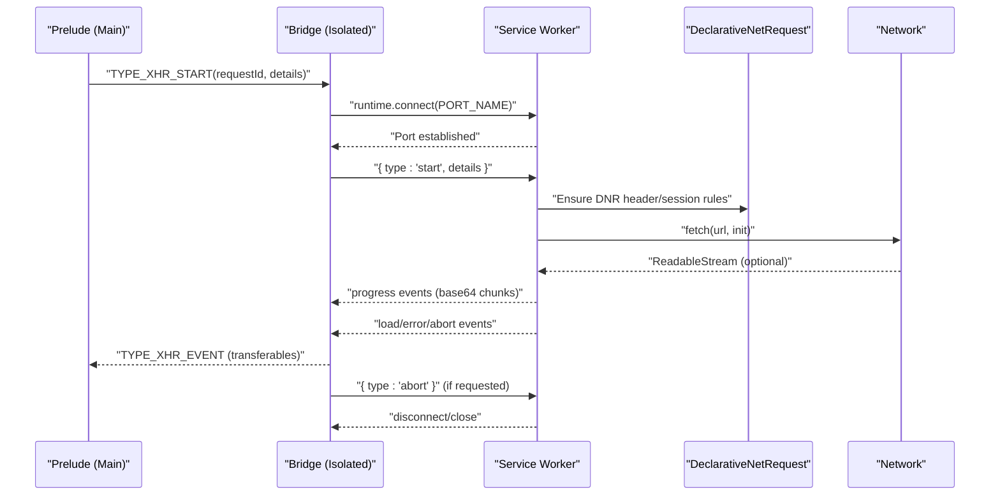
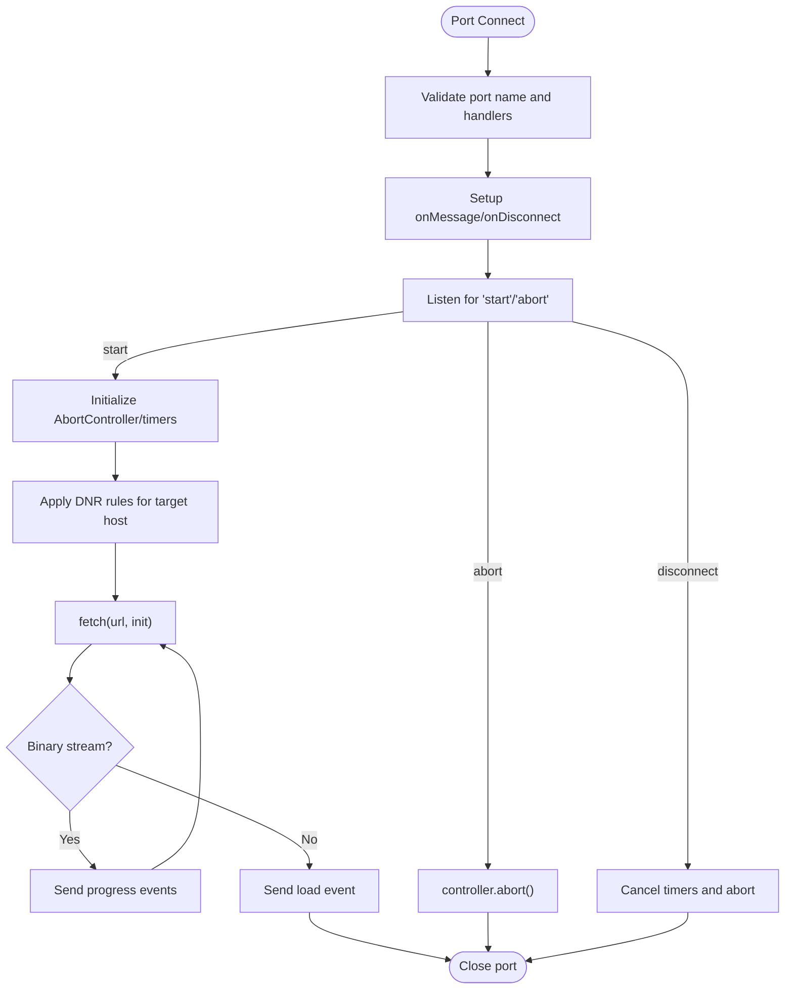
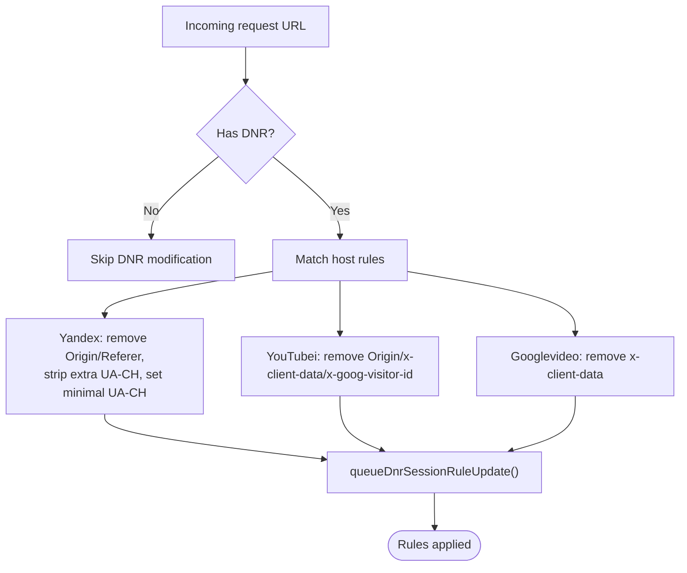
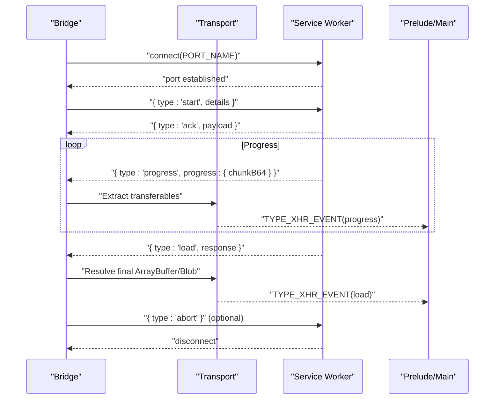
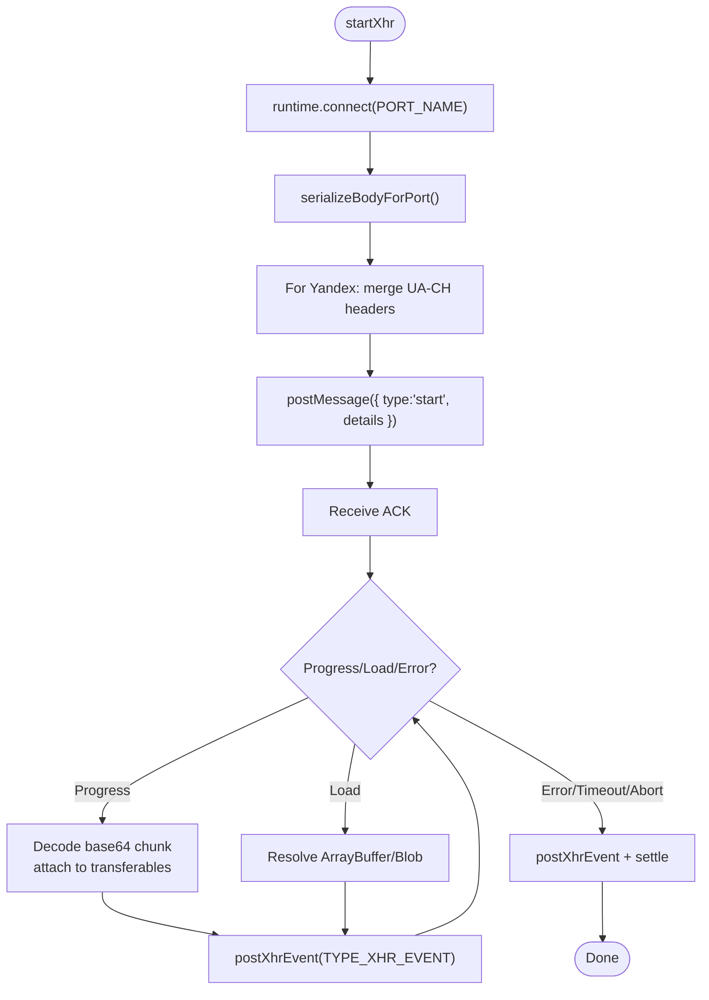
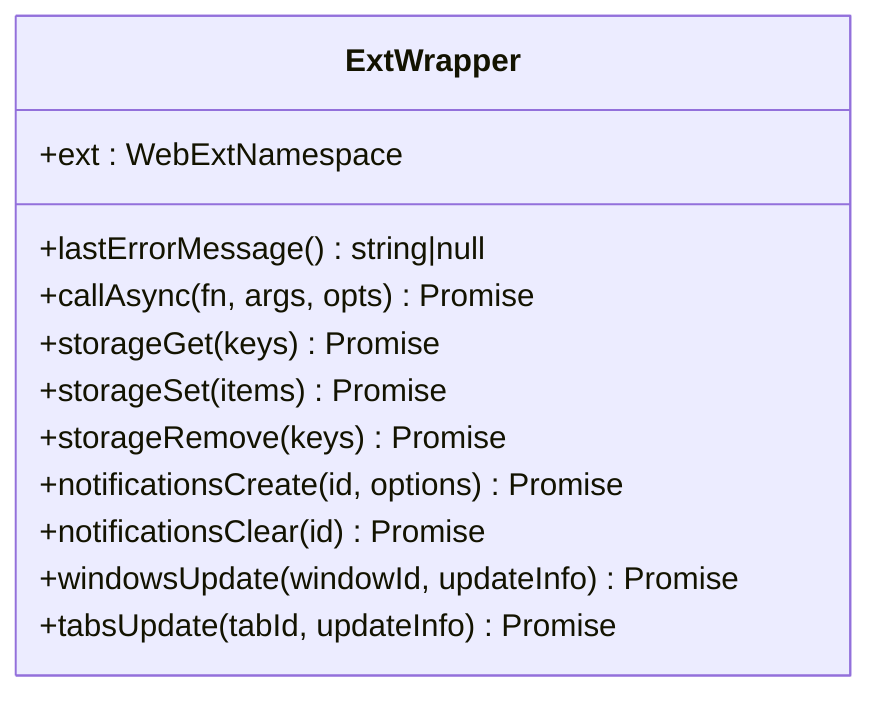
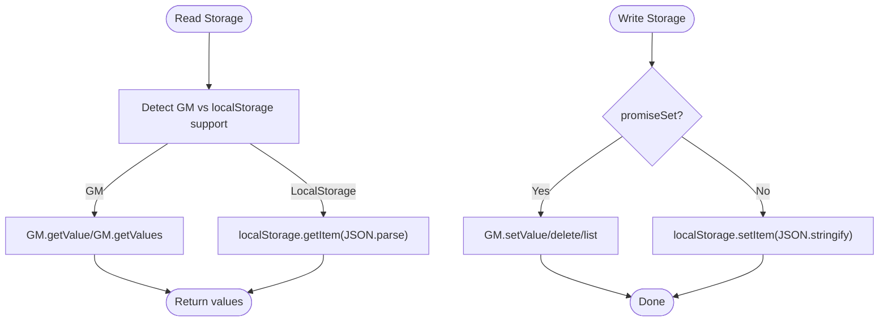
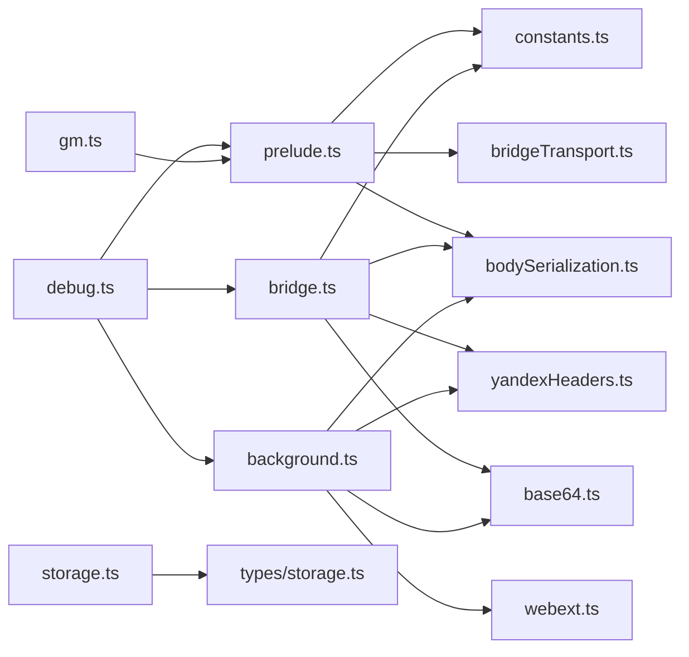

# Background Script & Service Worker

<cite>
**Referenced Files in This Document**
- [background.ts](file://src/extension/background.ts)
- [webext.ts](file://src/extension/webext.ts)
- [bridge.ts](file://src/extension/bridge.ts)
- [prelude.ts](file://src/extension/prelude.ts)
- [bridgeTransport.ts](file://src/extension/bridgeTransport.ts)
- [constants.ts](file://src/extension/constants.ts)
- [bodySerialization.ts](file://src/extension/bodySerialization.ts)
- [yandexHeaders.ts](file://src/extension/yandexHeaders.ts)
- [base64.ts](file://src/extension/base64.ts)
- [storage.ts](file://src/utils/storage.ts)
- [types/storage.ts](file://src/types/storage.ts)
- [debug.ts](file://src/utils/debug.ts)
- [gm.ts](file://src/utils/gm.ts)
</cite>

## Table of Contents
1. [Introduction](#introduction)
2. [Project Structure](#project-structure)
3. [Core Components](#core-components)
4. [Architecture Overview](#architecture-overview)
5. [Detailed Component Analysis](#detailed-component-analysis)
6. [Dependency Analysis](#dependency-analysis)
7. [Performance Considerations](#performance-considerations)
8. [Troubleshooting Guide](#troubleshooting-guide)
9. [Conclusion](#conclusion)
10. [Appendices](#appendices)

## Introduction
This document explains the background script and service worker implementation for the extension. It covers service worker lifecycle management, browser event handling, and extension state persistence. It documents the WebExtension API wrapper, declarativeNetRequest integration, port-based communication between content scripts and the service worker, storage management for preferences and cached data, browser-specific optimizations, and security/performance practices. Practical examples are included for registration, event listeners, and cross-tab communication.

## Project Structure
The extension uses a MV3 service worker as the background script. Communication between the page’s main world and the service worker is mediated by two isolated worlds:
- A prelude script in the main world that polyfills GM_* APIs and coordinates GM_xmlhttpRequest promises.
- A bridge script in an isolated world that proxies privileged operations (storage, notifications, GM_xmlhttpRequest) to the service worker via a named port.

```mermaid
graph TB
subgraph "Content Script Worlds"
MAIN["Main World<br/>Prelude (polyfills)"]
ISO["Isolated World<br/>Bridge (proxy)"]
end
SW["Service Worker<br/>Background (MV3)"]
MAIN --> |"postMessage"| ISO
ISO --|"runtime.connect(PORT_NAME)" --> SW
SW --> |"runtime.sendMessage"| MAIN
SW --> |"declarativeNetRequest"| BrowserDNRAPI["Browser DNR API"]
SW --> |"storage.local"| BrowserStorage["Browser Storage"]
SW --> |"notifications"| BrowserNotifications["Browser Notifications"]
```

**Diagram sources**
- [prelude.ts:613-641](file://src/extension/prelude.ts#L613-L641)
- [bridge.ts:638-699](file://src/extension/bridge.ts#L638-L699)
- [background.ts:487-533](file://src/extension/background.ts#L487-L533)
- [webext.ts:16-47](file://src/extension/webext.ts#L16-L47)

**Section sources**
- [prelude.ts:468-478](file://src/extension/prelude.ts#L468-L478)
- [bridge.ts:28-41](file://src/extension/bridge.ts#L28-L41)
- [background.ts:1-34](file://src/extension/background.ts#L1-L34)

## Core Components
- Service Worker (Background): Handles port connections, GM_xmlhttpRequest bridging, declarativeNetRequest header modifications, notifications, and storage-related tasks.
- WebExtension API Wrapper: Provides unified access to browser/chrome namespaces, async wrappers, and storage/notification helpers.
- Prelude (Main World): Installs GM_* polyfills, manages GM_xmlhttpRequest promises, and forwards requests to the bridge.
- Bridge (Isolated World): Serializes cross-world bodies, manages the port connection, relays events, and performs UA-CH caching for Yandex endpoints.
- Transport Layer: Ensures transferable objects are passed efficiently across worlds.
- Constants: Defines shared message types and port names.
- Serialization Utilities: Encodes/decodes request bodies for cross-world transport.
- Yandex Headers: Normalizes and filters headers for Yandex endpoints.
- Base64 Utilities: Efficient encoding/decoding for binary payloads.
- Storage Utilities: Unified storage abstraction with compatibility conversion and fallbacks.
- Types: Strongly-typed storage keys and data structures.

**Section sources**
- [background.ts:487-533](file://src/extension/background.ts#L487-L533)
- [webext.ts:16-187](file://src/extension/webext.ts#L16-L187)
- [prelude.ts:288-478](file://src/extension/prelude.ts#L288-L478)
- [bridge.ts:1-699](file://src/extension/bridge.ts#L1-L699)
- [bridgeTransport.ts:1-46](file://src/extension/bridgeTransport.ts#L1-L46)
- [constants.ts:10-102](file://src/extension/constants.ts#L10-L102)
- [bodySerialization.ts:1-570](file://src/extension/bodySerialization.ts#L1-L570)
- [yandexHeaders.ts:1-56](file://src/extension/yandexHeaders.ts#L1-L56)
- [base64.ts:1-128](file://src/extension/base64.ts#L1-L128)
- [storage.ts:204-380](file://src/utils/storage.ts#L204-L380)
- [types/storage.ts:18-135](file://src/types/storage.ts#L18-L135)

## Architecture Overview
The MV3 service worker acts as the central orchestrator:
- Listens for port connections from the bridge.
- Applies declarativeNetRequest rules for specific hosts to restore forbidden headers.
- Executes GM_xmlhttpRequest via fetch, streaming binary responses when needed.
- Relays notifications and storage operations to the browser APIs.
- Maintains per-port request state and ensures cleanup on disconnect/abort.



**Diagram sources**
- [prelude.ts:309-380](file://src/extension/prelude.ts#L309-L380)
- [bridge.ts:335-561](file://src/extension/bridge.ts#L335-L561)
- [background.ts:535-800](file://src/extension/background.ts#L535-L800)
- [yandexHeaders.ts:21-56](file://src/extension/yandexHeaders.ts#L21-L56)

## Detailed Component Analysis

### Service Worker Lifecycle and Port Management
- Port establishment: The bridge connects to the service worker using a predefined port name. The service worker validates the port and sets up message and disconnect handlers.
- Session sequencing: Each port maintains a monotonic session counter to track request lifecycles independently.
- Cleanup: On disconnect or abort, the service worker cancels the underlying fetch via AbortController and clears timers.



**Diagram sources**
- [background.ts:487-533](file://src/extension/background.ts#L487-L533)
- [background.ts:535-615](file://src/extension/background.ts#L535-L615)
- [background.ts:617-756](file://src/extension/background.ts#L617-L756)

**Section sources**
- [background.ts:487-533](file://src/extension/background.ts#L487-L533)
- [background.ts:535-615](file://src/extension/background.ts#L535-L615)
- [background.ts:617-756](file://src/extension/background.ts#L617-L756)

### DeclarativeNetRequest Integration
- Purpose: Restore forbidden headers (e.g., Origin, Sec-*, User-Agent) for specific hosts where page-world fetch/XHR cannot set them.
- Rules: Dynamically update session rules scoped to extension-initiated requests (tabIds: -1).
- Hosts: Yandex API, YouTubei, Googlevideo domains.
- Concurrency: Queue updates to prevent race conditions and redundant rule installs.



**Diagram sources**
- [background.ts:193-262](file://src/extension/background.ts#L193-L262)
- [background.ts:290-320](file://src/extension/background.ts#L290-L320)
- [background.ts:322-354](file://src/extension/background.ts#L322-L354)
- [yandexHeaders.ts:21-56](file://src/extension/yandexHeaders.ts#L21-L56)

**Section sources**
- [background.ts:193-262](file://src/extension/background.ts#L193-L262)
- [background.ts:290-320](file://src/extension/background.ts#L290-L320)
- [background.ts:322-354](file://src/extension/background.ts#L322-L354)
- [yandexHeaders.ts:21-56](file://src/extension/yandexHeaders.ts#L21-L56)

### Port-Based Communication (Bridge ↔ Service Worker)
- Message types: Requests, responses, notifications, XHR start/abort/ack/events.
- Transport: Transferable ArrayBuffer instances are forwarded to minimize copies.
- Binary handling: Large binary responses are streamed as base64 chunks; final aggregation reconstructs ArrayBuffer/Blob.
- UA-CH caching: For Yandex endpoints, UA client hints are collected in the isolated bridge and injected via DNR.



**Diagram sources**
- [constants.ts:15-91](file://src/extension/constants.ts#L15-L91)
- [bridgeTransport.ts:9-45](file://src/extension/bridgeTransport.ts#L9-L45)
- [bridge.ts:335-561](file://src/extension/bridge.ts#L335-L561)
- [prelude.ts:506-611](file://src/extension/prelude.ts#L506-L611)

**Section sources**
- [constants.ts:15-91](file://src/extension/constants.ts#L15-L91)
- [bridgeTransport.ts:9-45](file://src/extension/bridgeTransport.ts#L9-L45)
- [bridge.ts:335-561](file://src/extension/bridge.ts#L335-L561)
- [prelude.ts:506-611](file://src/extension/prelude.ts#L506-L611)

### GM_xmlhttpRequest Bridge (Isolated Bridge)
- UA-CH collection: Captures sec-ch-ua* headers from the page context and merges them for Yandex requests.
- Body serialization: Converts ArrayBuffer/TypedArray/Blob/JSON into a portable format; recovers from cross-world coercion.
- Event relay: Translates service worker events into page-visible events with proper state transitions.
- Timeout/fallback: Tracks last event timestamps and triggers a fallback timeout to emulate userscript behavior.



**Diagram sources**
- [bridge.ts:335-561](file://src/extension/bridge.ts#L335-L561)
- [bodySerialization.ts:466-534](file://src/extension/bodySerialization.ts#L466-L534)
- [yandexHeaders.ts:21-56](file://src/extension/yandexHeaders.ts#L21-L56)

**Section sources**
- [bridge.ts:335-561](file://src/extension/bridge.ts#L335-L561)
- [bodySerialization.ts:466-534](file://src/extension/bodySerialization.ts#L466-L534)
- [yandexHeaders.ts:21-56](file://src/extension/yandexHeaders.ts#L21-L56)

### WebExtension API Wrapper
- Cross-browser compatibility: Detects browser/chrome namespaces and normalizes callback/promise patterns.
- Storage helpers: Unified get/set/remove with Promise-based calls.
- Notification helpers: Best-effort creation/clearing with lastError handling.
- Windows/Tabs updates: Thin wrappers around browser APIs.



**Diagram sources**
- [webext.ts:16-187](file://src/extension/webext.ts#L16-L187)

**Section sources**
- [webext.ts:16-187](file://src/extension/webext.ts#L16-L187)

### Storage Management System
- Unified abstraction: VOTStorage supports GM promises and legacy GM_* APIs, with localStorage fallback.
- Compatibility conversion: Migrates old keys/values to new keys based on categories (string, number, array, numToBool).
- Type safety: Strong typing for storage keys and values.
- Persistence: Uses browser storage.local for MV3; falls back to localStorage when GM APIs are unavailable.



**Diagram sources**
- [storage.ts:204-380](file://src/utils/storage.ts#L204-L380)
- [types/storage.ts:18-135](file://src/types/storage.ts#L18-L135)

**Section sources**
- [storage.ts:204-380](file://src/utils/storage.ts#L204-L380)
- [types/storage.ts:18-135](file://src/types/storage.ts#L18-L135)

### Browser-Specific Optimizations and Compatibility
- UA Client Hints: Collects minimal required UA-CH headers for Yandex endpoints and caches them to reduce overhead.
- DNR header restoration: Applies only when needed and queues updates to avoid races.
- GM_fetch fallback: Prefers native fetch; falls back to GM_xmlhttpRequest for CORS-affected endpoints.
- Transferables: Uses Transferable ArrayBuffers to avoid copying large binary payloads.

**Section sources**
- [bridge.ts:91-168](file://src/extension/bridge.ts#L91-L168)
- [gm.ts:211-248](file://src/utils/gm.ts#L211-L248)
- [bridgeTransport.ts:9-25](file://src/extension/bridgeTransport.ts#L9-L25)

### Security Policies and Permissions
- Forbidden headers: Origin, Referer, and specific sec-ch-ua-* headers are filtered or normalized for Yandex endpoints.
- Session-scoped DNR rules: Applied only for extension-initiated requests (tabIds: -1) to limit scope.
- Notification sanitization: Removes non-serializable fields (e.g., callbacks) before forwarding to the service worker.
- Abort safety: Ensures AbortController is used to cancel in-flight requests and timers are cleared on disconnect.

**Section sources**
- [yandexHeaders.ts:21-56](file://src/extension/yandexHeaders.ts#L21-L56)
- [background.ts:617-756](file://src/extension/background.ts#L617-L756)
- [prelude.ts:70-80](file://src/extension/prelude.ts#L70-L80)

### Practical Examples

- Service worker registration and event listeners
  - The service worker is registered automatically by the MV3 manifest. Event listeners are attached inside the service worker to handle port connections and messages.
  - Example references:
    - [background.ts:487-533](file://src/extension/background.ts#L487-L533)
    - [background.ts:535-615](file://src/extension/background.ts#L535-L615)

- Cross-tab communication
  - The bridge maintains per-request state keyed by requestId and ensures only active ports receive events. Disconnections trigger cleanup and terminal events.
  - Example references:
    - [bridge.ts:260-264](file://src/extension/bridge.ts#L260-L264)
    - [prelude.ts:506-611](file://src/extension/prelude.ts#L506-L611)

- DeclarativeNetRequest usage
  - Dynamic session rules are queued and applied for Yandex, YouTubei, and Googlevideo hosts to restore necessary headers.
  - Example references:
    - [background.ts:193-262](file://src/extension/background.ts#L193-L262)
    - [background.ts:290-320](file://src/extension/background.ts#L290-L320)
    - [background.ts:322-354](file://src/extension/background.ts#L322-L354)

- Storage operations
  - Unified get/set/delete/list with compatibility conversion and fallback to localStorage.
  - Example references:
    - [storage.ts:271-347](file://src/utils/storage.ts#L271-L347)
    - [storage.ts:139-190](file://src/utils/storage.ts#L139-L190)

## Dependency Analysis
The following diagram shows key dependencies among the core modules:



**Diagram sources**
- [prelude.ts:1-27](file://src/extension/prelude.ts#L1-L27)
- [bridge.ts:1-25](file://src/extension/bridge.ts#L1-L25)
- [background.ts:12-33](file://src/extension/background.ts#L12-L33)
- [storage.ts:1-12](file://src/utils/storage.ts#L1-L12)
- [gm.ts:14-20](file://src/utils/gm.ts#L14-L20)
- [debug.ts:1-38](file://src/utils/debug.ts#L1-L38)

**Section sources**
- [prelude.ts:1-27](file://src/extension/prelude.ts#L1-L27)
- [bridge.ts:1-25](file://src/extension/bridge.ts#L1-L25)
- [background.ts:12-33](file://src/extension/background.ts#L12-L33)
- [storage.ts:1-12](file://src/utils/storage.ts#L1-L12)
- [gm.ts:14-20](file://src/utils/gm.ts#L14-L20)
- [debug.ts:1-38](file://src/utils/debug.ts#L1-L38)

## Performance Considerations
- Binary streaming: Large responses are streamed as base64 chunks and reconstructed only at completion to minimize memory pressure.
- Transferables: Uses Transferable ArrayBuffers to avoid copying large payloads across worlds.
- Caching: UA-CH headers are cached with TTL to reduce repeated high-entropy queries.
- DNR batching: Queues DNR updates to avoid redundant rule installations and race conditions.
- Timeout safeguards: Dual-layer timeouts (page-side watchdog and AbortController) ensure timely cancellation.

[No sources needed since this section provides general guidance]

## Troubleshooting Guide
- Port disconnects before terminal event
  - The bridge logs a warning and posts an error event; ensure the page remains active and the bridge is initialized.
  - Reference: [bridge.ts:470-485](file://src/extension/bridge.ts#L470-L485)

- DNR rule application failures
  - Service worker warns and continues; verify declarativeNetRequest permissions and host matching.
  - Reference: [background.ts:643-648](file://src/extension/background.ts#L643-L648)

- Binary payload issues
  - If base64 decoding fails, the bridge attempts recovery from raw payloads; check body serialization and content-type headers.
  - References:
    - [bodySerialization.ts:539-569](file://src/extension/bodySerialization.ts#L539-L569)
    - [bridge.ts:412-425](file://src/extension/bridge.ts#L412-L425)

- Storage migration errors
  - Compatibility conversion writes new keys and optionally deletes old keys; verify values and keys exist.
  - Reference: [storage.ts:139-190](file://src/utils/storage.ts#L139-L190)

**Section sources**
- [bridge.ts:470-485](file://src/extension/bridge.ts#L470-L485)
- [background.ts:643-648](file://src/extension/background.ts#L643-L648)
- [bodySerialization.ts:539-569](file://src/extension/bodySerialization.ts#L539-L569)
- [storage.ts:139-190](file://src/utils/storage.ts#L139-L190)

## Conclusion
The extension’s service worker and bridge architecture provides a robust, cross-browser compatible solution for GM_xmlhttpRequest emulation, UA-CH header handling, and secure storage operations. The design emphasizes efficient binary streaming, transferable objects, and declarativeNetRequest-based header restoration for specific hosts. The unified storage abstraction and compatibility layer ensure smooth upgrades and fallbacks across environments.

[No sources needed since this section summarizes without analyzing specific files]

## Appendices

### Example: Service Worker Registration and Event Listeners
- Registration: Managed by MV3 manifest; the service worker file is loaded as a service worker.
- Event listeners: See port connect/disconnect and message handling.
  - [background.ts:487-533](file://src/extension/background.ts#L487-L533)
  - [background.ts:535-615](file://src/extension/background.ts#L535-L615)

### Example: Cross-Tab Communication
- The bridge tracks active requests by requestId and ensures only active ports receive events.
  - [bridge.ts:260-264](file://src/extension/bridge.ts#L260-L264)
  - [prelude.ts:506-611](file://src/extension/prelude.ts#L506-L611)

### Example: DeclarativeNetRequest Integration
- Dynamic session rules for Yandex, YouTubei, and Googlevideo.
  - [background.ts:193-262](file://src/extension/background.ts#L193-L262)
  - [background.ts:290-320](file://src/extension/background.ts#L290-L320)
  - [background.ts:322-354](file://src/extension/background.ts#L322-L354)

### Example: Storage Operations
- Unified get/set/delete/list with compatibility conversion.
  - [storage.ts:271-347](file://src/utils/storage.ts#L271-L347)
  - [storage.ts:139-190](file://src/utils/storage.ts#L139-L190)