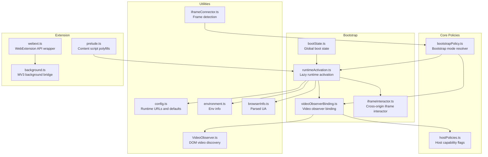
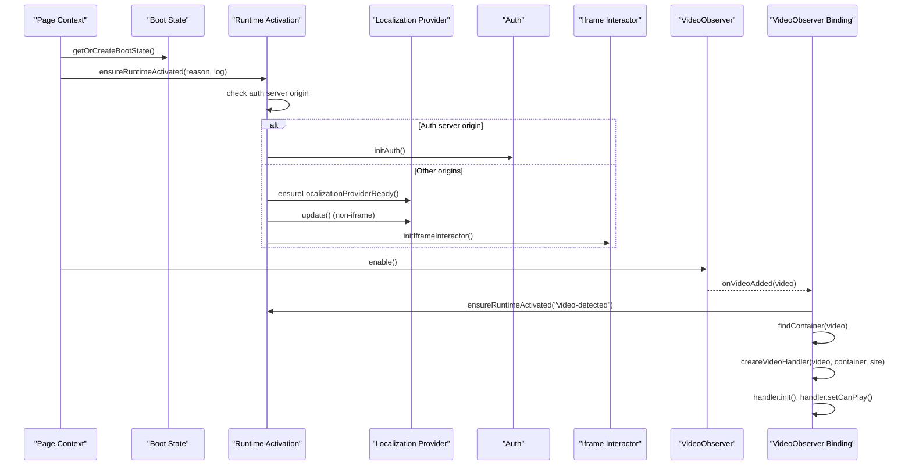
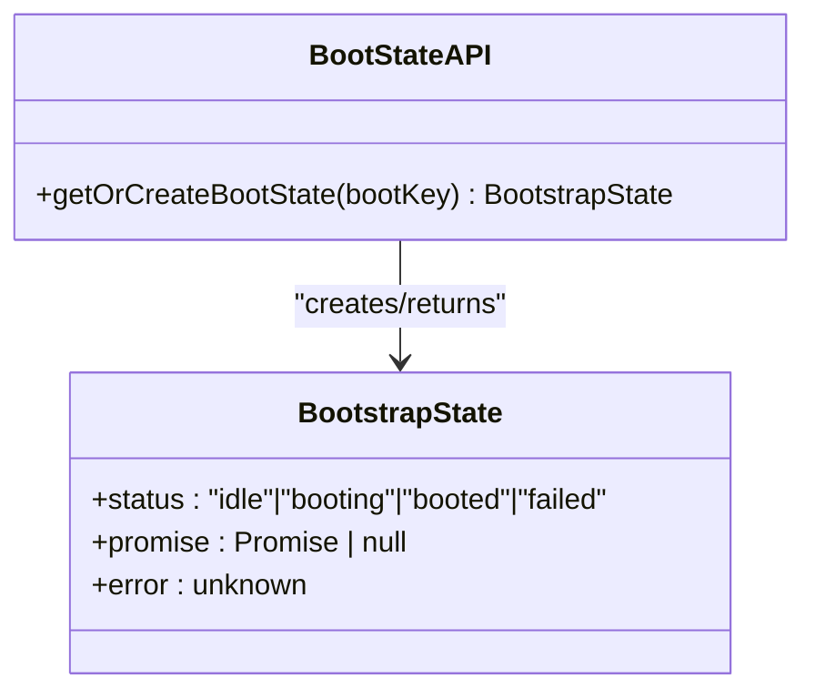
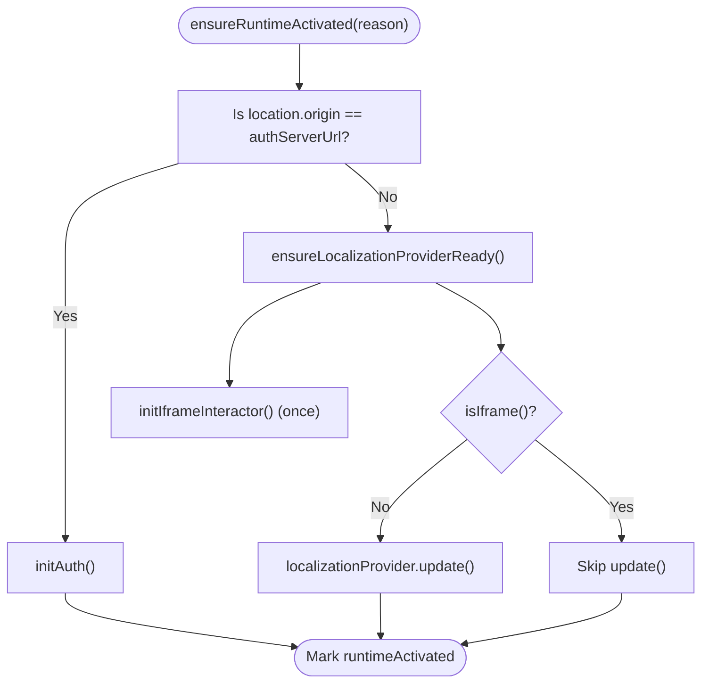
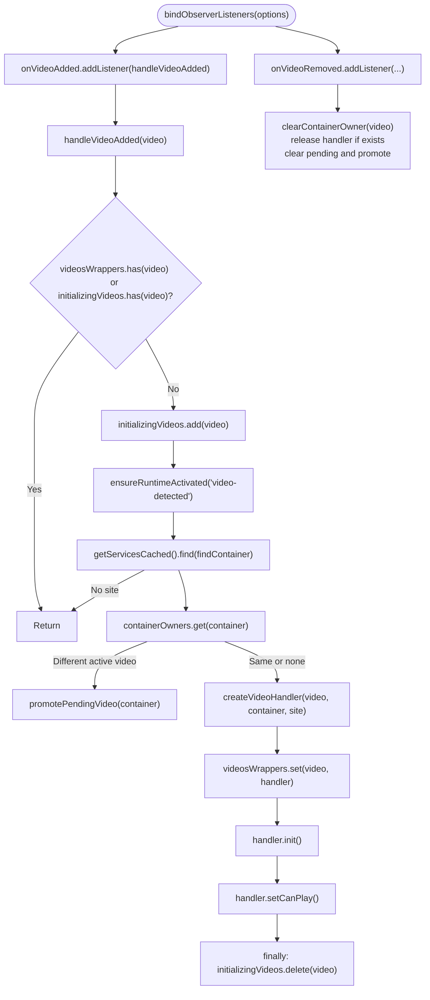
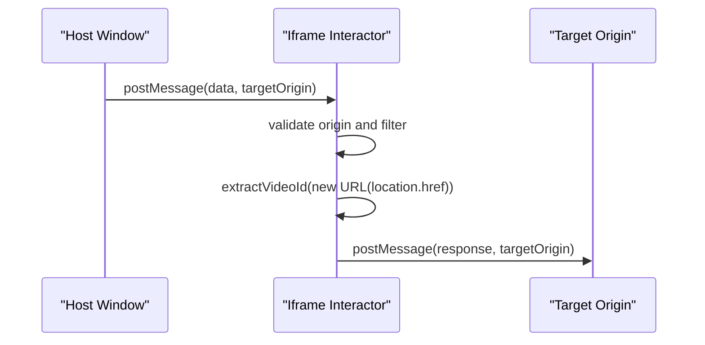
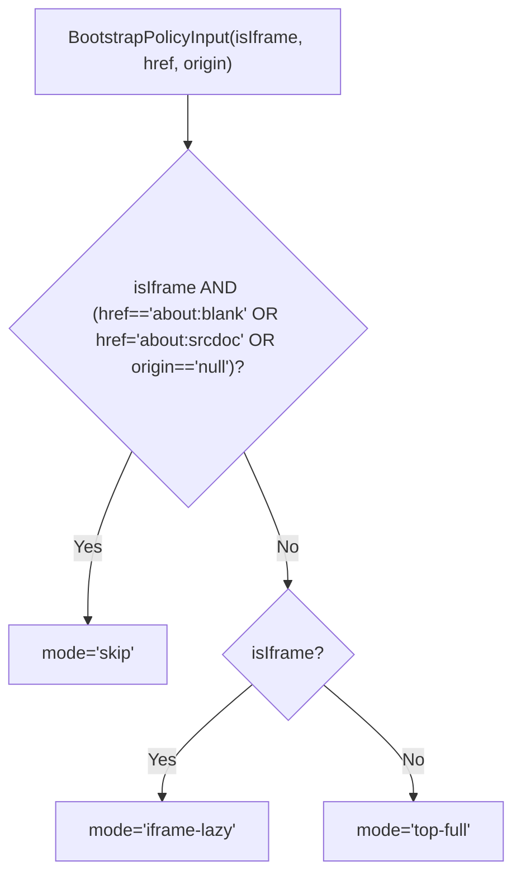
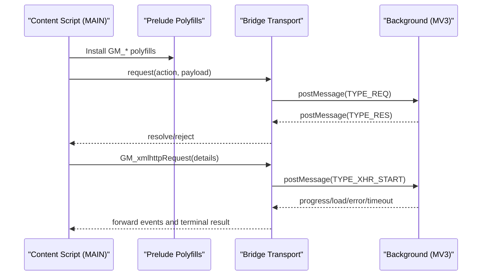
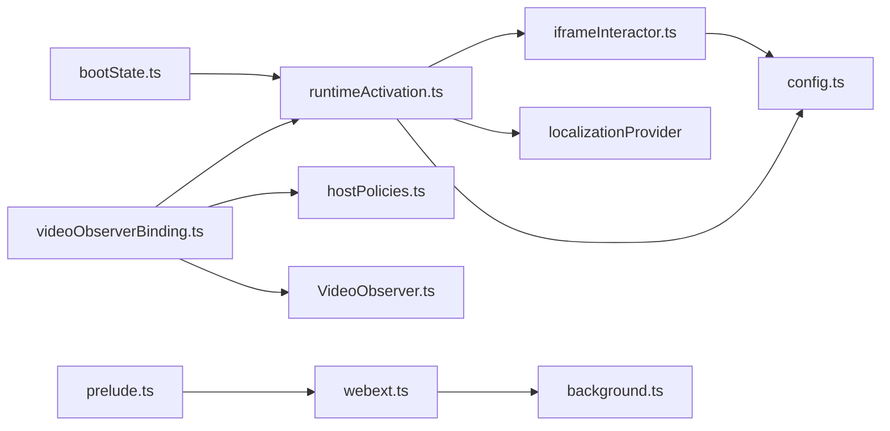

# Boot State & Runtime Activation

<cite>
**Referenced Files in This Document**
- [bootState.ts](file://src/bootstrap/bootState.ts)
- [runtimeActivation.ts](file://src/bootstrap/runtimeActivation.ts)
- [videoObserverBinding.ts](file://src/bootstrap/videoObserverBinding.ts)
- [iframeInteractor.ts](file://src/bootstrap/iframeInteractor.ts)
- [bootstrapPolicy.ts](file://src/core/bootstrapPolicy.ts)
- [hostPolicies.ts](file://src/core/hostPolicies.ts)
- [iframeConnector.ts](file://src/utils/iframeConnector.ts)
- [VideoObserver.ts](file://src/utils/VideoObserver.ts)
- [config.ts](file://src/config/config.ts)
- [index.ts](file://src/index.ts)
- [environment.ts](file://src/utils/environment.ts)
- [browserInfo.ts](file://src/utils/browserInfo.ts)
- [prelude.ts](file://src/extension/prelude.ts)
- [webext.ts](file://src/extension/webext.ts)
- [background.ts](file://src/extension/background.ts)
</cite>

## Table of Contents
1. [Introduction](#introduction)
2. [Project Structure](#project-structure)
3. [Core Components](#core-components)
4. [Architecture Overview](#architecture-overview)
5. [Detailed Component Analysis](#detailed-component-analysis)
6. [Dependency Analysis](#dependency-analysis)
7. [Performance Considerations](#performance-considerations)
8. [Troubleshooting Guide](#troubleshooting-guide)
9. [Conclusion](#conclusion)

## Introduction
This document explains the boot state management and runtime activation system that powers video translation and UI integration across browser environments. It covers:
- Initialization sequencing for userscript and native extension contexts
- Boot state tracking and dependency resolution during startup
- Runtime activation for localization, UI, and iframe interactor
- Video observer binding and DOM manipulation for video lifecycle
- Cross-origin iframe interactor for embedded players
- Conditional loading strategies based on environment and capabilities
- Practical debugging, error handling, and graceful degradation patterns
- Browser-specific initialization, permissions, and consent flows
- Integration with video lifecycle controllers and UI initialization patterns

## Project Structure
The boot and runtime activation logic is organized around four bootstrap modules and supporting infrastructure:
- Boot state tracking: a global singleton that guards initialization
- Runtime activation: lazy, guarded activation of localization, auth, and iframe interactor
- Video observer binding: binds DOM observers to video lifecycle and handler creation
- Iframe interactor: handles cross-origin communication for specific hosts

**Diagram sources**
- [bootState.ts:1-42](file://src/bootstrap/bootState.ts#L1-L42)
- [runtimeActivation.ts:1-59](file://src/bootstrap/runtimeActivation.ts#L1-L59)
- [videoObserverBinding.ts:1-179](file://src/bootstrap/videoObserverBinding.ts#L1-L179)
- [iframeInteractor.ts:1-52](file://src/bootstrap/iframeInteractor.ts#L1-L52)
- [bootstrapPolicy.ts:1-31](file://src/core/bootstrapPolicy.ts#L1-L31)
- [hostPolicies.ts:1-34](file://src/core/hostPolicies.ts#L1-L34)
- [iframeConnector.ts:1-8](file://src/utils/iframeConnector.ts#L1-L8)
- [VideoObserver.ts:1-645](file://src/utils/VideoObserver.ts#L1-L645)
- [config.ts:1-63](file://src/config/config.ts#L1-L63)
- [environment.ts:1-45](file://src/utils/environment.ts#L1-L45)
- [browserInfo.ts:1-6](file://src/utils/browserInfo.ts#L1-L6)
- [prelude.ts:1-641](file://src/extension/prelude.ts#L1-L641)
- [webext.ts:1-187](file://src/extension/webext.ts#L1-L187)
- [background.ts:1-800](file://src/extension/background.ts#L1-L800)

**Section sources**
- [bootState.ts:1-42](file://src/bootstrap/bootState.ts#L1-L42)
- [runtimeActivation.ts:1-59](file://src/bootstrap/runtimeActivation.ts#L1-L59)
- [videoObserverBinding.ts:1-179](file://src/bootstrap/videoObserverBinding.ts#L1-L179)
- [iframeInteractor.ts:1-52](file://src/bootstrap/iframeInteractor.ts#L1-L52)
- [bootstrapPolicy.ts:1-31](file://src/core/bootstrapPolicy.ts#L1-L31)
- [hostPolicies.ts:1-34](file://src/core/hostPolicies.ts#L1-L34)
- [iframeConnector.ts:1-8](file://src/utils/iframeConnector.ts#L1-L8)
- [VideoObserver.ts:1-645](file://src/utils/VideoObserver.ts#L1-L645)
- [config.ts:1-63](file://src/config/config.ts#L1-L63)
- [environment.ts:1-45](file://src/utils/environment.ts#L1-L45)
- [browserInfo.ts:1-6](file://src/utils/browserInfo.ts#L1-L6)
- [prelude.ts:1-641](file://src/extension/prelude.ts#L1-L641)
- [webext.ts:1-187](file://src/extension/webext.ts#L1-L187)
- [background.ts:1-800](file://src/extension/background.ts#L1-L800)

## Core Components
- Boot state tracking: a global singleton that stores status, a single in-progress promise, and last error. It ensures idempotent, guarded initialization across environments.
- Runtime activation: a lazy activation routine that initializes auth, localization, and iframe interactor depending on context and environment.
- Video observer binding: a robust listener binder that discovers videos, selects appropriate service containers, and constructs video handlers with careful lifecycle and error handling.
- Iframe interactor: a targeted interactor for specific cross-origin domains that filters messages, extracts identifiers, and responds with formatted data.

**Section sources**
- [bootState.ts:1-42](file://src/bootstrap/bootState.ts#L1-L42)
- [runtimeActivation.ts:1-59](file://src/bootstrap/runtimeActivation.ts#L1-L59)
- [videoObserverBinding.ts:1-179](file://src/bootstrap/videoObserverBinding.ts#L1-L179)
- [iframeInteractor.ts:1-52](file://src/bootstrap/iframeInteractor.ts#L1-L52)

## Architecture Overview
The system orchestrates initialization across userscript and extension contexts with environment-aware policies and guarded concurrency.

**Diagram sources**
- [bootState.ts:26-41](file://src/bootstrap/bootState.ts#L26-L41)
- [runtimeActivation.ts:20-58](file://src/bootstrap/runtimeActivation.ts#L20-L58)
- [videoObserverBinding.ts:30-178](file://src/bootstrap/videoObserverBinding.ts#L30-L178)
- [VideoObserver.ts:580-616](file://src/utils/VideoObserver.ts#L580-L616)
- [iframeInteractor.ts:8-51](file://src/bootstrap/iframeInteractor.ts#L8-L51)

## Detailed Component Analysis

### Boot State Tracking
- Purpose: Provide a global, guarded initialization state with idempotent activation and error propagation.
- Mechanism: A global record keyed by a boot key holds status, a single in-flight promise, and last error. Type guards validate shape and status values.
- Concurrency: Ensures only one activation is in flight; subsequent calls await the same promise.

**Diagram sources**
- [bootState.ts:3-7](file://src/bootstrap/bootState.ts#L3-L7)
- [bootState.ts:26-41](file://src/bootstrap/bootState.ts#L26-L41)

**Section sources**
- [bootState.ts:1-42](file://src/bootstrap/bootState.ts#L1-L42)

### Runtime Activation
- Purpose: Lazy, guarded activation of runtime dependencies based on environment and origin.
- Behavior:
  - If running on the auth server origin, initialize auth.
  - Otherwise, ensure localization provider is ready, optionally update it (non-iframe), and initialize the iframe interactor once.
- Guarding: Uses a module-level flag and a promise to prevent duplicate activations.

**Diagram sources**
- [runtimeActivation.ts:20-58](file://src/bootstrap/runtimeActivation.ts#L20-L58)
- [iframeConnector.ts:7](file://src/utils/iframeConnector.ts#L7)

**Section sources**
- [runtimeActivation.ts:1-59](file://src/bootstrap/runtimeActivation.ts#L1-L59)
- [config.ts:24-27](file://src/config/config.ts#L24-L27)
- [iframeConnector.ts:1-8](file://src/utils/iframeConnector.ts#L1-L8)

### Video Observer Binding
- Purpose: Discover videos, resolve service containers, construct and initialize video handlers, and manage lifecycle transitions.
- Key behaviors:
  - Prevents duplicate initialization with a WeakSet and pending maps.
  - Resolves container ownership and promotes pending videos when owners are released.
  - Applies site-specific overrides (e.g., host "peertube" and "directlink").
  - Robust error handling: logs failures, cleans up wrappers, and promotes pending videos.
- Integration: Calls ensureRuntimeActivated("video-detected") before handler creation to guarantee UI and localization readiness.

**Diagram sources**
- [videoObserverBinding.ts:30-178](file://src/bootstrap/videoObserverBinding.ts#L30-L178)

**Section sources**
- [videoObserverBinding.ts:1-179](file://src/bootstrap/videoObserverBinding.ts#L1-L179)

### Iframe Interactor
- Purpose: Provide a lightweight, targeted interactor for specific cross-origin domains to exchange messages and respond with derived data.
- Behavior:
  - Defines per-origin configuration: targetOrigin, dataFilter, extractVideoId, responseFormatter.
  - Listens to "message" events, validates origin and data, extracts video ID from location, and posts a formatted response.
  - Guards against missing configurations and errors.

**Diagram sources**
- [iframeInteractor.ts:8-51](file://src/bootstrap/iframeInteractor.ts#L8-L51)

**Section sources**
- [iframeInteractor.ts:1-52](file://src/bootstrap/iframeInteractor.ts#L1-L52)

### Bootstrap Policy and Conditional Loading
- Bootstrap mode resolver:
  - "skip" for blank or srcdoc iframes
  - "iframe-lazy" for other iframes
  - "top-full" for top-level pages
- Frame detection helper:
  - Detects iframe context using window/self vs window/top
- Host policies:
  - Flags for external volume control, mute sync, and translation download support

**Diagram sources**
- [bootstrapPolicy.ts:9-30](file://src/core/bootstrapPolicy.ts#L9-L30)
- [iframeConnector.ts:7](file://src/utils/iframeConnector.ts#L7)

**Section sources**
- [bootstrapPolicy.ts:1-31](file://src/core/bootstrapPolicy.ts#L1-L31)
- [hostPolicies.ts:1-34](file://src/core/hostPolicies.ts#L1-L34)
- [iframeConnector.ts:1-8](file://src/utils/iframeConnector.ts#L1-L8)

### Extension Bridge and Environment
- Preload polyfills for userscript managers:
  - GM_notification, GM_addStyle, GM_xmlhttpRequest (callbacks and promises), GM.*
- Bridge transport and message handling:
  - Request/response plumbing, XHR event forwarding, timeouts, and fallback watchdog
- WebExtension API wrapper:
  - Unified access to browser/chrome APIs with Promise/Callback compatibility
- Background bridge:
  - Implements GM_xmlhttpRequest via fetch, DNR header rules, and binary payload handling

**Diagram sources**
- [prelude.ts:288-478](file://src/extension/prelude.ts#L288-L478)
- [prelude.ts:480-611](file://src/extension/prelude.ts#L480-L611)
- [webext.ts:67-101](file://src/extension/webext.ts#L67-L101)
- [background.ts:487-534](file://src/extension/background.ts#L487-L534)

**Section sources**
- [prelude.ts:1-641](file://src/extension/prelude.ts#L1-L641)
- [webext.ts:1-187](file://src/extension/webext.ts#L1-L187)
- [background.ts:1-800](file://src/extension/background.ts#L1-L800)

## Dependency Analysis
- Boot state depends on global scope and guards initialization idempotency.
- Runtime activation depends on:
  - Auth server URL from configuration
  - Localization provider readiness and update
  - Iframe interactor initialization guard
- Video observer binding depends on:
  - VideoObserver for DOM discovery
  - Container resolution and service configuration
  - Host policies for site-specific behavior
- Iframe interactor depends on:
  - Per-origin configuration and message filtering
- Extension bridge depends on:
  - WebExtension API wrapper
  - Background service worker for cross-origin requests

**Diagram sources**
- [bootState.ts:1-42](file://src/bootstrap/bootState.ts#L1-L42)
- [runtimeActivation.ts:1-59](file://src/bootstrap/runtimeActivation.ts#L1-L59)
- [videoObserverBinding.ts:1-179](file://src/bootstrap/videoObserverBinding.ts#L1-L179)
- [VideoObserver.ts:1-645](file://src/utils/VideoObserver.ts#L1-L645)
- [hostPolicies.ts:1-34](file://src/core/hostPolicies.ts#L1-L34)
- [iframeInteractor.ts:1-52](file://src/bootstrap/iframeInteractor.ts#L1-L52)
- [config.ts:1-63](file://src/config/config.ts#L1-L63)
- [prelude.ts:1-641](file://src/extension/prelude.ts#L1-L641)
- [webext.ts:1-187](file://src/extension/webext.ts#L1-L187)
- [background.ts:1-800](file://src/extension/background.ts#L1-L800)

**Section sources**
- [bootState.ts:1-42](file://src/bootstrap/bootState.ts#L1-L42)
- [runtimeActivation.ts:1-59](file://src/bootstrap/runtimeActivation.ts#L1-L59)
- [videoObserverBinding.ts:1-179](file://src/bootstrap/videoObserverBinding.ts#L1-L179)
- [VideoObserver.ts:1-645](file://src/utils/VideoObserver.ts#L1-L645)
- [hostPolicies.ts:1-34](file://src/core/hostPolicies.ts#L1-L34)
- [iframeInteractor.ts:1-52](file://src/bootstrap/iframeInteractor.ts#L1-L52)
- [config.ts:1-63](file://src/config/config.ts#L1-L63)
- [prelude.ts:1-641](file://src/extension/prelude.ts#L1-L641)
- [webext.ts:1-187](file://src/extension/webext.ts#L1-L187)
- [background.ts:1-800](file://src/extension/background.ts#L1-L800)

## Performance Considerations
- VideoObserver:
  - Uses a bounded budget per slice and microtask-driven idle scheduling to minimize jank.
  - Tracks seen and active videos with WeakSets to avoid redundant work.
  - Installs a hook on ShadowRoot attachment to observe dynamically created subtrees.
- Runtime activation:
  - Single-flight promise prevents redundant work across multiple calls.
  - Non-blocking iframe update path avoids unnecessary work in iframe contexts.
- Extension bridge:
  - Queues DNR rule updates to avoid race conditions.
  - Streams large binary responses when content-length exceeds a threshold.

[No sources needed since this section provides general guidance]

## Troubleshooting Guide
- Boot state debugging:
  - Inspect the global boot state object for status and last error.
  - Ensure only one activation is in flight; subsequent calls should await the same promise.
- Initialization error handling:
  - Runtime activation wraps activation in try/catch; errors are logged and the activation promise is cleared.
  - Video observer binding logs failures and cleans up wrappers; promotes pending videos to recover from contention.
- Graceful degradation:
  - If localization provider fails to update, continue with defaults.
  - If iframe interactor has no matching configuration, skip interactor setup.
- Browser-specific initialization:
  - Extension preload installs polyfills and wires message handlers; verify handshake and manifest population.
  - WebExtension API wrapper falls back from callback-based (Chromium) to Promise-based (Firefox) APIs.
- Permission prompts and consent:
  - Extension bridge supports notifications and storage APIs; ensure permissions are granted for MV3 background to intercept headers and show notifications.

**Section sources**
- [bootState.ts:26-41](file://src/bootstrap/bootState.ts#L26-L41)
- [runtimeActivation.ts:53-58](file://src/bootstrap/runtimeActivation.ts#L53-L58)
- [videoObserverBinding.ts:94-100](file://src/bootstrap/videoObserverBinding.ts#L94-L100)
- [videoObserverBinding.ts:148-156](file://src/bootstrap/videoObserverBinding.ts#L148-L156)
- [prelude.ts:619-640](file://src/extension/prelude.ts#L619-L640)
- [webext.ts:67-101](file://src/extension/webext.ts#L67-L101)
- [background.ts:100-139](file://src/extension/background.ts#L100-L139)

## Conclusion
The boot state and runtime activation system provides a robust, guarded initialization pipeline that adapts to userscript and extension contexts. It integrates video discovery, localization, cross-origin iframe handling, and extension bridge capabilities while maintaining performance and resilience. By leveraging environment-aware policies, careful error handling, and conditional loading, the system delivers a consistent experience across diverse browser environments.