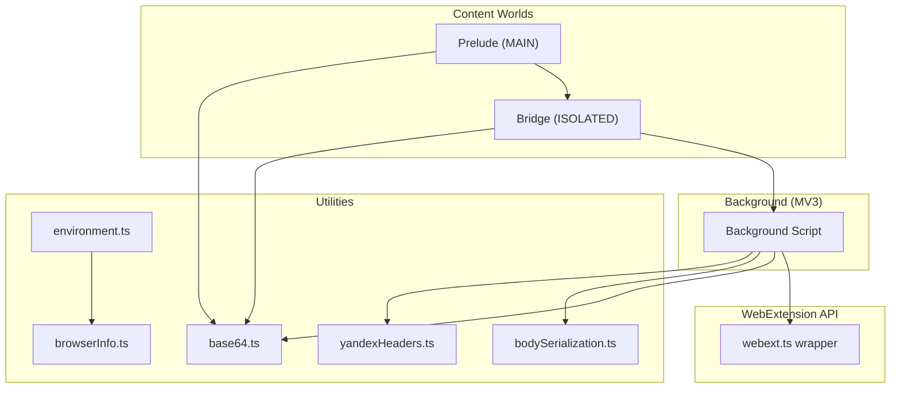
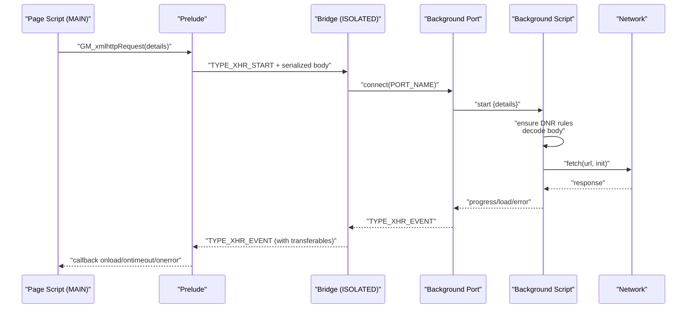
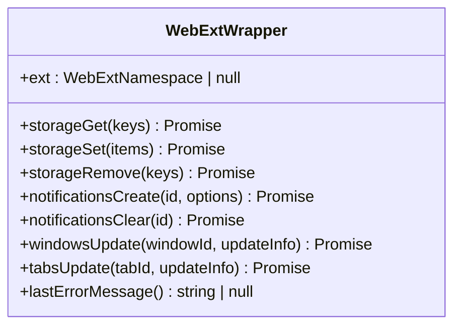
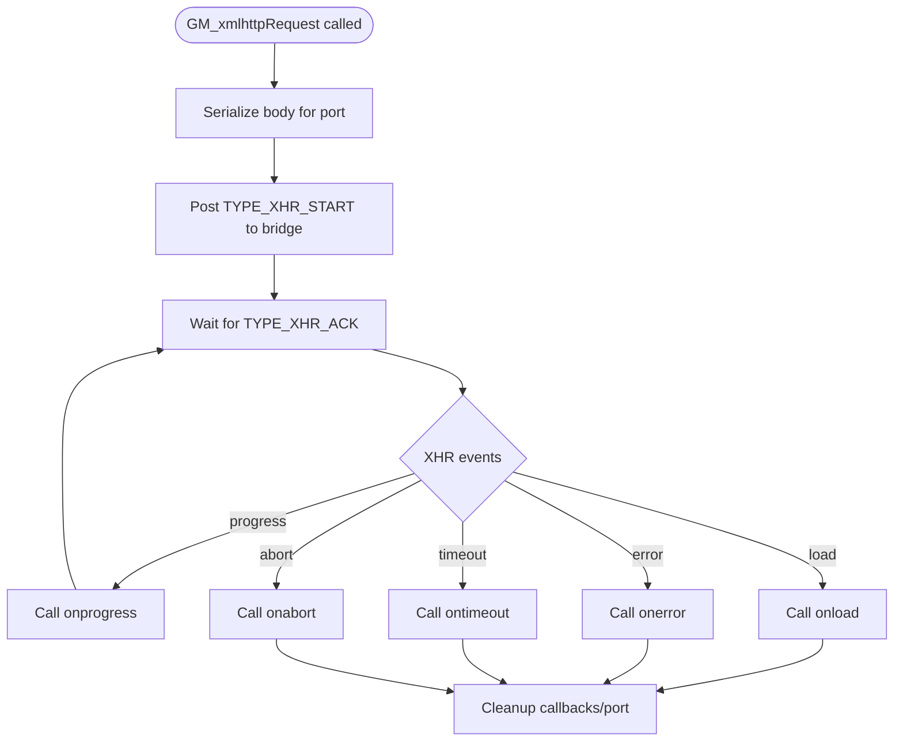
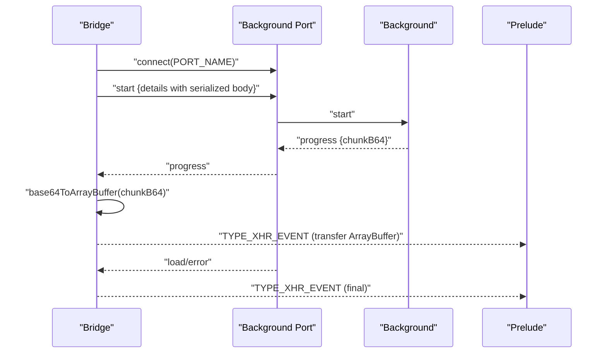
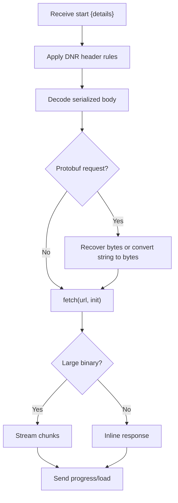
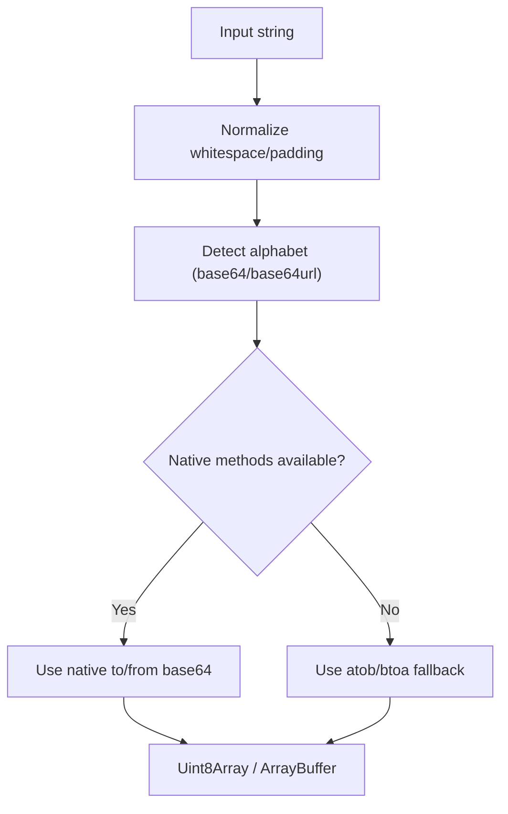
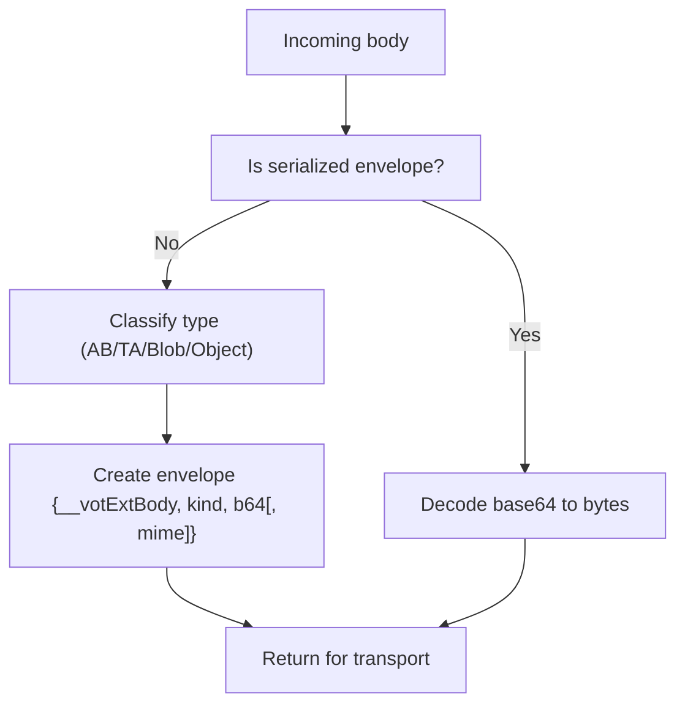
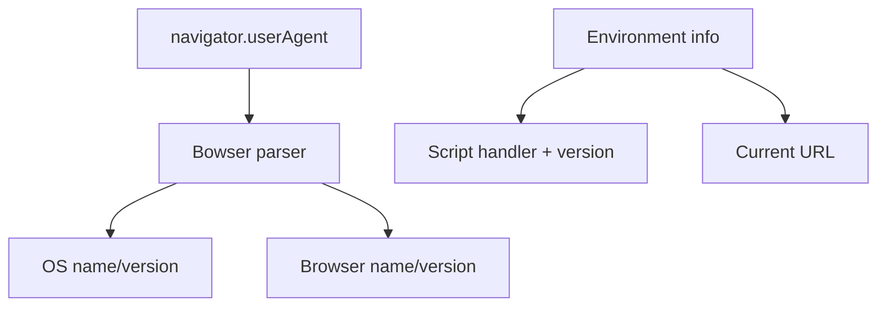
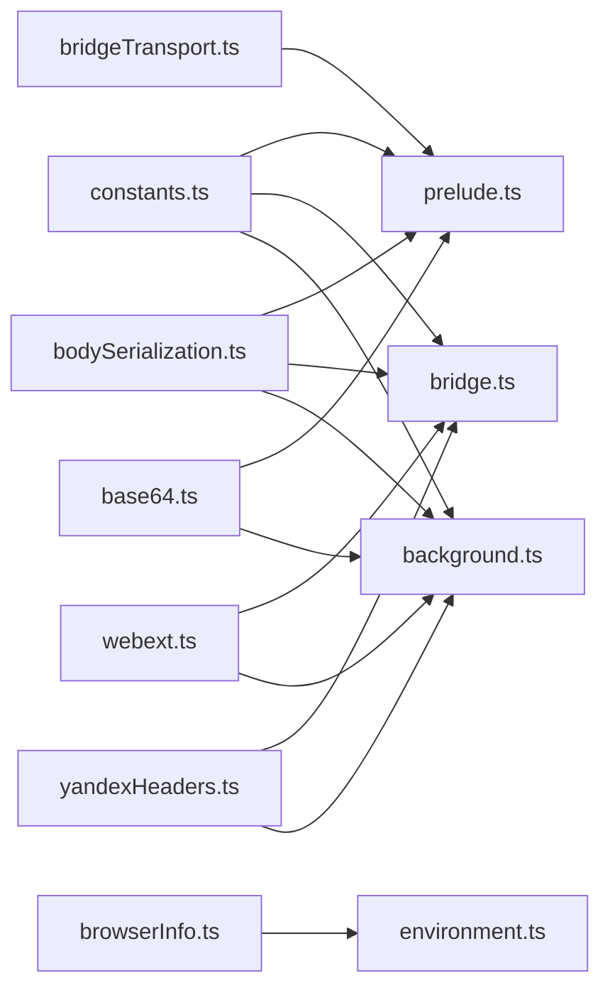

# Cross-Browser Compatibility Layer

<cite>
**Referenced Files in This Document**
- [base64.ts](file://src/extension/base64.ts)
- [prelude.ts](file://src/extension/prelude.ts)
- [webext.ts](file://src/extension/webext.ts)
- [constants.ts](file://src/extension/constants.ts)
- [bodySerialization.ts](file://src/extension/bodySerialization.ts)
- [bridge.ts](file://src/extension/bridge.ts)
- [bridgeTransport.ts](file://src/extension/bridgeTransport.ts)
- [background.ts](file://src/extension/background.ts)
- [yandexHeaders.ts](file://src/extension/yandexHeaders.ts)
- [browserInfo.ts](file://src/utils/browserInfo.ts)
- [environment.ts](file://src/utils/environment.ts)
</cite>

## Table of Contents
1. [Introduction](#introduction)
2. [Project Structure](#project-structure)
3. [Core Components](#core-components)
4. [Architecture Overview](#architecture-overview)
5. [Detailed Component Analysis](#detailed-component-analysis)
6. [Dependency Analysis](#dependency-analysis)
7. [Performance Considerations](#performance-considerations)
8. [Troubleshooting Guide](#troubleshooting-guide)
9. [Conclusion](#conclusion)
10. [Appendices](#appendices)

## Introduction
This document describes the cross-browser compatibility layer that ensures consistent behavior across Chrome, Firefox, and other Chromium-based browsers. It covers:
- Browser detection and environment reporting
- Feature capability testing and polyfills
- Binary-safe base64 encoding/decoding utilities
- The prelude system that initializes extension functionality in different browser contexts
- Icon management and theme support considerations
- Popup script adaptation for browser-specific UI patterns
- Manifest v2/v3 compatibility and platform-specific limitations
- Testing strategies and debugging approaches for cross-browser issues

## Project Structure
The cross-browser compatibility layer is implemented primarily in the extension subsystem and supporting utilities:
- Extension bridge and prelude orchestrate GM API polyfills and cross-world messaging
- WebExtension API wrapper adapts to browser-specific namespaces
- Binary-safe base64 utilities and body serialization ensure consistent handling of binary payloads
- Background script implements MV3 service worker responsibilities with DNR header rules for restricted headers
- Utilities detect browser and environment for diagnostics and feature detection

**Diagram sources**
- [prelude.ts:46-53](file://src/extension/prelude.ts#L46-L53)
- [bridge.ts:28-40](file://src/extension/bridge.ts#L28-L40)
- [background.ts:1-20](file://src/extension/background.ts#L1-L20)
- [webext.ts:1-10](file://src/extension/webext.ts#L1-L10)
- [base64.ts:1-10](file://src/extension/base64.ts#L1-L10)
- [bodySerialization.ts:1-10](file://src/extension/bodySerialization.ts#L1-L10)
- [yandexHeaders.ts:1-10](file://src/extension/yandexHeaders.ts#L1-L10)
- [browserInfo.ts:1-6](file://src/utils/browserInfo.ts#L1-L6)
- [environment.ts:19-44](file://src/utils/environment.ts#L19-L44)

**Section sources**
- [prelude.ts:46-53](file://src/extension/prelude.ts#L46-L53)
- [bridge.ts:28-40](file://src/extension/bridge.ts#L28-L40)
- [webext.ts:1-10](file://src/extension/webext.ts#L1-L10)
- [base64.ts:1-10](file://src/extension/base64.ts#L1-L10)
- [bodySerialization.ts:1-10](file://src/extension/bodySerialization.ts#L1-L10)
- [yandexHeaders.ts:1-10](file://src/extension/yandexHeaders.ts#L1-L10)
- [browserInfo.ts:1-6](file://src/utils/browserInfo.ts#L1-L6)
- [environment.ts:19-44](file://src/utils/environment.ts#L19-L44)

## Core Components
- Cross-browser WebExtension API wrapper: Normalizes Firefox’s Promise-based APIs and Chromium’s callback-based APIs behind a unified interface.
- Prelude: Installs GM API polyfills in MAIN world, wires message handlers, and manages GM_xmlhttpRequest lifecycle.
- Bridge: Runs in ISOLATED world, serializes bodies, forwards requests to background, and posts events back to MAIN world with transferable buffers.
- Background: MV3 service worker implementing GM_xmlhttpRequest via fetch, DNR header rules for restricted headers, and notifications.
- Base64 utilities: Provides robust base64 encode/decode with URL-safe variants and fallbacks for environments without native methods.
- Body serialization: Safely transports ArrayBuffer, TypedArray, Blob, and JSON payloads across worlds and ports.
- Yandex headers: Normalizes and filters headers for Yandex endpoints using DNR session rules.
- Browser detection and environment: Uses Bowser to parse user agent and environment.ts to assemble diagnostic strings.

**Section sources**
- [webext.ts:12-65](file://src/extension/webext.ts#L12-L65)
- [prelude.ts:288-478](file://src/extension/prelude.ts#L288-L478)
- [bridge.ts:1-60](file://src/extension/bridge.ts#L1-L60)
- [background.ts:1-20](file://src/extension/background.ts#L1-L20)
- [base64.ts:75-127](file://src/extension/base64.ts#L75-L127)
- [bodySerialization.ts:161-186](file://src/extension/bodySerialization.ts#L161-L186)
- [yandexHeaders.ts:19-56](file://src/extension/yandexHeaders.ts#L19-L56)
- [browserInfo.ts:1-6](file://src/utils/browserInfo.ts#L1-L6)
- [environment.ts:19-44](file://src/utils/environment.ts#L19-L44)

## Architecture Overview
The extension uses a three-tier messaging architecture:
- MAIN world prelude installs GM API polyfills and forwards requests to the bridge
- ISOLATED world bridge serializes bodies, connects to background port, and posts events back to MAIN
- Background service worker performs network requests, applies DNR header rules, and responds to the bridge

**Diagram sources**
- [prelude.ts:309-380](file://src/extension/prelude.ts#L309-L380)
- [bridge.ts:335-561](file://src/extension/bridge.ts#L335-L561)
- [background.ts:487-534](file://src/extension/background.ts#L487-L534)
- [constants.ts:15-27](file://src/extension/constants.ts#L15-L27)

**Section sources**
- [prelude.ts:309-380](file://src/extension/prelude.ts#L309-L380)
- [bridge.ts:335-561](file://src/extension/bridge.ts#L335-L561)
- [background.ts:487-534](file://src/extension/background.ts#L487-L534)
- [constants.ts:15-27](file://src/extension/constants.ts#L15-L27)

## Detailed Component Analysis

### Cross-Browser WebExtension API Wrapper
- Detects Firefox (browser.*) vs Chromium (chrome.*) namespaces and normalizes API calls
- Provides unified async wrappers for storage, notifications, windows, and tabs
- Handles runtime.lastError on Chromium and Promise-based errors on Firefox

**Diagram sources**
- [webext.ts:12-65](file://src/extension/webext.ts#L12-L65)

**Section sources**
- [webext.ts:56-101](file://src/extension/webext.ts#L56-L101)
- [webext.ts:103-135](file://src/extension/webext.ts#L103-L135)
- [webext.ts:137-186](file://src/extension/webext.ts#L137-L186)

### Prelude: GM API Polyfills and Message Handling
- Installs GM_notification, GM_addStyle, GM_xmlhttpRequest, and GM.* storage APIs in MAIN world
- Manages request/response lifecycle, timeouts, and callback handling
- Sanitizes non-serializable fields for postMessage
- Wires message handlers to process bridge responses and XHR events

**Diagram sources**
- [prelude.ts:309-380](file://src/extension/prelude.ts#L309-L380)
- [prelude.ts:480-611](file://src/extension/prelude.ts#L480-L611)

**Section sources**
- [prelude.ts:288-478](file://src/extension/prelude.ts#L288-L478)
- [prelude.ts:480-611](file://src/extension/prelude.ts#L480-L611)

### Bridge: Serialization, Transferables, and Event Forwarding
- Serializes binary bodies (ArrayBuffer, TypedArray, Blob) to base64 envelopes
- Connects to background port and forwards XHR lifecycle events
- Aggregates binary chunks and converts them back to ArrayBuffer/Blob for MAIN world
- Applies UA-CH header normalization for Yandex endpoints and merges required headers

**Diagram sources**
- [bridge.ts:335-561](file://src/extension/bridge.ts#L335-L561)
- [bridgeTransport.ts:9-25](file://src/extension/bridgeTransport.ts#L9-L25)
- [bodySerialization.ts:466-534](file://src/extension/bodySerialization.ts#L466-L534)

**Section sources**
- [bridge.ts:335-561](file://src/extension/bridge.ts#L335-L561)
- [bridgeTransport.ts:9-25](file://src/extension/bridgeTransport.ts#L9-L25)
- [bodySerialization.ts:466-534](file://src/extension/bodySerialization.ts#L466-L534)

### Background: MV3 Service Worker, DNR Header Rules, and Network Requests
- Implements GM_xmlhttpRequest via fetch with proper header handling
- Applies declarativeNetRequest session rules to inject/remove headers for restricted names
- Normalizes and decodes binary responses, streaming when appropriate
- Supports protobuf request bodies and Latin-1 fallbacks

**Diagram sources**
- [background.ts:535-756](file://src/extension/background.ts#L535-L756)
- [yandexHeaders.ts:19-56](file://src/extension/yandexHeaders.ts#L19-L56)

**Section sources**
- [background.ts:535-756](file://src/extension/background.ts#L535-L756)
- [yandexHeaders.ts:19-56](file://src/extension/yandexHeaders.ts#L19-L56)

### Base64 Encoding/Decoding Utilities
- Robust base64 encode/decode with URL-safe alphabet support
- Fallbacks for environments without native methods (atob/btoa)
- Handles padding normalization and strict/loose input variants
- Converts between Uint8Array, ArrayBuffer, and base64 strings

**Diagram sources**
- [base64.ts:32-95](file://src/extension/base64.ts#L32-L95)
- [base64.ts:110-127](file://src/extension/base64.ts#L110-L127)

**Section sources**
- [base64.ts:75-127](file://src/extension/base64.ts#L75-L127)

### Body Serialization and Binary Payload Handling
- Detects and serializes ArrayBuffer, TypedArray, Blob, and JSON payloads
- Coerces cross-world objects and handles edge cases (Node.js Buffer, sparse arrays)
- Summarizes bodies for logging and validates sizes
- Decodes back to fetch/XHR-compatible forms in background

**Diagram sources**
- [bodySerialization.ts:161-186](file://src/extension/bodySerialization.ts#L161-L186)
- [bodySerialization.ts:466-534](file://src/extension/bodySerialization.ts#L466-L534)

**Section sources**
- [bodySerialization.ts:161-186](file://src/extension/bodySerialization.ts#L161-L186)
- [bodySerialization.ts:466-534](file://src/extension/bodySerialization.ts#L466-L534)

### Browser Detection and Environment Reporting
- Uses Bowser to parse user agent and derive OS/browser/version
- Assembles environment info for diagnostics and feature detection
- Integrates with GM_info for script metadata

**Diagram sources**
- [browserInfo.ts:1-6](file://src/utils/browserInfo.ts#L1-L6)
- [environment.ts:19-44](file://src/utils/environment.ts#L19-L44)

**Section sources**
- [browserInfo.ts:1-6](file://src/utils/browserInfo.ts#L1-L6)
- [environment.ts:19-44](file://src/utils/environment.ts#L19-L44)

### Icon Management and Theme Support
- Icons are managed under the extension’s icons directory and referenced by the extension build
- Theme support is handled by the extension’s manifest and CSS; ensure separate icon assets for dark/light themes
- For MV3, icons are typically declared in the manifest and used by the background script for notifications

[No sources needed since this section provides general guidance]

### Popup Script Adaptation
- Popup UI should adapt to browser-specific constraints (e.g., available APIs, permissions)
- Use the WebExtension API wrapper to ensure consistent behavior across browsers
- Respect MV3 limitations (no eval, restricted APIs) and adjust UI accordingly

[No sources needed since this section provides general guidance]

## Dependency Analysis
The cross-browser compatibility layer exhibits low coupling between components and high cohesion within each module. Key dependencies:
- prelude.ts depends on constants.ts, bridgeTransport.ts, and bodySerialization.ts
- bridge.ts depends on base64.ts, bodySerialization.ts, constants.ts, webext.ts, and yandexHeaders.ts
- background.ts depends on base64.ts, bodySerialization.ts, constants.ts, webext.ts, and yandexHeaders.ts
- browserInfo.ts and environment.ts depend on pre-existing globals (navigator/GM_info)

**Diagram sources**
- [constants.ts:1-27](file://src/extension/constants.ts#L1-L27)
- [prelude.ts:1-20](file://src/extension/prelude.ts#L1-L20)
- [bridge.ts:1-25](file://src/extension/bridge.ts#L1-L25)
- [background.ts:1-34](file://src/extension/background.ts#L1-L34)
- [webext.ts:1-10](file://src/extension/webext.ts#L1-L10)
- [base64.ts:1-10](file://src/extension/base64.ts#L1-L10)
- [bodySerialization.ts:1-10](file://src/extension/bodySerialization.ts#L1-L10)
- [yandexHeaders.ts:1-10](file://src/extension/yandexHeaders.ts#L1-L10)
- [browserInfo.ts:1-6](file://src/utils/browserInfo.ts#L1-L6)
- [environment.ts:19-44](file://src/utils/environment.ts#L19-L44)

**Section sources**
- [constants.ts:1-27](file://src/extension/constants.ts#L1-L27)
- [prelude.ts:1-20](file://src/extension/prelude.ts#L1-L20)
- [bridge.ts:1-25](file://src/extension/bridge.ts#L1-L25)
- [background.ts:1-34](file://src/extension/background.ts#L1-L34)
- [webext.ts:1-10](file://src/extension/webext.ts#L1-L10)
- [base64.ts:1-10](file://src/extension/base64.ts#L1-L10)
- [bodySerialization.ts:1-10](file://src/extension/bodySerialization.ts#L1-L10)
- [yandexHeaders.ts:1-10](file://src/extension/yandexHeaders.ts#L1-L10)
- [browserInfo.ts:1-6](file://src/utils/browserInfo.ts#L1-L6)
- [environment.ts:19-44](file://src/utils/environment.ts#L19-L44)

## Performance Considerations
- Binary streaming: Large binary responses are streamed to avoid memory pressure; prefer ArrayBuffer/Blob responses when feasible
- Transferable objects: Use Transferable ArrayBuffers to minimize copying across worlds
- Header normalization: Cache UA-CH headers to reduce repeated computation
- Body coercion: Prefer direct binary types to avoid JSON fallbacks and preserve fidelity

[No sources needed since this section provides general guidance]

## Troubleshooting Guide
Common issues and resolutions:
- DataCloneError on postMessage: Ensure non-serializable fields (callbacks) are stripped before posting; the prelude sanitizes GM_notification details and GM_xmlhttpRequest callbacks
- Base64 errors: Verify input normalization and alphabet detection; use strict/loose handling depending on source
- Binary payload corruption: Ensure protobuf bodies are preserved as bytes; the background script detects and recovers protobuf payloads
- Restricted headers: For endpoints requiring forbidden headers, rely on DNR session rules applied by the background script
- Timeout handling: The prelude arms watchdogs and triggers aborts; verify timeoutMs and event lifecycles

**Section sources**
- [prelude.ts:70-80](file://src/extension/prelude.ts#L70-L80)
- [base64.ts:32-41](file://src/extension/base64.ts#L32-L41)
- [background.ts:697-730](file://src/extension/background.ts#L697-L730)
- [yandexHeaders.ts:19-56](file://src/extension/yandexHeaders.ts#L19-L56)

## Conclusion
The cross-browser compatibility layer leverages a robust three-tier architecture with strong separation of concerns:
- MAIN world prelude for GM API polyfills and UI integration
- ISOLATED world bridge for serialization and cross-world messaging
- Background service worker for network operations and DNR header management

This design ensures consistent behavior across Chrome, Firefox, and other Chromium-based browsers while maintaining performance and reliability.

## Appendices

### Manifest v2/v3 Compatibility and Platform Limitations
- MV3 service worker responsibilities: GM_xmlhttpRequest, notifications, and DNR header rules
- MV2 considerations: Callback-based APIs and manifest permissions differ; use the WebExtension API wrapper to abstract differences
- Platform-specific constraints: No eval, restricted APIs; adapt UI and feature sets accordingly

[No sources needed since this section provides general guidance]

### Browser-Specific Code Paths and Fallbacks
- API namespace detection: Use the WebExtension API wrapper to route to browser or chrome namespaces
- Binary handling: Prefer native base64 methods; fallback to atob/btoa when unavailable
- Header restrictions: Apply DNR session rules for endpoints that require forbidden headers

**Section sources**
- [webext.ts:56-65](file://src/extension/webext.ts#L56-L65)
- [base64.ts:24-31](file://src/extension/base64.ts#L24-L31)
- [yandexHeaders.ts:19-56](file://src/extension/yandexHeaders.ts#L19-L56)

### Testing Strategies Across Browsers
- Unit test binary serialization and base64 conversions
- Integration test GM_xmlhttpRequest across MAIN/ISOLATED worlds and background
- E2E test with MV3 service worker and DNR header rules
- Debug with environment info and browser detection utilities

**Section sources**
- [environment.ts:19-44](file://src/utils/environment.ts#L19-L44)
- [browserInfo.ts:1-6](file://src/utils/browserInfo.ts#L1-L6)