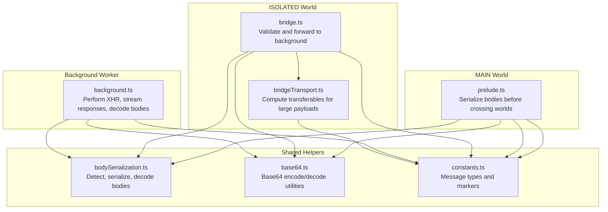
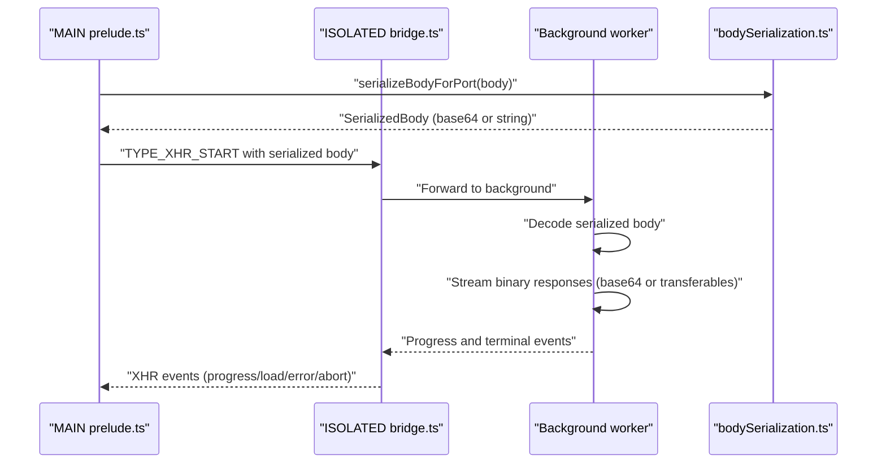
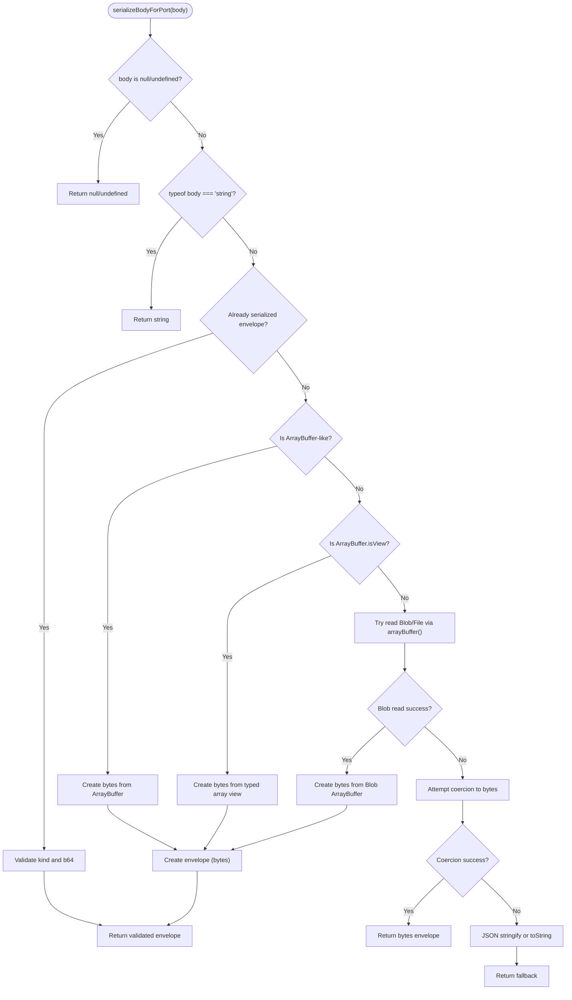
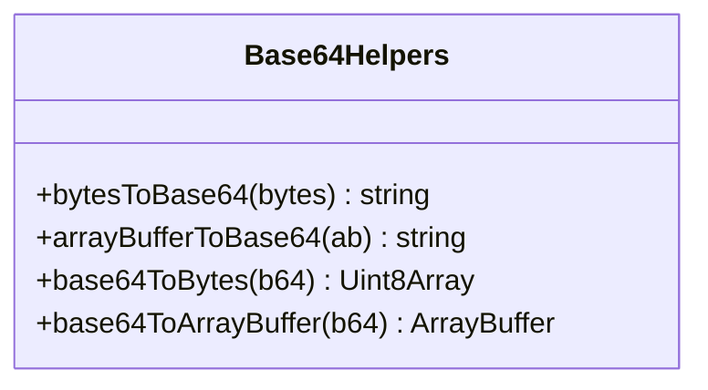
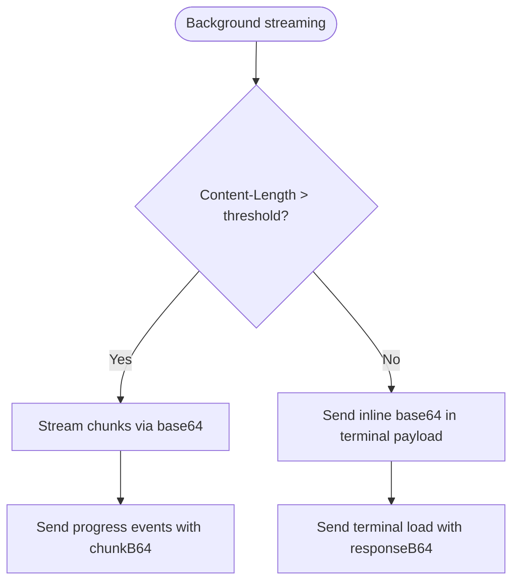
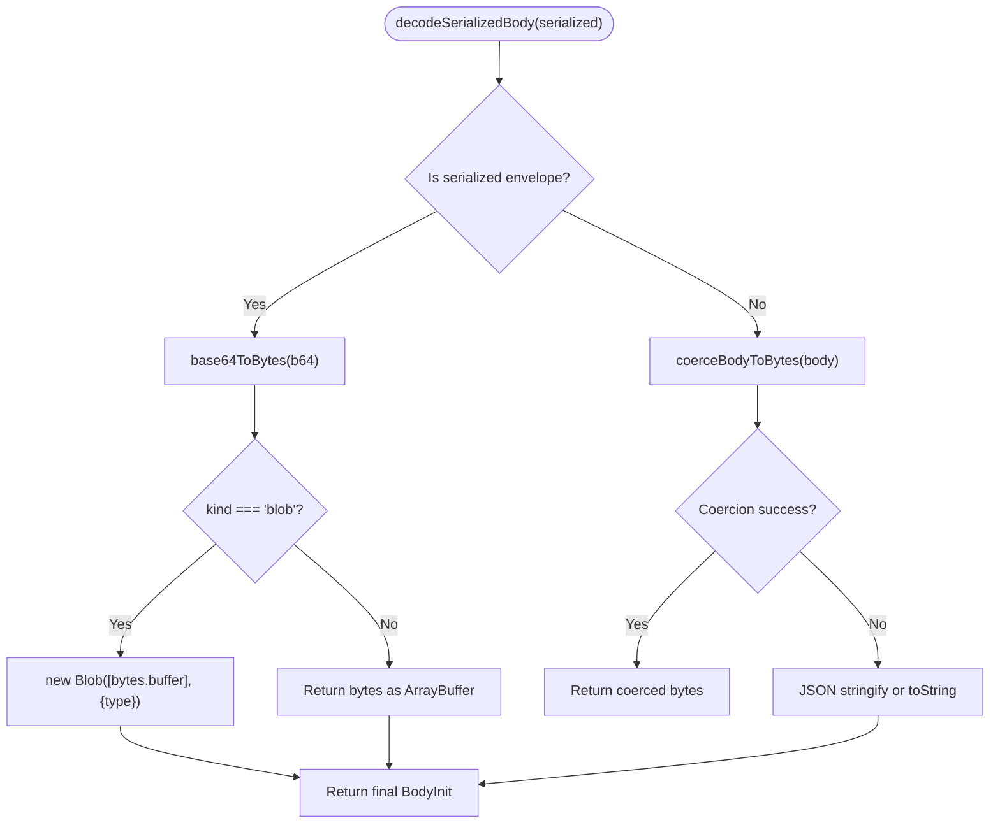
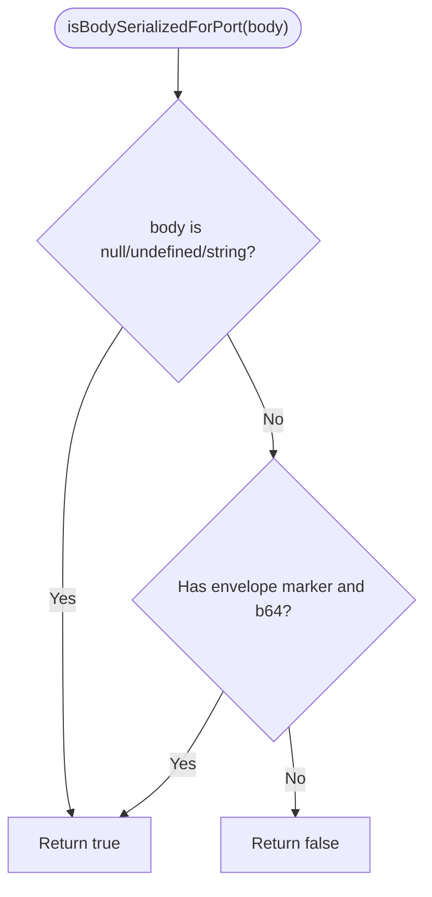
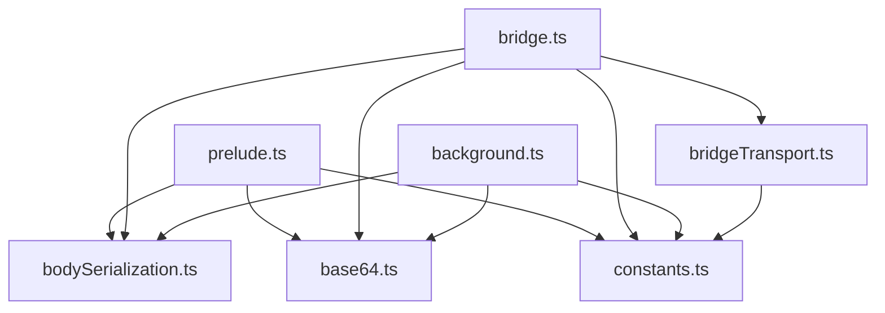

# Body Serialization Mechanisms

<cite>
**Referenced Files in This Document**
- [bodySerialization.ts](file://src/extension/bodySerialization.ts)
- [base64.ts](file://src/extension/base64.ts)
- [bridgeTransport.ts](file://src/extension/bridgeTransport.ts)
- [bridge.ts](file://src/extension/bridge.ts)
- [prelude.ts](file://src/extension/prelude.ts)
- [background.ts](file://src/extension/background.ts)
- [constants.ts](file://src/extension/constants.ts)
</cite>

## Table of Contents
1. [Introduction](#introduction)
2. [Project Structure](#project-structure)
3. [Core Components](#core-components)
4. [Architecture Overview](#architecture-overview)
5. [Detailed Component Analysis](#detailed-component-analysis)
6. [Dependency Analysis](#dependency-analysis)
7. [Performance Considerations](#performance-considerations)
8. [Troubleshooting Guide](#troubleshooting-guide)
9. [Conclusion](#conclusion)

## Introduction
This document explains the body serialization system that enables cross-world HTTP request body transfer in the extension. It covers how different payload types (strings, objects, Blobs, ArrayBuffers, and FormData) are detected, serialized, transmitted, and deserialized. It also details the base64 encoding strategy for binary data, transferable optimizations for large payloads, size limits, performance characteristics, and error handling for malformed data. Practical examples and debugging guidance are included to help developers optimize and troubleshoot serialization issues.

## Project Structure
The serialization pipeline spans three worlds and several modules:
- MAIN world prelude: prepares and serializes request bodies before crossing worlds.
- ISOLATED world bridge: validates and forwards serialized bodies to the background worker.
- Background worker: performs network requests, streams binary responses, and decodes serialized bodies.
- Shared helpers: base64 encoding/decoding and transferable optimizations.

**Diagram sources**
- [prelude.ts:309-380](file://src/extension/prelude.ts#L309-L380)
- [bridge.ts:335-561](file://src/extension/bridge.ts#L335-L561)
- [bridgeTransport.ts:9-25](file://src/extension/bridgeTransport.ts#L9-L25)
- [background.ts:800-870](file://src/extension/background.ts#L800-L870)
- [bodySerialization.ts:12-570](file://src/extension/bodySerialization.ts#L12-L570)
- [base64.ts:110-127](file://src/extension/base64.ts#L110-L127)
- [constants.ts:10-101](file://src/extension/constants.ts#L10-L101)

**Section sources**
- [prelude.ts:309-380](file://src/extension/prelude.ts#L309-L380)
- [bridge.ts:335-561](file://src/extension/bridge.ts#L335-L561)
- [bridgeTransport.ts:9-25](file://src/extension/bridgeTransport.ts#L9-L25)
- [background.ts:800-870](file://src/extension/background.ts#L800-L870)
- [bodySerialization.ts:12-570](file://src/extension/bodySerialization.ts#L12-L570)
- [base64.ts:110-127](file://src/extension/base64.ts#L110-L127)
- [constants.ts:10-101](file://src/extension/constants.ts#L10-L101)

## Core Components
- Body detection and serialization: Detects payload types and converts them to a portable representation.
- Base64 encoding/decoding: Converts binary data to strings for transport and back.
- Transferable optimization: Uses transferable ArrayBuffer instances to avoid copying large payloads.
- Deserialization: Recovers original body types in the background worker and MAIN world.

Key responsibilities:
- Detect and serialize strings, objects, Blobs, ArrayBuffers, and typed arrays.
- Coerce unexpected cross-world shapes into bytes when possible.
- Encode binary payloads as base64 strings for extension messaging.
- Stream large binary responses and transfer ArrayBuffer instances when safe.
- Provide debug summaries for diagnostics.

**Section sources**
- [bodySerialization.ts:12-570](file://src/extension/bodySerialization.ts#L12-L570)
- [base64.ts:110-127](file://src/extension/base64.ts#L110-L127)
- [bridgeTransport.ts:9-25](file://src/extension/bridgeTransport.ts#L9-L25)
- [background.ts:800-870](file://src/extension/background.ts#L800-L870)

## Architecture Overview
The serialization pipeline ensures that HTTP request bodies can safely traverse between MAIN and ISOLATED worlds and the background worker.

**Diagram sources**
- [prelude.ts:227-260](file://src/extension/prelude.ts#L227-L260)
- [bridge.ts:507-539](file://src/extension/bridge.ts#L507-L539)
- [background.ts:800-870](file://src/extension/background.ts#L800-L870)
- [bodySerialization.ts:466-534](file://src/extension/bodySerialization.ts#L466-L534)

## Detailed Component Analysis

### Body Detection and Serialization
The system detects and serializes various payload types:
- Strings: passed through unchanged.
- Objects: if JSON-serializable, preserved as JSON; otherwise coerced to bytes.
- Blobs and Files: converted to ArrayBuffer via arrayBuffer(), then base64-encoded.
- ArrayBuffers and typed arrays: copied to Uint8Array and base64-encoded.
- Cross-world wrappers: attempts recovery to bytes using heuristics.

**Diagram sources**
- [bodySerialization.ts:466-534](file://src/extension/bodySerialization.ts#L466-L534)
- [bodySerialization.ts:187-223](file://src/extension/bodySerialization.ts#L187-L223)
- [bodySerialization.ts:225-365](file://src/extension/bodySerialization.ts#L225-L365)

**Section sources**
- [bodySerialization.ts:466-534](file://src/extension/bodySerialization.ts#L466-L534)
- [bodySerialization.ts:187-223](file://src/extension/bodySerialization.ts#L187-L223)
- [bodySerialization.ts:225-365](file://src/extension/bodySerialization.ts#L225-L365)

### Base64 Encoding Strategy
Binary data is encoded to base64 strings for transport:
- Native Uint8Array.prototype.toBase64 is used when available.
- Fallback to btoa/atob with manual conversion.
- Supports both standard and URL-safe alphabets with flexible input normalization.

**Diagram sources**
- [base64.ts:110-127](file://src/extension/base64.ts#L110-L127)

**Section sources**
- [base64.ts:110-127](file://src/extension/base64.ts#L110-L127)

### Transferable Object Optimization
Large binary responses are streamed as base64 chunks to avoid massive single payloads. When safe, ArrayBuffer instances are transferred using the structured clone’s transferable mechanism to prevent copying.

**Diagram sources**
- [background.ts:800-870](file://src/extension/background.ts#L800-L870)
- [bridgeTransport.ts:9-25](file://src/extension/bridgeTransport.ts#L9-L25)

**Section sources**
- [background.ts:800-870](file://src/extension/background.ts#L800-L870)
- [bridgeTransport.ts:9-25](file://src/extension/bridgeTransport.ts#L9-L25)

### Deserialization in the Background Worker
The background worker decodes serialized bodies and reconstructs Blob or ArrayBuffer when needed:
- Envelope decoding: base64 to bytes, then Blob or ArrayBuffer depending on kind.
- Recovery: attempts coercion for unexpected cross-world shapes.
- JSON fallback: preserves object payloads as JSON when possible.

**Diagram sources**
- [bodySerialization.ts:539-569](file://src/extension/bodySerialization.ts#L539-L569)
- [background.ts:317-333](file://src/extension/background.ts#L317-L333)

**Section sources**
- [bodySerialization.ts:539-569](file://src/extension/bodySerialization.ts#L539-L569)
- [background.ts:317-333](file://src/extension/background.ts#L317-L333)

### Serialization Detection Mechanism
The system distinguishes between raw and already-serialized bodies:
- Null/undefined and strings are considered already portable.
- Serialized envelopes carry a marker and base64 payload with optional MIME for blobs.
- Debug summaries provide insight into detected kinds and sizes.

**Diagram sources**
- [bodySerialization.ts:161-165](file://src/extension/bodySerialization.ts#L161-L165)

**Section sources**
- [bodySerialization.ts:161-165](file://src/extension/bodySerialization.ts#L161-L165)
- [bodySerialization.ts:371-460](file://src/extension/bodySerialization.ts#L371-L460)

### Size Limits and Performance Implications
- Maximum recoverable bytes: enforced during coercion and array construction to prevent excessive memory allocation.
- Inline vs streaming: small binary responses are sent inline as base64; larger ones are streamed to avoid large extension messaging payloads.
- Transferables: when safe, ArrayBuffer instances are transferred to avoid copies; otherwise, base64 is used.

Practical guidance:
- Prefer Blob/File for large uploads; the system reads them efficiently.
- Avoid sending extremely large objects that cannot be coerced; consider chunking or streaming.
- Monitor base64 overhead (~33% size increase) versus transferable benefits.

**Section sources**
- [bodySerialization.ts:36-38](file://src/extension/bodySerialization.ts#L36-L38)
- [background.ts:58-58](file://src/extension/background.ts#L58-L58)
- [background.ts:800-870](file://src/extension/background.ts#L800-L870)
- [bridgeTransport.ts:9-25](file://src/extension/bridgeTransport.ts#L9-L25)

### Error Handling for Malformed Data
- Safe guards: try/catch around cross-world method calls and JSON serialization.
- Fallbacks: if serialization fails, the system logs a warning and falls back to JSON or string conversion.
- Cross-world resilience: blob reading uses Response constructor when direct method calls fail.
- Debug summaries: detailed diagnostics help identify problematic payloads.

**Section sources**
- [bodySerialization.ts:187-223](file://src/extension/bodySerialization.ts#L187-L223)
- [bodySerialization.ts:518-534](file://src/extension/bodySerialization.ts#L518-L534)
- [bridge.ts:540-561](file://src/extension/bridge.ts#L540-L561)

### Practical Examples

- Serializing a Blob:
  - MAIN world: [prelude.ts:227-260](file://src/extension/prelude.ts#L227-L260)
  - ISOLATED world: [bridge.ts:507-539](file://src/extension/bridge.ts#L507-L539)
  - Background decoding: [bodySerialization.ts:539-569](file://src/extension/bodySerialization.ts#L539-L569)

- Serializing an ArrayBuffer:
  - Detection and serialization: [bodySerialization.ts:490-492](file://src/extension/bodySerialization.ts#L490-L492)
  - Decoding to ArrayBuffer: [bodySerialization.ts:544-554](file://src/extension/bodySerialization.ts#L544-L554)

- Serializing a typed array:
  - Detection and serialization: [bodySerialization.ts:495-498](file://src/extension/bodySerialization.ts#L495-L498)
  - Decoding to bytes: [bodySerialization.ts:544-554](file://src/extension/bodySerialization.ts#L544-L554)

- Handling FormData:
  - The system does not implement a dedicated FormData serializer; objects are either preserved as JSON or coerced to bytes. If FormData is required, convert it to a Blob or ArrayBuffer before sending.

- Streaming large binary responses:
  - Background streaming: [background.ts:800-870](file://src/extension/background.ts#L800-L870)
  - Transferable optimization: [bridgeTransport.ts:9-25](file://src/extension/bridgeTransport.ts#L9-L25)

**Section sources**
- [prelude.ts:227-260](file://src/extension/prelude.ts#L227-L260)
- [bridge.ts:507-539](file://src/extension/bridge.ts#L507-L539)
- [bodySerialization.ts:490-498](file://src/extension/bodySerialization.ts#L490-L498)
- [bodySerialization.ts:539-569](file://src/extension/bodySerialization.ts#L539-L569)
- [background.ts:800-870](file://src/extension/background.ts#L800-L870)
- [bridgeTransport.ts:9-25](file://src/extension/bridgeTransport.ts#L9-L25)

### Debugging Serialization Issues
- Enable logging: the pipeline logs body summaries and warnings for suspicious payloads.
- Inspect debug summaries: use [summarizeBodyForDebug:371-460](file://src/extension/bodySerialization.ts#L371-L460) to understand detected kinds and sizes.
- Watch for warnings: fallback coercion logs warnings with summaries.
- Verify MIME types: ensure Blob type is preserved during serialization.

**Section sources**
- [prelude.ts:227-260](file://src/extension/prelude.ts#L227-L260)
- [bridge.ts:362-363](file://src/extension/bridge.ts#L362-L363)
- [bodySerialization.ts:518-534](file://src/extension/bodySerialization.ts#L518-L534)

## Dependency Analysis
The serialization system relies on shared helpers and consistent message types across worlds.

**Diagram sources**
- [prelude.ts:3-8](file://src/extension/prelude.ts#L3-L8)
- [bridge.ts:1-24](file://src/extension/bridge.ts#L1-L24)
- [background.ts:12-19](file://src/extension/background.ts#L12-L19)
- [bridgeTransport.ts:1-4](file://src/extension/bridgeTransport.ts#L1-L4)
- [constants.ts:10-101](file://src/extension/constants.ts#L10-L101)

**Section sources**
- [prelude.ts:3-8](file://src/extension/prelude.ts#L3-L8)
- [bridge.ts:1-24](file://src/extension/bridge.ts#L1-L24)
- [background.ts:12-19](file://src/extension/background.ts#L12-L19)
- [bridgeTransport.ts:1-4](file://src/extension/bridgeTransport.ts#L1-L4)
- [constants.ts:10-101](file://src/extension/constants.ts#L10-L101)

## Performance Considerations
- Base64 overhead: expect ~33% size increase; use transferables for large payloads when possible.
- Streaming: prefer streaming for large binaries to avoid large extension messaging payloads.
- Transferables: leverage transferable ArrayBuffer instances to avoid copies; ensure safety checks pass.
- Coercion limits: enforce maximum recoverable bytes to prevent memory pressure.

[No sources needed since this section provides general guidance]

## Troubleshooting Guide
Common issues and resolutions:
- "[object Object]" degradation: occurs when cross-world cloning transforms binary objects. Use [serializeBodyForPort:466-534](file://src/extension/bodySerialization.ts#L466-L534) before crossing worlds.
- Malformed base64: ensure proper padding and alphabet; the system normalizes input and throws on invalid sequences.
- Large payloads timing out: switch to streaming or reduce payload size; monitor progress events.
- Unexpected MIME types: verify Blob type preservation during serialization.

**Section sources**
- [bodySerialization.ts:518-534](file://src/extension/bodySerialization.ts#L518-L534)
- [base64.ts:32-41](file://src/extension/base64.ts#L32-L41)
- [background.ts:800-870](file://src/extension/background.ts#L800-L870)

## Conclusion
The body serialization system provides robust cross-world HTTP request body transfer by detecting payload types, encoding binary data with base64, and leveraging transferables for large payloads. It includes comprehensive fallbacks, debug summaries, and streaming optimizations to ensure reliable and efficient cross-origin communication.