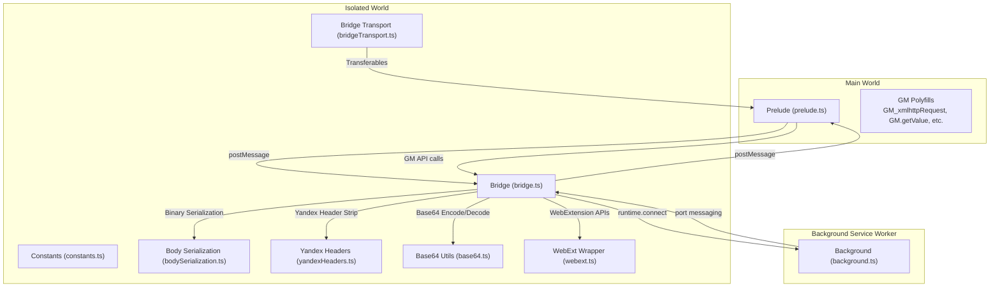
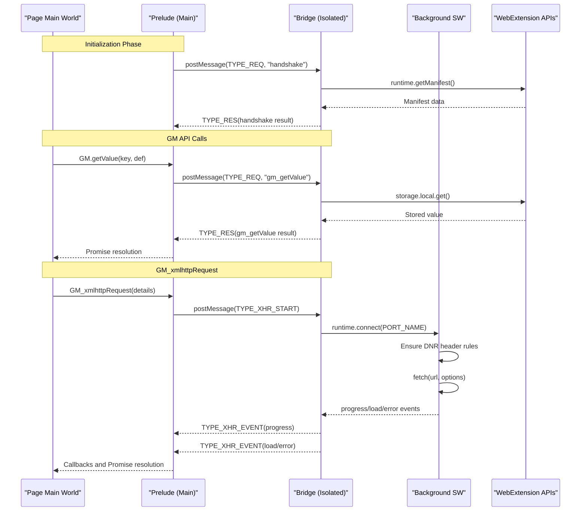
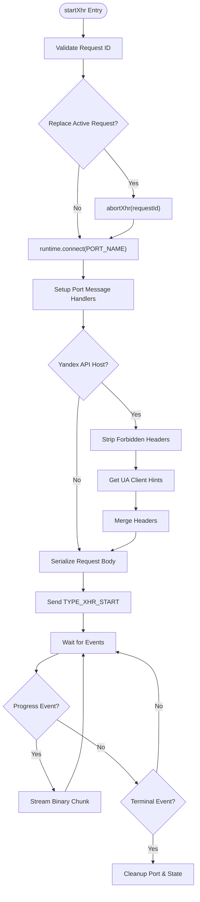
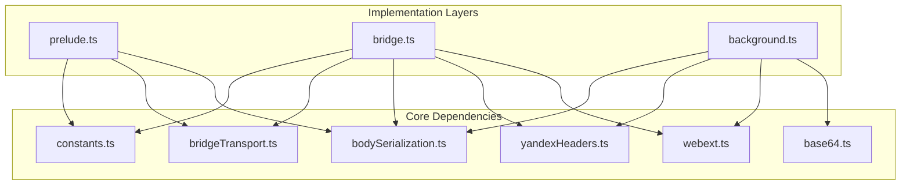

# Extension Bridge System

<cite>
**Referenced Files in This Document**
- [bridge.ts](file://src/extension/bridge.ts)
- [prelude.ts](file://src/extension/prelude.ts)
- [bridgeTransport.ts](file://src/extension/bridgeTransport.ts)
- [constants.ts](file://src/extension/constants.ts)
- [bodySerialization.ts](file://src/extension/bodySerialization.ts)
- [yandexHeaders.ts](file://src/extension/yandexHeaders.ts)
- [base64.ts](file://src/extension/base64.ts)
- [webext.ts](file://src/extension/webext.ts)
- [background.ts](file://src/extension/background.ts)
- [gm.ts](file://src/utils/gm.ts)
- [storage.ts](file://src/utils/storage.ts)
</cite>

## Table of Contents
1. [Introduction](#introduction)
2. [Project Structure](#project-structure)
3. [Core Components](#core-components)
4. [Architecture Overview](#architecture-overview)
5. [Detailed Component Analysis](#detailed-component-analysis)
6. [Dependency Analysis](#dependency-analysis)
7. [Performance Considerations](#performance-considerations)
8. [Troubleshooting Guide](#troubleshooting-guide)
9. [Conclusion](#conclusion)

## Introduction
This document describes the extension bridge system that enables cross-browser compatibility between userscript and native extension versions. The bridge operates in an isolated content script world while exposing a userscript API surface via globalThis.postMessage. It routes messages between the main world and the isolated world, implements a GM API proxy for storage operations, and provides a secure GM_xmlhttpRequest proxy mechanism that communicates with a background service worker. The system includes robust binary data serialization, Yandex header normalization, and comprehensive error handling and debugging capabilities.

## Project Structure
The bridge system spans three distinct worlds and integrates with the background service worker:

- Isolated World (bridge.ts): Runs in the extension's isolated content script context, exposes GM API and GM_xmlhttpRequest proxy, and manages cross-world messaging.
- Main World (prelude.ts): Runs in the page's main world, installs GM polyfills, handles message routing, and provides Promise-based GM API.
- Background Service Worker (background.ts): Implements privileged operations including GM_xmlhttpRequest via fetch(), declarativeNetRequest header modifications, and notifications.

**Diagram sources**
- [prelude.ts:1-641](file://src/extension/prelude.ts#L1-L641)
- [bridge.ts:1-699](file://src/extension/bridge.ts#L1-L699)
- [background.ts:1-1086](file://src/extension/background.ts#L1-L1086)
- [bridgeTransport.ts:1-46](file://src/extension/bridgeTransport.ts#L1-L46)
- [constants.ts:1-102](file://src/extension/constants.ts#L1-L102)
- [bodySerialization.ts:1-570](file://src/extension/bodySerialization.ts#L1-L570)
- [yandexHeaders.ts:1-56](file://src/extension/yandexHeaders.ts#L1-L56)
- [base64.ts:1-128](file://src/extension/base64.ts#L1-L128)
- [webext.ts:1-187](file://src/extension/webext.ts#L1-L187)

**Section sources**
- [prelude.ts:1-641](file://src/extension/prelude.ts#L1-L641)
- [bridge.ts:1-699](file://src/extension/bridge.ts#L1-L699)
- [background.ts:1-1086](file://src/extension/background.ts#L1-L1086)

## Core Components
The bridge system consists of several core components that work together to enable cross-world communication:

### Message Types and Routing
The system defines seven primary message types for cross-world communication:
- TYPE_REQ/TYPE_RES: Request-response pattern for GM API calls
- TYPE_XHR_START/TYPE_XHR_ABORT: GM_xmlhttpRequest initiation and cancellation
- TYPE_XHR_ACK: Acknowledgment of GM_xmlhttpRequest start
- TYPE_XHR_EVENT: Progress and terminal events for GM_xmlhttpRequest
- TYPE_NOTIFY: Notification requests relayed to background

### GM API Proxy
The bridge implements a comprehensive GM API proxy with five operations:
- getValue: Retrieves stored values with default fallback
- setValue: Stores values in extension storage
- deleteValue: Removes values from storage
- listValues: Lists all stored keys
- getValues: Bulk retrieval with default values

### Binary Data Serialization
The body serialization system handles cross-world transfer of binary data:
- Supports ArrayBuffer, TypedArray, Blob, and File objects
- Converts to base64 for JSON-safe transport
- Handles cross-compartment wrappers and recovery scenarios
- Provides efficient streaming for large binary responses

### Yandex Header Management
Specialized header handling for Yandex API endpoints:
- Strips forbidden headers (Origin, Referer, extra UA-CH)
- Normalizes User-Agent Client Hints to minimal required set
- Uses declarativeNetRequest to inject headers in service worker context

**Section sources**
- [constants.ts:15-27](file://src/extension/constants.ts#L15-L27)
- [bridge.ts:580-625](file://src/extension/bridge.ts#L580-L625)
- [bodySerialization.ts:12-570](file://src/extension/bodySerialization.ts#L12-L570)
- [yandexHeaders.ts:1-56](file://src/extension/yandexHeaders.ts#L1-L56)

## Architecture Overview
The bridge architecture follows a three-tier design with strict separation of concerns:

**Diagram sources**
- [prelude.ts:619-640](file://src/extension/prelude.ts#L619-L640)
- [bridge.ts:647-698](file://src/extension/bridge.ts#L647-L698)
- [background.ts:487-925](file://src/extension/background.ts#L487-L925)

## Detailed Component Analysis

### Bridge (Isolated World)
The bridge serves as the central coordinator in the isolated content script world:

#### Message Processing Pipeline
The bridge processes incoming messages through a strict pipeline:
1. Validation: Ensures message has proper marker and type
2. Type Dispatch: Routes to appropriate handler based on message type
3. Action Execution: Performs requested operation
4. Response Generation: Sends TYPE_RES for request responses
5. Event Broadcasting: Posts TYPE_XHR_EVENT for GM_xmlhttpRequest progress

#### GM API Handler
The handleRequest function implements all GM API operations:
- gm_getValue: Single key retrieval with default fallback
- gm_setValue: Single key-value storage
- gm_deleteValue: Key removal
- gm_listValues: Complete key enumeration
- gm_getValues: Bulk retrieval with defaults

#### GM_xmlhttpRequest Implementation
The startXhr function orchestrates cross-world HTTP requests:
- Port Management: Creates and maintains connection to background
- Header Processing: Applies Yandex-specific header normalization
- Body Serialization: Converts binary data to base64 for transport
- Streaming: Handles large binary responses via chunked progress events
- Lifecycle Management: Tracks request state and cleanup

**Diagram sources**
- [bridge.ts:335-561](file://src/extension/bridge.ts#L335-L561)

**Section sources**
- [bridge.ts:580-625](file://src/extension/bridge.ts#L580-L625)
- [bridge.ts:335-561](file://src/extension/bridge.ts#L335-L561)

### Prelude (Main World)
The prelude initializes the main world environment and provides GM API polyfills:

#### GM API Polyfills
The installPageGmPolyfills function creates GM API equivalents:
- GM_notification: Sanitized notification forwarding
- GM_addStyle: DOM manipulation helper
- GM_xmlhttpRequest: Promise-based wrapper around bridge
- GM object: Promise-based GM API (getValue, setValue, etc.)

#### Message Handling
The prelude processes bridge responses through three handlers:
- Promise Responses: TYPE_RES for synchronous GM API calls
- XHR Acknowledgments: TYPE_XHR_ACK for request acknowledgment
- XHR Events: TYPE_XHR_EVENT for progress and completion

#### Timeout Management
The prelude implements robust timeout handling:
- Request timeouts: 15-second default for GM API calls
- XHR fallback watchdog: Graceful timeout handling with abort
- Cleanup: Proper resource cleanup on completion or error

**Section sources**
- [prelude.ts:288-478](file://src/extension/prelude.ts#L288-L478)
- [prelude.ts:480-611](file://src/extension/prelude.ts#L480-L611)

### Background Service Worker
The background service worker implements privileged operations:

#### Port Management
The onConnect listener manages extension messaging ports:
- Validates port name matches configured constant
- Sets up message and disconnect listeners
- Manages AbortController for request cancellation
- Handles port cleanup on disconnect

#### Fetch Implementation
The background performs actual HTTP requests:
- Header filtering: Separates forbidden headers for DNR
- Body decoding: Converts base64 back to binary
- Response streaming: Efficiently streams large binary responses
- Error handling: Comprehensive error mapping and reporting

#### DeclarativeNetRequest Integration
The background applies header rules for specific hosts:
- Yandex API: Strips Origin/Referer, normalizes UA-CH headers
- YouTubei API: Removes sensitive origin headers
- Googlevideo: Removes client data headers
- Session-scoped rules: Applied per request session

**Section sources**
- [background.ts:487-925](file://src/extension/background.ts#L487-L925)
- [background.ts:193-354](file://src/extension/background.ts#L193-L354)

### Transport Layer
The transport layer ensures efficient data transfer between worlds:

#### Transferable Objects
The bridgeTransport module optimizes memory usage:
- Identifies ArrayBuffer instances in XHR events
- Extracts transferable objects for zero-copy transfer
- Handles both progress and response chunks efficiently

#### Message Marking
All messages are marked with a unique identifier to prevent collisions:
- Prevents interference from other page scripts
- Enables reliable message routing
- Maintains message integrity across worlds

**Section sources**
- [bridgeTransport.ts:1-46](file://src/extension/bridgeTransport.ts#L1-L46)
- [constants.ts:12-14](file://src/extension/constants.ts#L12-L14)

### Binary Serialization System
The body serialization system handles complex data types:

#### Type Detection and Coercion
The system identifies and converts various binary formats:
- ArrayBuffer and TypedArray: Direct conversion to bytes
- Blob/File: Safe extraction via arrayBuffer()
- Cross-compartment wrappers: Recovery through coercion
- JSON fallback: Stringification for unsupported types

#### Base64 Encoding/Decoding
Efficient binary-to-text conversion:
- Optimized encoding/decoding with native support detection
- URL-safe alphabet handling
- Memory-efficient processing for large buffers

#### Streaming Responses
Large binary responses are streamed to avoid memory pressure:
- Progressive chunk delivery via base64
- Automatic concatenation in main world
- Efficient transfer using transferable objects

**Section sources**
- [bodySerialization.ts:161-534](file://src/extension/bodySerialization.ts#L161-L534)
- [base64.ts:75-128](file://src/extension/base64.ts#L75-L128)

### Yandex Header Stripping Mechanism
Specialized header handling for Yandex API compliance:

#### Header Classification
The system categorizes headers into three groups:
- Allowed: sec-ch-ua family headers
- Suppressed: Extra UA-CH headers to remove
- Forbidden: Origin, Referer, and other restricted headers

#### DNR Rule Application
DeclarativeNetRequest rules ensure proper header injection:
- Session-scoped rules prevent conflicts
- Atomic rule updates prevent race conditions
- Signature-based change detection minimizes updates

**Section sources**
- [yandexHeaders.ts:1-56](file://src/extension/yandexHeaders.ts#L1-L56)
- [background.ts:193-354](file://src/extension/background.ts#L193-L354)

## Dependency Analysis
The bridge system exhibits well-managed dependencies with clear separation of concerns:

**Diagram sources**
- [prelude.ts:1-18](file://src/extension/prelude.ts#L1-L18)
- [bridge.ts:1-24](file://src/extension/bridge.ts#L1-L24)
- [background.ts:12-33](file://src/extension/background.ts#L12-L33)

The dependency graph reveals:
- Low coupling between main world and isolated world
- Centralized constants and utilities
- Clear separation between transport and business logic
- Minimal circular dependencies

**Section sources**
- [constants.ts:1-102](file://src/extension/constants.ts#L1-L102)
- [prelude.ts:1-18](file://src/extension/prelude.ts#L1-L18)
- [bridge.ts:1-24](file://src/extension/bridge.ts#L1-L24)
- [background.ts:12-33](file://src/extension/background.ts#L12-L33)

## Performance Considerations
The bridge system implements several optimizations for efficiency:

### Memory Management
- Transferable objects: Zero-copy transfer of ArrayBuffer instances
- Streaming responses: Progressive binary data delivery
- Request pooling: Reuse of active request state
- Cleanup timers: Automatic resource cleanup on completion

### Network Optimization
- Header caching: UA-CH headers cached for 10 minutes
- DNR rule batching: Queued rule updates prevent conflicts
- Binary streaming: Large responses avoid memory pressure
- Timeout management: Prevents hanging requests

### Serialization Efficiency
- Base64 encoding: Optimized for modern browsers
- Cross-compartment recovery: Handles wrapper objects efficiently
- Type detection: Minimizes unnecessary conversions
- Debug summaries: Reduced overhead for logging

## Troubleshooting Guide

### Common Issues and Solutions

#### Bridge Not Initializing
**Symptoms**: GM API calls fail with "bridge not available"
**Causes**: 
- Missing WebExtension APIs in isolated world
- Content script loading order issues
- Message routing conflicts

**Solutions**:
- Verify extension context availability
- Check message type constants consistency
- Review content script isolation settings

#### GM_xmlhttpRequest Failures
**Symptoms**: Requests timeout or fail with CORS errors
**Causes**:
- Yandex API header restrictions
- Binary data serialization issues
- Background service worker unresponsive

**Solutions**:
- Enable DNR header rules for target hosts
- Verify binary serialization for large payloads
- Check background port connectivity

#### Binary Data Problems
**Symptoms**: Binary responses corrupted or incomplete
**Causes**:
- Base64 encoding/decoding errors
- Streaming chunk mismanagement
- Transferable object issues

**Solutions**:
- Validate base64 alphabet usage
- Check chunk aggregation logic
- Verify transferable object handling

### Debugging Techniques
The system provides comprehensive debugging capabilities:

#### Logging Levels
- Debug logs: Detailed operational information
- Warning logs: Potential issues and recoveries
- Error logs: Failure conditions and stack traces

#### Message Tracing
- Request IDs: Unique identifiers for end-to-end tracing
- Event timestamps: Precise timing information
- State transitions: Request lifecycle tracking

#### Performance Monitoring
- Request duration metrics
- Memory usage patterns
- Network latency measurements

**Section sources**
- [bridge.ts:540-560](file://src/extension/bridge.ts#L540-L560)
- [prelude.ts:184-211](file://src/extension/prelude.ts#L184-L211)
- [background.ts:871-923](file://src/extension/background.ts#L871-L923)

## Conclusion
The extension bridge system provides a robust, cross-browser compatible solution for userscript and native extension interoperability. Through careful separation of concerns, efficient binary serialization, and comprehensive error handling, it enables seamless operation across different browser contexts. The system's modular design facilitates maintenance and extension, while its performance optimizations ensure responsive user experiences. The specialized handling of Yandex API requirements demonstrates the system's adaptability to specific platform constraints.

Key strengths of the implementation include:
- Clean architectural separation between worlds
- Efficient binary data handling with streaming support
- Comprehensive error handling and recovery mechanisms
- Performance optimizations for memory and network usage
- Extensive debugging and monitoring capabilities

The bridge system successfully bridges the gap between userscript expectations and extension limitations, providing a unified API surface that works consistently across different browser environments.