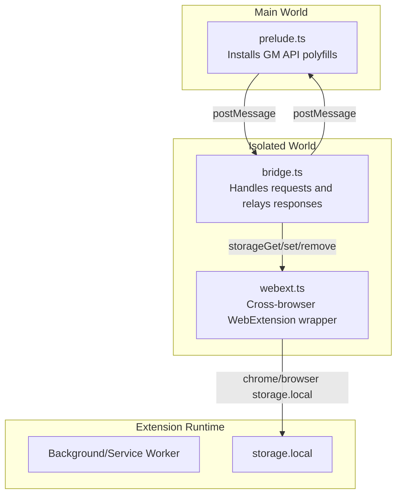
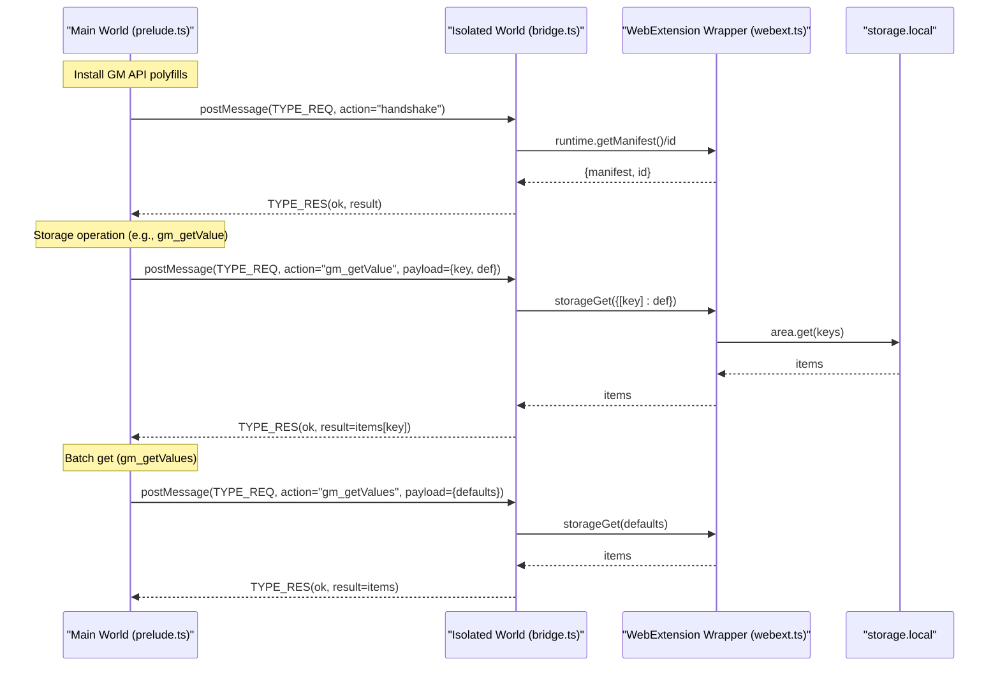
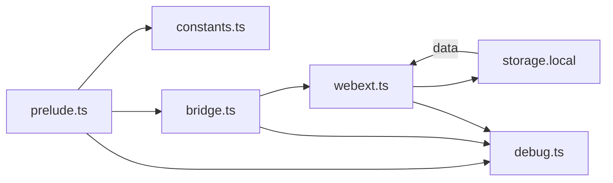

# GM API Proxy Implementation

<cite>
**Referenced Files in This Document**
- [prelude.ts](file://src/extension/prelude.ts)
- [bridge.ts](file://src/extension/bridge.ts)
- [webext.ts](file://src/extension/webext.ts)
- [constants.ts](file://src/extension/constants.ts)
- [storage.ts](file://src/utils/storage.ts)
- [storage.ts](file://src/types/storage.ts)
- [gm.ts](file://src/utils/gm.ts)
- [debug.ts](file://src/utils/debug.ts)
</cite>

## Table of Contents
1. [Introduction](#introduction)
2. [Project Structure](#project-structure)
3. [Core Components](#core-components)
4. [Architecture Overview](#architecture-overview)
5. [Detailed Component Analysis](#detailed-component-analysis)
6. [Dependency Analysis](#dependency-analysis)
7. [Performance Considerations](#performance-considerations)
8. [Troubleshooting Guide](#troubleshooting-guide)
9. [Conclusion](#conclusion)

## Introduction
This document explains the GM API proxy that exposes storage operations from the extension's isolated world to the main world. It covers the five core storage operations (gm_getValue, gm_setValue, gm_deleteValue, gm_listValues, gm_getValues), the storage abstraction layer that maps to WebExtension storage.local, parameter validation, error handling, and the handshake mechanism for manifest metadata exchange. Practical examples, caching behavior, and debugging guidance are included to help developers integrate and troubleshoot storage operations effectively.

## Project Structure
The GM API proxy spans three layers:
- Main world prelude: installs polyfills for GM.* and GM_xmlhttpRequest, manages request/response lifecycles, and performs a handshake to enrich GM_info.
- Bridge (isolated world): translates main-world requests into privileged extension API calls and relays responses.
- WebExtension wrapper: normalizes browser/chrome namespaces and provides async wrappers around storage.local.

**Diagram sources**
- [prelude.ts:288-478](file://src/extension/prelude.ts#L288-L478)
- [bridge.ts:580-625](file://src/extension/bridge.ts#L580-L625)
- [webext.ts:103-135](file://src/extension/webext.ts#L103-L135)

**Section sources**
- [prelude.ts:288-478](file://src/extension/prelude.ts#L288-L478)
- [bridge.ts:580-625](file://src/extension/bridge.ts#L580-L625)
- [webext.ts:103-135](file://src/extension/webext.ts#L103-L135)

## Core Components
- GM API Polyfills in main world: Expose GM.getValue, GM.setValue, GM.deleteValue, GM.listValues, GM.getValues, and GM_xmlhttpRequest behind a unified interface. Also provide GM_info and GM_notification forwarding.
- Bridge actions: Translate GM_* requests into storageGet/storageSet/storageRemove calls and return results to main world.
- Storage abstraction: VOTStorage class that detects GM API availability and falls back to localStorage when needed, with compatibility conversion and batch operations.
- Handshake: Exchange manifest metadata to populate GM_info with real script name/version.

**Section sources**
- [prelude.ts:449-478](file://src/extension/prelude.ts#L449-L478)
- [bridge.ts:580-625](file://src/extension/bridge.ts#L580-L625)
- [storage.ts:204-380](file://src/utils/storage.ts#L204-L380)
- [prelude.ts:619-640](file://src/extension/prelude.ts#L619-L640)

## Architecture Overview
The proxy architecture ensures secure isolation while enabling storage operations from main world:

**Diagram sources**
- [prelude.ts:619-640](file://src/extension/prelude.ts#L619-L640)
- [bridge.ts:580-625](file://src/extension/bridge.ts#L580-L625)
- [webext.ts:103-135](file://src/extension/webext.ts#L103-L135)

## Detailed Component Analysis

### GM API Polyfills (Main World)
The prelude script installs:
- GM object with promise-based methods: getValue, setValue, deleteValue, listValues, getValues.
- GM_xmlhttpRequest shim that posts cross-world messages and manages callbacks/promises.
- GM_info enrichment via handshake with the extension.

Key behaviors:
- Request/response lifecycle with timeouts and ID generation.
- Serialization of request bodies to avoid structured clone pitfalls.
- Notification sanitization to avoid DataCloneError.

Practical examples:
- Retrieve a single value with default fallback: call GM.getValue("key", defaultValue).
- Set a value: call GM.setValue("key", value).
- Delete a key: call GM.deleteValue("key").
- List all keys: call GM.listValues().
- Batch retrieval with defaults: call GM.getValues({key1: def1, key2: def2}).

**Section sources**
- [prelude.ts:449-478](file://src/extension/prelude.ts#L449-L478)
- [prelude.ts:91-110](file://src/extension/prelude.ts#L91-L110)
- [prelude.ts:288-380](file://src/extension/prelude.ts#L288-L380)
- [prelude.ts:619-640](file://src/extension/prelude.ts#L619-L640)

### Bridge Actions (Isolated World)
The bridge listens for messages and executes privileged operations:
- handshake: Returns manifest metadata and extension ID.
- gm_getValue: Reads a single key with default fallback via storageGet.
- gm_setValue: Writes a key-value pair via storageSet.
- gm_deleteValue: Removes a key via storageRemove.
- gm_listValues: Lists all keys by fetching all items and extracting keys.
- gm_getValues: Batch retrieval using storageGet with defaults.

Parameter validation:
- Keys are coerced to strings.
- Defaults are preserved for batch operations.

Error handling:
- Unknown actions throw descriptive errors.
- Bridge errors are reported back to main world with TYPE_RES(ok=false).

**Section sources**
- [bridge.ts:580-625](file://src/extension/bridge.ts#L580-L625)
- [bridge.ts:627-634](file://src/extension/bridge.ts#L627-L634)

### WebExtension Wrapper
Provides cross-browser compatibility:
- Normalizes chrome vs browser namespaces.
- Converts callback-based APIs to promises for Chromium.
- Exposes storageGet, storageSet, storageRemove with consistent signatures.

Behavior:
- Uses runtime.lastError on Chromium to propagate errors.
- Ensures robustness when APIs are unavailable.

**Section sources**
- [webext.ts:56-101](file://src/extension/webext.ts#L56-L101)
- [webext.ts:103-135](file://src/extension/webext.ts#L103-L135)

### Storage Abstraction Layer (VOTStorage)
The VOTStorage class provides a unified interface over:
- GM API (promise-based GM.getValue/GM.getValues/GM.setValue/GM.deleteValue/GM.listValues) when available.
- Legacy GM API (GM_getValue/GM_setValue/GM_deleteValue/GM_listValues) as fallback.
- localStorage when neither GM nor storage.local is available.

Core operations:
- get(name, def?): Returns value with default fallback.
- set(name, value): Stores a key-value pair.
- delete(name): Removes a key.
- list(): Enumerates stored keys.
- getValues(defaults): Batch retrieval with default values.

Compatibility and migration:
- Maintains compatibility rules for migrating old keys to new ones.
- Converts values based on categories (e.g., number to boolean).
- Writes converted values and optionally deletes old keys.

Caching behavior:
- Supports only LS fallback mode when no GM APIs are detected.
- No explicit in-memory cache; values are read/written directly.

**Section sources**
- [storage.ts:204-380](file://src/utils/storage.ts#L204-L380)
- [storage.ts:139-190](file://src/utils/storage.ts#L139-L190)
- [storage.ts:192-202](file://src/utils/storage.ts#L192-L202)

### Handshake Mechanism
Purpose:
- Populate GM_info with real manifest metadata (script name/version) after initialization.

Flow:
- Main world requests handshake via TYPE_REQ.
- Bridge responds with manifest and extension ID.
- Pre-initialization GM_info is augmented with manifest data.

**Section sources**
- [prelude.ts:619-640](file://src/extension/prelude.ts#L619-L640)
- [bridge.ts:584-590](file://src/extension/bridge.ts#L584-L590)

## Dependency Analysis
The system exhibits layered dependencies with clear separation of concerns:

**Diagram sources**
- [prelude.ts:1-20](file://src/extension/prelude.ts#L1-L20)
- [constants.ts:1-30](file://src/extension/constants.ts#L1-L30)
- [bridge.ts:1-25](file://src/extension/bridge.ts#L1-L25)
- [webext.ts:1-10](file://src/extension/webext.ts#L1-L10)
- [debug.ts:1-10](file://src/utils/debug.ts#L1-L10)

**Section sources**
- [prelude.ts:1-20](file://src/extension/prelude.ts#L1-L20)
- [constants.ts:1-30](file://src/extension/constants.ts#L1-L30)
- [bridge.ts:1-25](file://src/extension/bridge.ts#L1-L25)
- [webext.ts:1-10](file://src/extension/webext.ts#L1-L10)
- [debug.ts:1-10](file://src/utils/debug.ts#L1-L10)

## Performance Considerations
- Cross-world messaging overhead: Each GM API call crosses main/isolated worlds and may serialize/deserialize payloads. Prefer batch operations (GM.getValues) to reduce round-trips.
- Binary body handling: GM_xmlhttpRequest serializes bodies to avoid structured clone issues; large binary payloads increase overhead.
- Compatibility conversions: When migrating old keys, batch writes/deletes are executed concurrently to minimize delays.
- Timeout safety: Requests include timeouts to prevent hanging; bridge requests time out after a fixed duration.

[No sources needed since this section provides general guidance]

## Troubleshooting Guide
Common issues and resolutions:
- Missing WebExtension APIs: If runtime or storage.local are unavailable, the bridge logs warnings. Operations fall back to localStorage when supported.
- Bridge timeout: If the bridge does not respond within the timeout window, the main world rejects the promise with a timeout error. Retry the operation or check cross-world communication.
- DataCloneError with notifications: The prelude sanitizes notification details to avoid passing functions. Ensure notification details exclude callbacks.
- GM API unavailability: If GM.getValue/GM.getValues/GM.setValue/GM.deleteValue/GM.listValues are not available, VOTStorage falls back to localStorage. Verify that the environment supports the GM API.
- Debug logging: Enable debug mode to inspect cross-world messages, timeouts, and compatibility conversions.

**Section sources**
- [bridge.ts:644-646](file://src/extension/bridge.ts#L644-L646)
- [prelude.ts:97-101](file://src/extension/prelude.ts#L97-L101)
- [prelude.ts:70-80](file://src/extension/prelude.ts#L70-L80)
- [storage.ts:235-248](file://src/utils/storage.ts#L235-L248)
- [debug.ts:5-35](file://src/utils/debug.ts#L5-L35)

## Conclusion
The GM API proxy cleanly separates concerns between main and isolated worlds, exposing a familiar GM API surface while leveraging WebExtension storage.local for persistence. The VOTStorage abstraction ensures compatibility across environments, supports batch operations, and handles migration of legacy keys. The handshake mechanism enriches environment metadata, and robust error handling and timeouts improve reliability. By following the examples and guidelines in this document, developers can confidently integrate storage operations and debug issues efficiently.