# Binary Data Processing

<cite>
**Referenced Files in This Document**
- [base64.ts](file://src/extension/base64.ts)
- [bodySerialization.ts](file://src/extension/bodySerialization.ts)
- [bridge.ts](file://src/extension/bridge.ts)
- [bridgeTransport.ts](file://src/extension/bridgeTransport.ts)
- [prelude.ts](file://src/extension/prelude.ts)
- [background.ts](file://src/extension/background.ts)
- [constants.ts](file://src/extension/constants.ts)
- [processor.ts](file://src/subtitles/processor.ts)
- [index.ts](file://src/audioDownloader/index.ts)
</cite>

## Table of Contents
1. [Introduction](#introduction)
2. [Project Structure](#project-structure)
3. [Core Components](#core-components)
4. [Architecture Overview](#architecture-overview)
5. [Detailed Component Analysis](#detailed-component-analysis)
6. [Dependency Analysis](#dependency-analysis)
7. [Performance Considerations](#performance-considerations)
8. [Troubleshooting Guide](#troubleshooting-guide)
9. [Conclusion](#conclusion)
10. [Appendices](#appendices)

## Introduction
This document explains the binary data processing pipeline that transfers ArrayBuffer data between the content script and the background service worker. It covers:
- Base64 encoding/decoding used to serialize binary data for JSON messaging
- Chunk aggregation for large binary responses
- ArrayBuffer concatenation strategy and memory management
- Fallback mechanisms when direct ArrayBuffer transfer fails
- Binary response resolution logic for different response types (ArrayBuffer, Blob, base64 strings)
- Transferable object optimization via structured cloning and postMessage
- Practical examples for audio downloads and subtitle processing

## Project Structure
The binary data pipeline spans three layers:
- Content script (MAIN world) prelude and bridge
- Background service worker (MV3) port handler
- Shared helpers for base64 and body serialization

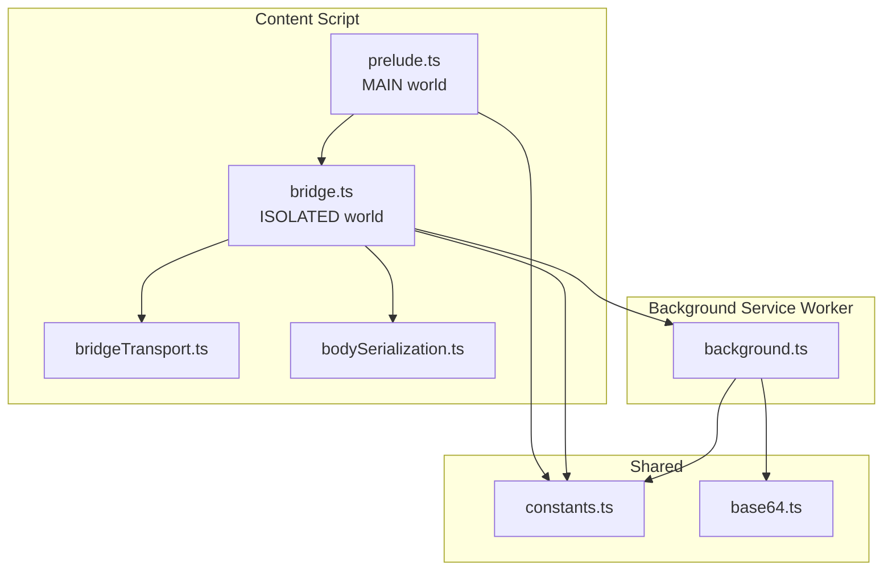

**Diagram sources**
- [prelude.ts:1-641](file://src/extension/prelude.ts#L1-L641)
- [bridge.ts:1-699](file://src/extension/bridge.ts#L1-L699)
- [bridgeTransport.ts:1-46](file://src/extension/bridgeTransport.ts#L1-L46)
- [bodySerialization.ts:1-570](file://src/extension/bodySerialization.ts#L1-L570)
- [background.ts:1-1086](file://src/extension/background.ts#L1-L1086)
- [constants.ts:1-102](file://src/extension/constants.ts#L1-L102)
- [base64.ts:1-128](file://src/extension/base64.ts#L1-L128)

**Section sources**
- [prelude.ts:1-641](file://src/extension/prelude.ts#L1-L641)
- [bridge.ts:1-699](file://src/extension/bridge.ts#L1-L699)
- [bridgeTransport.ts:1-46](file://src/extension/bridgeTransport.ts#L1-L46)
- [bodySerialization.ts:1-570](file://src/extension/bodySerialization.ts#L1-L570)
- [background.ts:1-1086](file://src/extension/background.ts#L1-L1086)
- [constants.ts:1-102](file://src/extension/constants.ts#L1-L102)
- [base64.ts:1-128](file://src/extension/base64.ts#L1-L128)

## Core Components
- Base64 helpers: Provide efficient conversion between ArrayBuffer/Uint8Array and base64 strings, with fallbacks for environments lacking native methods.
- Body serialization: Encodes request bodies (ArrayBuffer, TypedArray, Blob) into a transportable format and decodes them back for fetch/XHR.
- Bridge: Manages GM_xmlhttpRequest polyfill, streams binary progress, aggregates chunks, and resolves final binary responses.
- Transport: Determines transferable objects for postMessage to minimize copies and leverage zero-copy semantics.
- Background: Performs network requests, streams large binaries as base64 chunks, and posts progress/load events.

**Section sources**
- [base64.ts:1-128](file://src/extension/base64.ts#L1-L128)
- [bodySerialization.ts:1-570](file://src/extension/bodySerialization.ts#L1-L570)
- [bridge.ts:1-699](file://src/extension/bridge.ts#L1-L699)
- [bridgeTransport.ts:1-46](file://src/extension/bridgeTransport.ts#L1-L46)
- [background.ts:1-1086](file://src/extension/background.ts#L1-L1086)

## Architecture Overview
The pipeline uses a port-based communication channel between the bridge and the background service worker. Binary payloads are transported as base64 strings in JSON messages, with progress streaming for large responses and transferable objects for direct ArrayBuffer delivery when possible.

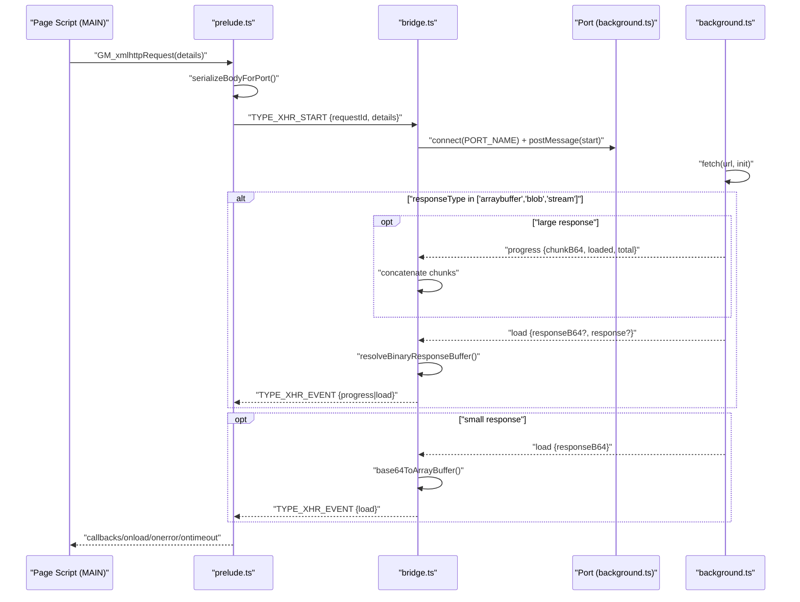

**Diagram sources**
- [prelude.ts:309-380](file://src/extension/prelude.ts#L309-L380)
- [bridge.ts:335-561](file://src/extension/bridge.ts#L335-L561)
- [background.ts:535-925](file://src/extension/background.ts#L535-L925)
- [bridgeTransport.ts:9-25](file://src/extension/bridgeTransport.ts#L9-L25)
- [constants.ts:19-27](file://src/extension/constants.ts#L19-L27)

## Detailed Component Analysis

### Base64 Encoding/Decoding Mechanism
- Converts ArrayBuffer/Uint8Array to base64 and vice versa.
- Uses native methods when available; falls back to legacy btoa/atob with manual byte conversion.
- Normalizes inputs (whitespace removal, padding) and supports both base64 and base64url alphabets.

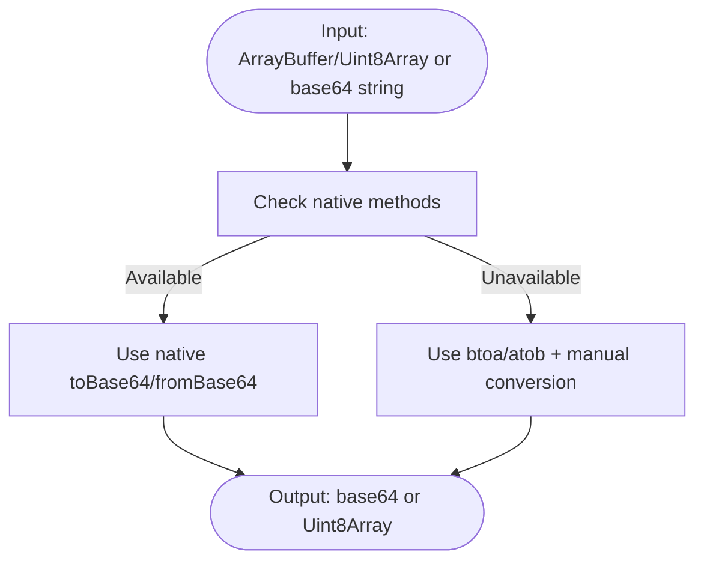

**Diagram sources**
- [base64.ts:24-31](file://src/extension/base64.ts#L24-L31)
- [base64.ts:75-95](file://src/extension/base64.ts#L75-L95)
- [base64.ts:110-127](file://src/extension/base64.ts#L110-L127)

**Section sources**
- [base64.ts:1-128](file://src/extension/base64.ts#L1-L128)

### Body Serialization for Requests
- Serializes request bodies (ArrayBuffer, TypedArray, Blob/File) into a transportable envelope containing base64 and metadata.
- Decodes envelopes back into BodyInit-compatible forms for fetch/XHR.
- Includes robust recovery for cross-compartment and malformed payloads.

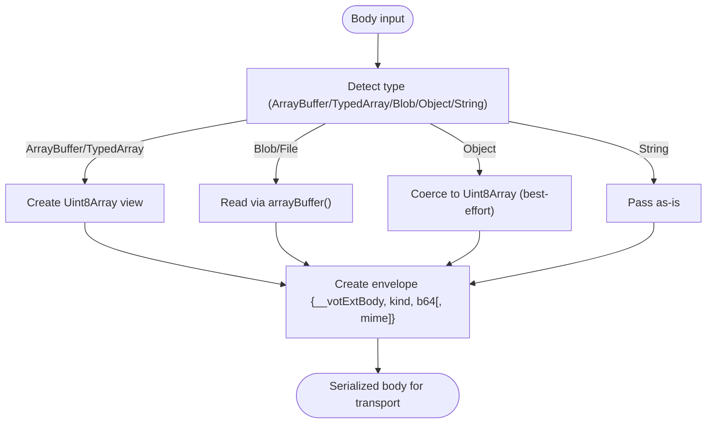

**Diagram sources**
- [bodySerialization.ts:466-534](file://src/extension/bodySerialization.ts#L466-L534)
- [bodySerialization.ts:539-569](file://src/extension/bodySerialization.ts#L539-L569)

**Section sources**
- [bodySerialization.ts:1-570](file://src/extension/bodySerialization.ts#L1-L570)

### Binary Response Resolution Logic
- Aggregates progress chunks into a single ArrayBuffer when needed.
- Resolves final response from either direct ArrayBuffer, aggregated chunks, or base64 fallback.
- Converts final ArrayBuffer to Blob when responseType is "blob".

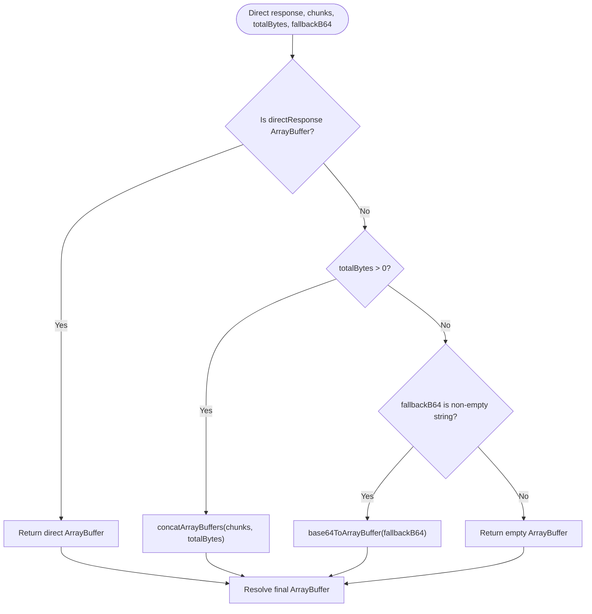

**Diagram sources**
- [bridge.ts:303-333](file://src/extension/bridge.ts#L303-L333)

**Section sources**
- [bridge.ts:303-333](file://src/extension/bridge.ts#L303-L333)

### ArrayBuffer Concatenation Strategy and Memory Management
- Concatenates multiple ArrayBuffer chunks into a single Uint8Array, then slices to an ArrayBuffer view.
- Keeps a copy of transferred chunks for aggregation to avoid detached buffer issues after transfer.
- Limits inline binary payload size; large responses stream chunks to reduce memory pressure.

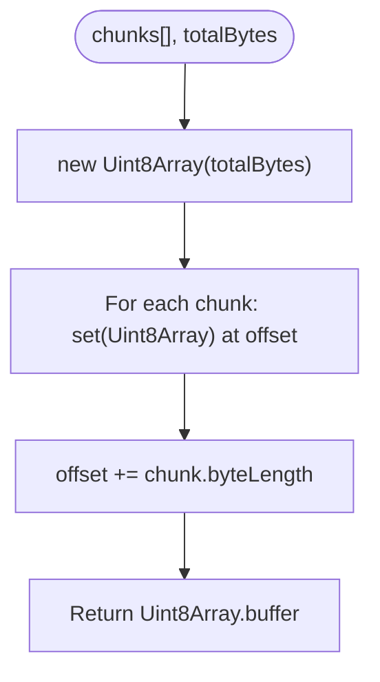

**Diagram sources**
- [bridge.ts:303-315](file://src/extension/bridge.ts#L303-L315)
- [background.ts:800-834](file://src/extension/background.ts#L800-L834)

**Section sources**
- [bridge.ts:303-315](file://src/extension/bridge.ts#L303-L315)
- [background.ts:800-834](file://src/extension/background.ts#L800-L834)

### Transferable Object Optimization
- Determines which payload fields are transferable to minimize copying and leverage zero-copy semantics.
- Transfers progress chunk and response body ArrayBuffer independently when both are present.

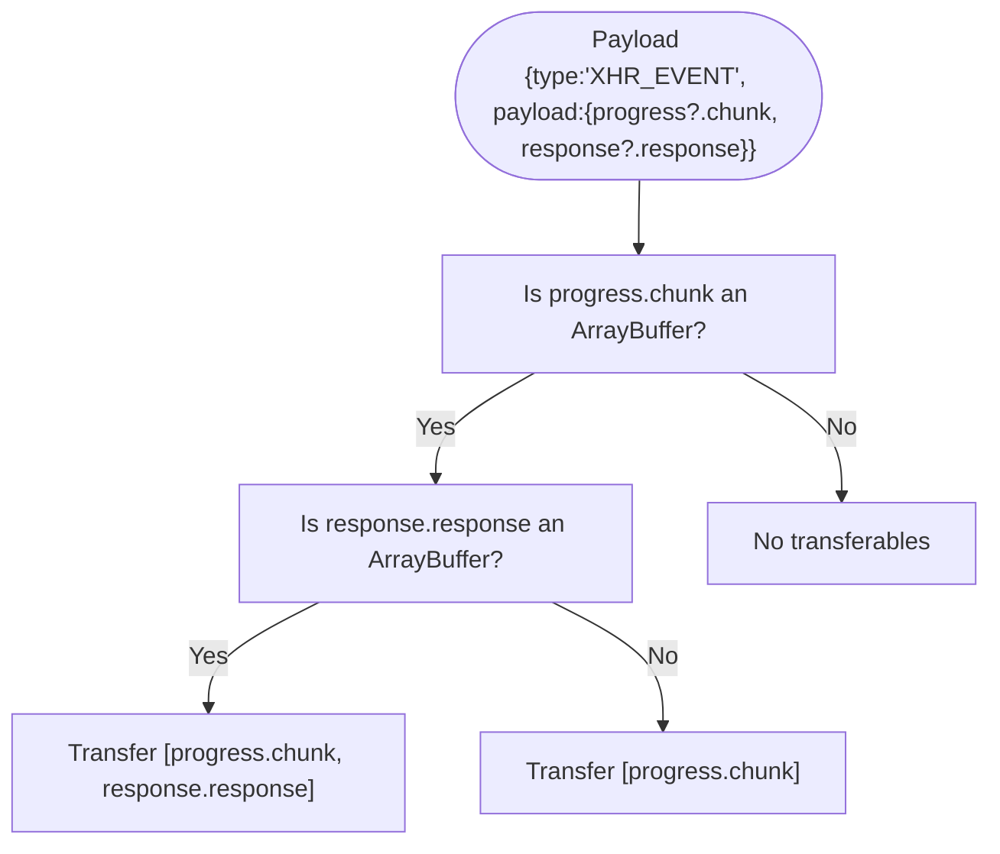

**Diagram sources**
- [bridgeTransport.ts:9-25](file://src/extension/bridgeTransport.ts#L9-L25)

**Section sources**
- [bridgeTransport.ts:1-46](file://src/extension/bridgeTransport.ts#L1-L46)

### Fallback Mechanisms for Direct ArrayBuffer Transfer
- Falls back to base64 strings when direct transfer fails or is not applicable.
- Ensures robustness by keeping a copy of chunks before transferring to maintain aggregation integrity.

**Section sources**
- [bridge.ts:410-425](file://src/extension/bridge.ts#L410-L425)
- [bridge.ts:427-455](file://src/extension/bridge.ts#L427-L455)

### Streaming Large Binary Responses
- Streams large responses via ReadableStream reader, sending base64-encoded chunks with progress events.
- Stops streaming upon terminal events (load/error/abort/timeout).

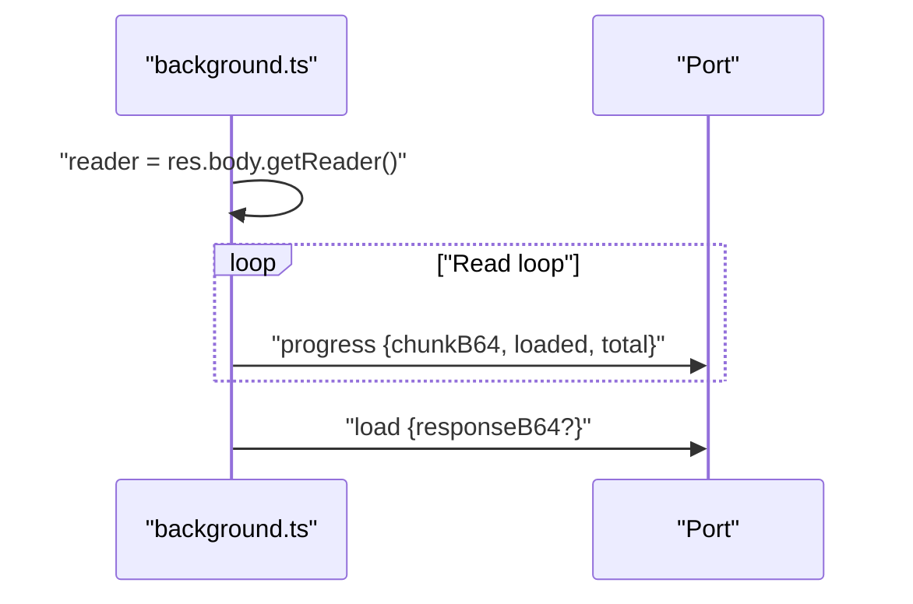

**Diagram sources**
- [background.ts:802-825](file://src/extension/background.ts#L802-L825)
- [background.ts:859-870](file://src/extension/background.ts#L859-L870)

**Section sources**
- [background.ts:800-834](file://src/extension/background.ts#L800-L834)
- [background.ts:847-870](file://src/extension/background.ts#L847-L870)

### Binary Data Handling in Audio Downloads
- Processes audio as Uint8Array chunks, emitting partial audio events and a final single-buffer event when appropriate.
- Validates chunk sizes and ensures non-empty audio data.

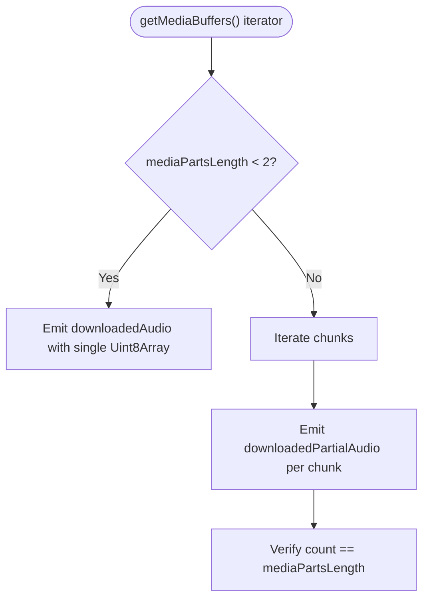

**Diagram sources**
- [index.ts:28-85](file://src/audioDownloader/index.ts#L28-L85)

**Section sources**
- [index.ts:1-189](file://src/audioDownloader/index.ts#L1-L189)

### Binary Data Handling in Subtitle Processing
- Fetches subtitles as text or JSON depending on format, then converts to a normalized tokenized structure.
- Handles YouTube ASR JSON and VK-specific cleaning and merging.

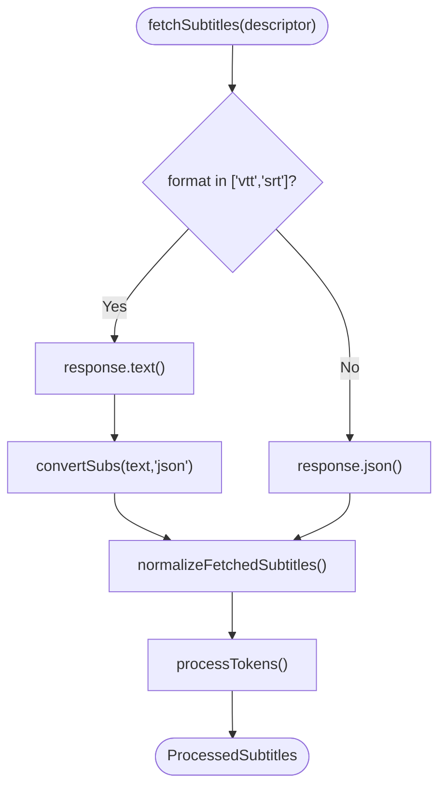

**Diagram sources**
- [processor.ts:564-574](file://src/subtitles/processor.ts#L564-L574)
- [processor.ts:576-599](file://src/subtitles/processor.ts#L576-L599)

**Section sources**
- [processor.ts:564-599](file://src/subtitles/processor.ts#L564-L599)

## Dependency Analysis
The binary pipeline depends on shared constants, transport helpers, and base64 utilities across layers.

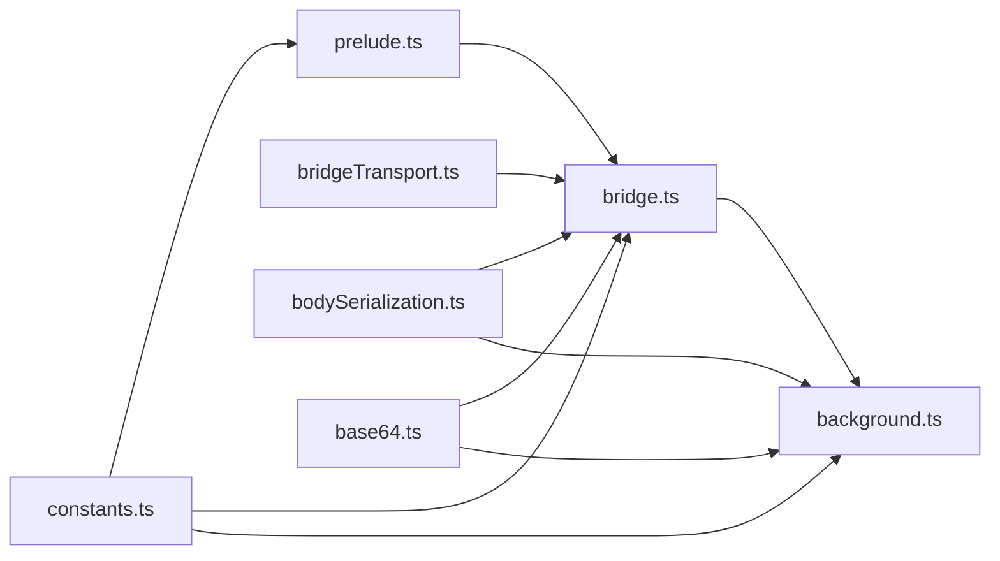

**Diagram sources**
- [constants.ts:1-102](file://src/extension/constants.ts#L1-L102)
- [prelude.ts:1-641](file://src/extension/prelude.ts#L1-L641)
- [bridge.ts:1-699](file://src/extension/bridge.ts#L1-L699)
- [bridgeTransport.ts:1-46](file://src/extension/bridgeTransport.ts#L1-L46)
- [bodySerialization.ts:1-570](file://src/extension/bodySerialization.ts#L1-L570)
- [background.ts:1-1086](file://src/extension/background.ts#L1-L1086)
- [base64.ts:1-128](file://src/extension/base64.ts#L1-L128)

**Section sources**
- [constants.ts:1-102](file://src/extension/constants.ts#L1-L102)
- [bridgeTransport.ts:1-46](file://src/extension/bridgeTransport.ts#L1-L46)
- [bodySerialization.ts:1-570](file://src/extension/bodySerialization.ts#L1-L570)
- [base64.ts:1-128](file://src/extension/base64.ts#L1-L128)

## Performance Considerations
- Prefer streaming for large binary responses to avoid loading entire payloads into memory at once.
- Use transferable objects to minimize copies and leverage zero-copy semantics for ArrayBuffer.
- Limit inline binary payload size to reduce message serialization overhead.
- Normalize and pad base64 inputs to avoid repeated conversions and ensure consistent decoding.

## Troubleshooting Guide
- If binary responses arrive as base64 strings, verify the responseType and ensure fallbackB64 is handled correctly.
- For large responses, confirm progress events are received and aggregated properly.
- If direct ArrayBuffer transfer fails, ensure the bridge keeps copies of chunks before transfer and uses fallbackB64 when available.
- Validate that cross-compartment payloads are serialized/deserialized correctly using the bodySerialization helpers.

**Section sources**
- [bridge.ts:410-425](file://src/extension/bridge.ts#L410-L425)
- [bridge.ts:427-455](file://src/extension/bridge.ts#L427-L455)
- [background.ts:800-834](file://src/extension/background.ts#L800-L834)

## Conclusion
The binary data processing system combines robust base64 serialization, chunked streaming, and transferable object optimization to reliably transport binary payloads across content script and background service worker boundaries. It gracefully handles large responses, provides fallbacks for direct transfer failures, and integrates seamlessly with audio and subtitle workflows.

## Appendices
- Example scenarios:
  - Audio downloads: Emit partial audio chunks and a final single-buffer event when appropriate.
  - Subtitle processing: Fetch and convert subtitles to tokenized structures, handling various formats and normalization steps.

**Section sources**
- [index.ts:28-85](file://src/audioDownloader/index.ts#L28-L85)
- [processor.ts:564-599](file://src/subtitles/processor.ts#L564-L599)