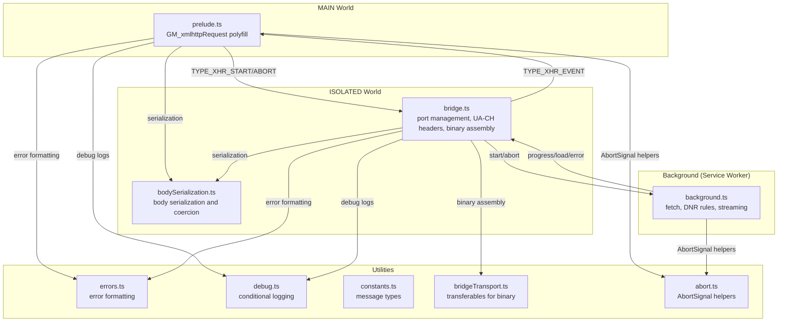
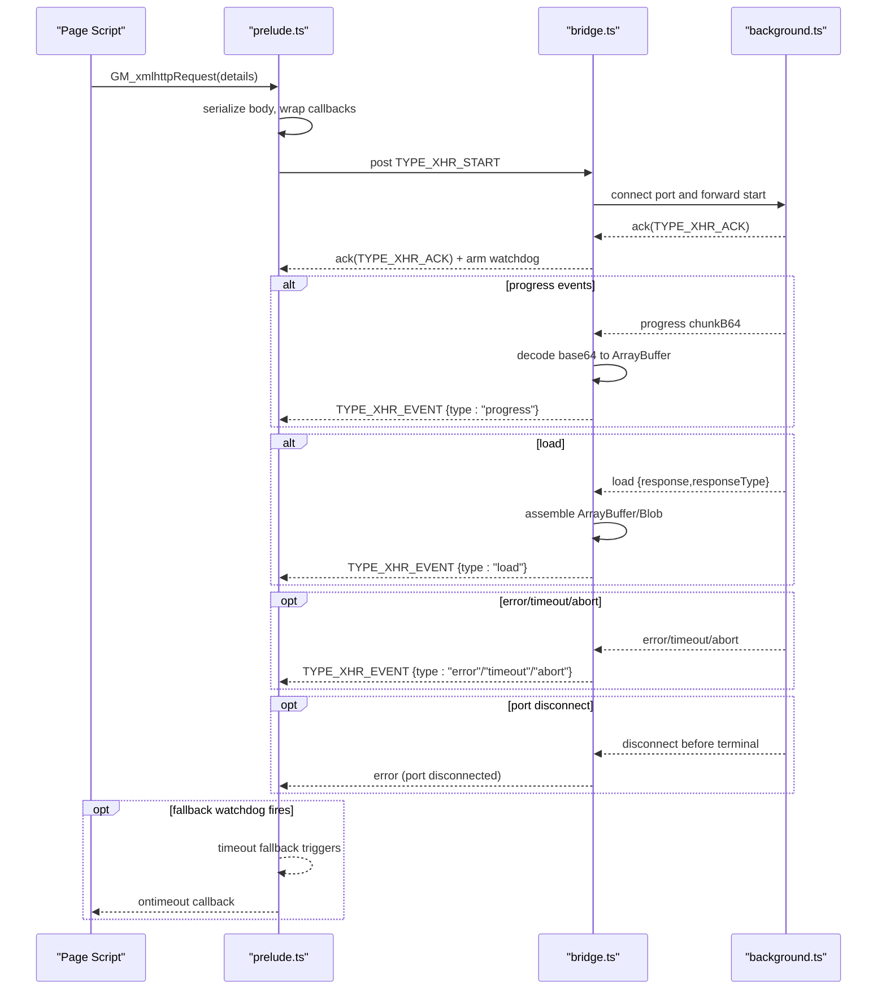
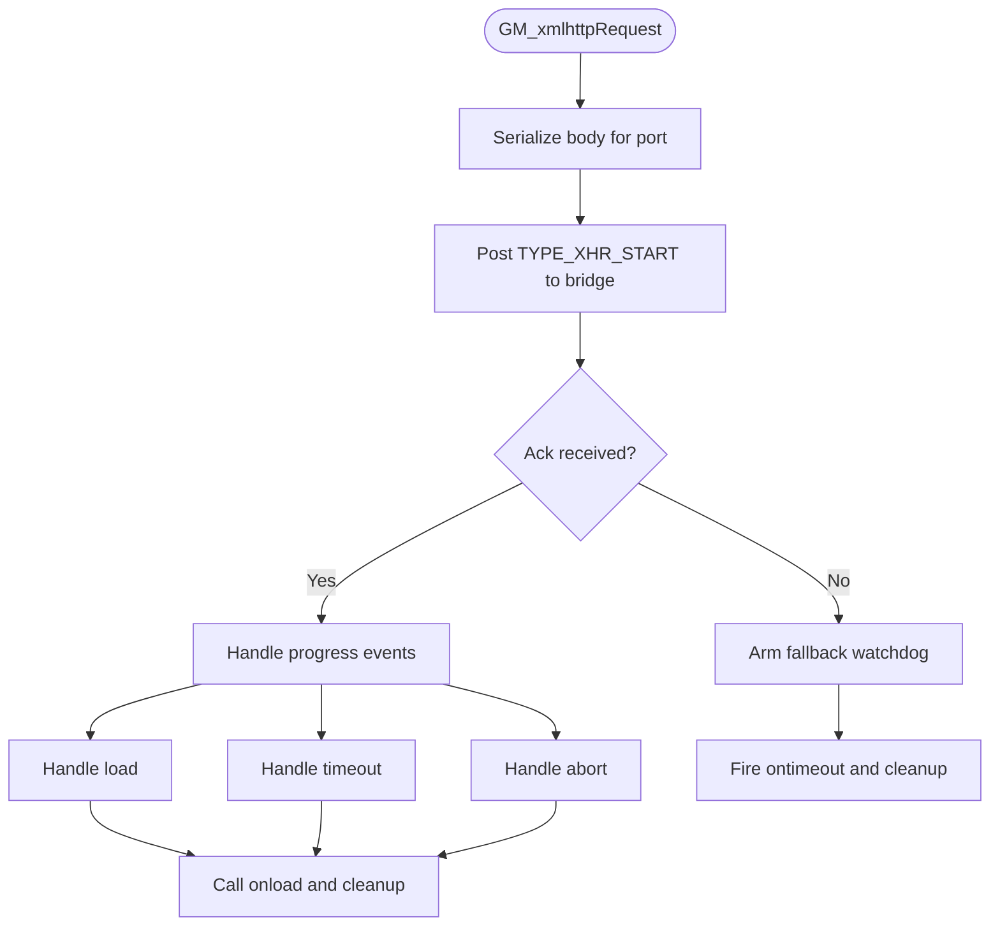
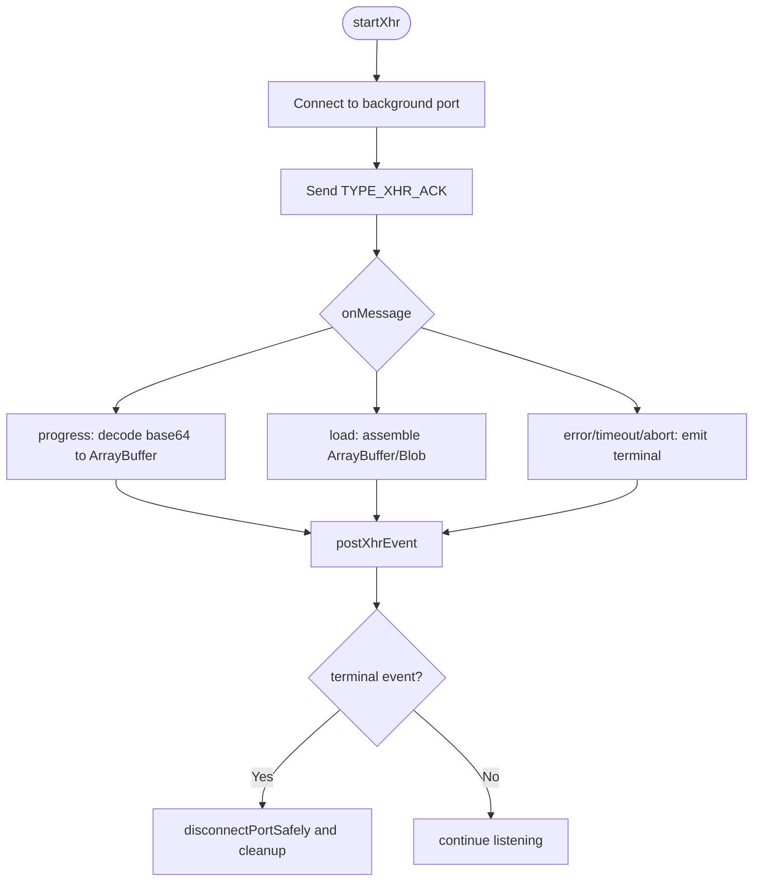
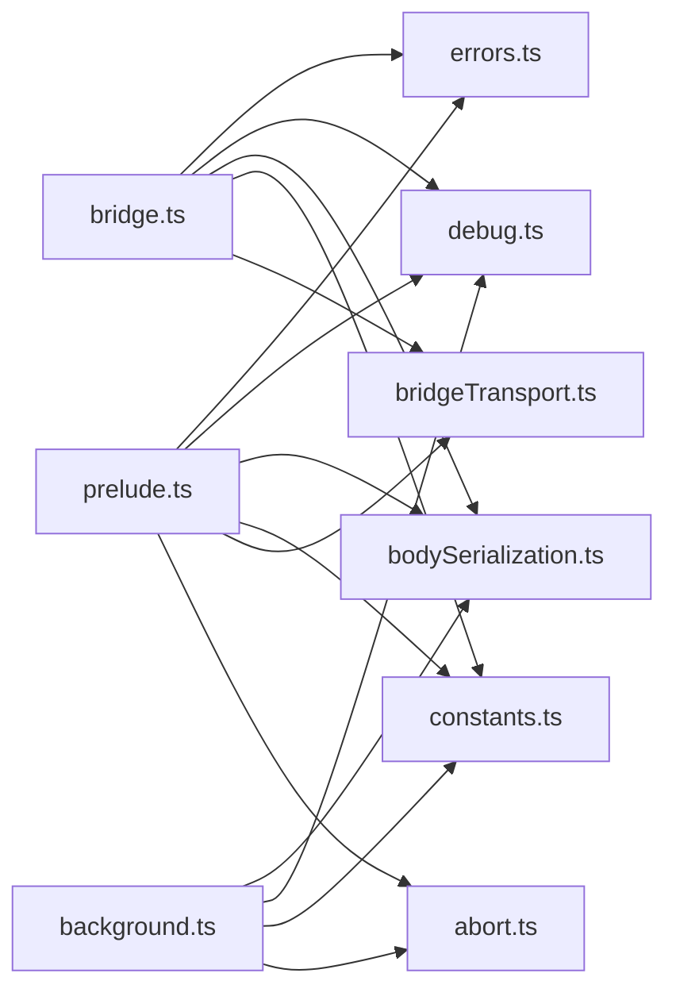

# Error Handling and Recovery

<cite>
**Referenced Files in This Document**
- [prelude.ts](file://src/extension/prelude.ts)
- [bridge.ts](file://src/extension/bridge.ts)
- [bodySerialization.ts](file://src/extension/bodySerialization.ts)
- [errors.ts](file://src/utils/errors.ts)
- [debug.ts](file://src/utils/debug.ts)
- [constants.ts](file://src/extension/constants.ts)
- [bridgeTransport.ts](file://src/extension/bridgeTransport.ts)
- [abort.ts](file://src/utils/abort.ts)
- [background.ts](file://src/extension/background.ts)
</cite>

## Table of Contents
1. [Introduction](#introduction)
2. [Project Structure](#project-structure)
3. [Core Components](#core-components)
4. [Architecture Overview](#architecture-overview)
5. [Detailed Component Analysis](#detailed-component-analysis)
6. [Dependency Analysis](#dependency-analysis)
7. [Performance Considerations](#performance-considerations)
8. [Troubleshooting Guide](#troubleshooting-guide)
9. [Conclusion](#conclusion)

## Introduction
This document explains the error handling and recovery mechanisms for the HTTP request system in the extension. It covers:
- Comprehensive error reporting for request failures, port disconnection issues, and serialization problems
- Fallback strategies for port unavailability, timeouts, and response type resolution failures
- Error message formatting and debugging information collection
- Graceful degradation when critical components fail
- Cleanup procedures for failed requests, resource deallocation, and state recovery
- Examples of common error scenarios, diagnostic techniques, and production recovery strategies

## Project Structure
The HTTP request pipeline spans three layers:
- MAIN-world polyfill that exposes a userscript-like API and manages GM_xmlhttpRequest lifecycle
- ISOLATED-world bridge that validates and forwards requests to the background service worker
- Background service worker that executes the actual fetch, applies DNR header rules, and streams responses

**Diagram sources**
- [prelude.ts](file://src/extension/prelude.ts)
- [bridge.ts](file://src/extension/bridge.ts)
- [background.ts](file://src/extension/background.ts)
- [bodySerialization.ts](file://src/extension/bodySerialization.ts)
- [errors.ts](file://src/utils/errors.ts)
- [debug.ts](file://src/utils/debug.ts)
- [constants.ts](file://src/extension/constants.ts)
- [bridgeTransport.ts](file://src/extension/bridgeTransport.ts)
- [abort.ts](file://src/utils/abort.ts)

**Section sources**
- [prelude.ts](file://src/extension/prelude.ts)
- [bridge.ts](file://src/extension/bridge.ts)
- [background.ts](file://src/extension/background.ts)
- [bodySerialization.ts](file://src/extension/bodySerialization.ts)
- [errors.ts](file://src/utils/errors.ts)
- [debug.ts](file://src/utils/debug.ts)
- [constants.ts](file://src/extension/constants.ts)
- [bridgeTransport.ts](file://src/extension/bridgeTransport.ts)
- [abort.ts](file://src/utils/abort.ts)

## Core Components
- GM_xmlhttpRequest polyfill and promise adapter in MAIN world
- Bridge port lifecycle, acknowledgment, and fallback watchdog
- Binary response assembly and response type resolution
- Serialization and coercion of request bodies across worlds
- Error message formatting and AbortSignal helpers
- Background fetch orchestration and DNR header injection

Key responsibilities:
- Pre-validate and serialize request bodies to prevent structured cloning failures
- Arm a fallback watchdog to detect stalled bridges and trigger timeout callbacks
- Detect port disconnections and emit terminal error events
- Assemble binary responses from base64 chunks and typed arrays
- Normalize and strip headers for specific hosts (e.g., Yandex) and inject UA client hints
- Provide canonical AbortError instances and timeout signals

**Section sources**
- [prelude.ts](file://src/extension/prelude.ts)
- [bridge.ts](file://src/extension/bridge.ts)
- [bodySerialization.ts](file://src/extension/bodySerialization.ts)
- [errors.ts](file://src/utils/errors.ts)
- [abort.ts](file://src/utils/abort.ts)

## Architecture Overview
The request lifecycle and error handling flow:

**Diagram sources**
- [prelude.ts](file://src/extension/prelude.ts)
- [bridge.ts](file://src/extension/bridge.ts)
- [background.ts](file://src/extension/background.ts)

## Detailed Component Analysis

### GM_xmlhttpRequest Polyfill and Promise Adapter (MAIN world)
Responsibilities:
- Wrap callbacks to ensure settlement semantics and prevent multiple resolutions
- Serialize request bodies before crossing worlds to avoid structured cloning issues
- Post TYPE_XHR_START to the bridge and track per-request callback state
- Arm a fallback watchdog to detect stalled bridges and trigger timeout callbacks
- Finalize requests by invoking appropriate callbacks and cleaning up state

Key behaviors:
- Settlement handlers call original callbacks and resolve/reject promises once
- Watchdog uses a grace period to avoid premature timeouts
- On fatal errors, emits terminal error payloads with standardized fields

**Diagram sources**
- [prelude.ts](file://src/extension/prelude.ts)

**Section sources**
- [prelude.ts](file://src/extension/prelude.ts)

### Bridge Port Management and Fallback Watchdog
Responsibilities:
- Establish and manage a persistent port to the background service worker
- Validate and normalize headers, especially for specific hosts
- Assemble binary responses from base64 chunks and typed arrays
- Detect port disconnections and emit terminal error events
- Clean up resources and settle ports on terminal events

Key behaviors:
- Acknowledgment arms a watchdog timer with a grace period
- Disconnections trigger a terminal error event with a descriptive message
- Binary responses are reconstructed from chunks or base64 fallback

**Diagram sources**
- [bridge.ts](file://src/extension/bridge.ts)

**Section sources**
- [bridge.ts](file://src/extension/bridge.ts)

### Background Fetch Orchestration and DNR Header Injection
Responsibilities:
- Execute the actual fetch with proper credentials and caching options
- Apply declarativeNetRequest session rules to inject headers that cannot be set via fetch
- Stream progress and final responses back to the bridge
- Respect AbortSignals and enforce timeouts

Key behaviors:
- Respects anonymous/withCredentials flags and cache directives
- Applies DNR rules for specific hosts to ensure UA client hints are preserved
- Emits progress events for binary chunks and final load/error/timeout/abort events

**Section sources**
- [background.ts](file://src/extension/background.ts)

### Body Serialization and Coercion Across Worlds
Responsibilities:
- Detect and serialize ArrayBuffer, TypedArray, Blob, and File-like bodies
- Coerce cross-world wrappers into recoverable byte sequences
- Summarize bodies for debugging without leaking sensitive data
- Decode serialized bodies back into fetch/XHR-compatible forms

Key behaviors:
- Uses base64 encoding for binary payloads transported via JSON
- Attempts multiple recovery strategies for cross-compartment objects
- Provides safe debug summaries with limits on key counts and sizes

**Section sources**
- [bodySerialization.ts](file://src/extension/bodySerialization.ts)

### Error Message Formatting and Abort Helpers
Responsibilities:
- Provide a unified error-to-string conversion that extracts meaningful messages
- Normalize AbortError instances and signals for consistent handling
- Create timeout signals that integrate with external AbortSignals

Key behaviors:
- Extracts nested message fields from error objects
- Falls back to serialized object representation or constructor names
- Ensures AbortError semantics across runtimes

**Section sources**
- [errors.ts](file://src/utils/errors.ts)
- [abort.ts](file://src/utils/abort.ts)

### Debugging Information Collection
Responsibilities:
- Conditional logging that can be toggled off in production builds
- Structured debug payloads for request lifecycle events
- Warnings and errors for exceptional conditions

Key behaviors:
- Logs acknowledgments, progress, and terminal events with status and timing
- Emits warnings for suspicious serialized bodies and port disconnections
- Provides context-rich payloads for diagnostics

**Section sources**
- [debug.ts](file://src/utils/debug.ts)
- [prelude.ts](file://src/extension/prelude.ts)
- [bridge.ts](file://src/extension/bridge.ts)

## Dependency Analysis
The following diagram shows the primary dependencies among the error-handling components:

**Diagram sources**
- [prelude.ts](file://src/extension/prelude.ts)
- [bridge.ts](file://src/extension/bridge.ts)
- [background.ts](file://src/extension/background.ts)
- [bodySerialization.ts](file://src/extension/bodySerialization.ts)
- [errors.ts](file://src/utils/errors.ts)
- [debug.ts](file://src/utils/debug.ts)
- [constants.ts](file://src/extension/constants.ts)
- [bridgeTransport.ts](file://src/extension/bridgeTransport.ts)
- [abort.ts](file://src/utils/abort.ts)

**Section sources**
- [prelude.ts](file://src/extension/prelude.ts)
- [bridge.ts](file://src/extension/bridge.ts)
- [background.ts](file://src/extension/background.ts)
- [bodySerialization.ts](file://src/extension/bodySerialization.ts)
- [errors.ts](file://src/utils/errors.ts)
- [debug.ts](file://src/utils/debug.ts)
- [constants.ts](file://src/extension/constants.ts)
- [bridgeTransport.ts](file://src/extension/bridgeTransport.ts)
- [abort.ts](file://src/utils/abort.ts)

## Performance Considerations
- Binary transfer optimization: Transferables are used to move ArrayBuffers efficiently between worlds
- Chunked assembly: Large binary responses are assembled incrementally to reduce memory pressure
- Header normalization: UA client hints are cached and injected via DNR to minimize repeated work
- Watchdog grace period: Prevents premature timeouts during slow network conditions

[No sources needed since this section provides general guidance]

## Troubleshooting Guide

Common error scenarios and recovery strategies:
- Port unavailability or disconnection
  - Symptom: Terminal error event indicating bridge port disconnected
  - Recovery: Retry the request; the bridge replaces active requests and aborts previous ones
  - Diagnostic: Inspect acknowledgment and last bridge event timestamps
  - Section sources
    - [bridge.ts](file://src/extension/bridge.ts)
    - [prelude.ts](file://src/extension/prelude.ts)

- Timeout handling
  - Symptom: ontimeout callback invoked after fallback watchdog fires
  - Recovery: Increase timeout, retry with exponential backoff, or switch to a different endpoint
  - Diagnostic: Check watchdog grace period and last bridge event timestamps
  - Section sources
    - [prelude.ts](file://src/extension/prelude.ts)

- Response type resolution failures
  - Symptom: Binary response not delivered as ArrayBuffer or Blob
  - Recovery: Ensure responseType is set appropriately; the bridge reconstructs binary from chunks or base64 fallback
  - Diagnostic: Verify direct response, chunk aggregation, and fallback base64 presence
  - Section sources
    - [bridge.ts](file://src/extension/bridge.ts)

- Serialization problems for request bodies
  - Symptom: Bodies degrade to opaque objects or strings during cross-world transport
  - Recovery: Use the provided serialization helpers; they attempt multiple recovery strategies
  - Diagnostic: Review debug summaries for body kinds and lengths
  - Section sources
    - [bodySerialization.ts](file://src/extension/bodySerialization.ts)
    - [prelude.ts](file://src/extension/prelude.ts)

- Host-specific header issues (e.g., Yandex)
  - Symptom: Requests rejected due to missing or incorrect headers
  - Recovery: Allow the bridge to strip forbidden headers and inject UA client hints via DNR
  - Diagnostic: Confirm header normalization and DNR rule updates
  - Section sources
    - [bridge.ts](file://src/extension/bridge.ts)

- Abort handling
  - Symptom: Requests cancelled unexpectedly
  - Recovery: Use AbortSignal helpers to coordinate cancellations; ensure canonical AbortError semantics
  - Diagnostic: Check AbortError detection and timeout signal integration
  - Section sources
    - [abort.ts](file://src/utils/abort.ts)
    - [errors.ts](file://src/utils/errors.ts)

Cleanup and resource deallocation:
- Port cleanup: Disconnect ports and remove them from active maps on terminal events
- Callback cleanup: Clear timeout IDs and remove callback state after invocation
- Binary assembly: Reset chunk buffers and byte counters after assembling responses
- Watchdog cleanup: Clear timers when acknowledged or settled

**Section sources**
- [bridge.ts](file://src/extension/bridge.ts)
- [prelude.ts](file://src/extension/prelude.ts)
- [bodySerialization.ts](file://src/extension/bodySerialization.ts)

## Conclusion
The HTTP request system employs layered error handling and recovery:
- The MAIN-world polyfill ensures robust callback settlement and fallback timeouts
- The bridge manages port lifecycles, binary assembly, and host-specific header normalization
- The background service worker executes fetch requests and streams responses with DNR header injection
- Utilities provide consistent error formatting, AbortSignal helpers, and conditional debugging

Together, these components deliver a resilient pipeline capable of diagnosing and recovering from port disconnections, timeouts, serialization issues, and response type mismatches, with careful cleanup and graceful degradation.