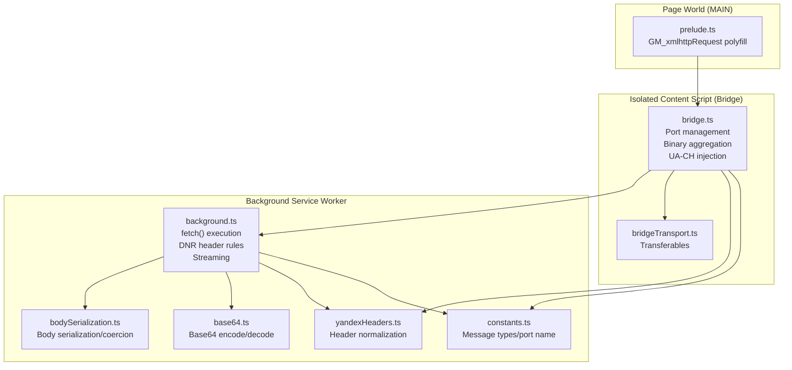
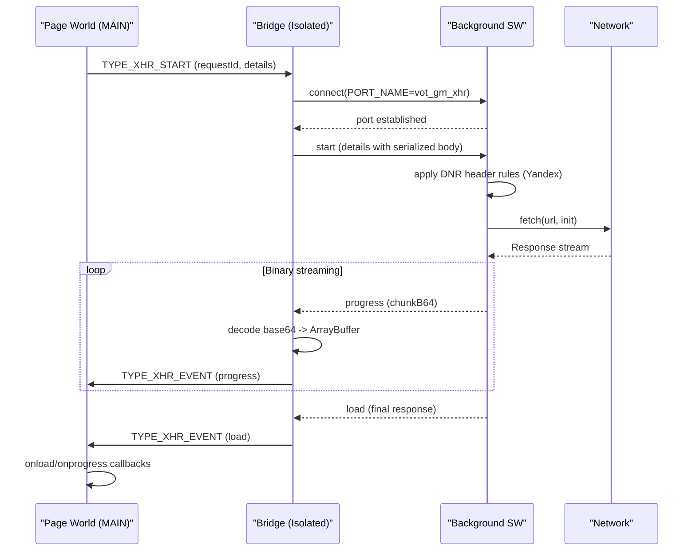
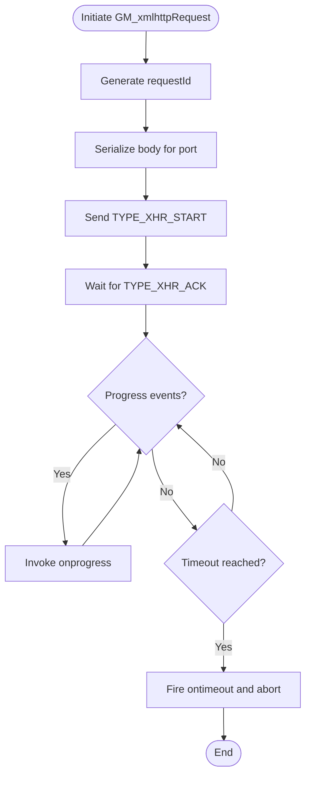
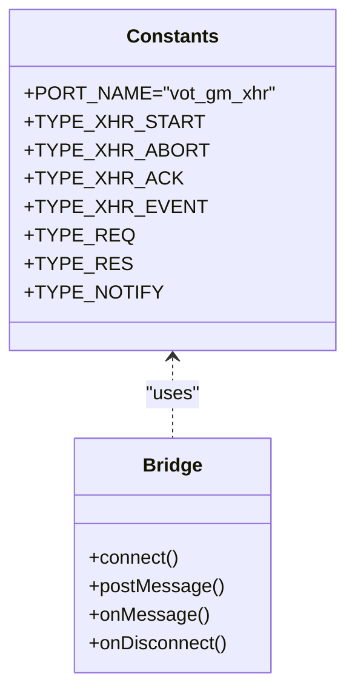
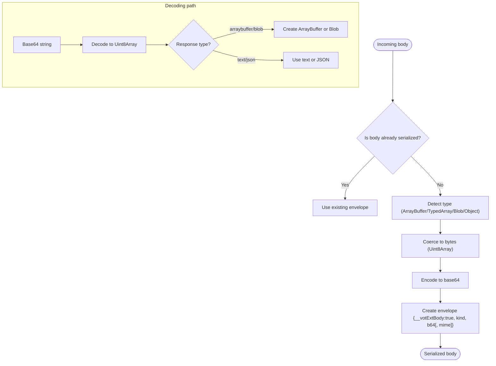
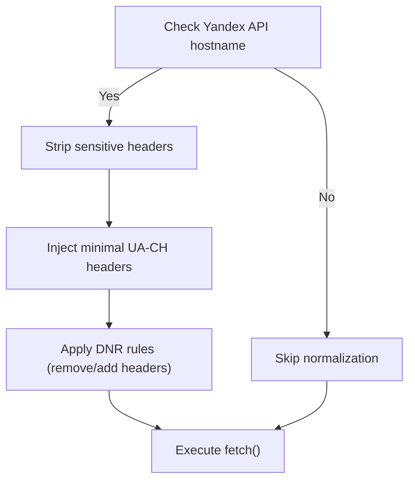
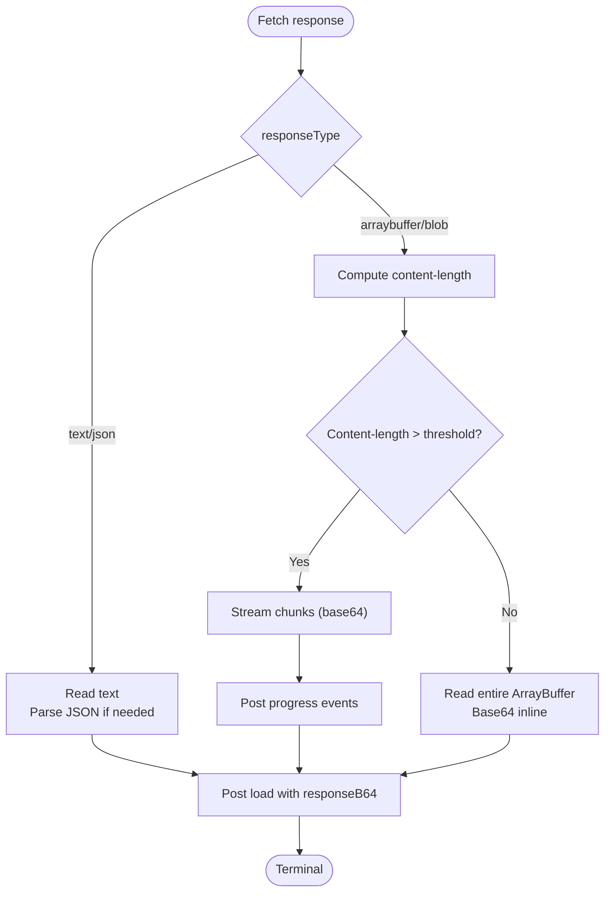
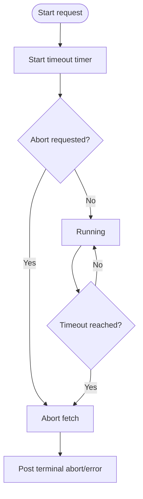
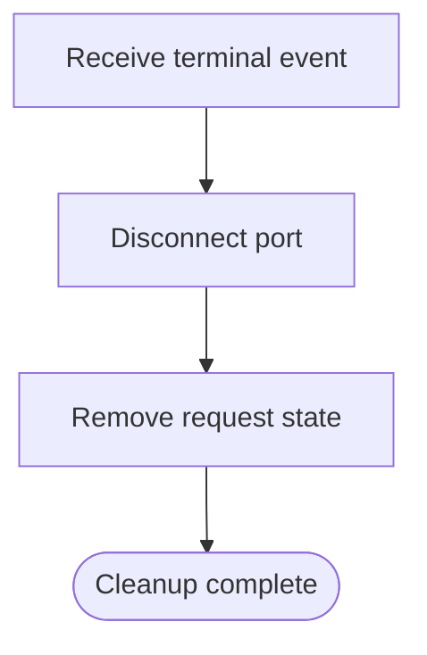
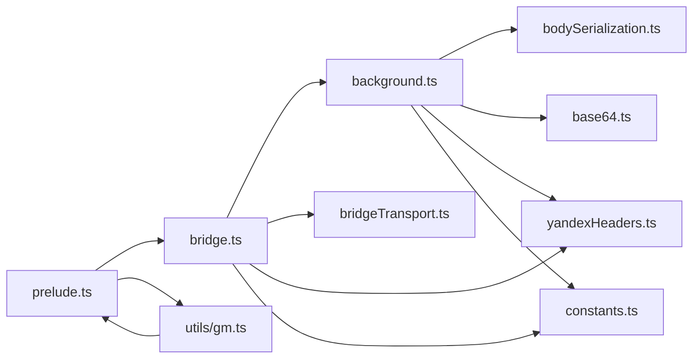

# HTTP Request Handling

<cite>
**Referenced Files in This Document**
- [background.ts](file://src/extension/background.ts)
- [bridge.ts](file://src/extension/bridge.ts)
- [prelude.ts](file://src/extension/prelude.ts)
- [bodySerialization.ts](file://src/extension/bodySerialization.ts)
- [base64.ts](file://src/extension/base64.ts)
- [bridgeTransport.ts](file://src/extension/bridgeTransport.ts)
- [yandexHeaders.ts](file://src/extension/yandexHeaders.ts)
- [constants.ts](file://src/extension/constants.ts)
- [gm.ts](file://src/utils/gm.ts)
- [gm.ts](file://src/types/utils/gm.ts)
</cite>

## Table of Contents
1. [Introduction](#introduction)
2. [Project Structure](#project-structure)
3. [Core Components](#core-components)
4. [Architecture Overview](#architecture-overview)
5. [Detailed Component Analysis](#detailed-component-analysis)
6. [Dependency Analysis](#dependency-analysis)
7. [Performance Considerations](#performance-considerations)
8. [Troubleshooting Guide](#troubleshooting-guide)
9. [Conclusion](#conclusion)

## Introduction
This document explains the HTTP request handling system that proxies GM_xmlhttpRequest operations through the extension's background service worker. It covers the complete request lifecycle from initiation in the page world to completion in the content script, including port establishment, progress tracking, response processing, binary data handling with base64 encoding, chunk aggregation, Yandex API header normalization, timeout handling, error propagation, and terminal event cleanup.

## Project Structure
The HTTP request handling spans three execution contexts:
- Page world (MAIN): Provides GM_xmlhttpRequest polyfills and manages callbacks/promises.
- Isolated content script (bridge): Bridges to the background service worker and manages binary aggregation and UA-CH header injection for Yandex.
- Background service worker: Executes fetch(), streams binary responses, applies DNR header rules, and posts terminal events.

**Diagram sources**
- [prelude.ts:1-641](file://src/extension/prelude.ts#L1-L641)
- [bridge.ts:1-699](file://src/extension/bridge.ts#L1-L699)
- [background.ts:1-1086](file://src/extension/background.ts#L1-L1086)
- [bodySerialization.ts:1-570](file://src/extension/bodySerialization.ts#L1-L570)
- [base64.ts:1-128](file://src/extension/base64.ts#L1-L128)
- [bridgeTransport.ts:1-46](file://src/extension/bridgeTransport.ts#L1-L46)
- [yandexHeaders.ts:1-56](file://src/extension/yandexHeaders.ts#L1-L56)
- [constants.ts:1-102](file://src/extension/constants.ts#L1-L102)

**Section sources**
- [prelude.ts:1-641](file://src/extension/prelude.ts#L1-L641)
- [bridge.ts:1-699](file://src/extension/bridge.ts#L1-L699)
- [background.ts:1-1086](file://src/extension/background.ts#L1-L1086)
- [constants.ts:1-102](file://src/extension/constants.ts#L1-L102)

## Core Components
- Precedence and polyfills: The page world installs GM_xmlhttpRequest and GM4 promise APIs, serializes bodies, and forwards requests to the bridge.
- Bridge: Manages extension messaging ports, normalizes headers for Yandex, injects UA-CH headers, aggregates binary chunks, and posts events to the page.
- Background: Executes fetch(), applies DNR header rules for Yandex endpoints, streams binary responses, and posts terminal events.
- Serialization and base64: Converts binary bodies to base64 for transport and decodes them back into ArrayBuffers or Blobs.
- Transport: Uses Transferable objects to move ArrayBuffer chunks efficiently across message boundaries.

**Section sources**
- [prelude.ts:288-380](file://src/extension/prelude.ts#L288-L380)
- [bridge.ts:335-561](file://src/extension/bridge.ts#L335-L561)
- [background.ts:535-925](file://src/extension/background.ts#L535-L925)
- [bodySerialization.ts:466-570](file://src/extension/bodySerialization.ts#L466-L570)
- [base64.ts:110-128](file://src/extension/base64.ts#L110-L128)
- [bridgeTransport.ts:9-25](file://src/extension/bridgeTransport.ts#L9-L25)

## Architecture Overview
The system routes GM_xmlhttpRequest through a structured pipeline:
- Page world creates a request ID, serializes the body, and sends TYPE_XHR_START to the bridge.
- Bridge establishes a port named "vot_gm_xhr" and forwards the request to the background.
- Background applies DNR rules for Yandex endpoints, executes fetch(), streams binary responses, and posts progress and terminal events.
- Bridge aggregates binary chunks, converts them to ArrayBuffer or Blob, and posts events to the page.
- Page world invokes callbacks and resolves/rejects promises based on terminal events.

**Diagram sources**
- [prelude.ts:309-380](file://src/extension/prelude.ts#L309-L380)
- [bridge.ts:335-468](file://src/extension/bridge.ts#L335-L468)
- [background.ts:535-925](file://src/extension/background.ts#L535-L925)

## Detailed Component Analysis

### Request Initiation (Page World)
- Creates a unique request ID and stores callback state.
- Serializes the request body using bridge serialization helpers to prevent cross-world degradation.
- Sends TYPE_XHR_START with method, URL, headers, serialized data, timeout, responseType, and credentials flags.
- Arms a fallback watchdog timer to trigger timeout callbacks if no progress arrives within timeout + grace period.

**Diagram sources**
- [prelude.ts:309-380](file://src/extension/prelude.ts#L309-L380)
- [prelude.ts:167-211](file://src/extension/prelude.ts#L167-L211)
- [prelude.ts:506-523](file://src/extension/prelude.ts#L506-L523)
- [prelude.ts:576-611](file://src/extension/prelude.ts#L576-L611)

**Section sources**
- [prelude.ts:309-380](file://src/extension/prelude.ts#L309-L380)
- [prelude.ts:167-211](file://src/extension/prelude.ts#L167-L211)
- [prelude.ts:506-523](file://src/extension/prelude.ts#L506-L523)
- [prelude.ts:576-611](file://src/extension/prelude.ts#L576-L611)

### Port Establishment and Message Types
- Bridge connects to the background using a fixed port name "vot_gm_xhr".
- Defines message types for REQ/RES, NOTIFY, XHR_START, XHR_ABORT, XHR_ACK, and XHR_EVENT.
- Uses a marker to distinguish bridge messages from unrelated postMessage traffic.

**Diagram sources**
- [constants.ts:26-102](file://src/extension/constants.ts#L26-L102)
- [bridge.ts:365-380](file://src/extension/bridge.ts#L365-L380)

**Section sources**
- [constants.ts:26-102](file://src/extension/constants.ts#L26-L102)
- [bridge.ts:365-380](file://src/extension/bridge.ts#L365-L380)

### Binary Data Handling and Base64 Encoding
- Bodies can be strings, ArrayBuffer, TypedArray, Blob, or JSON-serializable objects.
- Serialized envelopes carry base64-encoded bytes and optional MIME type for Blobs.
- Decoding converts base64 to Uint8Array, then to ArrayBuffer or Blob as needed.
- For large binary responses, the background streams chunks as base64; the bridge decodes and aggregates them into a single ArrayBuffer.

**Diagram sources**
- [bodySerialization.ts:466-570](file://src/extension/bodySerialization.ts#L466-L570)
- [base64.ts:110-128](file://src/extension/base64.ts#L110-L128)
- [bridge.ts:412-455](file://src/extension/bridge.ts#L412-L455)

**Section sources**
- [bodySerialization.ts:12-570](file://src/extension/bodySerialization.ts#L12-L570)
- [base64.ts:110-128](file://src/extension/base64.ts#L110-L128)
- [bridge.ts:412-455](file://src/extension/bridge.ts#L412-L455)

### Yandex API Header Normalization
- For Yandex API hosts, the bridge strips sensitive headers and injects minimal UA-CH headers required by the known-good capture.
- The background applies declarativeNetRequest (DNR) rules to remove Origin/Referer and suppress extra UA-CH headers, then sets only allowed headers.
- This ensures endpoints like video translation requests validate the request as originating from a real Chromium tab.

**Diagram sources**
- [bridge.ts:489-503](file://src/extension/bridge.ts#L489-L503)
- [yandexHeaders.ts:21-55](file://src/extension/yandexHeaders.ts#L21-L55)
- [background.ts:193-262](file://src/extension/background.ts#L193-L262)

**Section sources**
- [bridge.ts:489-503](file://src/extension/bridge.ts#L489-L503)
- [yandexHeaders.ts:21-55](file://src/extension/yandexHeaders.ts#L21-L55)
- [background.ts:193-262](file://src/extension/background.ts#L193-L262)

### Response Processing and Streaming
- The background determines responseType and processes responses accordingly:
  - text/json: reads text and parses JSON when needed.
  - arraybuffer/blob/stream: streams binary via a reader; small responses fit inline as base64; large responses stream chunks.
- Progress events include loaded/total and lengthComputable for progress tracking.
- Terminal events include load/error/timeout/abort with final status and response metadata.

**Diagram sources**
- [background.ts:786-870](file://src/extension/background.ts#L786-L870)
- [background.ts:802-834](file://src/extension/background.ts#L802-L834)

**Section sources**
- [background.ts:786-870](file://src/extension/background.ts#L786-L870)
- [background.ts:802-834](file://src/extension/background.ts#L802-L834)

### Timeout Handling and Error Propagation
- The background sets an AbortController and a timeout timer; on timeout, it aborts the fetch.
- The bridge maintains a fallback watchdog that triggers ontimeout if no progress arrives within timeout + grace period.
- Errors propagate as terminal error events with error messages; aborts are distinguished by AbortError or explicit abort/timeout signals.

**Diagram sources**
- [background.ts:603-615](file://src/extension/background.ts#L603-L615)
- [background.ts:871-923](file://src/extension/background.ts#L871-L923)
- [prelude.ts:167-211](file://src/extension/prelude.ts#L167-L211)

**Section sources**
- [background.ts:603-615](file://src/extension/background.ts#L603-L615)
- [background.ts:871-923](file://src/extension/background.ts#L871-L923)
- [prelude.ts:167-211](file://src/extension/prelude.ts#L167-L211)

### Terminal Event Cleanup
- After terminal events (load/error/timeout/abort), the bridge disconnects the port and removes the request state.
- The background cleans up timers and ensures no lingering resources remain.

**Diagram sources**
- [bridge.ts:459-467](file://src/extension/bridge.ts#L459-L467)
- [background.ts:516-521](file://src/extension/background.ts#L516-L521)

**Section sources**
- [bridge.ts:459-467](file://src/extension/bridge.ts#L459-L467)
- [background.ts:516-521](file://src/extension/background.ts#L516-L521)

## Dependency Analysis
The following diagram shows key dependencies among modules involved in HTTP request handling:

**Diagram sources**
- [prelude.ts:1-641](file://src/extension/prelude.ts#L1-L641)
- [bridge.ts:1-699](file://src/extension/bridge.ts#L1-L699)
- [background.ts:1-1086](file://src/extension/background.ts#L1-L1086)
- [bodySerialization.ts:1-570](file://src/extension/bodySerialization.ts#L1-L570)
- [base64.ts:1-128](file://src/extension/base64.ts#L1-L128)
- [bridgeTransport.ts:1-46](file://src/extension/bridgeTransport.ts#L1-L46)
- [yandexHeaders.ts:1-56](file://src/extension/yandexHeaders.ts#L1-L56)
- [constants.ts:1-102](file://src/extension/constants.ts#L1-L102)
- [gm.ts:1-248](file://src/utils/gm.ts#L1-L248)

**Section sources**
- [prelude.ts:1-641](file://src/extension/prelude.ts#L1-L641)
- [bridge.ts:1-699](file://src/extension/bridge.ts#L1-L699)
- [background.ts:1-1086](file://src/extension/background.ts#L1-L1086)
- [bodySerialization.ts:1-570](file://src/extension/bodySerialization.ts#L1-L570)
- [base64.ts:1-128](file://src/extension/base64.ts#L1-L128)
- [bridgeTransport.ts:1-46](file://src/extension/bridgeTransport.ts#L1-L46)
- [yandexHeaders.ts:1-56](file://src/extension/yandexHeaders.ts#L1-L56)
- [constants.ts:1-102](file://src/extension/constants.ts#L1-L102)
- [gm.ts:1-248](file://src/utils/gm.ts#L1-L248)

## Performance Considerations
- Binary streaming threshold: Responses larger than a configured threshold are streamed as chunks to avoid large base64 payloads in extension messaging.
- Transferables: The bridge transport marks and extracts Transferable objects to minimize copies when posting progress chunks and final responses.
- UA-CH caching: The bridge caches minimal UA-CH headers for a short TTL to reduce repeated high-entropy queries.
- DNR rule batching: The background queues DNR rule updates to avoid race conditions and redundant updates.

[No sources needed since this section provides general guidance]

## Troubleshooting Guide
Common issues and diagnostics:
- Port disconnect before terminal event: The bridge logs and posts an error event; verify the page script did not unload prematurely.
- Timeout without progress: The fallback watchdog fires ontimeout; increase timeout or check network connectivity.
- Aborted requests: Verify abort calls and ensure no race with early termination.
- Binary response mismatch: Confirm responseType matches expected type; arraybuffer yields ArrayBuffer, blob yields Blob, text/json yields strings or parsed objects.
- Yandex API failures: Ensure UA-CH headers are injected and forbidden headers are removed via DNR rules.

**Section sources**
- [bridge.ts:470-485](file://src/extension/bridge.ts#L470-L485)
- [prelude.ts:167-211](file://src/extension/prelude.ts#L167-L211)
- [background.ts:871-923](file://src/extension/background.ts#L871-L923)

## Conclusion
The HTTP request handling system provides a robust, cross-world bridge for GM_xmlhttpRequest. It serializes bodies safely, normalizes headers for Yandex endpoints, streams binary responses efficiently, and propagates progress and terminal events reliably. The design balances compatibility with userscript managers and the constraints of MV3 extension architecture.