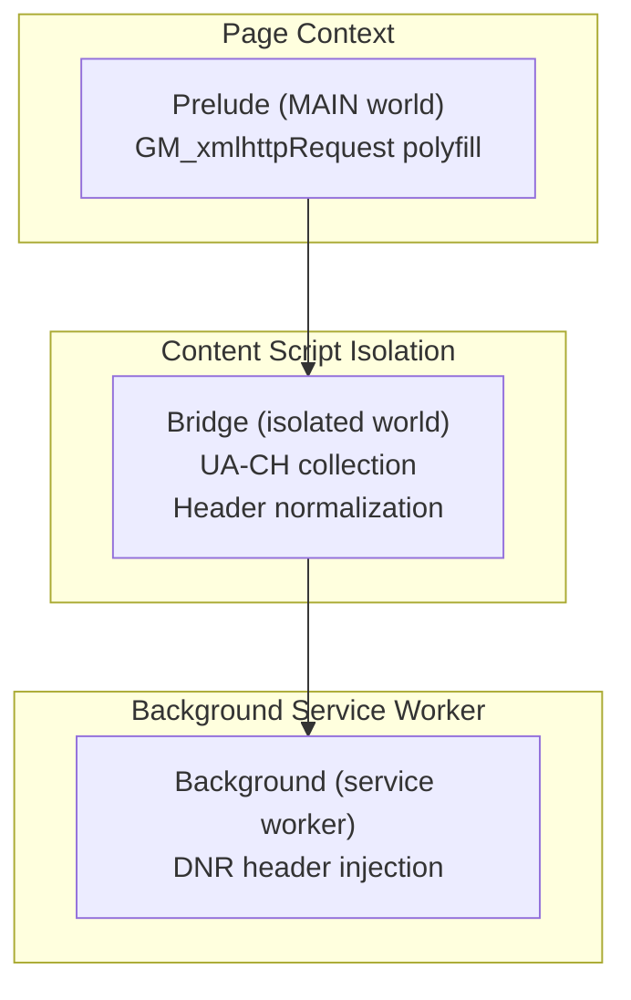
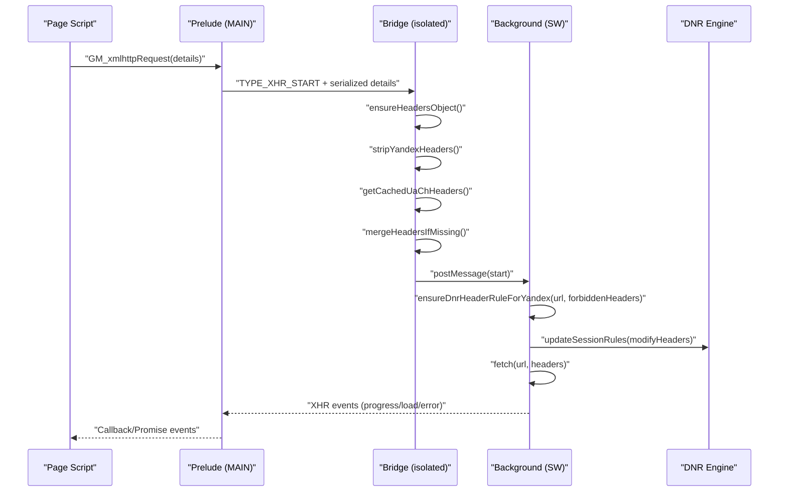
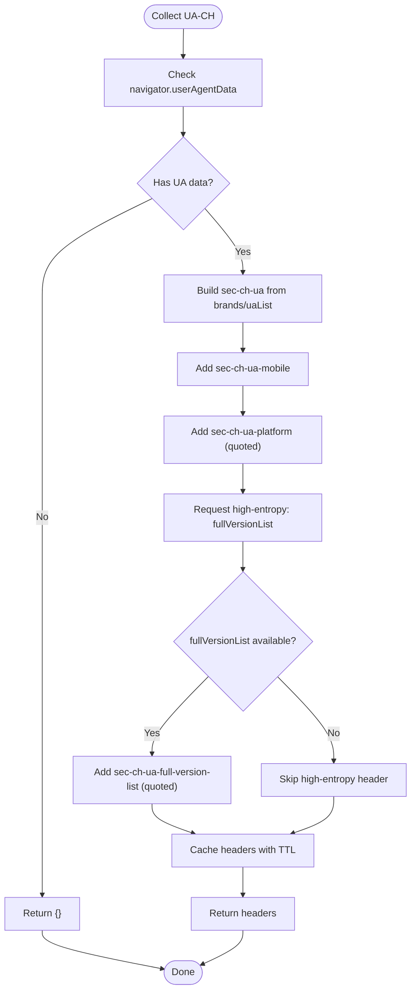
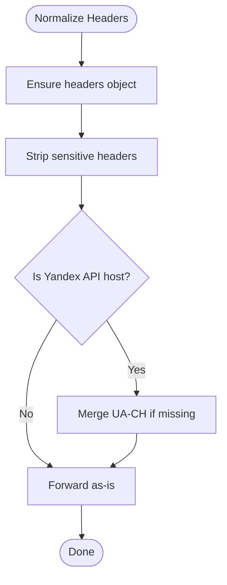
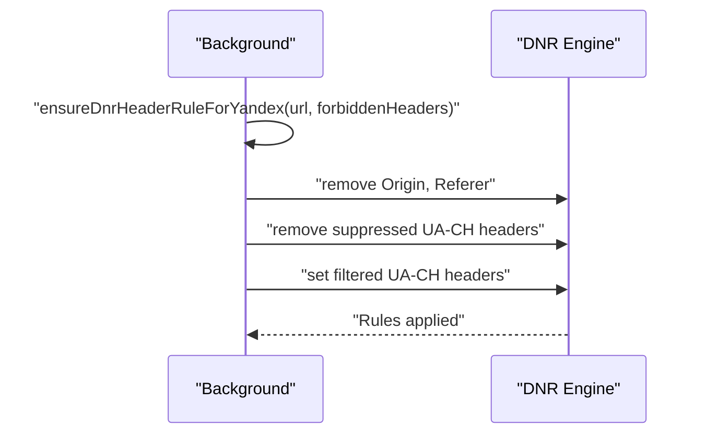
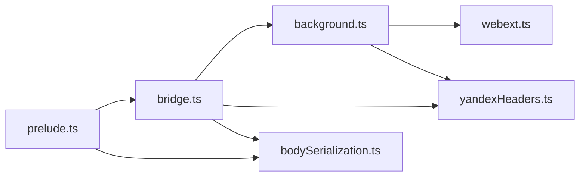

# Header Normalization

<cite>
**Referenced Files in This Document**
- [yandexHeaders.ts](file://src/extension/yandexHeaders.ts)
- [bridge.ts](file://src/extension/bridge.ts)
- [background.ts](file://src/extension/background.ts)
- [webext.ts](file://src/extension/webext.ts)
- [prelude.ts](file://src/extension/prelude.ts)
- [bodySerialization.ts](file://src/extension/bodySerialization.ts)
- [headers.json](file://src/headers.json)
</cite>

## Table of Contents
1. [Introduction](#introduction)
2. [Project Structure](#project-structure)
3. [Core Components](#core-components)
4. [Architecture Overview](#architecture-overview)
5. [Detailed Component Analysis](#detailed-component-analysis)
6. [Dependency Analysis](#dependency-analysis)
7. [Performance Considerations](#performance-considerations)
8. [Troubleshooting Guide](#troubleshooting-guide)
9. [Conclusion](#conclusion)

## Introduction
This document describes the HTTP header normalization system designed to make Yandex API requests appear legitimate to target servers. It covers:
- Collection of User-Agent Client Hints (UA-CH) in the content script context
- Brand/version formatting and high-entropy value extraction
- Stripping of sensitive headers before forwarding to the background service worker
- Merging logic that adds required headers back
- Caching strategy for UA-CH headers with TTL expiration
- Escape sequence handling for header values
- Integration with declarativeNetRequest (DNR) for proper header injection
- Examples of header transformations for different API endpoints
- Debugging techniques for header-related issues

## Project Structure
The header normalization spans three layers:
- Content script (MAIN world) polyfills and bridges requests to the extension
- Isolated content script bridge that collects UA-CH and normalizes headers
- Background service worker that applies DNR rules to inject headers

**Diagram sources**
- [prelude.ts:309-379](file://src/extension/prelude.ts#L309-L379)
- [bridge.ts:335-561](file://src/extension/bridge.ts#L335-L561)
- [background.ts:535-756](file://src/extension/background.ts#L535-L756)

**Section sources**
- [prelude.ts:309-379](file://src/extension/prelude.ts#L309-L379)
- [bridge.ts:335-561](file://src/extension/bridge.ts#L335-L561)
- [background.ts:535-756](file://src/extension/background.ts#L535-L756)

## Core Components
- UA-CH collection and caching in the bridge
- Header stripping and merging logic
- DNR rule generation and application for Yandex API hosts
- Escape sequence handling for header values
- Body serialization helpers for cross-layer compatibility

**Section sources**
- [bridge.ts:42-168](file://src/extension/bridge.ts#L42-L168)
- [yandexHeaders.ts:3-55](file://src/extension/yandexHeaders.ts#L3-L55)
- [background.ts:193-262](file://src/extension/background.ts#L193-L262)
- [bodySerialization.ts:466-534](file://src/extension/bodySerialization.ts#L466-L534)

## Architecture Overview
The system ensures that requests to Yandex API endpoints include only the minimal set of UA-CH headers required to mimic a real Chromium tab, while removing sensitive headers that cannot be set via fetch/XHR.

**Diagram sources**
- [prelude.ts:333-366](file://src/extension/prelude.ts#L333-L366)
- [bridge.ts:488-503](file://src/extension/bridge.ts#L488-L503)
- [background.ts:639-648](file://src/extension/background.ts#L639-L648)
- [background.ts:221-262](file://src/extension/background.ts#L221-L262)

## Detailed Component Analysis

### UA-CH Collection and Caching
- Collects minimal UA-CH headers required by the valid request capture:
  - sec-ch-ua
  - sec-ch-ua-mobile
  - sec-ch-ua-platform
  - sec-ch-ua-full-version-list (high-entropy)
- Uses a 10-minute TTL cache to avoid repeated high-entropy queries
- Formats brand/version lists with proper quoting and escaping

**Diagram sources**
- [bridge.ts:91-137](file://src/extension/bridge.ts#L91-L137)
- [bridge.ts:145-168](file://src/extension/bridge.ts#L145-L168)

**Section sources**
- [bridge.ts:91-137](file://src/extension/bridge.ts#L91-L137)
- [bridge.ts:145-168](file://src/extension/bridge.ts#L145-L168)

### Header Stripping and Merging Logic
- Strips sensitive headers that cannot be set via fetch/XHR
- Removes Origin and Referer when targeting Yandex API
- Removes suppressed UA-CH headers not part of the minimal capture
- Merges collected UA-CH headers only if missing

**Diagram sources**
- [bridge.ts:170-191](file://src/extension/bridge.ts#L170-L191)
- [bridge.ts:193-199](file://src/extension/bridge.ts#L193-L199)
- [bridge.ts:488-503](file://src/extension/bridge.ts#L488-L503)

**Section sources**
- [bridge.ts:170-191](file://src/extension/bridge.ts#L170-L191)
- [bridge.ts:193-199](file://src/extension/bridge.ts#L193-L199)
- [bridge.ts:488-503](file://src/extension/bridge.ts#L488-L503)

### DNR Integration and Header Injection
- Applies DNR session rules scoped to service-worker initiated requests
- Removes Origin and Referer
- Removes suppressed UA-CH headers
- Sets only the minimal required UA-CH headers back

**Diagram sources**
- [background.ts:193-262](file://src/extension/background.ts#L193-L262)
- [yandexHeaders.ts:42-55](file://src/extension/yandexHeaders.ts#L42-L55)

**Section sources**
- [background.ts:193-262](file://src/extension/background.ts#L193-L262)
- [yandexHeaders.ts:42-55](file://src/extension/yandexHeaders.ts#L42-L55)

### Escape Sequence Handling
- Escapes double quotes in header values to prevent breaking quoted values
- Applied during UA-CH formatting and header value processing

**Section sources**
- [bridge.ts:67-70](file://src/extension/bridge.ts#L67-L70)
- [bridge.ts:72-82](file://src/extension/bridge.ts#L72-L82)

### Body Serialization Compatibility
- Ensures binary bodies (ArrayBuffer, TypedArray, Blob) are safely serialized across layers
- Prevents degradation during cross-world structured cloning

**Section sources**
- [bodySerialization.ts:466-534](file://src/extension/bodySerialization.ts#L466-L534)

## Dependency Analysis
The header normalization system depends on:
- Cross-layer messaging via postMessage and extension ports
- WebExtension APIs for DNR rule updates
- UA client hints API for UA-CH data

**Diagram sources**
- [prelude.ts:55-57](file://src/extension/prelude.ts#L55-L57)
- [bridge.ts:3-24](file://src/extension/bridge.ts#L3-L24)
- [background.ts:12-33](file://src/extension/background.ts#L12-L33)
- [webext.ts:44-46](file://src/extension/webext.ts#L44-L46)

**Section sources**
- [prelude.ts:55-57](file://src/extension/prelude.ts#L55-L57)
- [bridge.ts:3-24](file://src/extension/bridge.ts#L3-L24)
- [background.ts:12-33](file://src/extension/background.ts#L12-L33)
- [webext.ts:44-46](file://src/extension/webext.ts#L44-L46)

## Performance Considerations
- UA-CH caching reduces high-entropy queries to once per 10 minutes
- DNR rule updates are queued and deduplicated by signature comparison
- Binary body serialization avoids unnecessary conversions and preserves transferable objects

## Troubleshooting Guide
Common issues and debugging steps:
- Requests rejected by Yandex API:
  - Verify UA-CH headers are present and minimal
  - Confirm Origin and Referer are removed
  - Check DNR rule application status
- Missing UA-CH data:
  - Ensure UA client hints are available in the environment
  - Check cache TTL and refresh behavior
- Header value corruption:
  - Validate double-quote escaping in formatted brand/version lists
- Cross-layer serialization problems:
  - Inspect body serialization summaries and fallbacks

Debug logging locations:
- Bridge: UA-CH collection and normalization logs
- Background: DNR rule application and fetch dispatch logs
- Prelude: XHR lifecycle and event propagation logs

**Section sources**
- [bridge.ts:497-502](file://src/extension/bridge.ts#L497-L502)
- [background.ts:639-648](file://src/extension/background.ts#L639-L648)
- [prelude.ts:526-574](file://src/extension/prelude.ts#L526-L574)

## Conclusion
The header normalization system provides a robust mechanism to make extension-initiated requests appear legitimate to Yandex API endpoints. By collecting only the required UA-CH hints, stripping sensitive headers, and injecting them via DNR, it maintains compatibility with modern browser security policies while preserving request fidelity.