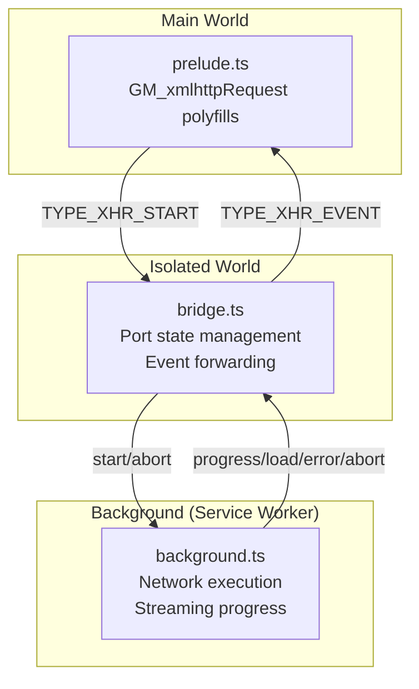
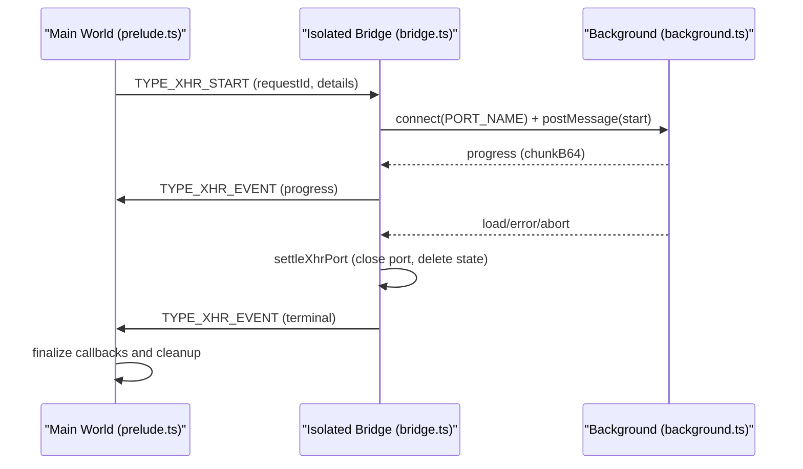
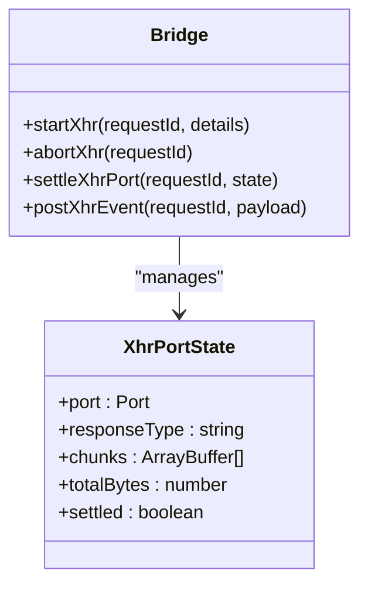
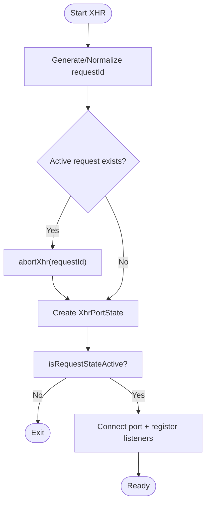
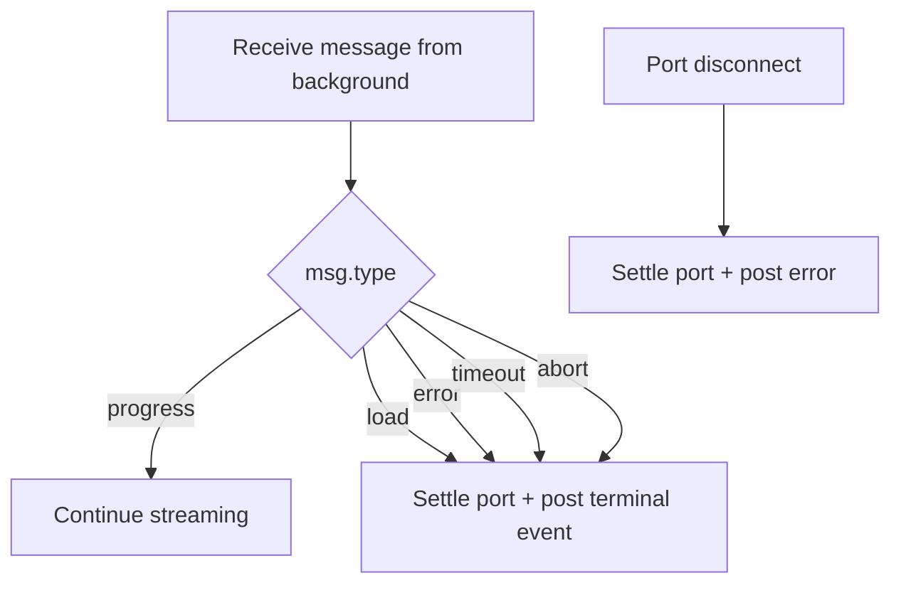
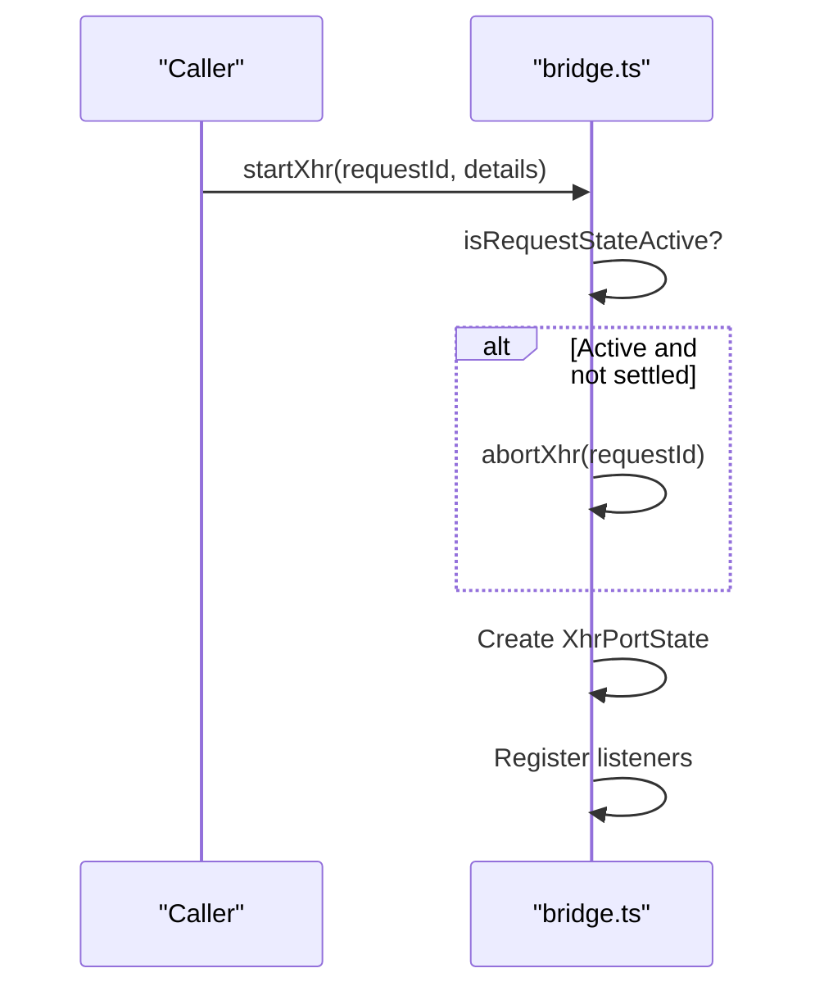
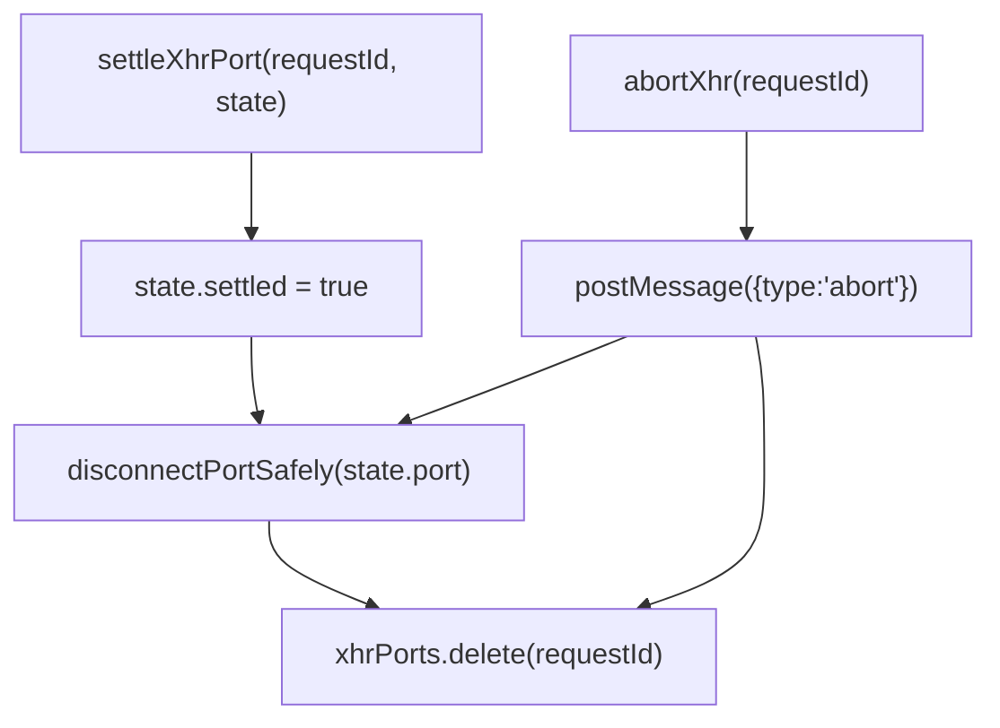
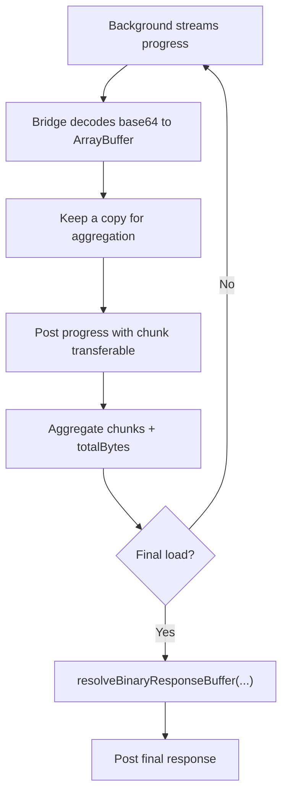
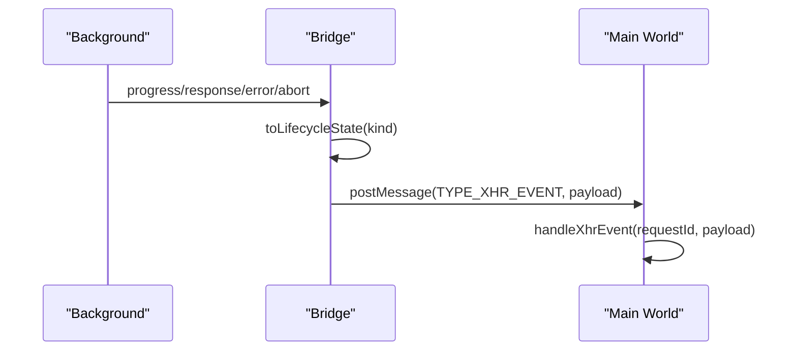
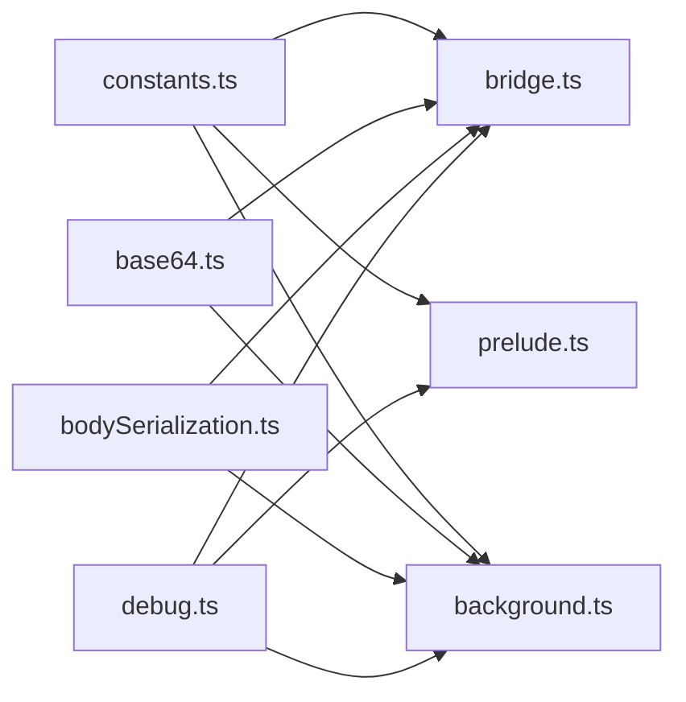

# Request Lifecycle Management

<cite>
**Referenced Files in This Document**
- [bridge.ts](file://src/extension/bridge.ts)
- [prelude.ts](file://src/extension/prelude.ts)
- [background.ts](file://src/extension/background.ts)
- [constants.ts](file://src/extension/constants.ts)
- [bodySerialization.ts](file://src/extension/bodySerialization.ts)
- [base64.ts](file://src/extension/base64.ts)
- [debug.ts](file://src/utils/debug.ts)
</cite>

## Table of Contents
1. [Introduction](#introduction)
2. [Project Structure](#project-structure)
3. [Core Components](#core-components)
4. [Architecture Overview](#architecture-overview)
5. [Detailed Component Analysis](#detailed-component-analysis)
6. [Dependency Analysis](#dependency-analysis)
7. [Performance Considerations](#performance-considerations)
8. [Troubleshooting Guide](#troubleshooting-guide)
9. [Conclusion](#conclusion)

## Introduction
This document describes the HTTP request lifecycle management system that tracks and manages XMLHttpRequest (XHR) requests from initiation to completion. It covers the port state management, request ID mapping, connection lifecycle, terminal event detection, request state validation, port replacement logic, settlement process, progress tracking, chunk accumulation for binary responses, and the event posting system that communicates with the main world. It also includes practical examples for monitoring, debugging lifecycle issues, and handling edge cases such as premature disconnections.

## Project Structure
The lifecycle management spans three layers:
- Main world prelude script that exposes GM_xmlhttpRequest polyfills and orchestrates callbacks.
- Isolated bridge script that validates, serializes, and forwards requests to the background service worker.
- Background service worker that performs the actual network request, streams progress, and posts terminal results.

**Diagram sources**
- [prelude.ts:580-641](file://src/extension/prelude.ts#L580-L641)
- [bridge.ts:335-561](file://src/extension/bridge.ts#L335-L561)
- [background.ts:487-925](file://src/extension/background.ts#L487-L925)

**Section sources**
- [prelude.ts:288-478](file://src/extension/prelude.ts#L288-L478)
- [bridge.ts:28-699](file://src/extension/bridge.ts#L28-L699)
- [background.ts:1-1086](file://src/extension/background.ts#L1-L1086)

## Core Components
- XhrPortState: Tracks a single XHR request’s port connection, response type, binary chunk aggregation, and settlement state.
- Request ID mapping: Unique identifiers generated in the main world and propagated through the bridge and background.
- Port lifecycle: Connects to the background via a named port, listens for messages, and settles on terminal events or disconnects.
- Terminal event detection: Automatically closes ports for load, error, timeout, and abort events.
- Progress tracking: Streams binary chunks as base64 and aggregates them for final assembly.
- Event posting: Bridges messages to the main world with lifecycle state classification.

**Section sources**
- [bridge.ts:237-264](file://src/extension/bridge.ts#L237-L264)
- [bridge.ts:278-288](file://src/extension/bridge.ts#L278-L288)
- [bridge.ts:410-467](file://src/extension/bridge.ts#L410-L467)
- [background.ts:802-845](file://src/extension/background.ts#L802-L845)

## Architecture Overview
The lifecycle follows a strict message flow:
- Main world creates a request and posts TYPE_XHR_START with a unique requestId.
- Bridge validates and starts a port connection to the background.
- Background executes the request, streaming progress and posting terminal results.
- Bridge aggregates binary chunks and posts events to the main world.
- Main world finalizes callbacks and cleans up state.

**Diagram sources**
- [prelude.ts:309-379](file://src/extension/prelude.ts#L309-L379)
- [bridge.ts:335-561](file://src/extension/bridge.ts#L335-L561)
- [background.ts:535-925](file://src/extension/background.ts#L535-L925)

## Detailed Component Analysis

### XhrPortState and Port State Management
XhrPortState encapsulates the runtime state of a single XHR request:
- port: Listener registration for onMessage/onDisconnect and postMessage/disconnect.
- responseType: Normalized response type used to reconstruct binary payloads.
- chunks: Accumulated ArrayBuffer copies for binary responses.
- totalBytes: Running count of aggregated bytes.
- settled: Flag indicating whether the port has been closed and cleaned up.

Port lifecycle:
- Creation: onStartXhr creates a new XhrPortState and registers message/disconnect handlers.
- Active handling: onMessage processes progress and load messages, decodes base64 chunks, and posts events.
- Settlement: Terminal events or disconnect trigger settleXhrPort to mark settled, disconnect the port, and remove from the map.

**Diagram sources**
- [bridge.ts:237-264](file://src/extension/bridge.ts#L237-L264)
- [bridge.ts:335-561](file://src/extension/bridge.ts#L335-L561)

**Section sources**
- [bridge.ts:237-264](file://src/extension/bridge.ts#L237-L264)
- [bridge.ts:335-561](file://src/extension/bridge.ts#L335-L561)

### Request ID Mapping and Request State Validation
- Request IDs are generated in the main world and passed through the bridge to the background.
- Validation ensures the active state is checked before mutating or sending messages.
- Replacing active requests aborts the previous port and starts a new one.

**Diagram sources**
- [bridge.ts:335-350](file://src/extension/bridge.ts#L335-L350)
- [bridge.ts:266-272](file://src/extension/bridge.ts#L266-L272)

**Section sources**
- [bridge.ts:266-272](file://src/extension/bridge.ts#L266-L272)
- [bridge.ts:335-350](file://src/extension/bridge.ts#L335-L350)

### Terminal Event Detection and Automatic Port Closure
- Terminal event types: load, error, timeout, abort.
- On receiving a terminal event, the bridge marks the port settled and closes it.
- Disconnect listener also triggers settlement and posts an error event if the port disconnects before terminal.

**Diagram sources**
- [bridge.ts:409-467](file://src/extension/bridge.ts#L409-L467)
- [bridge.ts:470-485](file://src/extension/bridge.ts#L470-L485)

**Section sources**
- [bridge.ts:409-467](file://src/extension/bridge.ts#L409-L467)
- [bridge.ts:470-485](file://src/extension/bridge.ts#L470-L485)

### Request State Validation and Port Replacement Logic
- isRequestStateActive compares the expected state reference with the stored state and ensures it is not already settled.
- When a new request replaces an existing one, the previous port is aborted, disconnected, and removed from the map.

**Diagram sources**
- [bridge.ts:266-272](file://src/extension/bridge.ts#L266-L272)
- [bridge.ts:345-350](file://src/extension/bridge.ts#L345-L350)
- [bridge.ts:563-578](file://src/extension/bridge.ts#L563-L578)

**Section sources**
- [bridge.ts:266-272](file://src/extension/bridge.ts#L266-L272)
- [bridge.ts:345-350](file://src/extension/bridge.ts#L345-L350)
- [bridge.ts:563-578](file://src/extension/bridge.ts#L563-L578)

### Settlement Process and Resource Cleanup
- settleXhrPort sets settled=true, disconnects the port, and deletes the state from the map.
- abortXhr follows the same cleanup steps and sends an abort message to the background.
- The main world finalizes callbacks and clears timeouts.

**Diagram sources**
- [bridge.ts:260-264](file://src/extension/bridge.ts#L260-L264)
- [bridge.ts:563-578](file://src/extension/bridge.ts#L563-L578)

**Section sources**
- [bridge.ts:260-264](file://src/extension/bridge.ts#L260-L264)
- [bridge.ts:563-578](file://src/extension/bridge.ts#L563-L578)

### Progress Tracking Mechanism and Chunk Accumulation
- Binary responses are streamed as base64-encoded chunks.
- Bridge decodes base64 to ArrayBuffer, keeps a copy for aggregation, and posts the chunk with transferables to the main world.
- resolveBinaryResponseBuffer constructs the final ArrayBuffer from either direct response, accumulated chunks, or base64 fallback.

**Diagram sources**
- [background.ts:802-845](file://src/extension/background.ts#L802-L845)
- [bridge.ts:410-455](file://src/extension/bridge.ts#L410-L455)
- [bridge.ts:317-333](file://src/extension/bridge.ts#L317-L333)

**Section sources**
- [background.ts:802-845](file://src/extension/background.ts#L802-L845)
- [bridge.ts:410-455](file://src/extension/bridge.ts#L410-L455)
- [bridge.ts:317-333](file://src/extension/bridge.ts#L317-L333)

### Event Posting System and Lifecycle State Classification
- postXhrEvent wraps payloads with a computed lifecycle state: "in_flight" for progress, "terminal" for load/error/timeout/abort.
- The main world receives TYPE_XHR_EVENT and routes to appropriate handlers.

**Diagram sources**
- [bridge.ts:274-288](file://src/extension/bridge.ts#L274-L288)
- [prelude.ts:576-611](file://src/extension/prelude.ts#L576-L611)

**Section sources**
- [bridge.ts:274-288](file://src/extension/bridge.ts#L274-L288)
- [prelude.ts:576-611](file://src/extension/prelude.ts#L576-L611)

### Request Monitoring and Debugging Lifecycle Issues
- Comprehensive logging in bridge and background provides visibility into request phases, headers, timeouts, and errors.
- Timeout fallback watchdog in the main world triggers onprogress refresh and eventual timeout callbacks.
- Edge-case handling includes port disconnects, malformed payloads, and UA-CH header normalization for specific hosts.

Practical examples:
- Monitor progress events: Observe TYPE_XHR_EVENT with state "in_flight" and increasing loaded/total metrics.
- Debug timeouts: Confirm timeoutMs and fallback watchdog behavior; ensure ontimeout callback fires and port is settled.
- Handle premature disconnections: Verify port disconnect logs and automatic error posting with "Bridge port disconnected before response".

**Section sources**
- [prelude.ts:167-211](file://src/extension/prelude.ts#L167-L211)
- [bridge.ts:470-485](file://src/extension/bridge.ts#L470-L485)
- [debug.ts:1-38](file://src/utils/debug.ts#L1-L38)

### Handling Edge Cases: Premature Disconnections and Binary Payloads
- Premature disconnections: The bridge settles the port and posts an error event with a descriptive message.
- Binary payloads: resolveBinaryResponseBuffer selects direct ArrayBuffer, aggregated chunks, or base64 fallback; ensures Blob reconstruction when needed.
- Body serialization: serializeBodyForPort and decodeSerializedBody preserve binary integrity across worlds and handle cross-compartment scenarios.

**Section sources**
- [bridge.ts:470-485](file://src/extension/bridge.ts#L470-L485)
- [bridge.ts:317-333](file://src/extension/bridge.ts#L317-L333)
- [bodySerialization.ts:466-569](file://src/extension/bodySerialization.ts#L466-L569)

## Dependency Analysis
The lifecycle depends on:
- Constants for message types and port names.
- Base64 utilities for binary chunk encoding/decoding.
- Body serialization utilities for cross-world payload integrity.
- Debug utilities for lifecycle visibility.

**Diagram sources**
- [constants.ts:15-27](file://src/extension/constants.ts#L15-L27)
- [base64.ts:1-128](file://src/extension/base64.ts#L1-L128)
- [bodySerialization.ts:1-570](file://src/extension/bodySerialization.ts#L1-L570)
- [debug.ts:1-38](file://src/utils/debug.ts#L1-L38)

**Section sources**
- [constants.ts:15-27](file://src/extension/constants.ts#L15-L27)
- [base64.ts:1-128](file://src/extension/base64.ts#L1-L128)
- [bodySerialization.ts:1-570](file://src/extension/bodySerialization.ts#L1-L570)
- [debug.ts:1-38](file://src/utils/debug.ts#L1-L38)

## Performance Considerations
- Streaming binary responses: Large binary payloads are streamed as base64 chunks to avoid large single messages; tune MAX_INLINE_BINARY_RESPONSE_BYTES accordingly.
- Transferables: Binary chunks are posted with transferables to minimize copying overhead; ensure copies are retained for final aggregation.
- Timeout handling: Fallback watchdog prevents indefinite hangs; ensure reasonable timeoutMs values.
- Memory: Aggregated chunks are cleared after final load; avoid retaining unnecessary references.

## Troubleshooting Guide
Common issues and resolutions:
- No response events: Verify TYPE_XHR_ACK acknowledgment and watch for progress events; confirm port is not prematurely settled.
- Timeout not firing: Check timeoutMs and fallback watchdog; ensure ontimeout callback is attached.
- Binary corruption: Confirm base64 decoding and resolveBinaryResponseBuffer logic; ensure chunks are copied before transfer.
- Port disconnects: Review disconnect logs and ensure automatic error posting occurs; re-check request state validation.

**Section sources**
- [prelude.ts:167-211](file://src/extension/prelude.ts#L167-L211)
- [bridge.ts:470-485](file://src/extension/bridge.ts#L470-L485)
- [background.ts:802-845](file://src/extension/background.ts#L802-L845)

## Conclusion
The HTTP request lifecycle management system provides robust tracking from initiation to completion, with careful port state management, terminal event detection, progress streaming, and comprehensive error handling. The layered architecture ensures reliable cross-world communication, efficient binary handling, and actionable debugging capabilities.