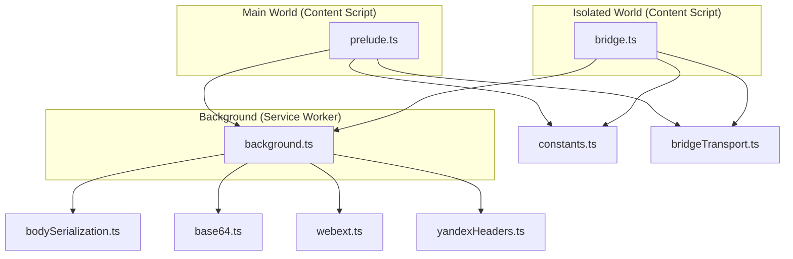
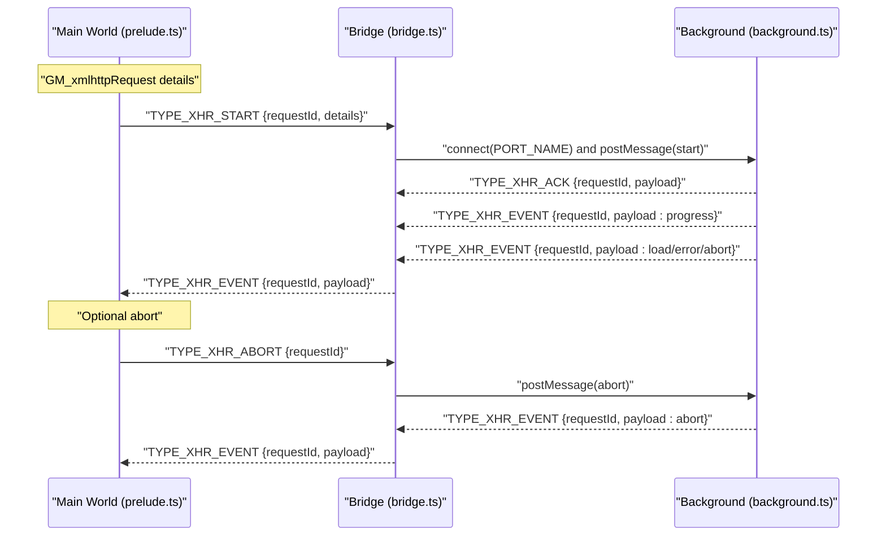
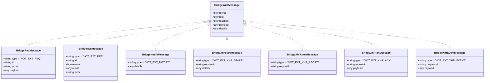
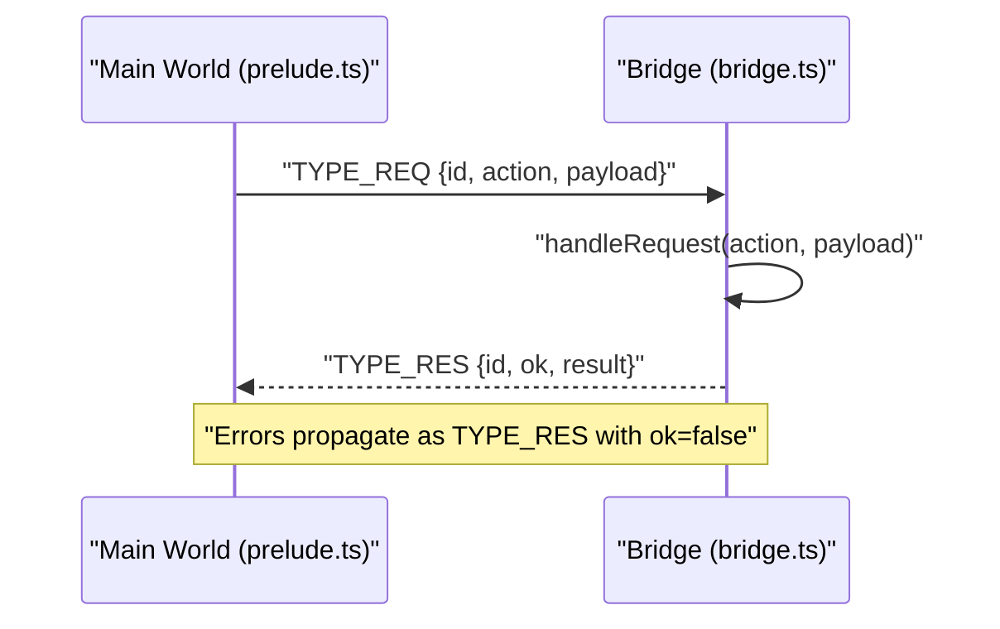
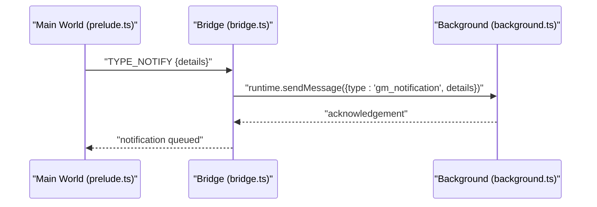
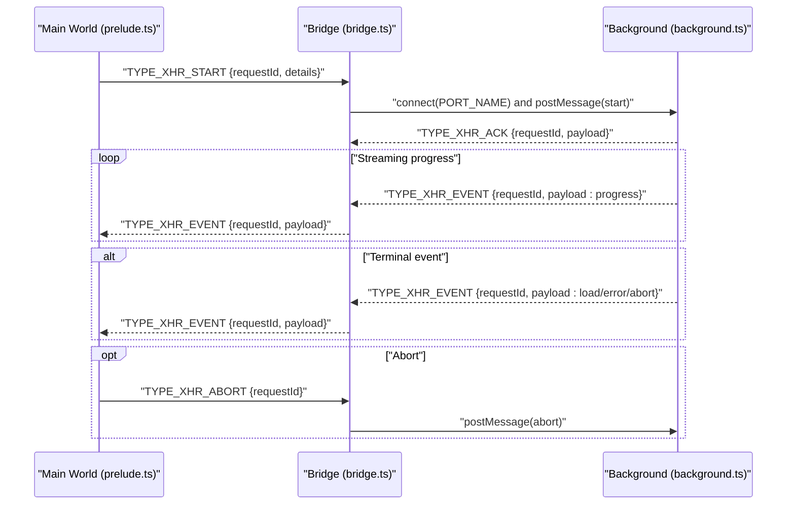
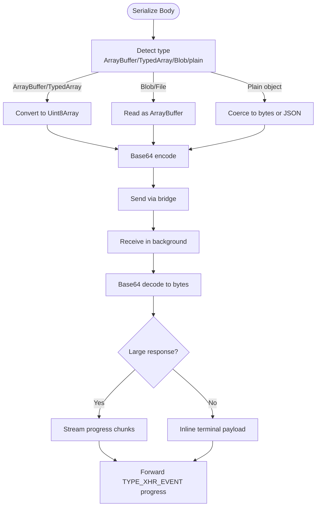
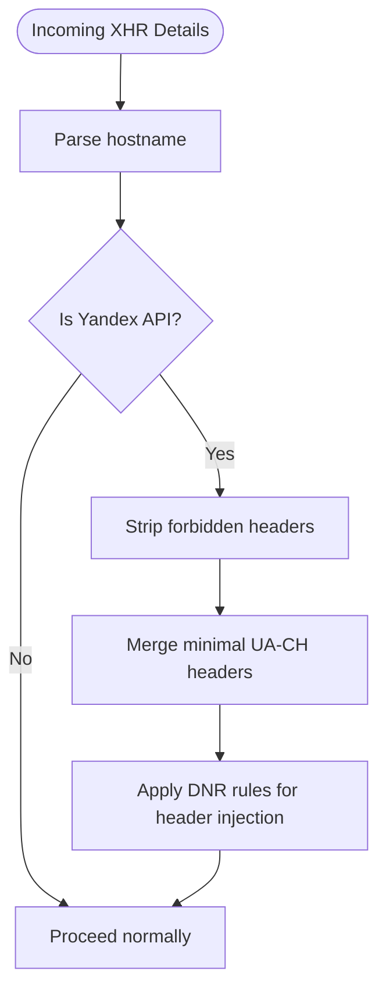
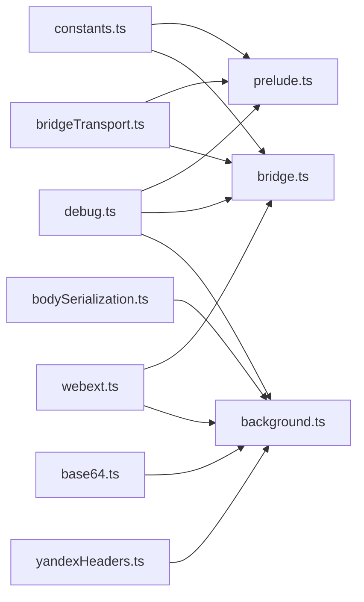

# Message Routing System

<cite>
**Referenced Files in This Document**
- [bridge.ts](file://src/extension/bridge.ts)
- [prelude.ts](file://src/extension/prelude.ts)
- [constants.ts](file://src/extension/constants.ts)
- [bridgeTransport.ts](file://src/extension/bridgeTransport.ts)
- [background.ts](file://src/extension/background.ts)
- [bodySerialization.ts](file://src/extension/bodySerialization.ts)
- [base64.ts](file://src/extension/base64.ts)
- [webext.ts](file://src/extension/webext.ts)
- [yandexHeaders.ts](file://src/extension/yandexHeaders.ts)
- [debug.ts](file://src/utils/debug.ts)
</cite>

## Table of Contents
1. [Introduction](#introduction)
2. [Project Structure](#project-structure)
3. [Core Components](#core-components)
4. [Architecture Overview](#architecture-overview)
5. [Detailed Component Analysis](#detailed-component-analysis)
6. [Dependency Analysis](#dependency-analysis)
7. [Performance Considerations](#performance-considerations)
8. [Troubleshooting Guide](#troubleshooting-guide)
9. [Conclusion](#conclusion)

## Introduction
This document explains the message routing system that enables cross-world communication between the isolated content script and the main world in a browser extension. It covers the four core message types used for request-response operations, notifications, and XMLHttpRequest (XHR) operations, including acknowledgment and event streaming. The system ensures secure, efficient, and reliable communication across world boundaries, with robust error handling and performance optimizations for high-frequency traffic.

## Project Structure
The message routing system spans three worlds and a shared constant layer:
- Isolated content script world: Implements the bridge that proxies privileged operations to the main world and relays XHR events back.
- Main world: Provides polyfills for GM_* APIs and manages request/response lifecycles and XHR event handling.
- Background service worker: Performs privileged network requests, decodes bodies, streams binary responses, and relays events back to the bridge.

**Diagram sources**
- [bridge.ts:1-699](file://src/extension/bridge.ts#L1-L699)
- [prelude.ts:1-641](file://src/extension/prelude.ts#L1-L641)
- [constants.ts:1-102](file://src/extension/constants.ts#L1-L102)
- [bridgeTransport.ts:1-46](file://src/extension/bridgeTransport.ts#L1-L46)
- [background.ts:1-1086](file://src/extension/background.ts#L1-L1086)
- [bodySerialization.ts:1-570](file://src/extension/bodySerialization.ts#L1-L570)
- [base64.ts:1-128](file://src/extension/base64.ts#L1-L128)
- [webext.ts:1-187](file://src/extension/webext.ts#L1-L187)
- [yandexHeaders.ts:1-56](file://src/extension/yandexHeaders.ts#L1-L56)

**Section sources**
- [bridge.ts:1-699](file://src/extension/bridge.ts#L1-L699)
- [prelude.ts:1-641](file://src/extension/prelude.ts#L1-L641)
- [constants.ts:1-102](file://src/extension/constants.ts#L1-L102)
- [bridgeTransport.ts:1-46](file://src/extension/bridgeTransport.ts#L1-L46)
- [background.ts:1-1086](file://src/extension/background.ts#L1-L1086)

## Core Components
- Message types and shape: The system defines a set of message types and a shared wire format with a marker to distinguish bridge messages from unrelated postMessage traffic. Messages carry fields such as type, id, action, payload, and details.
- Request-response pattern: The main world initiates requests with TYPE_REQ and expects a TYPE_RES response with ok/result/error.
- Notification relay: The main world sends TYPE_NOTIFY messages to the bridge, which forwards them to the background for privileged notification creation.
- XHR pipeline: The main world sends TYPE_XHR_START and TYPE_XHR_ABORT messages to the bridge. The bridge connects to the background via a named port, relaying progress and terminal events back to the main world as TYPE_XHR_EVENT messages.

**Section sources**
- [constants.ts:15-101](file://src/extension/constants.ts#L15-L101)
- [prelude.ts:82-110](file://src/extension/prelude.ts#L82-L110)
- [bridge.ts:627-696](file://src/extension/bridge.ts#L627-L696)
- [background.ts:487-925](file://src/extension/background.ts#L487-L925)

## Architecture Overview
The system uses a layered approach:
- Main world polyfills: Expose GM_* APIs and manage XHR lifecycle.
- Bridge: Validates and routes messages, relays privileged operations, and streams XHR events.
- Background: Performs network requests, decodes bodies, and streams binary data efficiently.

**Diagram sources**
- [prelude.ts:309-380](file://src/extension/prelude.ts#L309-L380)
- [bridge.ts:335-561](file://src/extension/bridge.ts#L335-L561)
- [background.ts:487-925](file://src/extension/background.ts#L487-L925)

## Detailed Component Analysis

### Message Types and Wire Format
- Marker and types: A unique marker field identifies bridge messages. Core types include TYPE_REQ, TYPE_RES, TYPE_NOTIFY, TYPE_XHR_START, TYPE_XHR_ABORT, TYPE_XHR_ACK, and TYPE_XHR_EVENT.
- Message shape: Requests include id, action, and payload; responses include id, ok, result, and error; notifications include details; XHR messages include requestId and details/payload.

**Diagram sources**
- [constants.ts:31-81](file://src/extension/constants.ts#L31-L81)

**Section sources**
- [constants.ts:12-101](file://src/extension/constants.ts#L12-L101)

### Request-Response Pattern (TYPE_REQ/TYPE_RES)
- Main world request: The prelude generates a unique id, stores a pending handler, posts TYPE_REQ, and waits for TYPE_RES.
- Bridge handling: The bridge validates the message, executes the requested action (e.g., storage operations), and posts TYPE_RES with ok/result or error.
- Error handling: Errors are caught and reported back as TYPE_RES with ok=false and an error message.

**Diagram sources**
- [prelude.ts:91-110](file://src/extension/prelude.ts#L91-L110)
- [bridge.ts:580-625](file://src/extension/bridge.ts#L580-L625)
- [bridge.ts:627-696](file://src/extension/bridge.ts#L627-L696)

**Section sources**
- [prelude.ts:82-110](file://src/extension/prelude.ts#L82-L110)
- [bridge.ts:580-625](file://src/extension/bridge.ts#L580-L625)
- [bridge.ts:627-696](file://src/extension/bridge.ts#L627-L696)

### Notification Relay (TYPE_NOTIFY)
- Main world: Sanitizes notification details (removing non-serializable callbacks) and sends TYPE_NOTIFY to the bridge.
- Bridge: Relays the sanitized details to the background via runtime.sendMessage for privileged notification creation.

**Diagram sources**
- [prelude.ts:288-300](file://src/extension/prelude.ts#L288-L300)
- [bridge.ts:662-669](file://src/extension/bridge.ts#L662-L669)
- [background.ts:1028-1067](file://src/extension/background.ts#L1028-L1067)

**Section sources**
- [prelude.ts:69-80](file://src/extension/prelude.ts#L69-L80)
- [bridge.ts:662-669](file://src/extension/bridge.ts#L662-L669)
- [background.ts:927-1067](file://src/extension/background.ts#L927-L1067)

### XMLHttpRequest Pipeline (TYPE_XHR_START, TYPE_XHR_ABORT, TYPE_XHR_ACK, TYPE_XHR_EVENT)
- Main world initiation: The prelude serializes the request body, creates a unique requestId, and posts TYPE_XHR_START with details.
- Bridge orchestration: The bridge connects to the background via a named port, posts the start message, and listens for progress and terminal events.
- Background processing: The background performs the network request, streams progress events, and emits terminal events (load/error/abort).
- Event delivery: Progress and terminal events are forwarded as TYPE_XHR_EVENT messages to the main world, which invokes callbacks and cleans up state.

**Diagram sources**
- [prelude.ts:309-380](file://src/extension/prelude.ts#L309-L380)
- [bridge.ts:335-561](file://src/extension/bridge.ts#L335-L561)
- [background.ts:487-925](file://src/extension/background.ts#L487-L925)

**Section sources**
- [prelude.ts:112-125](file://src/extension/prelude.ts#L112-L125)
- [prelude.ts:309-380](file://src/extension/prelude.ts#L309-L380)
- [bridge.ts:237-264](file://src/extension/bridge.ts#L237-L264)
- [bridge.ts:335-561](file://src/extension/bridge.ts#L335-L561)
- [background.ts:487-925](file://src/extension/background.ts#L487-L925)

### Binary Body Handling and Streaming
- Serialization: Bodies (ArrayBuffer, TypedArray, Blob) are serialized to a portable representation using base64 encoding and MIME type metadata when applicable.
- Decoding: The background decodes serialized bodies back to fetch-compatible formats, preserving binary fidelity.
- Streaming: Large binary responses are streamed as progress chunks to avoid large base64 payloads in a single message.

**Diagram sources**
- [bodySerialization.ts:466-534](file://src/extension/bodySerialization.ts#L466-L534)
- [bodySerialization.ts:539-569](file://src/extension/bodySerialization.ts#L539-L569)
- [background.ts:800-845](file://src/extension/background.ts#L800-L845)
- [base64.ts:110-127](file://src/extension/base64.ts#L110-L127)

**Section sources**
- [bodySerialization.ts:12-570](file://src/extension/bodySerialization.ts#L12-L570)
- [base64.ts:1-128](file://src/extension/base64.ts#L1-L128)
- [background.ts:800-845](file://src/extension/background.ts#L800-L845)

### Header Normalization for Yandex APIs
- Detection: Requests targeting specific Yandex hosts trigger header normalization.
- Stripping: Forbidden or redundant headers are removed.
- Injection: Minimal required client hints are injected via declarativeNetRequest rules to satisfy endpoint validation.

**Diagram sources**
- [bridge.ts:487-503](file://src/extension/bridge.ts#L487-L503)
- [background.ts:193-262](file://src/extension/background.ts#L193-L262)
- [yandexHeaders.ts:1-56](file://src/extension/yandexHeaders.ts#L1-L56)

**Section sources**
- [bridge.ts:487-503](file://src/extension/bridge.ts#L487-L503)
- [background.ts:193-262](file://src/extension/background.ts#L193-L262)
- [yandexHeaders.ts:1-56](file://src/extension/yandexHeaders.ts#L1-L56)

## Dependency Analysis
The message routing system exhibits clear separation of concerns:
- Constants define shared types and markers used across worlds.
- Transport utilities attach markers and manage transferables for binary payloads.
- Polyfills in the main world coordinate request/response and XHR lifecycle.
- The bridge validates and routes messages, manages XHR ports, and relays privileged operations.
- The background performs network operations, decodes bodies, and streams events.

**Diagram sources**
- [constants.ts:1-102](file://src/extension/constants.ts#L1-L102)
- [prelude.ts:1-641](file://src/extension/prelude.ts#L1-L641)
- [bridge.ts:1-699](file://src/extension/bridge.ts#L1-L699)
- [bridgeTransport.ts:1-46](file://src/extension/bridgeTransport.ts#L1-L46)
- [background.ts:1-1086](file://src/extension/background.ts#L1-L1086)
- [bodySerialization.ts:1-570](file://src/extension/bodySerialization.ts#L1-L570)
- [base64.ts:1-128](file://src/extension/base64.ts#L1-L128)
- [webext.ts:1-187](file://src/extension/webext.ts#L1-L187)
- [yandexHeaders.ts:1-56](file://src/extension/yandexHeaders.ts#L1-L56)
- [debug.ts:1-38](file://src/utils/debug.ts#L1-L38)

**Section sources**
- [constants.ts:1-102](file://src/extension/constants.ts#L1-L102)
- [prelude.ts:1-641](file://src/extension/prelude.ts#L1-L641)
- [bridge.ts:1-699](file://src/extension/bridge.ts#L1-L699)
- [bridgeTransport.ts:1-46](file://src/extension/bridgeTransport.ts#L1-L46)
- [background.ts:1-1086](file://src/extension/background.ts#L1-L1086)
- [bodySerialization.ts:1-570](file://src/extension/bodySerialization.ts#L1-L570)
- [base64.ts:1-128](file://src/extension/base64.ts#L1-L128)
- [webext.ts:1-187](file://src/extension/webext.ts#L1-L187)
- [yandexHeaders.ts:1-56](file://src/extension/yandexHeaders.ts#L1-L56)
- [debug.ts:1-38](file://src/utils/debug.ts#L1-L38)

## Performance Considerations
- Binary streaming: Large binary responses are streamed as progress chunks to avoid large base64 payloads in a single message, reducing memory pressure and improving responsiveness.
- Transferables: Transferable ArrayBuffer instances are passed across worlds to minimize copying overhead.
- Timeout safeguards: The main world sets timeouts for bridge requests and XHR acknowledgments, with fallback watchdogs to abort stalled operations.
- Header caching: Client hints for Yandex APIs are cached and reused to reduce repeated high-entropy header lookups.
- Efficient serialization: Bodies are serialized once in the main world and decoded in the background to preserve fidelity and avoid repeated conversions.

[No sources needed since this section provides general guidance]

## Troubleshooting Guide
- Message filtering: The bridge and main world use a marker to filter non-bridge messages, preventing interference from unrelated postMessage traffic.
- Error propagation: Errors in request handlers are captured and returned as TYPE_RES with ok=false and an error message. XHR errors are forwarded as TYPE_XHR_EVENT with error payloads.
- Debug logging: Extensive debug logs are available across worlds to trace message flow, timeouts, and failures.
- Timeout handling: The main world tracks pending requests and XHR callbacks, rejecting or invoking callbacks on timeouts with appropriate payloads.

**Section sources**
- [constants.ts:93-101](file://src/extension/constants.ts#L93-L101)
- [bridge.ts:683-696](file://src/extension/bridge.ts#L683-L696)
- [prelude.ts:98-101](file://src/extension/prelude.ts#L98-L101)
- [prelude.ts:184-211](file://src/extension/prelude.ts#L184-L211)
- [debug.ts:1-38](file://src/utils/debug.ts#L1-L38)

## Conclusion
The message routing system provides a robust, cross-world communication layer for a browser extension. It cleanly separates concerns across worlds, offers efficient binary handling and streaming, and includes comprehensive error handling and debugging capabilities. The design supports high-frequency message traffic while maintaining reliability and performance.