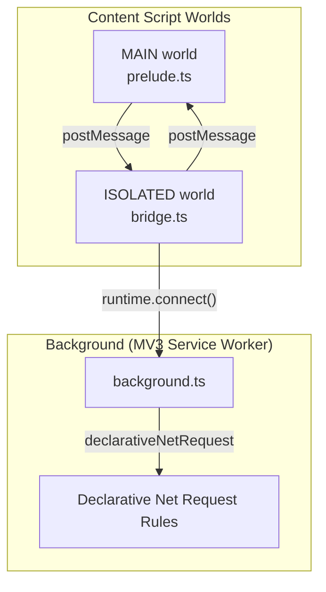
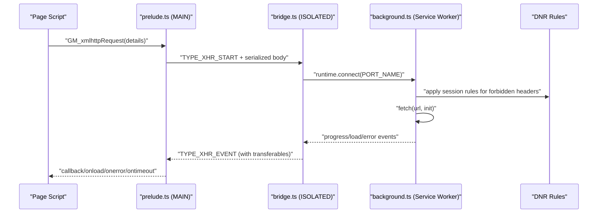
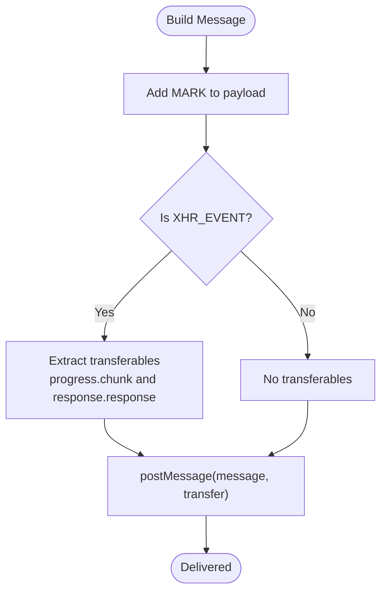
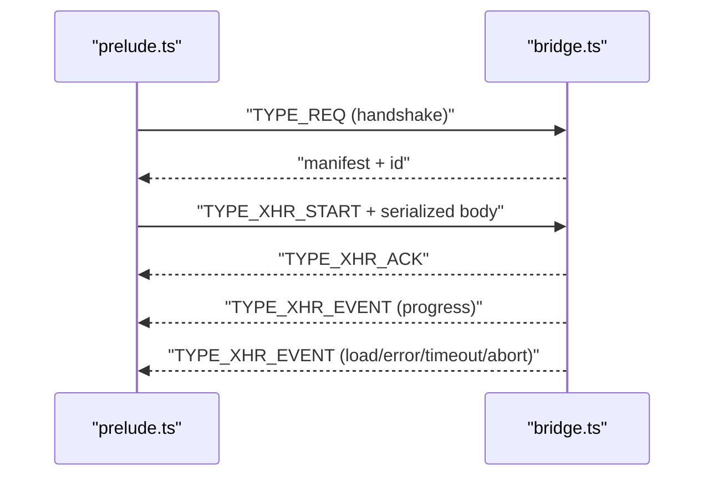
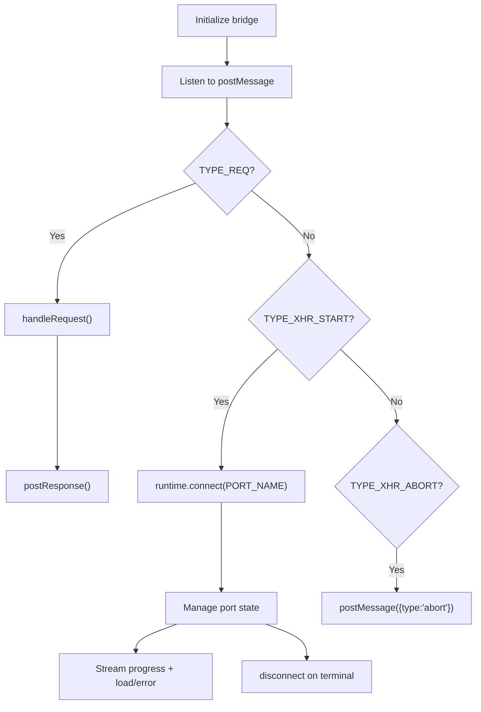
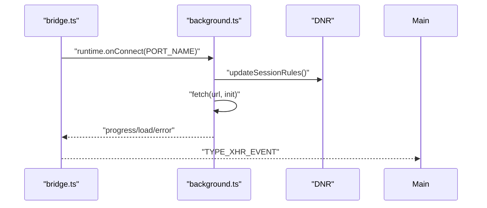
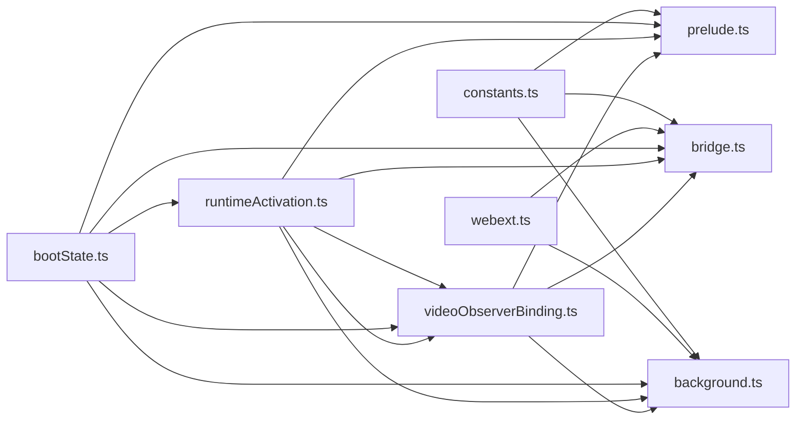

# Extension Framework

<cite>
**Referenced Files in This Document**
- [background.ts](file://src/extension/background.ts)
- [bridge.ts](file://src/extension/bridge.ts)
- [bridgeTransport.ts](file://src/extension/bridgeTransport.ts)
- [constants.ts](file://src/extension/constants.ts)
- [prelude.ts](file://src/extension/prelude.ts)
- [webext.ts](file://src/extension/webext.ts)
- [bodySerialization.ts](file://src/extension/bodySerialization.ts)
- [base64.ts](file://src/extension/base64.ts)
- [yandexHeaders.ts](file://src/extension/yandexHeaders.ts)
- [bootState.ts](file://src/bootstrap/bootState.ts)
- [runtimeActivation.ts](file://src/bootstrap/runtimeActivation.ts)
- [videoObserverBinding.ts](file://src/bootstrap/videoObserverBinding.ts)
- [package.json](file://package.json)
</cite>

## Table of Contents
1. [Introduction](#introduction)
2. [Project Structure](#project-structure)
3. [Core Components](#core-components)
4. [Architecture Overview](#architecture-overview)
5. [Detailed Component Analysis](#detailed-component-analysis)
6. [Dependency Analysis](#dependency-analysis)
7. [Performance Considerations](#performance-considerations)
8. [Security Considerations](#security-considerations)
9. [Deployment and Compatibility](#deployment-and-compatibility)
10. [Troubleshooting Guide](#troubleshooting-guide)
11. [Conclusion](#conclusion)

## Introduction
This document describes the extension framework architecture that enables cross-browser compatibility between a userscript-like API and a native extension. It explains the bridge system for secure message passing, the background service worker implementation, runtime activation and video observer binding, boot state management, and initialization sequences across browsers. Practical guidance is included for deployment, cross-browser testing, and security considerations.

## Project Structure
The extension framework is organized around three worlds and a service worker:
- MAIN world: userscript polyfills and GM API shims
- ISOLATED world: bridge that proxies privileged operations to the background
- Background (MV3 Service Worker): privileged APIs, declarativeNetRequest rules, and network bridging
- Bootstrap utilities: boot state, runtime activation, and video observer binding

**Diagram sources**
- [prelude.ts:1-641](file://src/extension/prelude.ts#L1-L641)
- [bridge.ts:1-699](file://src/extension/bridge.ts#L1-L699)
- [background.ts:1-1086](file://src/extension/background.ts#L1-L1086)

**Section sources**
- [prelude.ts:1-641](file://src/extension/prelude.ts#L1-L641)
- [bridge.ts:1-699](file://src/extension/bridge.ts#L1-L699)
- [background.ts:1-1086](file://src/extension/background.ts#L1-L1086)

## Core Components
- Message protocol and constants: shared types and markers for cross-world communication
- Prelude (MAIN world): installs GM_* polyfills, manages request/response and GM_xmlhttpRequest callbacks
- Bridge (ISOLATED world): validates messages, serializes bodies, manages ports, and relays to background
- Background (MV3 Service Worker): performs privileged network requests, applies DNR rules, and manages notifications
- Cross-browser API wrapper: uniform access to chrome/browser APIs
- Serialization and transport: robust body encoding/decoding and transferable-aware message transport
- Boot state, runtime activation, and video observer binding: orchestrate initialization and video lifecycle

**Section sources**
- [constants.ts:1-102](file://src/extension/constants.ts#L1-L102)
- [prelude.ts:1-641](file://src/extension/prelude.ts#L1-L641)
- [bridge.ts:1-699](file://src/extension/bridge.ts#L1-L699)
- [background.ts:1-1086](file://src/extension/background.ts#L1-L1086)
- [webext.ts:1-187](file://src/extension/webext.ts#L1-L187)
- [bodySerialization.ts:1-570](file://src/extension/bodySerialization.ts#L1-L570)
- [bridgeTransport.ts:1-46](file://src/extension/bridgeTransport.ts#L1-L46)
- [bootState.ts:1-42](file://src/bootstrap/bootState.ts#L1-L42)
- [runtimeActivation.ts:1-59](file://src/bootstrap/runtimeActivation.ts#L1-L59)
- [videoObserverBinding.ts:1-179](file://src/bootstrap/videoObserverBinding.ts#L1-L179)

## Architecture Overview
The framework implements a strict separation of concerns:
- MAIN world: exposes GM API surface to the page and handles callbacks
- ISOLATED world: validates and serializes messages, manages ports, and forwards to background
- Background: executes privileged operations, applies DNR rules for forbidden headers, and streams binary responses
- Transport: marks messages, detects transferables, and safely posts to MAIN world

**Diagram sources**
- [prelude.ts:309-380](file://src/extension/prelude.ts#L309-L380)
- [bridge.ts:335-561](file://src/extension/bridge.ts#L335-L561)
- [background.ts:535-800](file://src/extension/background.ts#L535-L800)
- [yandexHeaders.ts:1-56](file://src/extension/yandexHeaders.ts#L1-L56)

## Detailed Component Analysis

### Message Protocol and Transport
- Constants define message types and a unique marker to distinguish framework traffic
- Transport wraps messages with a marker and extracts transferables for efficient binary streaming
- The bridge ensures only JSON-serializable payloads are sent; binary chunks are base64-encoded and later converted to ArrayBuffers

**Diagram sources**
- [constants.ts:12-102](file://src/extension/constants.ts#L12-L102)
- [bridgeTransport.ts:27-46](file://src/extension/bridgeTransport.ts#L27-L46)

**Section sources**
- [constants.ts:1-102](file://src/extension/constants.ts#L1-L102)
- [bridgeTransport.ts:1-46](file://src/extension/bridgeTransport.ts#L1-L46)

### Prelude (MAIN World)
- Installs GM_* polyfills and GM.xmlHttpRequest promise API
- Manages request IDs, timeouts, and callback mapping
- Serializes request bodies before sending to the bridge to preserve binary fidelity
- Handles acknowledgments, progress, and terminal events

**Diagram sources**
- [prelude.ts:619-641](file://src/extension/prelude.ts#L619-L641)
- [prelude.ts:506-611](file://src/extension/prelude.ts#L506-L611)
- [bridge.ts:580-625](file://src/extension/bridge.ts#L580-L625)

**Section sources**
- [prelude.ts:1-641](file://src/extension/prelude.ts#L1-L641)

### Bridge (ISOLATED World)
- Validates messages and ensures only framework traffic is processed
- Normalizes and merges UA-CH headers for Yandex endpoints
- Serializes bodies and manages per-request ports
- Streams binary responses efficiently using transferables and base64 fallbacks

**Diagram sources**
- [bridge.ts:636-699](file://src/extension/bridge.ts#L636-L699)
- [bridge.ts:335-561](file://src/extension/bridge.ts#L335-L561)

**Section sources**
- [bridge.ts:1-699](file://src/extension/bridge.ts#L1-L699)

### Background (MV3 Service Worker)
- Listens for connections from the bridge and manages per-session ports
- Applies declarativeNetRequest session rules to inject/strip headers for Yandex, YouTube, and Googlevideo endpoints
- Executes fetch requests with proper credentials, cache, and redirect policies
- Streams binary responses and handles timeouts/aborts gracefully

**Diagram sources**
- [background.ts:487-534](file://src/extension/background.ts#L487-L534)
- [background.ts:639-648](file://src/extension/background.ts#L639-L648)
- [background.ts:756-800](file://src/extension/background.ts#L756-L800)

**Section sources**
- [background.ts:1-1086](file://src/extension/background.ts#L1-L1086)

### Cross-Browser API Wrapper
- Provides a unified interface over chrome and browser namespaces
- Converts callback-based APIs to promises for consistent usage
- Handles runtime.lastError and maps callback signatures to promise results

**Section sources**
- [webext.ts:1-187](file://src/extension/webext.ts#L1-L187)

### Body Serialization and Base64 Utilities
- Robustly serializes ArrayBuffer, TypedArray, Blob, and File bodies
- Coerces cross-world payloads that lose type information
- Encodes/decodes base64 safely and efficiently

**Section sources**
- [bodySerialization.ts:1-570](file://src/extension/bodySerialization.ts#L1-L570)
- [base64.ts:1-128](file://src/extension/base64.ts#L1-L128)

### Yandex Header Handling
- Detects Yandex endpoints and strips forbidden headers
- Normalizes UA client hints and applies only required headers via DNR
- Filters headers to avoid violating Chromium’s forbidden header constraints

**Section sources**
- [yandexHeaders.ts:1-56](file://src/extension/yandexHeaders.ts#L1-L56)
- [background.ts:193-262](file://src/extension/background.ts#L193-L262)

### Boot State Management
- Tracks bootstrap lifecycle across the page scope
- Prevents duplicate initialization and provides a shared promise for ongoing boot attempts

**Section sources**
- [bootState.ts:1-42](file://src/bootstrap/bootState.ts#L1-L42)

### Runtime Activation
- Ensures localization provider is ready and initializes auth when appropriate
- Sets up iframe interactor once and avoids redundant bindings

**Section sources**
- [runtimeActivation.ts:1-59](file://src/bootstrap/runtimeActivation.ts#L1-L59)

### Video Observer Binding
- Observes DOM changes and binds video handlers to containers
- Coordinates initialization order, pending promotion, and handler release
- Integrates with runtime activation to lazily initialize components

**Section sources**
- [videoObserverBinding.ts:1-179](file://src/bootstrap/videoObserverBinding.ts#L1-L179)

## Dependency Analysis
The framework minimizes tight coupling by centralizing cross-browser differences in a thin wrapper and enforcing a strict message protocol.

**Diagram sources**
- [constants.ts:1-102](file://src/extension/constants.ts#L1-L102)
- [webext.ts:1-187](file://src/extension/webext.ts#L1-L187)
- [bootState.ts:1-42](file://src/bootstrap/bootState.ts#L1-L42)
- [runtimeActivation.ts:1-59](file://src/bootstrap/runtimeActivation.ts#L1-L59)
- [videoObserverBinding.ts:1-179](file://src/bootstrap/videoObserverBinding.ts#L1-L179)
- [prelude.ts:1-641](file://src/extension/prelude.ts#L1-L641)
- [bridge.ts:1-699](file://src/extension/bridge.ts#L1-L699)
- [background.ts:1-1086](file://src/extension/background.ts#L1-L1086)

**Section sources**
- [constants.ts:1-102](file://src/extension/constants.ts#L1-L102)
- [webext.ts:1-187](file://src/extension/webext.ts#L1-L187)
- [bootState.ts:1-42](file://src/bootstrap/bootState.ts#L1-L42)
- [runtimeActivation.ts:1-59](file://src/bootstrap/runtimeActivation.ts#L1-L59)
- [videoObserverBinding.ts:1-179](file://src/bootstrap/videoObserverBinding.ts#L1-L179)
- [prelude.ts:1-641](file://src/extension/prelude.ts#L1-L641)
- [bridge.ts:1-699](file://src/extension/bridge.ts#L1-L699)
- [background.ts:1-1086](file://src/extension/background.ts#L1-L1086)

## Performance Considerations
- Binary streaming: background fetches stream responses; bridge aggregates chunks and converts base64 to ArrayBuffers for efficient transfer
- Transferables: transport identifies transferable objects to avoid copying large buffers
- Header normalization: UA-CH caching reduces repeated high-entropy queries
- DNR batching: session rule updates are queued to avoid races and minimize overhead
- Timeout safeguards: prelude watchdogs detect stalled bridges and trigger aborts

[No sources needed since this section provides general guidance]

## Security Considerations
- Strict message validation: only framework messages with a known marker are accepted
- Privileged operations isolated: network requests and notifications are executed in the background
- Forbidden header handling: DNR rules inject/strip headers to emulate a real browser tab without violating CORS restrictions
- Cross-world serialization: bodies are serialized to prevent arbitrary object leakage and maintain type fidelity
- Error containment: bridge and background isolate failures and propagate minimal error details

**Section sources**
- [constants.ts:93-102](file://src/extension/constants.ts#L93-L102)
- [bridge.ts:636-699](file://src/extension/bridge.ts#L636-L699)
- [background.ts:639-648](file://src/extension/background.ts#L639-L648)
- [yandexHeaders.ts:29-55](file://src/extension/yandexHeaders.ts#L29-L55)

## Deployment and Compatibility
- Build targets: separate builds for Chrome and Firefox using Vite modes
- Scripts: npm scripts for building extension artifacts and packaging
- Manifest V3: service worker-based architecture with declarativeNetRequest for header manipulation
- Cross-browser compatibility: unified API wrapper and explicit DNR rule application

Practical steps:
- Build per browser: use the provided scripts to produce Chrome and Firefox artifacts
- Load unpacked: install the extension in developer mode for testing
- Cross-browser testing: validate GM_xmlhttpRequest behavior, UA-CH header propagation, and binary streaming
- Store submission: ensure permissions and host matching align with manifest requirements; verify DNR rules are minimal and scoped

**Section sources**
- [package.json:31-47](file://package.json#L31-L47)
- [background.ts:63-98](file://src/extension/background.ts#L63-L98)

## Troubleshooting Guide
Common issues and resolutions:
- Bridge not responding: verify handshake succeeded and port connects; check for runtime.lastError
- Binary responses corrupted: ensure base64 decoding and transferable handling; confirm chunk aggregation
- Forbidden headers missing: confirm DNR rules applied for target hosts; validate UA-CH normalization
- Timeouts: prelude watchdog triggers abort; adjust caller timeout or investigate background fetch failures

**Section sources**
- [prelude.ts:91-110](file://src/extension/prelude.ts#L91-L110)
- [bridge.ts:535-561](file://src/extension/bridge.ts#L535-L561)
- [background.ts:639-648](file://src/extension/background.ts#L639-L648)

## Conclusion
The extension framework cleanly separates concerns across worlds, enforces a strict message protocol, and leverages MV3 capabilities to provide a userscript-like API with native extension security and performance. The boot state, runtime activation, and video observer binding enable robust initialization and lifecycle management. With careful attention to serialization, transport, and DNR rule application, the system delivers reliable cross-browser compatibility.