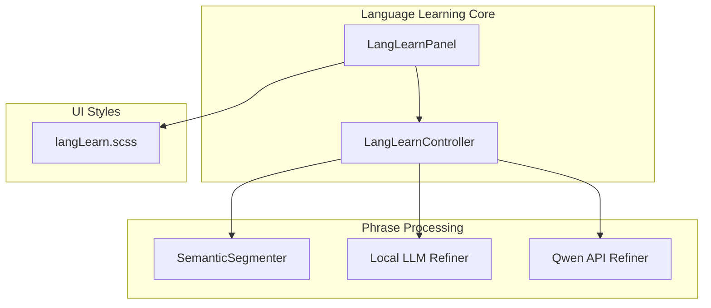
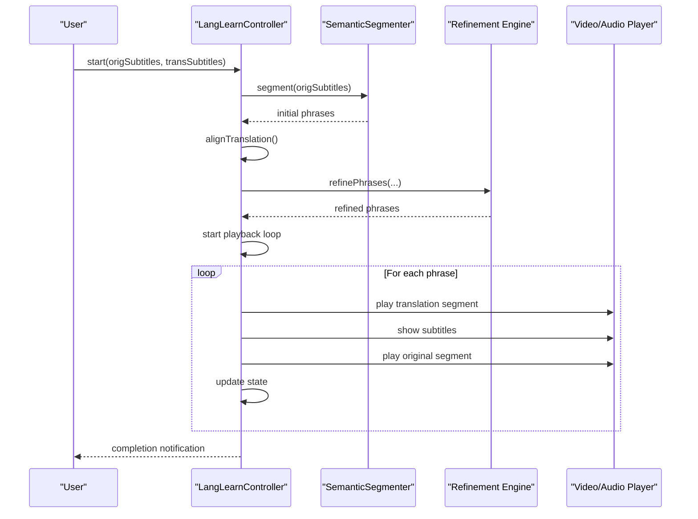
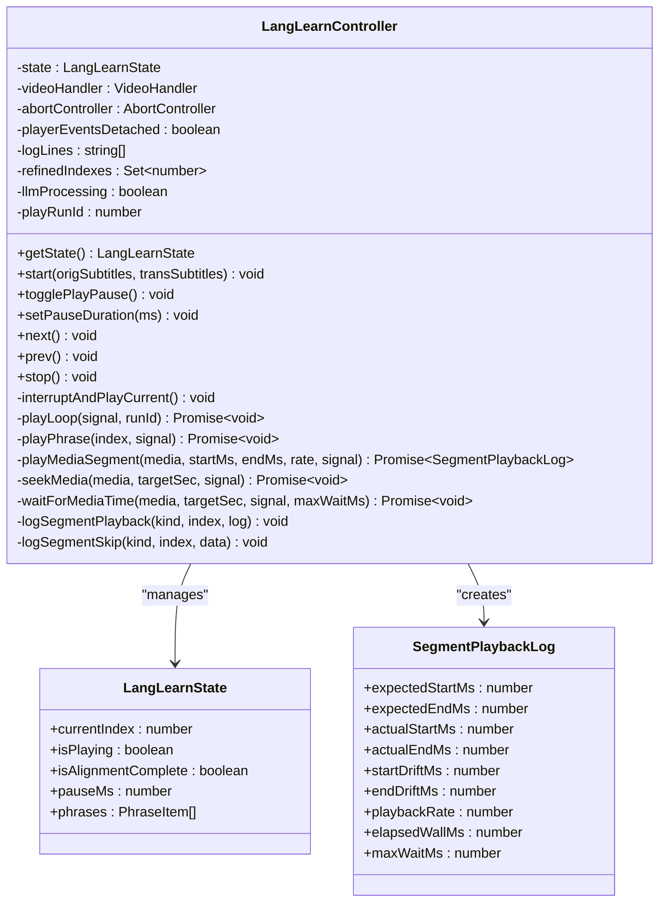
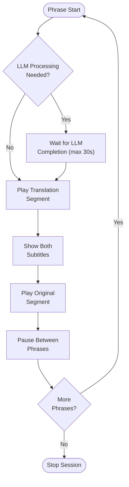
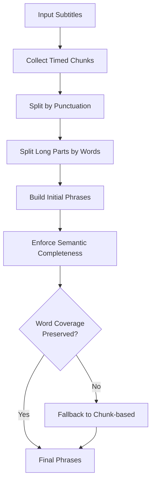
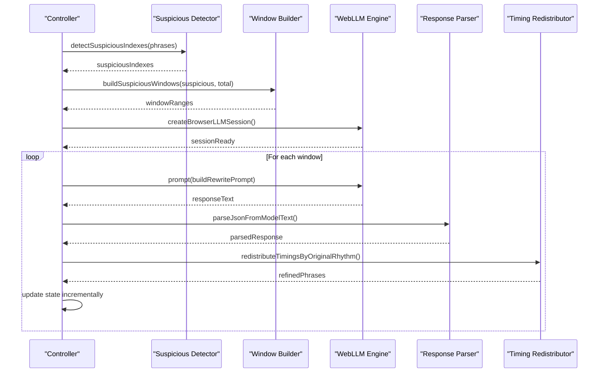
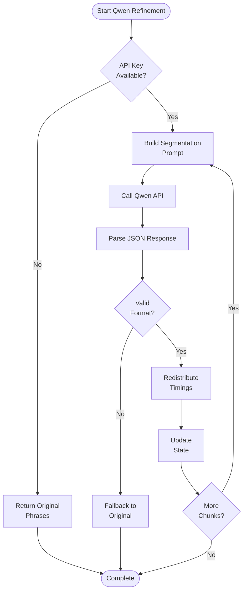
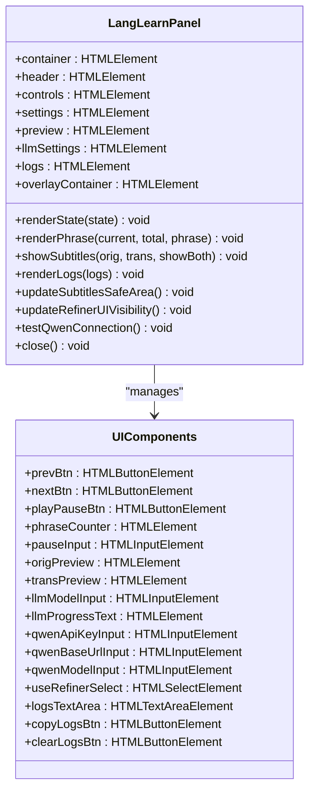
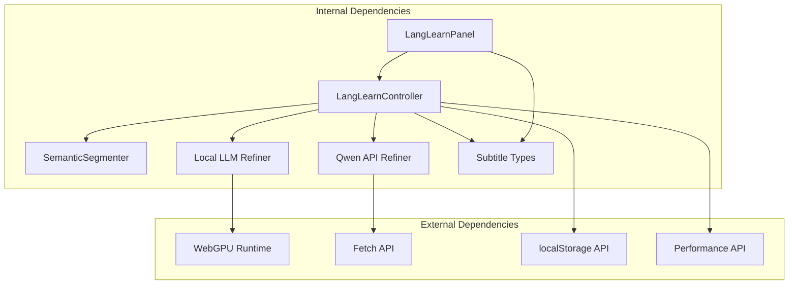

# Language Learning Features

<cite>
**Referenced Files in This Document**
- [LangLearnController.ts](file://src/langLearn/LangLearnController.ts)
- [LangLearnPanel.ts](file://src/langLearn/LangLearnPanel.ts)
- [semanticSegmenter.ts](file://src/langLearn/phraseSegmenter/semanticSegmenter.ts)
- [localLLMRefiner.ts](file://src/langLearn/phraseSegmenter/localLLMRefiner.ts)
- [qwenApiRefiner.ts](file://src/langLearn/phraseSegmenter/qwenApiRefiner.ts)
- [segmenter.test.ts](file://src/langLearn/phraseSegmenter/segmenter.test.ts)
- [localLLMRefiner.test.ts](file://src/langLearn/phraseSegmenter/localLLMRefiner.test.ts)
- [golden_cases.json](file://src/langLearn/phraseSegmenter/golden_cases.json)
- [langLearn.scss](file://src/styles/langLearn.scss)
</cite>

## Table of Contents
1. [Introduction](#introduction)
2. [Project Structure](#project-structure)
3. [Core Components](#core-components)
4. [Architecture Overview](#architecture-overview)
5. [Detailed Component Analysis](#detailed-component-analysis)
6. [Dependency Analysis](#dependency-analysis)
7. [Performance Considerations](#performance-considerations)
8. [Troubleshooting Guide](#troubleshooting-guide)
9. [Conclusion](#conclusion)
10. [Appendices](#appendices)

## Introduction
This document provides comprehensive technical documentation for the advanced language learning features in the Voice Over Translation (VOT) project. It covers the LangLearnController architecture, phrase segmentation workflow, semantic analysis, synchronized playback coordination, and the learning panel interface. The system integrates both local WebGPU-based AI processing and cloud-based Qwen API refinement to optimize subtitle alignment for language learning scenarios.

## Project Structure
The language learning functionality is organized under the `src/langLearn` directory with clear separation between core orchestration, phrase segmentation, and refinement logic:

**Diagram sources**
- [LangLearnController.ts:1-851](file://src/langLearn/LangLearnController.ts#L1-L851)
- [LangLearnPanel.ts:1-560](file://src/langLearn/LangLearnPanel.ts#L1-L560)
- [semanticSegmenter.ts:1-1488](file://src/langLearn/phraseSegmenter/semanticSegmenter.ts#L1-L1488)
- [localLLMRefiner.ts:1-562](file://src/langLearn/phraseSegmenter/localLLMRefiner.ts#L1-L562)
- [qwenApiRefiner.ts:1-604](file://src/langLearn/phraseSegmenter/qwenApiRefiner.ts#L1-L604)
- [langLearn.scss:1-357](file://src/styles/langLearn.scss#L1-L357)

**Section sources**
- [LangLearnController.ts:1-851](file://src/langLearn/LangLearnController.ts#L1-L851)
- [LangLearnPanel.ts:1-560](file://src/langLearn/LangLearnPanel.ts#L1-L560)

## Core Components
The language learning system consists of three primary components:

### LangLearnController
The central orchestrator managing the entire language learning workflow:
- **State Management**: Tracks current phrase index, playback state, and refinement progress
- **Playback Coordination**: Synchronizes audio playback with subtitle timing
- **Refinement Orchestration**: Manages both local and cloud-based phrase refinement
- **Event System**: Provides callbacks for UI updates and logging

### SemanticSegmenter
Performs initial phrase segmentation using sophisticated linguistic rules:
- **Punctuation-based splitting**: Handles sentence boundaries and soft punctuation
- **Duration-aware chunking**: Respects natural speech rhythms and timing gaps
- **Semantic completeness**: Ensures phrases represent complete thoughts
- **Fallback mechanisms**: Provides robust fallbacks when semantic rules fail

### Refinement Engines
Two complementary refinement systems optimize phrase boundaries:

#### Local LLM Refiner (WebGPU)
- **WebLLM Integration**: Uses MLC's WebLLM for local AI processing
- **Suspicious Detection**: Identifies problematic phrase alignments
- **Window-based Processing**: Processes phrases in configurable windows
- **Timing Redistribution**: Rebalances translation timing according to original rhythm

#### Qwen API Refiner
- **Cloud-based Processing**: Leverages Qwen-3.5-Omni via OpenAI-compatible API
- **Chunked Processing**: Handles large subtitle sets efficiently
- **Confidence Scoring**: Provides quality metrics for refined phrases
- **Redistribution Capability**: Can rebalance translation text across segments

**Section sources**
- [LangLearnController.ts:25-82](file://src/langLearn/LangLearnController.ts#L25-L82)
- [semanticSegmenter.ts:730-745](file://src/langLearn/phraseSegmenter/semanticSegmenter.ts#L730-L745)
- [localLLMRefiner.ts:411-562](file://src/langLearn/phraseSegmenter/localLLMRefiner.ts#L411-L562)
- [qwenApiRefiner.ts:385-519](file://src/langLearn/phraseSegmenter/qwenApiRefiner.ts#L385-L519)

## Architecture Overview
The language learning architecture follows a pipeline pattern with multiple refinement stages:

**Diagram sources**
- [LangLearnController.ts:91-203](file://src/langLearn/LangLearnController.ts#L91-L203)
- [semanticSegmenter.ts:1059-1243](file://src/langLearn/phraseSegmenter/semanticSegmenter.ts#L1059-L1243)
- [localLLMRefiner.ts:411-562](file://src/langLearn/phraseSegmenter/localLLMRefiner.ts#L411-L562)
- [qwenApiRefiner.ts:385-519](file://src/langLearn/phraseSegmenter/qwenApiRefiner.ts#L385-L519)

## Detailed Component Analysis

### LangLearnController Architecture
The controller implements a comprehensive state machine for language learning sessions:

**Diagram sources**
- [LangLearnController.ts:25-82](file://src/langLearn/LangLearnController.ts#L25-L82)
- [LangLearnController.ts:33-43](file://src/langLearn/LangLearnController.ts#L33-L43)

#### Playback Synchronization Logic
The controller implements sophisticated timing coordination:

**Diagram sources**
- [LangLearnController.ts:361-500](file://src/langLearn/LangLearnController.ts#L361-L500)

**Section sources**
- [LangLearnController.ts:45-331](file://src/langLearn/LangLearnController.ts#L45-L331)

### Semantic Phrase Segmentation Algorithm
The segmentation algorithm combines linguistic rules with timing awareness:

**Diagram sources**
- [semanticSegmenter.ts:626-728](file://src/langLearn/phraseSegmenter/semanticSegmenter.ts#L626-L728)

#### Key Segmentation Rules
The algorithm applies multiple criteria for optimal phrase boundaries:

| Rule Category | Criteria | Purpose |
|---------------|----------|---------|
| **Punctuation-based** | Sentence endings, soft punctuation clusters | Natural thought boundaries |
| **Duration-aware** | Maximum phrase length, hard pause detection | Speech rhythm preservation |
| **Semantic completeness** | Incomplete tail words, question endings | Complete thought representation |
| **Word count limits** | Minimum/maximum words per phrase | Optimal learning length |

**Section sources**
- [semanticSegmenter.ts:108-124](file://src/langLearn/phraseSegmenter/semanticSegmenter.ts#L108-L124)
- [semanticSegmenter.ts:453-728](file://src/langLearn/phraseSegmenter/semanticSegmenter.ts#L453-L728)

### Local LLM Refinement Process
The WebGPU-based refinement system provides powerful phrase optimization:

**Diagram sources**
- [localLLMRefiner.ts:411-562](file://src/langLearn/phraseSegmenter/localLLMRefiner.ts#L411-L562)

#### Refinement Strategy
The local refinement employs a multi-stage approach:

1. **Suspicious Detection**: Identifies problematic phrase alignments
2. **Window Construction**: Groups nearby suspicious phrases for batch processing
3. **Prompt Engineering**: Creates specialized prompts for Russian-English alignment
4. **Response Validation**: Parses and validates model responses
5. **Timing Redistribution**: Rebalances translation timing according to original rhythm

**Section sources**
- [localLLMRefiner.ts:213-239](file://src/langLearn/phraseSegmenter/localLLMRefiner.ts#L213-L239)
- [localLLMRefiner.ts:256-305](file://src/langLearn/phraseSegmenter/localLLMRefiner.ts#L256-L305)
- [localLLMRefiner.ts:373-409](file://src/langLearn/phraseSegmenter/localLLMRefiner.ts#L373-L409)

### Cloud-based Qwen API Refinement
The Qwen API integration provides scalable cloud-based processing:

**Diagram sources**
- [qwenApiRefiner.ts:385-519](file://src/langLearn/phraseSegmenter/qwenApiRefiner.ts#L385-L519)

#### API Configuration and Retry Logic
The system implements robust error handling and retry mechanisms:
- **Configurable timeouts**: Up to 60 seconds per request
- **Exponential backoff**: Progressive retry delays
- **Chunked processing**: Handles large subtitle sets efficiently
- **Fallback strategies**: Graceful degradation when API fails

**Section sources**
- [qwenApiRefiner.ts:259-322](file://src/langLearn/phraseSegmenter/qwenApiRefiner.ts#L259-L322)
- [qwenApiRefiner.ts:416-480](file://src/langLearn/phraseSegmenter/qwenApiRefiner.ts#L416-L480)

### Learning Panel Interface
The interactive learning panel provides comprehensive controls and feedback:

**Diagram sources**
- [LangLearnPanel.ts:8-62](file://src/langLearn/LangLearnPanel.ts#L8-L62)

#### Interactive Controls
The panel provides granular control over the learning experience:

| Control Type | Functionality | Configuration Options |
|--------------|---------------|----------------------|
| **Navigation** | Previous/Next phrase, Play/Pause | Keyboard shortcuts, click handlers |
| **Timing** | Pause duration between phrases | 0-30 seconds, step 0.5 seconds |
| **Refinement** | Select refinement method | Local WebGPU, Qwen API, None |
| **Logging** | View and export logs | Copy to clipboard, clear logs |
| **Subtitles** | Overlay positioning | Safe area calculation, responsive sizing |

**Section sources**
- [LangLearnPanel.ts:64-391](file://src/langLearn/LangLearnPanel.ts#L64-L391)
- [LangLearnPanel.ts:401-442](file://src/langLearn/LangLearnPanel.ts#L401-L442)

## Dependency Analysis
The language learning system exhibits well-structured dependencies with clear separation of concerns:

**Diagram sources**
- [LangLearnController.ts:1-7](file://src/langLearn/LangLearnController.ts#L1-L7)
- [localLLMRefiner.ts:1-8](file://src/langLearn/phraseSegmenter/localLLMRefiner.ts#L1-L8)
- [qwenApiRefiner.ts:1-2](file://src/langLearn/phraseSegmenter/qwenApiRefiner.ts#L1-L2)

### Coupling and Cohesion
- **High cohesion** within each module (segmentation, refinement, UI)
- **Moderate coupling** through well-defined interfaces
- **Low coupling** between refinement engines (independent processing)
- **Event-driven communication** between controller and UI

**Section sources**
- [LangLearnController.ts:1-851](file://src/langLearn/LangLearnController.ts#L1-L851)
- [semanticSegmenter.ts:1-1488](file://src/langLearn/phraseSegmenter/semanticSegmenter.ts#L1-L1488)

## Performance Considerations

### Memory Management
The system implements several strategies to minimize memory usage:

1. **Incremental Processing**: Both refinement engines process phrases in windows rather than loading entire datasets
2. **State Updates**: Controller updates state incrementally during refinement to reduce memory pressure
3. **Resource Cleanup**: Automatic cleanup of WebGPU sessions and abort controllers
4. **Progressive Loading**: UI components load progressively as refinement progresses

### Processing Efficiency
- **Window-based Processing**: Limits concurrent refinement to manageable chunks
- **Timeout Management**: Prevents hanging operations with 30-second phrase waits
- **Fallback Mechanisms**: Graceful degradation when refinement fails
- **Caching**: Local storage caching for configuration and model preferences

### WebGPU Optimization
- **Lazy Initialization**: WebLLM engine loads only when needed
- **Session Reuse**: Engine sessions can be reused across refinement operations
- **Memory Pooling**: Efficient memory allocation for model inference
- **Platform Detection**: Automatic WebGPU availability checking

**Section sources**
- [localLLMRefiner.ts:89-100](file://src/langLearn/phraseSegmenter/localLLMRefiner.ts#L89-L100)
- [LangLearnController.ts:363-375](file://src/langLearn/LangLearnController.ts#L363-L375)

## Troubleshooting Guide

### Common Issues and Solutions

#### WebGPU Not Available
**Symptoms**: Local refinement fails with "WebGPU unavailable"
**Causes**: 
- Browser lacks WebGPU support
- GPU disabled in browser settings
- Outdated browser version

**Solutions**:
1. Enable WebGPU in browser settings
2. Update to Chrome/Edge 113+ or equivalent
3. Switch to Qwen API refinement method
4. Use "None" refinement for basic functionality

#### Qwen API Connection Problems
**Symptoms**: API calls fail with timeout or authentication errors
**Causes**:
- Invalid API key configuration
- Network connectivity issues
- Rate limiting or quota exceeded

**Solutions**:
1. Verify API key in localStorage or UI settings
2. Test connection using built-in test button
3. Check network connectivity and firewall settings
4. Review API provider quotas and limits

#### Performance Issues
**Symptoms**: Slow refinement, UI lag, high memory usage
**Causes**:
- Large subtitle files
- Insufficient system resources
- Inefficient browser configuration

**Solutions**:
1. Reduce subtitle file size or split into smaller chunks
2. Close other resource-intensive applications
3. Clear browser cache and restart
4. Adjust refinement window sizes in settings

#### Playback Synchronization Problems
**Symptoms**: Audio/video desynchronization during playback
**Causes**:
- Timing drift accumulation
- Variable playback rates
- Media element issues

**Solutions**:
1. Adjust pause duration settings
2. Reset playback synchronization
3. Check media element compatibility
4. Verify browser audio capabilities

**Section sources**
- [LangLearnPanel.ts:519-539](file://src/langLearn/LangLearnPanel.ts#L519-L539)
- [localLLMRefiner.ts:143-150](file://src/langLearn/phraseSegmenter/localLLMRefiner.ts#L143-L150)
- [qwenApiRefiner.ts:572-603](file://src/langLearn/phraseSegmenter/qwenApiRefiner.ts#L572-L603)

## Conclusion
The language learning features provide a comprehensive solution for optimizing subtitle alignment for language education. The system successfully combines sophisticated semantic analysis with flexible refinement options, offering both local and cloud-based processing capabilities. The modular architecture ensures maintainability while the robust error handling and performance optimizations provide a reliable user experience.

Key strengths include:
- **Flexible Architecture**: Supports multiple refinement strategies
- **Robust Error Handling**: Graceful degradation across all components
- **Performance Optimization**: Efficient memory and processing management
- **User Experience**: Comprehensive UI with real-time feedback

Future enhancements could include additional refinement models, improved caching strategies, and expanded customization options for different learning scenarios.

## Appendices

### Practical Workflow Examples

#### Basic Language Learning Session
1. Load video with aligned subtitles
2. Configure refinement method (Qwen API recommended)
3. Start learning session
4. Review phrase boundaries and adjust timing
5. Practice with synchronized playback

#### Custom Phrase Lists
The system supports integration with custom phrase lists through:
- Manual phrase creation and editing
- Export/import functionality for phrase sets
- Integration with external translation APIs

#### Translation Results Integration
The system seamlessly integrates with translation results:
- Real-time translation alignment
- Confidence scoring for phrase quality
- Automatic timing redistribution based on translation characteristics

**Section sources**
- [segmenter.test.ts:1-482](file://src/langLearn/phraseSegmenter/segmenter.test.ts#L1-L482)
- [golden_cases.json:1-196](file://src/langLearn/phraseSegmenter/golden_cases.json#L1-L196)