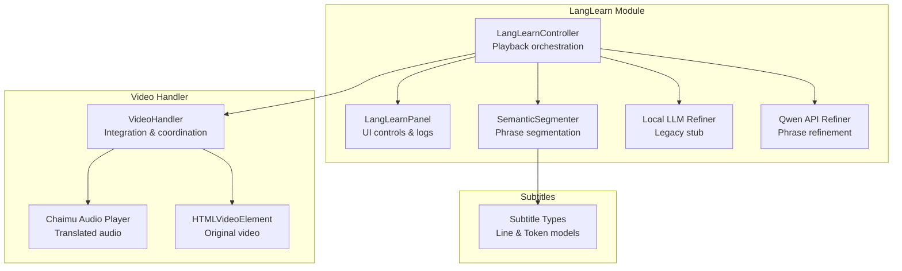
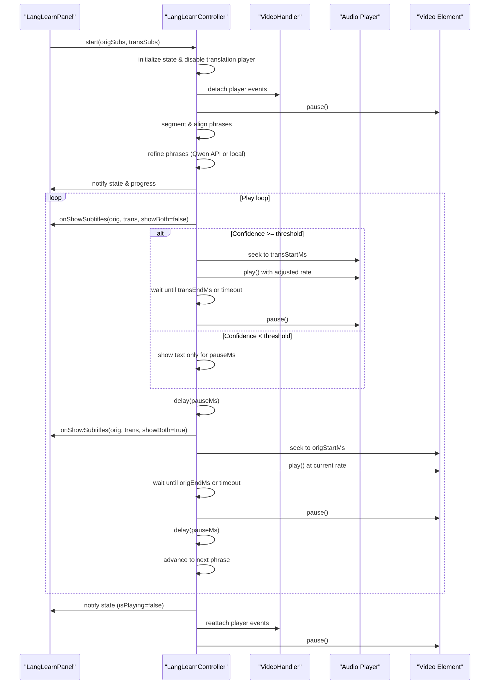
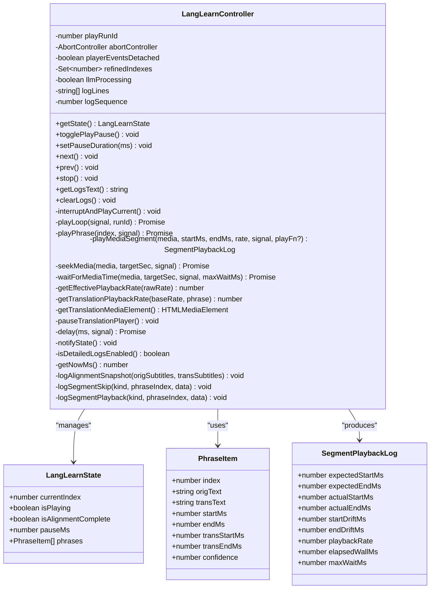
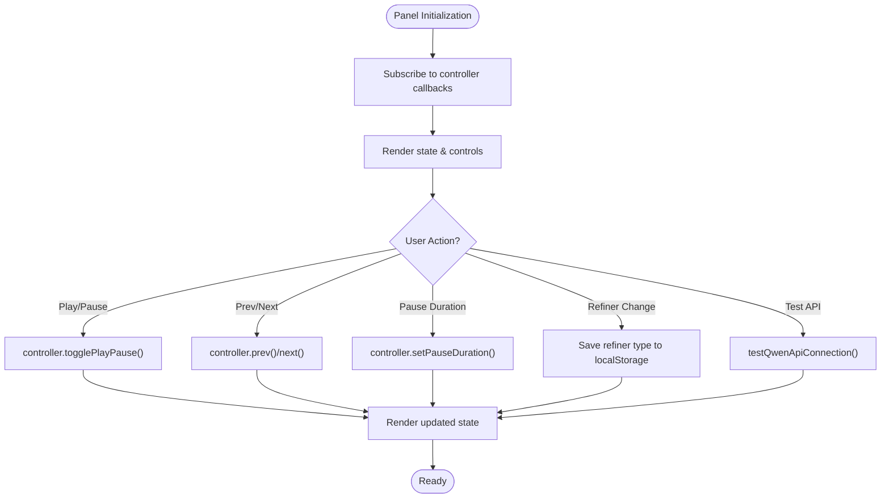
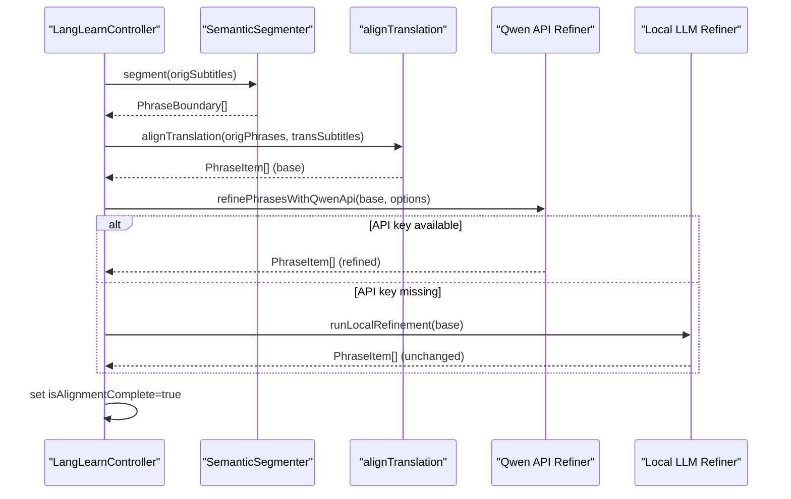
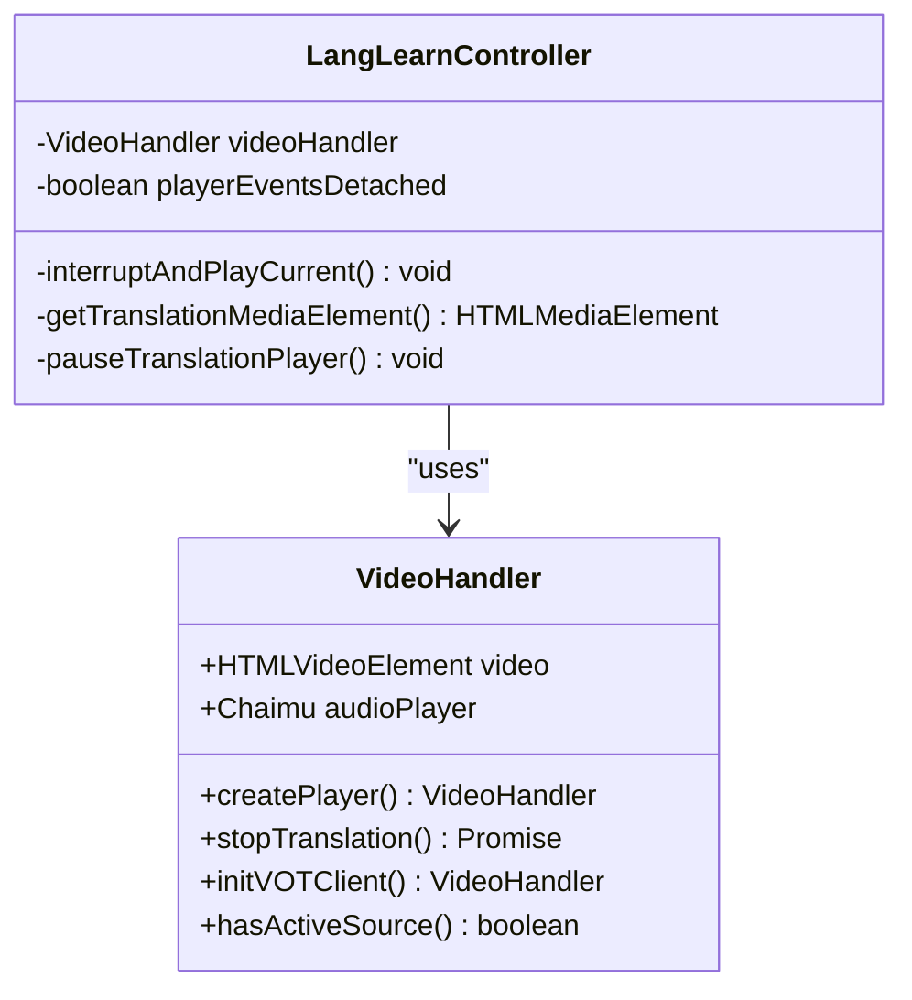
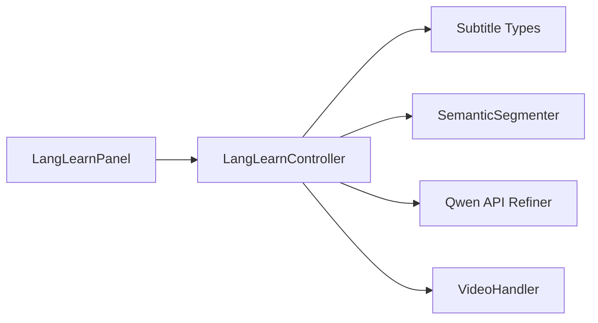

# Learning Controller & Playback

<cite>
**Referenced Files in This Document**
- [LangLearnController.ts](file://src/langLearn/LangLearnController.ts)
- [LangLearnPanel.ts](file://src/langLearn/LangLearnPanel.ts)
- [semanticSegmenter.ts](file://src/langLearn/phraseSegmenter/semanticSegmenter.ts)
- [localLLMRefiner.ts](file://src/langLearn/phraseSegmenter/localLLMRefiner.ts)
- [qwenApiRefiner.ts](file://src/langLearn/phraseSegmenter/qwenApiRefiner.ts)
- [types.ts](file://src/subtitles/types.ts)
- [index.ts](file://src/index.ts)
- [shared.ts](file://src/videoHandler/shared.ts)
</cite>

## Table of Contents
1. [Introduction](#introduction)
2. [Project Structure](#project-structure)
3. [Core Components](#core-components)
4. [Architecture Overview](#architecture-overview)
5. [Detailed Component Analysis](#detailed-component-analysis)
6. [Dependency Analysis](#dependency-analysis)
7. [Performance Considerations](#performance-considerations)
8. [Troubleshooting Guide](#troubleshooting-guide)
9. [Conclusion](#conclusion)

## Introduction
This document provides comprehensive technical documentation for the LangLearnController class and its playback coordination system. It explains the state management architecture, phrase indexing, play/pause control, synchronization mechanisms, and the dual-mode playback system that alternates between translated audio and original video segments. It also covers confidence-based fallback mechanisms, adaptive playback rate adjustment, logging and debugging systems, and integration with video handler components and audio player coordination.

## Project Structure
The learning controller resides in the langLearn module alongside supporting phrase segmentation and refinement utilities. The UI panel provides interactive controls and displays playback logs. The video handler integrates audio player coordination and manages video lifecycle.

**Diagram sources**
- [LangLearnController.ts:1-851](file://src/langLearn/LangLearnController.ts#L1-L851)
- [LangLearnPanel.ts:1-559](file://src/langLearn/LangLearnPanel.ts#L1-L559)
- [semanticSegmenter.ts:1-1488](file://src/langLearn/phraseSegmenter/semanticSegmenter.ts#L1-L1488)
- [localLLMRefiner.ts:1-60](file://src/langLearn/phraseSegmenter/localLLMRefiner.ts#L1-L60)
- [qwenApiRefiner.ts:1-604](file://src/langLearn/phraseSegmenter/qwenApiRefiner.ts#L1-L604)
- [types.ts:1-52](file://src/subtitles/types.ts#L1-L52)
- [index.ts:114-520](file://src/index.ts#L114-L520)

**Section sources**
- [LangLearnController.ts:1-851](file://src/langLearn/LangLearnController.ts#L1-L851)
- [LangLearnPanel.ts:1-559](file://src/langLearn/LangLearnPanel.ts#L1-L559)
- [semanticSegmenter.ts:1-1488](file://src/langLearn/phraseSegmenter/semanticSegmenter.ts#L1-L1488)
- [qwenApiRefiner.ts:1-604](file://src/langLearn/phraseSegmenter/qwenApiRefiner.ts#L1-L604)
- [types.ts:1-52](file://src/subtitles/types.ts#L1-L52)
- [index.ts:114-520](file://src/index.ts#L114-L520)

## Core Components
- LangLearnController: Central state machine managing phrase playback, alignment refinement, and synchronization with video/audio players.
- LangLearnPanel: UI panel providing controls, progress feedback, and playback logs.
- SemanticSegmenter: Produces initial phrase boundaries from subtitle lines.
- Qwen API Refiner: Enhances phrase segmentation using Qwen-3.5-Omni API with confidence scoring.
- Local LLM Refiner: Legacy stub; replaced by Qwen API refiner.
- VideoHandler: Integrates audio player and video element, coordinates playback events.

**Section sources**
- [LangLearnController.ts:25-82](file://src/langLearn/LangLearnController.ts#L25-L82)
- [LangLearnPanel.ts:7-61](file://src/langLearn/LangLearnPanel.ts#L7-L61)
- [semanticSegmenter.ts:9-18](file://src/langLearn/phraseSegmenter/semanticSegmenter.ts#L9-L18)
- [qwenApiRefiner.ts:11-20](file://src/langLearn/phraseSegmenter/qwenApiRefiner.ts#L11-L20)
- [localLLMRefiner.ts:10-41](file://src/langLearn/phraseSegmenter/localLLMRefiner.ts#L10-L41)
- [index.ts:114-520](file://src/index.ts#L114-L520)

## Architecture Overview
The learning controller orchestrates a dual-mode playback loop:
1. Translated audio playback: Plays translated audio from the extension’s audio player with confidence-aware fallbacks.
2. Original video playback: Plays the original video segment with synchronized subtitles.
3. Pause intervals: Configurable pauses between segments and between modes.

It integrates tightly with the VideoHandler to coordinate:
- Seeking and timing control for both audio and video.
- Event detachment and reattachment to prevent interference with normal translation playback.
- Volume ducking and audio player lifecycle management.

**Diagram sources**
- [LangLearnController.ts:91-203](file://src/langLearn/LangLearnController.ts#L91-L203)
- [LangLearnController.ts:343-500](file://src/langLearn/LangLearnController.ts#L343-L500)
- [LangLearnController.ts:526-578](file://src/langLearn/LangLearnController.ts#L526-L578)
- [LangLearnController.ts:622-665](file://src/langLearn/LangLearnController.ts#L622-L665)
- [LangLearnController.ts:682-690](file://src/langLearn/LangLearnController.ts#L682-L690)
- [LangLearnPanel.ts:40-61](file://src/langLearn/LangLearnPanel.ts#L40-L61)
- [index.ts:114-520](file://src/index.ts#L114-L520)

## Detailed Component Analysis

### LangLearnController
The controller encapsulates the entire learning playback pipeline with robust state management and error handling.

- State Management
  - LangLearnState includes current index, play/pause flag, alignment completion, pause duration, and phrase list.
  - Run IDs ensure safe cancellation of stale playback runs.
  - Refinement tracking via refinedIndexes supports incremental updates.

- Playback Loop
  - playLoop iterates phrases, invoking playPhrase for each.
  - Interrupts occur on user actions or state changes via AbortController.
  - Automatic stop at end of phrase list.

- Dual-Mode Playback
  - Mode 1: Translated audio playback with confidence-based fallback.
  - Mode 2: Original video playback with synchronized subtitles.
  - Pause intervals configurable via setPauseDuration.

- Timing Control
  - playMediaSegment handles seeking, play/pause, and precise timing waits.
  - waitForMediaTime ensures segments end within tolerance.
  - getEffectivePlaybackRate and getTranslationPlaybackRate adjust rates for compression/expansion.

- Synchronization
  - getTranslationMediaElement locates the audio element from the audio player.
  - pauseTranslationPlayer ensures translated audio stops when switching modes.
  - Event detachment prevents interference with normal translation playback.

- Logging and Debugging
  - appendLog stores structured logs with sequence numbers.
  - Detailed logs can be toggled via localStorage flag.
  - Alignment snapshots and segment playback metrics recorded.

- Integration Points
  - start integrates with VideoHandler to pause video and detach events.
  - stop restores events and resumes normal translation playback.

**Diagram sources**
- [LangLearnController.ts:25-82](file://src/langLearn/LangLearnController.ts#L25-L82)
- [LangLearnController.ts:45-851](file://src/langLearn/LangLearnController.ts#L45-L851)
- [semanticSegmenter.ts:9-18](file://src/langLearn/phraseSegmenter/semanticSegmenter.ts#L9-L18)

**Section sources**
- [LangLearnController.ts:25-82](file://src/langLearn/LangLearnController.ts#L25-L82)
- [LangLearnController.ts:45-851](file://src/langLearn/LangLearnController.ts#L45-L851)

### LangLearnPanel
The panel provides a user interface for controlling the learning session and monitoring progress.

- Controls
  - Previous/Next navigation, Play/Pause toggle, and pause duration setting.
  - LLM refiner selection (Qwen API, Local WebGPU, None).
  - API key configuration and connection testing for Qwen.

- Rendering
  - Displays current phrase, alignment status, and progress bar.
  - Shows both original and translated subtitles overlay with safe area adjustments.
  - Logs display with copy/clear actions.

- Integration
  - Subscribes to controller callbacks for state, phrase, subtitles, and logs.
  - Temporarily hides normal VOT subtitles to avoid duplication.

**Diagram sources**
- [LangLearnPanel.ts:40-61](file://src/langLearn/LangLearnPanel.ts#L40-L61)
- [LangLearnPanel.ts:336-362](file://src/langLearn/LangLearnPanel.ts#L336-L362)
- [LangLearnPanel.ts:518-538](file://src/langLearn/LangLearnPanel.ts#L518-L538)

**Section sources**
- [LangLearnPanel.ts:40-61](file://src/langLearn/LangLearnPanel.ts#L40-L61)
- [LangLearnPanel.ts:336-362](file://src/langLearn/LangLearnPanel.ts#L336-L362)
- [LangLearnPanel.ts:518-538](file://src/langLearn/LangLearnPanel.ts#L518-L538)

### Phrase Segmentation and Refinement
- SemanticSegmenter
  - Produces phrase boundaries from subtitle lines with punctuation-aware splitting and semantic completeness enforcement.
  - Ensures non-overlapping phrases and merges micro-phrases when appropriate.

- Qwen API Refiner
  - Uses Qwen-3.5-Omni via OpenAI-compatible API to optimize phrase segmentation for language learning.
  - Computes confidence scores and redistributes timings across refined phrases.
  - Supports chunked processing to manage token limits and provides progress callbacks.

- Local LLM Refiner
  - Legacy stub; returns phrases unchanged. Primary refinement is performed by Qwen API refiner.

**Diagram sources**
- [semanticSegmenter.ts:730-745](file://src/langLearn/phraseSegmenter/semanticSegmenter.ts#L730-L745)
- [qwenApiRefiner.ts:385-520](file://src/langLearn/phraseSegmenter/qwenApiRefiner.ts#L385-L520)
- [localLLMRefiner.ts:32-41](file://src/langLearn/phraseSegmenter/localLLMRefiner.ts#L32-L41)
- [LangLearnController.ts:91-192](file://src/langLearn/LangLearnController.ts#L91-L192)

**Section sources**
- [semanticSegmenter.ts:730-745](file://src/langLearn/phraseSegmenter/semanticSegmenter.ts#L730-L745)
- [qwenApiRefiner.ts:385-520](file://src/langLearn/phraseSegmenter/qwenApiRefiner.ts#L385-L520)
- [localLLMRefiner.ts:32-41](file://src/langLearn/phraseSegmenter/localLLMRefiner.ts#L32-L41)
- [LangLearnController.ts:91-192](file://src/langLearn/LangLearnController.ts#L91-L192)

### Video Handler Integration
The controller relies on VideoHandler for:
- Audio player access and coordination.
- Video element control and event management.
- Detaching and reattaching player events to avoid conflicts with normal translation playback.

**Diagram sources**
- [index.ts:114-520](file://src/index.ts#L114-L520)
- [LangLearnController.ts:667-690](file://src/langLearn/LangLearnController.ts#L667-L690)
- [LangLearnController.ts:682-690](file://src/langLearn/LangLearnController.ts#L682-L690)

**Section sources**
- [index.ts:114-520](file://src/index.ts#L114-L520)
- [LangLearnController.ts:667-690](file://src/langLearn/LangLearnController.ts#L667-L690)
- [LangLearnController.ts:682-690](file://src/langLearn/LangLearnController.ts#L682-L690)

## Dependency Analysis
The controller depends on:
- Subtitle types for phrase items and timing.
- SemanticSegmenter for initial phrase boundaries.
- Qwen API Refiner for confidence-aware refinement.
- VideoHandler for audio/video coordination.

**Diagram sources**
- [LangLearnController.ts:1-7](file://src/langLearn/LangLearnController.ts#L1-L7)
- [types.ts:14-20](file://src/subtitles/types.ts#L14-L20)
- [semanticSegmenter.ts:730-745](file://src/langLearn/phraseSegmenter/semanticSegmenter.ts#L730-L745)
- [qwenApiRefiner.ts:385-520](file://src/langLearn/phraseSegmenter/qwenApiRefiner.ts#L385-L520)
- [index.ts:114-520](file://src/index.ts#L114-L520)

**Section sources**
- [LangLearnController.ts:1-7](file://src/langLearn/LangLearnController.ts#L1-L7)
- [types.ts:14-20](file://src/subtitles/types.ts#L14-L20)
- [semanticSegmenter.ts:730-745](file://src/langLearn/phraseSegmenter/semanticSegmenter.ts#L730-L745)
- [qwenApiRefiner.ts:385-520](file://src/langLearn/phraseSegmenter/qwenApiRefiner.ts#L385-L520)
- [index.ts:114-520](file://src/index.ts#L114-L520)

## Performance Considerations
- Timing Precision: The controller uses tolerance-based seeking and timeupdate/ended event listeners to minimize drift.
- Adaptive Rate Adjustment: Translation playback rate is adjusted to match target durations, preventing excessive compression/expansion.
- Chunked API Calls: Qwen API refiner processes phrases in chunks to respect token limits and reduce latency spikes.
- Incremental Refinement: Progressively updates refinedIndexes and notifies UI to reflect ongoing improvements.
- Event Detachment: Prevents redundant event handling and reduces overhead during intensive playback sessions.

[No sources needed since this section provides general guidance]

## Troubleshooting Guide
Common issues and recovery strategies:

- API Key Not Configured
  - Symptom: Qwen API refiner skips refinement and falls back to local.
  - Resolution: Configure API key in UI or localStorage; test connection via panel.
  - Recovery: Retry refinement after configuration.

- Low Confidence Alignment
  - Symptom: Text-only mode shown for a phrase.
  - Cause: confidence < threshold.
  - Recovery: Adjust subtitles or improve translation quality; refinement may increase confidence.

- Playback Drift or Early Termination
  - Symptom: Segment ends earlier than expected.
  - Cause: Timing tolerance exceeded or media not reaching target time.
  - Recovery: Verify playback rate adjustments and ensure media availability.

- Stuck in LLM Processing
  - Symptom: Controller waits for refinement of subsequent phrases.
  - Cause: Long processing or network delays.
  - Recovery: Increase timeouts or switch to local refinement; check logs for chunk progress.

- Events Interference
  - Symptom: Normal translation playback conflicts with learning mode.
  - Recovery: Controller detaches events automatically; ensure stop() is called to reattach.

**Section sources**
- [LangLearnController.ts:141-163](file://src/langLearn/LangLearnController.ts#L141-L163)
- [LangLearnController.ts:423-441](file://src/langLearn/LangLearnController.ts#L423-L441)
- [LangLearnController.ts:362-375](file://src/langLearn/LangLearnController.ts#L362-L375)
- [LangLearnController.ts:580-620](file://src/langLearn/LangLearnController.ts#L580-L620)
- [LangLearnController.ts:103-106](file://src/langLearn/LangLearnController.ts#L103-L106)
- [LangLearnController.ts:326-330](file://src/langLearn/LangLearnController.ts#L326-L330)

## Conclusion
The LangLearnController provides a robust, configurable, and resilient learning playback system. Its dual-mode approach, confidence-aware fallbacks, and adaptive rate control enhance comprehension and retention. The integration with VideoHandler and audio player ensures smooth synchronization, while comprehensive logging and UI panels support monitoring and troubleshooting. The modular design with semantic segmentation and Qwen API refinement enables high-quality phrase alignment suitable for language learning.