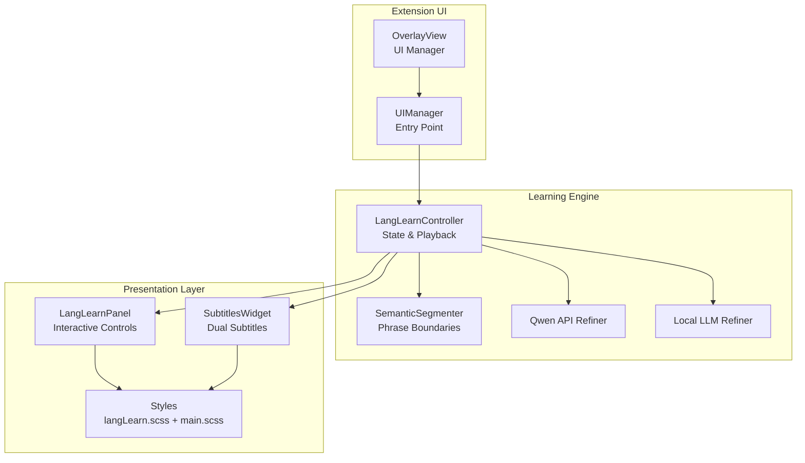
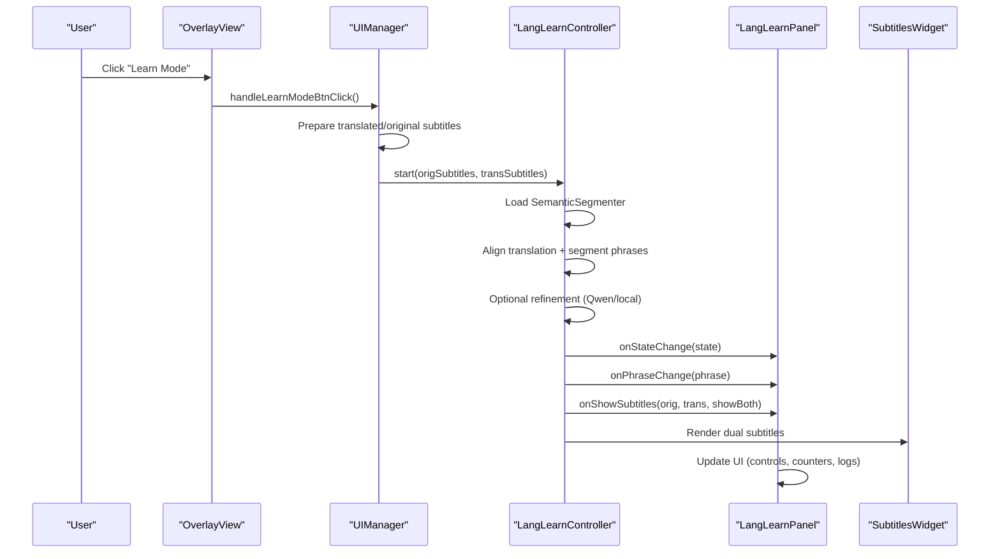
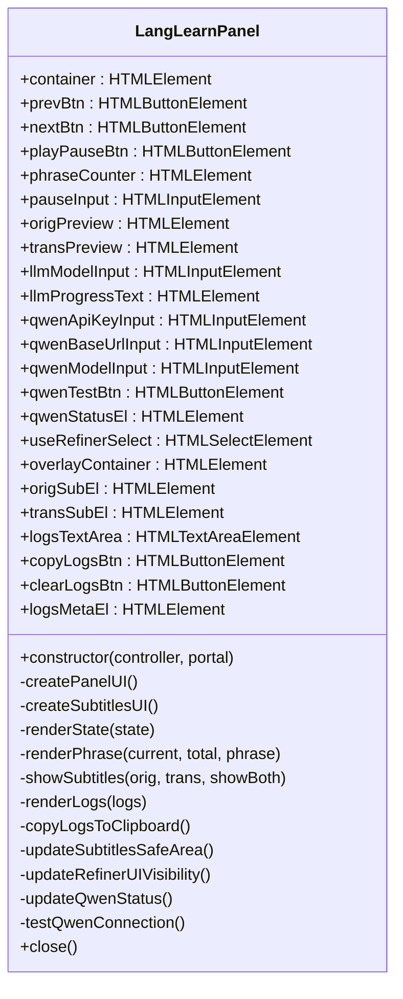
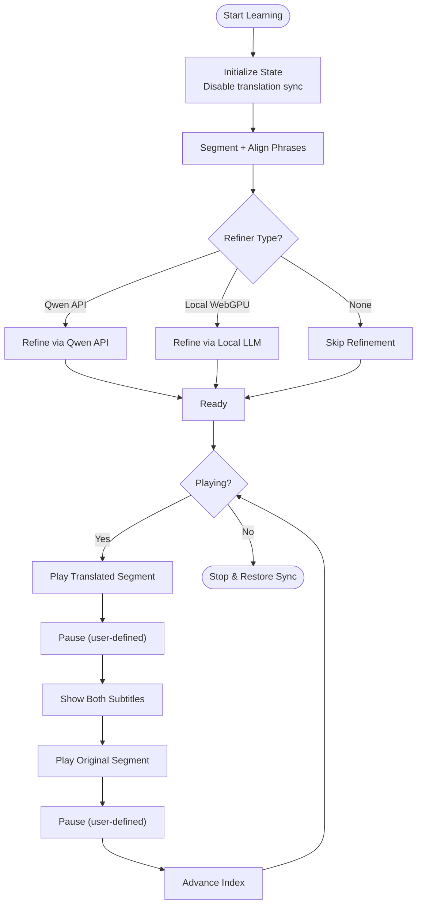
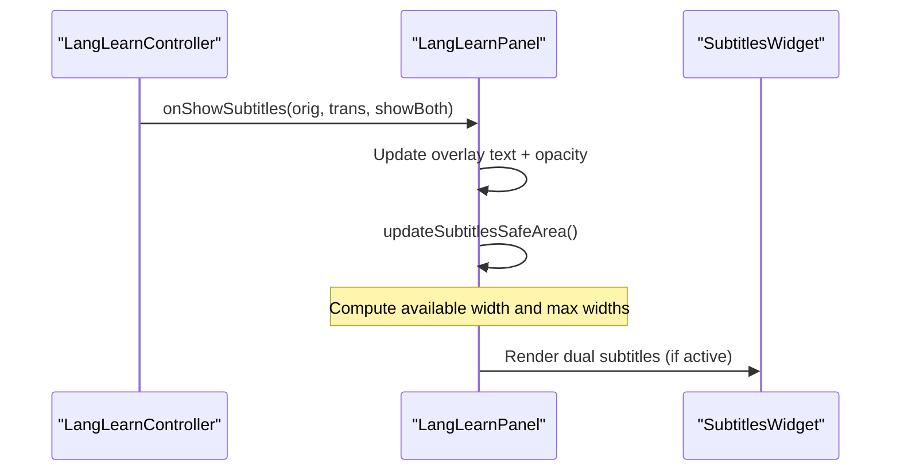
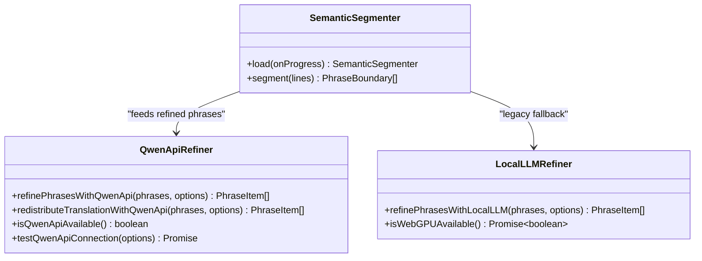
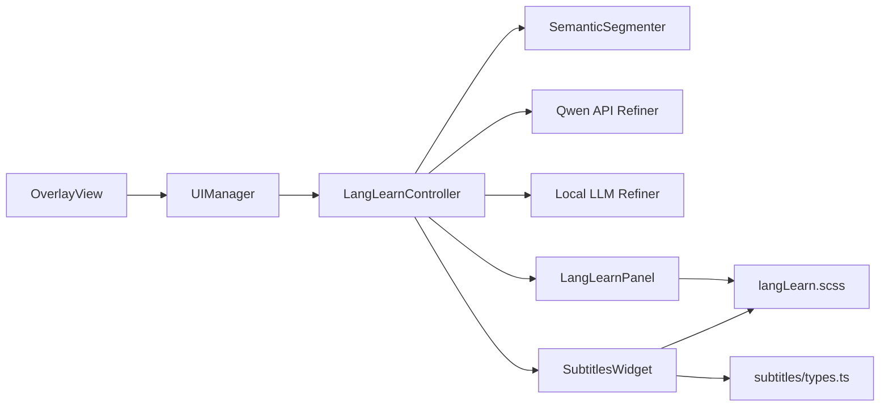

# Learning Interface Panel

<cite>
**Referenced Files in This Document**
- [LangLearnPanel.ts](file://src/langLearn/LangLearnPanel.ts)
- [LangLearnController.ts](file://src/langLearn/LangLearnController.ts)
- [langLearn.scss](file://src/styles/langLearn.scss)
- [widget.ts](file://src/subtitles/widget.ts)
- [types.ts](file://src/subtitles/types.ts)
- [semanticSegmenter.ts](file://src/langLearn/phraseSegmenter/semanticSegmenter.ts)
- [qwenApiRefiner.ts](file://src/langLearn/phraseSegmenter/qwenApiRefiner.ts)
- [localLLMRefiner.ts](file://src/langLearn/phraseSegmenter/localLLMRefiner.ts)
- [manager.ts](file://src/ui/manager.ts)
- [overlay.ts](file://src/ui/views/overlay.ts)
- [main.scss](file://src/styles/main.scss)
</cite>

## Table of Contents
1. [Introduction](#introduction)
2. [Project Structure](#project-structure)
3. [Core Components](#core-components)
4. [Architecture Overview](#architecture-overview)
5. [Detailed Component Analysis](#detailed-component-analysis)
6. [Dependency Analysis](#dependency-analysis)
7. [Performance Considerations](#performance-considerations)
8. [Troubleshooting Guide](#troubleshooting-guide)
9. [Conclusion](#conclusion)
10. [Appendices](#appendices)

## Introduction
This document describes the Language Learning Interface Panel, a specialized UI component that enables immersive language learning during video playback. It integrates with the LangLearnController to orchestrate phrase-based learning sessions, manage real-time playback, and synchronize dual subtitles (original and translated). The panel provides interactive controls for navigation, pause duration adjustment, and playback control, along with a robust subtitle display system and responsive design. It also supports user preferences, theme integration, and accessibility features.

## Project Structure
The Language Learning Panel spans several modules:
- UI panel and styling: LangLearnPanel and langLearn.scss
- Playback and state management: LangLearnController
- Subtitle rendering and positioning: SubtitlesWidget and subtitle types
- Phrase segmentation and refinement: SemanticSegmenter and Qwen/Local LLM refiners
- Extension integration: UIManager and OverlayView
- Global theming and accessibility: main.scss

**Diagram sources**
- [manager.ts:56-138](file://src/ui/manager.ts#L56-L138)
- [overlay.ts:29-116](file://src/ui/views/overlay.ts#L29-L116)
- [LangLearnController.ts:45-85](file://src/langLearn/LangLearnController.ts#L45-L85)
- [semanticSegmenter.ts:730-745](file://src/langLearn/phraseSegmenter/semanticSegmenter.ts#L730-L745)
- [qwenApiRefiner.ts:385-519](file://src/langLearn/phraseSegmenter/qwenApiRefiner.ts#L385-L519)
- [localLLMRefiner.ts:32-41](file://src/langLearn/phraseSegmenter/localLLMRefiner.ts#L32-L41)
- [LangLearnPanel.ts:7-61](file://src/langLearn/LangLearnPanel.ts#L7-L61)
- [widget.ts:110-239](file://src/subtitles/widget.ts#L110-L239)
- [langLearn.scss:1-357](file://src/styles/langLearn.scss#L1-L357)
- [main.scss:27-180](file://src/styles/main.scss#L27-L180)

**Section sources**
- [manager.ts:56-138](file://src/ui/manager.ts#L56-L138)
- [overlay.ts:29-116](file://src/ui/views/overlay.ts#L29-L116)
- [LangLearnPanel.ts:7-61](file://src/langLearn/LangLearnPanel.ts#L7-L61)
- [langLearn.scss:1-357](file://src/styles/langLearn.scss#L1-L357)
- [widget.ts:110-239](file://src/subtitles/widget.ts#L110-L239)
- [semanticSegmenter.ts:730-745](file://src/langLearn/phraseSegmenter/semanticSegmenter.ts#L730-L745)
- [qwenApiRefiner.ts:385-519](file://src/langLearn/phraseSegmenter/qwenApiRefiner.ts#L385-L519)
- [localLLMRefiner.ts:32-41](file://src/langLearn/phraseSegmenter/localLLMRefiner.ts#L32-L41)
- [main.scss:27-180](file://src/styles/main.scss#L27-L180)

## Core Components
- LangLearnPanel: Renders the learning panel UI, handles user interactions (navigation, pause duration, playback), manages subtitle overlay, and displays logs and LLM progress.
- LangLearnController: Manages learning state, orchestrates phrase segmentation and refinement, controls playback loops, and emits real-time updates.
- SubtitlesWidget: Renders dual subtitles (original and translated) with smart layout, positioning, and responsive behavior.
- SemanticSegmenter: Produces phrase boundaries from subtitle lines and aligns translations.
- Qwen/Local LLM Refiners: Optimize phrase segmentation for language learning using external APIs or local models.
- UIManager/OverlayView: Integrates the panel into the extension’s overlay UI and triggers learning mode.

**Section sources**
- [LangLearnPanel.ts:7-61](file://src/langLearn/LangLearnPanel.ts#L7-L61)
- [LangLearnController.ts:25-85](file://src/langLearn/LangLearnController.ts#L25-L85)
- [widget.ts:110-239](file://src/subtitles/widget.ts#L110-L239)
- [semanticSegmenter.ts:730-745](file://src/langLearn/phraseSegmenter/semanticSegmenter.ts#L730-L745)
- [qwenApiRefiner.ts:385-519](file://src/langLearn/phraseSegmenter/qwenApiRefiner.ts#L385-L519)
- [localLLMRefiner.ts:32-41](file://src/langLearn/phraseSegmenter/localLLMRefiner.ts#L32-L41)
- [manager.ts:56-138](file://src/ui/manager.ts#L56-L138)
- [overlay.ts:29-116](file://src/ui/views/overlay.ts#L29-L116)

## Architecture Overview
The panel architecture follows a unidirectional data flow:
- UIManager/OverlayView initiates learning mode and prepares subtitle data.
- LangLearnController loads phrase boundaries, optionally refines them via Qwen or local LLM, and runs the playback loop.
- LangLearnPanel subscribes to state changes and renders UI, logs, and subtitle overlays.
- SubtitlesWidget renders synchronized original and translated text with responsive layout.

**Diagram sources**
- [overlay.ts:504-520](file://src/ui/views/overlay.ts#L504-L520)
- [manager.ts:541-624](file://src/ui/manager.ts#L541-L624)
- [LangLearnController.ts:91-203](file://src/langLearn/LangLearnController.ts#L91-L203)
- [LangLearnPanel.ts:40-61](file://src/langLearn/LangLearnPanel.ts#L40-L61)
- [widget.ts:110-239](file://src/subtitles/widget.ts#L110-L239)

## Detailed Component Analysis

### LangLearnPanel: Interactive Controls and Real-Time Updates
- Container and header: Fixed-position panel with close button and title.
- Navigation controls: Previous, Play/Pause, Next, and phrase counter reflecting current index and total.
- Pause duration setting: Numeric input bound to controller state.
- Preview area: Shows current original and translated texts.
- LLM settings: Refiner selection (Qwen API, Local WebGPU, None), API key/base URL/model inputs, connection test, and progress indicator.
- Logs panel: Copy/clear actions, line count metadata, and editable textarea.
- Subtitles overlay: Dual subtitle display with opacity control for simultaneous viewing.

**Diagram sources**
- [LangLearnPanel.ts:7-61](file://src/langLearn/LangLearnPanel.ts#L7-L61)
- [LangLearnPanel.ts:63-390](file://src/langLearn/LangLearnPanel.ts#L63-L390)
- [LangLearnPanel.ts:392-488](file://src/langLearn/LangLearnPanel.ts#L392-L488)
- [LangLearnPanel.ts:540-559](file://src/langLearn/LangLearnPanel.ts#L540-L559)

**Section sources**
- [LangLearnPanel.ts:63-390](file://src/langLearn/LangLearnPanel.ts#L63-L390)
- [LangLearnPanel.ts:392-488](file://src/langLearn/LangLearnPanel.ts#L392-L488)
- [LangLearnPanel.ts:540-559](file://src/langLearn/LangLearnPanel.ts#L540-L559)

### LangLearnController: Playback Loop and State Management
- State model: Tracks current index, play status, alignment completion, pause duration, and phrase list.
- Initialization: Pauses video, disables translation syncing, segments and aligns phrases, and optionally refines via Qwen or local LLM.
- Playback loop: Iterates phrases, plays translated segment, pauses, shows both subtitles, plays original segment, pauses again, then advances.
- Timing and rate control: Adjusts playback rate to match translation duration and maintains synchronization.
- Progress callbacks: Emits refinement progress and logs for UI feedback.
- Real-time events: Notifies UI of state changes, phrase updates, subtitle display, and logs.

**Diagram sources**
- [LangLearnController.ts:91-203](file://src/langLearn/LangLearnController.ts#L91-L203)
- [LangLearnController.ts:281-331](file://src/langLearn/LangLearnController.ts#L281-L331)
- [LangLearnController.ts:361-500](file://src/langLearn/LangLearnController.ts#L361-L500)
- [LangLearnController.ts:502-690](file://src/langLearn/LangLearnController.ts#L502-L690)

**Section sources**
- [LangLearnController.ts:25-85](file://src/langLearn/LangLearnController.ts#L25-L85)
- [LangLearnController.ts:91-203](file://src/langLearn/LangLearnController.ts#L91-L203)
- [LangLearnController.ts:281-331](file://src/langLearn/LangLearnController.ts#L281-L331)
- [LangLearnController.ts:361-500](file://src/langLearn/LangLearnController.ts#L361-L500)
- [LangLearnController.ts:502-690](file://src/langLearn/LangLearnController.ts#L502-L690)

### Subtitle Display System: Original and Translated Synchronization
- Dual overlay: Separate elements for original and translated text with distinct styling.
- Opacity control: Toggle to show both or only translated text.
- Responsive sizing: Computes maximum widths and safe areas based on viewport and panel position.
- Integration: Temporarily hides the extension’s default subtitles to prevent duplication.

**Diagram sources**
- [LangLearnController.ts:420-473](file://src/langLearn/LangLearnController.ts#L420-L473)
- [LangLearnPanel.ts:429-441](file://src/langLearn/LangLearnPanel.ts#L429-L441)
- [LangLearnPanel.ts:466-488](file://src/langLearn/LangLearnPanel.ts#L466-L488)
- [widget.ts:110-239](file://src/subtitles/widget.ts#L110-L239)

**Section sources**
- [LangLearnController.ts:420-473](file://src/langLearn/LangLearnController.ts#L420-L473)
- [LangLearnPanel.ts:429-441](file://src/langLearn/LangLearnPanel.ts#L429-L441)
- [LangLearnPanel.ts:466-488](file://src/langLearn/LangLearnPanel.ts#L466-L488)
- [widget.ts:110-239](file://src/subtitles/widget.ts#L110-L239)

### Phrase Segmentation and Refinement
- SemanticSegmenter: Produces phrase boundaries from subtitle lines and aligns translations with confidence scores.
- Qwen API Refiner: Optimizes phrase segmentation using an OpenAI-compatible API, redistributes translation text, and returns refined timings.
- Local LLM Refiner: Legacy stub; actual refinement is handled by Qwen API.

**Diagram sources**
- [semanticSegmenter.ts:730-745](file://src/langLearn/phraseSegmenter/semanticSegmenter.ts#L730-L745)
- [qwenApiRefiner.ts:385-519](file://src/langLearn/phraseSegmenter/qwenApiRefiner.ts#L385-L519)
- [localLLMRefiner.ts:32-41](file://src/langLearn/phraseSegmenter/localLLMRefiner.ts#L32-L41)

**Section sources**
- [semanticSegmenter.ts:730-745](file://src/langLearn/phraseSegmenter/semanticSegmenter.ts#L730-L745)
- [qwenApiRefiner.ts:385-519](file://src/langLearn/phraseSegmenter/qwenApiRefiner.ts#L385-L519)
- [localLLMRefiner.ts:32-41](file://src/langLearn/phraseSegmenter/localLLMRefiner.ts#L32-L41)

### User Interaction Patterns
- Manual phrase navigation: Previous/Next buttons advance or retreat the current phrase index.
- Pause duration adjustment: Numeric input updates controller pauseMs and reflects in UI.
- Playback control: Toggle Play/Pause to start or interrupt the learning loop.
- Logs management: Copy logs to clipboard or clear logs; metadata shows line counts.
- Refiner configuration: Choose between Qwen API, Local WebGPU, or None; test API connectivity.

**Section sources**
- [LangLearnPanel.ts:77-108](file://src/langLearn/LangLearnPanel.ts#L77-L108)
- [LangLearnPanel.ts:104-106](file://src/langLearn/LangLearnPanel.ts#L104-L106)
- [LangLearnPanel.ts:123-334](file://src/langLearn/LangLearnPanel.ts#L123-L334)
- [LangLearnPanel.ts:364-387](file://src/langLearn/LangLearnPanel.ts#L364-L387)
- [LangLearnPanel.ts:443-464](file://src/langLearn/LangLearnPanel.ts#L443-L464)
- [LangLearnPanel.ts:518-538](file://src/langLearn/LangLearnPanel.ts#L518-L538)

### Theme Integration and Accessibility
- Theming: Uses CSS variables from main.scss for primary/surface colors, typography, spacing, and shadows; langLearn.scss defines panel-specific styles and animations.
- Accessibility: Focus management, reduced motion support, and keyboard navigation via global classes; tooltips and ARIA attributes in overlay components.

**Section sources**
- [main.scss:27-180](file://src/styles/main.scss#L27-L180)
- [langLearn.scss:1-357](file://src/styles/langLearn.scss#L1-L357)
- [overlay.ts:428-434](file://src/ui/views/overlay.ts#L428-L434)

## Dependency Analysis
- UIManager/OverlayView triggers learning mode and prepares subtitle data.
- LangLearnController depends on SemanticSegmenter, Qwen API Refiner, and Local LLM Refiner.
- LangLearnPanel depends on LangLearnController and SubtitlesWidget.
- SubtitlesWidget depends on subtitle types and layout/position utilities.

**Diagram sources**
- [overlay.ts:504-520](file://src/ui/views/overlay.ts#L504-L520)
- [manager.ts:541-624](file://src/ui/manager.ts#L541-L624)
- [LangLearnController.ts:91-203](file://src/langLearn/LangLearnController.ts#L91-L203)
- [semanticSegmenter.ts:730-745](file://src/langLearn/phraseSegmenter/semanticSegmenter.ts#L730-L745)
- [qwenApiRefiner.ts:385-519](file://src/langLearn/phraseSegmenter/qwenApiRefiner.ts#L385-L519)
- [localLLMRefiner.ts:32-41](file://src/langLearn/phraseSegmenter/localLLMRefiner.ts#L32-L41)
- [LangLearnPanel.ts:7-61](file://src/langLearn/LangLearnPanel.ts#L7-L61)
- [widget.ts:110-239](file://src/subtitles/widget.ts#L110-L239)
- [types.ts:1-52](file://src/subtitles/types.ts#L1-L52)
- [langLearn.scss:1-357](file://src/styles/langLearn.scss#L1-L357)

**Section sources**
- [overlay.ts:504-520](file://src/ui/views/overlay.ts#L504-L520)
- [manager.ts:541-624](file://src/ui/manager.ts#L541-L624)
- [LangLearnController.ts:91-203](file://src/langLearn/LangLearnController.ts#L91-L203)
- [semanticSegmenter.ts:730-745](file://src/langLearn/phraseSegmenter/semanticSegmenter.ts#L730-L745)
- [qwenApiRefiner.ts:385-519](file://src/langLearn/phraseSegmenter/qwenApiRefiner.ts#L385-L519)
- [localLLMRefiner.ts:32-41](file://src/langLearn/phraseSegmenter/localLLMRefiner.ts#L32-L41)
- [LangLearnPanel.ts:7-61](file://src/langLearn/LangLearnPanel.ts#L7-L61)
- [widget.ts:110-239](file://src/subtitles/widget.ts#L110-L239)
- [types.ts:1-52](file://src/subtitles/types.ts#L1-L52)
- [langLearn.scss:1-357](file://src/styles/langLearn.scss#L1-L357)

## Performance Considerations
- Playback synchronization: Uses precise seeking and timing checks to minimize drift; adjusts playback rate to match translation duration.
- Refinement batching: Processes phrases in chunks to avoid token limits and reduce latency.
- UI updates: Debounces state notifications and uses efficient DOM updates for counters and logs.
- Responsive layout: Computes safe areas and widths dynamically to avoid layout thrashing.

[No sources needed since this section provides general guidance]

## Troubleshooting Guide
- API connectivity: Use the built-in test button to validate Qwen API configuration; status updates indicate success or failure with latency.
- Logs panel: Copy logs to clipboard for debugging; clear logs to reset state.
- Subtitles overlap: Ensure the extension’s default subtitles are hidden when the learning panel is active.
- Playback stalls: Verify translation audio is available and that the player events are detached/restored correctly.

**Section sources**
- [LangLearnPanel.ts:518-538](file://src/langLearn/LangLearnPanel.ts#L518-L538)
- [LangLearnPanel.ts:443-464](file://src/langLearn/LangLearnPanel.ts#L443-L464)
- [LangLearnPanel.ts:49-60](file://src/langLearn/LangLearnPanel.ts#L49-L60)
- [LangLearnController.ts:323-330](file://src/langLearn/LangLearnController.ts#L323-L330)

## Conclusion
The Language Learning Interface Panel provides a cohesive, accessible, and responsive learning experience. It integrates tightly with the LangLearnController to deliver synchronized dual subtitles, customizable phrase segmentation, and intuitive controls. The modular design allows easy extension and theming, while robust logging and diagnostics support ongoing development and user support.

## Appendices

### Customization Examples
- Theme integration: Override CSS variables in :root to adjust colors and typography; apply panel-specific styles via langLearn.scss.
- User preferences: Persist pause duration, refiner type, and API credentials in localStorage keys managed by the panel.
- Layout adjustments: Modify safe area calculations and subtitle max widths to fit diverse screen sizes.

**Section sources**
- [main.scss:27-74](file://src/styles/main.scss#L27-L74)
- [langLearn.scss:263-301](file://src/styles/langLearn.scss#L263-L301)
- [LangLearnPanel.ts:161-201](file://src/langLearn/LangLearnPanel.ts#L161-L201)
- [LangLearnPanel.ts:466-488](file://src/langLearn/LangLearnPanel.ts#L466-L488)