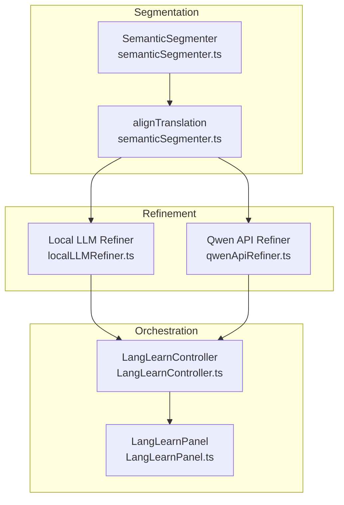
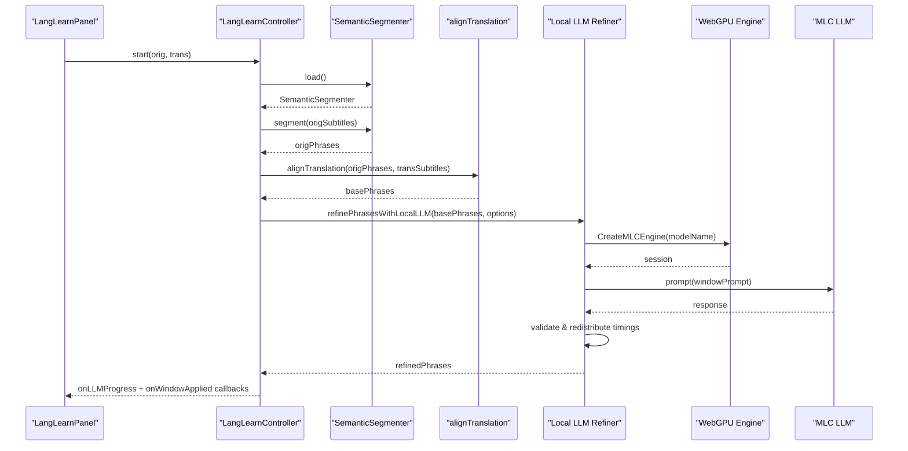
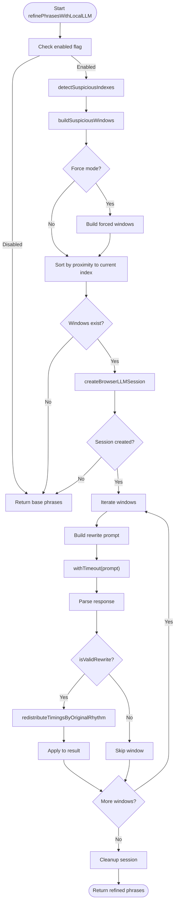
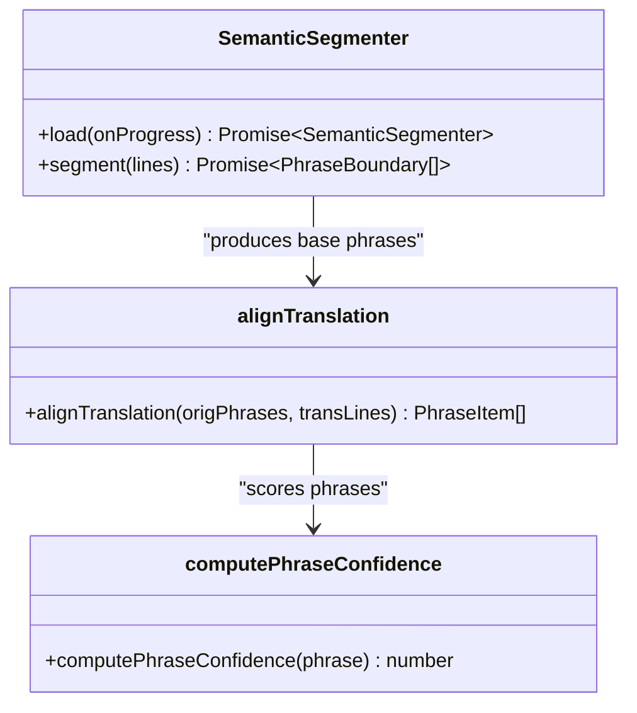
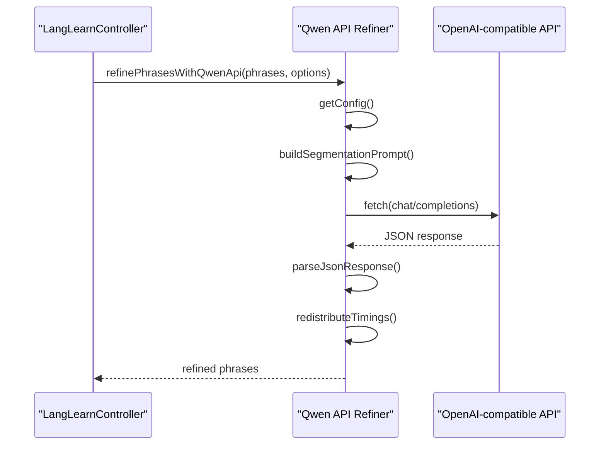
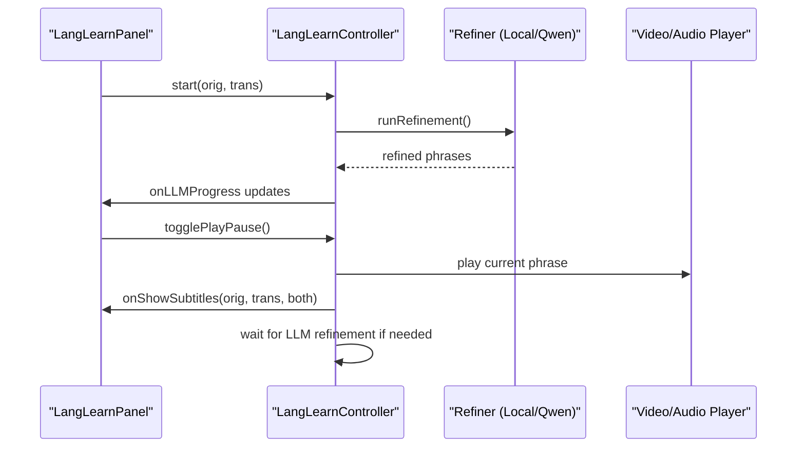
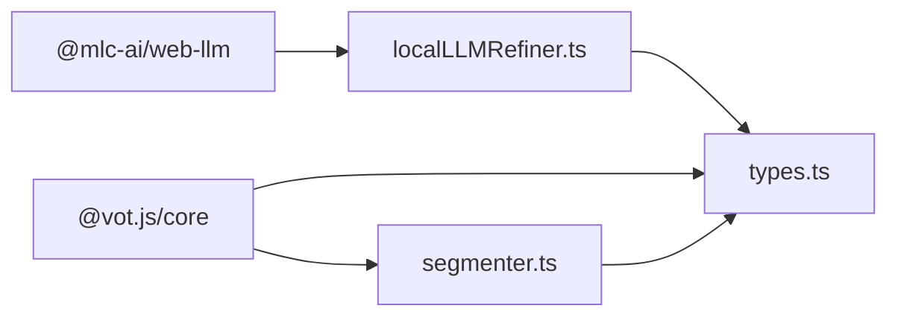

# Local LLM Phrase Refinement

<cite>
**Referenced Files in This Document**
- [localLLMRefiner.ts](file://src/langLearn/phraseSegmenter/localLLMRefiner.ts)
- [semanticSegmenter.ts](file://src/langLearn/phraseSegmenter/semanticSegmenter.ts)
- [qwenApiRefiner.ts](file://src/langLearn/phraseSegmenter/qwenApiRefiner.ts)
- [LangLearnController.ts](file://src/langLearn/LangLearnController.ts)
- [LangLearnPanel.ts](file://src/langLearn/LangLearnPanel.ts)
- [golden_cases.json](file://src/langLearn/phraseSegmenter/golden_cases.json)
- [localLLMRefiner.test.ts](file://src/langLearn/phraseSegmenter/localLLMRefiner.test.ts)
- [segmenter.ts](file://src/subtitles/segmenter.ts)
- [types.ts](file://src/subtitles/types.ts)
- [config.ts](file://src/config/config.ts)
- [package.json](file://package.json)
</cite>

## Table of Contents
1. [Introduction](#introduction)
2. [Project Structure](#project-structure)
3. [Core Components](#core-components)
4. [Architecture Overview](#architecture-overview)
5. [Detailed Component Analysis](#detailed-component-analysis)
6. [Dependency Analysis](#dependency-analysis)
7. [Performance Considerations](#performance-considerations)
8. [Troubleshooting Guide](#troubleshooting-guide)
9. [Conclusion](#conclusion)
10. [Appendices](#appendices)

## Introduction
This document explains the local Large Language Model (LLM) phrase refinement system used in the English Teacher module. It focuses on WebAssembly-based local AI processing that improves phrase segmentation accuracy through semantic analysis. The system integrates a WebGPU-powered LLM engine to refine Russian-to-English subtitle alignments, applying confidence thresholding, batch processing, and incremental refinement updates. It covers model integration, inference pipeline, performance characteristics, progress reporting, logging, error handling, and practical examples of refinement outcomes.

## Project Structure
The refinement system spans several modules:
- Phrase segmentation and alignment: semantic segmentation and translation alignment
- Local LLM refinement: WebGPU-based model inference
- Qwen API refinement: cloud-based alternative
- Controller orchestration: manages refinement, playback, and UI updates
- Panel UI: configuration and progress display
- Golden cases: curated examples for validation

**Diagram sources**
- [semanticSegmenter.ts:730-745](file://src/langLearn/phraseSegmenter/semanticSegmenter.ts#L730-L745)
- [semanticSegmenter.ts:1059-1243](file://src/langLearn/phraseSegmenter/semanticSegmenter.ts#L1059-L1243)
- [localLLMRefiner.ts:411-561](file://src/langLearn/phraseSegmenter/localLLMRefiner.ts#L411-L561)
- [qwenApiRefiner.ts:385-519](file://src/langLearn/phraseSegmenter/qwenApiRefiner.ts#L385-L519)
- [LangLearnController.ts:91-203](file://src/langLearn/LangLearnController.ts#L91-L203)
- [LangLearnPanel.ts:41-62](file://src/langLearn/LangLearnPanel.ts#L41-L62)

**Section sources**
- [semanticSegmenter.ts:730-745](file://src/langLearn/phraseSegmenter/semanticSegmenter.ts#L730-L745)
- [semanticSegmenter.ts:1059-1243](file://src/langLearn/phraseSegmenter/semanticSegmenter.ts#L1059-L1243)
- [localLLMRefiner.ts:411-561](file://src/langLearn/phraseSegmenter/localLLMRefiner.ts#L411-L561)
- [qwenApiRefiner.ts:385-519](file://src/langLearn/phraseSegmenter/qwenApiRefiner.ts#L385-L519)
- [LangLearnController.ts:91-203](file://src/langLearn/LangLearnController.ts#L91-L203)
- [LangLearnPanel.ts:41-62](file://src/langLearn/LangLearnPanel.ts#L41-L62)

## Core Components
- SemanticSegmenter: performs baseline segmentation and merges micro-phrases, computing confidence scores for each phrase.
- alignTranslation: maps original phrases to translated phrases, rebalances adjacent pairs, and computes final confidence.
- Local LLM Refiner: detects suspicious phrase pairs, builds windows, prompts the WebGPU LLM, validates outputs, redistributes timings, and applies incremental updates.
- Qwen API Refiner: provides an alternative cloud-based refinement pipeline with chunked processing and retry logic.
- LangLearnController: orchestrates segmentation, refinement selection, progress reporting, and playback with fallbacks.
- LangLearnPanel: exposes configuration UI for refiner selection, API keys, and model settings, plus progress visualization.

**Section sources**
- [semanticSegmenter.ts:730-745](file://src/langLearn/phraseSegmenter/semanticSegmenter.ts#L730-L745)
- [semanticSegmenter.ts:1059-1243](file://src/langLearn/phraseSegmenter/semanticSegmenter.ts#L1059-L1243)
- [localLLMRefiner.ts:411-561](file://src/langLearn/phraseSegmenter/localLLMRefiner.ts#L411-L561)
- [qwenApiRefiner.ts:385-519](file://src/langLearn/phraseSegmenter/qwenApiRefiner.ts#L385-L519)
- [LangLearnController.ts:91-203](file://src/langLearn/LangLearnController.ts#L91-L203)
- [LangLearnPanel.ts:124-331](file://src/langLearn/LangLearnPanel.ts#L124-L331)

## Architecture Overview
The refinement pipeline begins with semantic segmentation and alignment, then selects a refinement strategy. For local refinement, the system initializes a WebGPU-backed LLM session, identifies suspicious windows, prompts the model, validates responses, redistributes timings, and updates phrases incrementally. Progress and logs are emitted to the UI and controller.

**Diagram sources**
- [LangLearnController.ts:91-203](file://src/langLearn/LangLearnController.ts#L91-L203)
- [semanticSegmenter.ts:730-745](file://src/langLearn/phraseSegmenter/semanticSegmenter.ts#L730-L745)
- [semanticSegmenter.ts:1059-1243](file://src/langLearn/phraseSegmenter/semanticSegmenter.ts#L1059-L1243)
- [localLLMRefiner.ts:411-561](file://src/langLearn/phraseSegmenter/localLLMRefiner.ts#L411-L561)

## Detailed Component Analysis

### Local LLM Refiner
The local LLM refiner encapsulates the WebGPU-based refinement workflow:
- Environment detection: checks WebGPU availability and loads model name from storage.
- Suspicious detection: flags phrases with timing/word-count imbalances and incomplete endings.
- Window building: groups suspicious indexes into compact windows respecting size limits.
- Prompt construction: builds a concise instruction to redistribute Russian text across English segments.
- Validation: ensures response format and word-count ratios are acceptable.
- Timing redistribution: splits translation durations proportionally to original durations.
- Incremental updates: emits progress and applies refined windows to the phrase list.

**Diagram sources**
- [localLLMRefiner.ts:411-561](file://src/langLearn/phraseSegmenter/localLLMRefiner.ts#L411-L561)
- [localLLMRefiner.ts:256-305](file://src/langLearn/phraseSegmenter/localLLMRefiner.ts#L256-L305)
- [localLLMRefiner.ts:307-327](file://src/langLearn/phraseSegmenter/localLLMRefiner.ts#L307-L327)
- [localLLMRefiner.ts:329-348](file://src/langLearn/phraseSegmenter/localLLMRefiner.ts#L329-L348)
- [localLLMRefiner.ts:373-409](file://src/langLearn/phraseSegmenter/localLLMRefiner.ts#L373-L409)

**Section sources**
- [localLLMRefiner.ts:19-28](file://src/langLearn/phraseSegmenter/localLLMRefiner.ts#L19-L28)
- [localLLMRefiner.ts:213-239](file://src/langLearn/phraseSegmenter/localLLMRefiner.ts#L213-L239)
- [localLLMRefiner.ts:256-305](file://src/langLearn/phraseSegmenter/localLLMRefiner.ts#L256-L305)
- [localLLMRefiner.ts:307-327](file://src/langLearn/phraseSegmenter/localLLMRefiner.ts#L307-L327)
- [localLLMRefiner.ts:329-348](file://src/langLearn/phraseSegmenter/localLLMRefiner.ts#L329-L348)
- [localLLMRefiner.ts:373-409](file://src/langLearn/phraseSegmenter/localLLMRefiner.ts#L373-L409)
- [localLLMRefiner.ts:411-561](file://src/langLearn/phraseSegmenter/localLLMRefiner.ts#L411-L561)

### SemanticSegmenter and Alignment
The semantic segmentation engine:
- Splits text into chunks by punctuation boundaries and enforces duration/word constraints.
- Merges micro-phrases and resolves overlaps.
- Computes confidence scores based on timing ratios, word ratios, and completeness.
- Aligns original phrases to translated phrases, rebalances adjacent pairs, and merges by confidence thresholds.

**Diagram sources**
- [semanticSegmenter.ts:730-745](file://src/langLearn/phraseSegmenter/semanticSegmenter.ts#L730-L745)
- [semanticSegmenter.ts:1059-1243](file://src/langLearn/phraseSegmenter/semanticSegmenter.ts#L1059-L1243)
- [semanticSegmenter.ts:1245-1304](file://src/langLearn/phraseSegmenter/semanticSegmenter.ts#L1245-L1304)

**Section sources**
- [semanticSegmenter.ts:730-745](file://src/langLearn/phraseSegmenter/semanticSegmenter.ts#L730-L745)
- [semanticSegmenter.ts:1059-1243](file://src/langLearn/phraseSegmenter/semanticSegmenter.ts#L1059-L1243)
- [semanticSegmenter.ts:1245-1304](file://src/langLearn/phraseSegmenter/semanticSegmenter.ts#L1245-L1304)

### Qwen API Refiner
The Qwen API refiner provides an alternative refinement pipeline:
- Reads configuration from localStorage (API key, base URL, model, retries, timeout).
- Processes phrases in chunks to avoid token limits.
- Builds prompts optimized for language learning segmentation.
- Parses JSON responses and redistributes timings across phrases.
- Emits progress and chunk-refined callbacks.

**Diagram sources**
- [qwenApiRefiner.ts:385-519](file://src/langLearn/phraseSegmenter/qwenApiRefiner.ts#L385-L519)
- [qwenApiRefiner.ts:259-322](file://src/langLearn/phraseSegmenter/qwenApiRefiner.ts#L259-L322)
- [qwenApiRefiner.ts:416-480](file://src/langLearn/phraseSegmenter/qwenApiRefiner.ts#L416-L480)

**Section sources**
- [qwenApiRefiner.ts:91-97](file://src/langLearn/phraseSegmenter/qwenApiRefiner.ts#L91-L97)
- [qwenApiRefiner.ts:123-169](file://src/langLearn/phraseSegmenter/qwenApiRefiner.ts#L123-L169)
- [qwenApiRefiner.ts:259-322](file://src/langLearn/phraseSegmenter/qwenApiRefiner.ts#L259-L322)
- [qwenApiRefiner.ts:385-519](file://src/langLearn/phraseSegmenter/qwenApiRefiner.ts#L385-L519)

### LangLearnController Orchestration
The controller coordinates refinement, playback, and UI updates:
- Determines refiner type (Qwen API, local WebGPU, or none).
- Runs refinement and updates state incrementally.
- Implements playback loop with low-confidence fallbacks and wait logic.
- Logs detailed events and snapshots for diagnostics.

**Diagram sources**
- [LangLearnController.ts:91-203](file://src/langLearn/LangLearnController.ts#L91-L203)
- [LangLearnController.ts:236-269](file://src/langLearn/LangLearnController.ts#L236-L269)
- [LangLearnController.ts:361-500](file://src/langLearn/LangLearnController.ts#L361-L500)

**Section sources**
- [LangLearnController.ts:9-23](file://src/langLearn/LangLearnController.ts#L9-L23)
- [LangLearnController.ts:133-191](file://src/langLearn/LangLearnController.ts#L133-L191)
- [LangLearnController.ts:236-269](file://src/langLearn/LangLearnController.ts#L236-L269)
- [LangLearnController.ts:361-500](file://src/langLearn/LangLearnController.ts#L361-L500)

### LangLearnPanel UI and Configuration
The panel exposes:
- Refiner selection (Qwen API, local WebGPU, none).
- Qwen API configuration (key, base URL, model) with connectivity testing.
- Local WebGPU model configuration and force loading option.
- Progress bar and logs display.

**Section sources**
- [LangLearnPanel.ts:124-331](file://src/langLearn/LangLearnPanel.ts#L124-L331)
- [LangLearnPanel.ts:519-539](file://src/langLearn/LangLearnPanel.ts#L519-L539)

## Dependency Analysis
External dependencies and integrations:
- @mlc-ai/web-llm: WebGPU-based LLM engine for local inference.
- @vot.js/core: video/audio handling and subtitle types.
- Intl.Segmenter: word segmentation utilities for text processing.

**Diagram sources**
- [package.json:48-56](file://package.json#L48-L56)
- [localLLMRefiner.ts](file://src/langLearn/phraseSegmenter/localLLMRefiner.ts#L3)
- [types.ts:1-52](file://src/subtitles/types.ts#L1-L52)
- [segmenter.ts:1-89](file://src/subtitles/segmenter.ts#L1-L89)

**Section sources**
- [package.json:48-56](file://package.json#L48-L56)
- [localLLMRefiner.ts](file://src/langLearn/phraseSegmenter/localLLMRefiner.ts#L3)
- [types.ts:1-52](file://src/subtitles/types.ts#L1-L52)
- [segmenter.ts:1-89](file://src/subtitles/segmenter.ts#L1-L89)

## Performance Considerations
- WebGPU initialization and model loading: The system verifies engine readiness and logs progress during initialization. Health checks are performed to ensure responsiveness.
- Batch processing: Windows are prioritized by proximity to the current playback index and limited by configurable counts and sizes.
- Timeout management: Per-window timeouts prevent long hangs; global timeouts wrap prompt calls.
- Memory management: Sessions are explicitly cleaned up after refinement to release GPU resources.
- Fallback mechanisms: If WebGPU is unavailable or model loading fails, refinement falls back to base phrases; if API key is missing, the system attempts local refinement.

[No sources needed since this section provides general guidance]

## Troubleshooting Guide
Common issues and resolutions:
- WebGPU disabled or unsupported: The system checks availability and skips refinement if unavailable. Enable WebGPU in Chrome/Edge 113+.
- Model not found or loading failure: Verify the model name in localStorage and ensure the model is available in the WebGPU engine.
- API key missing (Qwen): Configure the API key in the panel; the system will attempt local refinement if API is unavailable.
- Timeout errors: Adjust window timeout settings; long windows or slow engines increase risk of timeouts.
- Low-confidence segments: The playback loop waits up to 30 seconds for refinement; otherwise, it falls back to text-only mode for low-confidence phrases.

**Section sources**
- [localLLMRefiner.ts:19-28](file://src/langLearn/phraseSegmenter/localLLMRefiner.ts#L19-L28)
- [localLLMRefiner.ts:89-100](file://src/langLearn/phraseSegmenter/localLLMRefiner.ts#L89-L100)
- [LangLearnController.ts:363-375](file://src/langLearn/LangLearnController.ts#L363-L375)
- [LangLearnController.ts:423-441](file://src/langLearn/LangLearnController.ts#L423-L441)

## Conclusion
The local LLM phrase refinement system combines robust semantic segmentation with WebGPU-powered local inference to improve subtitle alignment accuracy. It offers incremental refinement updates, confidence-aware playback, and comprehensive logging. The system gracefully handles failures and provides a user-friendly UI for configuration and progress monitoring.

[No sources needed since this section summarizes without analyzing specific files]

## Appendices

### Practical Examples and Golden Cases
Golden cases demonstrate scenarios where refinement improves alignment:
- Short-to-long mismatch: A very short original phrase followed by a long translation that should be merged.
- Question spillover: A question spanning two phrases where the translation spills into the next thought.

These cases are validated by the local LLM refiner’s suspicious detection and window-building logic.

**Section sources**
- [golden_cases.json:1-196](file://src/langLearn/phraseSegmenter/golden_cases.json#L1-L196)
- [localLLMRefiner.test.ts:15-49](file://src/langLearn/phraseSegmenter/localLLMRefiner.test.ts#L15-L49)

### Confidence Thresholding and Fallbacks
- Confidence computation: Based on timing ratios, word ratios, and completeness.
- Low-confidence fallback: Playback switches to text-only mode when confidence is below threshold.
- Bundle merging: Phrases with low confidence are merged into larger segments under specific conditions.

**Section sources**
- [semanticSegmenter.ts:1245-1304](file://src/langLearn/phraseSegmenter/semanticSegmenter.ts#L1245-L1304)
- [semanticSegmenter.ts:1306-1487](file://src/langLearn/phraseSegmenter/semanticSegmenter.ts#L1306-L1487)
- [LangLearnController.ts:423-441](file://src/langLearn/LangLearnController.ts#L423-L441)

### Progress Reporting and Logging
- Local LLM progress: Emits structured progress updates with text, progress fraction, and elapsed time.
- Controller logs: Comprehensive event logs for alignment, refinement, and playback.
- Panel UI: Displays progress bar and logs with copy/clear actions.

**Section sources**
- [LangLearnController.ts:81-81](file://src/langLearn/LangLearnController.ts#L81-L81)
- [LangLearnController.ts:165-191](file://src/langLearn/LangLearnController.ts#L165-L191)
- [LangLearnPanel.ts:336-363](file://src/langLearn/LangLearnPanel.ts#L336-L363)