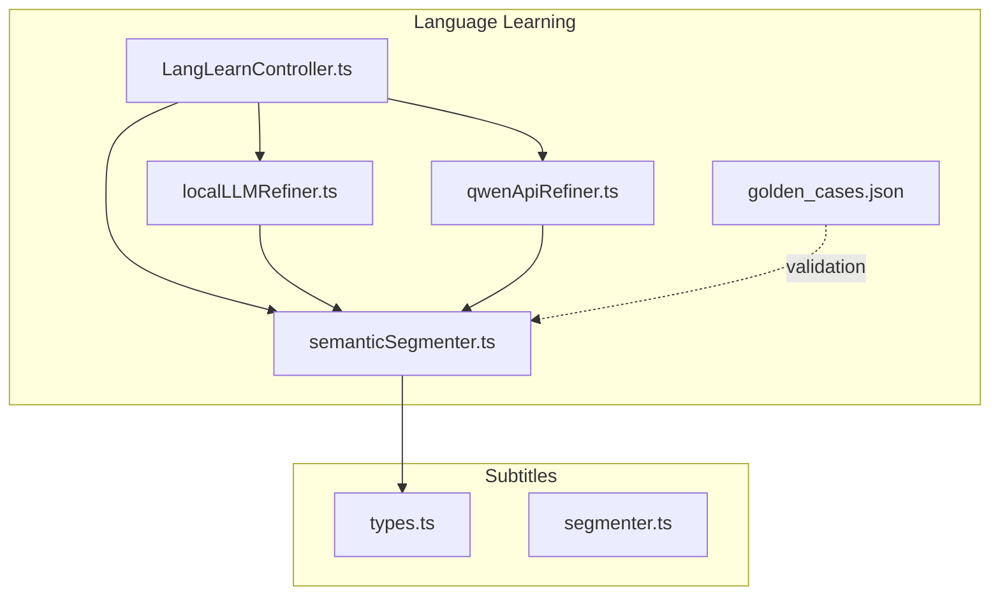
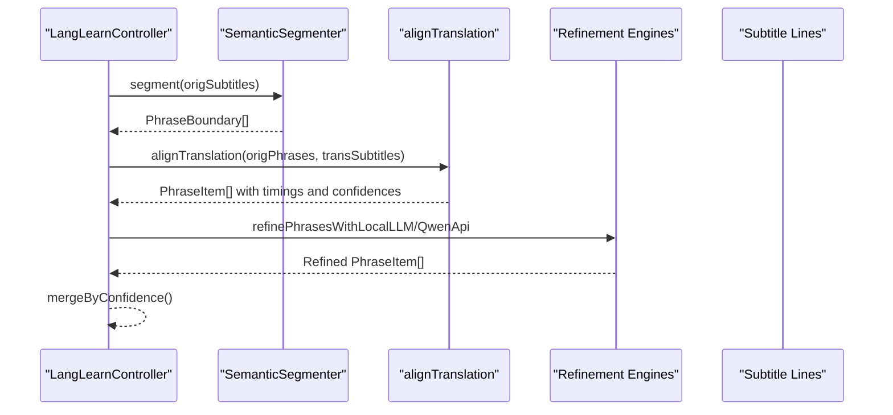
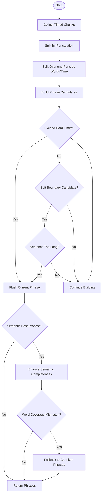
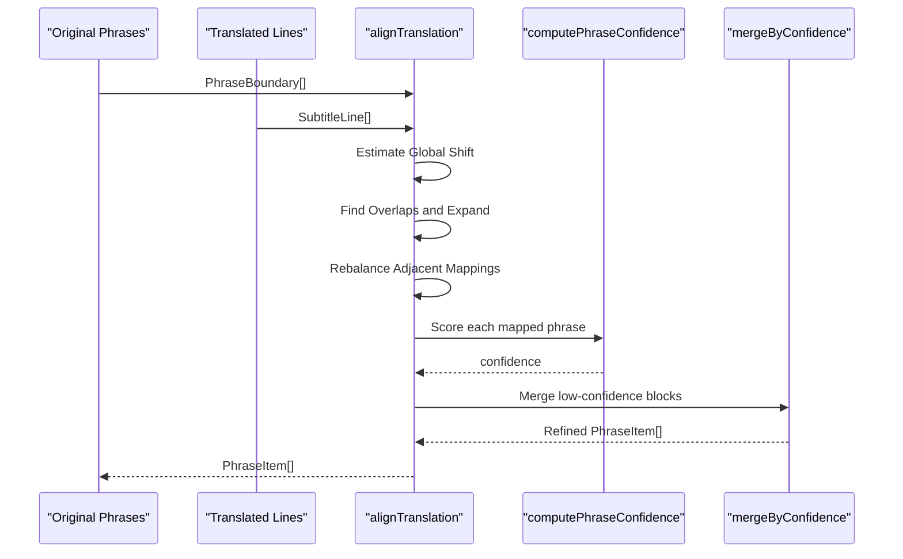
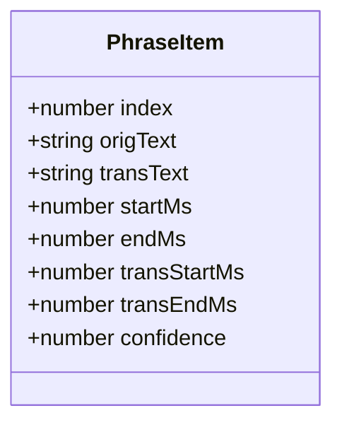
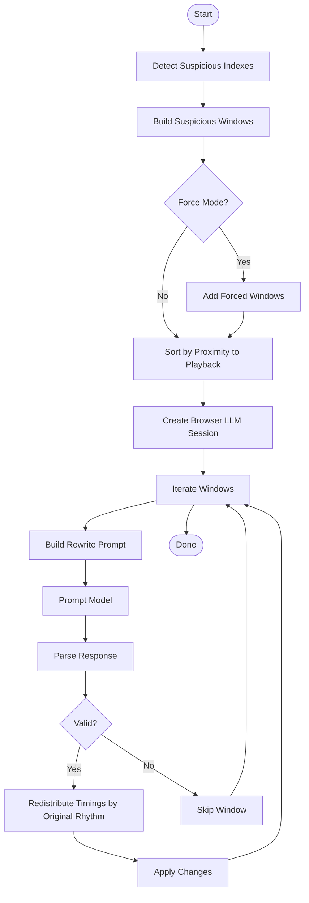
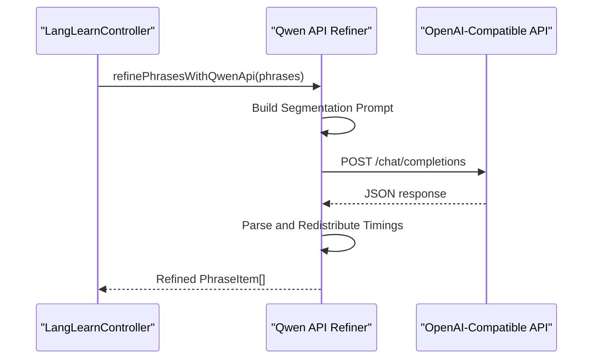
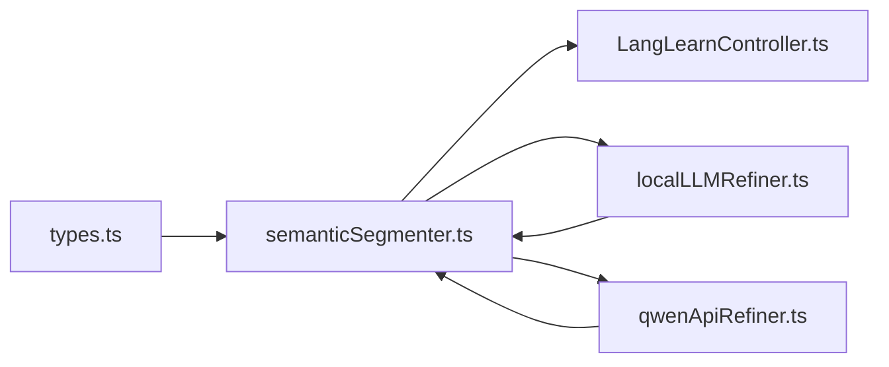

# Phrase Segmentation Engine

<cite>
**Referenced Files in This Document**
- [semanticSegmenter.ts](file://src/langLearn/phraseSegmenter/semanticSegmenter.ts)
- [golden_cases.json](file://src/langLearn/phraseSegmenter/golden_cases.json)
- [localLLMRefiner.ts](file://src/langLearn/phraseSegmenter/localLLMRefiner.ts)
- [qwenApiRefiner.ts](file://src/langLearn/phraseSegmenter/qwenApiRefiner.ts)
- [segmenter.test.ts](file://src/langLearn/phraseSegmenter/segmenter.test.ts)
- [localLLMRefiner.test.ts](file://src/langLearn/phraseSegmenter/localLLMRefiner.test.ts)
- [types.ts](file://src/subtitles/types.ts)
- [segmenter.ts](file://src/subtitles/segmenter.ts)
- [LangLearnController.ts](file://src/langLearn/LangLearnController.ts)
</cite>

## Table of Contents
1. [Introduction](#introduction)
2. [Project Structure](#project-structure)
3. [Core Components](#core-components)
4. [Architecture Overview](#architecture-overview)
5. [Detailed Component Analysis](#detailed-component-analysis)
6. [Dependency Analysis](#dependency-analysis)
7. [Performance Considerations](#performance-considerations)
8. [Troubleshooting Guide](#troubleshooting-guide)
9. [Conclusion](#conclusion)
10. [Appendices](#appendices)

## Introduction
This document describes the phrase segmentation engine used in the language learning pipeline. It explains how raw subtitle lines are processed into meaningful phrase boundaries, how original and translated subtitles are aligned with confidence scoring and timing synchronization, and how the final phrase items are structured with timing properties, confidence scores, and text content. The documentation covers the segmentation workflow, edge cases, boundary detection algorithms, performance optimizations, and the golden cases dataset used for validation.

## Project Structure
The phrase segmentation engine resides under the language learning module and integrates with the broader subtitles processing pipeline. Key areas:
- Phrase segmentation and alignment logic
- Local and cloud-based refinement engines
- Golden cases dataset for validation
- Tests validating segmentation and alignment behavior
- Integration with the language learning controller

**Diagram sources**
- [LangLearnController.ts:91-203](file://src/langLearn/LangLearnController.ts#L91-L203)
- [semanticSegmenter.ts:626-728](file://src/langLearn/phraseSegmenter/semanticSegmenter.ts#L626-L728)
- [localLLMRefiner.ts:411-561](file://src/langLearn/phraseSegmenter/localLLMRefiner.ts#L411-L561)
- [qwenApiRefiner.ts:385-519](file://src/langLearn/phraseSegmenter/qwenApiRefiner.ts#L385-L519)
- [golden_cases.json:1-196](file://src/langLearn/phraseSegmenter/golden_cases.json#L1-L196)
- [types.ts:7-20](file://src/subtitles/types.ts#L7-L20)
- [segmenter.ts:68-88](file://src/subtitles/segmenter.ts#L68-L88)

**Section sources**
- [LangLearnController.ts:91-203](file://src/langLearn/LangLearnController.ts#L91-L203)
- [semanticSegmenter.ts:626-728](file://src/langLearn/phraseSegmenter/semanticSegmenter.ts#L626-L728)
- [localLLMRefiner.ts:411-561](file://src/langLearn/phraseSegmenter/localLLMRefiner.ts#L411-L561)
- [qwenApiRefiner.ts:385-519](file://src/langLearn/phraseSegmenter/qwenApiRefiner.ts#L385-L519)
- [golden_cases.json:1-196](file://src/langLearn/phraseSegmenter/golden_cases.json#L1-L196)
- [types.ts:7-20](file://src/subtitles/types.ts#L7-L20)
- [segmenter.ts:68-88](file://src/subtitles/segmenter.ts#L68-L88)

## Core Components
- PhraseBoundary: Minimal structure representing a timed segment with text and boundaries.
- PhraseItem: Full phrase item with original and translated text, timing bounds, and confidence.
- SemanticSegmenter: Orchestrates segmentation of original subtitles into phrase boundaries.
- alignTranslation: Aligns original phrase boundaries to translated subtitles with confidence computation.
- computePhraseConfidence: Scores alignment quality based on timing and word ratios.
- mergeByConfidence: Merges low-confidence phrase blocks into coherent bundles.
- rebalanceAdjacentMappedPhrases: Adjusts translation text splits to improve semantic fit.
- refinePhrasesWithLocalLLM: Uses a local WebGPU model to refine translations.
- refinePhrasesWithQwenApi: Uses a cloud API to optimize phrase segmentation and translation distribution.

**Section sources**
- [semanticSegmenter.ts:3-18](file://src/langLearn/phraseSegmenter/semanticSegmenter.ts#L3-L18)
- [semanticSegmenter.ts:730-745](file://src/langLearn/phraseSegmenter/semanticSegmenter.ts#L730-L745)
- [semanticSegmenter.ts:1059-1243](file://src/langLearn/phraseSegmenter/semanticSegmenter.ts#L1059-L1243)
- [semanticSegmenter.ts:1245-1304](file://src/langLearn/phraseSegmenter/semanticSegmenter.ts#L1245-L1304)
- [semanticSegmenter.ts:1306-1487](file://src/langLearn/phraseSegmenter/semanticSegmenter.ts#L1306-L1487)
- [semanticSegmenter.ts:939-1057](file://src/langLearn/phraseSegmenter/semanticSegmenter.ts#L939-L1057)
- [localLLMRefiner.ts:411-561](file://src/langLearn/phraseSegmenter/localLLMRefiner.ts#L411-L561)
- [qwenApiRefiner.ts:385-519](file://src/langLearn/phraseSegmenter/qwenApiRefiner.ts#L385-L519)

## Architecture Overview
The engine processes raw subtitle input through a multi-stage pipeline:
1. Collect timed chunks from original subtitles (tokens or fallback text).
2. Segment by punctuation and enforce hard/soft boundaries.
3. Enforce semantic completeness to avoid incomplete phrases.
4. Align original phrase boundaries to translated subtitles.
5. Compute confidence scores and rebalance adjacent mappings.
6. Optionally refine with local or cloud-based models.
7. Merge low-confidence blocks into bundles.

**Diagram sources**
- [LangLearnController.ts:91-203](file://src/langLearn/LangLearnController.ts#L91-L203)
- [semanticSegmenter.ts:740-744](file://src/langLearn/phraseSegmenter/semanticSegmenter.ts#L740-L744)
- [semanticSegmenter.ts:1059-1243](file://src/langLearn/phraseSegmenter/semanticSegmenter.ts#L1059-L1243)
- [localLLMRefiner.ts:411-561](file://src/langLearn/phraseSegmenter/localLLMRefiner.ts#L411-L561)
- [qwenApiRefiner.ts:385-519](file://src/langLearn/phraseSegmenter/qwenApiRefiner.ts#L385-L519)

## Detailed Component Analysis

### Semantic Segmentation Pipeline
The segmentation pipeline transforms raw subtitle lines into phrase boundaries using punctuation, timing gaps, and semantic heuristics.

**Diagram sources**
- [semanticSegmenter.ts:626-728](file://src/langLearn/phraseSegmenter/semanticSegmenter.ts#L626-L728)
- [semanticSegmenter.ts:569-591](file://src/langLearn/phraseSegmenter/semanticSegmenter.ts#L569-L591)
- [semanticSegmenter.ts:612-620](file://src/langLearn/phraseSegmenter/semanticSegmenter.ts#L612-L620)

Key behaviors:
- Hard limits: maximum words and duration define phrase boundaries.
- Soft boundaries: punctuation and logical connectors guide splitting.
- Overlong parts: split by words or time slices to meet duration constraints.
- Semantic completeness: merges incomplete tails and brackets to preserve meaning.

**Section sources**
- [semanticSegmenter.ts:626-728](file://src/langLearn/phraseSegmenter/semanticSegmenter.ts#L626-L728)
- [semanticSegmenter.ts:569-591](file://src/langLearn/phraseSegmenter/semanticSegmenter.ts#L569-L591)
- [semanticSegmenter.ts:612-620](file://src/langLearn/phraseSegmenter/semanticSegmenter.ts#L612-L620)

### Alignment and Confidence Scoring
The alignment process maps original phrase boundaries to translated subtitles, computes confidence, and rebalances adjacent mappings.

**Diagram sources**
- [semanticSegmenter.ts:1059-1243](file://src/langLearn/phraseSegmenter/semanticSegmenter.ts#L1059-L1243)
- [semanticSegmenter.ts:1245-1304](file://src/langLearn/phraseSegmenter/semanticSegmenter.ts#L1245-L1304)
- [semanticSegmenter.ts:1306-1487](file://src/langLearn/phraseSegmenter/semanticSegmenter.ts#L1306-L1487)

Highlights:
- Global shift estimation improves temporal alignment.
- Overlap scanning expands matched segments when appropriate.
- Rebalancing splits combined translation text by logical units to match original rhythms.
- Confidence scoring penalizes timing/word mismatches and incomplete tails.

**Section sources**
- [semanticSegmenter.ts:1059-1243](file://src/langLearn/phraseSegmenter/semanticSegmenter.ts#L1059-L1243)
- [semanticSegmenter.ts:1245-1304](file://src/langLearn/phraseSegmenter/semanticSegmenter.ts#L1245-L1304)
- [semanticSegmenter.ts:1306-1487](file://src/langLearn/phraseSegmenter/semanticSegmenter.ts#L1306-L1487)

### Phrase Item Structure
PhraseItem encapsulates the final aligned phrase with timing and quality metrics.

Properties:
- index: sequential identifier within the aligned sequence.
- origText/transText: normalized text for original and translation.
- startMs/endMs: original subtitle timing bounds.
- transStartMs/transEndMs: translated subtitle timing bounds.
- confidence: numeric score indicating alignment quality.

**Diagram sources**
- [semanticSegmenter.ts:9-18](file://src/langLearn/phraseSegmenter/semanticSegmenter.ts#L9-L18)

**Section sources**
- [semanticSegmenter.ts:9-18](file://src/langLearn/phraseSegmenter/semanticSegmenter.ts#L9-L18)

### Local LLM Refinement
The local refinement engine detects suspicious phrase pairs and redistributes translation text across segments using a WebGPU-accelerated model.

**Diagram sources**
- [localLLMRefiner.ts:411-561](file://src/langLearn/phraseSegmenter/localLLMRefiner.ts#L411-L561)
- [localLLMRefiner.ts:256-305](file://src/langLearn/phraseSegmenter/localLLMRefiner.ts#L256-L305)
- [localLLMRefiner.ts:373-409](file://src/langLearn/phraseSegmenter/localLLMRefiner.ts#L373-L409)

Key behaviors:
- Suspicious detection flags mismatched timing/word counts and incomplete tails.
- Window building clusters nearby phrases to reduce overhead.
- Prompt-based rewriting preserves all words while redistributing meaningfully.
- Timing redistribution maintains original rhythm across segments.

**Section sources**
- [localLLMRefiner.ts:411-561](file://src/langLearn/phraseSegmenter/localLLMRefiner.ts#L411-L561)
- [localLLMRefiner.ts:256-305](file://src/langLearn/phraseSegmenter/localLLMRefiner.ts#L256-L305)
- [localLLMRefiner.ts:373-409](file://src/langLearn/phraseSegmenter/localLLMRefiner.ts#L373-L409)

### Cloud API Refinement
The cloud refinement uses a Qwen-compatible API to optimize phrase segmentation and translation distribution.

**Diagram sources**
- [qwenApiRefiner.ts:385-519](file://src/langLearn/phraseSegmenter/qwenApiRefiner.ts#L385-L519)
- [qwenApiRefiner.ts:259-322](file://src/langLearn/phraseSegmenter/qwenApiRefiner.ts#L259-L322)

**Section sources**
- [qwenApiRefiner.ts:385-519](file://src/langLearn/phraseSegmenter/qwenApiRefiner.ts#L385-L519)
- [qwenApiRefiner.ts:259-322](file://src/langLearn/phraseSegmenter/qwenApiRefiner.ts#L259-L322)

### Golden Cases Dataset and Validation
The golden_cases dataset provides curated examples of challenging segmentation scenarios for validation.

Examples covered:
- Merging short-to-long translation mismatches.
- Question spillover across phrases.
- Real TED Talk sequences testing continuous segmentation.

Validation methodology:
- Unit tests assert expected phrase boundaries and alignments.
- Confidence scoring tests validate penalties for mismatches.
- Suspicious window detection validates clustering logic.

**Section sources**
- [golden_cases.json:1-196](file://src/langLearn/phraseSegmenter/golden_cases.json#L1-L196)
- [segmenter.test.ts:6-381](file://src/langLearn/phraseSegmenter/segmenter.test.ts#L6-L381)
- [localLLMRefiner.test.ts:15-49](file://src/langLearn/phraseSegmenter/localLLMRefiner.test.ts#L15-L49)

## Dependency Analysis
The phrase segmentation engine depends on subtitle types and integrates with the language learning controller and refinement engines.

**Diagram sources**
- [types.ts:7-20](file://src/subtitles/types.ts#L7-L20)
- [semanticSegmenter.ts:626-728](file://src/langLearn/phraseSegmenter/semanticSegmenter.ts#L626-L728)
- [LangLearnController.ts:91-203](file://src/langLearn/LangLearnController.ts#L91-L203)
- [localLLMRefiner.ts:411-561](file://src/langLearn/phraseSegmenter/localLLMRefiner.ts#L411-L561)
- [qwenApiRefiner.ts:385-519](file://src/langLearn/phraseSegmenter/qwenApiRefiner.ts#L385-L519)

**Section sources**
- [types.ts:7-20](file://src/subtitles/types.ts#L7-L20)
- [semanticSegmenter.ts:626-728](file://src/langLearn/phraseSegmenter/semanticSegmenter.ts#L626-L728)
- [LangLearnController.ts:91-203](file://src/langLearn/LangLearnController.ts#L91-L203)
- [localLLMRefiner.ts:411-561](file://src/langLearn/phraseSegmenter/localLLMRefiner.ts#L411-L561)
- [qwenApiRefiner.ts:385-519](file://src/langLearn/phraseSegmenter/qwenApiRefiner.ts#L385-L519)

## Performance Considerations
- Chunk-based processing: Large phrases are split into manageable timed chunks to avoid exceeding duration thresholds.
- Binary search for nearest translation: Efficiently locates candidate segments using center timestamps.
- Window-based refinement: Limits model calls to suspicious or nearby windows to reduce latency.
- Weighted timing redistribution: Maintains original rhythm when rebalancing translation text.
- Early exits: Short-circuits when no usable tokens or text are present.

[No sources needed since this section provides general guidance]

## Troubleshooting Guide
Common issues and resolutions:
- Empty translation: Confidence drops to zero; consider fallback to chunked phrases.
- Timing overflow: Excessive translation duration relative to original reduces confidence; rebalancing or merging may help.
- Incomplete tails: Missing terminal punctuation in translation lowers confidence; the engine attempts to merge or split accordingly.
- Suspicious windows not applied: Invalid model responses or timeouts cause skipping; retry or switch to local refinement.
- API connectivity: Missing API key or network errors fall back to original phrases; verify configuration.

**Section sources**
- [semanticSegmenter.ts:1245-1304](file://src/langLearn/phraseSegmenter/semanticSegmenter.ts#L1245-L1304)
- [localLLMRefiner.ts:411-561](file://src/langLearn/phraseSegmenter/localLLMRefiner.ts#L411-L561)
- [qwenApiRefiner.ts:385-519](file://src/langLearn/phraseSegmenter/qwenApiRefiner.ts#L385-L519)

## Conclusion
The phrase segmentation engine combines robust punctuation-based segmentation, semantic completeness enforcement, precise alignment with confidence scoring, and optional refinement via local or cloud-based models. It ensures that learners receive coherent, well-timed phrase pairs that preserve meaning and support effective language acquisition.

[No sources needed since this section summarizes without analyzing specific files]

## Appendices

### Edge Cases and Boundary Detection
- Long phrases without punctuation: Split into timed slices respecting duration caps.
- Soft boundaries: Commas and semicolons guide logical splits when sentence length exceeds thresholds.
- Hard pauses: Significant gaps between tokens trigger forced splits.
- Unclosed brackets: Prevent premature phrase termination by merging incomplete segments.
- Question endings: Incomplete question markers are merged to preserve completeness.

**Section sources**
- [semanticSegmenter.ts:287-319](file://src/langLearn/phraseSegmenter/semanticSegmenter.ts#L287-L319)
- [semanticSegmenter.ts:683-713](file://src/langLearn/phraseSegmenter/semanticSegmenter.ts#L683-L713)
- [semanticSegmenter.ts:522-567](file://src/langLearn/phraseSegmenter/semanticSegmenter.ts#L522-L567)
- [semanticSegmenter.ts:140-152](file://src/langLearn/phraseSegmenter/semanticSegmenter.ts#L140-L152)

### Validation Methodology
- Unit tests cover sentence splitting, long pauses, logical boundaries, and fallback checks.
- Confidence scoring tests validate penalties for timing/word mismatches.
- Suspicious window tests validate clustering and window construction.

**Section sources**
- [segmenter.test.ts:6-381](file://src/langLearn/phraseSegmenter/segmenter.test.ts#L6-L381)
- [localLLMRefiner.test.ts:15-49](file://src/langLearn/phraseSegmenter/localLLMRefiner.test.ts#L15-L49)