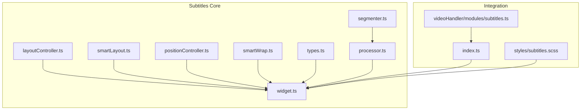
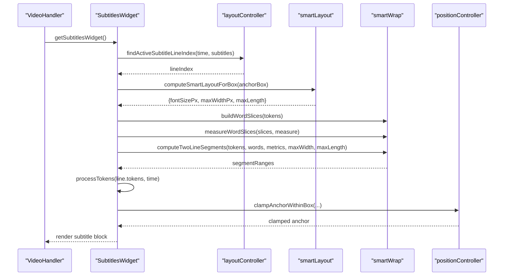
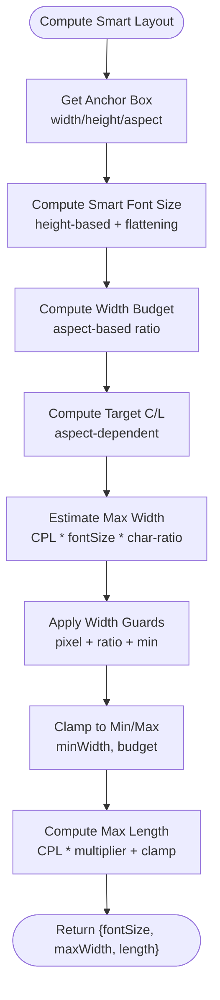
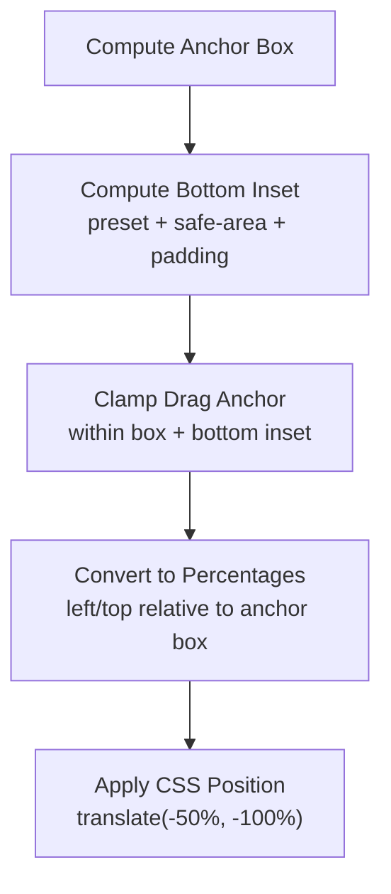
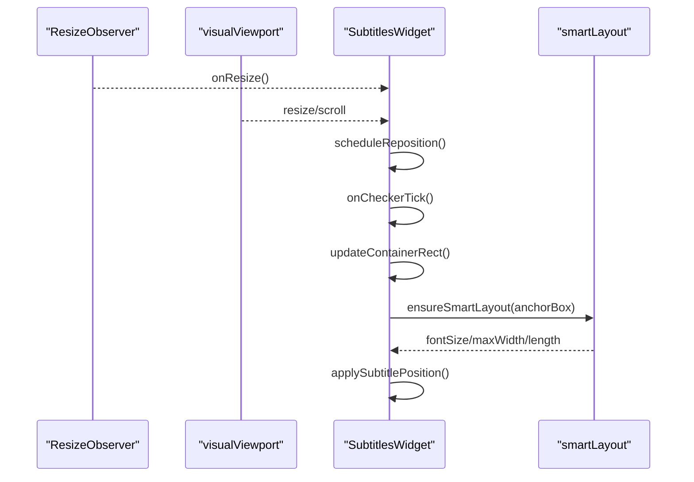
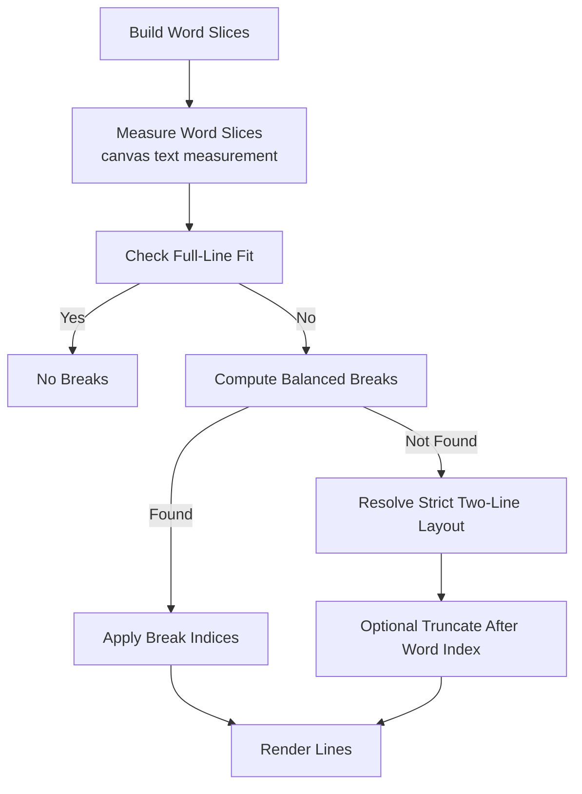
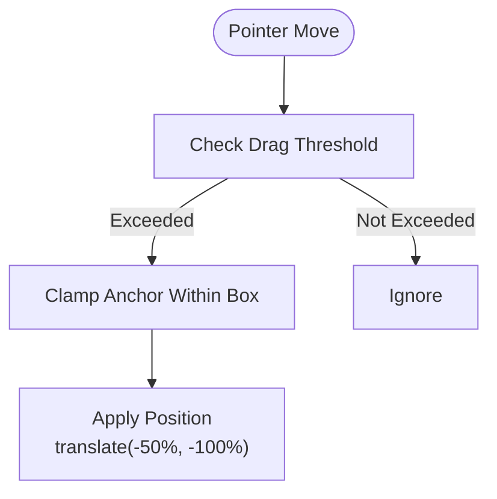
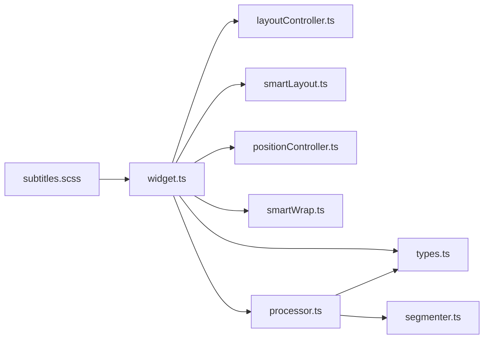

# Layout Controller

<cite>
**Referenced Files in This Document**
- [layoutController.ts](file://src/subtitles/layoutController.ts)
- [smartLayout.ts](file://src/subtitles/smartLayout.ts)
- [positionController.ts](file://src/subtitles/positionController.ts)
- [smartWrap.ts](file://src/subtitles/smartWrap.ts)
- [widget.ts](file://src/subtitles/widget.ts)
- [types.ts](file://src/subtitles/types.ts)
- [processor.ts](file://src/subtitles/processor.ts)
- [segmenter.ts](file://src/subtitles/segmenter.ts)
- [subtitles.scss](file://src/styles/subtitles.scss)
- [index.ts](file://src/index.ts)
- [subtitles.ts](file://src/videoHandler/modules/subtitles.ts)
</cite>

## Table of Contents
1. [Introduction](#introduction)
2. [Project Structure](#project-structure)
3. [Core Components](#core-components)
4. [Architecture Overview](#architecture-overview)
5. [Detailed Component Analysis](#detailed-component-analysis)
6. [Dependency Analysis](#dependency-analysis)
7. [Performance Considerations](#performance-considerations)
8. [Troubleshooting Guide](#troubleshooting-guide)
9. [Conclusion](#conclusion)

## Introduction
This document describes the subtitle layout management system, focusing on the smart layout engine that automatically positions subtitles to avoid collisions with video content and other UI elements. It explains collision avoidance algorithms, adaptive positioning strategies across screen sizes and aspect ratios, the intelligent wrapping system that adjusts text width and line breaks, and the position controller that handles manual positioning overrides and user preferences. Examples illustrate behavior across different video resolutions, subtitle lengths, and screen orientations, along with performance considerations for real-time layout calculations and smooth transitions.

## Project Structure
The layout system resides primarily under the src/subtitles/ directory and integrates with the broader VideoHandler infrastructure in src/index.ts and videoHandler modules.

**Diagram sources**
- [widget.ts:110-1738](file://src/subtitles/widget.ts#L110-L1738)
- [layoutController.ts:1-37](file://src/subtitles/layoutController.ts#L1-37)
- [smartLayout.ts:1-138](file://src/subtitles/smartLayout.ts#L1-138)
- [positionController.ts:1-58](file://src/subtitles/positionController.ts#L1-58)
- [smartWrap.ts:1-670](file://src/subtitles/smartWrap.ts#L1-670)
- [types.ts:1-52](file://src/subtitles/types.ts#L1-52)
- [processor.ts:1-878](file://src/subtitles/processor.ts#L1-878)
- [segmenter.ts:1-89](file://src/subtitles/segmenter.ts#L1-89)
- [index.ts:526-566](file://src/index.ts#L526-566)
- [subtitles.ts:1-492](file://src/videoHandler/modules/subtitles.ts#L1-492)
- [subtitles.scss:1-215](file://src/styles/subtitles.scss#L1-215)

**Section sources**
- [widget.ts:110-1738](file://src/subtitles/widget.ts#L110-L1738)
- [index.ts:526-566](file://src/index.ts#L526-566)
- [subtitles.ts:1-492](file://src/videoHandler/modules/subtitles.ts#L1-492)

## Core Components
- Layout controller: time-based line selection and layout key composition for caching.
- Smart layout: computes font size, max width, and line length based on anchor box and aspect ratio.
- Position controller: clamps draggable anchors within safe bounds and insets.
- Smart wrap: measures and segments text into two-line layouts with balanced breaks and optional truncation.
- Widget: orchestrates layout, wrapping, rendering, and user interactions; integrates with CSS variables and responsive design.

**Section sources**
- [layoutController.ts:1-37](file://src/subtitles/layoutController.ts#L1-37)
- [smartLayout.ts:1-138](file://src/subtitles/smartLayout.ts#L1-138)
- [positionController.ts:1-58](file://src/subtitles/positionController.ts#L1-58)
- [smartWrap.ts:1-670](file://src/subtitles/smartWrap.ts#L1-670)
- [widget.ts:110-1738](file://src/subtitles/widget.ts#L110-L1738)

## Architecture Overview
The SubtitlesWidget coordinates layout decisions, wrapping, and rendering. It queries the active subtitle line, computes smart layout parameters, measures text width, segments into lines, applies position constraints, and renders tokens with optional smart ellipsis.

**Diagram sources**
- [widget.ts:1579-1716](file://src/subtitles/widget.ts#L1579-L1716)
- [layoutController.ts:7-28](file://src/subtitles/layoutController.ts#L7-L28)
- [smartLayout.ts:105-137](file://src/subtitles/smartLayout.ts#L105-L137)
- [smartWrap.ts:81-137](file://src/subtitles/smartWrap.ts#L81-L137)
- [smartWrap.ts:139-178](file://src/subtitles/smartWrap.ts#L139-L178)
- [smartWrap.ts:631-657](file://src/subtitles/smartWrap.ts#L631-L657)
- [positionController.ts:27-57](file://src/subtitles/positionController.ts#L27-L57)

## Detailed Component Analysis

### Smart Layout Engine
The smart layout engine computes font size, maximum width, and line length based on the anchor box (intersection of video and container) and aspect ratio. It enforces width guards and caps to prevent overly wide or narrow captions.

Key behaviors:
- Aspect-aware target characters-per-line and maximum width ratio.
- Height-based font scaling with flattening above reference resolution.
- Width guardrail ensuring target line length fits within budget.
- Minimum width enforcement to avoid tall narrow blocks.
- Length bound for time-based segmentation.

**Diagram sources**
- [smartLayout.ts:105-137](file://src/subtitles/smartLayout.ts#L105-L137)

**Section sources**
- [smartLayout.ts:18-137](file://src/subtitles/smartLayout.ts#L18-L137)

### Collision Detection and Positioning Strategies
The system avoids collisions by:
- Computing an anchor box representing the video region within the container.
- Determining a reserved bottom inset based on fullscreen mode, safe area, and container padding.
- Clamping the draggable anchor within the anchor box while respecting the bottom inset.
- Applying CSS transforms and scale compensation to maintain readability across zoom/transformed players.

**Diagram sources**
- [widget.ts:265-295](file://src/subtitles/widget.ts#L265-L295)
- [widget.ts:570-615](file://src/subtitles/widget.ts#L570-L615)
- [widget.ts:718-793](file://src/subtitles/widget.ts#L718-L793)
- [positionController.ts:27-57](file://src/subtitles/positionController.ts#L27-L57)

**Section sources**
- [widget.ts:265-295](file://src/subtitles/widget.ts#L265-L295)
- [widget.ts:570-615](file://src/subtitles/widget.ts#L570-L615)
- [widget.ts:718-793](file://src/subtitles/widget.ts#L718-L793)
- [positionController.ts:17-57](file://src/subtitles/positionController.ts#L17-L57)

### Adaptive Positioning System
Adaptive positioning responds to:
- Container and video geometry changes via ResizeObserver and visual viewport events.
- Playback state changes to trigger repositioning.
- Smart layout recomputation at intervals to adapt to changing anchor boxes.
- Safe area probing for mobile and immersive modes.

**Diagram sources**
- [widget.ts:386-398](file://src/subtitles/widget.ts#L386-L398)
- [widget.ts:464-483](file://src/subtitles/widget.ts#L464-L483)
- [widget.ts:500-510](file://src/subtitles/widget.ts#L500-L510)
- [widget.ts:1618-1632](file://src/subtitles/widget.ts#L1618-L1632)
- [smartLayout.ts:105-137](file://src/subtitles/smartLayout.ts#L105-L137)

**Section sources**
- [widget.ts:386-398](file://src/subtitles/widget.ts#L386-L398)
- [widget.ts:464-483](file://src/subtitles/widget.ts#L464-L483)
- [widget.ts:500-510](file://src/subtitles/widget.ts#L500-L510)
- [widget.ts:1618-1632](file://src/subtitles/widget.ts#L1618-L1632)

### Smart Wrapping System
The smart wrapping system builds word slices, measures widths, and computes two-line segments with balanced breaks. It supports:
- Word-range width/char counting with prefix sums.
- Two-line feasibility testing and best break scoring.
- Strict two-line fallback with truncation when needed.
- Guarded max width to prevent wrapping too close to edges.

**Diagram sources**
- [smartWrap.ts:81-137](file://src/subtitles/smartWrap.ts#L81-L137)
- [smartWrap.ts:139-178](file://src/subtitles/smartWrap.ts#L139-L178)
- [smartWrap.ts:228-255](file://src/subtitles/smartWrap.ts#L228-L255)
- [smartWrap.ts:298-353](file://src/subtitles/smartWrap.ts#L298-L353)
- [smartWrap.ts:380-436](file://src/subtitles/smartWrap.ts#L380-L436)
- [smartWrap.ts:631-657](file://src/subtitles/smartWrap.ts#L631-L657)

**Section sources**
- [smartWrap.ts:81-178](file://src/subtitles/smartWrap.ts#L81-L178)
- [smartWrap.ts:228-436](file://src/subtitles/smartWrap.ts#L228-L436)
- [smartWrap.ts:631-670](file://src/subtitles/smartWrap.ts#L631-L670)

### Position Controller (Manual Overrides)
The position controller exposes:
- Threshold-based drag activation to avoid accidental drags.
- Clamping logic to constrain anchors within the anchor box and bottom inset.
- Utility to clamp values to a range.

**Diagram sources**
- [positionController.ts:5-15](file://src/subtitles/positionController.ts#L5-L15)
- [positionController.ts:27-57](file://src/subtitles/positionController.ts#L27-L57)
- [widget.ts:668-717](file://src/subtitles/widget.ts#L668-L717)

**Section sources**
- [positionController.ts:1-58](file://src/subtitles/positionController.ts#L1-L58)
- [widget.ts:616-717](file://src/subtitles/widget.ts#L616-L717)

### Layout Behavior Examples
- Different video resolutions: Smart layout scales font and max width with height, flattening growth above reference resolution.
- Long subtitles: Smart wrapping balances line lengths and applies truncation with ellipsis when needed.
- Portrait vs landscape: Character-per-line targets and width budgets adapt to aspect ratios.
- Mobile/fullscreen: Bottom inset presets adjust for immersive modes and safe areas.

**Section sources**
- [smartLayout.ts:28-57](file://src/subtitles/smartLayout.ts#L28-L57)
- [smartLayout.ts:105-137](file://src/subtitles/smartLayout.ts#L105-L137)
- [smartWrap.ts:380-436](file://src/subtitles/smartWrap.ts#L380-L436)
- [widget.ts:544-615](file://src/subtitles/widget.ts#L544-L615)

## Dependency Analysis
The SubtitlesWidget depends on layout utilities, wrapping algorithms, and CSS variables. The processor and segmenter prepare tokenized subtitles for layout.

**Diagram sources**
- [widget.ts:14-31](file://src/subtitles/widget.ts#L14-L31)
- [processor.ts:1-26](file://src/subtitles/processor.ts#L1-L26)
- [segmenter.ts:1-89](file://src/subtitles/segmenter.ts#L1-L89)
- [subtitles.scss:1-215](file://src/styles/subtitles.scss#L1-L215)

**Section sources**
- [widget.ts:14-31](file://src/subtitles/widget.ts#L14-L31)
- [processor.ts:1-26](file://src/subtitles/processor.ts#L1-L26)
- [segmenter.ts:1-89](file://src/subtitles/segmenter.ts#L1-L89)
- [subtitles.scss:1-215](file://src/styles/subtitles.scss#L1-L215)

## Performance Considerations
- Minimize layout recalculations: The widget throttles updates using an interval idle checker and minimum intervals for highlight updates.
- Efficient text measurement: Canvas-based measurement with memoization by font key and max width.
- Smart layout caching: Keys derived from anchor box and layout parameters prevent redundant computations.
- Wrap recomputation scheduling: Changes to font, width, or tokens schedule recomputation only when needed.
- Real-time responsiveness: Uses requestVideoFrameCallback when available to align updates with frames.

Practical tips:
- Keep font and width changes infrequent; batch updates when possible.
- Prefer smart layout for dynamic resizing; disable manual font size unless necessary.
- Avoid excessive truncation; rely on balanced wrapping for readability.

**Section sources**
- [widget.ts:400-413](file://src/subtitles/widget.ts#L400-L413)
- [widget.ts:936-967](file://src/subtitles/widget.ts#L936-L967)
- [widget.ts:1327-1336](file://src/subtitles/widget.ts#L1327-L1336)
- [widget.ts:423-463](file://src/subtitles/widget.ts#L423-L463)

## Troubleshooting Guide
Common issues and remedies:
- Subtitles overlap video content:
  - Verify anchor box calculation and bottom inset adjustments.
  - Ensure clampAnchorWithinBox is applied after pointer moves.
- Text wraps unexpectedly:
  - Adjust smart layout max width or disable smart layout to use manual font size.
  - Review guarded max width and prefix width calculations.
- Draggable subtitle does not move:
  - Confirm drag threshold is exceeded and pointer capture succeeds.
  - Check that bottom inset and container dimensions are valid.
- Position flickers or jumps:
  - Ensure visual viewport listeners are attached and reposition scheduled on changes.
  - Verify CSS scale compensation is applied when transforms are present.

**Section sources**
- [widget.ts:616-717](file://src/subtitles/widget.ts#L616-L717)
- [widget.ts:718-793](file://src/subtitles/widget.ts#L718-L793)
- [widget.ts:386-398](file://src/subtitles/widget.ts#L386-L398)
- [widget.ts:464-483](file://src/subtitles/widget.ts#L464-L483)
- [positionController.ts:27-57](file://src/subtitles/positionController.ts#L27-L57)

## Conclusion
The subtitle layout system combines smart layout computation, robust wrapping, and adaptive positioning to deliver readable, collision-free subtitles across diverse video and UI contexts. Its modular design, efficient caching, and responsive updates ensure smooth performance during playback and user interaction.